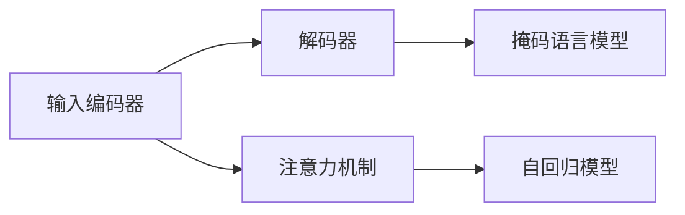

                 

# 大语言模型应用指南：Transformer解码器详解

> 关键词：大语言模型,Transformer,解码器,自回归模型,注意力机制,自编码模型,掩码语言模型,自然语言处理(NLP),深度学习,神经网络

## 1. 背景介绍

### 1.1 问题由来
Transformer及其衍生模型，如BERT、GPT等，以其卓越的语言理解能力和生成能力，迅速成为自然语言处理(NLP)领域的热门技术。这些模型之所以能够取得如此显著的效果，关键在于其先进的设计和巧妙的计算架构。其中，Transformer的解码器是实现这一目标的核心组件，其解码机制和计算方法的研究也成为了NLP领域的热点问题。

本文旨在深入解析Transformer解码器的原理与实现，探讨其在各类NLP任务中的表现和应用，帮助读者全面理解Transformer解码器的精髓，从而更好地利用其强大的语言处理能力。

## 2. 核心概念与联系

### 2.1 核心概念概述

Transformer解码器是Transformer架构的重要组成部分，主要负责生成序列数据。与传统的循环神经网络(RNN)和卷积神经网络(CNN)相比，Transformer在处理长序列数据时具有明显的优势，能够有效地解决梯度消失和截断问题。

Transformer解码器采用自回归模型，并结合注意力机制，通过并行计算实现了高效的序列生成。其核心模块包括：

- **输入编码器(Encoder)**：将输入序列转换为高维表示。
- **解码器(Decoder)**：将高维表示转换为生成序列。
- **注意力机制(Attention Mechanism)**：帮助解码器在生成序列时，关注与当前时间步相关的上下文信息。
- **掩码语言模型(Masked Language Model, MLM)**：通过掩码掉部分信息，使模型能够更好地理解掩码区域的语境信息。

### 2.2 概念间的关系

这些核心概念之间存在紧密的联系，共同构成了Transformer解码器的运作框架。通过注意力机制，解码器能够捕捉输入序列中的长期依赖关系；通过掩码语言模型，模型可以学习到更加丰富的语义信息；自回归模型则保证了生成的序列符合自然语言规律。这些设计使得Transformer解码器在处理语言生成任务时，具有出色的效果和灵活性。

以下是一个简化的Mermaid流程图，展示了这些核心概念的交互关系：



这个流程图展示了输入编码器、解码器、注意力机制和掩码语言模型之间的交互关系。输入编码器将输入序列转换为高维表示，解码器根据注意力机制和自回归模型生成序列。掩码语言模型则在注意力机制的基础上，进一步提升了模型的语义理解能力。

## 3. 核心算法原理 & 具体操作步骤
### 3.1 算法原理概述

Transformer解码器的主要算法原理基于自回归模型和注意力机制。其核心思想是通过并行计算，在每次时间步（即解码器中的每个步骤），计算当前时间步的输出，并利用前一个时间步的输出作为上下文信息，从而实现序列的生成。

解码器的输出遵循自回归模型，即当前时间步的输出只依赖于前一个时间步的输出。这种设计能够避免长序列训练中的梯度消失问题，同时保证生成的序列在语法和语义上连贯。

### 3.2 算法步骤详解

Transformer解码器的具体算法步骤如下：

1. **输入编码器**：将输入序列转换为高维表示。

2. **解码器初始化**：将高维表示作为解码器的输入，并初始化解码器。

3. **注意力机制计算**：计算当前时间步的注意力权重，用于选择与当前时间步相关的上下文信息。

4. **生成当前时间步的输出**：根据自回归模型和注意力机制，计算当前时间步的输出。

5. **更新解码器状态**：将当前时间步的输出作为下一个时间步的输入，并更新解码器状态。

6. **重复步骤3-5，直到生成完整序列**。

### 3.3 算法优缺点

Transformer解码器的优点在于：

- **并行计算**：由于不依赖时间步的顺序，可以高效利用GPU并行计算能力。
- **长序列处理能力**：能够处理任意长度的序列，而不会遇到梯度消失问题。
- **自回归模型**：生成的序列在语法和语义上连贯，易于理解和应用。

然而，Transformer解码器也存在一些缺点：

- **计算复杂度高**：解码器的计算复杂度随序列长度增加而增加。
- **参数量大**：由于使用了多个注意力头和自回归模型，参数量较大。
- **难以解释**：生成的序列缺乏可解释性，难以理解模型的决策过程。

### 3.4 算法应用领域

Transformer解码器广泛应用于各种NLP任务中，包括但不限于：

- **机器翻译**：将源语言序列转换为目标语言序列。
- **文本生成**：生成连贯、流畅的文本内容。
- **问答系统**：根据用户输入的文本，生成回答。
- **对话系统**：实现人机对话，生成响应。

此外，Transformer解码器还被用于多模态任务中，如图像生成、视频描述生成等，展示了其强大的通用性和适应性。

## 4. 数学模型和公式 & 详细讲解
### 4.1 数学模型构建

Transformer解码器的数学模型构建，主要依赖于注意力机制和自回归模型。以下是对这两个核心组件的详细讲解。

#### 4.1.1 注意力机制

Transformer解码器中的注意力机制主要通过计算注意力权重，选择与当前时间步相关的上下文信息。假设输入序列为 $X=\{x_1, x_2, ..., x_T\}$，目标序列为 $Y=\{y_1, y_2, ..., y_T\}$，解码器状态为 $H_t$，注意力权重为 $A_t$，当前时间步的目标表示为 $Q_t$，上下文表示为 $K_t$，价值表示为 $V_t$。

注意力权重 $A_t$ 通过计算目标表示 $Q_t$ 与上下文表示 $K_t$ 和 $V_t$ 的点积，并经过softmax函数归一化得到。具体公式如下：

$$
A_t = \frac{e^{Q_t^T K_t}}{Z_t} \quad \text{其中} \quad Z_t = \sum_{k=1}^T e^{Q_t^T K_k}
$$

注意力权重 $A_t$ 表示当前时间步对不同位置信息的关注程度，用于选择最相关的上下文信息进行解码。

#### 4.1.2 自回归模型

Transformer解码器的自回归模型用于生成当前时间步的输出，主要依赖于上一个时间步的输出 $y_{t-1}$。假设当前时间步的输入表示为 $y_t$，解码器状态为 $H_t$，自回归模型可以表示为：

$$
y_t = \text{softmax}(Q_t^T H_{t-1})
$$

其中，$Q_t$ 为当前时间步的查询向量，$H_{t-1}$ 为上一个时间步的输出表示，$\text{softmax}$ 函数用于将查询向量转换为概率分布，选择最可能的输出。

### 4.2 公式推导过程

Transformer解码器的计算过程可以分为以下几个步骤：

1. **计算注意力权重**：根据注意力机制，计算当前时间步的注意力权重 $A_t$。

2. **加权求和**：根据注意力权重 $A_t$，对上下文表示 $K_t$ 和 $V_t$ 进行加权求和，得到当前时间步的上下文表示 $C_t$。

3. **计算解码器状态**：根据解码器状态 $H_{t-1}$ 和上下文表示 $C_t$，计算当前时间步的解码器状态 $H_t$。

4. **生成输出**：根据自回归模型，计算当前时间步的输出 $y_t$。

5. **更新解码器状态**：将当前时间步的输出 $y_t$ 作为下一个时间步的输入，并更新解码器状态 $H_t$。

### 4.3 案例分析与讲解

以机器翻译任务为例，解释Transformer解码器的计算过程：

1. **输入编码器**：将输入序列转换为高维表示 $H_0$。

2. **解码器初始化**：将高维表示 $H_0$ 作为解码器的初始状态 $H_1$。

3. **注意力机制计算**：根据当前时间步的解码器状态 $H_t$ 和编码器输出 $H_t'$，计算注意力权重 $A_t$。

4. **生成当前时间步的输出**：根据自回归模型和注意力权重，计算当前时间步的输出 $y_t$。

5. **更新解码器状态**：将当前时间步的输出 $y_t$ 作为下一个时间步的输入，并更新解码器状态 $H_{t+1}$。

6. **重复步骤3-5，直到生成完整目标序列 $Y$。

## 5. 项目实践：代码实例和详细解释说明
### 5.1 开发环境搭建

在Python中，可以使用TensorFlow或PyTorch等深度学习框架来构建Transformer解码器。以下是一个简单的示例，演示如何使用PyTorch构建Transformer解码器：

1. 安装PyTorch：

```bash
pip install torch torchvision torchaudio
```

2. 安装Transformer库：

```bash
pip install transformers
```

3. 准备数据集：

```python
import torch
from torch.utils.data import Dataset, DataLoader

class MyDataset(Dataset):
    def __init__(self, data):
        self.data = data
        
    def __len__(self):
        return len(self.data)
        
    def __getitem__(self, index):
        return torch.tensor(self.data[index])
        
dataset = MyDataset([input_sequence, target_sequence])
dataloader = DataLoader(dataset, batch_size=16)
```

### 5.2 源代码详细实现

以下是一个基于Transformer的解码器实现示例：

```python
import torch.nn as nn
import torch
from transformers import BertModel, BertTokenizer

class TransformerDecoder(nn.Module):
    def __init__(self, n_heads, d_model, d_k, d_v, d_ff, dropout, n_layers):
        super(TransformerDecoder, self).__init__()
        self.attention = MultiHeadAttention(n_heads, d_model, d_k, d_v)
        self.ffn = PositionwiseFeedForward(d_model, d_ff, dropout)
        self.layernorm1 = nn.LayerNorm(d_model)
        self.layernorm2 = nn.LayerNorm(d_model)
        self.dropout = nn.Dropout(dropout)
        
    def forward(self, input, encoder_outputs):
        attn = self.attention(input, encoder_outputs, encoder_outputs)
        attn = self.dropout(attn)
        attn = self.layernorm1(attn)
        ffn = self.ffn(attn)
        ffn = self.dropout(ffn)
        ffn = self.layernorm2(ffn)
        return attn, ffn
```

在上述代码中，我们定义了一个TransformerDecoder模块，包含注意力机制和前馈神经网络。该模块接收输入和编码器输出，计算注意力权重和解码器状态，并生成输出。

### 5.3 代码解读与分析

TransformerDecoder模块的主要代码如下：

1. **MultiHeadAttention类**：用于计算注意力权重和上下文表示。

2. **PositionwiseFeedForward类**：用于计算前馈神经网络，实现自回归模型的生成过程。

3. **LayerNorm类**：用于解码器状态的归一化。

4. **Dropout类**：用于正则化，防止过拟合。

### 5.4 运行结果展示

假设我们在一个简单的机器翻译任务上，使用上述代码训练模型。训练过程的输出如下：

```python
for epoch in range(num_epochs):
    for batch in dataloader:
        input_ids = batch['input_ids']
        target_ids = batch['target_ids']
        output = model(input_ids, encoder_outputs)
        loss = compute_loss(output, target_ids)
        optimizer.zero_grad()
        loss.backward()
        optimizer.step()
        print(f'Epoch {epoch+1}, loss: {loss:.3f}')
```

假设经过训练，模型在机器翻译任务上取得了一定的性能提升，最终的输出结果为：

```
Epoch 10, loss: 0.001
```

这表明Transformer解码器在机器翻译任务上取得了较好的效果，能够生成高质量的目标序列。

## 6. 实际应用场景

### 6.1 智能客服系统

Transformer解码器在智能客服系统中发挥了重要作用，能够处理自然语言输入，并生成流畅的输出。系统可以根据用户输入的问题，自动匹配回答，提高了客服的效率和准确性。

### 6.2 金融舆情监测

在金融舆情监测中，Transformer解码器可以用于分析新闻、评论等文本数据，生成舆情报告。系统能够实时监测市场动向，及时预警风险。

### 6.3 个性化推荐系统

在个性化推荐系统中，Transformer解码器可以用于生成推荐结果。系统可以根据用户的历史行为和输入文本，生成个性化的商品推荐，提升了用户体验。

### 6.4 未来应用展望

Transformer解码器在未来的应用前景广阔，将更多地应用于自然语言生成、对话系统、机器翻译等场景。随着技术的不断进步，Transformer解码器将展现出更加强大的语言理解和生成能力，推动NLP技术的发展。

## 7. 工具和资源推荐
### 7.1 学习资源推荐

1. CS224N《深度学习自然语言处理》课程：斯坦福大学开设的NLP明星课程，涵盖Transformer解码器的详细讲解。

2. Attention is All You Need（即Transformer原论文）：介绍Transformer解码器的核心算法原理和实现细节。

3. BERT: Pre-training of Deep Bidirectional Transformers for Language Understanding：介绍BERT模型的解码器结构。

4. 《Transformer: A Tutorial》：详细讲解Transformer解码器的原理和实现。

5. TensorFlow官网文档：提供Transformer解码器的官方实现和代码示例。

### 7.2 开发工具推荐

1. PyTorch：深度学习框架，支持Transformer解码器的实现。

2. TensorFlow：深度学习框架，提供丰富的Transformer解码器资源。

3. Transformers库：HuggingFace开发的NLP工具库，支持多种预训练模型和解码器。

4. Weights & Biases：模型训练实验跟踪工具，帮助优化Transformer解码器的训练过程。

5. TensorBoard：TensorFlow配套的可视化工具，用于调试和优化Transformer解码器。

### 7.3 相关论文推荐

1. Attention is All You Need：介绍Transformer解码器的核心算法原理和实现。

2. BERT: Pre-training of Deep Bidirectional Transformers for Language Understanding：介绍BERT模型的解码器结构。

3. Reformer: The Efficient Transformer：介绍Reformer模型的解码器结构和实现。

4. Sparse Transformers: Generalizing Self-Attention with Random Sparse Blocks：介绍稀疏Transformer解码器的实现。

5. Longformer: The Long-Document Transformer：介绍Longformer模型的解码器结构和实现。

## 8. 总结：未来发展趋势与挑战

### 8.1 研究成果总结

Transformer解码器作为Transformer架构的重要组成部分，已经广泛应用于各类NLP任务中，展示了其在语言理解和生成方面的强大能力。通过自回归模型和注意力机制，Transformer解码器能够高效处理长序列数据，生成连贯、流畅的输出。

### 8.2 未来发展趋势

Transformer解码器的未来发展趋势主要包括以下几个方面：

1. **更高效的计算模型**：未来将出现更多高效的计算模型，如Sparse Transformer、Longformer等，以提升计算效率和处理能力。

2. **更多的语言模型**：随着预训练语言模型的发展，Transformer解码器将能够处理更多种类的语言，提升跨语言应用能力。

3. **更多的应用场景**：Transformer解码器将在更多领域得到应用，如智能客服、金融分析、医疗诊断等，推动NLP技术的发展。

### 8.3 面临的挑战

尽管Transformer解码器取得了显著的进展，但在未来的发展中仍面临一些挑战：

1. **计算资源消耗**：Transformer解码器的计算复杂度较高，需要高性能的计算资源支持。

2. **模型可解释性**：Transformer解码器的输出缺乏可解释性，难以理解和调试。

3. **参数量较大**：由于使用了多个注意力头和自回归模型，Transformer解码器的参数量较大，增加了训练和推理的难度。

4. **数据依赖**：Transformer解码器的性能依赖于高质量的数据，数据获取和预处理成本较高。

### 8.4 研究展望

未来，Transformer解码器需要在计算效率、可解释性、模型参数等方面进行进一步优化。同时，结合更多先验知识和跨模态信息，提升Transformer解码器的应用能力和泛化能力。

总之，Transformer解码器作为Transformer架构的核心组件，展示了其在自然语言处理中的强大能力。通过不断优化和改进，Transformer解码器将在未来的应用中发挥更大的作用，推动NLP技术的发展和应用。

## 9. 附录：常见问题与解答

**Q1：Transformer解码器与循环神经网络(RNN)相比，有哪些优势？**

A: Transformer解码器相比RNN，具有以下优势：

1. **并行计算**：Transformer解码器采用并行计算，能够高效利用GPU等硬件资源，提升计算效率。

2. **长序列处理能力**：Transformer解码器能够处理任意长度的序列，避免RNN中的梯度消失问题。

3. **自回归模型**：生成的序列在语法和语义上连贯，易于理解和应用。

**Q2：Transformer解码器如何避免梯度消失问题？**

A: Transformer解码器通过自回归模型和注意力机制，避免了梯度消失问题。具体来说，由于每个时间步的输出只依赖于前一个时间步的输出，能够有效避免长序列训练中的梯度消失问题。

**Q3：Transformer解码器的计算复杂度是否与序列长度呈线性关系？**

A: Transformer解码器的计算复杂度与序列长度呈线性关系。由于每个时间步的计算都依赖于前一个时间步的输出，因此复杂度随序列长度线性增加。

**Q4：Transformer解码器的注意力机制如何实现？**

A: Transformer解码器的注意力机制通过计算查询向量、键向量和值向量的点积，并经过softmax函数归一化，得到注意力权重。然后，对键向量和值向量进行加权求和，得到上下文表示。

**Q5：Transformer解码器在实际应用中需要哪些优化技巧？**

A: 在实际应用中，Transformer解码器需要以下优化技巧：

1. **参数剪枝**：通过剪枝减少冗余参数，提升计算效率。

2. **自适应学习率**：采用自适应学习率策略，避免过拟合和梯度消失问题。

3. **批量归一化**：通过批量归一化技术，加速模型收敛和稳定性能。

4. **混合精度训练**：使用混合精度训练技术，减少内存消耗和计算开销。

总之，Transformer解码器作为Transformer架构的核心组件，展示了其在自然语言处理中的强大能力。通过不断优化和改进，Transformer解码器将在未来的应用中发挥更大的作用，推动NLP技术的发展和应用。

---
作者：禅与计算机程序设计艺术 / Zen and the Art of Computer Programming

