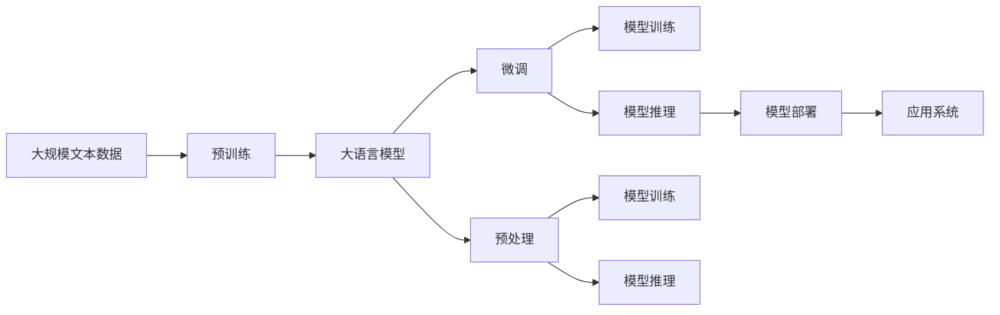

                 

# 大语言模型应用指南：为什么需要外部工具

> 关键词：大语言模型,外部工具,深度学习,应用场景,工具选择

## 1. 背景介绍

### 1.1 问题由来

近年来，随着深度学习技术的快速发展，大语言模型（Large Language Models, LLMs）在自然语言处理（NLP）领域取得了显著进展。这些模型通过在大型无标签文本数据上进行预训练，学习到了丰富的语言知识和常识，可以通过少量有标签数据在下游任务上进行微调，在各种NLP任务上取得优异表现。然而，要真正将大语言模型应用于实际业务场景，仅仅依赖模型的核心算法和架构是不够的。外部工具的辅助和集成，对于提升模型的应用效率、性能和可靠性至关重要。

### 1.2 问题核心关键点

外部工具在大语言模型的应用中扮演了重要角色。这些工具不仅提供了模型部署、可视化、监控等功能，还涵盖了数据预处理、模型训练、优化、推理等多个环节。它们通过标准化接口、自动化流程、优化算法等手段，极大地方便了开发者进行模型开发和应用部署。然而，选择合适的工具，并对其进行有效利用，需要系统性地了解其功能和特点。

### 1.3 问题研究意义

本指南旨在帮助开发者深入理解大语言模型应用中外部工具的必要性和使用方法。通过系统介绍常见的外部工具，分析其在模型开发和应用中的作用，将为读者提供全面的技术参考，帮助其在实际项目中高效利用外部工具，快速构建高效、稳定、易维护的大语言模型应用系统。

## 2. 核心概念与联系

### 2.1 核心概念概述

为更好地理解大语言模型应用中外部工具的作用，本节将介绍几个核心概念及其相互关系：

- **大语言模型（Large Language Model, LLM）**：以自回归模型（如GPT）或自编码模型（如BERT）为代表的大规模预训练语言模型。通过在大规模无标签文本数据上进行预训练，学习通用的语言表示，具备强大的语言理解和生成能力。

- **预训练（Pre-training）**：指在大规模无标签文本数据上，通过自监督学习任务训练通用语言模型的过程。常见的预训练任务包括掩码语言模型等。预训练使得模型学习到语言的通用表示。

- **微调（Fine-tuning）**：指在预训练模型的基础上，使用下游任务的少量标注数据，通过有监督学习优化模型在特定任务上的性能。通常只需调整顶层分类器或解码器，并以较小的学习率更新全部或部分模型参数。

- **外部工具**：为提高模型开发和应用效率，专门设计的软件工具和库，如TensorFlow、PyTorch、Transformers等。这些工具提供了丰富的API接口和功能，支持模型训练、推理、部署、优化等多个环节。

- **深度学习框架（Deep Learning Framework）**：提供深度学习模型构建、训练、推理等功能的软件平台，如TensorFlow、PyTorch等。

- **预处理（Data Preprocessing）**：指对输入数据进行清洗、归一化、分词、向量化等操作，使其符合模型的输入格式。

- **模型训练（Model Training）**：指使用标注数据，通过反向传播算法更新模型参数的过程。

- **优化算法（Optimization Algorithm）**：指用于训练模型，通过梯度下降等方法最小化损失函数，调整模型参数的算法。

- **模型推理（Model Inference）**：指使用训练好的模型，对新的输入数据进行预测或生成。

- **模型部署（Model Deployment）**：指将训练好的模型发布到服务器或移动设备上，使其能够接受外部请求并提供预测服务。

### 2.2 概念间的关系

这些核心概念之间存在着紧密的联系，形成了大语言模型应用系统的完整生态系统。以下是一个综合的流程图，展示了大语言模型应用的各个环节及其相互关系：



这个流程图展示了从预训练到微调，再到模型推理和部署的完整过程。每个环节都有对应的外部工具辅助，从而提高了模型开发和应用的速度和效率。

## 3. 核心算法原理 & 具体操作步骤

### 3.1 算法原理概述

大语言模型在实际应用中，通常需要经过预处理、训练、推理等多个环节。这些环节的顺利进行，离不开外部工具的支持。

- **数据预处理**：将原始数据转换为模型所需的格式，如分词、标准化等。
- **模型训练**：使用标注数据训练模型，通过反向传播算法更新模型参数。
- **模型推理**：使用训练好的模型，对新的输入数据进行预测或生成。
- **模型部署**：将训练好的模型发布到服务器或移动设备上，使其能够接受外部请求并提供预测服务。

### 3.2 算法步骤详解

以下详细描述大语言模型应用中各个环节的具体操作步骤及其外部工具的辅助：

**3.2.1 数据预处理**

1. **分词（Tokenization）**：使用分词工具将文本分割成单词或子词（如jieba、spaCy），生成模型所需的输入。
2. **标准化（Normalization）**：对文本进行大小写转换、去除停用词、标点符号等操作，提高模型输入的质量。

**3.2.2 模型训练**

1. **数据加载与预处理**：使用数据加载工具（如Dask、TensorFlow Dataset）读取和预处理数据。
2. **构建模型**：使用深度学习框架（如TensorFlow、PyTorch）构建模型，设置模型架构和参数。
3. **定义损失函数**：根据任务类型，定义合适的损失函数（如交叉熵损失、均方误差损失）。
4. **优化器设置**：选择合适的优化器（如AdamW、SGD）及其参数，如学习率、批大小等。
5. **模型训练**：使用优化器更新模型参数，最小化损失函数。

**3.2.3 模型推理**

1. **数据加载与预处理**：与训练时类似，加载和预处理输入数据。
2. **模型推理**：使用模型对输入数据进行推理或生成，生成模型输出。

**3.2.4 模型部署**

1. **模型保存**：使用模型保存工具（如TensorFlow Saver、PyTorch State Dict）保存训练好的模型。
2. **模型加载与推理**：在生产环境中部署模型，加载模型参数，进行推理。

### 3.3 算法优缺点

**外部工具的优点**：
- **提高效率**：外部工具提供了丰富的API接口和功能，极大地方便了模型开发和部署。
- **标准化接口**：使用标准化接口进行模型开发和部署，减少了手动编写的代码量，降低了错误率。
- **优化算法**：外部工具集成了先进的优化算法，提高了模型训练的效率和精度。
- **可视化功能**：提供了模型训练、推理、性能监控等可视化功能，方便开发者进行调试和优化。

**外部工具的缺点**：
- **学习成本高**：初学者需要花费一定时间学习外部工具的使用方法。
- **性能问题**：某些外部工具可能存在性能瓶颈，需要手动进行优化。
- **兼容性问题**：不同的外部工具之间可能存在兼容性问题，需要进行适配。

### 3.4 算法应用领域

大语言模型应用的外部工具，已经广泛应用于各种NLP任务，包括文本分类、命名实体识别、关系抽取、问答系统、机器翻译、文本摘要、对话系统等。以下是几个典型的应用场景：

1. **文本分类**：将文本数据分为不同的类别。使用外部工具（如TensorFlow、PyTorch）构建模型，定义分类器，训练模型，并进行推理。
2. **命名实体识别**：从文本中识别出人名、地名、机构名等特定实体。使用外部工具（如spaCy、Stanford NER）进行分词和实体识别。
3. **关系抽取**：从文本中抽取实体之间的语义关系。使用外部工具（如NLTK、spaCy）进行分词和关系抽取。
4. **问答系统**：对自然语言问题给出答案。使用外部工具（如Transformers、TensorFlow）构建模型，训练模型，并进行推理。
5. **机器翻译**：将源语言文本翻译成目标语言。使用外部工具（如Google Translate、Microsoft Translator）进行翻译。
6. **文本摘要**：将长文本压缩成简短摘要。使用外部工具（如GPT、BART）进行摘要生成。
7. **对话系统**：使机器能够与人自然对话。使用外部工具（如DialogueAI、HuggingFace）进行对话生成。

## 4. 数学模型和公式 & 详细讲解 & 举例说明

### 4.1 数学模型构建

本节将使用数学语言对大语言模型应用中的数学模型进行描述，并提供详细的推导过程。

假设使用BERT模型进行文本分类任务，模型结构如下：

```plaintext
BERT -> Classifier -> Output
```

其中，BERT为预训练语言模型，Classifier为分类器，Output为分类结果。

### 4.2 公式推导过程

**4.2.1 损失函数**

在文本分类任务中，定义损失函数为交叉熵损失函数：

$$
\mathcal{L}(y, \hat{y}) = -\sum_{i=1}^{n} y_i \log \hat{y}_i
$$

其中，$y$为真实标签向量，$\hat{y}$为模型预测的类别概率向量。

**4.2.2 模型训练**

使用随机梯度下降（SGD）算法更新模型参数，最小化损失函数：

$$
\theta \leftarrow \theta - \eta \nabla_{\theta}\mathcal{L}(y, \hat{y})
$$

其中，$\theta$为模型参数，$\eta$为学习率，$\nabla_{\theta}\mathcal{L}(y, \hat{y})$为损失函数对模型参数的梯度。

**4.2.3 模型推理**

输入新文本$x$，通过BERT模型得到特征表示$\boldsymbol{h}$，再输入Classifier进行分类，得到预测结果$\hat{y}$：

$$
\hat{y} = \text{Softmax}(\boldsymbol{W} \cdot \boldsymbol{h} + b)
$$

其中，$\boldsymbol{W}$为分类器的权重矩阵，$b$为偏置项，$\text{Softmax}$为softmax函数。

### 4.3 案例分析与讲解

以命名实体识别（NER）任务为例，介绍BERT模型在NER任务中的应用：

1. **数据预处理**：使用分词工具对文本进行分词，生成模型所需的输入。
2. **模型训练**：使用BERT模型作为特征提取器，定义分类器进行训练，最小化损失函数。
3. **模型推理**：使用训练好的模型对新文本进行实体识别。

## 5. 项目实践：代码实例和详细解释说明

### 5.1 开发环境搭建

在进行大语言模型应用时，需要搭建合适的开发环境。以下是Python开发环境的搭建流程：

1. 安装Anaconda：从官网下载并安装Anaconda，用于创建独立的Python环境。
2. 创建并激活虚拟环境：
```bash
conda create -n pytorch-env python=3.8 
conda activate pytorch-env
```
3. 安装PyTorch：根据CUDA版本，从官网获取对应的安装命令。例如：
```bash
conda install pytorch torchvision torchaudio cudatoolkit=11.1 -c pytorch -c conda-forge
```
4. 安装Transformers库：
```bash
pip install transformers
```
5. 安装各类工具包：
```bash
pip install numpy pandas scikit-learn matplotlib tqdm jupyter notebook ipython
```

完成上述步骤后，即可在`pytorch-env`环境中开始模型开发。

### 5.2 源代码详细实现

以下是使用PyTorch和Transformers库进行BERT模型微调的代码实现：

```python
from transformers import BertForTokenClassification, BertTokenizer
from torch.utils.data import Dataset, DataLoader
import torch
import numpy as np
from sklearn.metrics import accuracy_score, precision_recall_fscore_support

# 定义数据集
class NERDataset(Dataset):
    def __init__(self, texts, tags):
        self.texts = texts
        self.tags = tags
        self.tokenizer = BertTokenizer.from_pretrained('bert-base-cased')
    
    def __len__(self):
        return len(self.texts)
    
    def __getitem__(self, item):
        text = self.texts[item]
        tag = self.tags[item]
        
        encoding = self.tokenizer(text, return_tensors='pt', truncation=True, padding='max_length')
        input_ids = encoding['input_ids']
        attention_mask = encoding['attention_mask']
        
        label_ids = np.array([tag2id[tag] for tag in tag])
        label_ids = torch.tensor(label_ids, dtype=torch.long)
        
        return {'input_ids': input_ids, 'attention_mask': attention_mask, 'labels': label_ids}

# 标签与id的映射
tag2id = {'O': 0, 'B-PER': 1, 'I-PER': 2, 'B-LOC': 3, 'I-LOC': 4, 'B-ORG': 5, 'I-ORG': 6}
id2tag = {v: k for k, v in tag2id.items()}

# 创建数据集
tokenizer = BertTokenizer.from_pretrained('bert-base-cased')
train_dataset = NERDataset(train_texts, train_tags)
dev_dataset = NERDataset(dev_texts, dev_tags)
test_dataset = NERDataset(test_texts, test_tags)

# 定义模型和优化器
model = BertForTokenClassification.from_pretrained('bert-base-cased', num_labels=len(tag2id))
optimizer = torch.optim.AdamW(model.parameters(), lr=2e-5)

# 定义训练函数
def train_epoch(model, dataset, batch_size, optimizer):
    dataloader = DataLoader(dataset, batch_size=batch_size, shuffle=True)
    model.train()
    epoch_loss = 0
    for batch in dataloader:
        input_ids = batch['input_ids'].to(device)
        attention_mask = batch['attention_mask'].to(device)
        labels = batch['labels'].to(device)
        model.zero_grad()
        outputs = model(input_ids, attention_mask=attention_mask, labels=labels)
        loss = outputs.loss
        epoch_loss += loss.item()
        loss.backward()
        optimizer.step()
    return epoch_loss / len(dataloader)

# 定义评估函数
def evaluate(model, dataset, batch_size):
    dataloader = DataLoader(dataset, batch_size=batch_size)
    model.eval()
    preds, labels = [], []
    with torch.no_grad():
        for batch in dataloader:
            input_ids = batch['input_ids'].to(device)
            attention_mask = batch['attention_mask'].to(device)
            labels = batch['labels'].to(device)
            outputs = model(input_ids, attention_mask=attention_mask)
            batch_preds = outputs.logits.argmax(dim=2).to('cpu').tolist()
            batch_labels = labels.to('cpu').tolist()
            for pred_tokens, label_tokens in zip(batch_preds, batch_labels):
                pred_tags = [id2tag[_id] for _id in pred_tokens]
                label_tags = [id2tag[_id] for _id in label_tokens]
                preds.append(pred_tags[:len(label_tags)])
                labels.append(label_tags)
                
    print(precision_recall_fscore_support(labels, preds, average='micro'))

# 启动训练流程并在测试集上评估
epochs = 5
batch_size = 16

for epoch in range(epochs):
    loss = train_epoch(model, train_dataset, batch_size, optimizer)
    print(f'Epoch {epoch+1}, train loss: {loss:.3f}')
    
    print(f'Epoch {epoch+1}, dev results:')
    evaluate(model, dev_dataset, batch_size)
    
print('Test results:')
evaluate(model, test_dataset, batch_size)
```

### 5.3 代码解读与分析

以下是代码实现的详细解读：

**NERDataset类**：
- `__init__`方法：初始化文本、标签、分词器等关键组件。
- `__len__`方法：返回数据集的样本数量。
- `__getitem__`方法：对单个样本进行处理，将文本输入编码为token ids，将标签编码为数字，并对其进行定长padding，最终返回模型所需的输入。

**tag2id和id2tag字典**：
- 定义了标签与数字id之间的映射关系，用于将token-wise的预测结果解码回真实的标签。

**训练和评估函数**：
- 使用PyTorch的DataLoader对数据集进行批次化加载，供模型训练和推理使用。
- 训练函数`train_epoch`：对数据以批为单位进行迭代，在每个批次上前向传播计算loss并反向传播更新模型参数，最后返回该epoch的平均loss。
- 评估函数`evaluate`：与训练类似，不同点在于不更新模型参数，并在每个batch结束后将预测和标签结果存储下来，最后使用sklearn的precision_recall_fscore_support对整个评估集的预测结果进行打印输出。

**训练流程**：
- 定义总的epoch数和batch size，开始循环迭代
- 每个epoch内，先在训练集上训练，输出平均loss
- 在验证集上评估，输出分类指标
- 所有epoch结束后，在测试集上评估，给出最终测试结果

## 6. 实际应用场景

### 6.1 智能客服系统

基于大语言模型微调的对话技术，可以广泛应用于智能客服系统的构建。传统客服往往需要配备大量人力，高峰期响应缓慢，且一致性和专业性难以保证。而使用微调后的对话模型，可以7x24小时不间断服务，快速响应客户咨询，用自然流畅的语言解答各类常见问题。

在技术实现上，可以收集企业内部的历史客服对话记录，将问题和最佳答复构建成监督数据，在此基础上对预训练对话模型进行微调。微调后的对话模型能够自动理解用户意图，匹配最合适的答案模板进行回复。对于客户提出的新问题，还可以接入检索系统实时搜索相关内容，动态组织生成回答。如此构建的智能客服系统，能大幅提升客户咨询体验和问题解决效率。

### 6.2 金融舆情监测

金融机构需要实时监测市场舆论动向，以便及时应对负面信息传播，规避金融风险。传统的人工监测方式成本高、效率低，难以应对网络时代海量信息爆发的挑战。基于大语言模型微调的文本分类和情感分析技术，为金融舆情监测提供了新的解决方案。

具体而言，可以收集金融领域相关的新闻、报道、评论等文本数据，并对其进行主题标注和情感标注。在此基础上对预训练语言模型进行微调，使其能够自动判断文本属于何种主题，情感倾向是正面、中性还是负面。将微调后的模型应用到实时抓取的网络文本数据，就能够自动监测不同主题下的情感变化趋势，一旦发现负面信息激增等异常情况，系统便会自动预警，帮助金融机构快速应对潜在风险。

### 6.3 个性化推荐系统

当前的推荐系统往往只依赖用户的历史行为数据进行物品推荐，无法深入理解用户的真实兴趣偏好。基于大语言模型微调技术，个性化推荐系统可以更好地挖掘用户行为背后的语义信息，从而提供更精准、多样的推荐内容。

在实践中，可以收集用户浏览、点击、评论、分享等行为数据，提取和用户交互的物品标题、描述、标签等文本内容。将文本内容作为模型输入，用户的后续行为（如是否点击、购买等）作为监督信号，在此基础上微调预训练语言模型。微调后的模型能够从文本内容中准确把握用户的兴趣点。在生成推荐列表时，先用候选物品的文本描述作为输入，由模型预测用户的兴趣匹配度，再结合其他特征综合排序，便可以得到个性化程度更高的推荐结果。

### 6.4 未来应用展望

随着大语言模型微调技术的发展，其在更多领域的应用前景将更加广阔。

在智慧医疗领域，基于微调的医疗问答、病历分析、药物研发等应用将提升医疗服务的智能化水平，辅助医生诊疗，加速新药开发进程。

在智能教育领域，微调技术可应用于作业批改、学情分析、知识推荐等方面，因材施教，促进教育公平，提高教学质量。

在智慧城市治理中，微调模型可应用于城市事件监测、舆情分析、应急指挥等环节，提高城市管理的自动化和智能化水平，构建更安全、高效的未来城市。

此外，在企业生产、社会治理、文娱传媒等众多领域，基于大模型微调的人工智能应用也将不断涌现，为经济社会发展注入新的动力。相信随着技术的日益成熟，微调方法将成为人工智能落地应用的重要范式，推动人工智能技术向更广阔的领域加速渗透。

## 7. 工具和资源推荐

### 7.1 学习资源推荐

为了帮助开发者系统掌握大语言模型微调的理论基础和实践技巧，这里推荐一些优质的学习资源：

1. 《Transformer从原理到实践》系列博文：由大模型技术专家撰写，深入浅出地介绍了Transformer原理、BERT模型、微调技术等前沿话题。

2. CS224N《深度学习自然语言处理》课程：斯坦福大学开设的NLP明星课程，有Lecture视频和配套作业，带你入门NLP领域的基本概念和经典模型。

3. 《Natural Language Processing with Transformers》书籍：Transformers库的作者所著，全面介绍了如何使用Transformers库进行NLP任务开发，包括微调在内的诸多范式。

4. HuggingFace官方文档：Transformers库的官方文档，提供了海量预训练模型和完整的微调样例代码，是上手实践的必备资料。

5. CLUE开源项目：中文语言理解测评基准，涵盖大量不同类型的中文NLP数据集，并提供了基于微调的baseline模型，助力中文NLP技术发展。

通过对这些资源的学习实践，相信你一定能够快速掌握大语言模型微调的精髓，并用于解决实际的NLP问题。

### 7.2 开发工具推荐

高效的开发离不开优秀的工具支持。以下是几款用于大语言模型微调开发的常用工具：

1. PyTorch：基于Python的开源深度学习框架，灵活动态的计算图，适合快速迭代研究。大部分预训练语言模型都有PyTorch版本的实现。

2. TensorFlow：由Google主导开发的开源深度学习框架，生产部署方便，适合大规模工程应用。同样有丰富的预训练语言模型资源。

3. Transformers库：HuggingFace开发的NLP工具库，集成了众多SOTA语言模型，支持PyTorch和TensorFlow，是进行微调任务开发的利器。

4. Weights & Biases：模型训练的实验跟踪工具，可以记录和可视化模型训练过程中的各项指标，方便对比和调优。与主流深度学习框架无缝集成。

5. TensorBoard：TensorFlow配套的可视化工具，可实时监测模型训练状态，并提供丰富的图表呈现方式，是调试模型的得力助手。

6. Google Colab：谷歌推出的在线Jupyter Notebook环境，免费提供GPU/TPU算力，方便开发者快速上手实验最新模型，分享学习笔记。

合理利用这些工具，可以显著提升大语言模型微调任务的开发效率，加快创新迭代的步伐。

### 7.3 相关论文推荐

大语言模型和微调技术的发展源于学界的持续研究。以下是几篇奠基性的相关论文，推荐阅读：

1. Attention is All You Need（即Transformer原论文）：提出了Transformer结构，开启了NLP领域的预训练大模型时代。

2. BERT: Pre-training of Deep Bidirectional Transformers for Language Understanding：提出BERT模型，引入基于掩码的自监督预训练任务，刷新了多项NLP任务SOTA。

3. Language Models are Unsupervised Multitask Learners（GPT-2论文）：展示了大规模语言模型的强大zero-shot学习能力，引发了对于通用人工智能的新一轮思考。

4. Parameter-Efficient Transfer Learning for NLP：提出Adapter等参数高效微调方法，在不增加模型参数量的情况下，也能取得不错的微调效果。

5. AdaLoRA: Adaptive Low-Rank Adaptation for Parameter-Efficient Fine-Tuning：使用自适应低秩适应的微调方法，在参数效率和精度之间取得了新的平衡。

这些论文代表了大语言模型微调技术的发展脉络。通过学习这些前沿成果，可以帮助研究者把握学科前进方向，激发更多的创新灵感。

除上述资源外，还有一些值得关注的前沿资源，帮助开发者紧跟大语言模型微调技术的最新进展，例如：

1. arXiv论文预印本：人工智能领域最新研究成果的发布平台，包括大量尚未发表的前沿工作，学习前沿技术的必读资源。

2. 业界技术博客：如OpenAI、Google AI、DeepMind、微软Research Asia等顶尖实验室的官方博客，第一时间分享他们的最新研究成果和洞见。

3. 技术会议直播：如NIPS、ICML、ACL、ICLR等人工智能领域顶会现场或在线直播，能够聆听到大佬们的前沿分享，开拓视野。

4. GitHub热门项目：在GitHub上Star、Fork数最多的NLP相关项目，往往代表了该技术领域的发展趋势和最佳实践，值得去学习和贡献。

5. 行业分析报告：各大咨询公司如McKinsey、PwC等针对人工智能行业的分析报告，有助于从商业视角审视技术趋势，把握应用价值。

总之，对于大语言模型微调技术的学习和实践，需要开发者保持开放的心态和持续学习的意愿。多关注前沿资讯，多动手实践，多思考总结，必将收获满满的成长

