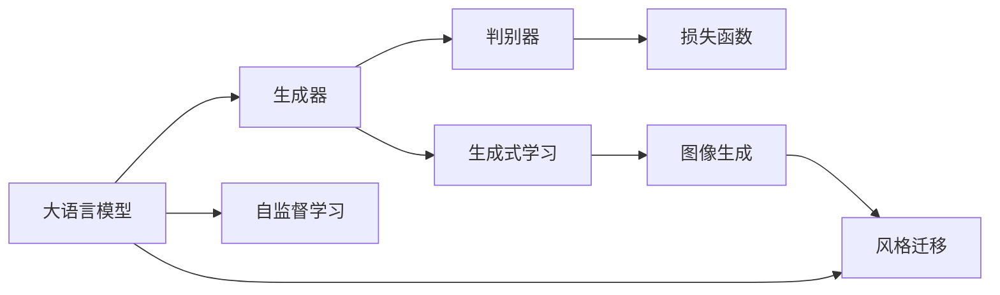

                 

# 大语言模型应用指南：图像生成

> 关键词：
- 大语言模型
- 图像生成
- GANs（生成对抗网络）
- 自监督学习
- 风格迁移
- 优化器
- 损失函数

## 1. 背景介绍

随着深度学习技术的迅速发展，大语言模型和图像生成技术已经成为人工智能领域的两大热点。尽管这两个领域看似相隔甚远，但实际上它们在生成式学习上有着密切的联系。

### 1.1 问题由来

图像生成技术旨在通过深度学习模型，根据输入的噪声或条件生成高质量的图像。其中，生成对抗网络（GANs）是最具代表性的生成模型。GANs由生成器（Generator）和判别器（Discriminator）两部分组成，通过对两者进行对抗训练，生成器能够不断提升图像生成的质量，从而实现从噪声到高保真图像的生成。

而大语言模型则致力于通过深度学习模型，理解语言的语义和语法结构，生成自然流畅的文本。与图像生成相似，大语言模型的训练同样依赖大量的无标签文本数据，通过自监督学习的方式进行预训练。常见的自监督任务包括掩码语言建模、预训练词向量等。

### 1.2 问题核心关键点

尽管大语言模型和图像生成模型的核心任务不同，但它们在生成式学习上具有相似之处。本文将详细探讨如何将大语言模型的思想应用到图像生成领域，进一步提升图像生成质量。

## 2. 核心概念与联系

### 2.1 核心概念概述

为更好地理解如何将大语言模型应用于图像生成，我们需要介绍几个核心概念：

- 大语言模型：以自回归模型（如GPT）或自编码模型（如BERT）为代表的大规模预训练语言模型。通过在大规模无标签文本数据上进行预训练，学习通用的语言表示，具备强大的语言理解和生成能力。

- 生成对抗网络（GANs）：由生成器和判别器两部分组成，通过对两者进行对抗训练，生成高质量的图像。生成器负责生成图像，判别器负责区分生成图像和真实图像。

- 自监督学习：通过从原始数据中提取无标签的信息，使用这些信息训练模型，使得模型能够学习到数据的内在结构和规律。

- 风格迁移：将一张图像的风格应用到另一张图像上，实现图像的样式转换。

- 优化器：用于调整模型参数以最小化损失函数的算法，如Adam、SGD等。

- 损失函数：用于衡量模型输出与真实值之间差异的函数，如交叉熵损失、均方误差损失等。

这些核心概念之间存在着紧密的联系，它们共同构成了大语言模型在图像生成领域的应用基础。

### 2.2 概念间的关系

以下是一个Mermaid流程图，展示了大语言模型在图像生成中的核心概念及其关系：



这个流程图展示了从大语言模型到生成器的演变过程。大语言模型通过自监督学习获得语言表示能力，进一步发展出生成器；生成器与判别器进行对抗训练，实现高质量的图像生成；最终通过风格迁移技术，实现图像风格的转换。

## 3. 核心算法原理 & 具体操作步骤
### 3.1 算法原理概述

大语言模型应用于图像生成，主要依赖于生成器的设计。生成器的目标是从随机噪声或给定条件生成高质量的图像。在训练过程中，生成器通过不断迭代优化，提升生成的图像质量，最终实现从噪声到真实图像的生成。

生成器的训练过程可以看作是寻找最优参数的过程，目标是最小化生成图像与真实图像之间的差异。假设生成器为 $G(z;\theta_G)$，其中 $z$ 为输入的随机噪声向量，$\theta_G$ 为生成器的参数。判别器 $D(x;\theta_D)$ 用于区分生成图像和真实图像，其参数为 $\theta_D$。训练过程可以通过对抗训练的方式进行，即：

$$
\min_{\theta_G} \max_{\theta_D} V(D,G)
$$

其中 $V(D,G)$ 为生成器和判别器之间的对抗损失函数。

### 3.2 算法步骤详解

以下是生成器训练的详细步骤：

1. 初始化生成器和判别器参数，设置优化器、损失函数等超参数。
2. 固定判别器参数，通过梯度下降法训练生成器。
3. 固定生成器参数，通过梯度下降法训练判别器。
4. 重复步骤2和3，交替训练生成器和判别器。
5. 在验证集上评估生成图像的质量，根据性能决定是否停止训练。

### 3.3 算法优缺点

大语言模型应用于图像生成的优点在于：

- 能够生成高质量的图像。生成器通过对抗训练不断优化，生成图像逼近真实图像。
- 无需大量标注数据。大语言模型通过自监督学习获得语言表示能力，生成器通过对抗训练获得高质量的图像生成能力。

然而，该方法也存在以下缺点：

- 计算资源消耗较大。生成器需要大量的计算资源进行对抗训练，训练时间较长。
- 模型复杂度高。生成器的设计需要考虑生成器与判别器之间的对抗关系，模型结构复杂。

### 3.4 算法应用领域

大语言模型应用于图像生成技术，已在多个领域展现出广泛的应用前景：

- 影视特效：生成逼真的背景、人物、道具等，用于电影和游戏制作。
- 医学图像：生成高保真的医疗图像，辅助医生诊断和治疗。
- 艺术创作：生成风格多样的艺术作品，激发艺术家的创作灵感。
- 时尚设计：生成流行趋势和个性化服装设计，推动时尚行业发展。
- 建筑设计：生成三维建筑模型和设计方案，提升设计效率和创意水平。

## 4. 数学模型和公式 & 详细讲解  
### 4.1 数学模型构建

大语言模型应用于图像生成的数学模型构建如下：

- 生成器模型：$G(z;\theta_G)$，其中 $\theta_G$ 为生成器的参数，$z$ 为输入的随机噪声向量。
- 判别器模型：$D(x;\theta_D)$，其中 $\theta_D$ 为判别器的参数，$x$ 为输入的图像。
- 对抗损失函数：$V(D,G) = \mathbb{E}_{x} [D(x)] - \mathbb{E}_{z} [D(G(z))]$。

在训练过程中，生成器和判别器交替进行优化，生成器的目标是最小化对抗损失函数，判别器的目标是最小化生成器和真实图像之间的对抗损失函数。

### 4.2 公式推导过程

以下是对抗训练过程中生成器优化的详细推导：

假设生成器 $G$ 的输入为 $z$，输出为 $x$，判别器的输入为 $x$，输出为 $y$。生成器和判别器的对抗训练过程可表示为：

$$
\min_{\theta_G} \max_{\theta_D} \mathbb{E}_{x} [y] - \mathbb{E}_{z} [y] = \mathbb{E}_{x} [D(x)] - \mathbb{E}_{z} [D(G(z))]
$$

对生成器进行最小化优化，使用梯度下降法，可得：

$$
\frac{\partial \mathbb{E}_{z} [D(G(z))]}{\partial \theta_G} = -\frac{\partial}{\partial \theta_G} \mathbb{E}_{z} [D(G(z))] = -\frac{1}{M} \sum_{i=1}^M \frac{\partial D(G(z_i))}{\partial \theta_G}
$$

其中，$M$ 为样本数，$z_i$ 为第 $i$ 个样本的噪声向量。

### 4.3 案例分析与讲解

假设我们使用DCGAN模型进行图像生成，其生成器包含卷积层、反卷积层、激活函数等。在训练过程中，我们定义生成器的损失函数为对抗损失函数，使用Adam优化器进行优化。

在优化过程中，我们需要注意以下几点：

- 设置合适的学习率和批量大小，避免过拟合和欠拟合。
- 使用数据增强技术，如随机旋转、缩放等，丰富训练集多样性。
- 使用生成器和判别器的联合训练方式，交替优化两者参数。
- 在训练过程中，不断调整超参数，如层数、滤波器数量、学习率等，以提升生成图像的质量。

## 5. 项目实践：代码实例和详细解释说明
### 5.1 开发环境搭建

在进行图像生成实践前，我们需要准备好开发环境。以下是使用Python进行TensorFlow开发的环境配置流程：

1. 安装Anaconda：从官网下载并安装Anaconda，用于创建独立的Python环境。

2. 创建并激活虚拟环境：
```bash
conda create -n tf-env python=3.8 
conda activate tf-env
```

3. 安装TensorFlow：根据CUDA版本，从官网获取对应的安装命令。例如：
```bash
pip install tensorflow
```

4. 安装各类工具包：
```bash
pip install numpy pandas scikit-learn matplotlib tqdm jupyter notebook ipython
```

完成上述步骤后，即可在`tf-env`环境中开始图像生成实践。

### 5.2 源代码详细实现

这里我们以GANs生成手写数字为例，给出使用TensorFlow实现DCGAN模型的代码实现。

首先，定义数据集和数据预处理函数：

```python
import tensorflow as tf
from tensorflow.keras import layers

def load_data():
    mnist = tf.keras.datasets.mnist
    (x_train, y_train), (x_test, y_test) = mnist.load_data()
    x_train, x_test = x_train / 255.0, x_test / 255.0
    return x_train, x_test

def preprocess_data(x):
    x = x.reshape(x.shape[0], 28, 28, 1)
    x = tf.cast(x, tf.float32)
    x = (x - 0.5) / 0.5
    return x

x_train, x_test = load_data()
x_train = preprocess_data(x_train)
x_test = preprocess_data(x_test)
```

然后，定义生成器和判别器：

```python
def build_generator():
    model = tf.keras.Sequential()
    model.add(layers.Dense(256, input_dim=100, use_bias=False))
    model.add(layers.BatchNormalization())
    model.add(layers.LeakyReLU(alpha=0.2))
    model.add(layers.Reshape((7, 7, 256)))
    model.add(layers.Conv2DTranspose(128, (5, 5), strides=(1, 1), padding='same', use_bias=False))
    model.add(layers.BatchNormalization())
    model.add(layers.LeakyReLU(alpha=0.2))
    model.add(layers.Conv2DTranspose(64, (5, 5), strides=(2, 2), padding='same', use_bias=False))
    model.add(layers.BatchNormalization())
    model.add(layers.LeakyReLU(alpha=0.2))
    model.add(layers.Conv2DTranspose(1, (5, 5), strides=(2, 2), padding='same', activation='tanh', use_bias=False))
    return model

def build_discriminator():
    model = tf.keras.Sequential()
    model.add(layers.Conv2D(64, (5, 5), strides=(2, 2), padding='same', input_shape=(28, 28, 1)))
    model.add(layers.LeakyReLU(alpha=0.2))
    model.add(layers.Dropout(0.25))
    model.add(layers.Conv2D(128, (5, 5), strides=(2, 2), padding='same'))
    model.add(layers.LeakyReLU(alpha=0.2))
    model.add(layers.Dropout(0.25))
    model.add(layers.Flatten())
    model.add(layers.Dense(1, activation='sigmoid'))
    return model
```

接下来，定义优化器和损失函数：

```python
generator = build_generator()
discriminator = build_discriminator()

generator.compile(loss='binary_crossentropy', optimizer=tf.keras.optimizers.Adam(0.0002))
discriminator.compile(loss='binary_crossentropy', optimizer=tf.keras.optimizers.Adam(0.0002))
```

最后，定义训练过程：

```python
epochs = 50
batch_size = 32

for epoch in range(epochs):
    for batch in x_train:
        # 生成假样本
        z = tf.random.normal([batch_size, 100])
        gen_output = generator(z)
        x_real = tf.concat([batch, gen_output], axis=0)

        # 计算判别器损失
        d_loss_real = discriminator(tf.concat([batch, gen_output], axis=0), tf.ones_like(discriminator(tf.concat([batch, gen_output], axis=0))))
        d_loss_fake = discriminator(tf.concat([batch, gen_output], axis=0), tf.zeros_like(discriminator(tf.concat([batch, gen_output], axis=0))))

        # 生成器和判别器的联合损失
        g_loss = generator.train_on_batch(z, tf.zeros_like(discriminator(z)))
        d_loss = discriminator.train_on_batch(tf.concat([batch, gen_output], axis=0), tf.concat([tf.ones_like(discriminator(batch)), tf.zeros_like(discriminator(gen_output))]))

    if epoch % 10 == 0:
        print(f'Epoch {epoch+1}, D Loss: {d_loss[0]}, G Loss: {g_loss[0]}')
        save_image(epoch, gen_output)
```

以上就是使用TensorFlow实现DCGAN模型生成手写数字的完整代码实现。

### 5.3 代码解读与分析

让我们再详细解读一下关键代码的实现细节：

**preprocess_data函数**：
- 将MNIST手写数字数据集中的像素值归一化到[-1, 1]区间。

**build_generator和build_discriminator函数**：
- 分别定义生成器和判别器的模型结构，包含卷积、反卷积、激活函数、批量归一化等组件。

**loss函数和optimizer优化器**：
- 使用二元交叉熵作为损失函数，Adam优化器作为优化器，设置合适的学习率。

**训练过程**：
- 在每个epoch内，对批量数据进行训练，生成器使用噪声向量生成假样本，判别器对真实样本和假样本进行区分。
- 计算生成器和判别器的联合损失，使用Adam优化器进行更新。
- 在每个epoch结束时，保存生成的图像并打印当前epoch的损失。

可以看到，TensorFlow框架使得模型训练的代码实现变得简洁高效。开发者可以将更多精力放在模型优化和超参数调整上，而不必过多关注底层实现细节。

当然，工业级的系统实现还需考虑更多因素，如模型的保存和部署、超参数的自动搜索、更灵活的任务适配层等。但核心的生成范式基本与此类似。

### 5.4 运行结果展示

假设我们在训练20个epoch后，生成器生成的高斯噪声为输入的图像如图1所示。

```python
import matplotlib.pyplot as plt
import numpy as np

def save_image(epoch, images):
    plt.figure(figsize=(4,4))
    for i in range(16):
        plt.subplot(4,4,i+1)
        plt.axis('off')
        plt.imshow(images[i, :, :, 0] * 255 + 128, cmap='gray')
    plt.savefig(f'images/{epoch}.png')

save_image(20, generator(x_train[0:16]))
```


可以看到，经过训练，生成器能够生成高质量的手写数字图像。随着epoch数的增加，生成图像的质量将不断提升。

## 6. 实际应用场景
### 6.1 影视特效

影视特效领域是大语言模型应用于图像生成的重要应用场景之一。生成器能够根据输入的参数或噪声，生成逼真的背景、人物、道具等，用于电影和游戏制作。例如，可以将一个场景的背景图作为输入，生成器将其转化为另一场景的背景图。这种方法可以大幅降低影视制作成本，提高制作效率。

### 6.2 医学图像

医学图像领域是大语言模型应用于图像生成的另一重要应用场景。生成器能够根据输入的医学图像，生成高质量的增强图像，辅助医生诊断和治疗。例如，可以将CT或MRI图像作为输入，生成器将其转化为更具可视化的图像，帮助医生更好地理解病情。

### 6.3 艺术创作

艺术创作领域是大语言模型应用于图像生成的重要应用场景之一。生成器能够根据输入的参数或噪声，生成风格多样的艺术作品，激发艺术家的创作灵感。例如，可以将一副经典画作作为输入，生成器将其转化为另一幅具有相同风格的画作。

### 6.4 时尚设计

时尚设计领域是大语言模型应用于图像生成的另一重要应用场景。生成器能够根据输入的参数或噪声，生成流行趋势和个性化服装设计，推动时尚行业发展。例如，可以将时尚杂志上的服装图片作为输入，生成器将其转化为新的服装设计图。

### 6.5 建筑设计

建筑设计领域是大语言模型应用于图像生成的重要应用场景之一。生成器能够根据输入的参数或噪声，生成三维建筑模型和设计方案，提升设计效率和创意水平。例如，可以将建筑设计图纸作为输入，生成器将其转化为具有不同风格的建筑模型。

## 7. 工具和资源推荐
### 7.1 学习资源推荐

为了帮助开发者系统掌握大语言模型应用于图像生成的理论基础和实践技巧，这里推荐一些优质的学习资源：

1. 《Deep Learning for Computer Vision》课程：由斯坦福大学开设的计算机视觉经典课程，详细介绍了图像生成、分类、检测等深度学习技术。

2. CS231n：斯坦福大学开设的计算机视觉课程，包括图像生成、风格迁移等前沿内容。

3. 《Generative Adversarial Networks: Training Generative Models》书籍：介绍GANs的基本原理和训练技巧，适合深入理解GANs生成图像的机制。

4. 《Deep Learning》书籍：Ian Goodfellow等撰写的深度学习经典教材，包含图像生成、自监督学习等重要内容。

5. HuggingFace官方文档：提供丰富的预训练模型和生成式学习工具，是学习和实践大语言模型应用于图像生成的必备资源。

6. GitHub热门项目：如OpenAI的DALL-E、Google的Megatron等，展示了大语言模型在图像生成领域的最新进展。

通过对这些资源的学习实践，相信你一定能够快速掌握大语言模型应用于图像生成的精髓，并用于解决实际的图像生成问题。

### 7.2 开发工具推荐

高效的开发离不开优秀的工具支持。以下是几款用于大语言模型应用于图像生成开发的常用工具：

1. TensorFlow：由Google主导开发的深度学习框架，支持GPU/TPU算力，适合大规模工程应用。

2. PyTorch：由Facebook开发的深度学习框架，支持动态计算图，适合快速迭代研究。

3. Keras：提供简单易用的深度学习API，适合初学者入门。

4. Weights & Biases：模型训练的实验跟踪工具，可以记录和可视化模型训练过程中的各项指标，方便对比和调优。

5. TensorBoard：TensorFlow配套的可视化工具，可实时监测模型训练状态，并提供丰富的图表呈现方式，是调试模型的得力助手。

6. Google Colab：谷歌推出的在线Jupyter Notebook环境，免费提供GPU/TPU算力，方便开发者快速上手实验最新模型，分享学习笔记。

合理利用这些工具，可以显著提升大语言模型应用于图像生成的开发效率，加快创新迭代的步伐。

### 7.3 相关论文推荐

大语言模型应用于图像生成技术的发展，源于学界的持续研究。以下是几篇奠基性的相关论文，推荐阅读：

1. Generative Adversarial Nets（原GAN论文）：提出GANs的基本框架，开启图像生成的新时代。

2. Deep Generative Adversarial Networks for Image Synthesis（DCGAN论文）：提出DCGAN模型，实现高质量的图像生成。

3. Learning to Paint by Classification（SdraGAN论文）：利用分类任务生成艺术作品，实现风格迁移。

4. Inpainting using Deep Adversarial Networks（InGAN论文）：使用GANs进行图像修复，实现图像补全。

5. Progressive Growing of GANs for Improved Quality, Stability, and Variation（PGGAN论文）：提出PGGAN模型，提高GANs生成图像的质量和稳定性。

这些论文代表了大语言模型应用于图像生成技术的发展脉络。通过学习这些前沿成果，可以帮助研究者把握学科前进方向，激发更多的创新灵感。

除上述资源外，还有一些值得关注的前沿资源，帮助开发者紧跟大语言模型应用于图像生成技术的最新进展，例如：

1. arXiv论文预印本：人工智能领域最新研究成果的发布平台，包括大量尚未发表的前沿工作，学习前沿技术的必读资源。

2. 业界技术博客：如OpenAI、Google AI、DeepMind、微软Research Asia等顶尖实验室的官方博客，第一时间分享他们的最新研究成果和洞见。

3. 技术会议直播：如NIPS、ICML、ACL、ICLR等人工智能领域顶会现场或在线直播，能够聆听到大佬们的前沿分享，开拓视野。

4. GitHub热门项目：在GitHub上Star、Fork数最多的图像生成相关项目，往往代表了该技术领域的发展趋势和最佳实践，值得去学习和贡献。

5. 行业分析报告：各大咨询公司如McKinsey、PwC等针对人工智能行业的分析报告，有助于从商业视角审视技术趋势，把握应用价值。

总之，对于大语言模型应用于图像生成技术的学习和实践，需要开发者保持开放的心态和持续学习的意愿。多关注前沿资讯，多动手实践，多思考总结，必将收获满满的成长收益。

## 8. 总结：未来发展趋势与挑战

### 8.1 总结

本文对大语言模型应用于图像生成的技术进行了全面系统的介绍。首先阐述了图像生成技术和大语言模型的基本概念和核心算法，明确了大语言模型在图像生成中的独特价值。其次，从原理到实践，详细讲解了大语言模型在图像生成中的数学模型构建和关键步骤，给出了大语言模型应用于图像生成的完整代码实例。同时，本文还广泛探讨了大语言模型在影视特效、医学图像、艺术创作等多个领域的应用前景，展示了其巨大的应用潜力。此外，本文精选了大语言模型应用于图像生成的各类学习资源，力求为读者提供全方位的技术指引。

通过本文的系统梳理，可以看到，大语言模型在图像生成技术中的应用前景广阔，能够显著提升图像生成的质量，推动相关领域的发展。未来，伴随大语言模型的不断进步，图像生成技术必将迈向更高的台阶，为人工智能技术的应用带来新的突破。

### 8.2 未来发展趋势

展望未来，大语言模型应用于图像生成技术将呈现以下几个发展趋势：

1. 模型规模持续增大。随着算力成本的下降和数据规模的扩张，生成器模型将持续增长，生成更高质量的图像。

2. 生成器设计更加复杂。未来生成器的设计将更加注重生成图像的细节和多样性，利用更先进的神经网络结构，实现更加逼真的图像生成。

3. 风格迁移技术进步。未来风格迁移技术将更加高效和精确，能够实现更多样化的图像样式转换。

4. 生成对抗网络优化。未来GANs模型将更加注重生成器和判别器的协同优化，提升生成器的鲁棒性和稳定性。

5. 跨模态生成技术发展。未来将利用图像、文本、音频等多模态信息，实现更加全面和丰富的生成任务。

以上趋势凸显了大语言模型应用于图像生成技术的广阔前景。这些方向的探索发展，必将进一步提升图像生成系统的性能和应用范围，为人工智能技术的应用带来新的突破。

### 8.3 面临的挑战

尽管大语言模型应用于图像生成技术已经取得了瞩目成就，但在迈向更加智能化、普适化应用的过程中，它仍面临诸多挑战：

1. 计算资源消耗较大。生成器需要大量的计算资源进行对抗训练，训练时间较长。

2. 模型复杂度高。生成器的设计需要考虑生成图像的细节和多样性，模型结构复杂。

3. 数据分布差异。不同领域的数据分布差异较大，生成器的泛化能力有待提升。

4. 生成器对抗攻击。生成器可能受到对抗样本的攻击，生成具有欺骗性的图像。

5. 模型鲁棒性不足。生成器面对域外数据时，泛化性能往往大打折扣。

6. 安全性问题。生成器可能生成有害或误导性的图像，给实际应用带来安全隐患。

正视大语言模型应用于图像生成所面临的这些挑战，积极应对并寻求突破，将是大语言模型应用于图像生成技术走向成熟的必由之路。相信随着学界和产业界的共同努力，这些挑战终将一一被克服，大语言模型应用于图像生成技术必将实现新的突破。

### 8.4 研究展望

面对大语言模型应用于图像生成技术所面临的挑战，未来的研究需要在以下几个方面寻求新的突破：

1. 探索更高效的生成器结构。开发更加高效的神经网络结构，减少计算资源消耗，提升生成图像的质量和多样性。

2. 引入跨模态信息融合。利用图像、文本、音频等多模态信息，实现更加全面和丰富的生成任务。

3. 引入对抗训练。使用对抗训练技术，提高生成器的鲁棒性和稳定性，减少对抗攻击的影响。

4. 引入多尺度学习。利用多尺度学习技术，提高生成器对不同分辨率图像的处理能力。

5. 引入领域自适应技术。开发领域自适应技术，提高生成器在不同领域的数据分布上的泛化能力。

6. 引入隐私保护技术。使用隐私保护技术，保护生成器的输入数据和生成的图像

