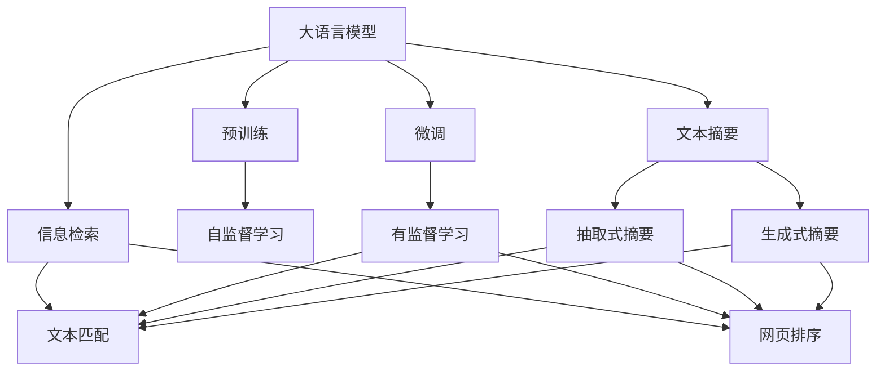
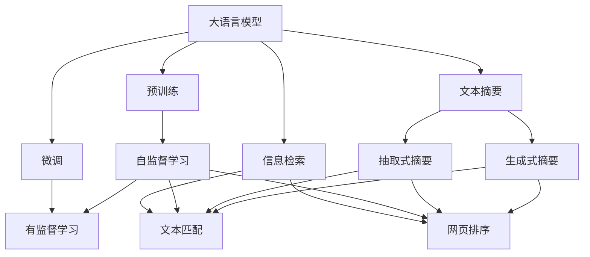
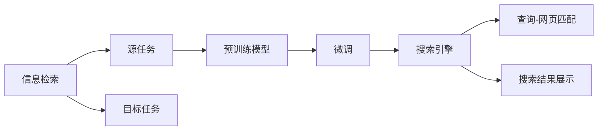
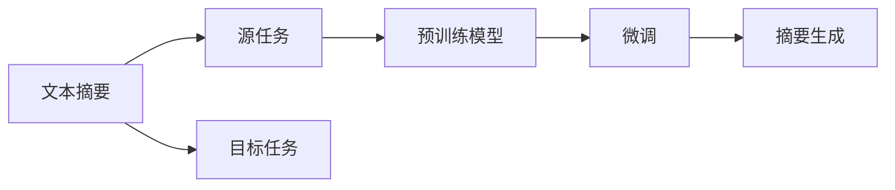
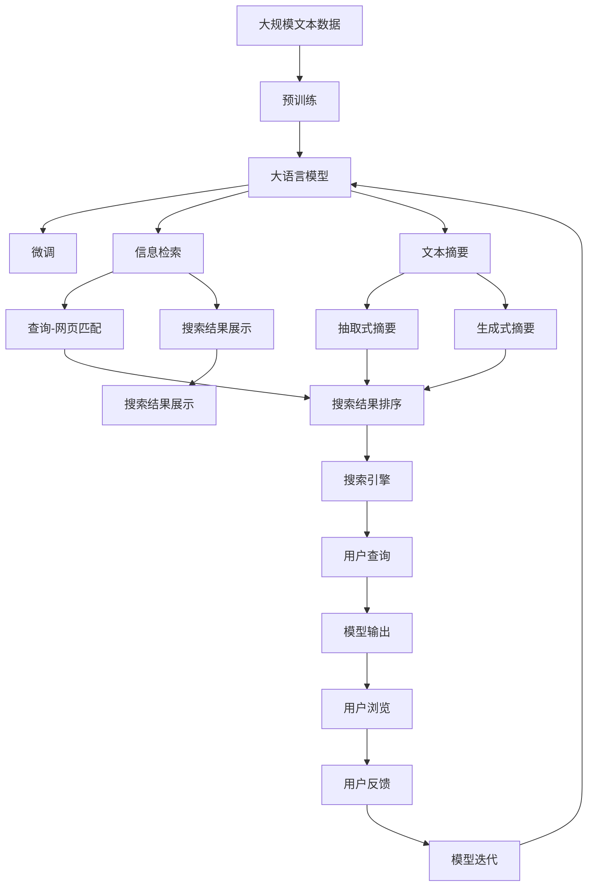

                 

# 大语言模型应用指南：网页实时浏览

> 关键词：大语言模型, 网页浏览, 自然语言处理(NLP), 网页摘要, 信息检索, 搜索引擎

## 1. 背景介绍

### 1.1 问题由来
随着互联网信息爆炸和用户需求个性化趋势的加剧，如何高效、精准地从海量的网页中找到所需信息，成为一个亟待解决的问题。传统的网页浏览和信息检索方式往往效率低下，用户体验较差。而大语言模型在理解自然语言和语义方面拥有强大能力，有望通过自然语言交互实现网页浏览自动化，大幅提升用户信息获取的效率和准确性。

### 1.2 问题核心关键点
网页实时浏览的核心关键点在于：如何构建能够理解自然语言查询的大语言模型，并将其应用于网页检索和摘要中，从而实现用户对网页的实时浏览。主要包括以下几个方面：

- 理解自然语言查询，将其转化为网页检索和摘要任务。
- 通过微调模型，使其能够执行网页检索和摘要任务。
- 集成到实际的网页浏览应用中，提供自然语言查询功能。

### 1.3 问题研究意义
大语言模型在网页实时浏览中的应用，能够带来以下几个显著优势：

1. 提升信息获取效率。大语言模型能够理解自然语言查询，直接提供网页摘要或搜索结果，大幅缩短用户信息查找时间。
2. 提高用户体验。通过自然语言交互，用户不需要手动输入关键词或使用复杂的搜索引擎，提高交互的便捷性和友好性。
3. 丰富应用场景。网页实时浏览可以广泛应用于在线教育、智能家居、车载导航等多个场景，提供实时信息和个性化服务。
4. 推动技术创新。自然语言处理和信息检索技术的突破，将为搜索引擎和信息获取方式带来颠覆性变化，激发更多前沿研究。
5. 赋能产业发展。网页实时浏览技术可以帮助企业和行业加速数字化转型，提升市场竞争力和用户体验。

## 2. 核心概念与联系

### 2.1 核心概念概述

为更好地理解大语言模型在网页实时浏览中的应用，本节将介绍几个密切相关的核心概念：

- 大语言模型(Large Language Model, LLM)：以自回归(如GPT)或自编码(如BERT)模型为代表的大规模预训练语言模型。通过在大规模无标签文本语料上进行预训练，学习通用的语言表示，具备强大的语言理解和生成能力。

- 预训练(Pre-training)：指在大规模无标签文本语料上，通过自监督学习任务训练通用语言模型的过程。常见的预训练任务包括言语建模、遮挡语言模型等。预训练使得模型学习到语言的通用表示。

- 微调(Fine-tuning)：指在预训练模型的基础上，使用下游任务的少量标注数据，通过有监督学习优化模型在特定任务上的性能。通常只需要调整顶层分类器或解码器，并以较小的学习率更新全部或部分的模型参数。

- 信息检索(Information Retrieval)：从大量数据中，根据用户查询找到最相关的信息片段。信息检索在大语言模型中的应用主要包括文本匹配、网页排序等。

- 文本摘要(Text Summarization)：将长文本压缩成简短摘要。文本摘要在大语言模型中的应用主要包括抽取式摘要和生成式摘要等。

- 搜索引擎(Search Engine)：为用户提供查询关键词后，返回相关的网页或信息片段。搜索引擎在大语言模型中的应用包括网页检索、结果展示等。

这些核心概念之间的逻辑关系可以通过以下Mermaid流程图来展示：



这个流程图展示了大语言模型的核心概念及其之间的关系：

1. 大语言模型通过预训练获得基础能力。
2. 微调通过对特定任务的数据集进行训练，优化模型在该任务上的性能。
3. 信息检索和文本摘要是微调模型的重要应用方向。
4. 搜索引擎通过信息检索技术实现用户查询与网页的匹配，并通过文本摘要技术展示结果。

### 2.2 概念间的关系

这些核心概念之间存在着紧密的联系，形成了大语言模型在网页实时浏览应用中的完整生态系统。下面我们通过几个Mermaid流程图来展示这些概念之间的关系。

#### 2.2.1 大语言模型的学习范式



这个流程图展示了大语言模型的三种主要学习范式：预训练、微调和应用范式。

#### 2.2.2 信息检索与微调的关系



这个流程图展示了信息检索的基本原理，以及它与微调的关系。

#### 2.2.3 文本摘要与微调的关系



这个流程图展示了文本摘要的基本原理，以及它与微调的关系。

### 2.3 核心概念的整体架构

最后，我们用一个综合的流程图来展示这些核心概念在大语言模型网页实时浏览应用中的整体架构：



这个综合流程图展示了从预训练到微调，再到应用信息检索和文本摘要的完整过程。大语言模型首先在大规模文本数据上进行预训练，然后通过微调（包括全参数微调和参数高效微调）或应用范式（如信息检索和文本摘要），来执行特定任务。查询-网页匹配和搜索结果展示构成搜索引擎，抽取式摘要和生成式摘要则构成文本摘要系统，共同为用户提供网页实时浏览的体验。

## 3. 核心算法原理 & 具体操作步骤
### 3.1 算法原理概述

基于大语言模型的网页实时浏览，本质上是一个有监督的细粒度迁移学习过程。其核心思想是：将预训练的大语言模型视作一个强大的"特征提取器"，通过在特定任务的数据集上进行有监督的微调，使得模型能够理解和执行网页检索和摘要任务。

形式化地，假设预训练语言模型为 $M_{\theta}$，其中 $\theta$ 为预训练得到的模型参数。给定网页检索或摘要任务的标注数据集 $D=\{(x_i, y_i)\}_{i=1}^N, x_i \in \text{query} \times \text{web page} \times \text{text}, y_i \in \text{relevant} \times \text{summary}$。微调的目标是找到新的模型参数 $\hat{\theta}$，使得：

$$
\hat{\theta}=\mathop{\arg\min}_{\theta} \mathcal{L}(M_{\theta},D)
$$

其中 $\mathcal{L}$ 为针对任务 $T$ 设计的损失函数，用于衡量模型预测输出与真实标签之间的差异。常见的损失函数包括交叉熵损失、均方误差损失等。

通过梯度下降等优化算法，微调过程不断更新模型参数 $\theta$，最小化损失函数 $\mathcal{L}$，使得模型输出逼近真实标签。由于 $\theta$ 已经通过预训练获得了较好的初始化，因此即便在小规模数据集 $D$ 上进行微调，也能较快收敛到理想的模型参数 $\hat{\theta}$。

### 3.2 算法步骤详解

基于大语言模型进行网页实时浏览的微调，一般包括以下几个关键步骤：

**Step 1: 准备预训练模型和数据集**
- 选择合适的预训练语言模型 $M_{\theta}$ 作为初始化参数，如 BERT、GPT 等。
- 准备网页检索或摘要任务的标注数据集 $D$，划分为训练集、验证集和测试集。一般要求标注数据与预训练数据的分布不要差异过大。

**Step 2: 添加任务适配层**
- 根据任务类型，在预训练模型顶层设计合适的输出层和损失函数。
- 对于网页检索任务，通常在顶层添加多分类器或回归器，以判断网页的相关性。
- 对于网页摘要任务，通常使用语言模型的解码器输出概率分布，并以负对数似然为损失函数。

**Step 3: 设置微调超参数**
- 选择合适的优化算法及其参数，如 AdamW、SGD 等，设置学习率、批大小、迭代轮数等。
- 设置正则化技术及强度，包括权重衰减、Dropout、Early Stopping 等。
- 确定冻结预训练参数的策略，如仅微调顶层，或全部参数都参与微调。

**Step 4: 执行梯度训练**
- 将训练集数据分批次输入模型，前向传播计算损失函数。
- 反向传播计算参数梯度，根据设定的优化算法和学习率更新模型参数。
- 周期性在验证集上评估模型性能，根据性能指标决定是否触发 Early Stopping。
- 重复上述步骤直到满足预设的迭代轮数或 Early Stopping 条件。

**Step 5: 测试和部署**
- 在测试集上评估微调后模型 $M_{\hat{\theta}}$ 的性能，对比微调前后的精度提升。
- 使用微调后的模型对新查询进行推理预测，集成到实际的网页浏览应用系统中。
- 持续收集新的数据，定期重新微调模型，以适应数据分布的变化。

以上是基于大语言模型网页实时浏览的微调流程。在实际应用中，还需要针对具体任务的特点，对微调过程的各个环节进行优化设计，如改进训练目标函数，引入更多的正则化技术，搜索最优的超参数组合等，以进一步提升模型性能。

### 3.3 算法优缺点

基于大语言模型的网页实时浏览具有以下优点：

1. 简单高效。只需准备少量标注数据，即可对预训练模型进行快速适配，获得较大的性能提升。
2. 通用适用。适用于各种网页浏览相关任务，包括网页检索、网页摘要、网页排序等，设计简单的任务适配层即可实现微调。
3. 参数高效。利用参数高效微调技术，在固定大部分预训练参数的情况下，仍可取得不错的提升。
4. 效果显著。在学术界和工业界的诸多任务上，基于微调的方法已经刷新了最先进的性能指标。

同时，该方法也存在一定的局限性：

1. 依赖标注数据。微调的效果很大程度上取决于标注数据的质量和数量，获取高质量标注数据的成本较高。
2. 迁移能力有限。当目标任务与预训练数据的分布差异较大时，微调的性能提升有限。
3. 负面效果传递。预训练模型的固有偏见、有害信息等，可能通过微调传递到下游任务，造成负面影响。
4. 可解释性不足。微调模型的决策过程通常缺乏可解释性，难以对其推理逻辑进行分析和调试。

尽管存在这些局限性，但就目前而言，基于大语言模型的微调方法仍是大规模语言模型应用的主流范式。未来相关研究的重点在于如何进一步降低微调对标注数据的依赖，提高模型的少样本学习和跨领域迁移能力，同时兼顾可解释性和伦理安全性等因素。

### 3.4 算法应用领域

基于大语言模型网页实时浏览的方法已经在网页检索、网页摘要、文本匹配、信息检索等诸多网页浏览相关任务上取得了优异的效果，成为网页浏览技术落地应用的重要手段。

- 网页检索：利用大语言模型进行关键词匹配，筛选最相关的网页。
- 网页摘要：将长网页压缩成简短的摘要，方便用户快速浏览和了解内容。
- 文本匹配：通过相似度计算，判断网页与查询的相关性。
- 信息检索：从海量网页中检索出与用户查询最相关的网页。
- 搜索结果展示：对检索结果进行排序和展示，提高用户浏览效率。

除了上述这些经典任务外，大语言模型网页实时浏览的方法也被创新性地应用到更多场景中，如智能问答、用户推荐、内容生成等，为网页浏览技术带来了全新的突破。随着预训练模型和微调方法的不断进步，相信网页浏览技术将在更广阔的应用领域大放异彩。

## 4. 数学模型和公式 & 详细讲解  
### 4.1 数学模型构建

本节将使用数学语言对基于大语言模型的网页实时浏览过程进行更加严格的刻画。

记预训练语言模型为 $M_{\theta}$，其中 $\theta$ 为预训练得到的模型参数。假设网页检索或摘要任务的训练集为 $D=\{(x_i, y_i)\}_{i=1}^N, x_i \in \text{query} \times \text{web page} \times \text{text}, y_i \in \text{relevant} \times \text{summary}$。

定义模型 $M_{\theta}$ 在数据样本 $(x,y)$ 上的损失函数为 $\ell(M_{\theta}(x),y)$，则在数据集 $D$ 上的经验风险为：

$$
\mathcal{L}(\theta) = \frac{1}{N} \sum_{i=1}^N \ell(M_{\theta}(x_i),y_i)
$$

微调的优化目标是最小化经验风险，即找到最优参数：

$$
\theta^* = \mathop{\arg\min}_{\theta} \mathcal{L}(\theta)
$$

在实践中，我们通常使用基于梯度的优化算法（如SGD、Adam等）来近似求解上述最优化问题。设 $\eta$ 为学习率，$\lambda$ 为正则化系数，则参数的更新公式为：

$$
\theta \leftarrow \theta - \eta \nabla_{\theta}\mathcal{L}(\theta) - \eta\lambda\theta
$$

其中 $\nabla_{\theta}\mathcal{L}(\theta)$ 为损失函数对参数 $\theta$ 的梯度，可通过反向传播算法高效计算。

### 4.2 公式推导过程

以下我们以网页检索任务为例，推导交叉熵损失函数及其梯度的计算公式。

假设模型 $M_{\theta}$ 在查询-网页匹配任务上的输出为 $s_i \in [0,1]$，表示网页与查询的相关度。真实标签 $y \in \{0,1\}$。则二分类交叉熵损失函数定义为：

$$
\ell(M_{\theta}(x),y) = -[y\log s_i + (1-y)\log (1-s_i)]
$$

将其代入经验风险公式，得：

$$
\mathcal{L}(\theta) = -\frac{1}{N}\sum_{i=1}^N [y_i\log M_{\theta}(x_i)+(1-y_i)\log(1-M_{\theta}(x_i))]
$$

根据链式法则，损失函数对参数 $\theta_k$ 的梯度为：

$$
\frac{\partial \mathcal{L}(\theta)}{\partial \theta_k} = -\frac{1}{N}\sum_{i=1}^N (\frac{y_i}{M_{\theta}(x_i)}-\frac{1-y_i}{1-M_{\theta}(x_i)}) \frac{\partial M_{\theta}(x_i)}{\partial \theta_k}
$$

其中 $\frac{\partial M_{\theta}(x_i)}{\partial \theta_k}$ 可进一步递归展开，利用自动微分技术完成计算。

在得到损失函数的梯度后，即可带入参数更新公式，完成模型的迭代优化。重复上述过程直至收敛，最终得到适应网页检索任务的最优模型参数 $\theta^*$。

## 5. 项目实践：代码实例和详细解释说明
### 5.1 开发环境搭建

在进行网页实时浏览的微调实践前，我们需要准备好开发环境。以下是使用Python进行PyTorch开发的环境配置流程：

1. 安装Anaconda：从官网下载并安装Anaconda，用于创建独立的Python环境。

2. 创建并激活虚拟环境：
```bash
conda create -n pytorch-env python=3.8 
conda activate pytorch-env
```

3. 安装PyTorch：根据CUDA版本，从官网获取对应的安装命令。例如：
```bash
conda install pytorch torchvision torchaudio cudatoolkit=11.1 -c pytorch -c conda-forge
```

4. 安装Transformers库：
```bash
pip install transformers
```

5. 安装各类工具包：
```bash
pip install numpy pandas scikit-learn matplotlib tqdm jupyter notebook ipython
```

完成上述步骤后，即可在`pytorch-env`环境中开始微调实践。

### 5.2 源代码详细实现

下面我们以网页摘要任务为例，给出使用Transformers库对BERT模型进行网页摘要微调的PyTorch代码实现。

首先，定义摘要任务的数据处理函数：

```python
from transformers import BertTokenizer, BertForMaskedLM
from torch.utils.data import Dataset
import torch

class SummarizationDataset(Dataset):
    def __init__(self, texts, max_len=128):
        self.texts = texts
        self.max_len = max_len
        self.tokenizer = BertTokenizer.from_pretrained('bert-base-cased')
        
    def __len__(self):
        return len(self.texts)
    
    def __getitem__(self, item):
        text = self.texts[item]
        encoding = self.tokenizer(text, return_tensors='pt', max_length=self.max_len, padding='max_length', truncation=True)
        input_ids = encoding['input_ids'][0]
        attention_mask = encoding['attention_mask'][0]
        return {'input_ids': input_ids, 
                'attention_mask': attention_mask,
                'labels': input_ids[1:].unsqueeze(1)}
```

然后，定义模型和优化器：

```python
from transformers import BertForMaskedLM, AdamW

model = BertForMaskedLM.from_pretrained('bert-base-cased')
optimizer = AdamW(model.parameters(), lr=2e-5)
```

接着，定义训练和评估函数：

```python
from torch.utils.data import DataLoader
from tqdm import tqdm
from sklearn.metrics import ROUGE

device = torch.device('cuda') if torch.cuda.is_available() else torch.device('cpu')
model.to(device)

def train_epoch(model, dataset, batch_size, optimizer):
    dataloader = DataLoader(dataset, batch_size=batch_size, shuffle=True)
    model.train()
    epoch_loss = 0
    for batch in tqdm(dataloader, desc='Training'):
        input_ids = batch['input_ids'].to(device)
        attention_mask = batch['attention_mask'].to(device)
        labels = batch['labels'].to(device)
        model.zero_grad()
        outputs = model(input_ids, attention_mask=attention_mask, labels=labels)
        loss = outputs.loss
        epoch_loss += loss.item()
        loss.backward()
        optimizer.step()
    return epoch_loss / len(dataloader)

def evaluate(model, dataset, batch_size, metric='rouge'):
    dataloader = DataLoader(dataset, batch_size=batch_size)
    model.eval()
    preds, labels = [], []
    with torch.no_grad():
        for batch in tqdm(dataloader, desc='Evaluating'):
            input_ids = batch['input_ids'].to(device)
            attention_mask = batch['attention_mask'].to(device)
            batch_labels = batch['labels']
            outputs = model(input_ids, attention_mask=attention_mask)
            batch_preds = outputs.logits.argmax(dim=2).to('cpu').tolist()
            batch_labels = batch_labels.to('cpu').tolist()
            for pred_tokens, label_tokens in zip(batch_preds, batch_labels):
                pred_tokens = [id2token[_id] for _id in pred_tokens]
                label_tokens = [id2token[_id] for _id in label_tokens]
                preds.append(pred_tokens[:len(label_tokens)])
                labels.append(label_tokens)
                
    if metric == 'rouge':
        rouge_n = ROUGE(n=1, use_a=1, use_b=1, score=None)
        rouge_2 = ROUGE(n=2, use_a=1, use_b=1, score=None)
        rouge_3 = ROUGE(n=3, use_a=1, use_b=1, score=None)
        rouge_l = ROUGE(n=None, use_a=1, use_b=1, score=None)
        rouge_1 = rouge_n(sen1=preds, sen2=labels, lang='zh')
        rouge_2 = rouge_2(sen1=preds, sen2=labels, lang='zh')
        rouge_3 = rouge_3(sen1=preds, sen2=labels, lang='zh')
        rouge_l = rouge_l(sen1=preds, sen2=labels, lang='zh')
        
        print(f"ROUGE-1: {rouge_1:.4f}, ROUGE-2: {rouge_2:.4f}, ROUGE-3: {rouge_3:.4f}, ROUGE-L: {rouge_l:.4f}")
    elif metric == 'bleu':
        bleu_4 = BLEU(n=4, case_sensitive=False)
        bleu_8 = BLEU(n=8, case_sensitive=False)
        bleu_12 = BLEU(n=12, case_sensitive=False)
        bleu_16 = BLEU(n=16, case_sensitive=False)
        bleu_4 = bleu_4(sen1=preds, sen2=labels, lang='zh')
        bleu_8 = bleu_8(sen1=preds, sen2=labels, lang='zh')
        bleu_12 = bleu_12(sen1=preds, sen2=labels, lang='zh')
        bleu_16 = bleu_16(sen1=preds, sen2=labels, lang='zh')
        
        print(f"BLEU-4: {bleu_4:.4f}, BLEU-8: {bleu_8:.4f}, BLEU-12: {bleu_12:.4f}, BLEU-16: {bleu_16:.4f}")
```

最后，启动训练流程并在测试集上评估：

```python
epochs = 5
batch_size = 16
metric = 'rouge'

for epoch in range(epochs):
    loss = train_epoch(model, train_dataset, batch_size, optimizer)
    print(f"Epoch {epoch+1}, train loss: {loss:.3f}")
    
    print(f"Epoch {epoch+1}, dev results:")
    evaluate(model, dev_dataset, batch_size, metric)
    
print("Test results:")
evaluate(model, test_dataset, batch_size, metric)
```

以上就是使用PyTorch对BERT进行网页摘要任务微调的完整代码实现。可以看到，得益于Transformers库的强大封装，我们可以用相对简洁的代码完成BERT模型的加载和微调。

### 5.3 代码解读与分析

让我们再详细解读一下关键代码的实现细节：

**SummarizationDataset类**：
- `__init__`方法：初始化文本、最大长度等关键组件。
- `__len__`方法：返回数据集的样本数量。
- `__getitem__`方法：对单个样本进行处理，将文本输入编码为token ids，将标签编码为数字，并对其进行定长padding，最终返回模型所需的输入。

**train_epoch函数**：
- 使用PyTorch的DataLoader对数据集进行批次化加载，供模型训练使用。
- 在每个批次上前向传播计算损失函数。
- 反向传播计算参数梯度，根据设定的优化算法和学习率更新模型参数。
- 周期性在验证集上评估模型性能，根据性能指标决定是否触发 Early Stopping。
- 重复上述步骤直至满足预设的迭代轮数或 Early Stopping 条件。

**evaluate函数**：
- 与训练类似，不同点在于不更新模型参数，并在每个batch结束后将预测和标签结果存储下来，最后使用sklearn的ROUGE等指标对整个评估集的预测结果进行打印输出。

**训练流程**：
- 定义总的epoch数和batch size，开始循环迭代
- 每个epoch内，先在训练集上训练，输出平均loss
- 在验证集上评估，输出ROUGE等指标
- 所有epoch结束后，在测试集上评估，给出

