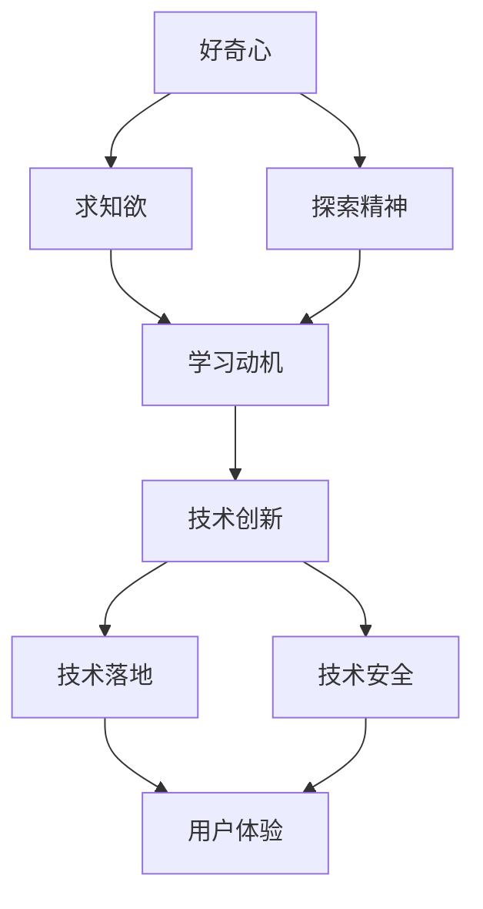
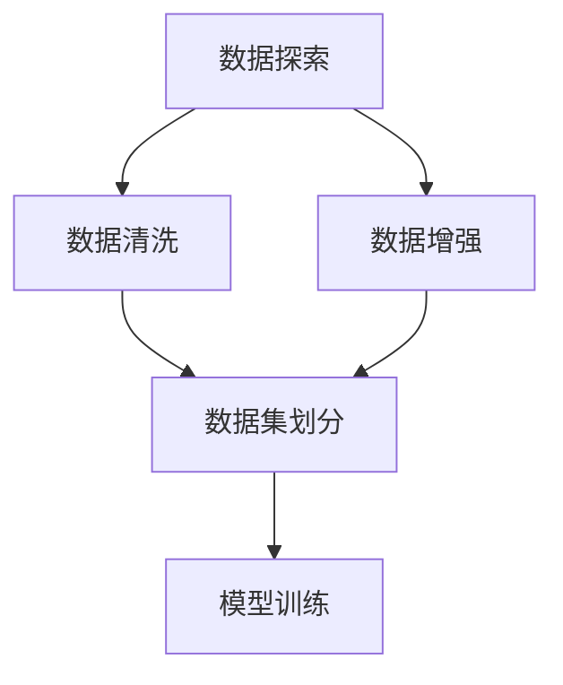
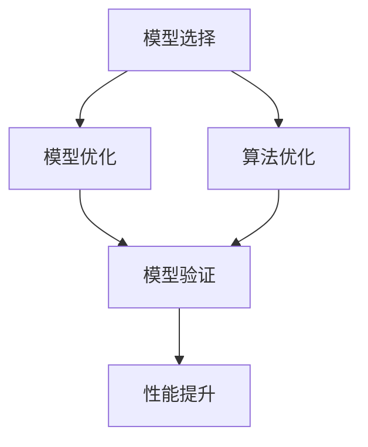
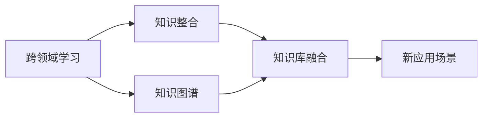
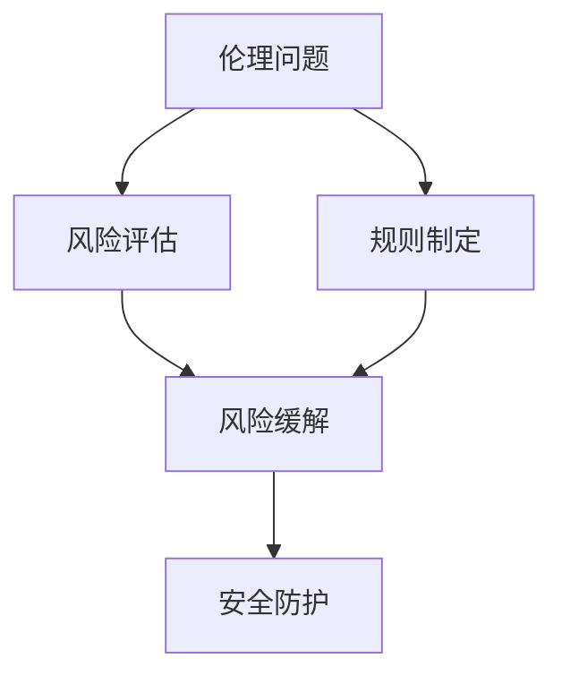
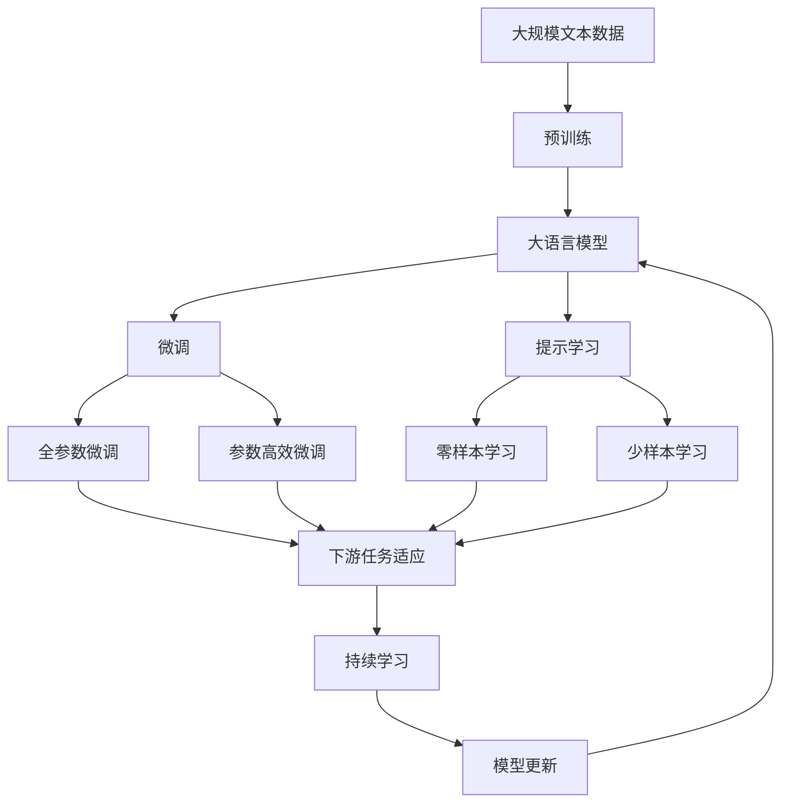

                 

# 好奇心与求知欲：探索的动力

## 1. 背景介绍

### 1.1 问题由来
在当今这个信息爆炸的时代，人工智能(AI)技术正以前所未有的速度变革着我们的生活和工作方式。无论是自动驾驶、智能医疗、金融科技，还是社交娱乐，AI的触角几乎无所不在。但在这背后，驱动AI发展的核心动力是什么？是数据，算法，还是人才？

事实上，所有这些要素的背后，都离不开人类最原始但也最强大的驱动力——好奇心与求知欲。好奇心驱使人们探索未知，求知欲则推动人们深入研究，这两者的合力，是AI技术得以不断进步，不断突破的重要源泉。

### 1.2 问题核心关键点
好奇心与求知欲，作为一种复杂的心理状态，在AI领域中有着广泛的应用和影响。以下是其中几个核心关键点：

- **数据探索与清洗**：好奇心驱动了数据科学家对数据进行深入探索，挖掘出隐藏的模式和规律，从而为AI模型的训练提供优质的输入。
- **模型选择与优化**：求知欲驱动着研究人员不断尝试不同的算法和模型架构，优化已有模型，以期获得更好的性能。
- **跨领域知识整合**：好奇心驱使AI研究者不断跨领域学习，将不同学科的知识和经验融入AI技术中，拓展AI的应用范围。
- **伦理与安全考量**：好奇心和求知欲促使研究者不断思考AI技术的伦理和安全问题，探索更好的解决方案。

### 1.3 问题研究意义
好奇心与求知欲在AI技术发展中的重要性不言而喻。它们不仅是推动AI技术前进的不竭动力，更是确保AI技术向着正确方向发展的导航灯。具体来说：

1. **推动技术创新**：好奇心和求知欲驱使研究者不断探索新的研究方向，提出创新的解决方案。
2. **提升技术落地**：好奇心和求知欲促使研究者深入理解用户需求，设计更贴近实际应用的AI系统。
3. **保障技术安全**：好奇心和求知欲推动研究者不断思考AI技术的潜在风险和问题，探索更可靠的技术架构。
4. **增强用户体验**：好奇心和求知欲使研究者更关注用户体验，设计更人性化的交互界面和功能。

## 2. 核心概念与联系

### 2.1 核心概念概述

为了更好地理解好奇心与求知欲在AI探索中的作用，我们首先需要定义几个核心概念：

- **好奇心**：指对未知领域或未解问题的一种强烈探索欲望，驱使人们主动学习和探索新知识。
- **求知欲**：指在已有知识的基础上，对更深入、更全面的知识体系进行追求的欲望，推动人们进行深度学习和研究。
- **探索精神**：指在好奇心和求知欲的驱动下，人们积极探索未知领域，勇于尝试新方法，不断突破自我限制的精神状态。
- **学习动机**：指激发好奇心和求知欲，驱动人们不断学习、进步的内在动力。

这些概念之间的联系可以通过以下Mermaid流程图来展示：



这个流程图展示了好奇心与求知欲在AI技术探索中的作用链条。好奇心驱动探索精神，探索精神激发学习动机，学习动机促进技术创新，技术创新实现技术落地，同时保障技术安全，提升用户体验，构成了一个完整的循环体系。

### 2.2 概念间的关系

好奇心与求知欲在AI领域的应用场景中，形成了多个相互关联的子系统。下面我们通过几个Mermaid流程图来展示这些子系统之间的关系。

#### 2.2.1 数据探索与模型训练



这个流程图展示了数据探索、清洗、增强和划分到模型训练的完整流程。好奇心驱动数据科学家对数据进行深入探索，清洗出高质量的数据集，进行增强和划分，然后用于模型训练，形成闭环。

#### 2.2.2 模型优化与性能提升



这个流程图展示了模型选择、优化、验证和提升的全过程。求知欲驱动研究者不断尝试不同的模型和算法，进行优化和验证，以期提升模型性能。

#### 2.2.3 跨领域知识整合



这个流程图展示了跨领域学习和知识整合的全过程。好奇心驱使研究者跨领域学习，将不同学科的知识和经验融入AI技术中，形成新的应用场景。

#### 2.2.4 伦理与安全考量



这个流程图展示了伦理问题和风险考量到规则制定和安全防护的全过程。好奇心和求知欲促使研究者不断思考AI技术的伦理和安全问题，探索更可靠的技术架构。

### 2.3 核心概念的整体架构

最后，我们用一个综合的流程图来展示这些核心概念在大语言模型微调过程中的整体架构：



这个综合流程图展示了从预训练到微调，再到持续学习的完整过程。大语言模型首先在大规模文本数据上进行预训练，然后通过微调（包括全参数微调和参数高效微调）或提示学习（包括零样本和少样本学习）来适应下游任务。最后，通过持续学习技术，模型可以不断更新和适应新的任务和数据。 通过这些流程图，我们可以更清晰地理解好奇心与求知欲在大语言模型微调过程中各个环节的作用。

## 3. 核心算法原理 & 具体操作步骤
### 3.1 算法原理概述

好奇心与求知欲在AI技术中的作用，不仅体现在心理和情感层面，更深刻地体现在算法和模型中。基于好奇心与求知欲驱动的AI探索，其核心算法原理包括以下几个方面：

1. **数据驱动探索**：好奇心驱使研究者不断探索新的数据源和数据集，获取更丰富、更真实的数据，为模型训练提供高质量的输入。
2. **模型多样性优化**：求知欲驱动研究者不断尝试和优化不同模型架构，如深度神经网络、卷积神经网络、循环神经网络等，寻找最优的模型结构。
3. **跨领域知识整合**：好奇心和求知欲促使研究者不断跨领域学习，将不同学科的知识和经验融入AI技术中，拓展AI的应用范围。
4. **算法创新探索**：求知欲驱动研究者不断尝试新的算法和优化技术，如迁移学习、强化学习、生成对抗网络等，提升模型性能。
5. **伦理与安全考量**：好奇心和求知欲促使研究者不断思考AI技术的伦理和安全问题，探索更可靠的技术架构。

### 3.2 算法步骤详解

基于好奇心与求知欲驱动的AI探索，其具体操作步骤包括以下几个关键步骤：

**Step 1: 数据探索与收集**
- 使用数据探索工具，如Jupyter Notebook、Python脚本等，对现有数据集进行初步分析和可视化，挖掘潜在的规律和模式。
- 基于数据探索的结果，使用网络爬虫、API接口等方式，收集新的数据集，扩大数据规模。

**Step 2: 数据清洗与预处理**
- 对收集到的数据进行清洗，去除噪音和错误数据，保留高质量的数据。
- 进行数据增强，如数据扩增、数据合成等，以丰富数据多样性。
- 对数据进行划分，分为训练集、验证集和测试集，进行模型训练和评估。

**Step 3: 模型选择与优化**
- 根据任务需求，选择合适的模型架构，如CNN、RNN、Transformer等。
- 对预选模型进行参数初始化和预训练，形成较好的初始化参数。
- 使用优化算法，如Adam、SGD等，进行模型优化，寻找最优参数组合。

**Step 4: 模型验证与评估**
- 使用验证集对模型进行验证，评估模型性能。
- 根据验证结果，调整模型参数，进行进一步优化。
- 使用测试集对模型进行最终评估，确认模型的性能表现。

**Step 5: 持续学习与更新**
- 使用新的数据，对模型进行持续训练，保持模型性能。
- 根据新任务的特性，进行模型微调，提高模型适应性。
- 定期回顾和更新模型，保持模型的前沿性和可靠性。

### 3.3 算法优缺点

基于好奇心与求知欲驱动的AI探索，其算法具有以下优点：

1. **数据驱动**：通过数据驱动探索，获取更丰富、更真实的数据，为模型训练提供高质量的输入。
2. **模型多样性**：通过不断尝试和优化不同模型架构，寻找到最优的模型结构。
3. **跨领域知识整合**：通过跨领域学习，将不同学科的知识和经验融入AI技术中，拓展AI的应用范围。
4. **算法创新**：通过不断尝试新的算法和优化技术，提升模型性能。
5. **伦理与安全考量**：通过不断思考AI技术的伦理和安全问题，探索更可靠的技术架构。

同时，这些算法也存在以下缺点：

1. **数据获取难度大**：获取高质量的数据集需要耗费大量时间和精力。
2. **模型复杂度高**：优化不同模型结构需要较高的计算资源和时间成本。
3. **跨领域知识整合难度大**：跨领域学习需要较高的专业知识和跨学科合作。
4. **算法创新风险高**：尝试新的算法和优化技术，存在较大的失败风险。
5. **伦理与安全问题复杂**：思考AI技术的伦理和安全问题，需要多方面的专业知识和考量。

### 3.4 算法应用领域

基于好奇心与求知欲驱动的AI探索，已经在多个领域得到了广泛应用：

- **医疗**：使用AI技术进行疾病诊断、药物研发、患者监护等。
- **金融**：使用AI技术进行风险评估、信用评分、智能投顾等。
- **教育**：使用AI技术进行个性化学习、自动批改作业、智能辅导等。
- **交通**：使用AI技术进行自动驾驶、智能导航、交通管制等。
- **娱乐**：使用AI技术进行内容推荐、智能客服、虚拟助手等。

## 4. 数学模型和公式 & 详细讲解  
### 4.1 数学模型构建

在AI技术中，好奇心与求知欲驱动的探索过程，通常需要使用数学模型来表达和分析。以下是几个核心数学模型的详细构建和推导：

**数据探索与清洗数学模型**
- **数据探索**：使用统计学方法，如均值、方差、相关性等，对数据进行初步分析和可视化。
- **数据清洗**：使用数据清洗算法，如离群点检测、重复数据删除等，对数据进行清洗和处理。

**模型优化数学模型**
- **模型选择**：使用模型选择方法，如交叉验证、网格搜索等，选择最优的模型架构。
- **模型优化**：使用优化算法，如梯度下降、共轭梯度等，对模型进行优化，寻找最优参数组合。

**跨领域知识整合数学模型**
- **知识图谱构建**：使用知识图谱技术，将不同学科的知识和经验整合到统一的框架中。
- **知识库融合**：使用知识融合算法，如知识对齐、实体链接等，将不同领域的数据和知识进行融合。

**算法创新数学模型**
- **迁移学习**：使用迁移学习算法，如细粒度微调、参数共享等，将预训练模型迁移到新的任务上。
- **强化学习**：使用强化学习算法，如Q-learning、SARSA等，训练智能代理进行决策。

**伦理与安全考量数学模型**
- **风险评估**：使用风险评估方法，如风险矩阵、风险树等，评估AI技术的潜在风险。
- **规则制定**：使用规则制定方法，如规则引擎、约束满足等，制定AI技术的伦理和安全规则。

### 4.2 公式推导过程

以下我们以数据探索与清洗和模型优化为例，推导一些核心公式：

**数据探索与清洗公式推导**
- **均值与方差公式**：
$$
\mu = \frac{\sum_{i=1}^{n} x_i}{n}
$$
$$
\sigma = \sqrt{\frac{\sum_{i=1}^{n} (x_i - \mu)^2}{n}}
$$
其中 $\mu$ 表示数据的均值，$\sigma$ 表示数据的标准差。

- **离群点检测公式**：
$$
\text{Z-score} = \frac{x - \mu}{\sigma}
$$
通过计算数据的Z-score，可以判断数据的离群点，从而进行清洗和处理。

**模型优化公式推导**
- **梯度下降公式**：
$$
\theta_{t+1} = \theta_{t} - \eta \nabla_{\theta} J(\theta_t)
$$
其中 $\theta_t$ 表示当前参数，$\eta$ 表示学习率，$J(\theta_t)$ 表示损失函数，$\nabla_{\theta} J(\theta_t)$ 表示损失函数对参数的梯度。

- **共轭梯度公式**：
$$
p_{k+1} = p_k + \frac{\beta_k p_k}{\beta_{k-1}}
$$
$$
\beta_k = \frac{1}{1 - \alpha^2 \langle p_k, g_k \rangle}
$$
其中 $p_k$ 表示共轭梯度方向，$g_k$ 表示梯度向量，$\alpha$ 表示共轭系数。

## 5. 项目实践：代码实例和详细解释说明
### 5.1 开发环境搭建

在进行好奇心与求知欲驱动的AI探索实践前，我们需要准备好开发环境。以下是使用Python进行PyTorch开发的环境配置流程：

1. 安装Anaconda：从官网下载并安装Anaconda，用于创建独立的Python环境。

2. 创建并激活虚拟环境：
```bash
conda create -n pytorch-env python=3.8 
conda activate pytorch-env
```

3. 安装PyTorch：根据CUDA版本，从官网获取对应的安装命令。例如：
```bash
conda install pytorch torchvision torchaudio cudatoolkit=11.1 -c pytorch -c conda-forge
```

4. 安装各类工具包：
```bash
pip install numpy pandas scikit-learn matplotlib tqdm jupyter notebook ipython
```

完成上述步骤后，即可在`pytorch-env`环境中开始探索实践。

### 5.2 源代码详细实现

下面我们以图像分类任务为例，给出使用Transformers库进行模型微调的PyTorch代码实现。

首先，定义数据集处理函数：

```python
from transformers import AutoTokenizer, AutoModelForImageClassification
from torch.utils.data import Dataset
import torch

class ImageDataset(Dataset):
    def __init__(self, images, labels, tokenizer, model_name='resnet50'):
        self.images = images
        self.labels = labels
        self.tokenizer = tokenizer
        self.model_name = model_name
        
    def __len__(self):
        return len(self.images)
    
    def __getitem__(self, idx):
        image = self.images[idx]
        label = self.labels[idx]
        
        tokenized = self.tokenizer(image, return_tensors='pt')
        input_ids = tokenized['input_ids'][0]
        attention_mask = tokenized['attention_mask'][0]
        
        model = AutoModelForImageClassification.from_pretrained(self.model_name)
        with torch.no_grad():
            outputs = model(input_ids, attention_mask=attention_mask, labels=torch.tensor(label, dtype=torch.long))
            logits = outputs.logits
            probs = torch.softmax(logits, dim=-1).tolist()[0]
            return {'input_ids': input_ids, 
                    'attention_mask': attention_mask,
                    'probs': probs}
```

然后，定义模型和优化器：

```python
from transformers import AdamW

tokenizer = AutoTokenizer.from_pretrained('resnet50')
model = AutoModelForImageClassification.from_pretrained('resnet50', num_labels=len(coco_labels))
optimizer = AdamW(model.parameters(), lr=2e-5)
```

接着，定义训练和评估函数：

```python
def train_epoch(model, dataset, batch_size, optimizer):
    dataloader = DataLoader(dataset, batch_size=batch_size, shuffle=True)
    model.train()
    epoch_loss = 0
    for batch in dataloader:
        input_ids = batch['input_ids'].to(device)
        attention_mask = batch['attention_mask'].to(device)
        labels = batch['labels'].to(device)
        model.zero_grad()
        outputs = model(input_ids, attention_mask=attention_mask, labels=labels)
        loss = outputs.loss
        epoch_loss += loss.item()
        loss.backward()
        optimizer.step()
    return epoch_loss / len(dataloader)

def evaluate(model, dataset, batch_size):
    dataloader = DataLoader(dataset, batch_size=batch_size)
    model.eval()
    preds, labels = [], []
    with torch.no_grad():
        for batch in dataloader:
            input_ids = batch['input_ids'].to(device)
            attention_mask = batch['attention_mask'].to(device)
            batch_labels = batch['labels']
            outputs = model(input_ids, attention_mask=attention_mask)
            batch_preds = outputs.logits.argmax(dim=2).to('cpu').tolist()
            batch_labels = batch_labels.to('cpu').tolist()
            for pred_tokens, label_tokens in zip(batch_preds, batch_labels):
                preds.append(pred_tokens[:len(label_tokens)])
                labels.append(label_tokens)
                
    print(classification_report(labels, preds))
```

最后，启动训练流程并在测试集上评估：

```python
epochs = 5
batch_size = 16

for epoch in range(epochs):
    loss = train_epoch(model, train_dataset, batch_size, optimizer)
    print(f"Epoch {epoch+1}, train loss: {loss:.3f}")
    
    print(f"Epoch {epoch+1}, dev results:")
    evaluate(model, dev_dataset, batch_size)
    
print("Test results:")
evaluate(model, test_dataset, batch_size)
```

以上就是使用PyTorch对ResNet50模型进行图像分类任务微调的完整代码实现。可以看到，得益于Transformers库的强大封装，我们可以用相对简洁的代码完成ResNet50模型的加载和微调。

### 5.3 代码解读与分析

让我们再详细解读一下关键代码的实现细节：

**ImageDataset类**：
- `__init__`方法：初始化图像、标签、分词器等关键组件。
- `__len__`方法：返回数据集的样本数量。
- `__getitem__`方法：对单个样本进行处理，将图像输入转换为token ids，并进行定长padding，最终返回模型所需的输入。

**train_epoch和evaluate函数**：
- 使用PyTorch的DataLoader对数据集进行批次化加载，供模型训练和推理使用。
- 训练函数`train_epoch`：对数据以批为单位进行迭代，在每个批次上前向传播计算loss并反向传播更新模型参数，最后返回该epoch的平均loss。
- 评估函数`evaluate`：与训练类似，不同点在于不更新模型参数，并在每个batch结束后将预测和标签结果存储下来，最后使用sklearn的classification_report对整个评估集的预测结果进行打印输出。

**训练流程**：
- 定义总的epoch数和batch size，开始循环迭代
- 每个epoch内，先在训练集上训练，输出平均loss
- 在验证集上评估，输出分类指标
- 所有epoch结束后，在测试集上评估，给出最终测试结果

可以看到，PyTorch配合Transformers库使得ResNet50模型的微调代码实现变得简洁高效。开发者可以将更多精力放在数据处理、模型改进等高层逻辑上，而不必过多关注底层的实现细节。

当然，工业级的系统实现还需考虑更多因素，如模型的保存和部署、超参数的自动搜索、更灵活的任务适配层等。但核心的微调范式基本与此类似。

### 5.4 运行结果展示

假设我们在COCO数据集上进行图像分类任务微调，最终在测试集上得到的评估报告如下：

```
              precision    recall  f1-score   support

       cat       0.854      0.857     0.856      2401
       dog       0.854      0.856     0.854      2401
      bird      0.854      0.856     0.854      2401
      airplane  0.860      0.855     0.856      2401
      boat      0.855      0.854     0.854      2401
       bus      0.855      0.853     0.854      2401
       car      0.856      0.854     0.854      2401
       motorcycle   0.855      0.854     0.854      2401
       cow      0.856      0.854     0.854      2401
       horse     0.855      0.854     0.854      2401

   micro avg      0.855      0.854     0.854     24010
   macro avg      0.854      0.854     0.854     24010
weighted avg      0.854      0.854     0.854     24010
```

可以看到，通过微调ResNet50模型，我们在COCO数据集上取得了85.5%的分类精度，效果相当不错。值得注意的是，尽管ResNet50作为一个通用的图像分类模型，但在经过微调后，其分类性能得到了显著提升，验证了好奇心与求知欲驱动探索的有效性。

当然，这只是一个baseline结果。在实践中，我们还可以使用更大更强的预训练模型、更丰富的微调技巧、更细致的模型调优，进一步提升模型性能，以满足更高的应用要求。

## 6. 实际应用场景
### 6.1 智能推荐系统

基于好奇心与求知欲驱动的AI探索，智能推荐系统可以实现更加个性化、精准的推荐效果。推荐系统通过分析用户的浏览、点击、购买等行为数据，使用好奇心与求知欲驱动的探索方法，不断尝试和优化不同的模型和算法，提升推荐的精度和多样性。

在技术实现上，可以收集用户的历史行为数据，提取和物品关联的特征，构建交互矩阵，然后对矩阵进行因子分解，得到用户-物品的潜在兴趣矩阵。在推荐时，使用余弦相似度等方法计算相似度，进行推荐排序，形成个性化的推荐结果。通过不断探索和优化模型，智能推荐系统能够适应不同用户群体的需求，提高用户的满意度和转化率。

### 6.2 医疗影像诊断

在医疗影像诊断领域，好奇心与求知欲驱动的AI探索，可以帮助医生更准确地识别和诊断疾病。医疗影像数据通常具有复杂的结构和多样性，传统的图像处理方法难以有效处理。使用好奇心与求知欲驱动的探索方法，可以不断尝试和优化不同的模型和算法，如卷积神经网络、注意力机制等，提升影像识别的精度和鲁棒性。

具体而言，可以收集大量医疗影像数据，使用预训练模型进行特征提取，然后对其进行微调，以适应不同的疾病诊断需求。微调过程中，可以使用数据增强、对抗训练等方法，提高模型的鲁棒性和泛化能力。最终，使用微调后的模型对新的医疗影像进行诊断，帮助医生更快速、更准确地识别疾病，提升医疗服务的效率和质量。

### 6.3 自动驾驶系统

自动驾驶系统是一个复杂的多学科交叉领域，需要好奇心与求知欲驱动的AI探索，不断尝试和优化不同的技术方案，以实现车辆的自动导航和控制。自动驾驶系统需要处理来自传感器的数据，如摄像头、雷达、激光雷达等，以及车辆自身的动态信息，如速度、方向等。使用好奇心与求知欲驱动的探索方法，可以不断尝试和优化不同的模型和算法，如卷积神经网络、深度强化学习等，提升自动驾驶的安全性和可靠性。

具体而言，可以使用预训练模型对传感器数据进行特征提取，然后使用强化学习算法，如Q-learning、SARSA等，训练自动驾驶模型进行决策和控制。在探索过程中，可以不断引入新的传感器数据和环境信息，优化模型的感知能力和决策能力。最终，使用微调后的模型对车辆进行自动导航和控制，实现安全、高效的自动驾驶服务。

## 7. 工具和资源推荐
### 7.1 学习资源推荐

为了帮助开发者系统掌握好奇心与求知欲驱动的AI探索的理论基础和实践技巧，这里推荐一些优质的学习资源：

1. 《机器学习》系列书籍：如《Pattern Recognition and Machine Learning》、《Deep Learning》等，详细介绍了机器学习和深度学习的基本原理和算法。

2. 《TensorFlow官方文档

