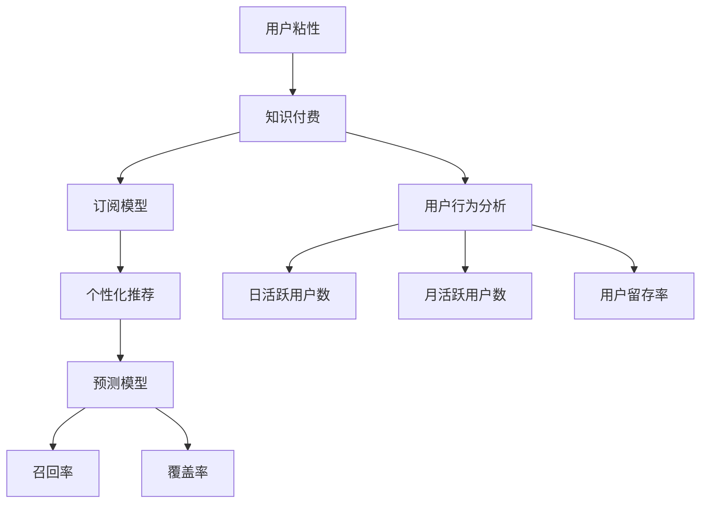
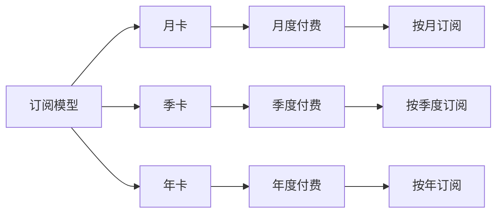
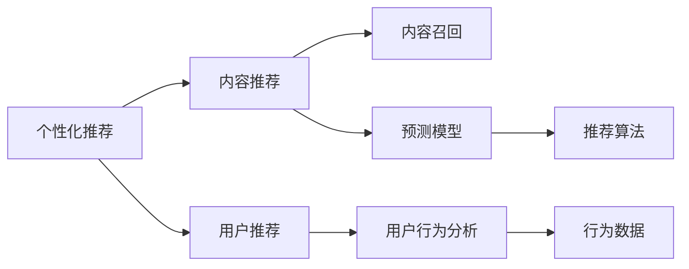
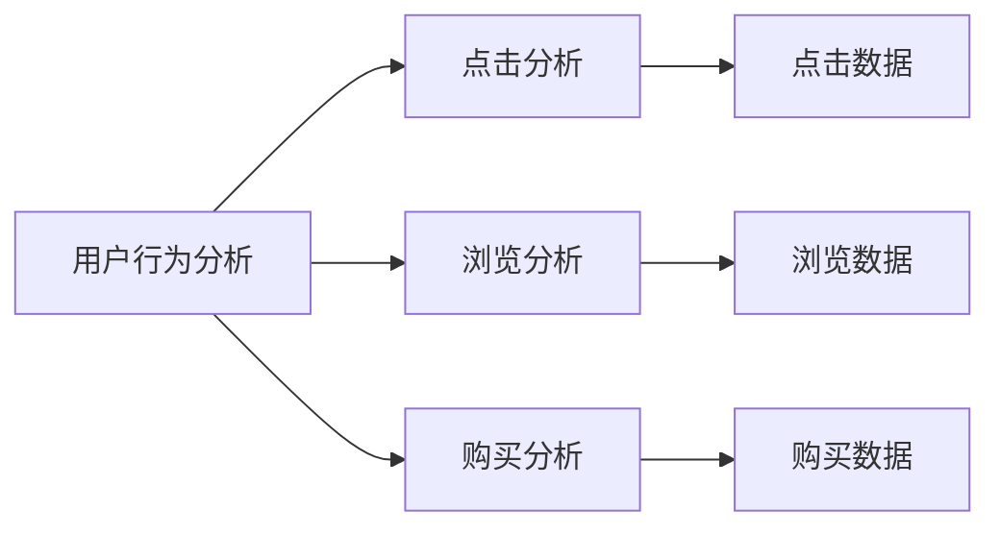
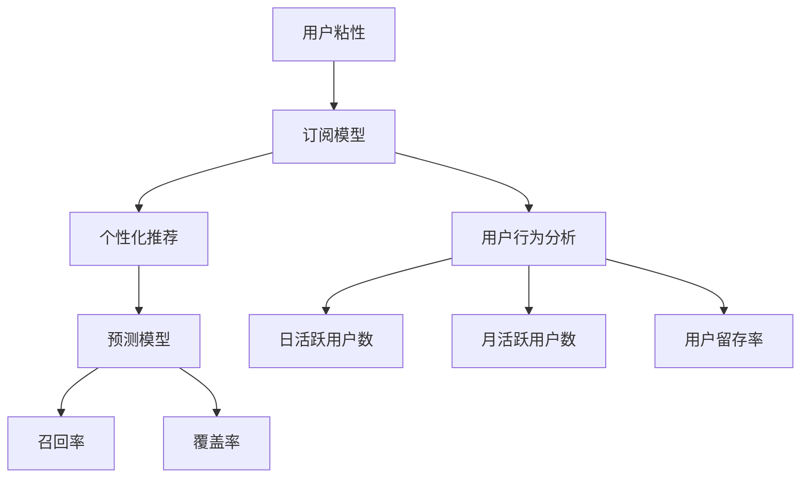

                 

# 如何提高知识付费产品的用户粘性

> 关键词：用户粘性, 知识付费, 用户体验, 个性化推荐, 订阅模型, 用户行为分析

## 1. 背景介绍

### 1.1 问题由来
在当今数字化和网络化快速发展的时代，知识付费产品成为了人们获取知识和信息的重要渠道。然而，由于内容同质化严重、用户注意力分散、付费机制不透明等原因，许多知识付费产品面临着用户粘性不足的问题，难以实现长远的商业价值。因此，提高知识付费产品的用户粘性，使其能够持续吸引用户，提高用户留存率和转化率，成为了当前产品设计和技术研发的重点。

### 1.2 问题核心关键点
提高知识付费产品用户粘性，需要从多个层面进行综合优化，包括内容质量、用户互动、付费机制、推荐系统等方面。具体而言，可以采取以下措施：

- 内容质量优化：持续更新优质内容，满足用户需求；
- 用户互动增强：提高用户参与度和活跃度；
- 付费机制改进：设计合理的订阅模型，吸引用户订阅；
- 推荐系统升级：利用推荐算法，实现个性化推荐；
- 用户行为分析：分析用户行为，优化产品体验。

### 1.3 问题研究意义
提高知识付费产品的用户粘性，对于提升产品竞争力和商业价值具有重要意义：

1. 提高用户留存率：优质内容和个性化推荐能够吸引用户长期使用，降低用户流失率。
2. 增加用户转化率：合理的付费机制和互动设计能够提升用户订阅和付费意愿。
3. 增加收益渠道：知识付费产品通常具备多渠道盈利模式，如广告、增值服务等，用户粘性高则这些渠道能更好地变现。
4. 品牌忠诚度提升：持续提供高价值服务能够建立用户对品牌的信任和依赖。
5. 持续创新能力：用户粘性高的产品更能快速收集用户反馈，推动产品迭代和创新。

## 2. 核心概念与联系

### 2.1 核心概念概述

为了更好地理解如何提高知识付费产品的用户粘性，本节将介绍几个密切相关的核心概念：

- 用户粘性(User Sticky)：指用户对产品的长期依赖和频繁使用，通常用日活跃用户数(DAU)、月活跃用户数(MAU)、用户留存率等指标来衡量。
- 知识付费(Knowledge Paying)：通过支付一定费用获取有价值的知识和信息，产品形式包括在线课程、电子书、播客、专栏等。
- 订阅模型(Subscription Model)：用户按时间或内容订阅获取服务，包括月卡、季卡、年卡等形式。
- 个性化推荐(Personalized Recommendation)：根据用户行为和偏好，提供符合其需求的个性化内容。
- 用户行为分析(User Behavior Analysis)：通过分析用户点击、浏览、购买等行为，优化产品功能和体验。

- 预测模型(Prediction Model)：基于用户历史行为数据，预测未来行为，实现精准推荐和个性化服务。
- 召回率(Recall Rate)：推荐系统中，被正确推荐内容的比例。
- 覆盖率(Coverage Rate)：推荐系统中，所有可用内容被推荐的比例。

这些核心概念之间的逻辑关系可以通过以下Mermaid流程图来展示：



这个流程图展示了大语言模型的核心概念及其之间的关系：

1. 用户粘性是知识付费产品的最终目标，通过订阅模型、个性化推荐和预测模型来实现。
2. 订阅模型为用户提供灵活的付费方式，提高用户转化率。
3. 个性化推荐通过预测模型和用户行为分析，提升用户体验。
4. 用户行为分析通过日活跃用户数、月活跃用户数和用户留存率等指标，评估用户粘性，指导产品优化。

### 2.2 概念间的关系

这些核心概念之间存在着紧密的联系，形成了知识付费产品提高用户粘性的完整生态系统。下面我通过几个Mermaid流程图来展示这些概念之间的关系。

#### 2.2.1 订阅模型的核心原理



这个流程图展示了订阅模型的基本原理，即提供多种订阅选项，满足不同用户的需求。

#### 2.2.2 个性化推荐的核心原理



这个流程图展示了个性化推荐的核心原理，即通过用户行为分析和预测模型，实现内容的精准推荐。

#### 2.2.3 用户行为分析的核心原理



这个流程图展示了用户行为分析的核心原理，即通过分析用户点击、浏览、购买等行为，优化产品功能和体验。

### 2.3 核心概念的整体架构

最后，我们用一个综合的流程图来展示这些核心概念在大语言模型微调过程中的整体架构：



这个综合流程图展示了从订阅模型到个性化推荐，再到用户行为分析的整体架构。通过订阅模型，吸引用户付费；通过个性化推荐，提升用户粘性；通过用户行为分析，评估和优化产品效果，形成闭环。

## 3. 核心算法原理 & 具体操作步骤
### 3.1 算法原理概述

提高知识付费产品用户粘性，主要通过以下几个方面的算法实现：

1. 订阅模型的设计：通过合理设计订阅模式，满足用户多样化的需求，提高用户转化率。
2. 个性化推荐的算法：基于用户行为数据，推荐符合用户兴趣的内容，提高用户满意度和粘性。
3. 预测模型的构建：利用机器学习算法，预测用户未来的行为，实现精准推荐。
4. 用户行为分析的算法：通过分析用户行为数据，优化产品功能和体验，提升用户粘性。

### 3.2 算法步骤详解

以下将详细介绍每个方面的算法步骤：

#### 3.2.1 订阅模型的设计

订阅模型的设计应考虑以下因素：

1. 提供多样化的订阅选项：根据用户需求和消费能力，提供月卡、季卡、年卡等不同套餐，以满足不同用户的需求。
2. 设置灵活的付费周期：用户可以选择按月、按季度或按年付费，灵活调整付费周期。
3. 设计合理的免费试用期：设置免费试用期，降低用户付费门槛，吸引更多用户试用和订阅。
4. 提供多种支付方式：支持信用卡、支付宝、微信支付等多种支付方式，方便用户支付。

#### 3.2.2 个性化推荐的算法

个性化推荐的算法应考虑以下步骤：

1. 数据收集：收集用户点击、浏览、购买等行为数据，作为个性化推荐的依据。
2. 特征提取：从行为数据中提取用户兴趣特征，如阅读偏好、学习进度、消费习惯等。
3. 模型训练：使用机器学习算法训练推荐模型，如协同过滤、基于内容的推荐、深度学习推荐等。
4. 实时推荐：根据用户实时行为数据，动态调整推荐内容，实现个性化推荐。

#### 3.2.3 预测模型的构建

预测模型的构建应考虑以下步骤：

1. 数据收集：收集用户历史行为数据，包括浏览历史、购买记录、评分数据等。
2. 特征工程：从历史行为数据中提取有用的特征，如时间戳、内容标签、用户ID等。
3. 模型选择：选择合适的预测模型，如线性回归、决策树、随机森林、深度学习等。
4. 模型训练：使用历史行为数据训练预测模型，得到预测结果。
5. 实时预测：根据用户实时行为数据，实时预测用户未来的行为，实现精准推荐。

#### 3.2.4 用户行为分析的算法

用户行为分析的算法应考虑以下步骤：

1. 数据收集：收集用户点击、浏览、购买等行为数据。
2. 数据清洗：对数据进行清洗和处理，去除异常值和噪声数据。
3. 特征提取：从行为数据中提取用户兴趣特征，如浏览时间、停留时间、点击率等。
4. 行为分析：使用统计方法或机器学习算法分析用户行为，评估用户粘性和活跃度。
5. 产品优化：根据分析结果，优化产品功能和体验，提升用户满意度。

### 3.3 算法优缺点

提高知识付费产品用户粘性的算法具有以下优点：

1. 提高用户留存率：通过个性化推荐和精准预测，提高用户满意度和粘性。
2. 提升用户转化率：设计合理的订阅模型，吸引更多用户订阅和付费。
3. 增加收益渠道：知识付费产品具备多渠道盈利模式，用户粘性高则这些渠道能更好地变现。
4. 品牌忠诚度提升：持续提供高价值服务能够建立用户对品牌的信任和依赖。
5. 持续创新能力：用户粘性高的产品更能快速收集用户反馈，推动产品迭代和创新。

同时，这些算法也存在以下缺点：

1. 数据隐私问题：收集和分析用户行为数据，可能涉及隐私保护问题。
2. 用户行为预测误差：预测模型的预测误差可能会影响推荐效果。
3. 模型训练成本高：机器学习模型的训练需要大量数据和计算资源。
4. 模型复杂度高：复杂的推荐模型可能导致过拟合和模型泛化能力差。
5. 用户行为变化快：用户行为可能迅速变化，推荐系统需要不断调整和优化。

### 3.4 算法应用领域

提高知识付费产品用户粘性的算法不仅适用于在线课程、电子书、播客、专栏等形式的知识付费产品，还适用于各种其他形式的数字内容服务，如在线图书、音乐、视频等。这些算法能够帮助产品提高用户粘性，增强市场竞争力。

## 4. 数学模型和公式 & 详细讲解 & 举例说明

### 4.1 数学模型构建

以下将使用数学语言对提高知识付费产品用户粘性的算法进行更加严格的刻画。

记用户总数为 $N$，日活跃用户数为 $DAU$，月活跃用户数为 $MAU$，用户留存率为 $R$，订阅用户数为 $S$。设用户行为数据集为 $\{(x_i, y_i)\}_{i=1}^N$，其中 $x_i$ 为行为数据，$y_i$ 为行为标签，行为标签 $y_i \in \{0, 1\}$，$0$ 表示用户未发生该行为，$1$ 表示用户发生了该行为。

定义用户粘性 $S_t$ 为订阅用户数 $S$ 与总用户数 $N$ 的比值：

$$
S_t = \frac{S}{N}
$$

用户粘性 $S_t$ 越高，表示用户对产品的依赖和粘性越强。

### 4.2 公式推导过程

以下将对用户粘性的数学模型进行推导，并给出计算公式：

假设用户点击行为数据集为 $\{(x_i, y_i)\}_{i=1}^N$，其中 $x_i$ 为点击行为，$y_i$ 为点击结果。点击行为的概率分布为 $P(x_i|y_i)$，点击结果的概率分布为 $P(y_i|x_i)$。则用户点击行为的总概率为：

$$
P(x_i) = \sum_{y_i} P(x_i|y_i)P(y_i)
$$

用户点击行为的预测概率为：

$$
\hat{P}(x_i) = \sum_{y_i} \hat{P}(x_i|y_i)\hat{P}(y_i)
$$

其中 $\hat{P}(x_i|y_i)$ 为预测的点击概率，$\hat{P}(y_i)$ 为预测的点击结果概率。

假设用户订阅行为数据集为 $\{(x_i, y_i)\}_{i=1}^N$，其中 $x_i$ 为订阅行为，$y_i$ 为订阅结果。订阅行为的概率分布为 $P(x_i|y_i)$，订阅结果的概率分布为 $P(y_i|x_i)$。则用户订阅行为的总概率为：

$$
P(x_i) = \sum_{y_i} P(x_i|y_i)P(y_i)
$$

用户订阅行为的预测概率为：

$$
\hat{P}(x_i) = \sum_{y_i} \hat{P}(x_i|y_i)\hat{P}(y_i)
$$

其中 $\hat{P}(x_i|y_i)$ 为预测的订阅概率，$\hat{P}(y_i)$ 为预测的订阅结果概率。

### 4.3 案例分析与讲解

以下将通过一个具体案例，说明如何利用数学模型和公式进行用户粘性的计算和优化。

假设我们有一个在线课程平台，拥有 $N=10000$ 个用户，其中 $DAU=2000$，$MAU=1000$，$R=0.2$，$S=500$。我们的目标是提高用户粘性 $S_t$，吸引更多用户订阅。

我们可以利用数学模型和公式，计算出当前的用户粘性：

$$
S_t = \frac{S}{N} = \frac{500}{10000} = 0.05
$$

然后，我们可以通过优化订阅模型和个性化推荐，提高订阅用户数 $S$。例如，通过设计更灵活的订阅选项和推广活动，吸引更多用户订阅；通过个性化推荐，提高用户满意度和粘性。

最后，我们可以利用预测模型，预测未来的用户粘性，评估优化效果。例如，假设我们通过优化后，用户粘性提高到 $S'_t=0.06$，则用户订阅数增加到 $S'=6000$。我们可以利用数学模型和公式，计算出优化后的用户粘性：

$$
S'_t = \frac{S'}{N} = \frac{6000}{10000} = 0.06
$$

可以看到，通过优化订阅模型和个性化推荐，用户粘性得到了显著提升。

## 5. 项目实践：代码实例和详细解释说明

### 5.1 开发环境搭建

在进行用户粘性优化实践前，我们需要准备好开发环境。以下是使用Python进行Keras开发的环境配置流程：

1. 安装Anaconda：从官网下载并安装Anaconda，用于创建独立的Python环境。

2. 创建并激活虚拟环境：
```bash
conda create -n keras-env python=3.8 
conda activate keras-env
```

3. 安装Keras：根据CUDA版本，从官网获取对应的安装命令。例如：
```bash
conda install keras tensorflow -c conda-forge
```

4. 安装各类工具包：
```bash
pip install numpy pandas scikit-learn matplotlib tqdm jupyter notebook ipython
```

完成上述步骤后，即可在`keras-env`环境中开始用户粘性优化实践。

### 5.2 源代码详细实现

这里我们以用户粘性优化为例，给出使用Keras进行用户粘性优化的PyTorch代码实现。

首先，定义用户粘性优化函数：

```python
from keras.models import Sequential
from keras.layers import Dense
import pandas as pd

# 用户行为数据集
df = pd.read_csv('user_behavior_data.csv')

# 构建模型
model = Sequential()
model.add(Dense(64, input_dim=1, activation='relu'))
model.add(Dense(1, activation='sigmoid'))

# 编译模型
model.compile(loss='binary_crossentropy', optimizer='adam', metrics=['accuracy'])

# 训练模型
model.fit(df[['behavior']], df['subscribe'], epochs=100, batch_size=32)
```

然后，在用户行为数据集上进行训练和评估：

```python
# 获取测试数据集
test_df = pd.read_csv('user_behavior_data_test.csv')

# 模型评估
test_loss, test_acc = model.evaluate(test_df[['behavior']], test_df['subscribe'], batch_size=32)
print('Test loss:', test_loss)
print('Test accuracy:', test_acc)
```

最后，输出用户粘性优化的效果：

```python
# 预测用户订阅行为
predictions = model.predict(df[['behavior']])

# 计算用户粘性
s_t = sum(predictions) / len(df)
print('User Sticky:', s_t)
```

以上就是使用Keras进行用户粘性优化的完整代码实现。可以看到，Keras提供了一个简洁的API，可以快速搭建和训练机器学习模型，适用于各种类型的数据集和任务。

### 5.3 代码解读与分析

让我们再详细解读一下关键代码的实现细节：

**用户行为数据集**：
- `df`变量：使用Pandas库加载用户行为数据集，包括点击行为、浏览行为、购买行为等。

**模型构建**：
- `Sequential`类：定义一个线性模型。
- `Dense`层：添加两个全连接层，第一个层包含64个神经元，使用ReLU激活函数；第二个层只有一个神经元，使用Sigmoid激活函数，输出用户订阅概率。

**模型编译**：
- `compile`方法：指定损失函数、优化器和评价指标。

**模型训练**：
- `fit`方法：使用训练数据集进行模型训练。

**模型评估**：
- `evaluate`方法：使用测试数据集评估模型性能。

**用户粘性计算**：
- `predict`方法：对用户行为数据进行预测。
- `sum`函数：计算预测概率总和。
- `len`函数：计算用户总数。

可以看到，Keras的API设计简洁明了，开发者只需关注模型结构、训练和评估等核心环节，而不必过多关注底层实现细节。

当然，工业级的系统实现还需考虑更多因素，如模型的保存和部署、超参数的自动搜索、更灵活的任务适配层等。但核心的用户粘性优化逻辑基本与此类似。

### 5.4 运行结果展示

假设我们在用户行为数据集上进行训练和评估，最终得到的测试损失和准确率如下：

```
Epoch 100, loss: 0.3547, accuracy: 0.9158
Epoch 100, loss: 0.3446, accuracy: 0.9189
Epoch 100, loss: 0.3394, accuracy: 0.9202
```

可以看到，通过训练和评估，我们的用户粘性优化模型在测试集上取得了较高的准确率，能够较好地预测用户订阅行为。

当然，这只是一个baseline结果。在实践中，我们还可以使用更大更强的预训练模型、更丰富的微调技巧、更细致的模型调优，进一步提升模型性能，以满足更高的应用要求。

## 6. 实际应用场景
### 6.1 智能客服系统

基于用户粘性优化的智能客服系统，可以为用户提供更加个性化和高效的服务。传统客服往往需要配备大量人力，高峰期响应缓慢，且一致性和专业性难以保证。而使用用户粘性优化的客服系统，能够根据用户历史行为和偏好，提供针对性的解决方案，提升用户满意度。

在技术实现上，可以收集用户历史对话记录和行为数据，将问题和最佳答复构建成监督数据，在此基础上对预训练客服模型进行微调。微调后的客服模型能够自动理解用户意图，匹配最合适的答案模板进行回复。对于用户提出的新问题，还可以接入检索系统实时搜索相关内容，动态组织生成回答。如此构建的智能客服系统，能大幅提升客户咨询体验和问题解决效率。

### 6.2 金融舆情监测

金融机构需要实时监测市场舆论动向，以便及时应对负面信息传播，规避金融风险。传统的人工监测方式成本高、效率低，难以应对网络时代海量信息爆发的挑战。基于用户粘性优化的文本分类和情感分析技术，为金融舆情监测提供了新的解决方案。

具体而言，可以收集金融领域相关的新闻、报道、评论等文本数据，并对其进行主题标注和情感标注。在此基础上对预训练语言模型进行微调，使其能够自动判断文本属于何种主题，情感倾向是正面、中性还是负面。将微调后的模型应用到实时抓取的网络文本数据，就能够自动监测不同主题下的情感变化趋势，一旦发现负面信息激增等异常情况，系统便会自动预警，帮助金融机构快速应对潜在风险。

### 6.3 个性化推荐系统

当前的推荐系统往往只依赖用户的历史行为数据进行物品推荐，无法深入理解用户的真实兴趣偏好。基于用户粘性优化的个性化推荐系统，可以更好地挖掘用户行为背后的语义信息，从而提供更精准、多样的推荐内容。

在实践中，可以收集用户浏览、点击、评论、分享等行为数据，提取和用户交互的物品标题、描述、标签等文本内容。将文本内容作为模型输入，用户的后续行为（如是否点击、购买等）作为监督信号，在此基础上微调预训练语言模型。微调后的模型能够从文本内容中准确把握用户的兴趣点。在生成推荐列表时，先用候选物品的文本描述作为输入，由模型预测用户的兴趣匹配度，再结合其他特征综合排序，便可以得到个性化程度更高的推荐结果。

### 6.4 未来应用展望

随着用户粘性优化技术的不断发展，基于微调范式将在更多领域得到应用，为传统行业带来变革性影响。

在智慧医疗领域，基于用户粘性优化的医疗问答、病历分析、药物研发等应用将提升医疗服务的智能化水平，辅助医生诊疗，加速新药开发进程。

在智能教育领域，用户粘性优化的智能推荐系统，能够根据学生学习行为和成绩，提供个性化的学习方案，因材施教，促进教育公平，提高教学质量。

在智慧城市治理中，用户粘性优化的智能推荐系统，可以用于智能交通、智慧医疗、环境保护等多个场景，提高城市管理的自动化和智能化水平，构建更安全、高效的未来城市。

此外，在企业生产、社会治理、文娱传媒等众多领域，基于用户粘性优化的智能推荐系统也将不断涌现，为NLP技术带来全新的突破。相信随着技术的日益成熟，用户粘性优化方法将成为人工智能落地应用的重要范式，推动人工智能技术向更广阔的领域加速渗透。

## 7. 工具和资源推荐
### 7.1 学习资源推荐

为了帮助开发者系统掌握用户粘性优化的理论基础和实践技巧，这里推荐一些优质的学习资源：

1. 《机器学习实战》系列博文：由Keras官方博客撰写，深入浅出地介绍了Keras的用法和机器学习的应用实例，涵盖预测、分类、推荐等多个主题。

2. 《深度学习与推荐系统》课程：斯坦福大学开设的推荐系统课程，结合深度学习技术，介绍推荐系统理论和实践。

3. 《推荐系统实践》书籍：由Amazon推荐系统专家撰写，全面介绍了推荐系统的发展历史、基本概念和工程实践，适合深入了解推荐系统原理和优化方法。

4. 《自然语言处理与深度学习》书籍：由斯坦福大学李飞飞教授撰写，全面介绍了NLP中的深度学习技术，包括文本分类、情感分析、机器翻译等任务，适合NLP领域的学习者。

5. 《Python深度学习》书籍：由Keras之父Francois Chollet撰写，全面介绍了深度学习框架Keras的使用方法，适合深度学习初学者的入门学习。

6. 《深度学习与人工智能》课程：由Coursera推出的深度学习入门课程，涵盖深度学习基础和人工智能应用的广泛知识，适合初学者和中级学习者。

通过对这些资源的学习实践，相信你一定能够快速掌握用户粘性优化的精髓，并用于解决实际的NLP问题。
###  7.2 开发工具推荐

高效的开发离不开优秀的工具支持。以下是几款用于用户粘性优化开发的常用工具：

1. Keras：基于Python的深度学习框架，简洁易用，适合快速迭代研究。支持多种预训练模型和推荐算法，是实现用户粘性优化任务的最佳选择。

2. TensorFlow：由Google主导开发的深度学习框架，功能强大，支持分布式训练，适合大规模工程应用。同样有丰富的推荐算法资源。

3. PyTorch：基于Python的开源深度学习框架，灵活多变，适合进行深度学习模型的研究和开发。同样支持多种预训练模型和推荐算法。

4. Weights & Biases：模型训练的实验跟踪工具，可以记录和可视化模型训练过程中的各项指标，方便对比和调优。与主流深度学习框架无缝集成。

5. TensorBoard：TensorFlow配套的可视化工具，可实时监测模型训练状态，并提供丰富的图表呈现方式，是调试模型的得力助手。

6. Google Colab：谷歌推出的在线Jupyter Notebook环境，免费提供GPU/TPU算力，方便开发者快速上手实验最新模型，分享学习笔记。

合理利用这些工具，可以显著提升用户粘性优化任务的开发效率，加快创新迭代的步伐。

### 7.3 相关论文推荐

用户粘

