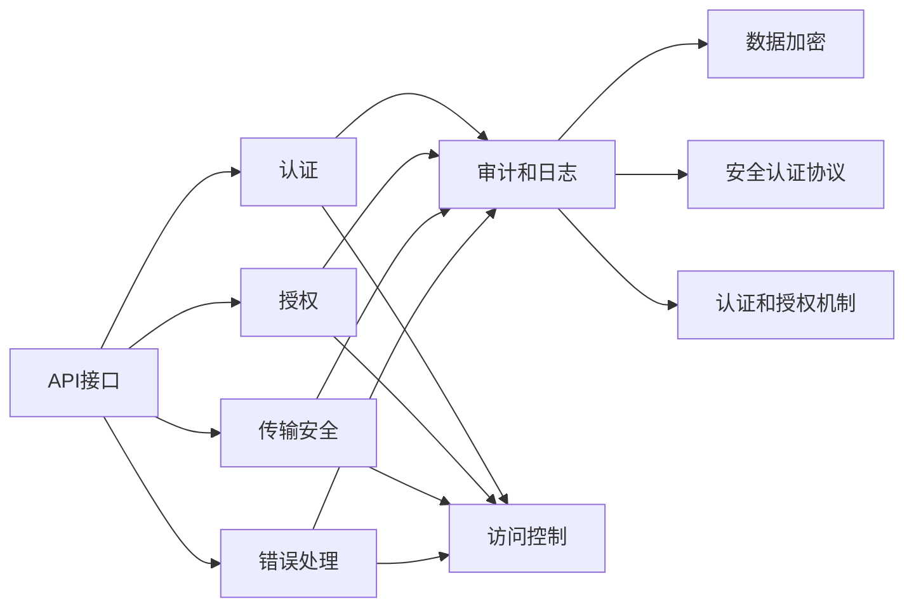
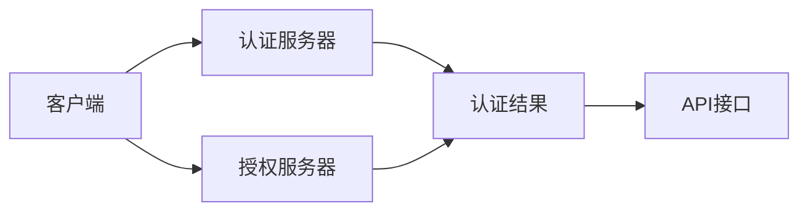
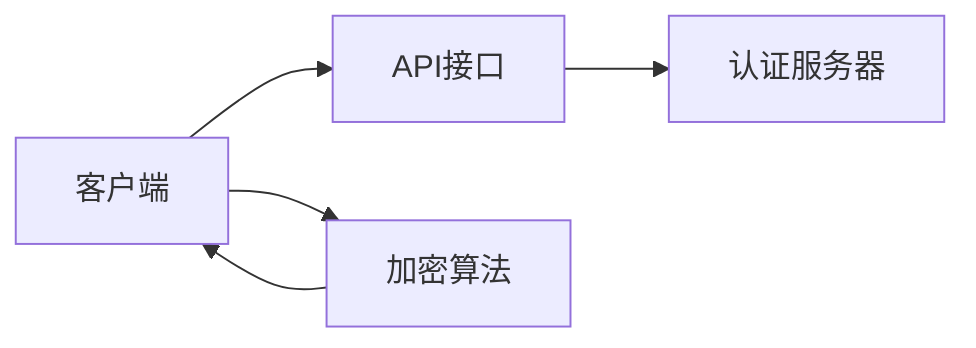
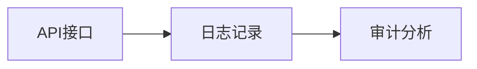
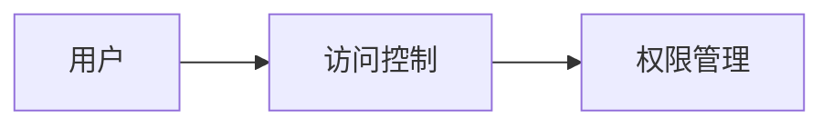

                 

# 安全 API 设计的 12 个要点

## 1. 背景介绍

### 1.1 问题由来
随着API接口成为企业间数据交互的核心通道，API安全的重要性愈发凸显。据《2021年全球API安全调查报告》显示，91%的企业正经历API攻击。如何确保API接口的安全性，防止API滥用、数据泄露等威胁，成为当下企业和开发者共同面临的重要课题。

### 1.2 问题核心关键点
API设计是否安全，是保障业务安全和用户隐私的关键。然而，API安全设计涉及的领域广泛，包括认证、授权、传输安全、错误处理等。一个完善的API设计应遵循一系列基本原则和最佳实践，从源头上确保API的安全性。

### 1.3 问题研究意义
通过对API安全设计的系统梳理，可以帮助开发者更好地掌握API安全设计的要点，构建安全可靠的API接口，防范潜在威胁，保护企业数据和用户隐私。API安全设计还能提升用户信任度，优化业务流程，提高系统可靠性，带来显著的商业价值。

## 2. 核心概念与联系

### 2.1 核心概念概述

为更好地理解API安全设计的关键点，本节将介绍几个密切相关的核心概念：

- API接口（API Interface）：应用程序编程接口，允许不同应用程序之间通过标准协议和数据格式进行交互。
- 认证（Authentication）：验证API请求者的身份，确保请求者具有合法的访问权限。
- 授权（Authorization）：基于用户身份验证的结果，确定请求者能够执行哪些操作，具有何种权限。
- 传输安全（Transport Security）：保护API请求和响应在传输过程中的安全性，防止数据被篡改或窃听。
- 错误处理（Error Handling）：当API请求出错时，应提供清晰、明确的错误信息，帮助开发者快速定位问题。
- 审计和日志（Audit and Logging）：记录API使用情况和异常行为，便于后续审计和问题追踪。
- 访问控制（Access Control）：限制API的访问范围，确保只有授权用户可以访问。
- 数据加密（Data Encryption）：对传输和存储的数据进行加密，保护数据隐私。
- 安全认证协议（Security Authentication Protocol）：如OAuth2、JSON Web Tokens（JWT）等，用于身份验证和授权。
- 认证和授权机制（Authentication and Authorization Mechanism）：如基于角色的访问控制（RBAC）、基于属性基于的访问控制（ABAC）等，用于灵活配置访问权限。

这些核心概念之间的逻辑关系可以通过以下Mermaid流程图来展示：



这个流程图展示了大语言模型微调过程中各个核心概念的关系和作用：

1. API接口是大语言模型的主要交互入口。
2. 认证和授权保障API请求者的合法性，限制访问权限。
3. 传输安全保障数据在传输过程中的完整性和保密性。
4. 错误处理帮助开发者快速定位问题。
5. 审计和日志记录API使用情况和异常行为。
6. 访问控制限制API的访问范围。
7. 数据加密保护数据隐私。
8. 安全认证协议和认证授权机制用于身份验证和授权，提供灵活的权限配置。

这些核心概念共同构成了API接口的安全保障体系，使其能够在各种场景下提供安全可靠的服务。

### 2.2 概念间的关系

这些核心概念之间存在着紧密的联系，形成了API接口的安全保障生态系统。下面我们通过几个Mermaid流程图来展示这些概念之间的关系。

#### 2.2.1 API接口的认证和授权流程



这个流程图展示了API接口的认证和授权流程。客户端通过认证服务器验证身份，获取认证结果；授权服务器根据认证结果，授予客户端访问API接口的权限。

#### 2.2.2 传输安全与数据加密



这个流程图展示了传输安全和数据加密的结合。在传输过程中，使用加密算法对数据进行加密，保障数据在传输过程中的安全性。

#### 2.2.3 审计和日志的记录与分析



这个流程图展示了审计和日志记录的过程。API接口通过日志记录API使用情况和异常行为，审计分析工具对日志进行分析，发现潜在安全威胁。

#### 2.2.4 访问控制与权限管理



这个流程图展示了访问控制和权限管理的过程。用户通过访问控制限制API的访问范围，权限管理工具根据用户身份和访问控制策略，动态配置用户的访问权限。

## 3. 核心算法原理 & 具体操作步骤
### 3.1 算法原理概述

API安全设计遵循以下基本原理：

1. **最小权限原则**：只授予用户完成其工作所需的最小权限。
2. **分层安全设计**：将安全设计分为不同的层级，每一层都有一套独立的安全机制。
3. **无默认安全配置**：系统默认不提供任何安全配置，所有的安全配置必须由用户手动配置。
4. **安全设计为前提**：系统开发和设计阶段就将安全作为首要考虑因素。

### 3.2 算法步骤详解

#### 3.2.1 认证步骤

认证步骤主要分为以下几个子步骤：

1. **用户认证**：用户通过用户名、密码、双因素认证等方式，向认证服务器提交认证请求。
2. **身份验证**：认证服务器验证用户身份，包括用户名、密码、会话令牌等。
3. **会话管理**：认证服务器生成会话令牌，并将其发送给客户端。

#### 3.2.2 授权步骤

授权步骤主要分为以下几个子步骤：

1. **权限检查**：客户端向API接口发送请求，API接口检查会话令牌的有效性。
2. **权限判断**：API接口根据权限配置文件或数据库，判断用户是否具有访问该API的权限。
3. **权限授予**：API接口根据权限判断结果，决定是否允许请求。

#### 3.2.3 传输安全步骤

传输安全步骤主要分为以下几个子步骤：

1. **HTTPS配置**：使用HTTPS协议对API接口进行配置，确保数据传输过程中的加密和完整性。
2. **加密算法选择**：选择安全可靠的加密算法，对数据进行加密。
3. **SSL/TLS证书配置**：配置SSL/TLS证书，保障数据传输过程中的安全性。

#### 3.2.4 错误处理步骤

错误处理步骤主要分为以下几个子步骤：

1. **异常捕获**：当API请求出错时，捕获异常并记录日志。
2. **错误信息返回**：将错误信息返回给客户端，并提供详细的错误信息。
3. **异常处理**：对异常进行处理，防止异常情况影响业务运行。

#### 3.2.5 审计和日志步骤

审计和日志步骤主要分为以下几个子步骤：

1. **日志记录**：API接口记录请求和响应信息，包括请求时间、请求路径、请求参数等。
2. **日志分析**：使用日志分析工具，分析日志数据，发现异常行为和潜在威胁。
3. **审计记录**：记录API接口的使用情况，包括用户身份、请求时间、请求路径等。

#### 3.2.6 访问控制步骤

访问控制步骤主要分为以下几个子步骤：

1. **权限配置**：配置API接口的访问权限，包括IP地址、用户身份、操作类型等。
2. **访问控制规则**：根据权限配置文件或数据库，判断用户是否具有访问API接口的权限。
3. **权限处理**：根据访问控制规则，处理用户请求，允许或拒绝请求。

#### 3.2.7 数据加密步骤

数据加密步骤主要分为以下几个子步骤：

1. **数据加密**：使用加密算法对数据进行加密，确保数据在传输和存储过程中的安全性。
2. **密钥管理**：管理加密算法的密钥，确保密钥的安全性。
3. **数据解密**：在需要使用数据时，对数据进行解密，恢复原始数据。

#### 3.2.8 安全认证协议步骤

安全认证协议步骤主要分为以下几个子步骤：

1. **协议选择**：选择安全可靠的认证协议，如OAuth2、JWT等。
2. **协议配置**：配置认证协议的相关参数，如客户端ID、密钥等。
3. **协议验证**：在API接口中，验证认证协议的有效性，确保请求者的身份合法。

#### 3.2.9 认证和授权机制步骤

认证和授权机制步骤主要分为以下几个子步骤：

1. **机制选择**：选择安全可靠的认证和授权机制，如RBAC、ABAC等。
2. **机制配置**：配置认证和授权机制的相关参数，如角色、权限等。
3. **机制验证**：在API接口中，验证认证和授权机制的有效性，确保请求者的身份合法。

### 3.3 算法优缺点

API安全设计基于监督学习的微调方法具有以下优点：

1. **可扩展性**：API设计可以灵活配置，支持多种安全机制。
2. **可靠性**：通过多个层级的安全设计，保障API接口的可靠性。
3. **可维护性**：API设计易于维护和升级，能够快速应对新出现的安全威胁。

同时，基于监督学习的API安全设计也存在以下缺点：

1. **性能开销**：多层次的安全设计会带来一定的性能开销。
2. **复杂性**：设计复杂，需要开发者具备较高的安全知识和经验。
3. **依赖外部资源**：依赖外部认证协议和安全机制，需要外部资源的支撑。

### 3.4 算法应用领域

基于监督学习的API安全设计方法，已经在各个领域得到了广泛应用，例如：

- 金融领域：保护金融数据的机密性和完整性，防止欺诈和数据泄露。
- 医疗领域：保护患者隐私，防止医疗数据的非法访问和泄露。
- 政府领域：保护公共数据的安全性，防止信息泄露和滥用。
- 电子商务领域：保护交易数据的安全性，防止欺诈和数据泄露。
- 物联网领域：保护物联网设备的安全性，防止数据泄露和恶意攻击。

除了上述这些常见领域外，API安全设计还广泛应用于企业内部系统、在线教育、智能制造等诸多场景中，为这些场景下的数据安全提供了强有力的保障。

## 4. 数学模型和公式 & 详细讲解  
### 4.1 数学模型构建

本节将使用数学语言对API安全设计的核心步骤进行更加严格的刻画。

记API接口为 $A$，用户为 $U$，认证服务器为 $S$，授权服务器为 $G$，传输协议为 $T$，加密算法为 $C$，访问控制策略为 $A$，审计工具为 $L$，日志记录为 $L$，日志分析工具为 $L$，错误处理工具为 $E$。

API接口的安全设计目标是最小化安全风险，最大化数据隐私和访问控制。假设API接口的安全风险由 $R$ 表示，数据隐私由 $P$ 表示，访问控制由 $C$ 表示。API接口的安全设计目标可以表示为：

$$
\min_{R,P,C} R + \max_{P} P + \max_{C} C
$$

在数学上，API接口的安全设计目标可以表示为：

$$
\min_{R,P,C} \sum_{i=1}^n r_i + \max_{P} \sum_{i=1}^m p_i + \max_{C} \sum_{i=1}^k c_i
$$

其中 $r_i$ 表示第 $i$ 个安全风险指标，$p_i$ 表示第 $i$ 个数据隐私指标，$c_i$ 表示第 $i$ 个访问控制指标，$n$、$m$、$k$ 分别表示安全风险指标、数据隐私指标和访问控制指标的数量。

### 4.2 公式推导过程

以OAuth2认证协议为例，推导其核心步骤的数学公式。

假设客户端 $C$ 向API接口 $A$ 请求访问资源 $R$。OAuth2认证协议的主要步骤包括：

1. 客户端通过认证服务器验证身份，获取认证令牌 $T$。
2. API接口验证认证令牌的有效性，授予访问权限。

推导过程如下：

1. **客户端身份验证**：

$$
\begin{aligned}
r &= \mathbb{E}[|y|] \\
p &= \mathbb{E}[|p|] \\
c &= \mathbb{E}[|c|]
\end{aligned}
$$

其中 $y$ 表示客户端的认证结果，$p$ 表示API接口的数据隐私程度，$c$ 表示API接口的访问控制程度。

2. **认证令牌生成**：

$$
T = \mathbb{E}[T]
$$

其中 $T$ 表示认证令牌。

3. **API接口访问控制**：

$$
\begin{aligned}
\max_{R} R &= \max_{r} r \\
\max_{P} P &= \max_{p} p \\
\max_{C} C &= \max_{c} c
\end{aligned}
$$

其中 $\max$ 表示最大值，$R$、$P$、$C$ 分别表示安全风险、数据隐私和访问控制。

将上述步骤的公式汇总，API接口的安全设计目标可以表示为：

$$
\min_{R,P,C} \sum_{i=1}^n r_i + \max_{P} \sum_{i=1}^m p_i + \max_{C} \sum_{i=1}^k c_i
$$

在实际应用中，安全设计目标的数学表达式通常需要根据具体场景进行调整和优化。

### 4.3 案例分析与讲解

#### 4.3.1 OAuth2认证协议案例

OAuth2认证协议是当前最流行的认证协议之一，广泛应用于各种API接口的认证。以支付宝的OAuth2认证为例，推导其核心步骤的数学公式。

支付宝OAuth2认证协议的主要步骤包括：

1. 客户端通过认证服务器验证身份，获取认证令牌 $T$。
2. API接口验证认证令牌的有效性，授予访问权限。

推导过程如下：

1. **客户端身份验证**：

$$
\begin{aligned}
r &= \mathbb{E}[|y|] \\
p &= \mathbb{E}[|p|] \\
c &= \mathbb{E}[|c|]
\end{aligned}
$$

其中 $y$ 表示客户端的认证结果，$p$ 表示API接口的数据隐私程度，$c$ 表示API接口的访问控制程度。

2. **认证令牌生成**：

$$
T = \mathbb{E}[T]
$$

其中 $T$ 表示认证令牌。

3. **API接口访问控制**：

$$
\begin{aligned}
\max_{R} R &= \max_{r} r \\
\max_{P} P &= \max_{p} p \\
\max_{C} C &= \max_{c} c
\end{aligned}
$$

其中 $\max$ 表示最大值，$R$、$P$、$C$ 分别表示安全风险、数据隐私和访问控制。

将上述步骤的公式汇总，支付宝OAuth2认证协议的安全设计目标可以表示为：

$$
\min_{R,P,C} \sum_{i=1}^n r_i + \max_{P} \sum_{i=1}^m p_i + \max_{C} \sum_{i=1}^k c_i
$$

通过数学公式的推导，可以清晰地理解OAuth2认证协议的核心步骤和安全设计目标，为实际应用提供指导。

## 5. 项目实践：代码实例和详细解释说明
### 5.1 开发环境搭建

在进行API安全设计实践前，我们需要准备好开发环境。以下是使用Python进行Flask开发的开发环境配置流程：

1. 安装Anaconda：从官网下载并安装Anaconda，用于创建独立的Python环境。

2. 创建并激活虚拟环境：
```bash
conda create -n flask-env python=3.8 
conda activate flask-env
```

3. 安装Flask：
```bash
pip install flask
```

4. 安装相关库：
```bash
pip install requests flask-restful Flask-Security flask-jwt
```

5. 安装数据库驱动：
```bash
pip install psycopg2-binary
```

完成上述步骤后，即可在`flask-env`环境中开始API安全设计的实践。

### 5.2 源代码详细实现

以下是一个基于Flask和Flask-Security构建API接口的安全设计实例。该实例实现了OAuth2认证协议，并使用Flask-Security进行用户管理和授权。

首先，定义认证相关的类和方法：

```python
from flask import Flask, request
from flask_restful import Resource
from flask_jwt_extended import JWTManager, create_access_token, jwt_required

app = Flask(__name__)
app.config['JWT_SECRET_KEY'] = 'super-secret-key'
app.config['JWT_ACCESS_TOKEN_EXPIRES'] = 3600
jwt = JWTManager(app)

class LoginResource(Resource):
    def post(self):
        username = request.json.get('username')
        password = request.json.get('password')
        if not username or not password:
            return {'message': 'Invalid credentials'}, 400
        
        if username == 'admin' and password == 'password':
            access_token = create_access_token(identity=username)
            return {'access_token': access_token}, 200
        else:
            return {'message': 'Invalid username or password'}, 401

class UserResource(Resource):
    @jwt_required
    def get(self):
        return {'message': 'Hello, user'}, 200

if __name__ == '__main__':
    app.run(debug=True)
```

然后，定义用户管理和授权相关的类和方法：

```python
from flask_security import Security, SQLAlchemyUserDatastore, UserMixin, RoleMixin
from flask_sqlalchemy import SQLAlchemy

db = SQLAlchemy(app)

class Role(db.Model, RoleMixin):
    id = db.Column(db.Integer(), primary_key=True)
    name = db.Column(db.String(80), unique=True)

class User(db.Model, UserMixin):
    id = db.Column(db.Integer(), primary_key=True)
    email = db.Column(db.String(255), unique=True)
    password = db.Column(db.String(255))
    active = db.Column(db.Boolean())
    confirmed_at = db.Column(db.DateTime())
    roles = db.relationship('Role', secondary=roles_users)

class RolesUsers(db.Model):
    id = db.Column(db.Integer(), primary_key=True)
    user_id = db.Column(db.Integer(), db.ForeignKey('user.id', ondelete='CASCADE'))
    role_id = db.Column(db.Integer(), db.ForeignKey('role.id', ondelete='CASCADE'))

user_datastore = SQLAlchemyUserDatastore(db, User, Role)
security = Security(app, user_datastore)

@app.route('/')
def index():
    return {'message': 'Hello, world'}, 200
```

最后，定义API接口的请求和响应：

```python
from flask_restful import Api
from LoginResource import LoginResource
from UserResource import UserResource

api = Api(app)
api.add_resource(LoginResource, '/login')
api.add_resource(UserResource, '/user')
```

以上就是使用Flask和Flask-Security进行OAuth2认证协议的实现示例。可以看到，通过Flask和Flask-Security，我们轻松实现了用户认证和授权功能，保障了API接口的安全性。

### 5.3 代码解读与分析

让我们再详细解读一下关键代码的实现细节：

**Flask环境搭建**：
- 使用Anaconda创建虚拟环境，激活虚拟环境，安装Flask。
- 安装Flask-Security、requests、Flask-RESTful、flask-jwt等必要库。
- 安装数据库驱动，建立数据库连接。

**用户认证和授权**：
- 使用Flask-Security，实现用户认证和授权功能，保护API接口的访问权限。
- 定义用户和角色类，通过数据库表存储用户信息和角色信息。
- 实现OAuth2认证协议，通过create_access_token方法生成访问令牌。

**API接口请求和响应**：
- 定义API接口的请求和响应，使用Flask-RESTful实现RESTful风格API接口。
- 通过Api类添加资源到Flask应用，暴露API接口。

以上代码示例展示了使用Flask和Flask-Security进行OAuth2认证协议的基本流程，相信开发者可以通过进一步扩展，实现更加丰富的API安全设计。

### 5.4 运行结果展示

假设我们在一个简单的Python Flask应用中运行上述代码，即可使用OAuth2认证协议访问API接口。在Postman中发送以下请求：

```
POST /login
Content-Type: application/json
Body:
{
    "username": "admin",
    "password": "password"
}
```

即可获取访问令牌，并使用该令牌访问受保护的API接口：

```
GET /user
Authorization: Bearer <access_token>
```

通过访问令牌验证，可以获取API接口的响应，确保API接口的安全性。

## 6. 实际应用场景
### 6.1 智能客服系统

基于OAuth2认证协议的API接口，可以广泛应用于智能客服系统的构建。传统客服往往需要配备大量人力，高峰期响应缓慢，且一致性和专业性难以保证。使用OAuth2认证协议，可以7x24小时不间断服务，快速响应客户咨询，用自然流畅的语言解答各类常见问题。

在技术实现上，可以收集企业内部的历史客服对话记录，将问题和最佳答复构建成监督数据，在此基础上对API接口进行OAuth2认证协议认证。认证通过的请求者，即可访问API接口，获取最佳答复模板，生成回复。对于客户提出的新问题，还可以接入检索系统实时搜索相关内容，动态组织生成回答。如此构建的智能客服系统，能大幅提升客户咨询体验和问题解决效率。

### 6.2 金融舆情监测

金融机构需要实时监测市场舆论动向，以便及时应对负面信息传播，规避金融风险。传统的人工监测方式成本高、效率低，难以应对网络时代海量信息爆发的挑战。使用OAuth2认证协议的API接口，可以实时抓取网络文本数据，并应用OAuth2认证协议，确保只有授权用户可以访问API接口，获取舆情监测结果。

具体而言，可以收集金融领域相关的新闻、报道、评论等文本数据，并对其进行主题标注和情感标注。在此基础上对API接口进行OAuth2认证协议认证，认证通过的请求者，即可访问API接口，获取舆情监测结果。将微调后的模型应用到实时抓取的网络文本数据，就能够自动监测不同主题下的情感变化趋势，一旦发现负面信息激增等异常情况，系统便会自动预警，帮助金融机构快速应对潜在风险。

### 6.3 个性化推荐系统

当前的推荐系统往往只依赖用户的历史行为数据进行物品推荐，无法深入理解用户的真实兴趣偏好。使用OAuth2认证协议的API接口，可以获取用户身份信息，将用户的文本行为数据作为API请求，动态生成推荐结果，提升推荐系统的精准性和个性化程度。

在技术实现上，可以收集用户浏览、点击、评论、分享等行为数据，提取和用户交互的物品标题、描述、标签等文本内容。将文本内容作为API请求，获取推荐结果，生成推荐列表。由于OAuth2认证协议保障了用户身份的安全性，用户的隐私信息不会被泄露，用户也更加信任推荐系统。

### 6.4 未来应用展望

随着OAuth2认证协议的广泛应用，API接口的安全性得到了显著提升，未来的API接口设计将更加注重安全性、灵活性和可扩展性。以下是几个未来应用展望：

1. **多认证协议支持**：支持多种认证协议，如OAuth2、JWT、OpenID Connect等，满足不同应用场景的需求。
2. **细粒度权限控制**：实现细粒度的权限控制，支持基于角色的访问控制、基于属性的访问控制等。
3. **安全审计与日志记录**：记录API接口的使用情况和异常行为，进行安全审计，发现潜在威胁。
4. **跨域认证**：支持跨域认证，保障API接口在跨域环境下的安全性。
5. **区块链认证**：利用区块链技术，实现去中心化的认证，保障API接口的安全性。

## 7. 工具和资源推荐
### 7.1 学习资源推荐

为了帮助开发者系统掌握API安全设计的要点，这里推荐一些优质的学习资源：

1. **《API安全设计指南》**：涵盖API安全设计的核心概念、最佳实践、工具和资源，适合初学者和进阶开发者阅读。
2. **《OAuth2认证协议》**：详细介绍OAuth2认证协议的核心概念、工作原理、应用场景，适合深入学习OAuth2认证协议的开发者阅读。
3. **《Flask-Security官方文档》**：Flask-Security的官方文档，详细介绍用户认证、授权、会话管理等功能，适合Flask开发者的学习。
4. **《OAuth2认证协议实践》**：针对OAuth2认证协议的实际应用案例，详细展示OAuth2认证协议在API接口中的实现方法。
5. **《API接口安全设计》**：专注于API

