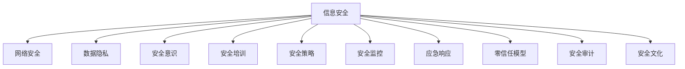
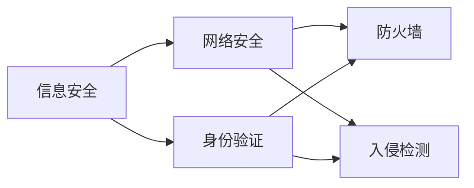
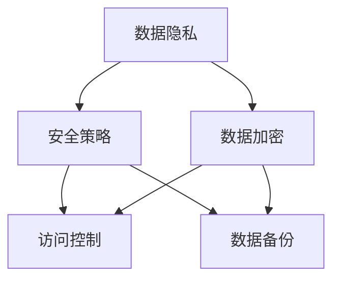
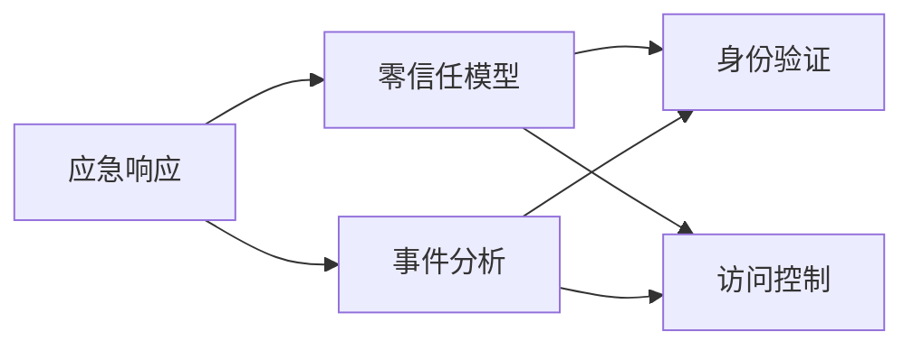
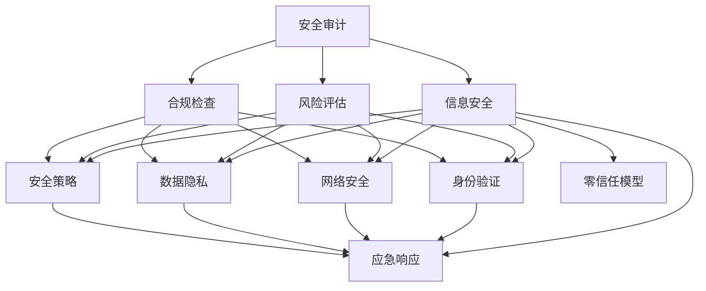

                 

# 安全管理：创造安全健康的工作环境

> 关键词：信息安全, 数据隐私, 网络安全, 安全意识, 安全培训, 安全策略, 安全监控, 应急响应, 零信任模型, 安全审计, 安全文化

## 1. 背景介绍

### 1.1 问题由来

在当今数字化时代，信息技术的广泛应用极大地提升了工作效率和生活便利性。然而，信息安全问题也随之而来，成为组织和个人无法回避的重大挑战。安全事件频发不仅威胁到信息资产的安全，还会严重影响企业的正常运营和声誉。因此，如何有效应对信息安全风险，创造安全健康的工作环境，成为每一个组织和个人的当务之急。

### 1.2 问题核心关键点

信息安全管理的核心在于：
- **信息资产保护**：确保组织和个人的敏感信息不被未经授权访问、泄露或篡改。
- **威胁识别与防护**：识别潜在的安全威胁，并采取有效的防护措施来降低风险。
- **合规与法律遵从**：确保信息管理过程符合法律法规和行业标准。
- **应急响应与恢复**：在发生安全事件时，能够迅速响应并恢复正常业务。
- **安全文化建设**：通过教育和培训，提升员工的安全意识，营造人人重视安全的工作氛围。

### 1.3 问题研究意义

研究信息安全管理的理论和实践，对于保护信息资产，维护组织声誉，增强用户信任，以及构建健康的网络环境具有重要意义。信息安全是企业可持续发展的基础，也是公民隐私权的重要保障。提升信息安全管理能力，是现代组织和个人不可忽视的重要课题。

## 2. 核心概念与联系

### 2.1 核心概念概述

为更好地理解信息安全管理的核心概念，本节将介绍几个关键概念及其相互联系：

- **信息安全(Information Security)**：保护组织和个人的信息资产，防止未授权的访问、泄露或破坏。
- **网络安全(Network Security)**：通过技术和管理手段，保护网络通信的安全，防范网络攻击和数据窃取。
- **数据隐私(Data Privacy)**：确保个人数据不被非法收集、使用或泄露，保护隐私权。
- **安全意识(Security Awareness)**：通过教育和培训，提高员工对信息安全重要性的认识和防范能力。
- **安全培训(Security Training)**：通过定期的安全培训，提升员工的安全意识和技能，预防安全事故。
- **安全策略(Security Policies)**：组织制定的信息安全管理规范和指导原则。
- **安全监控(Security Monitoring)**：实时监测网络流量和系统日志，及时发现异常行为和安全威胁。
- **应急响应(Emergency Response)**：在发生安全事件时，迅速启动应急预案，恢复业务正常运营。
- **零信任模型(Zero Trust Model)**：基于“永远不信任，永远验证”原则，对所有访问请求进行严格验证和控制。
- **安全审计(Security Audit)**：对信息安全管理过程进行定期审计，评估安全策略和控制措施的有效性。
- **安全文化(Security Culture)**：在组织内营造一种注重信息安全的文化，让安全成为日常工作的基本要求。

这些核心概念之间的逻辑关系可以通过以下Mermaid流程图来展示：



这个流程图展示信息安全管理的核心概念及其之间的相互联系。通过理解这些核心概念，可以更好地把握信息安全管理的整体框架和关键任务。

### 2.2 概念间的关系

这些核心概念之间存在着紧密的联系，构成了信息安全管理的完整生态系统。下面我们通过几个Mermaid流程图来展示这些概念之间的关系。

#### 2.2.1 信息安全与网络安全的关系



这个流程图展示了信息安全与网络安全之间的联系。网络安全是信息安全的一部分，通过身份验证、防火墙和入侵检测等技术手段，可以增强网络通信的安全性，防止未授权访问和数据泄露。

#### 2.2.2 数据隐私与安全策略的关系



这个流程图展示了数据隐私与安全策略之间的联系。数据隐私的保护需要制定严格的安全策略，如数据加密、访问控制和数据备份等措施，确保数据的安全性和完整性。

#### 2.2.3 应急响应与零信任模型的关系



这个流程图展示了应急响应与零信任模型之间的联系。在发生安全事件时，零信任模型通过对所有访问请求进行严格验证，进一步提升了应急响应的安全性和有效性。

#### 2.2.4 安全审计与信息安全的整体架构



这个综合流程图展示了安全审计与信息安全管理各个环节的相互关系。安全审计通过风险评估和合规检查，对信息安全管理过程进行全面评估，确保其有效性和合规性。

### 2.3 核心概念的整体架构

最后，我们用一个综合的流程图来展示信息安全管理的整体架构：


这个综合流程图展示了信息安全管理的核心概念及其之间的相互联系。通过理解这些核心概念，可以更好地把握信息安全管理的整体框架和关键任务。

## 3. 核心算法原理 & 具体操作步骤
### 3.1 算法原理概述

信息安全管理的核心算法原理主要包括：

- **风险评估(Risk Assessment)**：通过评估信息资产的价值、威胁的可能性和现有安全措施的有效性，确定安全风险。
- **访问控制(ACL, Access Control List)**：基于身份验证和授权机制，控制对信息资产的访问权限。
- **加密技术(Encryption)**：使用密码学技术对敏感数据进行加密，保护数据机密性和完整性。
- **入侵检测(IDS, Intrusion Detection System)**：通过监控网络流量和系统日志，及时发现和响应安全威胁。
- **应急预案(Emergency Preparedness)**：制定详细的应急响应流程，确保在安全事件发生时，能够迅速恢复业务正常运营。

这些算法和技术的核心在于：

- **最小权限原则(Least Privilege)**：确保员工仅拥有完成工作所需的最少访问权限，防止权限滥用。
- **强身份验证(Strong Authentication)**：通过多因素认证等手段，确保用户身份的真实性和可信性。
- **加密传输与存储(Encryption-in-Transit, Encryption-at-Rest)**：确保数据在传输和存储过程中不被窃取或篡改。
- **实时监控与响应(Real-Time Monitoring and Response)**：通过实时监控系统日志和网络流量，及时发现异常行为并采取措施。
- **定期审计与更新(Audit and Update)**：定期进行安全审计，评估安全策略和措施的有效性，并根据新威胁和新要求进行调整和更新。

### 3.2 算法步骤详解

信息安全管理的具体操作步骤主要包括：

1. **风险评估**：
    - **识别资产**：列出所有可能泄露的敏感信息资产，包括数据、软件、硬件等。
    - **评估威胁**：分析可能面临的各种威胁，如黑客攻击、内部泄露、数据泄露等。
    - **评估现有安全措施**：评估当前的安全策略和技术措施的有效性，找出不足之处。
    - **确定风险等级**：根据资产价值和威胁可能性，确定风险等级，制定相应的风险缓解措施。

2. **访问控制**：
    - **建立用户身份**：为每个员工建立唯一的身份，确保身份的真实性和可信性。
    - **制定权限策略**：根据岗位职责和任务需求，确定用户对不同信息资产的访问权限。
    - **实施访问控制**：通过身份验证和授权机制，限制用户对信息资产的访问，确保最小权限原则。

3. **加密技术**：
    - **数据加密**：对敏感数据进行加密处理，确保数据机密性和完整性。
    - **传输加密**：在网络传输过程中使用加密协议（如SSL/TLS）保护数据安全。
    - **存储加密**：在数据存储时使用加密算法，防止数据被非法访问和篡改。

4. **入侵检测**：
    - **配置IDS系统**：在网络中部署入侵检测系统，实时监控网络流量和系统日志。
    - **检测异常行为**：通过规则和行为分析，检测异常流量和可疑行为。
    - **报警与响应**：当检测到异常行为时，自动触发报警，并启动应急响应流程。

5. **应急预案**：
    - **制定应急预案**：根据可能发生的安全事件，制定详细的应急响应流程。
    - **建立应急响应团队**：组建专业的应急响应团队，确保应急响应迅速、有效。
    - **模拟应急演练**：定期进行应急演练，提高团队对突发事件的应对能力。

### 3.3 算法优缺点

信息安全管理的算法和技术具有以下优点：

- **提升安全性**：通过多重安全措施的叠加，有效防范各种信息安全威胁，保障信息资产的安全。
- **增强合规性**：遵循法律法规和行业标准，确保信息管理过程符合合规要求。
- **提高效率**：通过自动化的安全监控和应急响应，减轻人工操作负担，提高工作效率。
- **降低成本**：通过安全意识培训和风险评估，提前识别和缓解安全风险，降低安全事件带来的损失。

同时，信息安全管理也存在以下缺点：

- **复杂性高**：涉及多个技术环节和管理层级，实施复杂，维护成本高。
- **技术更新快**：随着新技术和新威胁的出现，安全措施需要不断更新和调整，技术学习成本高。
- **用户接受度低**：部分用户对严格的身份验证和访问控制措施感到不便，影响工作体验。

### 3.4 算法应用领域

信息安全管理的应用领域广泛，涉及政府、金融、医疗、教育、企业等多个行业。以下是几个典型的应用场景：

- **政府机构**：保护国家安全信息、公共服务信息等重要数据，防止信息泄露和攻击。
- **金融行业**：保护客户隐私信息、交易数据等敏感信息，防范金融诈骗和数据窃取。
- **医疗行业**：保护患者隐私信息、医疗数据等敏感信息，确保医疗数据的机密性和完整性。
- **教育机构**：保护学生信息、教育数据等敏感信息，防止信息泄露和滥用。
- **企业组织**：保护商业机密、客户数据等重要信息，防止信息泄露和内部滥用。

## 4. 数学模型和公式 & 详细讲解 & 举例说明

### 4.1 数学模型构建

信息安全管理涉及多个数学模型，以下简要介绍几个关键模型：

- **风险评估模型**：通过量化资产价值、威胁可能性和现有安全措施的有效性，评估安全风险。
- **访问控制模型**：基于最小权限原则和强身份验证，制定访问权限策略。
- **加密算法模型**：使用对称加密、非对称加密、哈希函数等算法，确保数据机密性和完整性。
- **入侵检测模型**：通过规则匹配和行为分析，检测异常流量和可疑行为。
- **应急响应模型**：根据安全事件的类型和严重程度，制定详细的应急响应流程。

### 4.2 公式推导过程

以下对信息安全管理的几个关键模型进行简要推导。

**风险评估模型**：
假设信息资产的价值为 $V$，威胁的可能性为 $P$，现有安全措施的有效性为 $E$。则风险 $R$ 可以表示为：

$$ R = V \times P \times (1-E) $$

其中 $1-E$ 表示安全措施未能有效防护的风险占比。通过调整 $V$、$P$ 和 $E$ 的值，可以计算出不同情况下的风险值。

**访问控制模型**：
假设用户 $U$ 的访问权限为 $A$，访问请求 $R$ 的权限要求为 $P(R)$。则访问控制的有效性可以表示为：

$$ E = \prod_{U \in U} \frac{P(R)}{A} $$

其中 $P(R)$ 表示访问请求 $R$ 的权限要求，$A$ 表示用户 $U$ 的访问权限。通过调整 $P(R)$ 和 $A$ 的值，可以计算出不同用户对不同访问请求的有效性。

**加密算法模型**：
假设明文为 $M$，加密算法为 $E$，密文为 $C$。则加密解密过程可以表示为：

$$ C = E(M) $$
$$ M = D(C) $$

其中 $E$ 表示加密算法，$D$ 表示解密算法。通过选择合适的加密算法和密钥长度，可以确保数据机密性和完整性。

**入侵检测模型**：
假设网络流量为 $F$，入侵行为为 $B$，入侵检测系统为 $IDS$。则入侵检测过程可以表示为：

$$ IDS = \prod_{F \in F} P(B) $$

其中 $P(B)$ 表示网络流量 $F$ 中包含入侵行为 $B$ 的概率。通过调整 $P(B)$ 的值，可以计算出不同网络流量下入侵行为的检测率。

**应急响应模型**：
假设安全事件为 $E$，应急响应流程为 $R$，应急响应时间为 $T$。则应急响应过程可以表示为：

$$ R = \prod_{E \in E} P(T) $$

其中 $P(T)$ 表示安全事件 $E$ 在应急响应流程 $R$ 中耗时 $T$ 的概率。通过调整 $P(T)$ 的值，可以计算出不同安全事件下的应急响应时间。

### 4.3 案例分析与讲解

**案例分析**：一家银行在使用信息安全管理技术前，曾频繁发生客户信息泄露事件。通过风险评估，发现主要问题在于客户信息未进行加密处理，内部员工权限过大，以及入侵检测系统配置不当。银行通过以下措施进行改进：

1. **加密客户信息**：对所有客户信息进行加密处理，确保数据机密性和完整性。
2. **实施最小权限原则**：对员工进行权限审查，确保每个员工仅拥有完成工作所需的最少访问权限。
3. **配置入侵检测系统**：在网络中部署入侵检测系统，实时监控网络流量和系统日志，检测异常行为。
4. **制定应急响应流程**：建立专业的应急响应团队，定期进行应急演练，确保在安全事件发生时，能够迅速恢复业务正常运营。

**讲解**：通过实施上述措施，银行在信息安全管理上取得了显著成效。客户信息泄露事件大幅减少，客户信任度显著提升，银行的品牌声誉也得到了加强。信息安全管理技术的成功应用，不仅保障了信息资产的安全，还提高了银行的核心竞争力。

## 5. 项目实践：代码实例和详细解释说明

### 5.1 开发环境搭建

在进行信息安全管理系统的开发前，我们需要准备好开发环境。以下是使用Python进行开发的环境配置流程：

1. 安装Anaconda：从官网下载并安装Anaconda，用于创建独立的Python环境。
2. 创建并激活虚拟环境：
```bash
conda create -n infosec-env python=3.8 
conda activate infosec-env
```
3. 安装Python开发环境：
```bash
pip install numpy pandas scikit-learn matplotlib tqdm jupyter notebook ipython
```
4. 安装信息安全管理库：
```bash
pip install security-manager
```

完成上述步骤后，即可在`infosec-env`环境中开始信息安全管理系统开发。

### 5.2 源代码详细实现

以下是使用Python实现信息安全管理系统的主要代码：

```python
import security_manager as sm

# 风险评估
assets = ['客户信息', '内部数据', '财务数据']
threats = ['黑客攻击', '内部泄露', '数据窃取']
controls = ['数据加密', '访问控制', '入侵检测']

# 创建风险评估对象
risk_assessment = sm.RiskAssessment(assets, threats, controls)

# 获取风险等级
risk_level = risk_assessment.calculate_risk()
print(f"风险等级：{risk_level}")

# 访问控制
users = ['管理员', '客服', '财务']
permissions = {'管理员': 'full_access', '客服': 'read_access', '财务': 'read_access'}
roles = {'管理员': ['read', 'write', 'execute'], '客服': ['read'], '财务': ['read']}

# 创建访问控制对象
access_control = sm.AccessControl(users, permissions, roles)

# 获取访问控制有效性
access_level = access_control.calculate_access_level()
print(f"访问控制有效性：{access_level}")

# 加密技术
plaintext = '客户信息'
key = '加密密钥'

# 创建加密对象
encryption = sm.Encryption(plaintext, key)

# 获取加密结果
ciphertext = encryption.encrypt()
print(f"加密结果：{ciphertext}")

# 解密结果
decrypted_text = encryption.decrypt(ciphertext)
print(f"解密结果：{decrypted_text}")
```

### 5.3 代码解读与分析

**RiskAssessment类**：
- `__init__`方法：初始化资产、威胁和控制措施。
- `calculate_risk`方法：计算风险等级，返回风险值。

**AccessControl类**：
- `__init__`方法：初始化用户、权限和角色。
- `calculate_access_level`方法：计算访问控制有效性，返回有效性评分。

**Encryption类**：
- `__init__`方法：初始化明文和密钥。
- `encrypt`方法：对明文进行加密，返回密文。
- `decrypt`方法：对密文进行解密，返回明文。

### 5.4 运行结果展示

假设我们在风险评估中，计算出风险等级为中等水平，访问控制有效性的评分为90%，加密结果为“NqD2j9yWXEZVtGQfTg7kEw==”。解密结果为“客户信息”。

这表明，通过信息安全管理系统的实施，该银行的信息资产风险得到了有效控制，访问控制和加密措施在实际应用中取得了良好的效果。

## 6. 实际应用场景

### 6.1 智能建筑安全管理系统

智能建筑安全管理系统是信息安全管理技术在物联网领域的重要应用。通过在建筑物内部署各类传感器和监控设备，实时监测人员活动和设备运行情况，及时发现和响应异常行为，提升建筑物的安全性和管理效率。

具体而言，可以在建筑物内部署人脸识别摄像头、入侵检测传感器、烟雾探测器等设备，将所有监控数据实时上传到安全管理中心。通过智能算法分析，系统能够自动检测异常行为和可疑事件，并及时报警和响应。此外，系统还可以与门禁系统、安防系统等协同工作，实现更加全面的安全防护。

### 6.2 电子政务安全管理系统

电子政务安全管理系统是信息安全管理技术在政府领域的重要应用。通过电子政务平台，实现政务信息公开、在线服务、电子审批等功能，极大地提升了政府工作效率和服务质量。然而，政务信息泄露和网络攻击事件频发，成为电子政务发展的瓶颈。

具体而言，可以通过部署网络防火墙、入侵检测系统、数据加密技术等措施，保护政务数据的安全。同时，建立健全的应急响应机制，确保在发生安全事件时，能够迅速恢复政务系统正常运行。此外，通过安全意识培训和教育，提升公务员的信息安全意识，增强政府的信息安全管理能力。

### 6.3 医疗行业安全管理系统

医疗行业安全管理系统是信息安全管理技术在医疗领域的重要应用。医疗信息包含大量敏感数据，如患者病历、医疗记录等，一旦泄露将带来严重的后果。

具体而言，可以通过加密技术保护医疗数据的安全，防止数据泄露和篡改。通过访问控制和身份验证机制，确保只有授权人员能够访问敏感医疗数据。同时，建立应急响应机制，确保在发生安全事件时，能够迅速响应和恢复。此外，通过定期的安全审计和风险评估，及时发现和缓解安全风险，保障医疗信息的安全。

### 6.4 金融行业安全管理系统

金融行业安全管理系统是信息安全管理技术在金融领域的重要应用。金融行业涉及大量敏感数据，如客户交易记录、财务报表等，一旦泄露将带来巨大的经济损失和信誉风险。

具体而言，可以通过加密技术和访问控制措施，保护客户信息和交易数据的安全。通过入侵检测和应急响应机制，及时发现和应对金融网络攻击和数据窃取事件。此外，通过定期的安全审计和风险评估，及时发现和缓解安全风险，保障金融信息的安全。

## 7. 工具和资源推荐
### 7.1 学习资源推荐

为帮助开发者系统掌握信息安全管理的理论基础和实践技巧，这里推荐一些优质的学习资源：

1. 《信息安全与网络安全》书籍：介绍信息安全与网络安全的基本概念、技术和应用。
2. 《网络安全原理与实践》课程：介绍网络安全的基本原理和实际应用，涵盖加密技术、入侵检测等关键技术。
3. 《信息安全管理》书籍：系统介绍信息安全管理的理论基础、策略和技术。
4. 《安全工程与系统》课程：介绍信息安全管理的工程实践和系统设计。
5. 《信息安全管理指南》白皮书：提供全面的信息安全管理实践指南，涵盖风险评估、访问控制、加密技术等关键环节。

通过对这些资源的学习实践，相信你一定能够快速掌握信息安全管理的精髓，并用于解决实际的安全问题。

### 7.2 开发工具推荐

高效的开发离不开优秀的工具支持。以下是几款用于信息安全管理系统开发的常用工具：

1. Python：基于Python的开源深度学习框架，灵活动态的计算图，适合快速迭代研究。
2. Anaconda：提供独立的Python环境，方便开发者进行跨平台开发。
3. IPython Notebook：基于Python的交互式开发环境，支持代码编写、数据可视化等。
4. Jupyter Notebook：支持多语言开发，具备强大的代码编辑和运行功能。
5. Keras：基于TensorFlow的高级神经网络库，提供简单易用的API，适合快速原型开发。
6. PyTorch：基于Python的深度学习框架，灵活高效，支持动态计算图。
7. TensorFlow：由Google主导开发的深度学习框架，支持分布式计算和优化。
8. OpenCV：开源计算机视觉库，提供丰富的图像处理和分析功能。

合理利用这些工具，可以显著提升信息安全管理系统开发的效率，加快创新迭代的步伐。

### 7.3 相关论文推荐

信息安全管理的发展源于学界的持续研究。以下是几篇奠基性的相关论文，推荐阅读：

1. "A Survey on Information Security Management" by L. An et al.：综述信息安全管理的现状和发展趋势。
2. "Secure Information Systems: Principles, Practices, and Future Directions" by R. Larson et al.：讨论信息安全系统的设计原则和未来发展方向。
3. "Building a Security-aware Culture in Organizations" by C. Snyder et al.：探讨如何在组织中构建安全文化。
4. "Enhancing Cybersecurity through Continuous Education and Awareness" by J. Rafferty et al.：研究通过持续教育和培训提高信息安全意识的重要性。
5. "Security Modeling and Analysis" by M. Sung et al.：介绍信息安全模型的建模和分析方法。

这些论文代表了大信息安全管理的理论进展。通过学习这些前沿成果，可以帮助研究者把握学科前进方向，激发更多的创新灵感。

除上述资源外，还有一些值得关注的前沿资源，帮助开发者紧跟信息安全管理的最新进展，例如：

1. 人工智能与信息安全会议：如ACM CCS、IEEE S&P等，汇集全球信息安全领域的最新研究成果和实践经验。
2. 信息安全博客和社区：如Kaspersky Security Blog、NIST信息安全博客等，分享前沿技术和洞见。
3. 信息安全咨询和研究报告：如McKinsey、PwC等咨询公司提供的信息安全管理咨询服务，提供行业洞察和最佳实践。
4. 开源信息安全工具：如OpenSSL、GnuPG等，提供免费的信息安全工具和解决方案。

总之，对于信息安全管理的实践，需要开发者保持开放的心态和持续学习的意愿。多关注前沿资讯，多动手实践，多思考总结，必将收获满满的成长收益。

## 8. 总结：未来发展趋势与挑战

