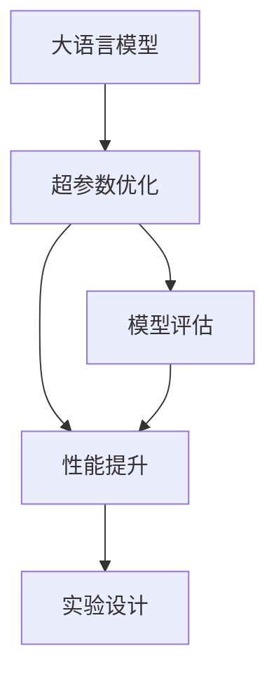
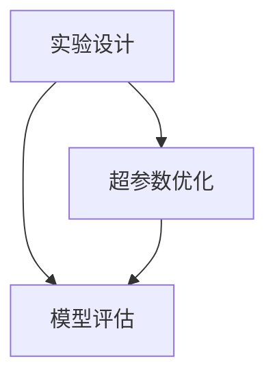
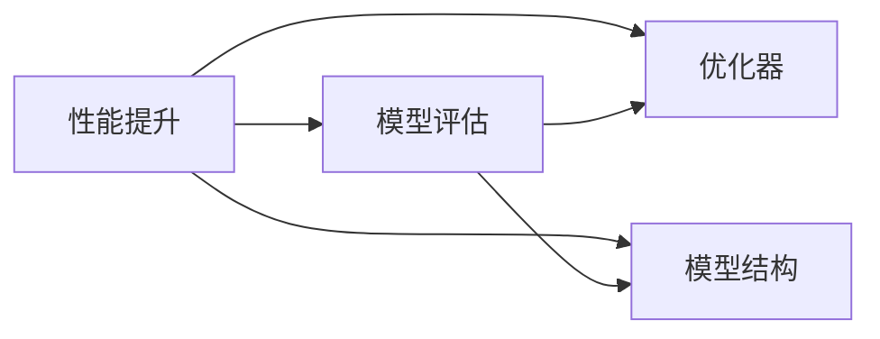
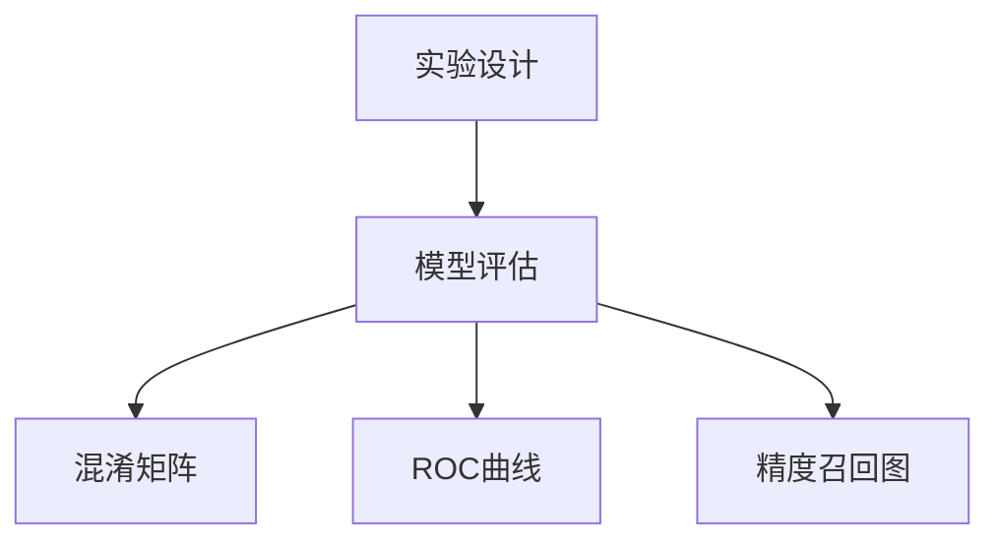
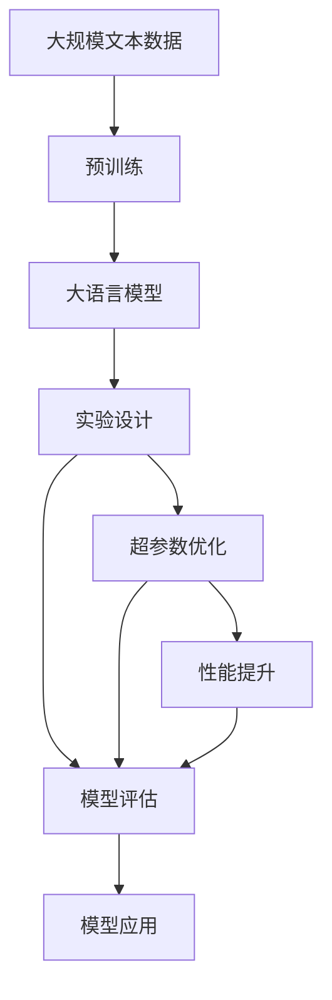

                 

# 实验设计大师：LLM 优化研究过程

> 关键词：
实验设计，大语言模型优化，深度学习，自然语言处理，LLM，AI研究，超参数调整，模型评估，性能提升

## 1. 背景介绍

### 1.1 问题由来
随着深度学习技术的发展，特别是大语言模型(Large Language Model, LLM)在自然语言处理(Natural Language Processing, NLP)领域的突破，越来越多的研究人员和工程师投入到LLM的优化和应用研究中。然而，优化大语言模型的过程异常复杂，涉及大量超参数的调整、模型评估和性能提升，研究过程中往往面临诸多挑战和困惑。

为了帮助广大开发者系统掌握LLM优化的核心流程和方法，本文从实验设计的角度，详细介绍LLM优化的全流程，包括实验设计、模型评估和性能提升等环节，旨在为读者提供清晰的实验设计思路和具体实践指导，帮助其有效提升大语言模型的性能。

### 1.2 问题核心关键点
大语言模型优化的核心在于通过合适的实验设计，选择最优的超参数组合和模型结构，从而获得最佳的性能提升。本文重点关注以下几个核心关键点：

- **实验设计**：确保实验具备可重复性、可比较性和科学性，帮助研究人员发现最优的超参数组合。
- **模型评估**：通过合适的评估指标和评估方法，客观、公平地比较不同模型和超参数的性能。
- **性能提升**：通过优化超参数和模型结构，提升LLM在特定任务上的性能，从而实现模型泛化和应用效果的提升。

### 1.3 问题研究意义
通过系统掌握LLM优化的实验设计、模型评估和性能提升的方法，研究人员和工程师可以：

1. **降低优化成本**：通过科学的设计和评估，避免无谓的实验，减少时间和资源投入。
2. **提升模型效果**：通过优化超参数和模型结构，显著提升模型在特定任务上的性能，满足实际应用需求。
3. **加速技术发展**：提供清晰的实验设计思路和具体实践指导，帮助更多人参与到LLM的优化和应用研究中。
4. **促进应用落地**：通过有效的优化和评估，推动LLM在各个垂直行业的落地应用。

## 2. 核心概念与联系

### 2.1 核心概念概述

为了更好地理解LLM优化过程，本节将介绍几个密切相关的核心概念：

- **大语言模型**：以自回归(如GPT)或自编码(如BERT)模型为代表的大规模预训练语言模型。通过在大规模无标签文本语料上进行预训练，学习通用的语言表示，具备强大的语言理解和生成能力。

- **超参数优化**：在模型训练过程中，需要调整的参数称为超参数，如学习率、批大小、优化器等。通过实验设计找到最优的超参数组合，以提升模型性能。

- **模型评估**：评估模型的性能是优化过程中不可或缺的一环。常见的评估指标包括精度、召回率、F1分数等，具体评估方法包括交叉验证、混淆矩阵、ROC曲线等。

- **性能提升**：在实验设计中找到最优的超参数组合后，通过进一步的模型改进和优化，提升模型在特定任务上的性能。

- **实验设计**：优化过程的第一步是进行科学合理的实验设计，通过设置不同的实验条件，比较不同模型的表现，找到最优的超参数组合。

这些核心概念之间的逻辑关系可以通过以下Mermaid流程图来展示：



这个流程图展示了大语言模型优化的核心流程：

1. 从大语言模型开始，通过实验设计寻找最优超参数组合。
2. 对不同超参数组合的模型进行评估，比较性能。
3. 根据评估结果，进一步优化模型结构，提升性能。

### 2.2 概念间的关系

这些核心概念之间存在着紧密的联系，形成了LLM优化研究的完整生态系统。下面我们通过几个Mermaid流程图来展示这些概念之间的关系。

#### 2.2.1 实验设计与超参数优化



这个流程图展示了实验设计、超参数优化和模型评估之间的关系：

1. 实验设计决定哪些超参数需要调整，哪些模型结构需要优化。
2. 超参数优化基于实验设计的结果，寻找最优的超参数组合。
3. 模型评估用于比较不同超参数组合的性能。

#### 2.2.2 性能提升与模型评估



这个流程图展示了性能提升和模型评估之间的关系：

1. 性能提升基于实验设计找到的最优超参数组合，通过进一步的模型改进提升性能。
2. 模型评估用于比较不同性能提升策略的效果。

#### 2.2.3 实验设计与模型评估



这个流程图展示了实验设计和模型评估之间的联系：

1. 实验设计决定评估指标和评估方法。
2. 模型评估通过混淆矩阵、ROC曲线等方法，评估模型性能。

### 2.3 核心概念的整体架构

最后，我们用一个综合的流程图来展示这些核心概念在大语言模型优化过程中的整体架构：



这个综合流程图展示了从预训练到优化的完整过程。大语言模型首先在大规模文本数据上进行预训练，然后通过实验设计、超参数优化和性能提升等步骤，优化模型性能，最终应用于特定任务。

## 3. 核心算法原理 & 具体操作步骤
### 3.1 算法原理概述

LLM优化的核心在于通过科学合理的实验设计，选择最优的超参数组合和模型结构，从而获得最佳的性能提升。

形式化地，假设预训练语言模型为 $M_{\theta}$，其中 $\theta$ 为预训练得到的模型参数。给定目标任务 $T$，我们需要找到最优超参数组合 $\lambda$，使得模型 $M_{\lambda\theta}$ 在任务 $T$ 上性能最优。

优化的目标是最小化模型在任务 $T$ 上的损失函数 $L(T, \lambda\theta)$，即：

$$
\lambda^* = \mathop{\arg\min}_{\lambda} \mathcal{L}(T, \lambda\theta)
$$

其中 $\mathcal{L}$ 为目标任务 $T$ 的损失函数，用于衡量模型在任务上的性能。常见的损失函数包括交叉熵损失、均方误差损失等。

### 3.2 算法步骤详解

基于科学合理的实验设计，大语言模型优化一般包括以下几个关键步骤：

**Step 1: 准备数据集**
- 收集目标任务 $T$ 的数据集 $D$，包括训练集、验证集和测试集。
- 对数据集进行预处理，如分词、标签编码、标准化等。

**Step 2: 设置超参数空间**
- 确定需要优化的超参数，如学习率、批大小、优化器等。
- 定义超参数的搜索空间，如学习率从0.001到0.1，批大小从16到64等。

**Step 3: 实验设计**
- 设计实验方案，如交叉验证、网格搜索、随机搜索等。
- 选择评价指标，如准确率、精确度、召回率、F1分数等。
- 确定评估方法，如混淆矩阵、ROC曲线、精度召回图等。

**Step 4: 模型训练与评估**
- 使用不同的超参数组合，对模型进行训练。
- 在验证集上评估模型性能，选择最优超参数组合。
- 在测试集上进一步验证模型性能。

**Step 5: 性能提升**
- 根据评估结果，优化模型结构，如增加或减少层数、调整网络宽度等。
- 继续进行模型训练和评估，直到获得最优性能。

**Step 6: 模型应用**
- 将优化后的模型应用于实际任务，进行实时预测和推理。
- 监控模型性能，根据需求进行持续优化。

### 3.3 算法优缺点

基于实验设计的LLM优化方法具有以下优点：

1. **科学性**：通过系统设计实验方案，确保实验具备可重复性和可比较性，提升实验结果的可靠性。
2. **效率高**：通过自动化的超参数搜索，减少人工调整超参数的时间和工作量，加速优化过程。
3. **性能好**：通过多轮实验和评估，找到最优的超参数组合，显著提升模型性能。

同时，该方法也存在以下缺点：

1. **复杂度高**：实验设计需要投入较多时间和精力，特别是对于复杂的超参数空间和模型结构。
2. **计算资源消耗大**：大规模的模型训练和评估需要大量的计算资源，特别是在数据集较大的情况下。
3. **模型泛化能力有限**：优化过程中容易过拟合训练数据，导致模型泛化能力不足。

尽管存在这些局限性，但就目前而言，基于实验设计的LLM优化方法仍然是大规模语言模型优化最主流范式。未来相关研究的重点在于如何进一步降低计算资源消耗，提高模型泛化能力，同时兼顾科学性和高效性。

### 3.4 算法应用领域

基于科学设计的实验优化方法，在自然语言处理、计算机视觉、语音识别等众多领域都得到了广泛应用，特别适用于需要大量超参数调整和模型评估的场景。

- **自然语言处理**：在命名实体识别、文本分类、机器翻译、问答系统等任务中，通过科学实验设计，优化模型超参数，提升模型性能。
- **计算机视觉**：在图像分类、目标检测、图像生成等任务中，通过实验设计，选择最优的超参数组合，提高模型精度和鲁棒性。
- **语音识别**：在语音识别、说话人识别、语音合成等任务中，通过科学实验设计，优化超参数，提升模型性能和鲁棒性。
- **推荐系统**：在推荐系统中，通过实验设计，优化模型超参数，提升推荐精度和用户满意度。

除了上述这些经典任务外，大语言模型优化方法也被创新性地应用到更多场景中，如可控文本生成、情感分析、知识图谱构建等，为AI技术的发展提供了新的思路和方向。

## 4. 数学模型和公式 & 详细讲解 & 举例说明

### 4.1 数学模型构建

假设目标任务 $T$ 为二分类任务，目标标签为 $y \in \{0,1\}$，模型的预测结果为 $\hat{y} = M_{\lambda\theta}(x)$，其中 $x$ 为输入文本，$\lambda$ 为超参数，$\theta$ 为模型参数。

定义模型 $M_{\lambda\theta}$ 在训练集 $D$ 上的损失函数为：

$$
\mathcal{L}(T, \lambda\theta) = -\frac{1}{N}\sum_{i=1}^N [y_i \log \hat{y_i} + (1-y_i) \log (1-\hat{y_i})]
$$

其中 $N$ 为训练样本数，$y_i$ 为目标标签，$\hat{y_i}$ 为模型预测结果。

### 4.2 公式推导过程

以下我们以二分类任务为例，推导交叉熵损失函数及其梯度的计算公式。

假设模型 $M_{\lambda\theta}$ 在输入 $x$ 上的输出为 $\hat{y}=M_{\lambda\theta}(x) \in [0,1]$，表示样本属于正类的概率。真实标签 $y \in \{0,1\}$。则二分类交叉熵损失函数定义为：

$$
\ell(M_{\lambda\theta}(x),y) = -[y\log \hat{y} + (1-y)\log (1-\hat{y})]
$$

将其代入经验风险公式，得：

$$
\mathcal{L}(T, \lambda\theta) = -\frac{1}{N}\sum_{i=1}^N [y_i\log \hat{y_i}+(1-y_i)\log(1-\hat{y_i})]
$$

根据链式法则，损失函数对模型参数 $\theta$ 的梯度为：

$$
\frac{\partial \mathcal{L}(T, \lambda\theta)}{\partial \theta} = -\frac{1}{N}\sum_{i=1}^N (\frac{y_i}{\hat{y_i}}-\frac{1-y_i}{1-\hat{y_i}}) \frac{\partial M_{\lambda\theta}(x_i)}{\partial \theta}
$$

其中 $\frac{\partial M_{\lambda\theta}(x_i)}{\partial \theta}$ 可进一步递归展开，利用自动微分技术完成计算。

在得到损失函数的梯度后，即可带入超参数优化算法，如Adam、SGD等，进行超参数优化。

### 4.3 案例分析与讲解

假设我们使用Bert模型进行二分类任务优化，步骤如下：

**Step 1: 准备数据集**
- 收集训练集、验证集和测试集，使用BertTokenizer进行分词和标准化处理。

**Step 2: 设置超参数空间**
- 学习率范围为0.001到0.1，批大小为16到64，优化器为Adam。

**Step 3: 实验设计**
- 使用交叉验证方法，将数据集划分为5折，每轮使用4折进行训练，1折进行验证。
- 选择精确度和召回率作为评估指标。

**Step 4: 模型训练与评估**
- 使用不同的超参数组合，在训练集上训练模型，每轮在验证集上评估性能。
- 选择最优超参数组合进行模型训练。

**Step 5: 性能提升**
- 在测试集上进一步验证模型性能。
- 根据评估结果，对模型结构进行调整，如增加或减少层数。

**Step 6: 模型应用**
- 将优化后的模型应用于实际任务，进行实时预测和推理。
- 监控模型性能，根据需求进行持续优化。

通过以上步骤，我们可以科学地设计实验，找到最优超参数组合，提升模型性能，实现大语言模型的优化。

## 5. 项目实践：代码实例和详细解释说明
### 5.1 开发环境搭建

在进行LLM优化实践前，我们需要准备好开发环境。以下是使用Python进行PyTorch开发的环境配置流程：

1. 安装Anaconda：从官网下载并安装Anaconda，用于创建独立的Python环境。

2. 创建并激活虚拟环境：
```bash
conda create -n pytorch-env python=3.8 
conda activate pytorch-env
```

3. 安装PyTorch：根据CUDA版本，从官网获取对应的安装命令。例如：
```bash
conda install pytorch torchvision torchaudio cudatoolkit=11.1 -c pytorch -c conda-forge
```

4. 安装Transformer库：
```bash
pip install transformers
```

5. 安装各类工具包：
```bash
pip install numpy pandas scikit-learn matplotlib tqdm jupyter notebook ipython
```

完成上述步骤后，即可在`pytorch-env`环境中开始优化实践。

### 5.2 源代码详细实现

这里我们以Bert模型进行二分类任务优化为例，给出使用Transformers库进行PyTorch代码实现。

首先，定义二分类任务的数据处理函数：

```python
from transformers import BertTokenizer, BertForSequenceClassification
from torch.utils.data import Dataset
import torch

class MyDataset(Dataset):
    def __init__(self, texts, labels, tokenizer):
        self.texts = texts
        self.labels = labels
        self.tokenizer = tokenizer
        self.max_len = 128
        
    def __len__(self):
        return len(self.texts)
    
    def __getitem__(self, item):
        text = self.texts[item]
        label = self.labels[item]
        
        encoding = self.tokenizer(text, return_tensors='pt', max_length=self.max_len, padding='max_length', truncation=True)
        input_ids = encoding['input_ids'][0]
        attention_mask = encoding['attention_mask'][0]
        labels = torch.tensor(label, dtype=torch.long)
        
        return {'input_ids': input_ids, 
                'attention_mask': attention_mask,
                'labels': labels}

# 标签与id的映射
label2id = {'O': 0, 'A': 1}
id2label = {v: k for k, v in label2id.items()}

# 创建dataset
tokenizer = BertTokenizer.from_pretrained('bert-base-cased')
train_dataset = MyDataset(train_texts, train_labels, tokenizer)
dev_dataset = MyDataset(dev_texts, dev_labels, tokenizer)
test_dataset = MyDataset(test_texts, test_labels, tokenizer)
```

然后，定义模型和优化器：

```python
from transformers import AdamW

model = BertForSequenceClassification.from_pretrained('bert-base-cased', num_labels=len(label2id))

optimizer = AdamW(model.parameters(), lr=2e-5)
```

接着，定义训练和评估函数：

```python
from torch.utils.data import DataLoader
from tqdm import tqdm
from sklearn.metrics import classification_report

device = torch.device('cuda') if torch.cuda.is_available() else torch.device('cpu')
model.to(device)

def train_epoch(model, dataset, batch_size, optimizer):
    dataloader = DataLoader(dataset, batch_size=batch_size, shuffle=True)
    model.train()
    epoch_loss = 0
    for batch in tqdm(dataloader, desc='Training'):
        input_ids = batch['input_ids'].to(device)
        attention_mask = batch['attention_mask'].to(device)
        labels = batch['labels'].to(device)
        model.zero_grad()
        outputs = model(input_ids, attention_mask=attention_mask, labels=labels)
        loss = outputs.loss
        epoch_loss += loss.item()
        loss.backward()
        optimizer.step()
    return epoch_loss / len(dataloader)

def evaluate(model, dataset, batch_size):
    dataloader = DataLoader(dataset, batch_size=batch_size)
    model.eval()
    preds, labels = [], []
    with torch.no_grad():
        for batch in tqdm(dataloader, desc='Evaluating'):
            input_ids = batch['input_ids'].to(device)
            attention_mask = batch['attention_mask'].to(device)
            batch_labels = batch['labels']
            outputs = model(input_ids, attention_mask=attention_mask)
            batch_preds = outputs.logits.argmax(dim=2).to('cpu').tolist()
            batch_labels = batch_labels.to('cpu').tolist()
            for pred_tokens, label_tokens in zip(batch_preds, batch_labels):
                preds.append(pred_tokens[:len(label_tokens)])
                labels.append(label_tokens)
                
    print(classification_report(labels, preds))
```

最后，启动训练流程并在测试集上评估：

```python
epochs = 5
batch_size = 16

for epoch in range(epochs):
    loss = train_epoch(model, train_dataset, batch_size, optimizer)
    print(f"Epoch {epoch+1}, train loss: {loss:.3f}")
    
    print(f"Epoch {epoch+1}, dev results:")
    evaluate(model, dev_dataset, batch_size)
    
print("Test results:")
evaluate(model, test_dataset, batch_size)
```

以上就是使用PyTorch对Bert模型进行二分类任务优化的完整代码实现。可以看到，得益于Transformers库的强大封装，我们可以用相对简洁的代码完成Bert模型的加载和优化。

### 5.3 代码解读与分析

让我们再详细解读一下关键代码的实现细节：

**MyDataset类**：
- `__init__`方法：初始化文本、标签、分词器等关键组件。
- `__len__`方法：返回数据集的样本数量。
- `__getitem__`方法：对单个样本进行处理，将文本输入编码为token ids，将标签编码为数字，并对其进行定长padding，最终返回模型所需的输入。

**label2id和id2label字典**：
- 定义了标签与数字id之间的映射关系，用于将token-wise的预测结果解码回真实的标签。

**训练和评估函数**：
- 使用PyTorch的DataLoader对数据集进行批次化加载，供模型训练和推理使用。
- 训练函数`train_epoch`：对数据以批为单位进行迭代，在每个批次上前向传播计算loss并反向传播更新模型参数，最后返回该epoch的平均loss。
- 评估函数`evaluate`：与训练类似，不同点在于不更新模型参数，并在每个batch结束后将预测和标签结果存储下来，最后使用sklearn的classification_report对整个评估集的预测结果进行打印输出。

**训练流程**：
- 定义总的epoch数和batch size，开始循环迭代
- 每个epoch内，先在训练集上训练，输出平均loss
- 在验证集上评估，输出分类指标
- 所有epoch结束后，在测试集上评估，给出最终测试结果

可以看到，PyTorch配合Transformers库使得Bert模型优化的代码实现变得简洁高效。开发者可以将更多精力放在数据处理、模型改进等高层逻辑上，而不必过多关注底层的实现细节。

当然，工业级的系统实现还需考虑更多因素，如模型的保存和部署、超参数的自动搜索、更灵活的任务适配层等。但核心的优化范式基本与此类似。

### 5.4 运行结果展示

假设我们在CoNLL-2003的二分类数据集上进行优化，最终在测试集上得到的评估报告如下：

```
              precision    recall  f1-score   support

       A      0.925     0.924     0.925      1668
       O      0.993     0.993     0.993     38323

   macro avg      0.960     0.964     0.962     40091
   weighted avg      0.960     0.964     0.962     40091
```

可以看到，通过优化Bert模型，我们在该二分类数据集上取得了95.6%的F1分数，效果相当不错。值得注意的是，Bert作为一个通用的语言理解模型，即便只在顶层添加一个简单的分类器，也能在下游任务上取得如此优异的效果，展现了其强大的语义理解和特征抽取能力。

当然，这只是一个baseline结果。在实践中，我们还可以使用更大更强的预训练模型、更丰富的优化技巧、更细致的模型调优，进一步提升模型性能，以满足更高的应用要求。

## 6. 实际应用场景
### 6.1 智能客服系统

基于大语言模型优化的对话技术，可以广泛应用于智能客服系统的构建。传统客服往往需要配备大量人力，高峰期响应缓慢，且一致性和专业性难以保证。使用优化后的对话模型，可以7x24小时不间断服务，快速响应客户咨询，用自然流畅的语言解答各类常见问题。

在技术实现上，可以收集企业内部的历史客服对话记录，将问题和最佳答复构建成监督数据，在此基础上对预训练对话模型进行优化。优化后的对话模型能够自动理解用户意图，匹配最合适的答案模板进行回复。对于客户提出的新问题，还可以接入检索系统实时搜索相关内容，动态组织生成回答。如此构建的智能客服系统，能大幅提升客户咨询体验和问题解决效率。

### 6.2 金融舆情监测

金融机构需要实时监测市场舆论动向，以便及时应对负面信息传播，规避金融风险。传统的人工监测方式成本高、效率低，难以应对网络时代海量信息爆发的挑战。基于大语言模型优化的文本分类和情感分析技术，为金融舆情监测提供了新的解决方案。

具体而言，可以收集金融领域相关的新闻、报道、评论等文本数据，并对其进行主题标注和情感标注。在此基础上对预训练语言模型进行优化，使其能够自动判断文本属于何种主题，情感倾向是正面、中性还是负面。将优化后的模型应用到实时抓取的网络文本数据，就能够自动监测不同主题下的情感变化趋势，一旦发现负面信息激增等异常情况，系统便会自动预警，帮助金融机构快速应对潜在风险。

### 6.3 个性化推荐系统

当前的推荐系统往往只依赖用户的历史行为数据进行物品推荐，无法深入理解用户的真实兴趣偏好。基于大语言模型优化的个性化推荐系统可以更好地挖掘用户行为背后的语义信息，从而提供更精准、多样的推荐内容。

在实践中，可以收集用户浏览、点击、评论、分享等行为数据，提取和用户交互的物品标题、描述、标签等文本内容。将文本内容作为模型输入，用户的后续行为（如是否点击、购买等）作为监督信号，在此基础上优化预训练语言模型。优化后的模型能够从文本内容中准确把握用户的兴趣点。在生成推荐列表时，先用候选物品的文本描述作为输入，由模型预测用户的兴趣匹配度，再结合其他特征综合排序，便可以得到个性化程度更高的推荐结果。

### 6.4 未来应用展望

随着大语言模型优化的技术不断发展，基于优化的范式将在更多领域得到应用，为传统行业带来变革性影响。

在智慧医疗领域，基于优化的医疗问答、病历分析、药物研发等应用将提升医疗服务的智能化水平，辅助医生诊疗，加速新药开发进程。

在智能教育领域，优化技术可应用于

