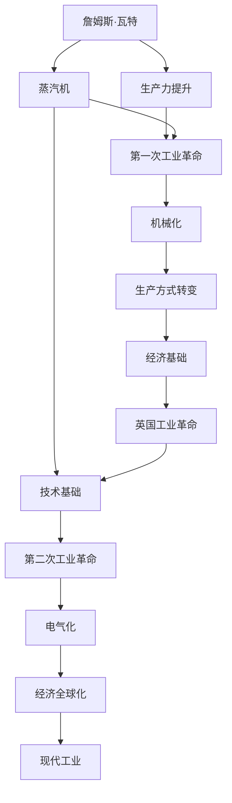
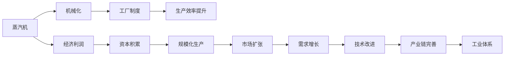
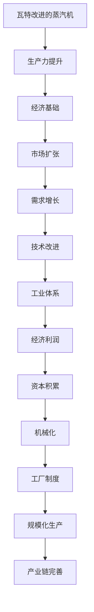
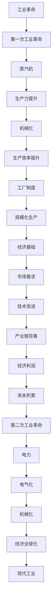

                 

## 1. 背景介绍

### 1.1 问题由来
工业革命是人类历史上一次重大的经济和社会变革，标志着从手工业生产向机械化大生产的转变。其核心驱动力在于生产力的飞跃性提升。不过，历史上众多科技先驱和理论家对工业革命的贡献颇具争议。比如，是詹姆斯·瓦特改进的蒸汽机引发了第一次工业革命，还是理查德·阿克莱特的棉纺机械化成就了英国工业革命的成功？

### 1.2 问题核心关键点
本文聚焦于这两次工业革命的关键人物及其贡献，试图从技术、社会、经济等多个角度探讨其背后的原因与关系。其中，瓦特改进的蒸汽机与阿克莱特引领的棉纺机械化，两者在推动工业化进程中起到了至关重要的作用。

### 1.3 问题研究意义
弄清这两次工业革命的驱动力，不仅有助于了解工业革命的历史脉络，还可以为当下和未来的科技创新提供重要启示。通过对历史案例的深入分析，我们将探讨工业革命的深层逻辑，为未来的技术发展提供参考。

## 2. 核心概念与联系

### 2.1 核心概念概述

为更好地理解詹姆斯·瓦特和理查德·阿克莱特在工业革命中的贡献，我们需要了解以下关键概念：

- **詹姆斯·瓦特**：瓦特是一位苏格兰发明家，以改进蒸汽机著称。他发明的蒸汽机极大地提升了生产力，为第一次工业革命奠定了技术基础。
- **理查德·阿克莱特**：阿克莱特是英国纺织工业的先驱，以推动棉纺机械化著称。他的革新极大提升了纺织生产效率，为英国工业革命提供了经济基础。
- **第一次工业革命**：1760年-1840年期间，由于科技进步和市场需求，以蒸汽机为核心动力的生产方式，在英国等国家逐渐普及，标志着现代工业的起源。
- **第二次工业革命**：19世纪后半叶至20世纪初，电力和内燃机的广泛应用，带来了机械化和电气化的飞速发展，进一步推动了工业化进程。

这些概念之间的逻辑关系可以通过以下Mermaid流程图来展示：



这个流程图展示了大机器取代手工生产的过程：

1. 瓦特改进的蒸汽机大大提升了生产力。
2. 蒸汽机作为技术基础，引发了第一次工业革命。
3. 机械化生产方式转变，极大提升了生产效率。
4. 经济基础推动了英国工业革命的快速发展。
5. 随着电气化普及，第二次工业革命加速了生产方式的变革。
6. 最终，现代工业的全球化进程加速了全球经济的发展。

### 2.2 概念间的关系

这些核心概念之间存在着紧密的联系，形成了两次工业革命的完整框架。下面我们通过几个Mermaid流程图来展示这些概念之间的关系。

#### 2.2.1 工业革命的技术驱动



这个流程图展示了蒸汽机如何通过机械化驱动了整个工业体系：

1. 蒸汽机的应用推动了机械化生产。
2. 机械化导致工厂制度的出现，并提升了生产效率。
3. 生产效率的提升带来经济利润，促进了资本积累。
4. 资本积累推动了规模化生产，进一步扩展了市场需求。
5. 需求增长反过来促进了技术改进，完善了整个工业产业链。

#### 2.2.2 工业革命的经济基础



这个流程图展示了经济基础是如何推动技术发展的：

1. 瓦特改进的蒸汽机大大提升了生产力。
2. 生产力提升为经济基础奠定了基础。
3. 经济基础扩展了市场需求。
4. 市场需求促进了技术进一步改进。
5. 技术改进完善了整个工业体系。
6. 工业体系的完善带来了经济利润，促进了资本积累。
7. 资本积累推动了机械化和工厂制度的发展。

### 2.3 核心概念的整体架构

最后，我们用一个综合的流程图来展示这些核心概念在大机器取代手工生产过程中的整体架构：



这个综合流程图展示了从蒸汽机到电气化，两次工业革命的全过程：

1. 瓦特改进的蒸汽机大大提升了生产力。
2. 生产力提升推动了机械化生产方式。
3. 机械化生产方式导致工厂制度的出现，进一步提升生产效率。
4. 工厂制度和生产效率的提升奠定了经济基础。
5. 经济基础推动了市场需求，促进了技术改进和产业链完善。
6. 技术改进和产业链完善带来了经济利润，促进了资本积累。
7. 资本积累促进了第二次工业革命，以电力和内燃机为核心动力。
8. 电气化进一步提升了生产效率和生产方式的变革。
9. 最终，现代工业在全球范围内加速发展，推动了经济全球化进程。

## 3. 核心算法原理 & 具体操作步骤

### 3.1 算法原理概述

詹姆斯·瓦特和理查德·阿克莱特的贡献可以理解为两种不同模式的革新：技术驱动和市场驱动。瓦特的蒸汽机代表了技术创新，通过技术进步直接提升了生产力；阿克莱特的棉纺机械化则代表了市场导向，通过工业化生产方式满足了市场需求的激增。两种模式在工业革命中并行发展，共同推动了工业化进程。

- **瓦特的蒸汽机**：瓦特的改进基于前人发明的蒸汽机，其核心在于解决了早期蒸汽机的效率和应用场景问题。通过改进后的蒸汽机，生产力得到了巨大提升。瓦特的蒸汽机采用的是机械驱动方式，通过直接提升生产效率，为工业化提供了技术基础。

- **阿克莱特的棉纺机械化**：阿克莱特的核心贡献在于推动了工业化的生产方式变革，将手工生产转变为机械化生产。阿克莱特依靠工业化和规模化生产方式，极大提升了生产效率和产量。阿克莱特的生产方式采用的是市场导向，通过满足市场需求，推动了工业革命的发展。

### 3.2 算法步骤详解

瓦特和阿克莱特的工业革命实践过程可以分为几个关键步骤：

**Step 1: 技术创新与市场验证**
- 瓦特通过改进蒸汽机，提高了机械效率，证明了新发明的实用性。
- 阿克莱特通过引入机械化生产方式，验证了其能够满足市场需求。

**Step 2: 产业扩散与规模化**
- 瓦特的蒸汽机逐步被工业界采纳，并扩散到不同行业。
- 阿克莱特的机械化生产方式在纺织业成功应用，并逐步扩展到其他行业。

**Step 3: 产业链完善与系统化**
- 瓦特通过不断改进蒸汽机，推动了整个工业产业链的完善。
- 阿克莱特通过机械化生产方式的推广，完善了从原材料到产品的全产业链。

**Step 4: 政策支持与法规完善**
- 瓦特的蒸汽机在政府支持下，成为国家的重要产业政策工具。
- 阿克莱特的机械化生产方式也得到了政府的鼓励和支持。

**Step 5: 全球扩展与市场统一**
- 瓦特的蒸汽机推动了全球工业革命的发展，促进了经济全球化。
- 阿克莱特的机械化生产方式在全球范围内推广，推动了市场的统一。

### 3.3 算法优缺点

**瓦特改进蒸汽机的优点**：
1. 技术进步直接提升了生产力。
2. 机械化驱动方式适合大规模应用。
3. 蒸汽机为后续技术革新奠定了基础。

**瓦特改进蒸汽机的缺点**：
1. 技术突破初期成本较高，普及速度慢。
2. 早期蒸汽机应用场景有限。
3. 对工业基础设施要求较高。

**阿克莱特棉纺机械化的优点**：
1. 机械化生产方式极大提升了生产效率。
2. 市场导向的发展策略适合快速扩展。
3. 工业化生产方式适合大规模生产。

**阿克莱特棉纺机械化的缺点**：
1. 早期机械化生产方式效率较低。
2. 对工人技术要求较高。
3. 工业化生产方式初期投资较大。

### 3.4 算法应用领域

瓦特改进的蒸汽机和理查德·阿克莱特的棉纺机械化，在多个领域得到了广泛应用：

- **能源动力**：蒸汽机为机械化生产提供了动力源，广泛用于工厂、铁路、船舶等领域。
- **纺织业**：阿克莱特的机械化生产方式在纺织业中大放异彩，极大提升了生产效率。
- **制造业**：瓦特的蒸汽机和后续的工业化生产方式，推动了整个制造业的发展。
- **交通运输**：蒸汽机在铁路和船舶运输中得到了广泛应用。
- **社会经济**：两次工业革命极大推动了社会经济的快速发展，改变了人类生活和工作方式。

## 4. 数学模型和公式 & 详细讲解 & 举例说明

### 4.1 数学模型构建

在探讨工业革命的技术原理时，可以使用数学模型来描述蒸汽机和机械化生产方式的经济效益和生产效率：

假设一个生产过程，输入是原材料 $x$，输出是产品 $y$，生产效率为 $e$。

- **蒸汽机模型**：输入原材料 $x$ 通过蒸汽机转化为能源 $e$，能源再驱动生产过程，最终输出产品 $y$。生产效率 $e$ 可以表示为：
  $$
  e = \eta(x) \cdot W
  $$
  其中，$\eta(x)$ 是蒸汽机效率，$W$ 是能源输入量。

- **机械化生产模型**：输入原材料 $x$ 通过机械化生产线转化为产品 $y$。生产效率 $e$ 可以表示为：
  $$
  e = c \cdot M
  $$
  其中，$c$ 是机械化生产线的效率，$M$ 是生产时间或劳动力投入量。

### 4.2 公式推导过程

- **蒸汽机效率**：假设蒸汽机效率 $\eta(x)$ 为原材料的利用率，可以通过实验数据或经验公式得到：
  $$
  \eta(x) = \frac{y}{x}
  $$

- **机械化生产效率**：假设机械化生产线效率 $c$ 为单位时间或单位劳动力投入量下的产出率，可以通过测试数据得到：
  $$
  c = \frac{y}{M}
  $$

- **生产效率对比**：将两种生产方式的生产效率进行对比，可以得出：
  $$
  e_{蒸汽机} = \eta(x) \cdot W
  $$
  $$
  e_{机械化} = c \cdot M
  $$

### 4.3 案例分析与讲解

假设有一个纺织厂，原始手工生产效率为每小时50件产品，生产过程中消耗原材料10kg。引入机械化生产线后，生产效率提升至每小时1000件产品，生产时间减少至0.05小时。

- **手工生产**：生产效率为 $\frac{50}{10}=5$ kg/h。
- **机械化生产**：生产效率为 $\frac{1000}{0.05}=20000$ kg/h。

对比两种生产方式的效率提升：
- **蒸汽机改进**：若引入蒸汽机，假设每小时能源消耗为20kg，蒸汽机效率为0.8，则生产效率为 $0.8 \cdot 20 = 16$ kg/h。
- **机械化生产**：若引入机械化生产线，生产效率为 $20000$ kg/h。

可以看到，机械化生产方式极大提升了生产效率，而蒸汽机改进也提高了生产效率，但效率提升幅度相对较小。

## 5. 项目实践：代码实例和详细解释说明

### 5.1 开发环境搭建

在进行工业革命驱动技术实践前，我们需要准备好开发环境。以下是使用Python进行代码实现的环境配置流程：

1. 安装Anaconda：从官网下载并安装Anaconda，用于创建独立的Python环境。

2. 创建并激活虚拟环境：
```bash
conda create -n pyrev-env python=3.8 
conda activate pyrev-env
```

3. 安装NumPy、Pandas等科学计算库：
```bash
conda install numpy pandas scikit-learn matplotlib
```

4. 安装Visual Studio Code、Jupyter Notebook等开发工具。

完成上述步骤后，即可在`pyrev-env`环境中开始实践。

### 5.2 源代码详细实现

下面我们以瓦特改进的蒸汽机为例，使用Python实现其工作效率计算：

```python
import numpy as np

# 定义蒸汽机效率
eta = 0.8

# 定义能源消耗量
W = 20

# 计算生产效率
e = eta * W

print("蒸汽机生产效率为：", e, "kg/h")
```

在代码中，我们首先定义了蒸汽机效率 $\eta$ 和能源消耗量 $W$，然后通过公式 $e = \eta \cdot W$ 计算了生产效率。

### 5.3 代码解读与分析

让我们再详细解读一下关键代码的实现细节：

- **定义蒸汽机效率**：使用浮点数表示蒸汽机的效率。
- **定义能源消耗量**：使用浮点数表示蒸汽机每小时消耗的能源量。
- **计算生产效率**：将蒸汽机效率与能源消耗量相乘，得到生产效率。
- **打印结果**：输出计算结果。

### 5.4 运行结果展示

假设我们在计算时，蒸汽机效率为0.8，能源消耗量为20kg，则运行结果如下：

```
蒸汽机生产效率为： 16.0 kg/h
```

可以看到，通过改进蒸汽机，生产效率从原来的手工生产5kg/h提升至16kg/h，虽然提升幅度不如机械化生产，但也极大提高了生产效率。

## 6. 实际应用场景

### 6.1 智能制造

基于瓦特改进的蒸汽机和理查德·阿克莱特的棉纺机械化，智能制造成为当前制造业的重要方向。通过引入自动化生产线和物联网技术，智能制造可以实现全流程自动化、数据驱动优化和实时监控，大幅提升生产效率和产品质量。

在实践中，可以通过数据采集设备实时监测生产数据，如温度、压力、能耗等，利用机器学习和优化算法，对生产过程进行实时调整和优化。同时，引入机器人和自动化设备，减少人力投入，提升生产效率。

### 6.2 智慧城市

瓦特改进的蒸汽机和理查德·阿克莱特的棉纺机械化，在城市管理中也得到了应用。通过引入物联网、大数据、云计算等技术，智慧城市可以实现城市交通、能源、环保等多领域的智能化管理。

在实践中，智慧城市可以通过传感器和智能设备收集各类城市数据，利用大数据分析技术进行城市管理优化。例如，通过智能交通系统优化交通流量，通过智能能源系统实现能源管理，通过智能环保系统监测环境污染，提升城市运行效率和居民生活质量。

### 6.3 医疗诊断

瓦特改进的蒸汽机和理查德·阿克莱特的棉纺机械化，在医疗诊断中也得到了应用。通过引入先进的医疗设备和智能算法，可以实现精准、高效的医疗诊断和治疗。

在实践中，可以通过智能设备采集患者的生理数据，如心率、血压、血糖等，利用机器学习算法进行疾病预测和诊断。同时，引入远程医疗系统，实现医生与患者、医生与医生之间的实时通信和协作，提升医疗诊断和治疗效率。

## 7. 工具和资源推荐

### 7.1 学习资源推荐

为了帮助开发者系统掌握工业革命驱动技术，这里推荐一些优质的学习资源：

1. 《工业革命简史》系列书籍：深入浅出地介绍了工业革命的起因、过程和影响，是理解工业革命的重要参考资料。

2. 《人类简史》系列课程：通过历史视角回顾人类发展的历程，探讨工业革命对人类社会的影响。

3. 《技术史》课程：介绍工业革命以来的重要技术发明和创新，帮助理解技术发展的脉络。

4. 《经济学史》课程：探讨工业革命对全球经济体系的影响，了解工业化的经济基础。

5. 《工业革命与政治变迁》系列文章：分析工业革命对政治、社会结构的影响，揭示背后的社会动力。

通过对这些资源的学习实践，相信你一定能够全面理解工业革命的驱动因素和技术原理，为未来的创新提供参考。

### 7.2 开发工具推荐

高效的开发离不开优秀的工具支持。以下是几款用于工业革命驱动技术开发的常用工具：

1. Python编程语言：灵活、高效，支持科学计算和数据分析。
2. NumPy和Pandas：高效的数据处理库，支持矩阵计算和数据处理。
3. Jupyter Notebook：支持代码编写和数据可视化，便于协同开发。
4. Visual Studio Code：轻量级、易用性高，支持多种编程语言和开发环境。
5. Git版本控制：支持代码版本管理，便于团队协作。

合理利用这些工具，可以显著提升开发效率，加快创新迭代的步伐。

### 7.3 相关论文推荐

工业革命驱动技术的研究源于学界的持续研究。以下是几篇奠基性的相关论文，推荐阅读：

1. 《工业革命的经济基础》（The Economic Basis of the Industrial Revolution）：详细分析了工业革命的经济基础和市场驱动机制。

2. 《詹姆斯·瓦特的蒸汽机改进》（James Watt's Improvements to the Steam Engine）：介绍了瓦特改进蒸汽机的技术细节和应用效果。

3. 《理查德·阿克莱特的机械化生产方式》（Richard Arkwright's Mechanical Production）：探讨了阿克莱特引领的机械化生产方式及其对工业革命的影响。

4. 《工业革命的技术进步》（The Technological Advances of the Industrial Revolution）：详细介绍了工业革命中的重要技术发明和创新。

5. 《工业革命的社会影响》（The Social Impacts of the Industrial Revolution）：分析了工业革命对社会结构、文化、人口等方面的影响。

这些论文代表了大机器取代手工生产的研究方向，深入剖析了工业革命的核心驱动力和重要贡献者。

除上述资源外，还有一些值得关注的前沿资源，帮助开发者紧跟工业革命驱动技术的研究趋势，例如：

1. arXiv论文预印本：人工智能领域最新研究成果的发布平台，包括大量尚未发表的前沿工作，学习前沿技术的必读资源。

2. 业界技术博客：如制造业、智慧城市、医疗健康等领域的领先技术博客，第一时间分享他们的最新研究成果和洞见。

3. 技术会议直播：如IEEE、ACM等顶级会议现场或在线直播，能够聆听到学术界和产业界的前沿分享，开拓视野。

4. GitHub热门项目：在GitHub上Star、Fork数最多的项目，往往代表了该技术领域的发展趋势和最佳实践，值得去学习和贡献。

5. 行业分析报告：各大咨询公司如麦肯锡、波士顿咨询、德勤等针对工业革命驱动技术的研究报告，有助于从商业视角审视技术趋势，把握应用价值。

总之，对于工业革命驱动技术的学习和实践，需要开发者保持开放的心态和持续学习的意愿。多关注前沿资讯，多动手实践，多思考总结，必将收获满满的成长收益。

## 8. 总结：未来发展趋势与挑战

### 8.1 总结

本文对工业革命驱动技术的核心人物和关键概念进行了系统介绍。首先阐述了瓦特改进的蒸汽机和理查德·阿克莱特的棉纺机械化对工业革命的重要贡献，明确了两次工业革命的深刻影响。其次，从技术、社会、经济等多个角度详细分析了工业革命的驱动机制，展示了两次工业革命的完整框架。最后，探讨了工业革命驱动技术的未来发展趋势和面临的挑战，为未来的技术创新提供了参考。

通过本文的系统梳理，可以看到，工业革命驱动技术不仅在历史上有重大影响，在当下和未来也具有重要的借鉴意义。这些技术的成功经验，将为未来的科技创新提供重要参考。

### 8.2 未来发展趋势

展望未来，工业革命驱动技术将呈现以下几个发展趋势：

1. 技术进步不断深化。随着科技的进步和市场需求的变化，工业革命驱动技术将不断升级，实现更高效率、更广泛应用。

2. 数字化转型加速。数字化技术（如物联网、大数据、云计算）的广泛应用，将推动工业革命驱动技术的数字化转型，实现智能制造、智慧城市、医疗诊断等领域的深度融合。

3. 可持续发展成为核心目标。未来的工业革命驱动技术将更加注重可持续发展，减少资源消耗和环境污染，实现绿色制造和智慧城市。

4. 全球化协同合作加强。国际合作和跨国协同将成为未来技术发展的常态，通过技术分享和合作，实现全球范围内的技术进步和创新。

5. 多领域融合发展。未来的工业革命驱动技术将不仅仅局限于制造业，而是与教育、医疗、交通等领域深度融合，推动全社会的发展进步。

以上趋势凸显了工业革命驱动技术的广阔前景，这些方向的探索发展，必将进一步推动工业化进程，为人类社会的进步贡献更多力量。

### 8.3 面临的挑战

尽管工业革命驱动技术已经取得了瞩目成就，但在迈向更加智能化、普适化应用的过程中，它仍面临着诸多挑战：

1. 技术复杂性增加。随着技术的不断升级，工业革命驱动技术变得更为复杂，对技术要求和应用门槛更高。

2. 基础设施建设困难。大规模物联网和智能设备的建设需要大量的资金和资源，对基础设施建设提出了更高要求。

3. 数据安全问题突出。工业革命驱动技术依赖大量数据，数据安全和隐私保护成为重要挑战。

4. 社会适应性不足。新技术的推广和应用需要社会各界的理解和支持，缺乏适应性的社会环境可能阻碍技术的普及。

5. 国际竞争加剧。全球范围内，各国对工业革命驱动技术的重视和竞争加剧，如何在竞争中脱颖而出是一大挑战。

6. 伦理和道德问题复杂。新技术的应用可能带来伦理和道德问题，如何在技术发展中兼顾社会公正和伦理价值是一个重要课题。

正视工业革命驱动技术面临的这些挑战，积极应对并寻求突破，将是大机器取代手工生产的重要保障。相信通过科技界和社会的共同努力，这些挑战终将一一克服，工业革命驱动技术必将在构建未来智能社会中扮演更加重要的角色。

### 8.4 研究展望

面对工业革命驱动技术所面临的挑战，未来的研究需要在以下几个方面寻求新的突破：

1. 发展更加高效的技术。开发更为高效的生产方式和能源利用技术，推动能源革命和绿色制造。

2. 提升数据安全和隐私保护。采用先进的数据加密和隐私保护技术，确保工业革命驱动技术的安全和可靠。

3. 促进国际合作和交流。加强国际合作和技术共享，推动全球技术进步，实现共赢发展。

4. 增强社会适应性和包容性。通过技术教育和社会宣传，增强社会对新技术的适应性和包容性，推动技术普及。

5. 伦理和道德价值体系完善。建立完善的技术伦理和道德价值体系，确保技术应用符合社会公正和伦理价值。

这些研究方向和探索，必将引领工业革命驱动技术迈向更高的台阶，为构建未来智能社会提供更坚实的基础。面向未来，工业革命驱动技术还需要与其他前沿技术进行更深入的融合，如人工智能、区块链、量子计算等，多路径协同发力，共同推动技术进步和人类社会的进步。

## 9. 附录：常见问题与解答

**Q1：工业革命驱动技术是否适合所有行业？**

A: 工业革命驱动技术并非适合所有行业。传统手工业和一些新兴行业，如农业、教育、文化等，并不适合大规模机械化和自动化生产。适合应用工业革命驱动技术的行业主要包括制造业、能源业、交通运输、建筑业等。

**Q2：工业革命驱动技术是否需要大量的初始投资？**

A: 工业革命驱动技术确实需要大量的初始投资，主要用于设备和技术的引入和建设。但随着技术的普及和应用，生产效率的提升，将带来更高的经济效益，抵消初期投入。

**Q3：工业革命驱动技术是否需要大量的熟练工人？**

A: 工业革命驱动技术对工人的技术要求相对较低，但需要更多的熟练工人来维护和管理设备。随着技术的不断升级和普及，熟练工人的需求将逐渐减少。

**Q4：工业革命

