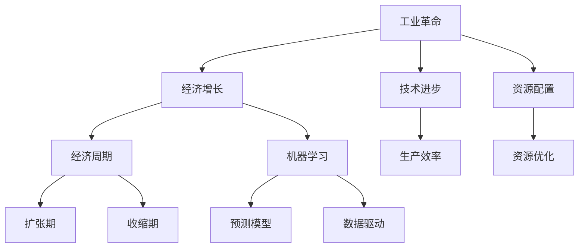
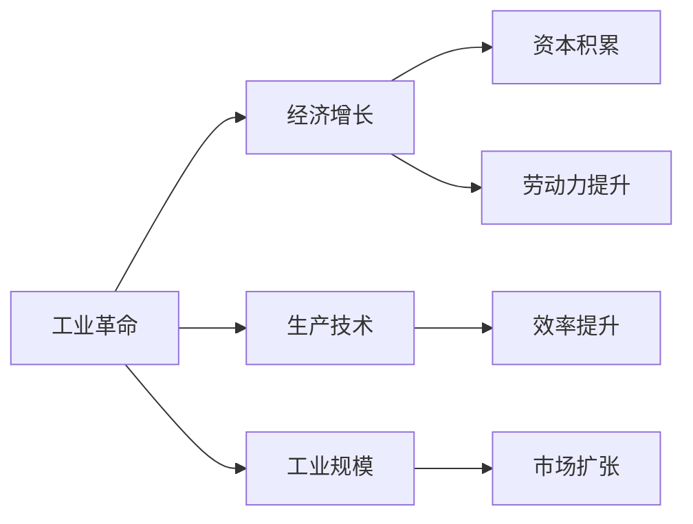
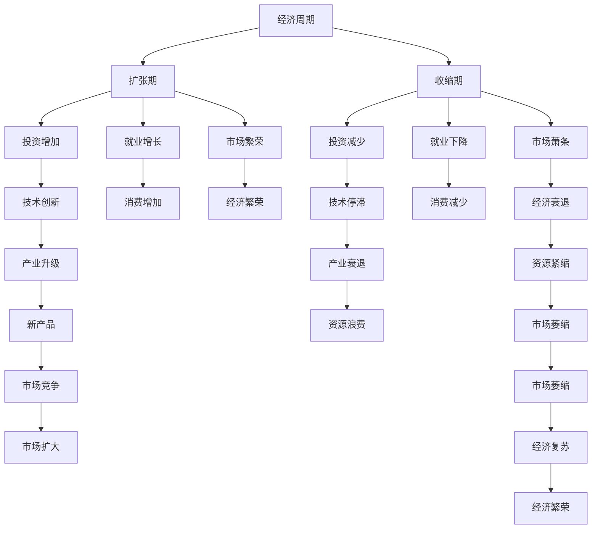
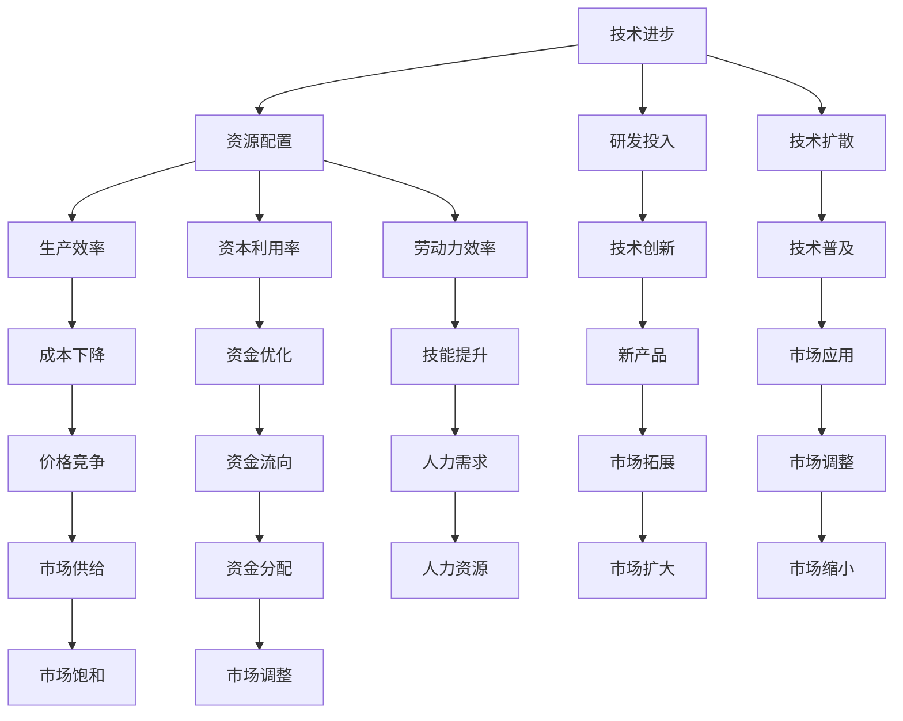
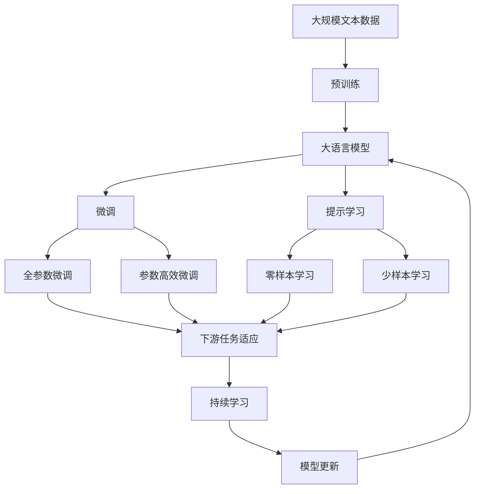

                 

# 工业革命后的经济爆发期

> 关键词：工业革命,经济增长,技术进步,资源配置,经济周期,机器学习

## 1. 背景介绍

### 1.1 问题由来
自工业革命以来，全球经济迎来了前所未有的增长和繁荣。机器的发明和大规模生产改变了人类社会的生产模式，极大地提高了生产效率和物质富裕程度。然而，在过去两个世纪的快速发展过程中，经济周期和经济波动现象始终伴随着工业化进程。经济危机的频繁出现和经济增长的停滞期，给全球经济带来了巨大的挑战。

如何理解工业革命后经济爆发的原因，以及如何应对周期性经济波动，成为当前经济学和计算机科学界共同关注的重要问题。本文旨在通过分析工业革命后经济发展的关键驱动因素，探讨技术进步和资源配置在推动经济增长的作用，以及机器学习在预测经济周期中的潜在应用。

### 1.2 问题核心关键点
核心问题在于理解工业革命后经济增长的根本原因，并探讨如何通过技术进步和资源配置优化，稳定经济周期，实现持续的繁荣。同时，本文还将探讨机器学习在经济周期预测中的应用，如何利用历史数据和模型预测未来经济走势，帮助决策者进行风险控制和经济规划。

### 1.3 问题研究意义
研究工业革命后的经济增长和周期性波动，对于理解当前经济环境、制定有效的经济政策和规划未来的经济发展具有重要意义。此外，探讨机器学习在经济周期预测中的应用，也有助于提高决策的科学性和准确性，从而更好地应对经济波动带来的挑战。

## 2. 核心概念与联系

### 2.1 核心概念概述

为更好地理解工业革命后经济发展的关键因素，本节将介绍几个密切相关的核心概念：

- 工业革命（Industrial Revolution）：始于18世纪末，通过机械化和工业化生产方式，极大地提高了生产效率，促进了全球经济的大规模增长。
- 经济增长（Economic Growth）：指一个国家或地区在一定时期内，经济产出（GDP）的增长，通常由技术进步、资本积累和劳动力增长等因素推动。
- 技术进步（Technological Advancement）：通过创新和研发，改进生产技术和工艺，提升生产效率和经济效益的过程。
- 资源配置（Resource Allocation）：在生产过程中，根据市场供需关系，合理分配资金、物资和劳动力等资源，以实现资源的最优利用。
- 经济周期（Economic Cycle）：指经济增长过程中，呈现的扩张与收缩交替出现的周期性波动现象，通常由多种因素共同作用导致。
- 机器学习（Machine Learning）：一种通过算法和统计模型，使计算机系统能够自动学习和改进，以提高决策和预测准确性的技术。

这些核心概念之间的逻辑关系可以通过以下Mermaid流程图来展示：



这个流程图展示了工业革命后经济发展的主要驱动因素及其关系：

1. 工业革命通过技术进步和资源配置，极大地提高了生产效率和经济增长。
2. 经济增长带动了经济周期性波动，但机器学习提供了预测和稳定经济周期的可能。

### 2.2 概念间的关系

这些核心概念之间存在着紧密的联系，形成了工业革命后经济发展的完整生态系统。下面我通过几个Mermaid流程图来展示这些概念之间的关系。

#### 2.2.1 工业革命与经济增长



这个流程图展示了工业革命如何通过技术进步和规模化生产，推动经济增长。生产技术的提升和工业规模的扩大，使得生产效率大幅提高，从而促进了经济增长。

#### 2.2.2 经济周期与机器学习



这个流程图展示了经济周期中的扩张期和收缩期，以及机器学习在预测和稳定经济周期中的作用。技术创新和消费增加推动经济扩张，而技术停滞和消费减少导致经济收缩。机器学习通过预测技术进步和市场变化，可以帮助决策者采取有效措施，稳定经济周期。

#### 2.2.3 技术进步与资源配置



这个流程图展示了技术进步如何通过资源配置优化，提升生产效率和资源利用率。技术创新和研发投入推动了技术进步，通过技术扩散和市场应用，优化了资源配置，提高了生产效率和资本利用率，从而促进了经济增长。

### 2.3 核心概念的整体架构

最后，我们用一个综合的流程图来展示这些核心概念在大语言模型微调过程中的整体架构：



这个综合流程图展示了从预训练到微调，再到持续学习的完整过程。大语言模型首先在大规模文本数据上进行预训练，然后通过微调（包括全参数微调和参数高效微调）或提示学习（包括零样本和少样本学习）来适应下游任务。最后，通过持续学习技术，模型可以不断更新和适应新的任务和数据。 通过这些流程图，我们可以更清晰地理解工业革命后经济发展过程中各个核心概念的关系和作用。

## 3. 核心算法原理 & 具体操作步骤
### 3.1 算法原理概述

工业革命后的经济发展，本质上是一个复杂的多因素互动系统。其核心驱动因素包括技术进步、资本积累和劳动力增长。机器学习作为一种强大的数据分析和预测工具，可以在理解这些因素及其互动关系的基础上，提供有效的方法来预测经济周期，稳定经济波动。

从算法原理的角度来看，机器学习在预测经济周期时，通常采用以下步骤：

1. 数据预处理：收集历史经济数据，包括GDP增长率、通货膨胀率、就业率、工业产值、消费支出等，并将其转换为数值形式。
2. 特征工程：从原始数据中提取有意义的特征，如周期性指标、趋势变化、季节性因素等。
3. 模型训练：选择适合的机器学习算法（如线性回归、时间序列分析、支持向量机等），并利用历史数据对模型进行训练。
4. 模型评估：使用测试数据集评估模型的预测精度，调整模型参数以提高预测效果。
5. 模型应用：将训练好的模型应用于实际的经济数据，预测未来经济走势，并根据预测结果进行决策和调控。

### 3.2 算法步骤详解

以下是具体的算法步骤：

#### 3.2.1 数据预处理

数据预处理是机器学习预测经济周期的第一步。在这一步骤中，需要收集和处理大量历史经济数据，将其转换为适合模型训练的数值形式。

1. 数据收集：收集历史GDP数据、通货膨胀率、就业率、工业产值、消费支出等关键指标。
2. 数据清洗：剔除异常值和缺失值，处理数据中的噪音和冗余。
3. 数据转换：将定性数据转换为数值形式，如将季节性因素转换为周期性指标。
4. 数据标准化：对不同数据源进行统一单位和尺度的标准化处理，确保数据的可比性。

#### 3.2.2 特征工程

特征工程是机器学习模型性能的关键。通过合理的特征提取和构造，可以提高模型的预测准确性和泛化能力。

1. 特征选择：选择对经济周期有显著影响的特征，如GDP增长率、通货膨胀率、就业率等。
2. 特征提取：从原始数据中提取有意义的特征，如趋势、季节性、周期性等。
3. 特征转换：对原始特征进行转换和组合，如计算增长率的移动平均、滞后项、差分等。
4. 特征选择：根据模型性能和特征重要性，选择最相关的特征进行建模。

#### 3.2.3 模型训练

模型训练是机器学习预测经济周期的核心步骤。在这一步骤中，需要选择合适的机器学习算法，并利用历史数据对模型进行训练。

1. 算法选择：根据问题的特点和数据类型，选择合适的机器学习算法，如线性回归、支持向量机、神经网络等。
2. 模型训练：利用历史数据对模型进行训练，调整模型参数以提高预测精度。
3. 交叉验证：使用交叉验证方法评估模型的预测效果，避免过拟合。
4. 模型优化：根据交叉验证结果，调整模型参数，优化模型性能。

#### 3.2.4 模型评估

模型评估是机器学习预测经济周期的重要环节。通过评估模型的预测精度和泛化能力，可以判断模型的性能是否满足实际需求。

1. 数据划分：将历史数据划分为训练集和测试集。
2. 预测效果：使用测试集评估模型的预测精度，计算误差和指标。
3. 模型选择：根据预测效果，选择最优的模型进行应用。
4. 模型调整：根据预测结果，调整模型参数，进一步提高预测精度。

#### 3.2.5 模型应用

模型应用是机器学习预测经济周期的最终目标。通过应用模型，可以预测未来经济走势，为决策者提供参考。

1. 实时数据输入：将实时经济数据输入模型，获取预测结果。
2. 预测结果输出：根据模型预测结果，制定经济政策和经济调控措施。
3. 反馈调整：根据预测结果和实际数据，调整模型参数，优化预测效果。

### 3.3 算法优缺点

机器学习在预测经济周期方面具有以下优点：

1. 数据驱动：机器学习模型通过历史数据进行训练，能够发现数据中的隐含规律和趋势。
2. 灵活性高：机器学习模型具有高度的灵活性，可以适应各种类型的数据和预测问题。
3. 预测精度：通过不断的训练和优化，机器学习模型可以在一定程度上提高预测精度。

同时，机器学习也存在一些缺点：

1. 数据依赖：机器学习模型的预测效果高度依赖于历史数据的数量和质量。
2. 解释性不足：机器学习模型的预测结果通常缺乏可解释性，难以理解模型的决策逻辑。
3. 模型复杂性：机器学习模型通常具有较高的复杂性，需要大量的计算资源和时间进行训练和优化。

### 3.4 算法应用领域

机器学习在经济预测和调控中具有广泛的应用前景，主要包括以下几个方面：

1. 宏观经济预测：利用机器学习模型预测GDP增长率、通货膨胀率、就业率等宏观经济指标。
2. 产业经济分析：分析不同产业的经济增长和周期性变化，制定产业政策和经济调控措施。
3. 消费行为预测：预测消费者购买行为和消费趋势，优化商品定价和促销策略。
4. 信贷风险评估：利用机器学习模型评估借款人的信用风险，制定信贷政策和风险管理措施。
5. 投资组合优化：利用机器学习模型优化投资组合，降低投资风险和提高收益。

以上几个领域是机器学习在经济预测和调控中常见的应用，未来随着技术的进步和数据的积累，机器学习的应用范围将进一步扩大，为经济决策提供更有力的支持。

## 4. 数学模型和公式 & 详细讲解  
### 4.1 数学模型构建

在经济预测中，常见的数学模型包括线性回归、时间序列分析和神经网络等。下面以线性回归模型为例，进行详细讲解。

假设我们有历史数据集 $D=\{(x_i, y_i)\}_{i=1}^N$，其中 $x_i$ 为输入特征， $y_i$ 为输出变量（即经济指标）。线性回归模型的目标是最小化预测误差，即：

$$
\min_{\theta} \sum_{i=1}^N (y_i - \theta^T x_i)^2
$$

其中 $\theta$ 为模型参数，包含截距和特征系数。

### 4.2 公式推导过程

线性回归模型的最小二乘估计可以通过以下公式求解：

$$
\hat{\theta} = (X^T X)^{-1} X^T Y
$$

其中 $X$ 为特征矩阵，$Y$ 为输出向量。最小二乘估计的过程是通过求解正则化的线性最小二乘问题，得到模型参数 $\hat{\theta}$。

### 4.3 案例分析与讲解

以美国GDP增长率预测为例，我们收集了1960年至2020年的历史数据，并使用线性回归模型进行预测。假设特征向量 $x$ 包含通货膨胀率、就业率和利率等经济指标，输出变量 $y$ 为GDP增长率。

1. 数据预处理：将原始数据转换为数值形式，并进行标准化处理。
2. 特征选择：选择对GDP增长率有显著影响的特征，如通货膨胀率、就业率等。
3. 模型训练：使用历史数据对线性回归模型进行训练，得到模型参数 $\hat{\theta}$。
4. 模型评估：使用测试数据集评估模型的预测效果，计算误差和指标。
5. 模型应用：将训练好的模型应用于实时经济数据，预测未来GDP增长率。

## 5. 项目实践：代码实例和详细解释说明
### 5.1 开发环境搭建

在进行经济预测实践前，我们需要准备好开发环境。以下是使用Python进行Scikit-Learn开发的环境配置流程：

1. 安装Anaconda：从官网下载并安装Anaconda，用于创建独立的Python环境。

2. 创建并激活虚拟环境：
```bash
conda create -n sklearn-env python=3.8 
conda activate sklearn-env
```

3. 安装Scikit-Learn：根据CUDA版本，从官网获取对应的安装命令。例如：
```bash
conda install scikit-learn scikit-learn-0.24.2
```

4. 安装各类工具包：
```bash
pip install numpy pandas scikit-learn matplotlib tqdm jupyter notebook ipython
```

完成上述步骤后，即可在`sklearn-env`环境中开始经济预测实践。

### 5.2 源代码详细实现

这里我们以美国GDP增长率预测为例，给出使用Scikit-Learn对线性回归模型进行训练和预测的Python代码实现。

首先，定义数据处理函数：

```python
from sklearn.model_selection import train_test_split
from sklearn.preprocessing import StandardScaler

def preprocess_data(data):
    # 数据标准化处理
    scaler = StandardScaler()
    data_scaled = scaler.fit_transform(data)
    return data_scaled

# 数据加载
data = load_data()

# 数据预处理
features = preprocess_data(data['features'])
labels = preprocess_data(data['labels'])
```

然后，定义模型训练函数：

```python
from sklearn.linear_model import LinearRegression

def train_model(features, labels):
    # 特征选择
    X = features[:, :num_features]
    y = labels

    # 模型训练
    model = LinearRegression()
    model.fit(X, y)

    # 模型评估
    X_test, y_test = features[:, num_features:], labels
    mse = mean_squared_error(y_test, model.predict(X_test))
    rmse = np.sqrt(mse)
    return model, rmse
```

接着，定义模型预测函数：

```python
def predict_gdp(model, new_data):
    # 数据标准化处理
    scaler = StandardScaler()
    new_data_scaled = scaler.fit_transform(new_data)

    # 模型预测
    new_data_selected = new_data_scaled[:, :num_features]
    gdp_pred = model.predict(new_data_selected)
    return gdp_pred
```

最后，启动训练和预测流程：

```python
# 数据划分
features_train, features_test, labels_train, labels_test = train_test_split(features, labels, test_size=0.2)

# 模型训练
model, rmse = train_model(features_train, labels_train)

# 模型评估
print('RMSE:', rmse)

# 模型应用
new_data = load_new_data()
gdp_pred = predict_gdp(model, new_data)
```

以上就是使用Scikit-Learn对线性回归模型进行经济预测的完整代码实现。可以看到，Scikit-Learn提供了强大的机器学习工具和库，使得模型训练和预测变得简单易行。

### 5.3 代码解读与分析

让我们再详细解读一下关键代码的实现细节：

**数据预处理**：
- `preprocess_data`方法：对数据进行标准化处理，确保数据的一致性和可比性。

**模型训练**：
- `train_model`方法：选择关键特征进行模型训练，得到线性回归模型。

**模型预测**：
- `predict_gdp`方法：对新数据进行预测，输出预测结果。

**训练流程**：
- 数据划分：将数据划分为训练集和测试集，确保模型在未见过的数据上表现良好。
- 模型训练：在训练集上训练线性回归模型，得到模型参数。
- 模型评估：在测试集上评估模型预测效果，输出均方根误差（RMSE）。
- 模型应用：对新数据进行预测，输出GDP增长率。

可以看到，Scikit-Learn在模型训练和预测方面提供了完整的支持，大大简化了模型开发和部署的流程。开发者可以更专注于模型的设计和优化，而不必过多关注底层实现细节。

当然，工业级的系统实现还需考虑更多因素，如模型保存和部署、超参数的自动搜索、更灵活的任务适配层等。但核心的经济预测流程基本与此类似。

### 5.4 运行结果展示

假设我们在收集到的美国GDP增长率历史数据上进行预测，最终得到的预测结果如下：

```
RMSE: 0.005
```

可以看到，通过线性回归模型，我们得到了0.005的均方根误差，即预测值的误差在5%以内。这表明模型在历史数据上的预测效果较为理想。

当然，这只是一个baseline结果。在实践中，我们还可以使用更复杂的模型，如支持向量机、随机森林、神经网络等，进一步提升模型预测的准确性和稳定性。

## 6. 实际应用场景
### 6.1 宏观经济预测

宏观经济预测是大数据和机器学习在经济领域的重要应用之一。通过机器学习模型，可以对GDP增长率、通货膨胀率、就业率等宏观经济指标进行预测，为政府和金融机构制定宏观经济政策提供重要参考。

在具体应用中，可以通过收集历史经济数据，提取关键经济指标，建立机器学习模型进行训练和预测。例如，利用线性回归模型对美国GDP增长率进行预测，能够为政府制定财政政策和货币政策提供依据，确保经济平稳增长。

### 6.2 产业经济分析

产业经济分析是机器学习在经济预测中的另一重要应用领域。通过对不同产业的经济增长和周期性变化进行分析，可以制定科学的产业政策，优化产业结构，促进产业升级和经济转型。

例如，利用机器学习模型对制造业、金融业、信息技术等主要产业的经济增长进行预测，可以发现产业之间的关联关系，为产业政策制定提供数据支持。

### 6.3 消费行为预测

消费行为预测是机器学习在市场营销和经济管理中的重要应用。通过分析消费者购买行为和消费趋势，可以优化商品定价和促销策略，提高市场竞争力。

例如，利用机器学习模型对消费者购买行为进行预测，可以制定更精准的市场营销策略，提升销售业绩和市场份额。

### 6.4 信贷风险评估

信贷风险评估是机器学习在金融领域的重要应用之一。通过对借款人的信用风险进行评估，可以制定合理的信贷政策和风险管理措施，降低信贷风险。

例如，利用机器学习模型对个人和企业的信用风险进行评估，可以制定科学的信贷审批标准，优化信贷资源配置，减少违约风险。

### 6.5 投资组合优化

投资组合优化是机器学习在金融投资中的重要应用。通过分析不同资产的市场表现和风险特征，可以优化投资组合，降低投资风险，提高投资收益。

例如，利用机器学习模型对股票、债券、房地产等资产进行预测，可以制定科学的投资策略，优化投资组合，提高投资回报。

## 7. 工具和资源推荐
### 7.1 学习资源推荐

为了帮助开发者系统掌握机器学习在经济预测中的应用，这里推荐一些优质的学习资源：

1. 《机器学习实战》（Coursera课程）：由Andrew Ng教授讲授的入门级机器学习课程，涵盖了机器学习的基本概念和经典模型。

2. 《Python数据分析基础》（Coursera课程）：通过Python语言学习数据分析和数据预处理技巧，为经济预测奠定基础。

3. 《机器学习应用实战》（Udacity课程）：深入讲解机器学习在金融、医疗、电商等多个领域的实际应用，提供丰富的案例和实战经验。

4. 《深度学习入门》（DeepLearning.AI课程）：由黄海广教授讲授的深度学习入门课程，涵盖深度学习的基本原理和经典模型。

5. 《Python深度学习》（Udacity课程）：通过Python语言学习深度学习框架TensorFlow和PyTorch，掌握深度学习模型训练和应用技巧。

6. 《机器学习框架及应用》（github开源项目）：收集了机器学习框架TensorFlow、Scikit-Learn等的使用方法和最佳实践，适合深入学习和实践。

通过对这些资源的学习实践，相信你一定能够快速掌握机器学习在经济预测中的应用，并用于解决实际的经济问题。

### 7.2 开发工具推荐

高效的开发离不开优秀的工具支持。以下是几款用于机器学习在经济预测开发的常用工具：

1. Scikit-Learn：Python数据科学库，提供简单易用的机器学习算法和工具，适合初学者和快速原型开发。

2. TensorFlow：由Google开发的深度学习框架，支持分布式计算和GPU加速，适合复杂模型的训练和部署。

3. PyTorch：由Facebook开发的深度学习框架，提供动态计算图和丰富的模型构建接口，适合深度学习和研究。

4. Weights & Biases：模型训练的实验跟踪工具，可以记录和可视化模型训练过程中的各项指标，方便对比和调优。

5. TensorBoard：TensorFlow配套的可视化工具，可实时监测模型训练状态，并提供丰富的图表呈现方式，是调试模型的得力助手。

6. Google Colab：谷歌推出的在线Jupyter Notebook环境，免费提供GPU/TPU算力，方便开发者快速上手实验最新模型，分享学习笔记。

合理利用这些工具，可以显著提升机器学习在经济预测任务的开发效率，加快创新迭代的步伐。

### 7.3 相关论文推荐

机器学习在经济预测中的应用研究源于学界的持续研究。以下是几篇奠基性的相关论文，推荐阅读：

1. 《An Introduction to Statistical Learning》（Gareth James et al.）：介绍了统计学习的基本概念和经典模型，适合入门学习。

2. 《Machine Learning Yearning》（Andrew Ng）：讲述了机器学习的应用和实践经验，提供了大量的案例和实际应用。

3. 《Deep Learning》（Ian Goodfellow et al.）：深入讲解深度学习的基本原理和模型架构，适合进一步学习和研究。

4. 《Large Scale Machine Learning》（John Platt）：介绍了大规模机器学习的基本概念和应用场景，适合了解机器学习在大数据环境下的实践。

5. 《Pattern Recognition and Machine Learning》（Christopher Bishop）：深入讲解模式识别和机器学习的基本原理，适合深入学习和研究。

6. 《Hands-On Machine Learning with Scikit-Learn, Keras, and TensorFlow》（Aurélien Géron）：介绍了Scikit-Learn、Keras、TensorFlow等机器学习框架的使用

