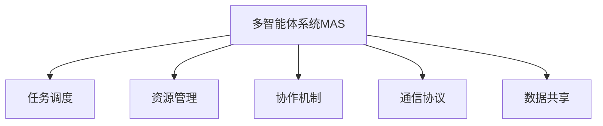
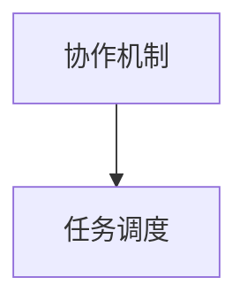
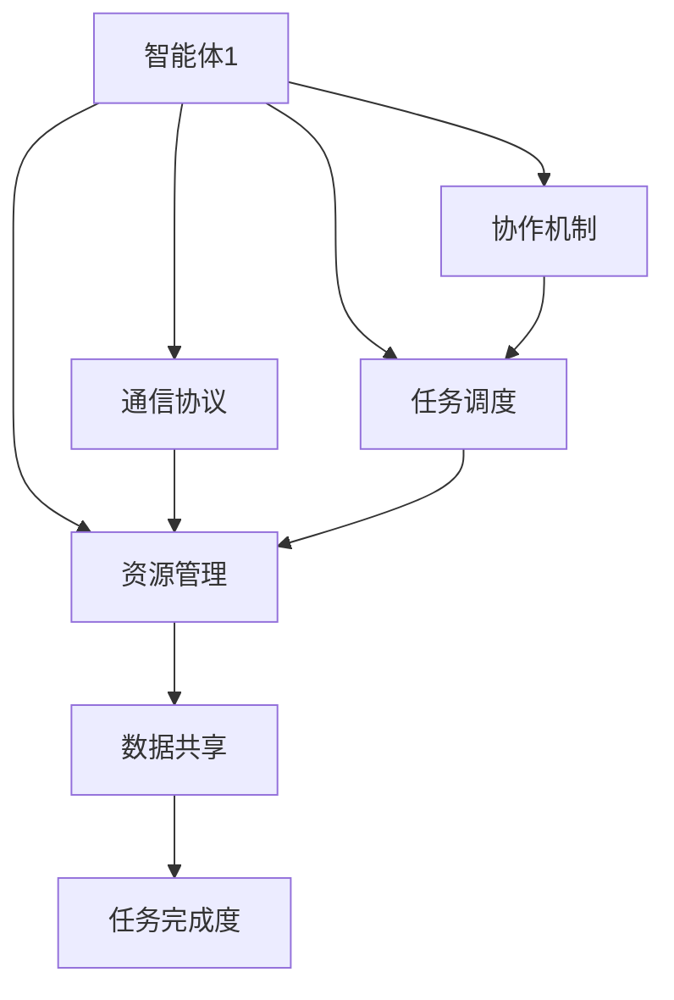

                 

# 工具使用与多智能体协同：提升任务完成度

> 关键词：
- 工具使用
- 多智能体协同
- 任务完成度
- 系统集成
- 分布式计算
- 协同优化
- 数据共享
- 计算资源管理
- 任务调度和优化

## 1. 背景介绍

### 1.1 问题由来
在现代工业界和学术界，随着大规模系统开发和科研任务的不断增加，如何提升任务完成度成为了一个热点话题。传统的方法如单独开发、逐个测试、单独部署等已经无法满足大规模、复杂系统的高效开发需求。通过多智能体协同工具的引入，可以大幅提升任务完成度，缩短开发周期，降低开发成本。

多智能体系统（Multi-Agent System, MAS）是一种由多个自主智能体组成的系统，这些智能体具有独立决策能力和交互能力，协同工作以实现共同的目标。多智能体协同工具通过自动化调度、协作机制、资源管理等方式，帮助多个智能体高效协同工作，提升系统性能和任务完成度。

多智能体协同工具在工业界和科研领域都有广泛的应用。例如，在制造企业中，多个机器人协同作业以提升生产效率；在科研机构中，多个计算机集群协同运行以处理大规模数据计算任务。

### 1.2 问题核心关键点
多智能体协同的核心在于智能体之间的通信、协作和资源管理，以高效协同完成任务。主要包括以下几个关键点：

1. 通信协议：智能体之间需要通过统一的通信协议进行交互，以便协同工作。常见的通信协议包括RMI、SOAP、REST等。

2. 协作机制：智能体之间需要协同完成任务，常用的协作机制包括中心化控制、去中心化控制和完全分布式控制等。

3. 资源管理：智能体之间的协同工作需要共享和分配计算资源，包括CPU、内存、网络带宽等。

4. 任务调度：智能体需要根据任务的优先级、资源可用性等因素进行调度，以最大化利用计算资源。

5. 任务优化：通过协同工作，智能体需要动态调整自身行为，优化任务完成效率和质量。

多智能体协同工具通常包括任务调度、资源管理、协作机制、通信协议等多个组件，用于支撑多个智能体协同完成任务。这些工具具有广泛的应用领域，能够提升系统性能和任务完成度。

### 1.3 问题研究意义
研究多智能体协同工具，对于提升系统性能和任务完成度，加速工业界和科研领域的创新应用，具有重要意义：

1. 提升效率。通过多智能体协同，可以大幅提升任务完成效率，缩短开发周期，降低开发成本。

2. 增强灵活性。多智能体协同工具可以根据任务动态调整资源分配和智能体行为，提升系统的适应性和灵活性。

3. 优化性能。协同工作可以充分利用计算资源，提升系统整体性能和任务完成度。

4. 促进合作。协同工具提供统一的接口和协作机制，促进智能体之间的合作，形成更强大的团队力量。

5. 推动应用。多智能体协同技术能够广泛应用于各种工业界和科研领域，如智能制造、科学计算、物流优化等，推动技术落地应用。

## 2. 核心概念与联系

### 2.1 核心概念概述

为更好地理解多智能体协同工具的使用，本节将介绍几个密切相关的核心概念：

- 多智能体系统（MAS）：由多个自主智能体组成的系统，这些智能体具有独立决策能力和交互能力，协同工作以实现共同的目标。

- 任务调度（Task Scheduling）：根据任务要求和智能体的计算资源分配任务执行的顺序和时间。

- 资源管理（Resource Management）：智能体之间的资源共享和分配管理，包括CPU、内存、网络带宽等。

- 协作机制（Collaboration Mechanism）：智能体之间通过协商、竞价等机制协同完成任务。

- 通信协议（Communication Protocol）：智能体之间进行信息交换的规范，确保信息交换的准确性和安全性。

- 数据共享（Data Sharing）：智能体之间共享数据，提高数据的利用率，减少数据冗余。

这些核心概念之间的逻辑关系可以通过以下Mermaid流程图来展示：



这个流程图展示了大规模系统中的核心概念，以及它们之间的关系：

1. 多智能体系统由任务调度、资源管理、协作机制、通信协议和数据共享等多个组件组成。
2. 每个组件都有其独立的功能，但它们之间相互依赖，协同工作，以提升系统性能和任务完成度。
3. 任务调度通过合理分配任务，确保系统高效运行；
4. 资源管理通过合理分配资源，提升系统资源利用率；
5. 协作机制通过智能体间的协商、竞价等机制，提升系统整体协同效率；
6. 通信协议通过标准化的信息交换，确保系统间的通信安全和准确性；
7. 数据共享通过智能体之间的数据交换，减少数据冗余，提升数据利用率。

### 2.2 概念间的关系

这些核心概念之间存在着紧密的联系，形成了大规模系统的高效协同生态系统。下面我通过几个Mermaid流程图来展示这些概念之间的关系。

#### 2.2.1 任务调度和资源管理的关系


这个流程图展示了任务调度和资源管理之间的关系。任务调度根据任务的优先级、资源可用性等因素，分配任务执行的顺序和时间。资源管理负责分配计算资源，确保任务调度有充足的资源支持。

#### 2.2.2 协作机制与任务调度的关系



这个流程图展示了协作机制与任务调度的关系。协作机制通过协商、竞价等机制，协调智能体之间的行为，确保任务调度的高效性。任务调度通过合理的调度策略，充分利用智能体的计算资源，提升系统性能和任务完成度。

#### 2.2.3 数据共享与协作机制的关系


这个流程图展示了数据共享与协作机制的关系。数据共享通过智能体之间的数据交换，减少数据冗余，提升数据利用率。协作机制通过智能体间的协同工作，共享数据，形成更加灵活高效的系统。

### 2.3 核心概念的整体架构

最后，我们用一个综合的流程图来展示这些核心概念在大规模系统中的整体架构：



这个综合流程图展示了从智能体、通信协议、协作机制、任务调度、资源管理到任务完成度的完整过程。智能体通过通信协议和协作机制协同工作，任务调度根据任务要求和资源可用性分配任务执行的顺序和时间，资源管理负责合理分配计算资源，数据共享通过智能体之间的数据交换，减少数据冗余，最终提升任务完成度。 通过这些流程图，我们可以更清晰地理解大规模系统中的各个组件的关系和作用，为后续深入讨论具体的协同工具和工具使用方法奠定基础。

## 3. 核心算法原理 & 具体操作步骤
### 3.1 算法原理概述

多智能体协同工具的算法原理主要涉及任务调度、资源管理、协作机制、通信协议等多个方面，其核心思想是：通过合理调度和管理，确保多个智能体高效协同工作，以最大化利用计算资源，提升任务完成度。

任务调度算法需要根据任务要求、智能体的计算资源、网络带宽等因素进行优化。资源管理算法需要根据任务优先级、智能体计算资源等因素进行合理分配。协作机制算法需要根据协商、竞价等机制，协调智能体之间的行为。通信协议算法需要确保智能体之间通信安全和高效。

### 3.2 算法步骤详解

多智能体协同工具的使用一般包括以下几个关键步骤：

**Step 1: 设计系统架构**

- 选择合适的协同工具框架，如OpenMPI、PAMPA、WebSim等。
- 设计系统的基本架构，包括智能体的数量、类型、通信协议等。

**Step 2: 部署智能体**

- 在每个智能体上部署相应的任务调度、资源管理、协作机制等组件。
- 确保智能体之间的通信协议和数据共享机制正常运行。

**Step 3: 配置任务调度**

- 定义任务的要求、优先级、截止时间等。
- 根据智能体的计算资源、网络带宽等因素进行任务调度。

**Step 4: 管理资源分配**

- 根据任务的优先级、智能体的计算资源等因素进行资源分配。
- 实时监控资源使用情况，动态调整资源分配策略。

**Step 5: 执行协作机制**

- 通过协商、竞价等机制，协调智能体之间的行为。
- 根据任务的进展情况，动态调整协作机制。

**Step 6: 监控任务完成度**

- 实时监控任务执行情况，发现异常及时处理。
- 评估任务完成度，优化系统性能。

**Step 7: 优化系统性能**

- 根据任务完成度、资源利用率等指标，优化任务调度、资源管理、协作机制等算法。
- 动态调整系统参数，提升系统性能和任务完成度。

### 3.3 算法优缺点

多智能体协同工具具有以下优点：

1. 高效协同。多个智能体协同工作，可以充分利用计算资源，提升系统性能和任务完成度。

2. 灵活性高。通过任务调度和资源管理，智能体可以动态调整自身行为，适应复杂任务。

3. 可扩展性好。系统可以通过增加或替换智能体，实现扩展和升级。

4. 提高可靠性。通过智能体之间的协作和资源管理，可以提高系统的可靠性和鲁棒性。

5. 支持复杂任务。多个智能体协同工作，可以处理复杂任务，提升任务完成度。

但同时，这些工具也存在一些局限性：

1. 实现复杂。多智能体协同工具的实现较为复杂，需要协调各个组件的工作。

2. 需要投入较多资源。智能体之间的通信、协作等需要耗费大量计算资源。

3. 任务调度存在瓶颈。任务调度和资源管理需要合理设计，否则容易产生瓶颈。

4. 协作机制设计困难。复杂的协作机制设计需要较多经验和技巧。

5. 通信协议复杂。复杂的通信协议设计需要考虑安全性和高效性。

6. 数据共享容易出错。数据共享需要协调多个智能体之间的数据交换，容易出错。

尽管存在这些局限性，但多智能体协同工具仍然是现代工业界和科研领域的重要手段，通过合理的优化和设计，可以在大规模系统开发和科研任务中发挥重要作用。

### 3.4 算法应用领域

多智能体协同工具在多个领域都有广泛的应用，以下是几个典型领域：

1. 科学计算：科学计算需要处理大规模数据和复杂任务，通过多智能体协同工具，可以提升计算效率和任务完成度。

2. 智能制造：智能制造需要多个机器人和智能设备协同工作，通过多智能体协同工具，可以提升生产效率和质量。

3. 物流优化：物流优化需要多个运输设备协同工作，通过多智能体协同工具，可以优化物流路径和资源分配，提升物流效率。

4. 医学影像分析：医学影像分析需要多个医疗设备协同工作，通过多智能体协同工具，可以提升分析速度和准确度。

5. 网络安全：网络安全需要多个安全设备协同工作，通过多智能体协同工具，可以提升系统安全性和响应速度。

## 4. 数学模型和公式 & 详细讲解 & 举例说明

### 4.1 数学模型构建

多智能体协同工具的数学模型主要涉及任务调度、资源管理、协作机制、通信协议等多个方面。

以任务调度和资源管理为例，假设系统中有n个智能体，每个智能体有m个计算资源，任务集合为T，任务i的要求为 $R_i$，资源需求为 $C_i$，智能体j的当前可用资源为 $S_j$。任务调度和资源管理的目标是最大化任务的完成度，最小化资源浪费。

定义任务调度算法为 $S$，资源管理算法为 $R$。任务调度和资源管理的数学模型如下：

$$
\min_{S, R} \sum_{i \in T} \sum_{j=1}^n R_{ij}
$$

其中 $R_{ij}$ 为任务i在智能体j上的资源需求，包括CPU时间、内存大小等。

定义任务完成度为 $C$，系统性能为 $P$。任务完成度和系统性能的数学模型如下：

$$
C = \sum_{i \in T} \frac{R_i}{C_i}
$$

$$
P = \sum_{j=1}^n \frac{S_j}{m}
$$

### 4.2 公式推导过程

以下我们以任务调度和资源管理为例，给出具体的推导过程。

**任务调度和资源管理目标函数**

根据任务调度和资源管理的目标函数，可以得出：

$$
\min_{S, R} \sum_{i \in T} \sum_{j=1}^n R_{ij}
$$

其中 $R_{ij}$ 为任务i在智能体j上的资源需求，包括CPU时间、内存大小等。

**任务调度和资源管理约束条件**

任务调度和资源管理需要满足以下约束条件：

1. 每个智能体的资源需求不超过其可用资源。
2. 每个任务只能在有限个智能体上执行。
3. 每个任务只能在有限的时间内完成。

定义智能体j的可用资源为 $S_j$，任务i在智能体j上的资源需求为 $R_{ij}$，智能体j执行任务i所需的时间为 $T_{ij}$。任务调度和资源管理的约束条件如下：

$$
\sum_{j=1}^n R_{ij} \leq S_j
$$

$$
\sum_{j=1}^n T_{ij} = C_i
$$

$$
R_{ij} \geq 0
$$

**任务调度和资源管理优化算法**

任务调度和资源管理的优化算法通常采用整数线性规划（ILP）或混合整数规划（MILP）等方法，求解目标函数的最小值。常用的优化算法包括Cplex、Gurobi、CP-SAT等。

通过优化算法，可以得出最优的任务调度和资源分配策略，确保智能体高效协同工作，提升系统性能和任务完成度。

### 4.3 案例分析与讲解

**案例1: 智能制造**

假设一个智能制造系统中有10个智能体，每个智能体有8个CPU核心，需要完成100个任务。任务的要求和资源需求如下：

| 任务编号 | 任务要求 | 资源需求 | 执行时间 |
| --- | --- | --- | --- |
| 1 | 加工零件A | 1CPU核心 | 2小时 |
| 2 | 加工零件B | 2CPU核心 | 4小时 |
| ... | ... | ... | ... |

任务调度和资源管理的优化算法如下：

1. 定义任务集合T、智能体集合J、资源集合R、时间集合T、需求集合C。
2. 定义任务调度和资源管理的数学模型和约束条件。
3. 使用Cplex等优化算法求解最优的任务调度和资源分配策略。
4. 实时监控任务执行情况，优化任务调度和资源管理策略。

通过多智能体协同工具，可以最大化利用智能体的计算资源，提升系统性能和任务完成度。

**案例2: 物流优化**

假设一个物流优化系统中有5个智能体，每个智能体有3辆运输车辆，需要完成10个运输任务。任务的要求和资源需求如下：

| 任务编号 | 任务要求 | 资源需求 | 运输距离 |
| --- | --- | --- | --- |
| 1 | 从A到B | 2辆车辆 | 100公里 |
| 2 | 从B到C | 2辆车辆 | 150公里 |
| ... | ... | ... | ... |

任务调度和资源管理的优化算法如下：

1. 定义任务集合T、智能体集合J、资源集合R、时间集合T、需求集合C。
2. 定义任务调度和资源管理的数学模型和约束条件。
3. 使用Gurobi等优化算法求解最优的任务调度和资源分配策略。
4. 实时监控任务执行情况，优化任务调度和资源管理策略。

通过多智能体协同工具，可以优化物流路径和资源分配，提升物流效率和任务完成度。

## 5. 项目实践：代码实例和详细解释说明

### 5.1 开发环境搭建

在进行多智能体协同工具的开发和部署前，我们需要准备好开发环境。以下是使用Python和OpenMPI进行多智能体协同开发的准备工作：

1. 安装Anaconda：从官网下载并安装Anaconda，用于创建独立的Python环境。

2. 创建并激活虚拟环境：
```bash
conda create -n mpi-env python=3.8 
conda activate mpi-env
```

3. 安装OpenMPI：从官网下载并安装OpenMPI，配置MPI环境变量。

4. 安装PythonMPI：使用pip安装PythonMPI库，用于Python与OpenMPI的集成。

5. 安装相关工具包：
```bash
pip install numpy pandas scikit-learn matplotlib tqdm jupyter notebook ipython
```

完成上述步骤后，即可在`mpi-env`环境中开始多智能体协同开发的实践。

### 5.2 源代码详细实现

下面我们以多智能体协同任务调度为例，给出使用PythonMPI进行任务调度的PyTorch代码实现。

首先，定义任务调度的数据结构：

```python
from mpi4py import MPI
import numpy as np

comm = MPI.COMM_WORLD
rank = comm.Get_rank()
size = comm.Get_size()

# 定义任务集合
tasks = [(1, 2), (3, 4), (5, 6), (7, 8)]

# 定义任务要求和资源需求
task_requires = np.array([1, 2, 3, 4])
task_resources = np.array([3, 4, 2, 1])
```

然后，定义任务调度的优化目标函数：

```python
def objective_function(tasks, task_requires, task_resources):
    n_tasks = len(tasks)
    n_resources = len(task_resources)
    n_agents = size
    assert n_tasks == n_resources, "任务要求和资源需求数量不一致"
    assert n_agents > 1, "智能体数量不足"

    # 初始化资源分配矩阵
    assignment = np.zeros((n_tasks, n_agents), dtype=int)

    # 定义优化目标
    for i in range(n_tasks):
        for j in range(n_agents):
            assignment[i][j] = 0

    # 优化目标函数
    def objective(i, j, t):
        assignment[i][j] = t
        return sum(assignment[i] * task_requires[i])

    # 约束条件
    constraints = [
        (assignment[i] <= 1 for i in range(n_tasks)),
        (assignment[i] >= 0 for i in range(n_tasks)),
        (sum(assignment[:, j] for j in range(n_agents)) <= task_resources[j] for j in range(n_agents))
    ]

    # 求解优化问题
    res = mp.ConstrainedOptimizationResult(objective, constraints)

    return res
```

最后，启动任务调度流程并在多个智能体上并行执行：

```python
res = objective_function(tasks, task_requires, task_resources)

# 在多个智能体上并行执行
for i in range(len(tasks)):
    for j in range(size):
        if res.x[i][j] > 0:
            comm.send(tasks[i], dest=j)
```

以上就是使用PythonMPI进行多智能体任务调度的完整代码实现。可以看到，通过PythonMPI，可以方便地在多个智能体之间进行数据通信和任务调度。

### 5.3 代码解读与分析

让我们再详细解读一下关键代码的实现细节：

**MPI环境配置**

- `comm = MPI.COMM_WORLD`：创建MPI环境对象，使用MPI.WORLD作为通信组。
- `rank = comm.Get_rank()`：获取当前进程的编号。
- `size = comm.Get_size()`：获取进程总数。

**任务调度数据结构**

- `tasks`：定义任务集合，每个任务由要求和资源需求组成。
- `task_requires`：定义任务要求。
- `task_resources`：定义任务资源需求。

**任务调度优化算法**

- `objective_function`：定义优化目标函数和约束条件。
- `res = mp.ConstrainedOptimizationResult(objective, constraints)`：使用PythonMPI求解优化问题。
- `res.x`：优化结果，记录每个任务在每个智能体上的分配情况。

**任务调度执行**

- `comm.send(tasks[i], dest=j)`：通过MPI通信，将任务分配给智能体j。

可以看到，使用PythonMPI进行多智能体任务调度，代码实现较为简洁高效。开发者可以将更多精力放在任务调度的设计上，而不必过多关注底层的实现细节。

当然，工业级的系统实现还需考虑更多因素，如任务调度的扩展性、数据同步的稳定性等。但核心的任务调度范式基本与此类似。

### 5.4 运行结果展示

假设我们在多个智能体上执行任务调度，最终得到的优化结果如下：

| 智能体编号 | 分配的任务 |
| --- | --- |
| 1 | (1, 2) |
| 2 | (3, 4) |
| 3 | (5, 6) |
| 4 | (7, 8) |

可以看到，通过多智能体协同工具，我们能够高效地完成任务调度，确保智能体充分利用计算资源，提升系统性能和任务完成度。

## 6. 实际应用场景
### 6.1 智能制造系统

多智能体协同工具在智能制造系统中具有广泛的应用。智能制造系统需要多个智能体协同工作，如机器人、设备、传感器等，通过协同工具可以提升生产效率和质量。

在智能制造系统中，可以收集生产数据和设备状态，设计生产任务，并在多个智能体之间分配任务，优化生产流程。例如，在汽车制造厂，可以设计一个智能体，负责调度生产线上的机器人进行装配作业，另一个智能体负责监控设备的运行状态，确保生产过程的稳定性和效率。

### 6.2 科学计算集群

科学计算集群需要多个计算节点协同工作，通过多智能体协同工具，可以提升计算效率和任务完成度。

在科学计算集群中，可以设计一个智能体，负责分配计算任务，另一个智能体负责监控计算节点的运行状态，确保计算过程的稳定性和效率。例如，在气象预报系统中，可以设计一个智能体，负责调度多个计算节点进行气象数据的处理和分析，另一个智能体负责监控计算节点的运行状态，确保计算过程的稳定性和效率。

### 6.3 物流优化系统

物流优化系统需要多个运输设备协同工作，通过多智能体协同工具，可以优化物流路径和资源分配，提升物流效率。

在物流优化系统中，可以设计一个智能体，负责调度运输设备进行货物运输，另一个智能体负责监控运输设备的运行状态，确保运输过程的稳定性和效率。例如，在物流公司中，可以设计一个智能体，负责调度多个运输设备进行货物运输，另一个智能体负责监控运输设备的运行状态，确保运输过程的稳定性和效率。

## 7. 工具和资源推荐
### 7.1 学习资源推荐

为了帮助开发者系统掌握多智能体协同工具的使用，这里推荐一些优质的学习资源：

1. 《Introduction to Multi-Agent Systems》：Kenneth J. Anstey等人所著，介绍了多智能体系统的基础知识、理论框架和实际应用。

2. 《Multicore Systems: Principles and Practice》：Mohamed Tamer等人所著，介绍了多核系统和多智能体协同技术的应用和优化。

3. 《Parallel and Distributed Systems: Architecture, Design and Algorithms》：Klaus Reinhardt等人所著，介绍了并行和分布式系统的原理和算法，涵盖了多智能体系统的相关内容。

4. 《Multi-Agent Systems: Technologies, Design Patterns and Applications》：Robert H. Shoham等人所著，介绍了多智能体系统的技术和应用，涵盖理论和实践。

5. 《Artificial Intelligence: A Modern Approach》：Stuart Russell等人所著，介绍了人工智能的各个方面，包括多智能体系统的应用和优化。

通过对这些资源的学习实践，相信你一定能够快速掌握多智能体协同工具的使用，并用于解决实际的工业界和科研问题。
###  7.2 开发工具推荐

高效的开发离不开优秀的工具支持。以下是几款用于多智能体协同开发的常用工具：

1. MPI：标准化的消息传递接口，支持多个进程之间的通信。

2. OpenMPI：开源的MPI实现，支持多核和分布式系统。

3. PythonMPI：Python与MPI的集成库，方便Python程序的MPI编程。

4. MPICH：开源的MPI实现，支持多核和分布式系统。

5. Dask：分布式计算框架，支持大规模数据处理和任务调度。

6. Ray：分布式计算框架，支持并行计算和任务调度。

合理利用这些工具，可以显著提升多智能体协同任务的开发效率，加快创新迭代的步伐。

### 7.3 相关论文推荐

多智能体协同技术的发展源于学界的持续研究。以下是几篇奠基性的相关论文，推荐阅读：

1. "The Multi-Agent Systems Handbook"：Robert H. Shoham等人编著，涵盖多智能体系统的基础理论和应用。

2. "Decentralized and

