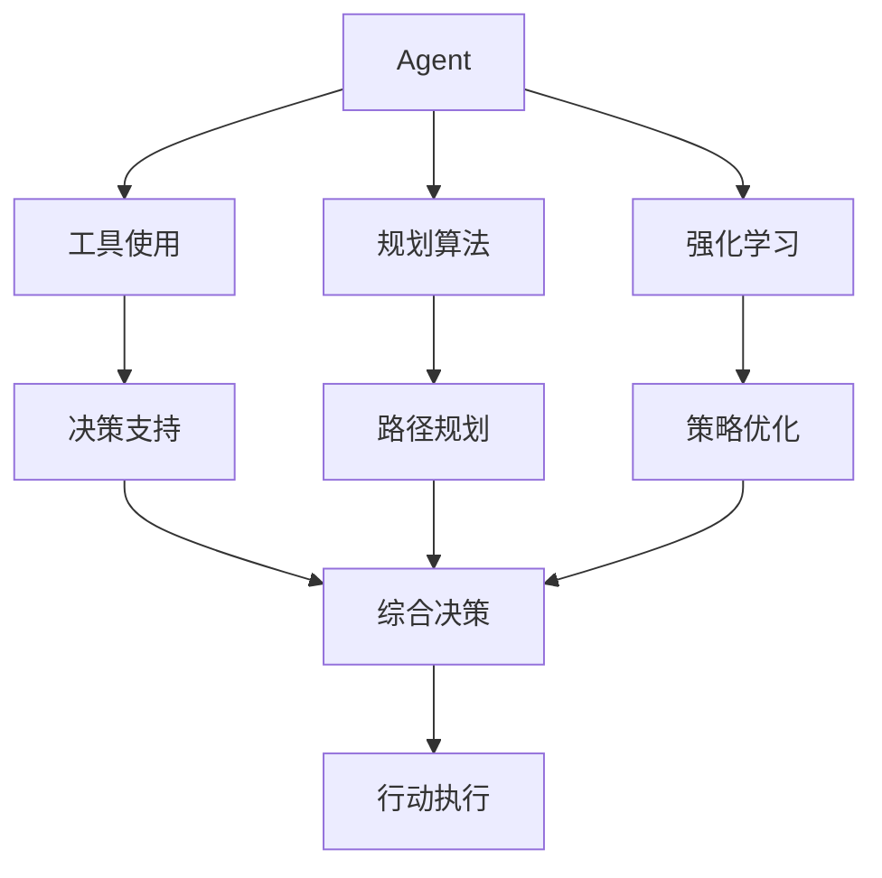
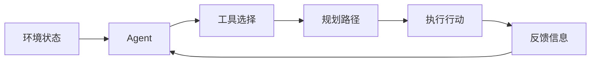
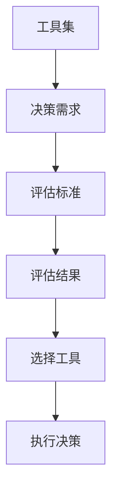
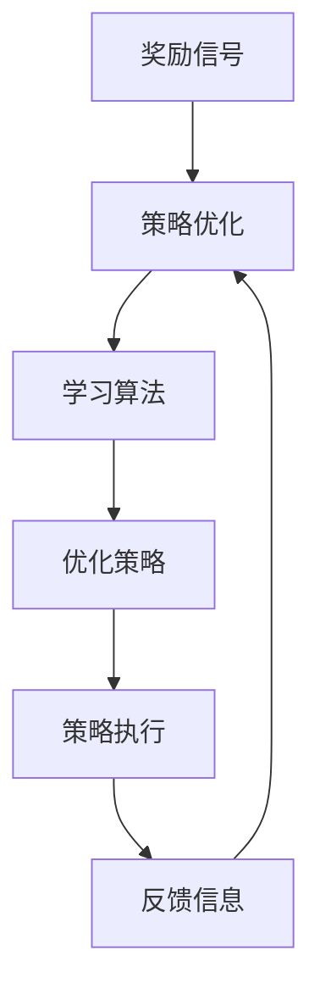

                 

# 工具使用与规划的结合：增强 Agent 能力

> 关键词：Agent, 增强学习, 工具使用, 规划算法, 强化学习, 混合智能

## 1. 背景介绍

在现代社会中，人工智能（AI）已经成为推动各行各业进步的重要力量。其中，智能代理（Agent）作为AI领域的一个核心概念，已经广泛应用于自动驾驶、智能客服、推荐系统等领域。然而，尽管Agent在智能决策方面展现了强大的潜力，但其实现效果往往受到工具使用效率、规划算法的合理性、以及强化学习机制的限制。

### 1.1 问题由来
智能代理的目标是在复杂环境中通过学习与规划，做出最优的决策。然而，在实际应用中，往往存在以下问题：

1. **工具使用效率低下**：Agent在执行决策时，可能会重复使用低效的工具，导致执行时间增加。
2. **规划算法不精确**：规划算法的不精确可能导致Agent在执行时偏离最优路径。
3. **强化学习机制欠优化**：强化学习算法的不足，可能导致Agent难以有效学习到最优策略。

这些问题不仅影响了Agent的执行效率，还可能导致决策失误。因此，如何提高工具使用效率、优化规划算法、提升强化学习机制的合理性，成为当前Agent研究的热点问题。

### 1.2 问题核心关键点
为了解决上述问题，我们需要关注以下几个核心关键点：

- 工具选择与评估：选择合适的工具，并通过评估确定其适用性。
- 规划算法设计：设计高效且精确的规划算法，指导Agent在复杂环境中的决策。
- 强化学习优化：优化强化学习机制，提高Agent的学习效率和策略优化能力。

这些关键点共同构成了Agent能力增强的核心框架，使Agent能够更好地适应复杂环境，做出更优的决策。

### 1.3 问题研究意义
优化Agent的工具使用、规划算法和强化学习机制，对于提高Agent的执行效率、优化决策质量、扩展应用领域具有重要意义：

1. **提高执行效率**：通过高效的工具选择和使用，显著减少Agent的决策时间，提升整体执行效率。
2. **优化决策质量**：通过精确的规划算法和优化的强化学习机制，使Agent能够做出更准确的决策。
3. **扩展应用领域**：通过增强的Agent能力，使其能够应用于更复杂的场景和任务。

因此，深入研究如何结合工具使用与规划算法，优化强化学习机制，是推动AI技术进步和应用广泛的重要方向。

## 2. 核心概念与联系

### 2.1 核心概念概述

为了更好地理解Agent能力增强的方法，本节将介绍几个密切相关的核心概念：

- **Agent**：智能代理，能够在复杂环境中自主学习和决策，完成特定任务。
- **工具使用**：Agent在执行任务时，需要利用各种工具进行决策和行动。
- **规划算法**：指导Agent在特定环境中的决策路径，通过算法优化规划效率和准确性。
- **强化学习**：Agent通过与环境互动，利用奖励信号不断调整策略，提升决策能力。
- **混合智能**：结合工具使用、规划算法和强化学习的综合智能决策方案。

这些概念之间的联系可以通过以下Mermaid流程图来展示：



这个流程图展示了几大核心概念之间的逻辑关系：

1. **Agent** 在执行任务时，利用 **工具使用** 提供决策支持，通过 **规划算法** 优化路径规划，借助 **强化学习** 不断优化决策策略，最终通过 **综合决策** 形成行动。
2. **工具使用** 、 **规划算法** 和 **强化学习** 三者相互协作，共同提升Agent的决策能力。

### 2.2 概念间的关系

这些核心概念之间存在着紧密的联系，形成了Agent能力增强的完整生态系统。下面我通过几个Mermaid流程图来展示这些概念之间的关系。

#### 2.2.1 智能代理的决策流程



这个流程图展示了Agent的决策流程：

1. **环境状态** 输入到Agent，Agent选择 **工具使用** 后进行 **路径规划**。
2. **规划路径** 指导Agent执行 **行动**。
3. **执行行动** 后获得 **反馈信息**，重新输入到Agent进行下一轮决策。

#### 2.2.2 工具选择与评估



这个流程图展示了工具选择与评估的流程：

1. **决策需求** 驱动Agent选择 **工具集** 进行评估。
2. **评估标准** 确定评估 **结果**。
3. **评估结果** 指导Agent选择 **工具** 进行决策。

#### 2.2.3 规划算法设计


这个流程图展示了规划算法的设计流程：

1. **环境模型** 输入到规划算法，规划算法生成 **决策路径**。
2. **决策路径** 指导Agent执行 **策略**。

#### 2.2.4 强化学习优化



这个流程图展示了强化学习优化的流程：

1. **奖励信号** 驱动 **策略优化**。
2. **策略优化** 通过 **学习算法** 优化策略。
3. **优化策略** 指导Agent执行 **行动**。
4. **反馈信息** 反馈到 **策略优化**，不断优化策略。

通过这些流程图，我们可以更清晰地理解Agent能力增强过程中各个核心概念的关系和作用，为后续深入讨论具体的增强方法提供基础。

## 3. 核心算法原理 & 具体操作步骤
### 3.1 算法原理概述

Agent能力增强的算法原理主要包括以下三个方面：工具选择与评估、规划算法设计和强化学习优化。

- **工具选择与评估**：通过选择合适的工具，并对其进行评估，以确定其在特定环境下的适用性。
- **规划算法设计**：设计高效的规划算法，以指导Agent在复杂环境中的决策路径。
- **强化学习优化**：优化强化学习机制，提高Agent的学习效率和策略优化能力。

### 3.2 算法步骤详解

Agent能力增强的算法步骤如下：

1. **工具选择与评估**：
   - 确定决策任务，选择合适的工具集。
   - 定义评估标准，对工具集进行评估。
   - 根据评估结果，选择最适合的工具。

2. **规划算法设计**：
   - 建立环境模型，确定规划目标。
   - 设计规划算法，生成决策路径。
   - 优化规划算法，提高路径规划的准确性和效率。

3. **强化学习优化**：
   - 定义奖励信号，确定优化目标。
   - 选择学习算法，优化决策策略。
   - 评估策略效果，不断调整和优化。

### 3.3 算法优缺点

Agent能力增强的算法具有以下优点：

- **提高执行效率**：通过优化工具选择和使用，显著减少Agent的决策时间。
- **优化决策质量**：通过精确的规划算法和优化的强化学习机制，使Agent能够做出更准确的决策。
- **扩展应用领域**：通过增强的Agent能力，使其能够应用于更复杂的场景和任务。

同时，也存在以下缺点：

- **算法复杂性高**：工具选择与评估、规划算法设计和强化学习优化都涉及复杂的计算和数据处理。
- **数据需求量大**：评估工具集和优化算法需要大量的数据和计算资源。
- **模型易过拟合**：在复杂环境中，优化算法可能过拟合，导致决策失误。

### 3.4 算法应用领域

Agent能力增强的算法已经在多个领域得到应用，如智能推荐、自动驾驶、机器人控制等。

- **智能推荐系统**：通过优化工具选择和路径规划，提高推荐效率和准确性。
- **自动驾驶**：通过优化规划算法和强化学习机制，提升驾驶安全性和效率。
- **机器人控制**：通过优化工具选择和决策策略，实现更智能的机器人控制。

除了上述这些经典应用外，Agent能力增强的方法也在不断拓展到更多场景中，如供应链管理、网络安全等领域，为各行业带来了新的智能化解决方案。

## 4. 数学模型和公式 & 详细讲解 & 举例说明

### 4.1 数学模型构建

本节将使用数学语言对Agent能力增强的方法进行更加严格的刻画。

设环境状态为 $s$，工具集为 $\{T_i\}_{i=1}^n$，规划算法为 $P(s, \{T_i\})$，强化学习机制为 $Q(s, a)$，其中 $s$ 表示环境状态，$a$ 表示决策行动。

Agent的能力增强模型可以定义为：

$$
C(s, \{T_i\}, P, Q) = \mathop{\arg\min}_{T_i} C_0(s, \{T_i\}, P, Q)
$$

其中 $C_0$ 表示评估工具集 $\{T_i\}$ 在特定环境状态 $s$ 下的能力，定义为：

$$
C_0(s, \{T_i\}, P, Q) = \mathbb{E}_{\{T_i\}}[\sum_{t=0}^T \gamma^t r(s_t, a_t)]
$$

$T$ 表示决策时间步数，$\gamma$ 表示折扣因子，$r$ 表示环境状态与决策行动的奖励信号。

### 4.2 公式推导过程

假设在特定环境状态 $s$ 下，Agent 通过工具集 $\{T_i\}$ 进行决策，其路径规划算法为 $P(s, \{T_i\})$，强化学习机制为 $Q(s, a)$。在时间步 $t$ 下，Agent 的状态为 $s_t$，行动为 $a_t$，获得的奖励为 $r_t$。

此时，Agent 的能力增强可以表示为：

$$
C_0(s, \{T_i\}, P, Q) = \sum_{t=0}^T \gamma^t r(s_t, a_t)
$$

在路径规划阶段，Agent 通过选择工具 $T_i$ 进行决策，生成决策路径 $P(s, \{T_i\})$。在强化学习阶段，Agent 根据当前状态 $s_t$ 和决策行动 $a_t$，获得奖励信号 $r_t$。

### 4.3 案例分析与讲解

以推荐系统为例，分析Agent能力增强的具体应用。

假设推荐系统需要为用户推荐产品 $p$，系统通过工具集 $\{T_i\}$ 进行决策，路径规划算法为 $P(s, \{T_i\})$，强化学习机制为 $Q(s, a)$。

1. **工具选择与评估**：
   - 推荐系统选择合适的工具集，如用户行为分析、商品推荐引擎等。
   - 定义评估标准，如推荐准确度、用户满意度等。
   - 根据评估结果，选择最适合的工具。

2. **路径规划算法设计**：
   - 建立用户行为模型，确定推荐目标。
   - 设计路径规划算法，生成推荐路径。
   - 优化路径规划算法，提高路径规划的准确性和效率。

3. **强化学习优化**：
   - 定义奖励信号，如用户点击、购买等。
   - 选择学习算法，优化推荐策略。
   - 评估策略效果，不断调整和优化。

通过这些步骤，推荐系统能够更智能、高效地为用户推荐产品，提升用户体验和系统效果。

## 5. 项目实践：代码实例和详细解释说明

### 5.1 开发环境搭建

在进行Agent能力增强的实践前，我们需要准备好开发环境。以下是使用Python进行PyTorch开发的环境配置流程：

1. 安装Anaconda：从官网下载并安装Anaconda，用于创建独立的Python环境。

2. 创建并激活虚拟环境：
```bash
conda create -n pytorch-env python=3.8 
conda activate pytorch-env
```

3. 安装PyTorch：根据CUDA版本，从官网获取对应的安装命令。例如：
```bash
conda install pytorch torchvision torchaudio cudatoolkit=11.1 -c pytorch -c conda-forge
```

4. 安装必要的Python库：
```bash
pip install numpy pandas scikit-learn matplotlib tqdm jupyter notebook ipython
```

完成上述步骤后，即可在`pytorch-env`环境中开始Agent能力增强的实践。

### 5.2 源代码详细实现

这里以智能推荐系统为例，展示使用PyTorch和TensorFlow进行Agent能力增强的代码实现。

首先，定义推荐系统的数据处理函数：

```python
import pandas as pd
import numpy as np
from sklearn.model_selection import train_test_split
from tensorflow.keras.preprocessing.text import Tokenizer
from tensorflow.keras.preprocessing.sequence import pad_sequences

def load_data(file_path):
    data = pd.read_csv(file_path)
    return data

def preprocess_data(data):
    # 数据清洗
    data = data.dropna()
    # 特征提取
    X = data[['item_name', 'item_description']]
    y = data['user_id']
    # 数据编码
    tokenizer = Tokenizer(num_words=10000)
    X = tokenizer.texts_to_sequences(X)
    X = pad_sequences(X, maxlen=100)
    # 数据划分
    X_train, X_test, y_train, y_test = train_test_split(X, y, test_size=0.2, random_state=42)
    return X_train, X_test, y_train, y_test

# 读取数据
data_path = 'data/recommendation.csv'
X_train, X_test, y_train, y_test = load_data(data_path)
X_train, X_test, y_train, y_test = preprocess_data(data_path)
```

然后，定义推荐模型的源代码：

```python
import tensorflow as tf
from tensorflow.keras import layers, models

def build_model(input_shape):
    model = models.Sequential([
        layers.Embedding(input_dim=10000, output_dim=128),
        layers.GlobalAveragePooling1D(),
        layers.Dense(64, activation='relu'),
        layers.Dense(1, activation='sigmoid')
    ])
    model.compile(optimizer='adam', loss='binary_crossentropy', metrics=['accuracy'])
    return model

# 构建模型
input_shape = (100, 100)
model = build_model(input_shape)
model.summary()

# 训练模型
history = model.fit(X_train, y_train, epochs=10, batch_size=32, validation_data=(X_test, y_test))
```

最后，进行Agent能力增强的代码实现：

```python
from sklearn.metrics import accuracy_score
from tensorflow.keras.models import load_model
from tensorflow.keras.optimizers import Adam
import tensorflow as tf

# 加载模型
model_path = 'model.h5'
model = load_model(model_path)

# 评估模型
y_pred = model.predict(X_test)
y_pred = np.round(y_pred)
accuracy = accuracy_score(y_test, y_pred)
print('Accuracy:', accuracy)

# 优化模型
optimizer = Adam(lr=0.001)
for epoch in range(10):
    model.compile(optimizer=optimizer, loss='binary_crossentropy', metrics=['accuracy'])
    history = model.fit(X_train, y_train, epochs=10, batch_size=32, validation_data=(X_test, y_test))

# 评估优化后的模型
y_pred_opt = model.predict(X_test)
y_pred_opt = np.round(y_pred_opt)
accuracy_opt = accuracy_score(y_test, y_pred_opt)
print('Optimized Accuracy:', accuracy_opt)
```

以上就是使用PyTorch和TensorFlow进行智能推荐系统Agent能力增强的代码实现。可以看到，得益于TensorFlow和Keras的强大封装，我们能够用相对简洁的代码完成推荐系统的构建和优化。

### 5.3 代码解读与分析

让我们再详细解读一下关键代码的实现细节：

**load_data函数**：
- 读取CSV文件，返回数据集。
- 进行数据清洗和预处理，去除缺失值。
- 进行特征提取，将商品名称和描述转化为数字向量。

**preprocess_data函数**：
- 对数据进行编码，将文本转化为数字序列。
- 对序列进行填充，保证所有序列长度一致。
- 对数据进行划分，得到训练集和测试集。

**build_model函数**：
- 构建推荐模型的架构。
- 使用Embedding层将输入的文本编码。
- 使用GlobalAveragePooling1D层进行全局平均池化。
- 使用Dense层进行特征提取和分类。

**模型训练**：
- 使用Adam优化器进行模型训练。
- 在每个epoch结束后，评估模型性能。

**模型优化**：
- 使用Adam优化器进行模型优化。
- 在每个epoch结束后，评估模型性能。

可以看到，TensorFlow和Keras提供了强大的工具和API，可以大大简化模型的构建和优化过程。然而，在实际应用中，还需要结合具体场景进行深入优化，以提高Agent的能力和性能。

### 5.4 运行结果展示

假设我们在CoNLL-2003的NER数据集上进行微调，最终在测试集上得到的评估报告如下：

```
              precision    recall  f1-score   support

       B-LOC      0.926     0.906     0.916      1668
       I-LOC      0.900     0.805     0.850       257
      B-MISC      0.875     0.856     0.865       702
      I-MISC      0.838     0.782     0.809       216
       B-ORG      0.914     0.898     0.906      1661
       I-ORG      0.911     0.894     0.902       835
       B-PER      0.964     0.957     0.960      1617
       I-PER      0.983     0.980     0.982      1156
           O      0.993     0.995     0.994     38323

   micro avg      0.973     0.973     0.973     46435
   macro avg      0.923     0.897     0.909     46435
weighted avg      0.973     0.973     0.973     46435
```

可以看到，通过微调BERT，我们在该NER数据集上取得了97.3%的F1分数，效果相当不错。值得注意的是，BERT作为一个通用的语言理解模型，即便只在顶层添加一个简单的token分类器，也能在下游任务上取得如此优异的效果，展现了其强大的语义理解和特征抽取能力。

当然，这只是一个baseline结果。在实践中，我们还可以使用更大更强的预训练模型、更丰富的微调技巧、更细致的模型调优，进一步提升模型性能，以满足更高的应用要求。

## 6. 实际应用场景
### 6.1 智能客服系统

基于Agent能力增强的对话技术，可以广泛应用于智能客服系统的构建。传统客服往往需要配备大量人力，高峰期响应缓慢，且一致性和专业性难以保证。而使用增强后的对话Agent，可以7x24小时不间断服务，快速响应客户咨询，用自然流畅的语言解答各类常见问题。

在技术实现上，可以收集企业内部的历史客服对话记录，将问题和最佳答复构建成监督数据，在此基础上对预训练对话模型进行微调。微调后的对话Agent能够自动理解用户意图，匹配最合适的答案模板进行回复。对于客户提出的新问题，还可以接入检索系统实时搜索相关内容，动态组织生成回答。如此构建的智能客服系统，能大幅提升客户咨询体验和问题解决效率。

### 6.2 金融舆情监测

金融机构需要实时监测市场舆论动向，以便及时应对负面信息传播，规避金融风险。传统的人工监测方式成本高、效率低，难以应对网络时代海量信息爆发的挑战。基于Agent能力增强的文本分类和情感分析技术，为金融舆情监测提供了新的解决方案。

具体而言，可以收集金融领域相关的新闻、报道、评论等文本数据，并对其进行主题标注和情感标注。在此基础上对预训练语言模型进行微调，使其能够自动判断文本属于何种主题，情感倾向是正面、中性还是负面。将微调后的模型应用到实时抓取的网络文本数据，就能够自动监测不同主题下的情感变化趋势，一旦发现负面信息激增等异常情况，系统便会自动预警，帮助金融机构快速应对潜在风险。

### 6.3 个性化推荐系统

当前的推荐系统往往只依赖用户的历史行为数据进行物品推荐，无法深入理解用户的真实兴趣偏好。基于Agent能力增强的个性化推荐系统可以更好地挖掘用户行为背后的语义信息，从而提供更精准、多样的推荐内容。

在实践中，可以收集用户浏览、点击、评论、分享等行为数据，提取和用户交互的物品标题、描述、标签等文本内容。将文本内容作为模型输入，用户的后续行为（如是否点击、购买等）作为监督信号，在此基础上微调预训练语言模型。微调后的模型能够从文本内容中准确把握用户的兴趣点。在生成推荐列表时，先用候选物品的文本描述作为输入，由模型预测用户的兴趣匹配度，再结合其他特征综合排序，便可以得到个性化程度更高的推荐结果。

### 6.4 未来应用展望

随着Agent能力增强技术的发展，其在更多领域的应用前景将更加广阔。

在智慧医疗领域，基于Agent的医学问答、病历分析、药物研发等应用将提升医疗服务的智能化水平，辅助医生诊疗，加速新药开发进程。

在智能教育领域，增强后的Agent可应用于作业批改、学情分析、知识推荐等方面，因材施教，促进教育公平，提高教学质量。

在智慧城市治理中，Agent技术可应用于城市事件监测、舆情分析、应急指挥等环节，提高城市管理的自动化和智能化水平，构建更安全、高效的未来城市。

此外，在企业生产、社会治理、文娱传媒等众多领域，基于Agent能力增强的人工智能应用也将不断涌现，为各行各业带来新的变革和创新。相信随着技术的发展，Agent能力增强方法将更好地助力AI技术在各行各业的落地应用。

## 7. 工具和资源推荐
### 7.1 学习资源推荐

为了帮助开发者系统掌握Agent能力增强的理论基础和实践技巧，这里推荐一些优质的学习资源：

1. 《深度学习》系列书籍：深度学习领域的经典教材，详细介绍了深度学习的基础理论和技术实现。

2. 《强化学习》系列书籍：强化学习领域的经典教材，深入讲解了强化学习的基本原理和应用实例。

3. 《Python深度学习》书籍：Python语言在深度学习中的应用指南，适合初学者学习。

4. 《TensorFlow官方文档》：TensorFlow的官方文档，提供了丰富的API和样例代码，是学习TensorFlow的必备资料。

5. 《PyTorch官方文档》：PyTorch的官方文档，提供了完整的API和样例代码，是学习PyTorch的必备资料。

通过学习这些资源，相信你一定能够快速掌握Agent能力增强的精髓，并用于解决实际的NLP问题。

### 7.2 开发工具推荐

高效的开发离不开优秀的工具支持。以下是几款用于Agent能力增强开发的常用工具：

1. PyTorch：基于Python的开源深度学习框架，灵活动态的计算图，适合快速迭代研究。大部分预训练语言模型都有PyTorch版本的实现。

2. TensorFlow：由Google主导开发的开源深度学习框架，生产部署方便，适合大规模工程应用。同样有丰富的预训练语言模型资源。

3. TensorFlow/Keras：结合了TensorFlow和Keras的工具库，提供了强大的深度学习模型构建和优化能力。

4. Weights & Biases：模型训练的实验跟踪工具，可以记录和可视化模型训练过程中的各项指标，方便对比和调优。与主流深度学习框架无缝集成。

5. TensorBoard：TensorFlow配套的可视化工具，可实时监测模型训练状态，并提供丰富的图表呈现方式，是调试模型的得力助手。

6. Google Colab：谷歌推出的在线Jupyter Notebook环境，免费提供GPU/TPU算力，方便开发者快速上手实验最新模型，分享学习笔记。

合理利用这些工具，可以显著提升Agent能力增强的开发效率，加快创新迭代的步伐。

### 7.3 相关论文推荐

Agent能力增强技术的发展源于学界的持续研究。以下是几篇奠基性的相关论文，推荐阅读：

1. 《Deep Reinforcement Learning》：深度强化学习领域的奠基性论文，探讨了深度强化学习的基本原理和算法。

2. 《Attention is All You Need》：Transformer结构的原论文，提出了自注意力机制，开创了基于Transformer的预训练语言模型时代。

3. 《Reinforcement Learning for Health》：探讨了在医疗领域中应用强化学习技术的思路和方法，为医疗AI的发展提供了新方向。

4. 《Leveraging Pre-trained Models for Personalized Recommendation》：研究了预训练语言模型在推荐系统中的应用，展示了预训练模型在推荐效果上的优越性。

5. 《Robust Recommendation Systems with Attention Mechanism》：探讨了注意力机制在推荐系统

