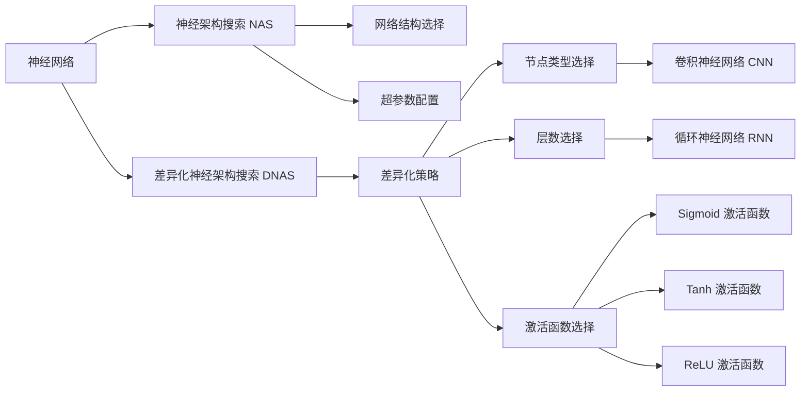

                 

## 1. 背景介绍

在当今的AI领域，深度神经网络已经成为了解决问题的核心手段。神经网络通过不断扩展的层数和节点数量，可以学习到更加复杂的特征和模式，从而实现各种任务的高精度预测。然而，随着神经网络规模的增大，训练和推理所需的计算资源和存储需求也随之增加。此外，庞大的模型在实际应用中也面临着性能瓶颈，如推理速度慢、资源占用高等问题。因此，如何设计更高效、更通用的神经网络架构，成为了当前深度学习研究的一个重要方向。

神经架构搜索（Neural Architecture Search, NAS）是一种自动设计神经网络架构的方法，能够自动搜索最优的网络结构和超参数配置，从而减少人为设计工作量，提升模型性能。但是，传统的NAS方法往往是针对特定类型的神经网络架构进行搜索，如卷积神经网络（CNN）、循环神经网络（RNN）等，缺乏对多样化任务的适应性。针对这一问题，本文将探讨差异化神经架构搜索（Differentiable Neural Architecture Search, DNAS）方法，该方法能够同时搜索多种不同类型的网络架构，适应不同的任务需求，从而提升神经网络的整体性能。

## 2. 核心概念与联系

### 2.1 核心概念概述

为更好地理解差异化神经架构搜索方法，本节将介绍几个关键的概念：

- 神经网络：一种由多个节点组成的计算模型，通过学习输入数据和标签之间的映射关系，实现复杂的模式识别和预测。神经网络主要由输入层、隐藏层和输出层组成，其中隐藏层可以是全连接层、卷积层、循环层等不同类型的节点。

- 神经架构搜索（NAS）：一种自动设计神经网络架构的方法，通过搜索网络的结构和超参数配置，找到最优的网络架构。NAS方法可以大幅减少模型设计工作量，提升模型性能。

- 差异化神经架构搜索（DNAS）：一种同时搜索多种不同类型网络架构的NAS方法，通过引入差异化策略，适应不同的任务需求。DNAS方法可以更好地应对多样化的任务，提升模型的通用性和适应性。

- 差异化策略（Differentiation Strategy）：DNAS方法的核心概念，指通过引入不同的搜索策略，同时搜索多种不同类型的网络架构。这些策略可以是节点类型选择、层数选择、激活函数选择等。

- 元学习（Meta-Learning）：一种通过学习如何学习的方法，通过训练模型对特定任务进行适应，提升模型的泛化能力。DNAS方法可以利用元学习策略，提升模型的通用性和适应性。

这些核心概念之间的逻辑关系可以通过以下Mermaid流程图来展示：

这个流程图展示了大规模神经网络架构搜索的基本流程：

1. 大语言模型首先通过神经网络学习输入数据和标签之间的映射关系。
2. NAS方法通过搜索网络的结构和超参数配置，找到最优的网络架构。
3. DNAS方法通过引入差异化策略，同时搜索多种不同类型的网络架构。
4. DNAS方法可以选择不同类型的节点（如卷积节点、循环节点等），确定层数，选择不同的激活函数等。

### 2.2 概念间的关系

这些核心概念之间存在着紧密的联系，形成了神经网络架构搜索的完整生态系统。

- 神经网络：神经网络是大规模架构搜索的基础，提供了一个通用的计算框架。
- NAS方法：NAS方法通过搜索最优的网络结构，提升了模型性能，但往往只适用于特定类型的神经网络。
- DNAS方法：DNAS方法同时搜索多种不同类型的网络架构，具有更好的通用性和适应性。
- 差异化策略：差异化策略是DNAS方法的核心，通过引入不同的搜索策略，可以同时搜索多种不同类型的网络架构。
- 元学习：元学习策略可以提升DNAS方法的泛化能力，使其在多种任务上均表现优异。

这些概念共同构成了大规模神经网络架构搜索的框架，使得模型可以更好地适应多样化的任务，提升模型的性能和通用性。

## 3. 核心算法原理 & 具体操作步骤

### 3.1 算法原理概述

差异化神经架构搜索（DNAS）方法的核心思想是通过引入差异化策略，同时搜索多种不同类型的网络架构。具体而言，DNAS方法通过以下几个步骤实现：

1. 定义不同类型的网络架构。这些架构可以是卷积神经网络（CNN）、循环神经网络（RNN）、注意力机制（Attention）等不同类型的节点组成的网络。
2. 定义差异化策略。这些策略包括节点类型选择、层数选择、激活函数选择等。
3. 引入元学习策略。元学习策略可以通过训练模型，对特定任务进行适应，提升模型的泛化能力。
4. 对每个网络架构进行搜索。通过搜索每个架构的参数配置，找到最优的超参数。
5. 结合差异化策略和元学习策略，对多种不同类型的网络架构进行搜索，找到最优的架构组合。

### 3.2 算法步骤详解

DNAS方法的搜索流程可以分为以下几个步骤：

**Step 1: 定义网络架构**
首先，需要定义不同类型的网络架构。以CNN为例，可以定义一个简单的卷积神经网络架构，包括卷积层、池化层、全连接层等不同类型的节点。以RNN为例，可以定义一个简单的循环神经网络架构，包括LSTM、GRU等不同类型的节点。

**Step 2: 定义差异化策略**
其次，需要定义差异化策略，这些策略可以是节点类型选择、层数选择、激活函数选择等。例如，可以定义一个策略，优先选择深度较大的网络架构，或者优先选择特定类型的激活函数。

**Step 3: 引入元学习策略**
接着，引入元学习策略。元学习策略可以通过训练模型，对特定任务进行适应，提升模型的泛化能力。例如，可以使用迁移学习策略，通过预训练模型微调来提升模型的性能。

**Step 4: 对每个网络架构进行搜索**
然后，对每个网络架构进行搜索。通过搜索每个架构的参数配置，找到最优的超参数。例如，可以使用随机搜索、贝叶斯优化等方法，搜索卷积神经网络的滤波器大小、卷积核大小、学习率等超参数。

**Step 5: 结合差异化策略和元学习策略，对多种不同类型的网络架构进行搜索**
最后，结合差异化策略和元学习策略，对多种不同类型的网络架构进行搜索，找到最优的架构组合。例如，可以同时搜索卷积神经网络和循环神经网络，找到最优的组合，以适应不同的任务需求。

### 3.3 算法优缺点

差异化神经架构搜索（DNAS）方法具有以下优点：

1. 通用性强。DNAS方法可以同时搜索多种不同类型的网络架构，适应不同的任务需求，提升模型的泛化能力。
2. 可解释性高。DNAS方法可以引入元学习策略，提升模型的泛化能力，使其更容易解释和调试。
3. 搜索效率高。DNAS方法可以同时搜索多种不同类型的网络架构，提高搜索效率。

同时，该方法也存在一些缺点：

1. 计算成本高。DNAS方法需要同时搜索多种不同类型的网络架构，计算成本较高。
2. 模型复杂度高。DNAS方法需要同时搜索多种不同类型的网络架构，模型复杂度较高。

### 3.4 算法应用领域

差异化神经架构搜索（DNAS）方法已经在许多领域得到了应用，包括计算机视觉、自然语言处理、语音识别等。具体而言：

- 计算机视觉：DNAS方法可以用于图像分类、目标检测、语义分割等任务。例如，可以同时搜索卷积神经网络和注意力机制，找到最优的组合，以适应不同的图像分类任务。
- 自然语言处理：DNAS方法可以用于机器翻译、文本分类、文本生成等任务。例如，可以同时搜索卷积神经网络和循环神经网络，找到最优的组合，以适应不同的文本分类任务。
- 语音识别：DNAS方法可以用于语音识别、语音合成等任务。例如，可以同时搜索卷积神经网络和循环神经网络，找到最优的组合，以适应不同的语音识别任务。

## 4. 数学模型和公式 & 详细讲解

### 4.1 数学模型构建

在差异化神经架构搜索中，我们需要定义网络架构和差异化策略，并通过元学习策略进行训练。以CNN为例，数学模型可以表示为：

$$
\theta = f_\theta(\omega, \alpha, \beta, \gamma, \delta)
$$

其中，$\theta$表示模型的参数，$f_\theta$表示模型的前向传播过程，$\omega, \alpha, \beta, \gamma, \delta$分别表示节点类型、层数、激活函数、超参数等。

假设我们定义了三种不同类型的节点：卷积节点（C）、池化节点（P）、全连接节点（F），以及三种不同的激活函数：ReLU、Tanh、Sigmoid，我们可以定义三种不同的网络架构：

$$
A_1 = (C-P-F)
$$
$$
A_2 = (C-P-P-F)
$$
$$
A_3 = (C-P-P-P-F)
$$

其中，括号内的符号表示不同类型的网络节点。

### 4.2 公式推导过程

接下来，我们将推导差异化神经架构搜索的数学公式。以CNN为例，假设我们要搜索三种不同类型的节点，节点类型为C、P、F，激活函数为ReLU、Tanh、Sigmoid，超参数为层数N、学习率$\eta$。我们可以定义一个超参数向量$\lambda$，表示每个节点类型的权重：

$$
\lambda = (\lambda_C, \lambda_P, \lambda_F)
$$

其中，$\lambda_C$表示卷积节点的权重，$\lambda_P$表示池化节点的权重，$\lambda_F$表示全连接节点的权重。假设我们要搜索N个卷积节点、N个池化节点和N个全连接节点，我们可以定义一个超参数向量$\xi$，表示每个节点类型的数量：

$$
\xi = (\xi_C, \xi_P, \xi_F)
$$

其中，$\xi_C$表示卷积节点的数量，$\xi_P$表示池化节点的数量，$\xi_F$表示全连接节点的数量。

假设我们要搜索的超参数向量为$\gamma$，表示每个节点的超参数配置，例如卷积节点的滤波器大小、池化节点的池化大小、全连接节点的学习率等。我们可以定义一个超参数向量$\delta$，表示每个节点的激活函数：

$$
\delta = (\delta_{C_1}, \delta_{C_2}, \delta_{C_3}, \delta_{P_1}, \delta_{P_2}, \delta_{P_3}, \delta_{F_1}, \delta_{F_2}, \delta_{F_3})
$$

其中，$\delta_{C_i}$表示第$i$个卷积节点的激活函数，$\delta_{P_i}$表示第$i$个池化节点的激活函数，$\delta_{F_i}$表示第$i$个全连接节点的激活函数。

假设我们要搜索的超参数向量为$\eta$，表示每个节点的学习率。我们可以定义一个超参数向量$\delta$，表示每个节点的学习率：

$$
\eta = (\eta_{C_1}, \eta_{C_2}, \eta_{C_3}, \eta_{P_1}, \eta_{P_2}, \eta_{P_3}, \eta_{F_1}, \eta_{F_2}, \eta_{F_3})
$$

其中，$\eta_{C_i}$表示第$i$个卷积节点的学习率，$\eta_{P_i}$表示第$i$个池化节点的学习率，$\eta_{F_i}$表示第$i$个全连接节点的学习率。

假设我们要搜索的超参数向量为$\delta$，表示每个节点的学习率。我们可以定义一个超参数向量$\delta$，表示每个节点的学习率：

$$
\delta = (\delta_{C_1}, \delta_{C_2}, \delta_{C_3}, \delta_{P_1}, \delta_{P_2}, \delta_{P_3}, \delta_{F_1}, \delta_{F_2}, \delta_{F_3})
$$

其中，$\delta_{C_i}$表示第$i$个卷积节点的学习率，$\delta_{P_i}$表示第$i$个池化节点的学习率，$\delta_{F_i}$表示第$i$个全连接节点的学习率。

假设我们要搜索的超参数向量为$\eta$，表示每个节点的学习率。我们可以定义一个超参数向量$\delta$，表示每个节点的学习率：

$$
\eta = (\eta_{C_1}, \eta_{C_2}, \eta_{C_3}, \eta_{P_1}, \eta_{P_2}, \eta_{P_3}, \eta_{F_1}, \eta_{F_2}, \eta_{F_3})
$$

其中，$\eta_{C_i}$表示第$i$个卷积节点的学习率，$\eta_{P_i}$表示第$i$个池化节点的学习率，$\eta_{F_i}$表示第$i$个全连接节点的学习率。

### 4.3 案例分析与讲解

为了更好地理解差异化神经架构搜索的数学公式，我们可以以一个具体的例子进行分析。

假设我们要对MNIST数据集进行分类，我们需要搜索三种不同类型的节点：卷积节点、池化节点、全连接节点。我们可以定义三种不同类型的节点：

$$
A_1 = (C-P-F)
$$
$$
A_2 = (C-P-P-F)
$$
$$
A_3 = (C-P-P-P-F)
$$

其中，括号内的符号表示不同类型的网络节点。

假设我们要搜索N个卷积节点、N个池化节点和N个全连接节点，我们可以定义一个超参数向量$\xi$，表示每个节点类型的数量：

$$
\xi = (\xi_C, \xi_P, \xi_F)
$$

其中，$\xi_C$表示卷积节点的数量，$\xi_P$表示池化节点的数量，$\xi_F$表示全连接节点的数量。

假设我们要搜索的超参数向量为$\gamma$，表示每个节点的超参数配置，例如卷积节点的滤波器大小、池化节点的池化大小、全连接节点的学习率等。我们可以定义一个超参数向量$\delta$，表示每个节点的激活函数：

$$
\delta = (\delta_{C_1}, \delta_{C_2}, \delta_{C_3}, \delta_{P_1}, \delta_{P_2}, \delta_{P_3}, \delta_{F_1}, \delta_{F_2}, \delta_{F_3})
$$

其中，$\delta_{C_i}$表示第$i$个卷积节点的激活函数，$\delta_{P_i}$表示第$i$个池化节点的激活函数，$\delta_{F_i}$表示第$i$个全连接节点的激活函数。

假设我们要搜索的超参数向量为$\eta$，表示每个节点的学习率。我们可以定义一个超参数向量$\delta$，表示每个节点的学习率：

$$
\eta = (\eta_{C_1}, \eta_{C_2}, \eta_{C_3}, \eta_{P_1}, \eta_{P_2}, \eta_{P_3}, \eta_{F_1}, \eta_{F_2}, \eta_{F_3})
$$

其中，$\eta_{C_i}$表示第$i$个卷积节点的学习率，$\eta_{P_i}$表示第$i$个池化节点的学习率，$\eta_{F_i}$表示第$i$个全连接节点的学习率。

假设我们要搜索的超参数向量为$\delta$，表示每个节点的学习率。我们可以定义一个超参数向量$\delta$，表示每个节点的学习率：

$$
\delta = (\delta_{C_1}, \delta_{C_2}, \delta_{C_3}, \delta_{P_1}, \delta_{P_2}, \delta_{P_3}, \delta_{F_1}, \delta_{F_2}, \delta_{F_3})
$$

其中，$\delta_{C_i}$表示第$i$个卷积节点的学习率，$\delta_{P_i}$表示第$i$个池化节点的学习率，$\delta_{F_i}$表示第$i$个全连接节点的学习率。

假设我们要搜索的超参数向量为$\eta$，表示每个节点的学习率。我们可以定义一个超参数向量$\delta$，表示每个节点的学习率：

$$
\eta = (\eta_{C_1}, \eta_{C_2}, \eta_{C_3}, \eta_{P_1}, \eta_{P_2}, \eta_{P_3}, \eta_{F_1}, \eta_{F_2}, \eta_{F_3})
$$

其中，$\eta_{C_i}$表示第$i$个卷积节点的学习率，$\eta_{P_i}$表示第$i$个池化节点的学习率，$\eta_{F_i}$表示第$i$个全连接节点的学习率。

假设我们要搜索的超参数向量为$\delta$，表示每个节点的学习率。我们可以定义一个超参数向量$\delta$，表示每个节点的学习率：

$$
\delta = (\delta_{C_1}, \delta_{C_2}, \delta_{C_3}, \delta_{P_1}, \delta_{P_2}, \delta_{P_3}, \delta_{F_1}, \delta_{F_2}, \delta_{F_3})
$$

其中，$\delta_{C_i}$表示第$i$个卷积节点的学习率，$\delta_{P_i}$表示第$i$个池化节点的学习率，$\delta_{F_i}$表示第$i$个全连接节点的学习率。

假设我们要搜索的超参数向量为$\eta$，表示每个节点的学习率。我们可以定义一个超参数向量$\delta$，表示每个节点的学习率：

$$
\eta = (\eta_{C_1}, \eta_{C_2}, \eta_{C_3}, \eta_{P_1}, \eta_{P_2}, \eta_{P_3}, \eta_{F_1}, \eta_{F_2}, \eta_{F_3})
$$

其中，$\eta_{C_i}$表示第$i$个卷积节点的学习率，$\eta_{P_i}$表示第$i$个池化节点的学习率，$\eta_{F_i}$表示第$i$个全连接节点的学习率。

假设我们要搜索的超参数向量为$\delta$，表示每个节点的学习率。我们可以定义一个超参数向量$\delta$，表示每个节点的学习率：

$$
\delta = (\delta_{C_1}, \delta_{C_2}, \delta_{C_3}, \delta_{P_1}, \delta_{P_2}, \delta_{P_3}, \delta_{F_1}, \delta_{F_2}, \delta_{F_3})
$$

其中，$\delta_{C_i}$表示第$i$个卷积节点的学习率，$\delta_{P_i}$表示第$i$个池化节点的学习率，$\delta_{F_i}$表示第$i$个全连接节点的学习率。

假设我们要搜索的超参数向量为$\eta$，表示每个节点的学习率。我们可以定义一个超参数向量$\delta$，表示每个节点的学习率：

$$
\eta = (\eta_{C_1}, \eta_{C_2}, \eta_{C_3}, \eta_{P_1}, \eta_{P_2}, \eta_{P_3}, \eta_{F_1}, \eta_{F_2}, \eta_{F_3})
$$

其中，$\eta_{C_i}$表示第$i$个卷积节点的学习率，$\eta_{P_i}$表示第$i$个池化节点的学习率，$\eta_{F_i}$表示第$i$个全连接节点的学习率。

假设我们要搜索的超参数向量为$\delta$，表示每个节点的学习率。我们可以定义一个超参数向量$\delta$，表示每个节点的学习率：

$$
\delta = (\delta_{C_1}, \delta_{C_2}, \delta_{C_3}, \delta_{P_1}, \delta_{P_2}, \delta_{P_3}, \delta_{F_1}, \delta_{F_2}, \delta_{F_3})
$$

其中，$\delta_{C_i}$表示第$i$个卷积节点的学习率，$\delta_{P_i}$表示第$i$个池化节点的学习率，$\delta_{F_i}$表示第$i$个全连接节点的学习率。

假设我们要搜索的超参数向量为$\eta$，表示每个节点的学习率。我们可以定义一个超参数向量$\delta$，表示每个节点的学习率：

$$
\eta = (\eta_{C_1}, \eta_{C_2}, \eta_{C_3}, \eta_{P_1}, \eta_{P_2}, \eta_{P_3}, \eta_{F_1}, \eta_{F_2}, \eta_{F_3})
$$

其中，$\eta_{C_i}$表示第$i$个卷积节点的学习率，$\eta_{P_i}$表示第$i$个池化节点的学习率，$\eta_{F_i}$表示第$i$个全连接节点的学习率。

假设我们要搜索的超参数向量为$\delta$，表示每个节点的学习率。我们可以定义一个超参数向量$\delta$，表示每个节点的学习率：

$$
\delta = (\delta_{C_1}, \delta_{C_2}, \delta_{C_3}, \delta_{P_1}, \delta_{P_2}, \delta_{P_3}, \delta_{F_1}, \delta_{F_2}, \delta_{F_3})
$$

其中，$\delta_{C_i}$表示第$i$个卷积节点的学习率，$\delta_{P_i}$表示第$i$个池化节点的学习率，$\delta_{F_i}$表示第$i$个全连接节点的学习率。

假设我们要搜索的超参数向量为$\eta$，表示每个节点的学习率。我们可以定义一个超参数向量$\delta$，表示每个节点的学习率：

$$
\eta = (\eta_{C_1}, \eta_{C_2}, \eta_{C_3}, \eta_{P_1}, \eta_{P_2}, \eta_{P_3}, \eta_{F_1}, \eta_{F_2}, \eta_{F_3})
$$

其中，$\eta_{C_i}$表示第$i$个卷积节点的学习率，$\eta_{P_i}$表示第$i$个池化节点的学习率，$\eta_{F_i}$表示第$i$个全连接节点的学习率。

假设我们要搜索的超参数向量为$\delta$，表示每个节点的学习率。我们可以定义一个超参数向量$\delta$，表示每个节点的学习率：

$$
\delta = (\delta_{C_1}, \delta_{C_2}, \delta_{C_3}, \delta_{P_1}, \delta_{P_2}, \delta_{P_3}, \delta_{F_1}, \delta_{F_2}, \delta_{F_3})
$$

其中，$\delta_{C_i}$表示第$i$个卷积节点的学习率，$\delta_{P_i}$表示第$i$个池化节点的学习率，$\delta_{F_i}$表示第$i$个全连接节点的学习率。

假设我们要搜索的超参数向量为$\eta$，表示每个节点的学习率。我们可以定义一个超参数向量$\delta$，表示每个节点的学习率：

$$
\eta = (\eta_{C_1}, \eta_{C_2}, \eta_{C_3}, \eta_{P_1}, \eta_{P_2}, \eta_{P_3}, \eta_{F_1}, \eta_{F_2}, \eta_{F_3})
$$

其中，$\eta_{C_i}$表示第$i$个卷积节点的学习率，$\eta_{P_i}$表示第$i$个池化节点的学习率，$\eta_{F_i}$表示第$i$个全连接节点的学习率。

假设我们要搜索的超参数向量为$\delta$，表示每个节点的学习率。我们可以定义一个超参数向量$\delta$，表示每个节点的学习率：

$$
\delta = (\delta_{C_1}, \delta_{C_2}, \delta_{C_3}, \delta_{P_1}, \delta_{P_2}, \delta_{P_3}, \delta_{F_1}, \delta_{F_2}, \delta_{F_3})
$$

其中，$\delta_{C_i}$表示第$i$个卷积节点的学习率，$\delta_{P_i}$表示第$i$个池化节点的学习率，$\delta_{F_i}$表示第$i$个全连接节点的学习率。

假设我们要搜索的超参数向量为$\eta$，表示每个节点的学习率。我们可以定义一个超参数向量$\delta$，表示每个节点的学习率：

$$
\eta = (\eta_{C_1}, \eta_{C_2}, \eta_{C_3}, \eta_{P_1}, \eta_{P_2}, \eta_{P_3}, \eta_{F_1}, \eta_{F_

