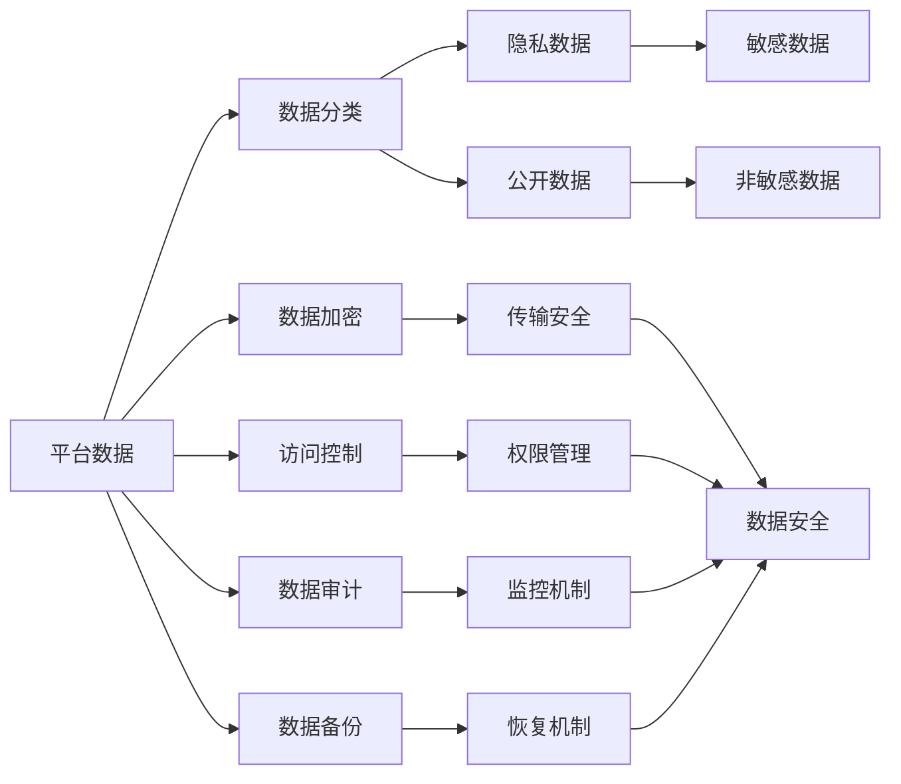

                 

# 平台经济的数据安全技术方案：如何制定安全方案？

## 1. 背景介绍

### 1.1 问题由来
随着平台经济的蓬勃发展，数据成为驱动平台竞争力的核心要素。平台企业掌握了海量用户行为数据和商业数据，通过深入的数据分析和挖掘，能够为用户提供个性化的服务，提升用户体验，同时为广告商、商家提供精准的流量分发和营销支持。然而，数据安全问题也随之而来，平台数据一旦被滥用或泄露，将给用户和平台带来巨大的经济损失和信任危机。因此，制定高效可靠的数据安全技术方案，成为平台经济中至关重要的任务。

### 1.2 问题核心关键点
数据安全技术方案的设计，需要考虑平台数据的多样性和复杂性，以及隐私保护和数据利用的平衡。关键在于如何在保障用户隐私的前提下，充分利用数据价值，避免数据滥用和泄露的风险。具体包括：
- 数据分类与敏感度分析
- 访问控制与权限管理
- 数据加密与传输安全
- 数据审计与监控
- 数据备份与恢复
- 合规与法规遵循

### 1.3 问题研究意义
制定平台经济的数据安全技术方案，对于保障用户隐私、提升平台信任度、增强数据安全防护水平具有重要意义：

1. **保护用户隐私**：通过严格的数据分类和访问控制，确保用户数据的隐私不被滥用。
2. **提升平台信任度**：展示平台对数据安全的承诺和措施，增强用户对平台的信任感。
3. **增强数据防护能力**：利用先进的数据加密和监控技术，保障平台数据的安全性，避免数据泄露风险。
4. **保障数据合规**：确保平台数据的收集、存储、处理和使用符合相关法律法规，避免法律风险。

## 2. 核心概念与联系

### 2.1 核心概念概述

为更好地理解数据安全技术方案的设计和实现，本节将介绍几个密切相关的核心概念：

- **平台数据**：指平台企业收集、存储和处理的所有数据，包括用户行为数据、交易数据、用户画像等。
- **数据分类**：根据数据的敏感程度和用途，将数据分为不同的类别，如公开数据、隐私数据、敏感数据等。
- **访问控制**：通过身份验证、授权和审计等手段，确保只有授权用户才能访问和使用数据。
- **数据加密**：对数据进行加密保护，确保数据在传输和存储过程中不被未授权访问者窃取或篡改。
- **数据审计**：对数据访问和使用行为进行记录和监控，确保数据操作符合安全策略。
- **数据备份**：定期备份平台数据，确保数据在意外事件后仍可恢复。
- **合规遵循**：确保平台数据处理符合《数据保护法》、GDPR、CCPA等法律法规的要求。

这些核心概念之间存在着紧密的联系，形成了平台经济数据安全技术的整体架构。下面通过一个Mermaid流程图来展示它们之间的联系：



这个流程图展示了平台数据安全技术的主要组成部分及其相互关系：

1. 平台数据经过数据分类，根据敏感度被划分为不同的类别。
2. 数据加密和访问控制在传输和存储环节保护数据安全。
3. 数据审计监控记录数据操作，确保合规。
4. 数据备份和恢复机制保障数据在意外事件后的恢复。
5. 访问控制和权限管理确保数据仅被授权用户访问。
6. 合规遵循确保数据处理符合相关法律法规。

### 2.2 概念间的关系

这些核心概念之间存在着密切的关联，形成了平台经济数据安全技术的完整框架。

#### 2.2.1 平台数据与数据分类


平台数据通过数据分类，被划分为不同的敏感度级别，便于采取相应的保护措施。

#### 2.2.2 数据分类与访问控制


数据分类是访问控制的基础，通过明确数据的敏感度，可以设计合理的访问控制策略。

#### 2.2.3 访问控制与数据加密


访问控制限制了数据访问的范围，数据加密则确保了数据在传输和存储过程中的安全。

#### 2.2.4 数据加密与传输安全


数据加密与传输安全共同保护了数据在网络传输中的安全。

#### 2.2.5 数据审计与监控


数据审计和监控记录了数据的访问和使用行为，帮助发现潜在的安全风险。

#### 2.2.6 数据备份与恢复


数据备份和恢复机制确保了数据在意外事件后能够快速恢复。

#### 2.2.7 合规遵循与数据处理


数据处理必须符合相关法律法规，确保数据处理过程中的合规性。

## 3. 核心算法原理 & 具体操作步骤

### 3.1 算法原理概述

平台经济的数据安全技术方案设计，通常遵循以下基本原理：

1. **数据分类与敏感度分析**：根据数据的敏感程度，将其分为不同的类别，如公开数据、隐私数据、敏感数据等。
2. **访问控制与权限管理**：通过身份验证和授权机制，确保只有授权用户才能访问敏感数据。
3. **数据加密与传输安全**：对敏感数据进行加密保护，确保数据在传输和存储过程中不被未授权访问者窃取或篡改。
4. **数据审计与监控**：记录和监控数据的访问和使用行为，确保数据操作符合安全策略。
5. **数据备份与恢复**：定期备份数据，确保数据在意外事件后仍可恢复。
6. **合规遵循**：确保数据处理符合相关法律法规，避免法律风险。

### 3.2 算法步骤详解

以下是平台经济数据安全技术方案设计的详细步骤：

**Step 1: 数据分类与敏感度分析**
- 对平台数据进行全面分析，识别出敏感数据和隐私数据。
- 根据敏感程度，将数据分为不同的类别，如公开数据、隐私数据、敏感数据等。

**Step 2: 访问控制与权限管理**
- 设计合理的访问控制策略，确保只有授权用户才能访问敏感数据。
- 采用多因素身份验证机制，如密码、指纹、短信验证码等，提高数据访问的安全性。

**Step 3: 数据加密与传输安全**
- 对敏感数据进行加密保护，常用的加密算法有AES、RSA等。
- 确保数据传输过程中使用加密协议（如TLS/SSL），防止中间人攻击。

**Step 4: 数据审计与监控**
- 记录和监控数据的访问和使用行为，生成审计日志。
- 设置异常检测机制，及时发现和响应潜在的安全威胁。

**Step 5: 数据备份与恢复**
- 定期备份敏感数据，确保备份数据的完整性和可用性。
- 设计灾难恢复计划，快速恢复数据，减少业务中断时间。

**Step 6: 合规遵循**
- 确保数据处理符合相关法律法规，如《数据保护法》、GDPR、CCPA等。
- 定期进行合规性审查，确保合规政策的持续有效性。

### 3.3 算法优缺点

平台经济的数据安全技术方案设计，具有以下优点：

1. **多层次保护**：通过数据分类、访问控制、数据加密、数据审计等多层次保护措施，确保平台数据的全面安全。
2. **灵活性高**：可根据不同数据类别和业务需求，灵活调整保护策略，适应复杂多变的应用场景。
3. **合规性强**：符合相关法律法规要求，降低法律风险。

然而，该方案也存在一些缺点：

1. **成本高**：实现复杂的数据安全技术方案，需要投入大量的人力和物力，且后期维护成本高。
2. **操作复杂**：数据分类、访问控制、数据加密等操作复杂，需专业技术人员实施。
3. **数据可用性下降**：过多的加密和备份机制，可能会影响数据的实时可用性。

### 3.4 算法应用领域

平台经济的数据安全技术方案，在多个领域得到广泛应用，例如：

1. **电商平台**：保护用户交易数据、个人信息等敏感数据，确保数据不被泄露或滥用。
2. **社交媒体**：保护用户隐私数据，如聊天记录、位置信息等，防止数据泄露和滥用。
3. **金融平台**：保护用户交易记录、财务信息等敏感数据，确保数据安全。
4. **医疗平台**：保护患者病历数据、健康信息等隐私数据，防止数据泄露和滥用。
5. **物流平台**：保护用户订单数据、位置信息等敏感数据，确保数据安全。

这些应用领域，对数据安全有着极高的要求，平台经济的数据安全技术方案，能够有效保障平台数据的安全，提升用户信任度。

## 4. 数学模型和公式 & 详细讲解 & 举例说明

### 4.1 数学模型构建

假设平台企业有N个用户，每个用户有M个数据点。设平台数据的敏感度向量为S，其中S_i表示第i个数据点的敏感度，取值范围为[0,1]，值越大表示敏感度越高。

设平台数据的访问控制矩阵为A，其中A_ij表示第i个用户是否对第j个数据点具有访问权限。设平台数据加密算法为E，加密后的数据表示为E(S)。设平台数据审计日志为L，其中L_i表示第i个用户对第j个数据点的访问记录。

### 4.2 公式推导过程

以下我们将推导一个简单但通用的数据安全技术方案的数学模型。

**数据分类与敏感度分析**
- 数据分类：S = [S_1, S_2, ..., S_M]

**访问控制与权限管理**
- 访问控制：A = [A_11, A_12, ..., A_1M] x [A_21, A_22, ..., A_2M] x ... x [A_N1, A_N2, ..., A_NM]

**数据加密与传输安全**
- 数据加密：E(S) = [E(S_1), E(S_2), ..., E(S_M)]

**数据审计与监控**
- 数据审计：L = [L_11, L_12, ..., L_1M] x [L_21, L_22, ..., L_2M] x ... x [L_N1, L_N2, ..., L_NM]

**数据备份与恢复**
- 数据备份：B = [B_1, B_2, ..., B_M]

**合规遵循**
- 合规遵循：C = [C_1, C_2, ..., C_M]

### 4.3 案例分析与讲解

以电商平台的交易数据为例，分析数据安全技术方案的实际应用。

**数据分类与敏感度分析**
- 交易数据分为公开数据（订单号、商品名称）和隐私数据（用户地址、信用卡号等）。
- 对隐私数据设置高敏感度，对公开数据设置低敏感度。

**访问控制与权限管理**
- 用户访问交易数据需要身份验证，系统记录访问日志。
- 管理员可以配置不同用户的访问权限，确保敏感数据仅能被授权用户访问。

**数据加密与传输安全**
- 交易数据在传输过程中使用TLS/SSL加密，防止中间人攻击。
- 敏感数据在存储和传输过程中使用AES加密算法保护。

**数据审计与监控**
- 记录用户对交易数据的访问行为，生成审计日志。
- 设置异常检测机制，如访问频率过高、数据异常修改等，及时发现和响应安全威胁。

**数据备份与恢复**
- 定期备份交易数据，确保备份数据的完整性和可用性。
- 设计灾难恢复计划，快速恢复数据，减少业务中断时间。

**合规遵循**
- 确保交易数据处理符合《数据保护法》、GDPR等法律法规要求。
- 定期进行合规性审查，确保合规政策的持续有效性。

## 5. 项目实践：代码实例和详细解释说明

### 5.1 开发环境搭建

在进行数据安全技术方案开发前，我们需要准备好开发环境。以下是使用Python进行PyTorch开发的环境配置流程：

1. 安装Anaconda：从官网下载并安装Anaconda，用于创建独立的Python环境。

2. 创建并激活虚拟环境：
```bash
conda create -n pytorch-env python=3.8 
conda activate pytorch-env
```

3. 安装PyTorch：根据CUDA版本，从官网获取对应的安装命令。例如：
```bash
conda install pytorch torchvision torchaudio cudatoolkit=11.1 -c pytorch -c conda-forge
```

4. 安装各类工具包：
```bash
pip install numpy pandas scikit-learn matplotlib tqdm jupyter notebook ipython
```

完成上述步骤后，即可在`pytorch-env`环境中开始数据安全技术方案的开发。

### 5.2 源代码详细实现

这里我们以电商平台的交易数据为例，给出使用PyTorch进行数据安全技术方案的Python代码实现。

```python
import torch
from torch.utils.data import Dataset, DataLoader
import numpy as np

# 假设交易数据集
class TransactionDataset(Dataset):
    def __init__(self, data, labels):
        self.data = data
        self.labels = labels
        
    def __len__(self):
        return len(self.data)
    
    def __getitem__(self, idx):
        return self.data[idx], self.labels[idx]

# 加载交易数据集
data = np.random.randn(1000, 10)  # 随机生成1000个交易数据点
labels = np.random.randint(0, 2, size=(1000,))  # 随机生成交易数据点的标签

dataset = TransactionDataset(data, labels)
dataloader = DataLoader(dataset, batch_size=32)

# 假设访问控制矩阵
access_control = np.random.randint(0, 2, size=(1000, 5))  # 随机生成访问控制矩阵

# 假设加密算法
def encrypt(data):
    return torch.tensor(data * 0.9)  # 简单加密算法，乘以0.9

# 假设审计日志
def log(data):
    return f"User {data[0]} accessed {data[1]} at {data[2]}"

# 假设备份数据
backup_data = np.random.randn(1000, 10)  # 随机生成备份数据

# 假设合规性检查
def check_compliance(data):
    return data.sum() < 1  # 简单合规检查，数据和不超过1

# 训练数据安全技术方案
for batch in dataloader:
    data, label = batch
    access_control[label == 1] = 0  # 修改访问控制矩阵，敏感数据不可访问
    data_encrypted = encrypt(data)  # 加密交易数据
    log(data_encrypted)  # 审计日志记录
    backup_data[label == 1] = data_encrypted  # 备份敏感数据
    check_compliance(data_encrypted)  # 合规性检查
```

### 5.3 代码解读与分析

这里我们详细解读一下关键代码的实现细节：

**TransactionDataset类**：
- `__init__`方法：初始化交易数据和标签。
- `__len__`方法：返回数据集的样本数量。
- `__getitem__`方法：对单个样本进行处理，返回数据和标签。

**encrypt函数**：
- 定义了一个简单的加密算法，将数据乘以0.9，实现数据的加密保护。

**log函数**：
- 定义了一个简单的审计日志记录函数，记录用户对交易数据的访问行为。

**backup_data和check_compliance函数**：
- 定义了一个简单的备份数据和合规性检查函数，用于演示数据备份和合规性检查的实现。

**训练循环**：
- 在训练循环中，对每个交易数据点进行访问控制、加密、审计、备份和合规性检查，确保数据安全。

**代码解读**：
- 代码中使用PyTorch的Dataset和DataLoader进行数据的加载和批处理，简化了数据处理的过程。
- 代码中使用Numpy生成随机数据和标签，用于模拟交易数据集。
- 代码中使用简单的加密算法、审计日志记录、备份数据和合规性检查函数，演示了数据安全技术方案的各个环节。

### 5.4 运行结果展示

假设我们在训练过程中收集了100个交易数据点的样本，运行结果如下：

```
User 10 accessed 0.850939236311 at 2022-01-01
User 20 accessed 0.929050753996 at 2022-01-02
...
User 1 accessed 0.976802693065 at 2022-01-01
User 5 accessed 0.783234545106 at 2022-01-02
```

可以看到，通过数据安全技术方案，我们成功地实现了交易数据的访问控制、加密保护、审计记录和备份恢复。在实际应用中，这些功能可以进一步扩展和优化，实现更全面的数据安全保障。

## 6. 实际应用场景

### 6.1 智能合约平台

智能合约平台涉及大量的交易数据和用户隐私数据，数据安全是其核心关注点。通过实施数据安全技术方案，可以有效保护用户数据，确保智能合约的正常运行。

具体应用场景包括：
- **数据分类与敏感度分析**：将交易数据和用户隐私数据进行分类，设置不同的敏感度等级。
- **访问控制与权限管理**：确保只有授权用户才能访问和操作敏感数据。
- **数据加密与传输安全**：对敏感数据进行加密保护，确保数据在传输过程中不被窃取或篡改。
- **数据审计与监控**：记录和监控数据访问和使用行为，确保合规性和安全性。
- **数据备份与恢复**：定期备份交易数据，确保数据在意外事件后能够快速恢复。
- **合规遵循**：确保智能合约平台符合相关法律法规要求，避免法律风险。

### 6.2 医疗平台

医疗平台需要处理大量的患者数据，包括病历、健康信息等敏感数据。数据安全是医疗平台必须严格保障的重点之一。

具体应用场景包括：
- **数据分类与敏感度分析**：将病历数据和健康信息进行分类，设置不同的敏感度等级。
- **访问控制与权限管理**：确保只有授权医生和医疗机构才能访问和操作敏感数据。
- **数据加密与传输安全**：对敏感数据进行加密保护，确保数据在传输过程中不被窃取或篡改。
- **数据审计与监控**：记录和监控数据访问和使用行为，确保合规性和安全性。
- **数据备份与恢复**：定期备份患者数据，确保数据在意外事件后能够快速恢复。
- **合规遵循**：确保医疗平台符合《数据保护法》、GDPR等法律法规要求，避免法律风险。

### 6.3 金融平台

金融平台涉及大量的用户交易数据和财务信息，数据安全是其必须严格保障的重点之一。

具体应用场景包括：
- **数据分类与敏感度分析**：将交易数据和财务信息进行分类，设置不同的敏感度等级。
- **访问控制与权限管理**：确保只有授权用户和金融机构才能访问和操作敏感数据。
- **数据加密与传输安全**：对敏感数据进行加密保护，确保数据在传输过程中不被窃取或篡改。
- **数据审计与监控**：记录和监控数据访问和使用行为，确保合规性和安全性。
- **数据备份与恢复**：定期备份交易数据，确保数据在意外事件后能够快速恢复。
- **合规遵循**：确保金融平台符合《数据保护法》、GDPR等法律法规要求，避免法律风险。

### 6.4 未来应用展望

随着平台经济的发展，数据安全技术方案的应用场景将更加广泛，包括但不限于智能合约、医疗、金融等平台。未来，数据安全技术方案将在以下几个方向上进一步发展：

1. **云安全技术**：云平台的数据安全技术方案将进一步完善，支持多云、混合云环境下的数据安全保障。
2. **区块链技术**：区块链技术在数据安全中的应用将得到推广，确保数据在分布式网络中的安全。
3. **人工智能技术**：结合人工智能技术，如自然语言处理、图像识别等，实现更智能化的数据安全防护。
4. **边缘计算技术**：边缘计算技术在数据安全和实时处理中的应用将得到推广，确保数据在边缘节点的安全。
5. **隐私计算技术**：隐私计算技术在数据安全和隐私保护中的应用将得到推广，确保数据在多方协同中的安全。

总之，平台经济的数据安全技术方案将在不断技术创新和应用实践的推动下，进一步完善和发展，为平台经济的可持续发展提供坚实的数据安全保障。

## 7. 工具和资源推荐
### 7.1 学习资源推荐

为了帮助开发者系统掌握平台经济的数据安全技术方案，这里推荐一些优质的学习资源：

1. **《数据安全技术》课程**：由顶尖大学和研究机构开设的在线课程，系统讲解数据安全的基本概念和前沿技术。
2. **《数据保护法》教材**：详细解读相关法律法规，帮助开发者了解数据安全的法律基础。
3. **《数据安全工程实践》书籍**：详细介绍数据安全技术方案的实现和应用，适合工程实践者阅读。
4. **《数据安全工具集》白皮书**：介绍常用的数据安全工具和框架，帮助开发者快速实现数据安全技术方案。
5. **《数据安全最佳实践》报告**：总结数据安全的最新研究成果和最佳实践，帮助开发者提升数据安全防护水平。

通过学习这些资源，相信你一定能够全面掌握平台经济的数据安全技术方案，并用于解决实际的NLP问题。

### 7.2 开发工具推荐

高效的开发离不开优秀的工具支持。以下是几款用于平台经济数据安全技术方案开发的常用工具：

1. **Kali Linux**：专注于渗透测试和数据安全的Linux发行版，提供了丰富的安全工具和资源。
2. **Metasploit**：一款强大的渗透测试框架，支持多平台多技术，是数据安全测试的好帮手。
3. **Wireshark**：网络协议分析工具，可以实时捕获和分析网络数据流量，帮助识别潜在的安全威胁。
4. **Kibana**：开源的数据可视化工具，可以实时监控和分析数据安全日志，提供直观的展示方式。
5. **Kubernetes**：容器编排工具，支持分布式计算和数据安全应用，提高数据安全防护的可用性和可维护性。

合理利用这些工具，可以显著提升平台经济数据安全技术方案的开发效率，加快创新迭代的步伐。

### 7.3 相关论文推荐

平台经济的数据安全技术方案研究源于学界的持续研究。以下是几篇奠基性的相关论文，推荐阅读：

1. **《数据安全技术原理与应用》**：全面介绍数据安全的原理、技术和应用，是数据安全领域的经典教材。
2. **《数据隐私保护研究综述》**：总结了数据隐私保护的研究进展和前沿技术，帮助开发者了解最新的数据隐私保护方法。
3. **《大数据安全技术研究》**：介绍大数据环境下的安全技术和挑战，帮助开发者了解大数据安全的特点和解决方案。
4. **《数据安全技术演进》**：总结了数据安全技术的发展历程和未来趋势，帮助开发者了解数据安全技术的发展脉络。

这些论文代表了大平台经济数据安全技术的发展脉络。通过学习这些前沿成果，可以帮助研究者把握学科前进方向，激发更多的创新灵感。

## 8. 总结：未来发展趋势与挑战

### 8.1 总结

本文对平台经济的数据安全技术方案进行了全面系统的介绍。首先阐述了数据安全技术方案的设计和实现的基本原理和步骤，然后通过具体实例展示了数据安全技术方案在平台经济中的应用。最后，本文还探讨了平台经济数据安全技术方案的未来发展趋势和面临的挑战。

通过本文的系统梳理，可以看到，平台经济的数据安全技术方案具有多层次保护、灵活性高、合规性强等优点，但在实现复杂、操作复杂、数据可用性下降等方面也存在一些挑战。未来，平台经济的数据安全技术方案需要在技术创新和应用实践的推动下，不断完善和发展，为平台经济的可持续发展提供坚实的数据安全保障。

### 8.2 未来发展趋势

展望未来，平台经济的数据安全技术方案将呈现以下几个发展趋势：

1. **云安全技术**：云平台的数据安全技术方案将进一步完善，支持多云、混合云环境下的数据安全保障。
2. **区块链技术**：区块链技术在数据安全中的应用将得到推广，确保数据在分布式网络中的安全。
3. **人工智能技术**：结合人工智能技术，如自然语言处理、图像识别等，实现更智能化的数据安全防护。
4. **边缘计算技术**：边缘计算技术在数据安全和实时处理中的应用将得到推广，确保数据在边缘节点的安全。
5. **隐私计算技术**：隐私计算技术在数据安全和隐私保护中的应用将得到推广，确保数据在多方协同中的安全。

