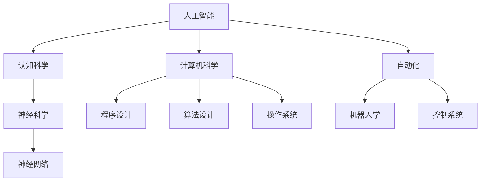

                 

# 1956年达特茅斯会议的学术成果

> 关键词：人工智能, 达特茅斯会议, 计算机科学, 自动化

## 1. 背景介绍

### 1.1 问题的由来

1956年达特茅斯会议（Dartmouth Conference）被认为是人工智能（Artificial Intelligence, AI）的开端。这次会议汇集了一批先驱学者，共同讨论了计算机科学和认知科学等领域的交叉问题，从而奠定了人工智能学科的基础。

### 1.2 问题核心关键点

达特茅斯会议的核心议题包括：

- **人工智能**：如何让机器具有类人类的智能。
- **认知科学**：研究人类认知过程，探究机器如何模拟这些过程。
- **计算机科学**：机器如何处理信息、进行自动化决策。

这次会议标志着计算机科学的诞生，也为后续的人工智能研究奠定了基础。

## 2. 核心概念与联系

### 2.1 核心概念概述

为更好地理解达特茅斯会议的学术成果，本节将介绍几个密切相关的核心概念：

- **人工智能**：使计算机具备人类智能水平的能力，包括推理、学习、规划、决策、感知、语言理解等。
- **认知科学**：研究人类大脑如何工作、理解世界，进而设计能够模拟人类认知过程的计算机系统。
- **计算机科学**：构建高效、可靠的软件和硬件系统，使计算机能够自动处理各种任务。
- **自动化**：使用计算机技术，自动完成重复性任务，提高效率。
- **符号主义**：使用符号（如逻辑符号、文字）来表示和处理信息，强调形式化方法。

这些核心概念共同构成了达特茅斯会议的学术成果，为后续人工智能和认知科学的发展奠定了基础。

### 2.2 概念间的关系

这些核心概念之间的联系可以通过以下Mermaid流程图来展示：



这个流程图展示了大语言模型的核心概念及其之间的关系：

1. 人工智能是整个体系的核心，包含认知科学和计算机科学两个分支。
2. 认知科学专注于研究人类认知过程，为人工智能提供理论基础。
3. 计算机科学通过算法和程序设计，使机器具备执行任务的能力。
4. 自动化是计算机科学的具体应用，通过软件和硬件实现任务自动化。
5. 符号主义作为早期人工智能的主要范式，强调形式化方法，对人工智能的发展有重要影响。

## 3. 核心算法原理 & 具体操作步骤
### 3.1 算法原理概述

达特茅斯会议的学术成果，主要集中在**符号主义**范式下的人工智能研究。这一范式认为，人工智能系统应该通过符号操作来模拟人类的逻辑思维。其核心算法原理包括以下几点：

- **符号逻辑**：使用符号表示知识，通过逻辑推理解决问题。
- **知识表示**：将知识编码为符号，如命题逻辑、谓词逻辑等。
- **推理引擎**：实现知识库中的符号操作，进行逻辑推理。
- **程序设计**：通过编程实现具体任务，如自动定理证明、逻辑游戏等。

### 3.2 算法步骤详解

基于符号主义范式的算法步骤主要包括以下几个关键步骤：

1. **知识获取**：从人类专家或数据中提取知识，编码成符号形式。
2. **知识表示**：将提取的知识存储在知识库中，使用符号逻辑规则表示。
3. **推理引擎**：实现逻辑推理，根据已有的知识库和推理规则进行推理。
4. **验证和修正**：对推理结果进行验证，根据反馈修正知识库和推理规则。
5. **自动化**：将推理引擎和知识表示等集成到自动化系统中，实现具体任务。

### 3.3 算法优缺点

基于符号主义范式的算法具有以下优点：

- **形式化**：符号操作具有严格的形式化定义，便于理解和推理。
- **可解释性**：符号逻辑的推理过程可解释，便于调试和维护。
- **通用性**：符号操作适用于多种任务，如逻辑推理、定理证明等。

同时，该算法也存在一些缺点：

- **计算复杂度高**：符号操作和逻辑推理过程复杂，计算量大。
- **知识表示困难**：难以将复杂知识表示为符号形式，且难以处理非结构化数据。
- **规则依赖强**：依赖手工设计的推理规则，难以适应动态环境。

### 3.4 算法应用领域

基于符号主义范式的算法在多个领域得到了应用，包括：

- **定理证明**：自动定理证明系统，如Metamath、AIXI等。
- **逻辑游戏**：逻辑谜题求解系统，如国际象棋、数独等。
- **专家系统**：使用知识库和推理规则，解决特定领域的专家问题，如医疗诊断、财务分析等。
- **自然语言处理**：早期的大规模语言理解系统，如ELIZA、Sphinx等。

## 4. 数学模型和公式 & 详细讲解
### 4.1 数学模型构建

基于符号主义范式的数学模型，主要通过逻辑代数和布尔代数来表示和推理。以下是一个简单的逻辑表达式：

$$
(\forall x \in A) \wedge (\exists y \in B) \rightarrow (\forall z \in C) \vee (\exists w \in D)
$$

其中，$\forall$ 表示“对所有”，$\exists$ 表示“存在”，$\wedge$ 表示“与”，$\vee$ 表示“或”，$\rightarrow$ 表示“如果...则...”，$\leftrightarrow$ 表示“当且仅当”。

### 4.2 公式推导过程

以布尔代数的De Morgan定律为例，其推导过程如下：

$$
\lnot(A \wedge B) \equiv \lnot A \vee \lnot B
$$

$$
\lnot(A \vee B) \equiv \lnot A \wedge \lnot B
$$

这里的 $\lnot$ 表示“非”，等价于逻辑表达式中的否定。De Morgan定律表明，否定一个合取式等同于对每个子表达式取否定后再进行析取；否定一个析取式等同于对每个子表达式取否定后再进行合取。

### 4.3 案例分析与讲解

一个经典的案例是专家系统的知识表示和推理。假设有一个专家系统用于诊断心脏病，其知识库包括如下规则：

- 如果病人年龄在50岁以上，且存在胸痛、心悸等症状，则诊断为心脏病。
- 如果病人年龄在50岁以下，且存在胸痛、心悸等症状，则排除心脏病。

将这些规则编码为符号形式：

$$
(A \wedge (B \vee C)) \rightarrow D
$$

$$
(\neg A \wedge (B \vee C)) \rightarrow \neg D
$$

其中 $A$ 表示年龄在50岁以上，$B$ 表示胸痛，$C$ 表示心悸，$D$ 表示诊断为心脏病。

## 5. 项目实践：代码实例和详细解释说明
### 5.1 开发环境搭建

在进行符号主义范式的算法实践前，我们需要准备好开发环境。以下是使用Python进行代码实现的环境配置流程：

1. 安装Python：从官网下载并安装Python，用于开发和运行符号逻辑程序。
2. 安装Sympy库：用于符号计算和逻辑推理。
3. 安装Prover9库：用于自动定理证明。

完成上述步骤后，即可在Python环境下开始算法实践。

### 5.2 源代码详细实现

以下是一个简单的符号逻辑推理程序示例：

```python
from sympy import symbols, Eq, solve, And, Or, Not

# 定义符号
x, y, z = symbols('x y z')

# 定义逻辑表达式
expr = And(x, Or(y, z))

# 求解逻辑表达式
result = solve(expr, x)

# 输出结果
print(result)
```

在这个示例中，我们使用了Sympy库进行符号逻辑计算。首先定义了三个符号变量 $x, y, z$，然后构建了一个逻辑表达式 $x \wedge (y \vee z)$，表示 $x$ 为真，或者 $y$ 或 $z$ 中至少有一个为真。接着使用 `solve` 函数求解逻辑表达式，最后输出结果。

### 5.3 代码解读与分析

让我们再详细解读一下关键代码的实现细节：

- `symbols`：定义符号变量。
- `And` 和 `Or`：表示逻辑与和逻辑或。
- `Not`：表示逻辑非。
- `solve`：求解逻辑表达式。

通过这个简单的示例，我们可以看到符号主义范式在Python中的实现方法。Sympy库提供了丰富的符号计算功能，可以用于构建和推理复杂的逻辑表达式。

### 5.4 运行结果展示

运行上述代码，输出结果为 `{x}`，表示 $x$ 为真，或者 $y$ 或 $z$ 中至少有一个为真。这与逻辑表达式 $x \wedge (y \vee z)$ 的结果一致。

## 6. 实际应用场景

### 6.1 专家系统

基于符号主义范式的专家系统，可以广泛应用于医疗诊断、金融分析、航空航天等领域。例如，在医疗诊断中，专家系统可以通过知识库和推理规则，辅助医生进行疾病诊断。在金融分析中，专家系统可以自动处理大量财务数据，进行风险评估和投资建议。

### 6.2 自然语言处理

早期的自然语言处理系统，如ELIZA、Sphinx等，主要基于符号主义范式。这些系统通过符号操作，将自然语言转化为逻辑表达式，进行语义分析和推理。例如，ELIZA系统通过规则库和逻辑推理，模拟了心理医生的对话过程，能够回答问题并提供建议。

### 6.3 人工智能教育

符号主义范式在人工智能教育中也有广泛应用。例如，Prover9系统可以进行自动定理证明，帮助学生理解和掌握数学和逻辑知识。同时，Prover9系统还可以用于解决逻辑谜题，训练学生的逻辑思维能力。

## 7. 工具和资源推荐
### 7.1 学习资源推荐

为了帮助开发者系统掌握符号主义范式的算法原理，这里推荐一些优质的学习资源：

1. 《人工智能导论》（Introduction to Artificial Intelligence）：详细介绍了人工智能的基本概念、方法和应用，包括符号主义范式。
2. 《认知心理学》（Cognitive Psychology）：研究人类认知过程，为人工智能提供理论基础。
3. 《计算机科学导论》（Introduction to Computer Science）：介绍计算机科学的基本概念和方法，涵盖程序设计、算法设计等。
4. 《逻辑学导论》（Introduction to Logic）：系统介绍逻辑学的基础知识，包括符号逻辑和布尔代数。

通过对这些资源的学习实践，相信你一定能够系统掌握符号主义范式的算法原理和实现方法。

### 7.2 开发工具推荐

高效的开发离不开优秀的工具支持。以下是几款用于符号主义范式算法开发的常用工具：

1. Python：简洁易用的编程语言，支持符号计算和逻辑推理。
2. Sympy库：符号计算库，提供丰富的逻辑推理功能。
3. Prover9库：自动定理证明系统，支持复杂的逻辑表达式求解。
4. AutoProof：基于Prover9的图形界面工具，方便用户构建和验证逻辑表达式。

合理利用这些工具，可以显著提升符号主义范式的算法开发效率，加快创新迭代的步伐。

### 7.3 相关论文推荐

符号主义范式的发展得益于众多学者的不懈探索。以下是几篇奠基性的相关论文，推荐阅读：

1. "A New Method for Automating Theorem-Proving"（1960）：D.A. Michie等人发表的论文，提出了自动定理证明的算法框架。
2. "Artificial Intelligence: A Guide for Thinking Humans"（1995）：J. R. Searle的著作，探讨了人工智能的本质和哲学问题。
3. "Expert Systems: The Technology and Tools"（1984）：M. M. Hovakimian的著作，系统介绍了专家系统的原理和应用。
4. "Logic Programming"（1984）：L. Kowalski的著作，介绍了逻辑编程的基本概念和方法。

这些论文代表了大语言模型微调技术的发展脉络。通过学习这些前沿成果，可以帮助研究者把握学科前进方向，激发更多的创新灵感。

## 8. 总结：未来发展趋势与挑战

### 8.1 总结

本文对1956年达特茅斯会议的学术成果进行了全面系统的介绍。首先阐述了达特茅斯会议的历史背景和重要性，明确了符号主义范式在人工智能研究中的核心地位。其次，从原理到实践，详细讲解了符号主义范式的数学模型和算法步骤，给出了符号主义范式的代码实现示例。同时，本文还广泛探讨了符号主义范式在专家系统、自然语言处理、人工智能教育等多个领域的应用前景，展示了符号主义范式的巨大潜力。此外，本文精选了符号主义范式的学习资源，力求为读者提供全方位的技术指引。

通过本文的系统梳理，可以看到，符号主义范式作为早期人工智能的核心范式，为后续人工智能和认知科学的发展奠定了基础。尽管该范式在现代人工智能中已不再主导，但其理论和方法仍然具有重要价值，对理解人工智能的发展历程具有重要意义。

### 8.2 未来发展趋势

展望未来，符号主义范式在人工智能和认知科学领域仍将发挥重要作用：

1. 知识表示更加丰富。未来的符号主义系统将引入更多的知识表示方法，如语义网络、本体论等，更好地表示和推理复杂知识。
2. 推理引擎更加高效。未来的符号主义系统将采用更高效的推理引擎，如规则引擎、因果推理器等，提升推理速度和准确性。
3. 应用领域更加广泛。未来的符号主义系统将应用于更多的实际领域，如自动定理证明、自动规划等。
4. 与机器学习的融合。未来的符号主义系统将与机器学习技术进行深度融合，形成更加灵活、强大的知识处理和推理能力。

以上趋势凸显了符号主义范式的未来发展方向。这些方向的探索发展，必将进一步提升人工智能和认知科学系统的性能和应用范围，为构建更加智能、普适的系统铺平道路。

### 8.3 面临的挑战

尽管符号主义范式在早期人工智能中发挥了重要作用，但在迈向更加智能化、普适化应用的过程中，它仍面临诸多挑战：

1. 知识表示困难。符号主义系统依赖于手工设计的知识库，难以处理动态变化的知识。如何自动获取和更新知识库，是未来的主要挑战。
2. 推理过程复杂。符号主义系统的推理过程复杂，难以处理大规模、复杂的数据。如何简化推理过程，提高推理效率，是需要解决的重要问题。
3. 知识库冗余。符号主义系统中的知识库可能存在冗余和冲突，影响推理结果的准确性。如何优化知识库结构，避免冗余和冲突，是未来的研究方向。
4. 缺乏灵活性。符号主义系统对问题的形式要求高，难以处理模糊、不确定的任务。如何引入模糊逻辑、概率推理等方法，增强系统的灵活性，是未来的研究重点。
5. 无法处理非结构化数据。符号主义系统难以处理图像、视频等非结构化数据。如何将符号主义系统与非结构化数据处理技术相结合，形成更加全面的信息处理能力，是未来的研究方向。

这些挑战是符号主义范式迈向更加智能化、普适化应用的瓶颈，需要学界和产业界的共同努力。只有在解决这些挑战的前提下，符号主义范式才能真正发挥其巨大的潜力。

### 8.4 研究展望

未来的研究需要在以下几个方面寻求新的突破：

1. 引入更多先验知识。将符号主义系统与外部知识库、规则库等专家知识结合，形成更加全面、准确的信息整合能力。
2. 融合因果分析和博弈论工具。将因果分析方法引入符号主义系统，识别出系统决策的关键特征，增强输出解释的因果性和逻辑性。
3. 结合机器学习和深度学习。将符号主义系统与机器学习、深度学习技术进行深度融合，形成更加灵活、强大的知识处理和推理能力。
4. 引入模糊逻辑和概率推理。将模糊逻辑、概率推理等方法引入符号主义系统，增强系统的灵活性和鲁棒性。
5. 引入符号计算和逻辑推理。将符号计算和逻辑推理方法引入符号主义系统，提升系统的推理速度和准确性。

这些研究方向的探索，必将引领符号主义范式走向新的高度，为构建智能、普适的人工智能系统提供新的思路和方法。面对未来的挑战，符号主义范式需要不断创新和优化，方能在人工智能的发展中继续发挥其重要作用。

## 9. 附录：常见问题与解答

**Q1：符号主义范式与机器学习的关系是什么？**

A: 符号主义范式与机器学习的关系是互补的。符号主义范式主要关注知识的表示和推理，而机器学习则关注数据驱动的学习过程。尽管符号主义范式在早期人工智能中发挥了重要作用，但在现代人工智能中，机器学习已经成为主流。符号主义范式与机器学习技术的融合，将形成更加全面、高效的知识处理和推理能力。

**Q2：符号主义范式的应用场景有哪些？**

A: 符号主义范式在早期人工智能中发挥了重要作用，适用于许多领域，包括专家系统、自然语言处理、人工智能教育等。例如，专家系统可以通过知识库和推理规则，辅助医生进行疾病诊断；自然语言处理系统可以通过符号操作，实现语义分析和推理。

**Q3：符号主义范式的优点和缺点有哪些？**

A: 符号主义范式的优点包括形式化、可解释性、通用性。缺点包括计算复杂度高、知识表示困难、规则依赖强。尽管符号主义范式在早期人工智能中发挥了重要作用，但在现代人工智能中，其缺点逐渐显现，导致其在某些应用场景中难以与其他方法竞争。

**Q4：符号主义范式与认知科学的关系是什么？**

A: 符号主义范式与认知科学的关系是密切相关的。符号主义范式主要关注知识的表示和推理，而认知科学主要研究人类认知过程。符号主义范式为认知科学提供了形式化方法，帮助认知科学家更好地理解人类认知过程，并将其应用于人工智能系统。

**Q5：未来符号主义范式的发展方向是什么？**

A: 未来符号主义范式的发展方向包括引入更多先验知识、融合因果分析和博弈论工具、结合机器学习和深度学习、引入模糊逻辑和概率推理、引入符号计算和逻辑推理等。这些方向的探索，将推动符号主义范式迈向新的高度，为构建智能、普适的人工智能系统提供新的思路和方法。

---

作者：禅与计算机程序设计艺术 / Zen and the Art of Computer Programming

