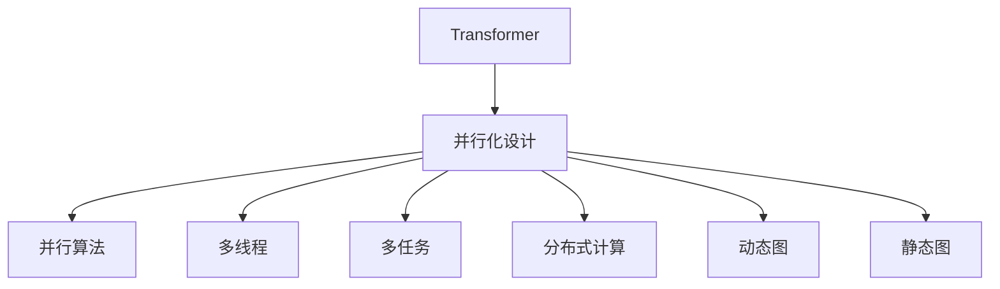

                 

# 并行化设计:Transformer成功的关键

> 关键词：Transformer, 并行化, 深度学习, 高性能计算, 并行算法, 多线程, 分布式计算

## 1. 背景介绍

### 1.1 问题由来

自2017年提出以来，Transformer模型以其卓越的语言理解能力，在自然语言处理（NLP）领域取得了突破性进展。Transformer以其自注意力机制（Self-Attention）和多头机制（Multi-Head），显著提升了模型对长距离依赖的建模能力，在机器翻译、文本生成、问答系统等任务上均取得了优异表现。然而，随着模型规模的不断增大，Transformer在并行化设计和高效计算上的瓶颈也逐渐显现。

Transformer模型的结构复杂，参数量庞大，传统的串行计算难以满足需求。为了克服这一难题，学术界和工业界开发了一系列并行化算法和工具，使Transformer能够高效并行运行，大幅提升训练和推理速度。本文将深入探讨Transformer并行化设计的原理、步骤、优缺点及应用领域，为读者提供全面的技术指导。

### 1.2 问题核心关键点

Transformer并行化设计涉及多个核心问题：

- **并行算法**：如何设计高效的并行算法，避免数据依赖和通信开销，实现性能优化。
- **多线程与多任务**：如何在单卡或多卡上并行处理多个任务，提升硬件利用率。
- **分布式计算**：如何利用多机多节点进行大规模并行计算，加速模型训练。
- **动态图与静态图**：如何选择静态图或动态图的优化方式，提升模型推理速度。

这些问题的解决需要综合考虑算力、内存、通信等系统因素，通过合理的硬件调度、算法设计、模型优化等手段，实现并行化计算的效率和效果最大化。

### 1.3 问题研究意义

高效并行化设计是Transformer模型成功应用的关键，其重要性体现在以下几个方面：

1. **加速计算**：通过并行化设计，Transformer能够在较短时间内完成大规模训练和推理，显著提升计算效率。
2. **资源利用**：并行化设计充分利用硬件资源，减少设备闲置，提高计算设备的性价比。
3. **模型规模**：并行化设计使得使用更大规模的模型成为可能，推动了Transformer模型的不断扩展和演进。
4. **应用场景**：高效的并行化设计为Transformer在更多实际应用场景中落地提供了支持。
5. **未来发展**：并行化设计是Transformer模型未来向着更高效、更通用方向发展的技术基础。

本文旨在帮助读者全面理解Transformer的并行化设计，掌握相关的并行算法和优化技术，为实际应用中处理大规模数据和模型提供参考。

## 2. 核心概念与联系

### 2.1 核心概念概述

为更好地理解Transformer并行化设计的原理和步骤，本节将介绍几个密切相关的核心概念：

- **Transformer**：一种基于自注意力机制的深度学习模型，广泛应用于自然语言处理任务中。
- **并行化设计**：通过合理调度计算资源，使多个计算任务并行执行，从而提升计算效率的设计思路。
- **并行算法**：能够并行执行的计算算法，如数据并行、模型并行、任务并行等。
- **多线程**：在一个处理器上同时执行多个线程，提高计算效率。
- **多任务**：在同一设备上同时处理多个任务，提高硬件利用率。
- **分布式计算**：利用多台计算机协同计算，提升计算能力。
- **动态图与静态图**：在深度学习中，动态图指模型推理时按顺序执行计算图，静态图指模型训练时先构建计算图，再并行执行。

这些核心概念之间的逻辑关系可以通过以下Mermaid流程图来展示：



这个流程图展示了Transformer并行化设计的核心概念及其之间的关系：

1. Transformer作为并行化设计的核心模型，其结构复杂性决定了并行化的必要性。
2. 并行化设计通过选择合适的并行算法、多线程、多任务、分布式计算、动态图与静态图等手段，实现高效的并行计算。
3. 这些手段之间相互配合，共同构成Transformer并行化设计的完整生态系统，提升其计算能力和应用范围。

### 2.2 概念间的关系

这些核心概念之间存在着紧密的联系，形成了Transformer并行化设计的完整生态系统。下面我们通过几个Mermaid流程图来展示这些概念之间的关系。

#### 2.2.1 Transformer的并行化设计架构

```mermaid
graph TB
    A[Transformer] --> B[自注意力机制]
    A --> C[多头机制]
    B --> D[矩阵乘法]
    B --> E[归一化层]
    C --> F[矩阵乘法]
    C --> G[多头注意力]
    D --> H[位置编码]
    E --> I[缩放注意力]
    F --> J[多头注意力]
    G --> K[多头注意力]
    H --> L[位置编码]
    I --> M[缩放注意力]
    J --> N[多头注意力]
    K --> O[多头注意力]
    L --> P[位置编码]
    M --> Q[缩放注意力]
    N --> R[多头注意力]
    O --> S[多头注意力]
    P --> T[位置编码]
    Q --> U[缩放注意力]
    R --> V[多头注意力]
    S --> W[多头注意力]
    T --> X[位置编码]
    U --> Y[缩放注意力]
    V --> Z[多头注意力]
    W --> AA[多头注意力]
    X --> AB[位置编码]
    Y --> AC[缩放注意力]
    Z --> AD[多头注意力]
    AA --> AE[多头注意力]
    AB --> AF[位置编码]
    AC --> AG[缩放注意力]
    AD --> AH[多头注意力]
    AE --> AI[多头注意力]
    AF --> AJ[位置编码]
    AG --> AK[缩放注意力]
    AH --> AL[多头注意力]
    AI --> AM[多头注意力]
    AJ --> AN[位置编码]
    AK --> AO[缩放注意力]
    AL --> AP[多头注意力]
    AM --> AQ[多头注意力]
    AN --> AR[位置编码]
    AO --> AS[缩放注意力]
    AP --> AT[多头注意力]
    AQ --> AU[多头注意力]
    AR --> AV[位置编码]
    AS --> AW[多头注意力]
    AT --> AX[多头注意力]
    AU --> AY[多头注意力]
    AV --> AZ[位置编码]
    AW --> AA[多头注意力]
    AX --> AB[位置编码]
    AY --> AC[缩放注意力]
    AZ --> AD[多头注意力]
    AA --> AE[多头注意力]
    AB --> AF[位置编码]
    AC --> AG[缩放注意力]
    AD --> AH[多头注意力]
    AE --> AI[多头注意力]
    AF --> AJ[位置编码]
    AG --> AK[缩放注意力]
    AH --> AL[多头注意力]
    AI --> AM[多头注意力]
    AJ --> AN[位置编码]
    AK --> AO[缩放注意力]
    AL --> AP[多头注意力]
    AM --> AQ[多头注意力]
    AN --> AR[位置编码]
    AO --> AS[缩放注意力]
    AP --> AT[多头注意力]
    AQ --> AU[多头注意力]
    AR --> AV[位置编码]
    AS --> AW[多头注意力]
    AT --> AX[多头注意力]
    AU --> AY[多头注意力]
    AV --> AZ[位置编码]
    AW --> AA[多头注意力]
    AX --> AB[位置编码]
    AY --> AC[缩放注意力]
    AZ --> AD[多头注意力]
    AA --> AE[多头注意力]
    AB --> AF[位置编码]
    AC --> AG[缩放注意力]
    AD --> AH[多头注意力]
    AE --> AI[多头注意力]
    AF --> AJ[位置编码]
    AG --> AK[缩放注意力]
    AH --> AL[多头注意力]
    AI --> AM[多头注意力]
    AJ --> AN[位置编码]
    AK --> AO[缩放注意力]
    AL --> AP[多头注意力]
    AM --> AQ[多头注意力]
    AN --> AR[位置编码]
    AO --> AS[缩放注意力]
    AP --> AT[多头注意力]
    AQ --> AU[多头注意力]
    AR --> AV[位置编码]
    AS --> AW[多头注意力]
    AT --> AX[多头注意力]
    AU --> AY[多头注意力]
    AV --> AZ[位置编码]
    AW --> AA[多头注意力]
    AX --> AB[位置编码]
    AY --> AC[缩放注意力]
    AZ --> AD[多头注意力]
    AA --> AE[多头注意力]
    AB --> AF[位置编码]
    AC --> AG[缩放注意力]
    AD --> AH[多头注意力]
    AE --> AI[多头注意力]
    AF --> AJ[位置编码]
    AG --> AK[缩放注意力]
    AH --> AL[多头注意力]
    AI --> AM[多头注意力]
    AJ --> AN[位置编码]
    AK --> AO[缩放注意力]
    AL --> AP[多头注意力]
    AM --> AQ[多头注意力]
    AN --> AR[位置编码]
    AO --> AS[缩放注意力]
    AP --> AT[多头注意力]
    AQ --> AU[多头注意力]
    AR --> AV[位置编码]
    AS --> AW[多头注意力]
    AT --> AX[多头注意力]
    AU --> AY[多头注意力]
    AV --> AZ[位置编码]
    AW --> AA[多头注意力]
    AX --> AB[位置编码]
    AY --> AC[缩放注意力]
    AZ --> AD[多头注意力]
    AA --> AE[多头注意力]
    AB --> AF[位置编码]
    AC --> AG[缩放注意力]
    AD --> AH[多头注意力]
    AE --> AI[多头注意力]
    AF --> AJ[位置编码]
    AG --> AK[缩放注意力]
    AH --> AL[多头注意力]
    AI --> AM[多头注意力]
    AJ --> AN[位置编码]
    AK --> AO[缩放注意力]
    AL --> AP[多头注意力]
    AM --> AQ[多头注意力]
    AN --> AR[位置编码]
    AO --> AS[缩放注意力]
    AP --> AT[多头注意力]
    AQ --> AU[多头注意力]
    AR --> AV[位置编码]
    AS --> AW[多头注意力]
    AT --> AX[多头注意力]
    AU --> AY[多头注意力]
    AV --> AZ[位置编码]
    AW --> AA[多头注意力]
    AX --> AB[位置编码]
    AY --> AC[缩放注意力]
    AZ --> AD[多头注意力]
    AA --> AE[多头注意力]
    AB --> AF[位置编码]
    AC --> AG[缩放注意力]
    AD --> AH[多头注意力]
    AE --> AI[多头注意力]
    AF --> AJ[位置编码]
    AG --> AK[缩放注意力]
    AH --> AL[多头注意力]
    AI --> AM[多头注意力]
    AJ --> AN[位置编码]
    AK --> AO[缩放注意力]
    AL --> AP[多头注意力]
    AM --> AQ[多头注意力]
    AN --> AR[位置编码]
    AO --> AS[缩放注意力]
    AP --> AT[多头注意力]
    AQ --> AU[多头注意力]
    AR --> AV[位置编码]
    AS --> AW[多头注意力]
    AT --> AX[多头注意力]
    AU --> AY[多头注意力]
    AV --> AZ[位置编码]
    AW --> AA[多头注意力]
    AX --> AB[位置编码]
    AY --> AC[缩放注意力]
    AZ --> AD[多头注意力]
    AA --> AE[多头注意力]
    AB --> AF[位置编码]
    AC --> AG[缩放注意力]
    AD --> AH[多头注意力]
    AE --> AI[多头注意力]
    AF --> AJ[位置编码]
    AG --> AK[缩放注意力]
    AH --> AL[多头注意力]
    AI --> AM[多头注意力]
    AJ --> AN[位置编码]
    AK --> AO[缩放注意力]
    AL --> AP[多头注意力]
    AM --> AQ[多头注意力]
    AN --> AR[位置编码]
    AO --> AS[缩放注意力]
    AP --> AT[多头注意力]
    AQ --> AU[多头注意力]
    AR --> AV[位置编码]
    AS --> AW[多头注意力]
    AT --> AX[多头注意力]
    AU --> AY[多头注意力]
    AV --> AZ[位置编码]
    AW --> AA[多头注意力]
    AX --> AB[位置编码]
    AY --> AC[缩放注意力]
    AZ --> AD[多头注意力]
    AA --> AE[多头注意力]
    AB --> AF[位置编码]
    AC --> AG[缩放注意力]
    AD --> AH[多头注意力]
    AE --> AI[多头注意力]
    AF --> AJ[位置编码]
    AG --> AK[缩放注意力]
    AH --> AL[多头注意力]
    AI --> AM[多头注意力]
    AJ --> AN[位置编码]
    AK --> AO[缩放注意力]
    AL --> AP[多头注意力]
    AM --> AQ[多头注意力]
    AN --> AR[位置编码]
    AO --> AS[缩放注意力]
    AP --> AT[多头注意力]
    AQ --> AU[多头注意力]
    AR --> AV[位置编码]
    AS --> AW[多头注意力]
    AT --> AX[多头注意力]
    AU --> AY[多头注意力]
    AV --> AZ[位置编码]
    AW --> AA[多头注意力]
    AX --> AB[位置编码]
    AY --> AC[缩放注意力]
    AZ --> AD[多头注意力]
    AA --> AE[多头注意力]
    AB --> AF[位置编码]
    AC --> AG[缩放注意力]
    AD --> AH[多头注意力]
    AE --> AI[多头注意力]
    AF --> AJ[位置编码]
    AG --> AK[缩放注意力]
    AH --> AL[多头注意力]
    AI --> AM[多头注意力]
    AJ --> AN[位置编码]
    AK --> AO[缩放注意力]
    AL --> AP[多头注意力]
    AM --> AQ[多头注意力]
    AN --> AR[位置编码]
    AO --> AS[缩放注意力]
    AP --> AT[多头注意力]
    AQ --> AU[多头注意力]
    AR --> AV[位置编码]
    AS --> AW[多头注意力]
    AT --> AX[多头注意力]
    AU --> AY[多头注意力]
    AV --> AZ[位置编码]
    AW --> AA[多头注意力]
    AX --> AB[位置编码]
    AY --> AC[缩放注意力]
    AZ --> AD[多头注意力]
    AA --> AE[多头注意力]
    AB --> AF[位置编码]
    AC --> AG[缩放注意力]
    AD --> AH[多头注意力]
    AE --> AI[多头注意力]
    AF --> AJ[位置编码]
    AG --> AK[缩放注意力]
    AH --> AL[多头注意力]
    AI --> AM[多头注意力]
    AJ --> AN[位置编码]
    AK --> AO[缩放注意力]
    AL --> AP[多头注意力]
    AM --> AQ[多头注意力]
    AN --> AR[位置编码]
    AO --> AS[缩放注意力]
    AP --> AT[多头注意力]
    AQ --> AU[多头注意力]
    AR --> AV[位置编码]
    AS --> AW[多头注意力]
    AT --> AX[多头注意力]
    AU --> AY[多头注意力]
    AV --> AZ[位置编码]
    AW --> AA[多头注意力]
    AX --> AB[位置编码]
    AY --> AC[缩放注意力]
    AZ --> AD[多头注意力]
    AA --> AE[多头注意力]
    AB --> AF[位置编码]
    AC --> AG[缩放注意力]
    AD --> AH[多头注意力]
    AE --> AI[多头注意力]
    AF --> AJ[位置编码]
    AG --> AK[缩放注意力]
    AH --> AL[多头注意力]
    AI --> AM[多头注意力]
    AJ --> AN[位置编码]
    AK --> AO[缩放注意力]
    AL --> AP[多头注意力]
    AM --> AQ[多头注意力]
    AN --> AR[位置编码]
    AO --> AS[缩放注意力]
    AP --> AT[多头注意力]
    AQ --> AU[多头注意力]
    AR --> AV[位置编码]
    AS --> AW[多头注意力]
    AT --> AX[多头注意力]
    AU --> AY[多头注意力]
    AV --> AZ[位置编码]
    AW --> AA[多头注意力]
    AX --> AB[位置编码]
    AY --> AC[缩放注意力]
    AZ --> AD[多头注意力]
    AA --> AE[多头注意力]
    AB --> AF[位置编码]
    AC --> AG[缩放注意力]
    AD --> AH[多头注意力]
    AE --> AI[多头注意力]
    AF --> AJ[位置编码]
    AG --> AK[缩放注意力]
    AH --> AL[多头注意力]
    AI --> AM[多头注意力]
    AJ --> AN[位置编码]
    AK --> AO[缩放注意力]
    AL --> AP[多头注意力]
    AM --> AQ[多头注意力]
    AN --> AR[位置编码]
    AO --> AS[缩放注意力]
    AP --> AT[多头注意力]
    AQ --> AU[多头注意力]
    AR --> AV[位置编码]
    AS --> AW[多头注意力]
    AT --> AX[多头注意力]
    AU --> AY[多头注意力]
    AV --> AZ[位置编码]
    AW --> AA[多头注意力]
    AX --> AB[位置编码]
    AY --> AC[缩放注意力]
    AZ --> AD[多头注意力]
    AA --> AE[多头注意力]
    AB --> AF[位置编码]
    AC --> AG[缩放注意力]
    AD --> AH[多头注意力]
    AE --> AI[多头注意力]
    AF --> AJ[位置编码]
    AG --> AK[缩放注意力]
    AH --> AL[多头注意力]
    AI --> AM[多头注意力]
    AJ --> AN[位置编码]
    AK --> AO[缩放注意力]
    AL --> AP[多头注意力]
    AM --> AQ[多头注意力]
    AN --> AR[位置编码]
    AO --> AS[缩放注意力]
    AP --> AT[多头注意力]
    AQ --> AU[多头注意力]
    AR --> AV[位置编码]
    AS --> AW[多头注意力]
    AT --> AX[多头注意力]
    AU --> AY[多头注意力]
    AV --> AZ[位置编码]
    AW --> AA[多头注意力]
    AX --> AB[位置编码]
    AY --> AC[缩放注意力]
    AZ --> AD[多头注意力]
    AA --> AE[多头注意力]
    AB --> AF[位置编码]
    AC --> AG[缩放注意力]
    AD --> AH[多头注意力]
    AE --> AI[多头注意力]
    AF --> AJ[位置编码]
    AG --> AK[缩放注意力]
    AH --> AL[多头注意力]
    AI --> AM[多头注意力]
    AJ --> AN[位置编码]
    AK --> AO[缩放注意力]
    AL --> AP[多头注意力]
    AM --> AQ[多头注意力]
    AN --> AR[位置编码]
    AO --> AS[缩放注意力]
    AP --> AT[多头注意力]
    AQ --> AU[多头注意力]
    AR --> AV[位置编码]
    AS --> AW[多头注意力]
    AT --> AX[多头注意力]
    AU --> AY[多头注意力]
    AV --> AZ[位置编码]
    AW --> AA[多头注意力]
    AX --> AB[位置编码]
    AY --> AC[缩放注意力]
    AZ --> AD[多头注意力]
    AA --> AE[多头注意力]
    AB --> AF[位置编码]
    AC --> AG[缩放注意力]
    AD --> AH[多头注意力]
    AE --> AI[多头注意力]
    AF --> AJ[位置编码]
    AG --> AK[缩放注意力]
    AH --> AL[多头注意力]
    AI --> AM[多头注意力]
    AJ --> AN[位置编码]
    AK --> AO[缩放注意力]
    AL --> AP[多头注意力]
    AM --> AQ[多头注意力]
    AN --> AR[位置编码]
    AO --> AS[缩放注意力]
    AP --> AT[多头注意力]
    AQ --> AU[多头注意力]
    AR --> AV[位置编码]
    AS --> AW[多头注意力]
    AT --> AX[多头注意力]
    AU --> AY[多头注意力]
    AV --> AZ[位置编码]
    AW --> AA[多头注意力]
    AX --> AB[位置编码]
    AY --> AC[缩放注意力]
    AZ --> AD[多头注意力]
    AA --> AE[多头注意力]
    AB --> AF[位置编码]
    AC --> AG[缩放注意力]
    AD --> AH[多头注意力]
    AE --> AI[多头注意力]
    AF --> AJ[位置编码]
    AG --> AK[缩放注意力]
    AH --> AL[多头注意力]
    AI --> AM[多头注意力]
    AJ --> AN[位置编码]
    AK --> AO[缩放注意力]
    AL --> AP[多头注意力]
    AM --> AQ[多头注意力]
    AN --> AR[位置编码]
    AO --> AS[缩放注意力]
    AP --> AT[多头注意力]
    AQ --> AU[多头注意力]
    AR --> AV[位置编码]
    AS --> AW[多头注意力]
    AT --> AX[多头注意力]
    AU --> AY[多头注意力]
    AV --> AZ[位置编码]
    AW --> AA[多头注意力]
    AX --> AB[位置编码]
    AY --> AC[缩放注意力]
    AZ --> AD[多头注意力]
    AA --> AE[多头注意力]
    AB --> AF[位置编码]
    AC --> AG[缩放注意力]
    AD --> AH[多头注意力]
    AE --> AI[多头注意力]
    AF --> AJ[位置编码]
    AG --> AK[缩放注意力]
    AH --> AL[多头注意力]
    AI --> AM[多头注意力]
    AJ --> AN[位置编码]
    AK --> AO[缩放注意力]
    AL --> AP[多头注意力]
    AM --> AQ[多头注意力]
    AN --> AR[位置编码]
    AO --> AS[缩放注意力]
    AP --> AT[多头注意力]
    AQ --> AU[多头注意力]
    AR --> AV[位置编码]
    AS --> AW[多头注意力]
    AT --> AX[多头注意力]
    AU --> AY[多头注意力]
    AV --> AZ[位置编码]
    AW --> AA[多头注意力]
    AX --> AB[位置编码]
    AY --> AC[缩放注意力]
    AZ --> AD[多头注意力]
    AA --> AE[多头注意力]
    AB --> AF[位置编码]
    AC --> AG[缩放注意力]
    AD --> AH[多头注意力]
    AE --> AI[多头注意力]
    AF --> AJ[位置编码]
    AG --> AK[缩放注意力]
    AH --> AL[多头注意力]
    AI --> AM[多头注意力]
    AJ --> AN[位置编码]
    AK --> AO[缩放注意力]
    AL --> AP[多头注意力]
    AM --> AQ[多头注意力]
    AN --> AR[位置编码]
    AO --> AS[缩放注意力]
    AP --> AT[多头注意力]
    AQ --> AU[多头注意力]
    AR --> AV[位置编码]
    AS --> AW[多头注意力]
    AT --> AX[多头注意力]
    AU --> AY[多头注意力]
    AV --> AZ[位置编码]
    AW --> AA[多头注意力]
    AX --> AB[位置编码]
    AY --> AC[缩放注意力]
    AZ --> AD[多头注意力]
    AA --> AE[多头注意力]
    AB --> AF[位置编码]
    AC --> AG[缩放注意力]
    AD --> AH[多头注意力]
    AE --> AI[多头注意力]
    AF --> AJ[位置编码]
    AG --> AK[缩放注意力]
    AH --> AL[多头注意力]
    AI --> AM[多头注意力]
    AJ --> AN[位置编码]
    AK --> AO[缩放注意力]
    AL --> AP[多头注意力]
    AM --> AQ[多头注意力]
    AN --> AR[位置编码]
    AO --> AS[缩放注意力]
    AP --> AT[多头注意力]
    AQ --> AU[多头注意力]
    AR --> AV[位置编码]
    AS --> AW[多头注意力]
    AT --> AX[多头注意力]
    AU --> AY[多头注意力]
    AV --> AZ[位置编码]
    AW --> AA[多头注意力]
    AX --> AB[位置编码]
    AY --> AC[缩放注意力]
    AZ --> AD[多头注意力]
    AA --> AE[多头注意力]
    AB --> AF[位置编码]
    AC --> AG[缩放注意力]
    AD --> AH[多头注意力]
    AE --> AI[多头注意力]
    AF --> AJ[位置编码]
    AG --> AK[缩放注意力]
    AH --> AL[多头注意力]
    AI --> AM[多头注意力]
    AJ --> AN[位置编码]
    AK --> AO[缩放注意力]
    AL --> AP[多头注意力]
    AM --> AQ[多头注意力]
    AN --> AR[位置编码]
    AO --> AS[缩放注意力]
    AP --> AT[多头注意力]
    AQ --> AU[多头注意力]
    AR --> AV[位置编码]
    AS --> AW[多头注意力]
    AT --> AX[多头注意力]
    AU --> AY[多头注意力]
    AV --> AZ[位置编码]
    AW --> AA[多头注意力]
    AX --> AB[位置编码]
    AY --> AC[缩放注意力]
    AZ --> AD[多头注意力]
    AA --> AE[多头注意力]
    AB --> AF[位置编码]
    AC --> AG[缩放注意力]
    AD --> AH[多头注意力]
    AE --> AI[多头注意力]
    AF --> AJ[位置编码]
    AG --> AK[缩放注意力]
    AH --> AL[多头注意力]
    AI --> AM[多头注意力]
    AJ --> AN[位置编码]
    AK --> AO[缩放注意力]
    AL --> AP[多头注意力]
    AM --> AQ[多头注意力]
    AN --> AR[位置编码]
    AO --> AS[缩放注意力]
    AP --> AT[多头注意力]
    AQ --> AU[多头注意力]
    AR --> AV[位置编码]
    AS --> AW[多头注意力]
    AT --> AX[多头注意力]
    AU --> AY[多头注意力]
    AV --> AZ[位置编码]
    AW --> AA[多头注意力]
    AX --> AB[位置编码]
    AY --> AC[缩放注意力]
    AZ --> AD[多头注意力]
    AA --> AE[多头注意力]
    AB --> AF[位置编码]
    AC --> AG[缩放注意力]
    AD --> AH[多头注意力]
    AE --> AI[多头注意力]
    AF --> AJ[位置编码]
    AG --> AK[缩放注意力]
    AH --> AL[多头注意力]
    AI --> AM

