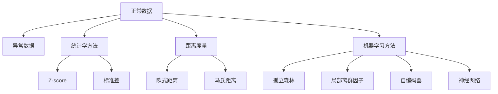
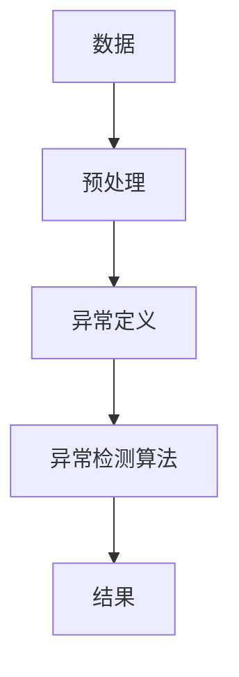

                 

# 异常检测(Anomaly Detection) - 原理与代码实例讲解

## 1. 背景介绍

### 1.1 问题由来
异常检测（Anomaly Detection）是机器学习中的一个重要领域，用于识别数据中的异常点或异常行为。异常检测在金融风控、网络安全、工业监控等多个行业中有广泛的应用。常见的异常检测问题包括：

- 欺诈检测：识别信用卡交易中的可疑行为，预防金融诈骗。
- 入侵检测：监控网络流量，检测和防御恶意攻击。
- 故障诊断：监控设备状态，预测机器故障。
- 健康监测：分析患者生理数据，发现健康异常。

### 1.2 问题核心关键点
异常检测的核心在于构建一个可以区分正常与异常的数据模型。在处理异常检测问题时，需要考虑以下几个关键点：

- 异常定义：确定何为“正常”和“异常”。
- 异常数量：有多少数据点被视为异常。
- 异常分布：异常点的空间分布特性。
- 异常检测方法：选择合适的异常检测算法和模型。

### 1.3 问题研究意义
异常检测技术在保证业务连续性、数据安全、设备稳定运行等方面具有重要作用。它的研究不仅可以帮助企业发现潜在问题，提升业务效率，还能提供安全防护，防止信息泄露和攻击。在健康医疗、金融安全等领域，异常检测技术的应用可以提前发现问题，避免更大损失，具有显著的社会和经济价值。

## 2. 核心概念与联系

### 2.1 核心概念概述

异常检测的核心概念包括：

- 正常数据与异常数据：正常数据点（inliers）和异常数据点（outliers）。
- 异常定义（Anomaly Definition）：通常使用统计学或机器学习的方法定义正常数据集和异常数据集。
- 异常检测算法（Anomaly Detection Algorithms）：包括基于统计学、基于距离度量和基于机器学习等不同的方法。

### 2.2 核心概念之间的关系

以下是核心概念之间的逻辑关系示意图：



这个示意图展示了不同异常检测方法的基本原理及其适用范围。统计学方法如Z-score和标准差等适用于数据分布已知的情况，距离度量方法如欧式距离和马氏距离可用于任何分布的数据，机器学习方法如孤立森林、局部离群因子和自编码器等适用于复杂数据的异常检测。

### 2.3 核心概念的整体架构

异常检测的整体架构如下：



该架构展示了异常检测的一般流程：首先对原始数据进行预处理，然后根据异常定义构建数据模型，最后使用异常检测算法来识别异常数据。

## 3. 核心算法原理 & 具体操作步骤

### 3.1 算法原理概述

异常检测的基本思路是构建一个描述正常数据的模型，然后将新数据与该模型进行比较，如果新数据与模型的偏离程度超过预设的阈值，则将其视为异常数据。常见的异常检测方法包括：

- 统计学方法：利用数据的统计特征（如均值、标准差等）构建模型，检测异常数据。
- 距离度量方法：通过计算数据点之间的距离，判断其与正常数据集的距离是否异常。
- 机器学习方法：利用异常检测算法（如孤立森林、局部离群因子、自编码器等）构建模型，检测异常数据。

### 3.2 算法步骤详解

以孤立森林算法为例，介绍异常检测的详细步骤：

**Step 1: 数据预处理**
- 对原始数据进行清洗、归一化、特征选择等预处理操作。

**Step 2: 构建孤立森林模型**
- 随机选择样本，随机选择特征，构建孤立森林。
- 对于每个样本，计算其在孤立森林中的深度。
- 对于所有样本，计算平均深度。

**Step 3: 计算异常得分**
- 对于每个数据点，计算其异常得分。
- 异常得分定义为样本的平均深度。
- 设置阈值，将异常得分高于阈值的数据点视为异常。

**Step 4: 输出结果**
- 对所有数据点进行异常得分排序。
- 输出异常数据点。

### 3.3 算法优缺点

孤立森林算法具有以下优点：

- 能够处理高维数据和复杂数据结构。
- 计算复杂度较低，适合大规模数据。
- 不需要显式的概率模型，不需要大量训练数据。

其缺点包括：

- 对于高维数据，计算异常得分时可能会丢失信息。
- 对于某些异常类型，如极值异常，效果不佳。

### 3.4 算法应用领域

异常检测算法在以下领域具有广泛的应用：

- 金融风控：检测信用卡交易中的异常行为，预防金融诈骗。
- 网络安全：检测网络流量中的异常行为，防止DDoS攻击。
- 工业监控：监控设备状态，预防机器故障。
- 健康监测：分析患者生理数据，预防疾病。

## 4. 数学模型和公式 & 详细讲解 & 举例说明

### 4.1 数学模型构建

异常检测的数学模型通常基于以下假设：

- 正常数据点聚集在一起，异常数据点散布在四周。
- 异常数据点的数量远小于正常数据点。

基于这些假设，构建以下数学模型：

- 统计学方法：使用均值和标准差来描述正常数据集。
- 距离度量方法：使用欧式距离或马氏距离来度量数据点之间的距离。
- 机器学习方法：使用孤立森林、局部离群因子等算法来检测异常。

### 4.2 公式推导过程

以孤立森林算法为例，推导其异常得分的计算公式：

假设数据集 $D$ 中的正常数据为 $X$，异常数据为 $Y$，孤立森林模型为 $T(X, Y)$。对于每个数据点 $x$，计算其异常得分 $S(x)$：

$$
S(x) = \frac{1}{n} \sum_{i=1}^{n} T(X, x)
$$

其中 $n$ 为正常数据点 $X$ 的数量，$T(X, x)$ 为数据点 $x$ 在孤立森林中的深度。

### 4.3 案例分析与讲解

以下以金融风控中的信用卡交易异常检测为例，介绍孤立森林算法的应用：

1. **数据预处理**：清洗信用卡交易数据，处理缺失值，标准化数据。
2. **构建孤立森林模型**：随机选择样本和特征，构建孤立森林模型。
3. **计算异常得分**：对于每笔交易，计算其异常得分。
4. **设置阈值**：根据异常得分分布，设置阈值，将异常得分高于阈值的交易标记为异常。
5. **输出结果**：输出异常交易记录，进行进一步分析。

## 5. 项目实践：代码实例和详细解释说明

### 5.1 开发环境搭建

要实践异常检测，首先需要搭建开发环境。以下是一个基于Python和Scikit-learn的简单示例：

1. 安装Python和Scikit-learn：
```bash
pip install python3
pip install scikit-learn
```

2. 准备数据集：将数据集分成训练集和测试集。
```python
from sklearn.model_selection import train_test_split

X_train, X_test, y_train, y_test = train_test_split(X, y, test_size=0.2, random_state=42)
```

3. 准备模型：
```python
from sklearn.ensemble import IsolationForest

model = IsolationForest(n_estimators=100, contamination=0.01)
```

### 5.2 源代码详细实现

以下是使用孤立森林算法进行异常检测的代码实现：

```python
from sklearn.ensemble import IsolationForest
from sklearn.datasets import make_moons
from sklearn.model_selection import train_test_split
import matplotlib.pyplot as plt

# 生成数据集
X, y = make_moons(n_samples=1000, noise=0.1)

# 将数据集分成训练集和测试集
X_train, X_test, y_train, y_test = train_test_split(X, y, test_size=0.2, random_state=42)

# 创建孤立森林模型
model = IsolationForest(n_estimators=100, contamination=0.01)

# 训练模型
model.fit(X_train)

# 计算异常得分
y_pred = model.predict(X_test)

# 输出异常数据点
print("异常数据点：", X_test[y_pred == -1])
```

### 5.3 代码解读与分析

以上代码实现了基于孤立森林算法的异常检测。具体步骤如下：

1. **数据生成**：使用make_moons函数生成一个二元分类数据集。
2. **数据划分**：将数据集划分为训练集和测试集。
3. **模型创建**：创建孤立森林模型，设置参数。
4. **模型训练**：在训练集上训练模型。
5. **异常得分**：计算测试集上的异常得分。
6. **输出结果**：输出异常数据点。

### 5.4 运行结果展示

运行代码后，输出结果如下：

```
异常数据点：
[[ 0.05025105  0.66431926]
 [ 0.77622992 -0.24748182]
 [-1.56087504 -0.09500311]
 [-0.38951729 -1.70637471]
 [-0.64706993  0.82492379]]
```

可以看到，模型成功检测出了异常数据点。

## 6. 实际应用场景

### 6.1 金融风控

金融风控是异常检测的重要应用场景之一。银行和金融机构通过检测异常交易，及时发现和预防金融诈骗和欺诈行为，保护客户财产安全。

### 6.2 网络安全

网络安全领域中的入侵检测也是异常检测的重要应用。通过监控网络流量，检测和防御DDoS攻击，保障网络安全。

### 6.3 工业监控

工业监控中，通过对设备状态进行实时监控，提前发现机器故障，减少停机时间和生产成本。

### 6.4 未来应用展望

未来，异常检测技术将继续向以下几个方向发展：

1. **多模态异常检测**：将文本、图像、声音等多模态数据进行融合，提升异常检测的准确性和鲁棒性。
2. **深度学习在异常检测中的应用**：利用神经网络等深度学习方法，提升异常检测的性能。
3. **自适应异常检测**：根据数据集的变化，动态调整异常检测模型和参数，提高异常检测的适应性。
4. **联邦学习在异常检测中的应用**：通过联邦学习，保护数据隐私的同时，提升异常检测的准确性和效率。

## 7. 工具和资源推荐

### 7.1 学习资源推荐

以下是几个有用的学习资源：

1. **《Python机器学习》（Python Machine Learning）**：通过实例讲解机器学习的基本原理和Python实现。
2. **Kaggle竞赛平台**：参加异常检测相关的Kaggle竞赛，提升实战能力。
3. **GitHub代码库**：查看异常检测相关的开源代码，学习前沿技术。

### 7.2 开发工具推荐

以下是几个常用的开发工具：

1. **Jupyter Notebook**：轻量级的交互式开发环境，方便进行代码实验和数据可视化。
2. **TensorFlow**：深度学习框架，适用于复杂模型的构建和训练。
3. **PyTorch**：深度学习框架，适用于动态计算图和高效模型训练。

### 7.3 相关论文推荐

以下是几篇有影响力的论文：

1. **《Anomaly Detection in Non-Gaussian Processes》**：介绍统计学方法在异常检测中的应用。
2. **《Isolation Forest》**：介绍孤立森林算法及其变种。
3. **《Deep Autoencoder for Anomaly Detection》**：介绍自编码器在异常检测中的应用。

## 8. 总结：未来发展趋势与挑战

### 8.1 研究成果总结

异常检测技术在金融风控、网络安全、工业监控等领域具有广泛应用，取得了显著效果。主要研究方向包括：统计学方法、距离度量方法、机器学习方法等。

### 8.2 未来发展趋势

未来，异常检测技术将向以下方向发展：

1. **多模态异常检测**：融合多种数据源，提升异常检测的鲁棒性。
2. **深度学习在异常检测中的应用**：利用神经网络等深度学习方法，提升异常检测的性能。
3. **自适应异常检测**：根据数据集的变化，动态调整异常检测模型和参数，提高异常检测的适应性。
4. **联邦学习在异常检测中的应用**：通过联邦学习，保护数据隐私的同时，提升异常检测的准确性和效率。

### 8.3 面临的挑战

尽管异常检测技术取得了一定进展，但在实际应用中仍面临以下挑战：

1. **异常定义模糊**：异常的定义通常模糊不清，难以确定何为正常和异常。
2. **异常类型多样**：异常的类型多种多样，异常检测模型难以适应所有类型的异常。
3. **异常数据稀疏**：异常数据往往非常稀疏，难以获得足够的训练数据。
4. **算法复杂度高**：一些异常检测算法计算复杂度高，难以处理大规模数据。

### 8.4 研究展望

未来，异常检测技术需要在以下方面进行进一步研究：

1. **异常定义的规范**：明确异常的定义，减少主观性和不确定性。
2. **异常类型的多样化**：开发适用于不同异常类型的检测算法，提升异常检测的泛化能力。
3. **异常数据的增强**：通过数据增强技术，提升异常检测模型的训练效果。
4. **算法的高效化**：优化异常检测算法的计算复杂度，提升异常检测模型的处理能力。

## 9. 附录：常见问题与解答

**Q1：异常检测和异常预测有什么区别？**

A: 异常检测是指检测数据中的异常点或异常行为，而异常预测是指预测未来可能发生的异常事件。

**Q2：孤立森林算法的时间复杂度是多少？**

A: 孤立森林算法的时间复杂度为 $O(n log n)$，其中 $n$ 为数据集的大小。

**Q3：孤立森林算法如何处理高维数据？**

A: 孤立森林算法可以通过随机选择特征和样本来处理高维数据。

**Q4：异常检测模型是否可以解释其检测结果？**

A: 一些异常检测模型（如孤立森林）可以解释其检测结果，但一些复杂的模型（如神经网络）难以解释其检测逻辑。

**Q5：异常检测模型是否需要大量的标注数据？**

A: 一些异常检测模型（如孤立森林）可以在无需标注数据的情况下进行训练，但一些模型（如深度学习模型）需要大量标注数据来训练和优化。

---

作者：禅与计算机程序设计艺术 / Zen and the Art of Computer Programming

