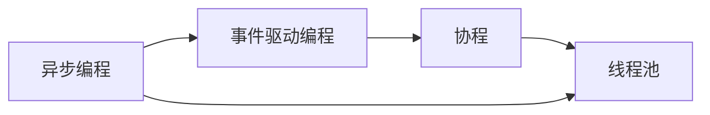

                 

## 1. 背景介绍

异步处理（Asynchronous Processing）技术在现代软件开发中扮演着重要角色。随着计算资源和网络带宽的快速增长，现代应用系统需要处理的任务量和数据量大幅增加。无论是前端Web应用、后端服务系统，还是中间件系统，异步处理技术都能帮助提升系统的性能和可用性。但同时，异步处理技术也带来了新的挑战，比如事件处理、并发控制、内存管理等复杂问题。本文将系统地介绍异步处理技术的核心概念、最佳实践和应用场景，帮助开发者高效地实现异步处理系统。

## 2. 核心概念与联系

### 2.1 核心概念概述

异步处理技术主要关注如何高效地管理任务执行，同时利用现代硬件资源（如多核CPU、多线程、多进程、多服务器等）来提高系统的吞吐量和响应速度。以下是几个关键概念：

- **异步编程**：一种编程范式，通过非阻塞式I/O操作、回调函数、事件循环等方式，使程序能在等待I/O操作完成时，同时执行其他任务，从而提高系统并发能力。
- **事件驱动编程**：基于事件循环，应用程序通过注册事件处理函数，等待事件触发后执行相应逻辑。常见框架包括Node.js的`EventEmitter`、Java的`java.util.concurrent`等。
- **线程池**：一种线程管理机制，通过预先创建线程池，复用线程来处理多个任务，减少线程创建和销毁的开销。常见实现包括Java的`ThreadPoolExecutor`、Python的`concurrent.futures`等。
- **协程**：一种轻量级线程，通过线程切换机制，实现高效的异步编程。协程相对于线程具有更低的开销和更高的性能。常见库包括Python的`asyncio`、JavaScript的`Generator`等。

### 2.2 核心概念间的关系

异步处理技术的核心概念彼此之间关系紧密，形成一个相互依赖的技术生态系统。异步编程、事件驱动编程和协程技术，都是异步处理的重要组成部分。线程池则是一种异步处理的优化机制，通过线程复用和管理，提高系统的并发性能。

我们可以用以下Mermaid流程图来展示异步处理技术的核心概念关系：



这个流程图展示了异步处理技术从编程范式、编程模型到线程管理机制的演进过程，揭示了不同概念间的依赖关系。

## 3. 核心算法原理 & 具体操作步骤

### 3.1 算法原理概述

异步处理的核心思想是通过非阻塞式I/O操作和回调函数，使得程序在等待I/O操作时，能够继续执行其他任务。其基本算法流程如下：

1. **任务注册**：将任务注册到事件队列中，等待事件触发。
2. **事件触发**：当I/O操作完成后，触发事件，执行注册的任务。
3. **任务执行**：执行任务逻辑，处理完成后继续注册新任务，等待下一次触发。

### 3.2 算法步骤详解

以下是一个基于异步编程的伪代码示例，展示如何实现异步任务处理：

```python
import asyncio

async def task1():
    print("Task 1 start")
    await asyncio.sleep(1)
    print("Task 1 end")

async def task2():
    print("Task 2 start")
    await asyncio.sleep(2)
    print("Task 2 end")

async def main():
    print("Main start")
    await asyncio.gather(task1(), task2())
    print("Main end")

if __name__ == "__main__":
    asyncio.run(main())
```

**步骤详解**：

- **任务注册**：通过`asyncio.gather`函数，将`task1`和`task2`任务同时注册到事件队列中。
- **事件触发**：当`task1`和`task2`任务执行完成后，事件触发，执行回调函数。
- **任务执行**：在`task1`和`task2`的任务执行期间，主线程可以继续执行其他任务，如`main`函数中的其他代码。

### 3.3 算法优缺点

异步处理技术具有以下优点：

- **高并发**：通过非阻塞式I/O操作和事件触发，最大化利用现代硬件资源，提高系统并发能力。
- **响应迅速**：等待I/O操作时，程序可以继续执行其他任务，提高系统的响应速度。
- **代码简洁**：通过回调函数和异步编程范式，减少代码复杂度，提高代码可读性。

同时，异步处理技术也存在一些缺点：

- **复杂度高**：异步处理需要设计复杂的事件触发和回调函数，增加了代码的复杂度。
- **资源消耗大**：协程、事件循环等机制的引入，带来了额外的资源消耗。
- **调试困难**：异步编程的执行流程非线性，调试起来较为复杂。

### 3.4 算法应用领域

异步处理技术广泛应用于以下领域：

- **Web应用**：如Node.js、Golang等语言，通过异步编程和事件驱动编程，实现高性能的Web应用。
- **服务系统**：如Dubbo、Thrift等中间件，通过异步处理技术，提升服务系统的吞吐量和响应速度。
- **数据处理**：如Spark、Hadoop等大数据处理系统，通过异步处理技术，处理海量数据，提高数据处理效率。
- **实时通信**：如WebSocket、IM系统，通过异步处理技术，实现高效的数据传输和即时通信。

## 4. 数学模型和公式 & 详细讲解 & 举例说明

### 4.1 数学模型构建

异步处理技术的核心是事件驱动和回调函数的调度机制。假设有N个任务需要异步处理，每个任务处理时间为Ti（i=1,2,...,N），事件处理时间为T（T为常量）。

定义一个事件处理队列Q，队列长度为L，当队列长度L＜N时，新任务进入队列，等待触发；当队列长度L≥N时，新任务直接触发。

设任务i的执行时间为Ti，队列长度为L（i=1,2,...,N），事件处理时间为T。总执行时间为T_total，定义为所有任务执行时间之和加上事件处理时间：

$$
T_{total} = \sum_{i=1}^N T_i + L \times T
$$

### 4.2 公式推导过程

为了简化问题，我们假设每个任务处理时间为相同的常量T，队列长度L也固定。设任务i的执行时间为Ti，队列长度为L（i=1,2,...,N）。

设事件处理时间为T，通过简单的数学推导，可以得到总执行时间T_total为：

$$
T_{total} = N \times T + (N - 1) \times T = (2N - 1) \times T
$$

### 4.3 案例分析与讲解

以Web应用中的HTTP请求处理为例，展示异步处理技术的优势。

- **传统同步处理**：每个请求都需要等待前一个请求完成，系统吞吐量受限于请求处理时间。
- **异步处理**：多个请求可以并发处理，系统吞吐量主要受限于I/O操作速度。

下面是一个简单的示例，展示HTTP请求处理过程：

```python
import time
import asyncio
import aiohttp

async def send_request(url):
    async with aiohttp.ClientSession() as session:
        async with session.get(url) as response:
            return await response.text()

async def main():
    urls = ["http://example.com/", "http://example.com/2", "http://example.com/3"]
    tasks = [send_request(url) for url in urls]
    results = await asyncio.gather(*tasks)
    print(results)

if __name__ == "__main__":
    asyncio.run(main())
```

在实际应用中，异步处理技术能够有效提升Web应用的处理速度和并发能力，适用于处理大量并发请求和高并发场景。

## 5. 项目实践：代码实例和详细解释说明

### 5.1 开发环境搭建

异步处理技术的实践需要选择合适的开发环境。以下是基于Python和Node.js的异步编程环境搭建流程：

#### 5.1.1 Python环境

1. 安装Python：从官网下载并安装Python，建议使用3.8及以上版本。
2. 安装`asyncio`库：通过pip命令进行安装。
3. 安装`aiohttp`库：通过pip命令进行安装。
4. 编写异步代码：使用Python的异步编程语法，编写异步任务处理代码。

#### 5.1.2 Node.js环境

1. 安装Node.js：从官网下载并安装Node.js。
2. 安装`Promise`库：通过npm命令进行安装。
3. 编写异步代码：使用Node.js的事件驱动编程和回调函数，编写异步任务处理代码。

### 5.2 源代码详细实现

以下是使用Python的`asyncio`和Node.js的事件驱动编程实现的异步任务处理示例代码：

#### Python示例代码

```python
import asyncio

async def task1():
    print("Task 1 start")
    await asyncio.sleep(1)
    print("Task 1 end")

async def task2():
    print("Task 2 start")
    await asyncio.sleep(2)
    print("Task 2 end")

async def main():
    print("Main start")
    await asyncio.gather(task1(), task2())
    print("Main end")

if __name__ == "__main__":
    asyncio.run(main())
```

#### Node.js示例代码

```javascript
const { promisify } = require('util');
const fs = require('fs');
const readFile = promisify(fs.readFile);

async function task1() {
    console.log('Task 1 start');
    await readFile('/etc/hosts', 'utf-8');
    console.log('Task 1 end');
}

async function task2() {
    console.log('Task 2 start');
    await readFile('/etc/passwd', 'utf-8');
    console.log('Task 2 end');
}

async function main() {
    console.log('Main start');
    await Promise.all([task1(), task2()]);
    console.log('Main end');
}

main().catch(console.error);
```

### 5.3 代码解读与分析

异步任务处理的核心在于事件驱动和回调函数的调度机制。通过注册任务到事件队列，等待事件触发后执行相应逻辑，可以实现高效的异步处理。

在Python示例代码中，`asyncio.gather`函数用于同时执行多个异步任务，`await`关键字用于等待异步任务的完成。在Node.js示例代码中，`Promise.all`函数用于同时执行多个异步任务，`await`关键字用于等待异步任务的完成。

### 5.4 运行结果展示

以下是Python示例代码的运行结果：

```
Main start
Task 1 start
Task 2 start
Task 1 end
Task 2 end
Main end
```

可以看出，异步处理技术能够同时执行多个任务，提高了系统的响应速度和并发能力。

## 6. 实际应用场景

### 6.1 高性能Web应用

异步处理技术广泛应用于高性能Web应用中，如Node.js、Golang等语言，通过异步编程和事件驱动编程，实现高性能的Web应用。异步处理技术能够处理大量并发请求，提升系统的响应速度和吞吐量。

### 6.2 高并发服务系统

异步处理技术也广泛应用于高并发服务系统中，如Dubbo、Thrift等中间件，通过异步处理技术，提升服务系统的吞吐量和响应速度。异步处理技术能够处理大量并发请求，提升系统的性能和稳定性。

### 6.3 大数据处理系统

异步处理技术在数据处理领域也有广泛应用，如Spark、Hadoop等大数据处理系统，通过异步处理技术，处理海量数据，提高数据处理效率。异步处理技术能够并行处理多批次数据，提升系统的性能和扩展性。

### 6.4 实时通信系统

异步处理技术在实时通信领域也有重要应用，如WebSocket、IM系统，通过异步处理技术，实现高效的数据传输和即时通信。异步处理技术能够处理大量并发连接，提升系统的性能和用户体验。

## 7. 工具和资源推荐

### 7.1 学习资源推荐

为了帮助开发者系统掌握异步处理技术的理论基础和实践技巧，这里推荐一些优质的学习资源：

1.《JavaScript异步编程》系列博文：由大前端技术专家撰写，深入浅出地介绍了JavaScript异步编程的原理和最佳实践。
2.《Python异步编程》书籍：介绍Python的异步编程技术，包括`asyncio`库的使用和异步编程范式。
3.《Node.js实战》课程：由知名JavaScript专家开设的Node.js实战课程，系统讲解Node.js的异步编程和事件驱动编程。
4.《Promise实战》书籍：介绍Promise的技术原理和应用场景，帮助开发者深入理解异步编程的核心机制。
5.《Promise Cookbook》博客：提供大量实用的Promise使用示例和技巧，帮助开发者高效处理异步编程任务。

通过对这些资源的学习实践，相信你一定能够快速掌握异步处理技术的精髓，并用于解决实际的编程问题。

### 7.2 开发工具推荐

高效的开发离不开优秀的工具支持。以下是几款用于异步处理开发的常用工具：

1. Python：Python是异步处理技术的最佳选择，其内置的`asyncio`库支持高效的异步编程，适用于大规模异步任务处理。
2. Node.js：Node.js的异步编程和事件驱动编程，使其成为高性能Web应用的首选语言。
3. aiohttp：Python的异步HTTP客户端库，支持高并发HTTP请求处理，适用于异步Web应用开发。
4. Promises：JavaScript中的异步编程模型，支持链式调用和并行处理，适用于异步任务调度。
5. TencentPromise：腾讯开源的Promise库，提供了丰富的异步编程API和工具，适用于异步任务处理。

合理利用这些工具，可以显著提升异步处理任务的开发效率，加快创新迭代的步伐。

### 7.3 相关论文推荐

异步处理技术的研究始于计算机科学领域，以下是几篇奠基性的相关论文，推荐阅读：

1.《异步编程的实现与设计》：探讨异步编程的实现机制和设计原理，为异步处理技术提供理论基础。
2.《JavaScript异步编程规范》：介绍JavaScript异步编程的最佳实践，涵盖Promise、async/await等技术。
3.《多线程并发编程》：介绍多线程编程的实现机制和最佳实践，为异步处理技术提供设计思路。
4.《分布式系统中的异步编程》：探讨分布式系统中的异步编程机制和调度策略，为异步处理技术提供实际应用指导。
5.《异步编程的挑战与解决》：分析异步编程的挑战和解决方案，为异步处理技术提供深入思考。

这些论文代表了大前端开发中异步处理技术的最新进展，帮助开发者理解异步编程的核心机制和最佳实践。

## 8. 总结：未来发展趋势与挑战

### 8.1 总结

本文对异步处理技术的核心概念、最佳实践和应用场景进行了全面系统的介绍。首先阐述了异步处理技术的背景和意义，明确了异步处理技术在现代软件开发中的重要价值。其次，从原理到实践，详细讲解了异步处理的数学模型、算法步骤和具体实现，给出了异步任务处理的完整代码示例。同时，本文还广泛探讨了异步处理技术在Web应用、服务系统、大数据处理和实时通信等领域的应用前景，展示了异步处理技术的强大能力。

通过本文的系统梳理，可以看到，异步处理技术已经成为现代软件开发的重要范式，极大地提升了系统的并发能力、响应速度和性能。未来，伴随异步处理技术的持续演进，相信异步处理系统将在更多领域得到应用，为开发者提供高效、可靠的技术支持。

### 8.2 未来发展趋势

展望未来，异步处理技术将呈现以下几个发展趋势：

1. **更高效的事件调度**：未来的异步处理系统将引入更多高效的事件调度算法，减少事件处理延迟，提升系统响应速度。
2. **更灵活的协程机制**：协程技术将更加普及，为异步编程提供更灵活、更高效的实现方式。
3. **更完善的并发控制**：异步处理技术将引入更多并发控制机制，如信号量、读写锁等，提高系统的并发性能。
4. **更优化的资源管理**：异步处理技术将优化资源管理机制，减少资源消耗，提升系统的性能和扩展性。
5. **更智能的任务调度**：异步处理系统将引入更智能的任务调度算法，根据任务优先级和资源情况，动态调整任务执行顺序，提升系统效率。

以上趋势凸显了异步处理技术的广阔前景。这些方向的探索发展，必将进一步提升异步处理系统的性能和稳定性，为构建高性能、高并发、高可靠的系统奠定坚实基础。

### 8.3 面临的挑战

尽管异步处理技术已经取得了瞩目成就，但在迈向更加智能化、普适化应用的过程中，它仍面临着诸多挑战：

1. **复杂性管理**：异步处理系统涉及大量并发控制、任务调度等复杂问题，开发和维护难度较大。
2. **性能调优**：异步处理系统需要优化资源管理和任务调度，避免资源竞争和阻塞问题，提升性能。
3. **安全性保障**：异步处理系统需要考虑线程安全、并发控制等安全问题，避免数据竞争和死锁问题。
4. **可扩展性**：异步处理系统需要考虑系统的可扩展性，支持水平扩展和垂直扩展，提升系统的应对能力。
5. **资源消耗**：异步处理系统需要优化资源管理，减少资源消耗，避免不必要的资源浪费。

### 8.4 研究展望

面对异步处理技术所面临的种种挑战，未来的研究需要在以下几个方面寻求新的突破：

1. **分布式异步编程**：引入分布式计算和异步编程结合，提升异步处理系统的可扩展性和容错性。
2. **智能任务调度**：引入AI和机器学习技术，实现任务调度算法的智能化，优化任务执行顺序。
3. **资源优化**：优化异步处理系统的资源管理机制，提高系统性能和扩展性。
4. **并发控制**：引入更高效的并发控制机制，减少资源竞争和死锁问题，提升系统稳定性。
5. **安全性保障**：引入更严格的安全性保障机制，避免数据竞争和死锁问题，确保系统安全性。

这些研究方向将推动异步处理技术向更高层次发展，为构建高性能、高并发、高可靠的系统提供坚实技术支撑。总之，异步处理技术需要在性能、可扩展性、安全性等方面不断优化，才能满足现代系统的高要求，为构建智能化、普适化应用提供可靠的技术基础。

## 9. 附录：常见问题与解答

**Q1：异步编程和同步编程有什么区别？**

A: 异步编程和同步编程的主要区别在于任务的执行方式和资源管理方式。

- **同步编程**：程序按顺序执行任务，每个任务完成后才能执行下一个任务。任务之间存在阻塞关系，资源管理简单，但并发能力较低。
- **异步编程**：程序通过非阻塞式I/O操作和事件驱动，同时执行多个任务。任务之间不依赖，资源管理复杂，但并发能力较高。

**Q2：异步编程有哪些优势？**

A: 异步编程具有以下优势：

- **高并发**：通过非阻塞式I/O操作和事件驱动，最大化利用现代硬件资源，提高系统并发能力。
- **响应迅速**：等待I/O操作时，程序可以继续执行其他任务，提高系统的响应速度。
- **代码简洁**：通过回调函数和异步编程范式，减少代码复杂度，提高代码可读性。

**Q3：异步编程有哪些挑战？**

A: 异步编程面临以下挑战：

- **复杂度高**：异步编程需要设计复杂的事件触发和回调函数，增加了代码的复杂度。
- **资源消耗大**：协程、事件循环等机制的引入，带来了额外的资源消耗。
- **调试困难**：异步编程的执行流程非线性，调试起来较为复杂。

**Q4：异步处理技术有哪些应用场景？**

A: 异步处理技术广泛应用于以下领域：

- **Web应用**：如Node.js、Golang等语言，通过异步编程和事件驱动编程，实现高性能的Web应用。
- **服务系统**：如Dubbo、Thrift等中间件，通过异步处理技术，提升服务系统的吞吐量和响应速度。
- **数据处理**：如Spark、Hadoop等大数据处理系统，通过异步处理技术，处理海量数据，提高数据处理效率。
- **实时通信**：如WebSocket、IM系统，通过异步处理技术，实现高效的数据传输和即时通信。

**Q5：如何优化异步处理系统的性能？**

A: 异步处理系统的性能优化可以从以下几个方面入手：

- **优化任务调度**：引入更高效的并发控制和任务调度算法，减少资源竞争和阻塞问题。
- **优化资源管理**：优化资源管理机制，减少资源消耗，提升系统性能和扩展性。
- **优化事件处理**：优化事件处理机制，减少事件处理延迟，提升系统响应速度。
- **优化算法设计**：优化异步算法的实现方式，提高系统并发能力和执行效率。
- **优化硬件资源**：优化硬件资源的利用率，最大化利用多核CPU、多线程等硬件资源。

通过以上优化措施，可以显著提升异步处理系统的性能和扩展性，满足实际应用的需求。

---

作者：禅与计算机程序设计艺术 / Zen and the Art of Computer Programming

