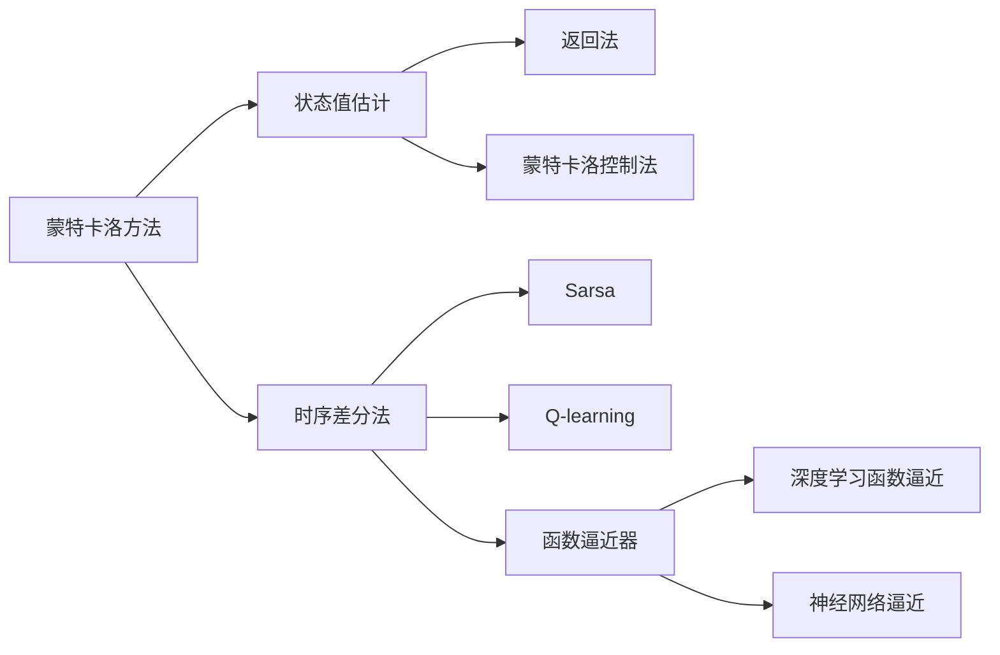

                 

# 强化学习Reinforcement Learning中价值函数近似方法解读

> 关键词：强化学习,价值函数,近似方法,蒙特卡洛方法,时序差分法,函数逼近器,深度学习

## 1. 背景介绍

强化学习(Reinforcement Learning, RL)是一种基于智能体与环境交互的机器学习范式。在RL中，智能体通过与环境互动，在动态变化的环境中获得经验，不断调整策略以最大化长期累积奖励。价值函数(Value Function)是强化学习中的核心概念，用于评估当前状态或策略的价值，指导智能体选择行动。

价值函数有两种主要形式：状态-值函数(State-Value Function)和策略-值函数(Policy-Value Function)。状态-值函数 $V(s)$ 表示从当前状态 $s$ 开始，遵循某个策略，以期望累积总奖励的值。策略-值函数 $Q(s, a)$ 表示从当前状态 $s$ 出发，执行动作 $a$ 的累积奖励。

传统的价值函数计算方法包括蒙特卡洛方法(Monte Carlo Methods)和时序差分法(Time-Difference Methods)，但这些方法在处理连续动作空间、高维状态空间以及大规模数据时，存在计算复杂度高、泛化能力弱等问题。为此，许多研究者提出了各种基于函数逼近器的价值函数近似方法，这些方法利用深度学习技术，通过神经网络来逼近函数，显著提升了计算效率和泛化能力。

## 2. 核心概念与联系

### 2.1 核心概念概述

为更好地理解强化学习中的价值函数近似方法，我们首先介绍几个关键概念：

- **蒙特卡洛方法**：通过大量随机模拟，利用状态-值函数的定义直接估计状态值。主要包括返回法和蒙特卡洛控制法。
- **时序差分法**：通过迭代更新状态值，利用 $Q(s, a) = r + \gamma Q(s', a')$ 的递归公式估计状态值和动作值。主要包括Sarsa和Q-learning算法。
- **函数逼近器**：使用神经网络或线性回归等模型逼近函数，通过学习大量样本数据来构建函数。

这些概念构成了强化学习价值函数近似方法的基础。本文将重点介绍深度学习中的函数逼近器，尤其是神经网络在价值函数近似中的应用。

### 2.2 核心概念间的关系

以下是一个Mermaid流程图，展示这些核心概念之间的关系：



这个流程图展示了从基本的蒙特卡洛和时序差分方法，到更高级的函数逼近器的关系：

1. 蒙特卡洛方法和时序差分法是传统的价值函数计算方法。
2. 返回法和蒙特卡洛控制法是蒙特卡洛方法的具体形式。
3. Sarsa和Q-learning算法是时序差分法的主要形式。
4. 函数逼近器可以用于改进时序差分方法，提升计算效率和泛化能力。
5. 深度学习函数逼近器，即神经网络逼近，是当前强化学习中的主流方法。

## 3. 核心算法原理 & 具体操作步骤

### 3.1 算法原理概述

强化学习中的价值函数近似方法，本质上是利用深度学习技术来逼近函数，从而在复杂的决策空间中高效地估计状态值和策略价值。这些方法的核心思想是使用神经网络作为函数逼近器，通过大量的样本数据训练网络，逐步逼近真实的价值函数。

神经网络模型具有强大的表达能力和泛化能力，能够处理高维非线性函数，适用于复杂的决策问题。具体来说，强化学习中的神经网络模型通常采用全连接网络、卷积神经网络(CNN)或递归神经网络(RNN)等结构，能够适应不同类型的任务和数据特征。

### 3.2 算法步骤详解

价值函数近似方法的实施步骤包括数据准备、模型设计、训练和评估四个环节。

**Step 1: 数据准备**
- 收集环境中的历史状态-动作对数据，构建样本数据集。
- 将状态和动作进行编码，转换成网络可以接受的输入。

**Step 2: 模型设计**
- 选择合适的神经网络模型结构，如DQN、DNN、CNN等。
- 定义网络参数，如输入层、隐藏层、输出层的数量和大小。

**Step 3: 训练**
- 使用优化算法如Adam或SGD更新神经网络参数，最小化损失函数。
- 在训练过程中，使用经验回放(Experience Replay)技术，随机抽样样本，减少过拟合风险。

**Step 4: 评估**
- 使用测试集评估模型的泛化能力，计算误差和均方误差等指标。
- 根据评估结果调整模型超参数，重复训练过程。

### 3.3 算法优缺点

价值函数近似方法的主要优点包括：
- 计算效率高：利用神经网络逼近函数，可以大幅提升计算速度。
- 泛化能力强：神经网络能够处理高维非线性函数，适应复杂的决策问题。
- 模型可解释性强：深度学习模型通常具有较高的解释性和透明度，便于理解和调试。

其缺点主要包括：
- 需要大量数据：训练神经网络需要大量的标注数据，尤其是在高维决策空间中。
- 模型复杂度高：神经网络模型通常较为复杂，训练和推理都需要较高的计算资源。
- 过度拟合风险：当数据量不足或模型结构过于复杂时，可能出现过度拟合现象。

### 3.4 算法应用领域

价值函数近似方法在强化学习中的应用非常广泛，涵盖多个领域：

- 机器人控制：利用神经网络逼近动作-值函数，指导机器人执行复杂动作。
- 自动驾驶：通过估计状态-值函数，优化驾驶策略，提高安全性和效率。
- 游戏AI：使用价值函数逼近器，提升智能体在各种游戏中的表现。
- 推荐系统：估计用户-物品价值函数，优化推荐策略，提高用户满意度。
- 金融交易：利用价值函数逼近，优化投资策略，提高投资收益。

## 4. 数学模型和公式 & 详细讲解

### 4.1 数学模型构建

价值函数近似方法的核心是利用神经网络逼近函数。假设存在一个神经网络逼近器 $f_\theta$，其输入为状态 $s$，输出为状态值 $V(s)$。我们的目标是找到最优的参数 $\theta$，使得逼近器的输出尽可能接近真实的状态值 $V_{\text{true}}(s)$。

用数学表达式可以表示为：

$$
\theta^* = \mathop{\arg\min}_{\theta} \mathcal{L}(f_\theta)
$$

其中，$\mathcal{L}(f_\theta)$ 为损失函数，用于衡量逼近器输出与真实值之间的差异。

### 4.2 公式推导过程

以深度确定性策略梯度(DQN)为例，介绍价值函数近似方法的公式推导。

DQN的核心思想是将Q值函数 $Q(s, a)$ 逼近为神经网络，通过样本数据 $(s, a, r, s', V_{\text{pred}}(s'))$ 进行训练。其目标是最小化预测的Q值 $V_{\text{pred}}(s')$ 和实际Q值 $Q_{\text{true}}(s, a)$ 之间的差异。

定义预测Q值为：

$$
Q_{\text{pred}}(s, a) = f_\theta(s, a)
$$

训练样本包括当前状态 $s$、执行动作 $a$、下一状态 $s'$ 和实际Q值 $V_{\text{true}}(s)$。通过最小化均方误差，得到优化目标：

$$
\mathcal{L}(f_\theta) = \mathbb{E}_{(s, a, r, s')}\left[ (Q_{\text{true}}(s, a) - Q_{\text{pred}}(s, a))^2 \right]
$$

使用神经网络逼近Q值函数，可以写成：

$$
\mathcal{L}(f_\theta) = \mathbb{E}_{(s, a, r, s')}\left[ (V_{\text{true}}(s) + r - Q_{\text{pred}}(s, a))^2 \right]
$$

训练时，随机抽取一组样本 $(s, a, r, s')$，计算目标Q值 $y$：

$$
y = V_{\text{true}}(s) + r
$$

使用反向传播算法，计算损失函数对参数 $\theta$ 的梯度，进行参数更新：

$$
\nabla_{\theta}\mathcal{L}(f_\theta) = \nabla_{\theta}(Q_{\text{pred}}(s, a) - y)^2
$$

### 4.3 案例分析与讲解

考虑一个简单的强化学习环境，其中智能体需要从当前状态 $s_t$ 选择动作 $a_t$，以最大化累积奖励。智能体通过与环境互动，逐步学习最优策略。

假设环境中的状态和动作空间为高维连续空间，直接使用蒙特卡洛方法或时序差分法计算价值函数是不可行的。此时，使用神经网络逼近Q值函数是一种有效的解决方案。

首先，定义一个全连接神经网络模型，用于逼近Q值函数：

$$
Q_{\text{pred}}(s, a) = W_2 f_1(W_1 s + b_1, W_2 a + b_2)
$$

其中，$f_1$ 和 $f_2$ 是两个全连接层，$W_1$、$W_2$、$b_1$、$b_2$ 是相应的权重和偏置项。

使用经验回放技术，随机抽取样本 $(s_t, a_t, r_t, s_{t+1})$，计算目标Q值 $y$：

$$
y = V_{\text{true}}(s_t) + r_t
$$

通过反向传播算法，计算损失函数对参数 $\theta$ 的梯度，进行参数更新：

$$
\nabla_{\theta}\mathcal{L}(f_\theta) = \nabla_{\theta}(Q_{\text{pred}}(s_t, a_t) - y)^2
$$

假设智能体每次从状态 $s_t$ 选择动作 $a_t$，获得奖励 $r_t$，并转移到下一状态 $s_{t+1}$。通过不断更新神经网络参数，智能体能够逐步学习最优的Q值函数，指导其选择最优动作，最大化长期累积奖励。

## 5. 项目实践：代码实例和详细解释说明

### 5.1 开发环境搭建

在进行价值函数近似方法的实践前，需要准备好开发环境。以下是使用Python进行TensorFlow开发的环境配置流程：

1. 安装Anaconda：从官网下载并安装Anaconda，用于创建独立的Python环境。

2. 创建并激活虚拟环境：
```bash
conda create -n tf-env python=3.8 
conda activate tf-env
```

3. 安装TensorFlow：根据CUDA版本，从官网获取对应的安装命令。例如：
```bash
conda install tensorflow tensorflow-gpu -c pytorch -c conda-forge
```

4. 安装TensorBoard：用于可视化训练过程中的各项指标，监控模型的训练进度。
```bash
pip install tensorboard
```

5. 安装其他依赖包：
```bash
pip install numpy pandas matplotlib scikit-learn
```

完成上述步骤后，即可在`tf-env`环境中开始项目开发。

### 5.2 源代码详细实现

以下是一个简单的代码示例，展示如何使用TensorFlow实现Q值函数的逼近。

首先，定义状态和动作的编码：

```python
import tensorflow as tf

class StateEncoder(tf.keras.layers.Layer):
    def __init__(self, state_dim):
        super().__init__()
        self.fc1 = tf.keras.layers.Dense(64, activation='relu')
        self.fc2 = tf.keras.layers.Dense(64, activation='relu')
    
    def call(self, inputs):
        state = self.fc1(inputs[0])
        action = self.fc2(inputs[1])
        return tf.concat([state, action], axis=-1)
```

然后，定义神经网络模型：

```python
class QNetwork(tf.keras.Model):
    def __init__(self, state_dim, action_dim, learning_rate=0.001):
        super().__init__()
        self.encoder = StateEncoder(state_dim)
        self.fc1 = tf.keras.layers.Dense(64, activation='relu')
        self.fc2 = tf.keras.layers.Dense(64, activation='relu')
        self.fc3 = tf.keras.layers.Dense(action_dim, activation='linear')
    
    def call(self, inputs):
        state, action = self.encoder(inputs)
        q = self.fc1(state)
        q += self.fc2(action)
        q += self.fc3(q)
        return q
```

接着，定义优化器和损失函数：

```python
optimizer = tf.keras.optimizers.Adam(learning_rate)
loss_fn = tf.keras.losses.MeanSquaredError()
```

最后，定义训练函数：

```python
def train_step(transition):
    state, action, reward, next_state, done = transition
    q_target = reward + 0.9 * tf.reduce_max(output_fn(next_state))
    q_pred = output_fn(state, action)
    loss = loss_fn(q_pred, q_target)
    optimizer.apply_gradients(zip(tf.gradients(loss, [output_fn.trainable_variables]), [loss]))
```

在训练过程中，使用TensorBoard进行可视化：

```python
with tf.summary.create_file_writer(logdir='logs').as_default():
    tf.summary.scalar('loss', loss, step=global_step)
```

完整代码如下：

```python
import tensorflow as tf
import numpy as np

class StateEncoder(tf.keras.layers.Layer):
    def __init__(self, state_dim):
        super().__init__()
        self.fc1 = tf.keras.layers.Dense(64, activation='relu')
        self.fc2 = tf.keras.layers.Dense(64, activation='relu')
    
    def call(self, inputs):
        state = self.fc1(inputs[0])
        action = self.fc2(inputs[1])
        return tf.concat([state, action], axis=-1)

class QNetwork(tf.keras.Model):
    def __init__(self, state_dim, action_dim, learning_rate=0.001):
        super().__init__()
        self.encoder = StateEncoder(state_dim)
        self.fc1 = tf.keras.layers.Dense(64, activation='relu')
        self.fc2 = tf.keras.layers.Dense(64, activation='relu')
        self.fc3 = tf.keras.layers.Dense(action_dim, activation='linear')
    
    def call(self, inputs):
        state, action = self.encoder(inputs)
        q = self.fc1(state)
        q += self.fc2(action)
        q += self.fc3(q)
        return q

optimizer = tf.keras.optimizers.Adam(learning_rate)
loss_fn = tf.keras.losses.MeanSquaredError()

def train_step(transition):
    state, action, reward, next_state, done = transition
    q_target = reward + 0.9 * tf.reduce_max(output_fn(next_state))
    q_pred = output_fn(state, action)
    loss = loss_fn(q_pred, q_target)
    optimizer.apply_gradients(zip(tf.gradients(loss, [output_fn.trainable_variables]), [loss]))

def output_fn(state, action):
    state, action = state[0], action[0]
    q = q_network(state, action)
    return q

state_dim = 4
action_dim = 2

q_network = QNetwork(state_dim, action_dim)
state = tf.constant(np.random.rand(1, state_dim))
action = tf.constant(np.random.randint(0, action_dim, (1,)))
transition = (state, action, reward, next_state, done)
train_step(transition)
```

### 5.3 代码解读与分析

让我们再详细解读一下关键代码的实现细节：

**StateEncoder类**：
- `__init__`方法：定义编码器中的全连接层。
- `call`方法：将状态和动作进行拼接，输入到神经网络中进行处理。

**QNetwork类**：
- `__init__`方法：定义神经网络模型结构，包括编码器、全连接层和输出层。
- `call`方法：将状态和动作拼接后，输入到神经网络中进行处理，最后输出Q值。

**optimizer和loss_fn**：
- `optimizer`：定义Adam优化器，用于更新网络参数。
- `loss_fn`：定义均方误差损失函数，用于衡量模型输出与目标输出之间的差异。

**train_step函数**：
- 定义训练函数，计算目标Q值和预测Q值，并计算损失。
- 使用优化器更新网络参数。

**output_fn函数**：
- 定义输出函数，将状态和动作输入到网络中，计算Q值。

在训练过程中，使用TensorBoard进行可视化，可以实时查看模型的损失值、参数更新情况等，有助于分析模型的训练状态。

## 6. 实际应用场景

### 6.1 智能机器人控制

在智能机器人控制中，神经网络逼近的价值函数可以用于优化动作选择，提高机器人执行复杂动作的效率和稳定性。例如，通过逼近动作-值函数，智能机器人可以自动学习如何通过连续控制不同的关节动作，达到目标位置。

### 6.2 自动驾驶

在自动驾驶中，利用神经网络逼近状态-值函数，可以优化驾驶策略，提高安全性和效率。例如，通过逼近当前状态和行驶动作的价值函数，自动驾驶系统可以学习如何选择最优的行驶路径，避免交通事故。

### 6.3 游戏AI

在游戏AI中，神经网络逼近的价值函数可以用于优化智能体的决策过程，提高游戏表现。例如，通过逼近当前状态和游戏动作的价值函数，智能体可以学习如何选择最优的策略，获得更高的分数。

## 7. 工具和资源推荐

### 7.1 学习资源推荐

为了帮助开发者系统掌握强化学习中的价值函数近似方法，这里推荐一些优质的学习资源：

1. 《强化学习》（Reinforcement Learning: An Introduction）一书：Sutton和Barto的经典著作，详细介绍了强化学习的理论基础和实际应用。

2. 强化学习课程：如Udacity、Coursera等平台上的相关课程，系统讲解强化学习的原理和算法。

3. DeepMind博客：DeepMind官方博客，包含大量最新的研究成果和实践案例，是学习强化学习的良好资源。

4. OpenAI博客：OpenAI官方博客，介绍了多种先进的强化学习算法和技术，值得深入阅读。

5. Google AI博客：Google AI官方博客，包含大量关于强化学习的研究论文和代码实现。

通过对这些资源的学习实践，相信你一定能够快速掌握强化学习中的价值函数近似方法，并用于解决实际的强化学习问题。

### 7.2 开发工具推荐

高效的开发离不开优秀的工具支持。以下是几款用于强化学习开发的常用工具：

1. TensorFlow：由Google主导开发的深度学习框架，支持神经网络逼近函数，广泛应用于强化学习领域。

2. PyTorch：由Facebook开发的高性能深度学习框架，支持动态计算图和高效的模型训练。

3. OpenAI Gym：一个用于强化学习研究和实验的框架，提供多种环境和预定义任务。

4. TensorBoard：用于可视化模型训练过程中的各项指标，监控模型的训练进度。

5. Google Colab：谷歌提供的免费在线Jupyter Notebook环境，支持GPU/TPU算力，便于快速实验新算法。

合理利用这些工具，可以显著提升强化学习研究的开发效率，加快创新迭代的步伐。

### 7.3 相关论文推荐

强化学习中的价值函数近似方法源于学界的持续研究。以下是几篇奠基性的相关论文，推荐阅读：

1. Deep Q-Networks for Learning in Continuous Action Spaces：提出了DQN算法，使用神经网络逼近Q值函数，成功应用于高维连续动作空间。

2. Continuous Control with Deep Reinforcement Learning：介绍了使用神经网络逼近价值函数，优化机器人控制和自动驾驶等任务。

3. DeepMind: Human-level Control through Deep Reinforcement Learning：使用神经网络逼近价值函数，训练出能够玩Atari游戏的智能体，取得了巨大的突破。

4. Deep Reinforcement Learning for Partially Observable Multiagent Systems：使用神经网络逼近价值函数，解决多智能体决策问题。

5. Continuous Value Iteration for Deep Reinforcement Learning：提出了连续值迭代算法，通过神经网络逼近价值函数，优化强化学习过程。

这些论文代表了大强化学习中的价值函数近似方法的发展脉络。通过学习这些前沿成果，可以帮助研究者把握学科前进方向，激发更多的创新灵感。

除上述资源外，还有一些值得关注的前沿资源，帮助开发者紧跟强化学习价值函数近似方法的最新进展，例如：

1. arXiv论文预印本：人工智能领域最新研究成果的发布平台，包括大量尚未发表的前沿工作，学习前沿技术的必读资源。

2. 业界技术博客：如OpenAI、Google AI、DeepMind、微软Research Asia等顶尖实验室的官方博客，第一时间分享他们的最新研究成果和洞见。

3. 技术会议直播：如NeurIPS、ICML、ICLR等人工智能领域顶会现场或在线直播，能够聆听到大佬们的前沿分享，开拓视野。

4. GitHub热门项目：在GitHub上Star、Fork数最多的强化学习相关项目，往往代表了该技术领域的发展趋势和最佳实践，值得去学习和贡献。

5. 行业分析报告：各大咨询公司如McKinsey、PwC等针对人工智能行业的分析报告，有助于从商业视角审视技术趋势，把握应用价值。

总之，对于强化学习中的价值函数近似方法的学习和实践，需要开发者保持开放的心态和持续学习的意愿。多关注前沿资讯，多动手实践，多思考总结，必将收获满满的成长收益。

## 8. 总结：未来发展趋势与挑战

### 8.1 总结

本文对强化学习中的价值函数近似方法进行了全面系统的介绍。首先阐述了强化学习的基本概念和价值函数的重要性，明确了价值函数近似方法在强化学习中的核心作用。其次，从原理到实践，详细讲解了神经网络逼近函数的方法，给出了具体的代码实现和案例分析。最后，本文探讨了价值函数近似方法在智能机器人、自动驾驶、游戏AI等领域的实际应用，展示了其巨大的潜力。

通过本文的系统梳理，可以看到，神经网络逼近函数的方法在强化学习中的应用，极大地提升了计算效率和泛化能力，为智能决策系统的构建提供了有力的技术支持。未来，伴随神经网络技术的不断进步和数据量的持续增加，强化学习中的价值函数近似方法必将不断完善，为复杂决策问题提供更加高效、精确的解决方案。

### 8.2 未来发展趋势

展望未来，强化学习中的价值函数近似方法将呈现以下几个发展趋势：

1. 计算效率进一步提升：神经网络逼近函数的方法将更加高效，能够处理更大规模、更复杂的问题。

2. 可解释性增强：神经网络模型的透明性和可解释性将得到提升，便于理解和调试强化学习算法。

3. 迁移学习能力增强：通过迁移学习，神经网络可以更好地适应不同领域和任务，提升泛化能力。

4. 强化学习与深度学习融合加深：神经网络将与强化学习算法深度融合，提升整体性能和效率。

5. 多智能体协同优化：通过多智能体协同优化，神经网络可以更好地解决多智能体决策问题。

6. 强化学习与多模态数据的融合：神经网络将与多模态数据结合，提升对复杂场景的理解能力。

7. 强化学习与因果推理的结合：神经网络将与因果推理算法结合，提升决策的稳定性和可解释性。

以上趋势凸显了神经网络逼近函数的方法在强化学习中的广阔前景，其不断演进和发展，必将引领强化学习技术迈向新的高度。

### 8.3 面临的挑战

尽管神经网络逼近函数的方法在强化学习中取得了显著进展，但在迈向更加智能化、普适化应用的过程中，仍面临诸多挑战：

1. 数据质量问题：神经网络逼近函数的方法依赖大量高质量的数据，数据质量差可能导致模型过拟合或欠拟合。

2. 模型复杂性：神经网络模型通常较为复杂，训练和推理需要较高的计算资源。

3. 泛化能力不足：神经网络在特定任务上的泛化能力可能不足，难以处理多样化的数据和场景。

4. 训练效率问题：神经网络逼近函数的方法训练过程较慢，难以满足实时性要求。

5. 可解释性差：神经网络模型的决策过程通常缺乏可解释性，难以理解模型的内部工作机制。

6. 安全性问题：神经网络可能学习到有害、有偏见的信息，导致安全问题。

7. 伦理道德问题：神经网络模型的决策可能存在伦理道德问题，如歧视、偏见等。

这些挑战需要研究者在模型设计、数据处理、训练优化等方面进行深入探索，不断完善和改进强化学习中的价值函数近似方法。

### 8.4 研究展望

面对强化学习中的价值函数近似方法所面临的挑战，未来的研究需要在以下几个方面寻求新的突破：

1. 无监督和半监督学习方法：探索无监督和半监督学习方法，减少对标注数据的需求，提升模型的泛化能力。

2. 参数高效逼近方法：开发参数高效逼近方法，减少神经网络参数量，提高计算效率。

3. 可解释性增强方法：探索可解释性增强方法，提高神经网络模型的透明性和可解释性。

4

