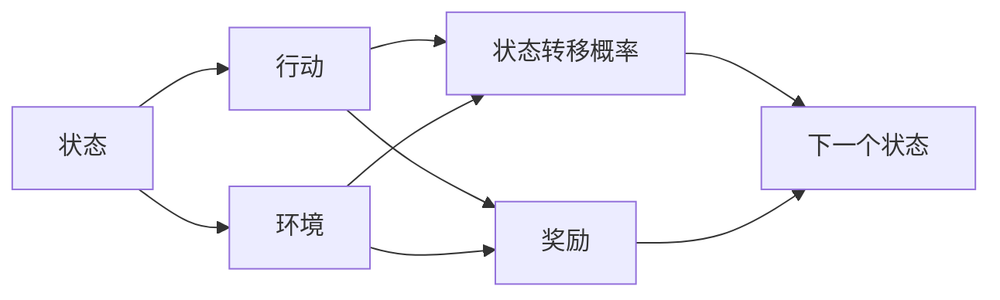

                 

## 1. 背景介绍

在强化学习（Reinforcement Learning, RL）中，信用分配问题（Credit Assignment Problem）指的是如何评估和奖励智能体（agent）在特定状态下所采取的行动的效果。这是一个典型的难题，因为智能体的行动效果通常受到多种因素的影响，包括但不限于环境状态、随机噪声和外部干扰。而如何公平地将这些因素分离，并准确地将它们归因于智能体的行动本身，直接影响到智能体的学习效果和策略优化。

## 2. 核心概念与联系

### 2.1 核心概念概述

在强化学习中，信用分配问题主要涉及以下几个核心概念：

- **状态（State）**：表示当前环境的条件和智能体的内部状态，是影响智能体行动的关键因素。
- **行动（Action）**：智能体在特定状态下所采取的操作或策略，直接影响后续状态和奖励的获得。
- **奖励（Reward）**：表示智能体采取行动后环境的反馈，用来激励智能体执行更好的策略。
- **状态转移概率（Transition Probability）**：描述环境在智能体采取行动后，从当前状态转移到下一状态的概率分布。

这些概念之间的联系和相互作用，形成了强化学习的核心框架，也正是信用分配问题所关注的核心内容。

### 2.2 概念间的关系

这些核心概念之间存在复杂的交互关系，可以用以下Mermaid流程图来展示：



这个流程图展示了状态、行动、奖励和状态转移概率之间的关系。智能体根据当前状态选择行动，从而影响状态转移和获得奖励。环境根据行动和当前状态决定状态转移和奖励。

## 3. 核心算法原理 & 具体操作步骤
### 3.1 算法原理概述

强化学习中的信用分配问题，通常通过两种基本方法来解决：

- **直接信用分配（Direct Credit Assignment）**：直接将奖励和状态转移概率归因于智能体的行动。这种方法在理论上较为简单，但在实际中难以实现，因为奖励和状态转移概率受多因素影响，难以准确归因。
- **间接信用分配（Indirect Credit Assignment）**：通过设计奖励函数和状态转移模型，间接影响智能体的学习过程，从而实现有效的信用分配。间接信用分配是当前主流的方法，包括著名的Q-learning、SARSA和Policy Gradient等。

### 3.2 算法步骤详解

以Q-learning算法为例，以下是其具体的步骤：

1. **初始化参数**：设置Q值函数、学习率和折扣因子等参数。
2. **行动选择**：根据Q值函数选择一个行动，如果是在线学习，则更新Q值函数。
3. **状态更新**：观察环境状态，并根据行动获得下一个状态。
4. **奖励计算**：计算行动的奖励。
5. **Q值更新**：根据奖励和下一个状态的值，更新Q值函数。
6. **重复迭代**：不断重复上述步骤，直到收敛。

### 3.3 算法优缺点

**Q-learning算法的优点**：
- 简单易懂，易于实现。
- 收敛性好，适用于大多数环境和行动空间。

**Q-learning算法的缺点**：
- 无法处理非马尔科夫决策过程。
- 对环境的动态变化适应性较差。
- 容易陷入局部最优。

### 3.4 算法应用领域

Q-learning算法在强化学习中有着广泛的应用，尤其是在游戏、机器人控制、自动驾驶等领域。例如，在自动驾驶中，智能体可以通过学习如何在复杂环境中做出决策，从而优化行驶路线，提高安全性和效率。

## 4. 数学模型和公式 & 详细讲解  
### 4.1 数学模型构建

在强化学习中，信用分配问题可以用以下数学模型来表示：

设智能体在状态$s$时采取行动$a$，环境转移到状态$s'$，获得奖励$r$，则Q值函数的更新公式为：

$$
Q(s, a) \leftarrow Q(s, a) + \alpha [r + \gamma \max_{a'} Q(s', a') - Q(s, a)]
$$

其中，$\alpha$为学习率，$\gamma$为折扣因子，$\max_{a'} Q(s', a')$表示在状态$s'$时所有可能行动的最大Q值。

### 4.2 公式推导过程

Q-learning算法的核心思想是通过不断调整Q值函数，使得智能体在每个状态下选择最优行动，从而最大化长期奖励。根据Bellman方程，可以得到Q值函数的更新公式。具体推导如下：

$$
Q(s, a) = \mathbb{E}[r + \gamma Q(s', a' | s, a)]
$$

其中，$\mathbb{E}$表示期望，$s'$和$a'$分别表示下一个状态和行动。

### 4.3 案例分析与讲解

以简单的抓子游戏（Pong game）为例，分析Q-learning算法的工作原理。在抓子游戏中，智能体需要学习如何控制一个小球，使其避开对手的攻击并击中得分目标。在这个游戏中，Q值函数可以通过不断迭代更新来逼近最优策略。具体步骤如下：

1. 初始化Q值函数和参数。
2. 随机选择一个行动，观察环境状态。
3. 根据行动获得奖励和下一个状态。
4. 计算下一个状态的最大Q值，并更新Q值函数。
5. 重复上述步骤，直到收敛。

## 5. 项目实践：代码实例和详细解释说明
### 5.1 开发环境搭建

在项目实践中，可以使用Python和OpenAI Gym库来搭建开发环境。具体步骤如下：

1. 安装Python和相关库。
2. 安装Gym库。
3. 下载抓子游戏环境（例如Pong-v0）。

```bash
pip install gym
python -m gym env register -f envs register-pong-v0.zip -f envs register-pybullet_env_v0.zip
```

### 5.2 源代码详细实现

以下是一个使用Q-learning算法解决抓子游戏的Python代码示例：

```python
import gym
import numpy as np

env = gym.make('Pong-v0')
Q = np.zeros((env.observation_space.n, env.action_space.n))

alpha = 0.1
gamma = 0.9
for episode in range(1000):
    state = env.reset()
    done = False
    while not done:
        action = np.argmax(Q[state, :])
        next_state, reward, done, _ = env.step(action)
        Q[state, action] += alpha * (reward + gamma * np.max(Q[next_state, :]) - Q[state, action])
        state = next_state
print("Episodes:", episode)
```

### 5.3 代码解读与分析

这段代码的核心部分是Q值函数的更新，通过不断迭代，调整Q值函数，使得智能体在抓子游戏中学习到最优策略。具体步骤如下：

1. 使用OpenAI Gym库加载抓子游戏环境。
2. 初始化Q值函数，将所有的Q值设置为0。
3. 设置学习率和折扣因子。
4. 进行多次游戏（即循环多次）。
5. 在每个游戏中，从当前状态中选择一个行动，观察环境状态和奖励，并根据奖励和下一个状态的最大Q值，更新Q值函数。
6. 重复上述步骤，直到游戏结束或达到指定迭代次数。

### 5.4 运行结果展示

运行上述代码，观察智能体在抓子游戏中的表现。可以看到，智能体逐渐学会了避开对手的攻击并击中得分目标，最终达到了较高的得分。

## 6. 实际应用场景
### 6.1 机器人控制

在机器人控制领域，Q-learning算法可以用于训练机器人如何完成特定任务，如拾取物体、移动和避障等。机器人通过不断尝试不同的行动，调整Q值函数，从而学习到最优的行动策略。

### 6.2 自动驾驶

在自动驾驶中，Q-learning算法可以用于训练智能体如何规划最优行驶路线，避免交通事故和遵守交通规则。智能体通过在虚拟环境中不断尝试和调整，学习到最优的驾驶策略。

### 6.3 智能投资

在金融领域，Q-learning算法可以用于训练智能投资策略，通过不断学习和调整，最大化投资回报。智能体通过在虚拟市场中不断尝试和调整，学习到最优的交易策略。

### 6.4 未来应用展望

未来，随着强化学习技术的不断进步，Q-learning算法将进一步应用于更多的领域，如医疗、物流、制造业等。例如，在医疗领域，智能体可以通过学习如何最大化治疗效果和最小化副作用，从而优化治疗方案。

## 7. 工具和资源推荐
### 7.1 学习资源推荐

1. 《Reinforcement Learning: An Introduction》书籍：由Richard S. Sutton和Andrew G. Barto合著，系统介绍了强化学习的基本概念和算法。
2. OpenAI Gym库：提供了多种环境和算法的实现，是强化学习实践的必备工具。
3. Coursera的Reinforcement Learning课程：由David Silver主讲，详细介绍了强化学习的理论和实践。
4. Udacity的Reinforcement Learning Nanodegree：提供深入的强化学习实践课程，涵盖多种算法和应用场景。
5. GitHub的强化学习资源库：收集了大量的开源代码和项目，适合学习和参考。

### 7.2 开发工具推荐

1. PyTorch：用于深度学习框架，支持强化学习算法的实现和优化。
2. TensorFlow：谷歌开发的深度学习框架，支持多种算法的实现和优化。
3. Gym库：用于创建和测试强化学习环境，提供丰富的环境和算法实现。
4. OpenAI Baselines：提供了多种算法的实现和优化，适合学习和实践。

### 7.3 相关论文推荐

1. "Reinforcement Learning" by Sutton and Barto（强化学习理论）：介绍强化学习的基本概念和算法。
2. "Playing Atari with Deep Reinforcement Learning" by Mnih et al.（Deep Q-learning）：介绍Deep Q-learning算法在游戏中的实现。
3. "Human-level Control through Deep Reinforcement Learning" by Mnih et al.（Deep Policy Gradient）：介绍Deep Policy Gradient算法在游戏中的实现。
4. "Trust Region Policy Optimization" by Schmidhuber et al.（Trust Region Policy Optimization）：介绍Trust Region Policy Optimization算法。

## 8. 总结：未来发展趋势与挑战
### 8.1 研究成果总结

强化学习中的信用分配问题是一个重要且具有挑战性的问题，Q-learning算法作为解决该问题的主要方法之一，已经在许多实际应用中取得了显著的效果。

### 8.2 未来发展趋势

未来，强化学习技术将继续发展和进步，信用分配问题也将得到更深入的研究。可能的趋势包括：

1. 多智能体学习：研究多个智能体之间的互动和协作，解决复杂的信用分配问题。
2. 分布式强化学习：研究如何在分布式环境中进行强化学习，处理大规模数据和计算问题。
3. 强化学习与深度学习的结合：研究如何将强化学习算法与深度学习模型结合，提高算法的性能和效率。

### 8.3 面临的挑战

尽管强化学习技术已经取得了很大的进展，但仍面临诸多挑战：

1. 复杂环境建模：如何在动态和不确定的环境中建立准确的模型，仍然是一个难题。
2. 鲁棒性问题：强化学习算法在面对噪声和干扰时，如何保持稳定和鲁棒性，是一个重要的研究方向。
3. 安全性和可解释性：强化学习算法在实际应用中的安全性和可解释性，需要进一步研究和改进。
4. 计算资源限制：强化学习算法在处理大规模和复杂问题时，计算资源限制仍然是一个挑战。

### 8.4 研究展望

面对这些挑战，未来的研究需要在以下几个方面进行更多的探索和创新：

1. 建立更强大的环境模型：通过引入更多的先验知识和专家指导，建立更准确的环境模型，提高算法的鲁棒性和稳定性。
2. 开发更高效的算法：研究新的强化学习算法，提高计算效率和性能，解决大规模和复杂问题。
3. 增强可解释性和安全性：研究如何提高强化学习算法的可解释性和安全性，确保其在实际应用中的可靠性和合法性。

## 9. 附录：常见问题与解答

**Q1: 什么是强化学习？**

A: 强化学习是一种通过与环境互动，不断调整智能体的行动策略，从而优化长期奖励的机器学习方法。

**Q2: 强化学习中为什么要解决信用分配问题？**

A: 信用分配问题是强化学习中一个重要的难题，因为智能体的行动效果通常受到多种因素的影响，如何公平地将这些因素分离，并准确地将它们归因于智能体的行动本身，直接影响到智能体的学习效果和策略优化。

**Q3: Q-learning算法有哪些优点和缺点？**

A: Q-learning算法的优点包括简单易懂，易于实现，收敛性好，适用于大多数环境和行动空间。缺点包括无法处理非马尔科夫决策过程，对环境的动态变化适应性较差，容易陷入局部最优。

**Q4: 如何优化Q-learning算法的性能？**

A: 可以采用多种方法来优化Q-learning算法的性能，如使用更好的探索策略（如ε-greedy），改进Q值函数的更新方式（如双Q学习），使用更高效的环境建模方法等。

**Q5: 强化学习在实际应用中有哪些局限性？**

A: 强化学习在实际应用中面临诸多局限性，如复杂环境建模困难，鲁棒性问题，安全性和可解释性问题，计算资源限制等。

**Q6: 未来强化学习的发展方向是什么？**

A: 未来强化学习的发展方向包括多智能体学习，分布式强化学习，强化学习与深度学习的结合，建立更强大的环境模型，开发更高效的算法，增强可解释性和安全性等。

---

作者：禅与计算机程序设计艺术 / Zen and the Art of Computer Programming

