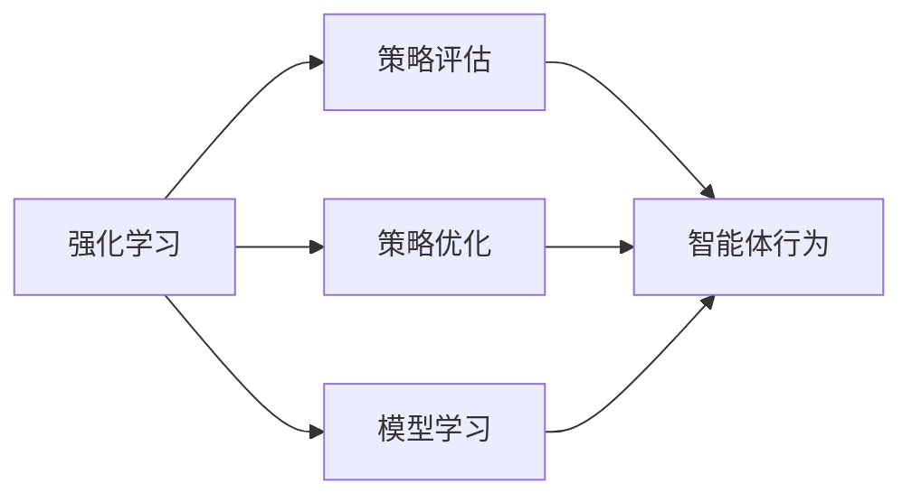
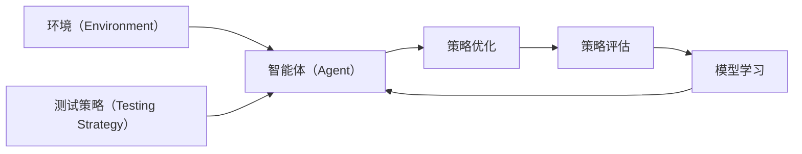

                 

# 强化学习Reinforcement Learning算法的验证与测试

> 关键词：强化学习,策略优化,策略评估,算法验证,测试策略

## 1. 背景介绍

### 1.1 问题由来

强化学习（Reinforcement Learning, RL）是一种基于奖励（Reward）的模型学习框架，其目标是通过与环境的交互，学习如何采取一系列动作以最大化长期奖励。强化学习的核心思想是构建一个智能体（Agent），使其在特定环境中通过试错学习逐步优化行为策略，最终达成既定目标。

然而，强化学习模型的性能验证和测试方法相对较复杂，既包括对学习算法的评估，也包括对智能体行为的验证。特别是，对于高维复杂环境，如何设计有效的测试策略，确保学习算法的正确性和稳定性，成为强化学习应用中一个重要的挑战。

### 1.2 问题核心关键点

本文旨在探讨强化学习算法验证与测试的核心技术问题，帮助读者理解和学习如何构建和评估强化学习模型的有效性。

- **模型学习与评估**：强化学习模型的学习过程是一个复杂的优化问题，涉及动作空间、状态空间、奖励函数等多个关键因素。如何设计有效的测试策略，确保模型的正确性和稳定性，是关键问题之一。
- **智能体行为验证**：智能体的行为策略需要经过反复的测试和评估，以确保其在不同环境下的稳定性和鲁棒性。测试策略的有效性直接影响到智能体的性能表现。
- **算法验证与优化**：强化学习算法本身也需要通过验证来评估其学习效率和收敛速度，并结合测试反馈进行优化。

### 1.3 问题研究意义

强化学习算法验证与测试技术的研究具有重要意义：

- 提升模型性能：有效的测试策略能够帮助发现模型中的问题，及时进行调整和优化，提升模型在实际环境中的性能表现。
- 保证模型稳定性：通过系统的测试策略，可以确保模型在各种环境下的稳定性，避免因特定环境导致的不良表现。
- 加速模型应用：验证与测试技术能够显著降低模型应用的风险，缩短模型从研究到应用的周期。
- 推动领域发展：系统的测试方法能够为整个强化学习领域的发展提供理论支持和实际指导。

## 2. 核心概念与联系

### 2.1 核心概念概述

- **强化学习（Reinforcement Learning）**：基于奖励的模型学习框架，智能体通过与环境的交互，学习最优行为策略以最大化长期奖励。
- **策略优化（Policy Optimization）**：智能体学习并优化行为策略的过程，目标是通过不断试错，优化策略以提升性能。
- **策略评估（Policy Evaluation）**：评估智能体行为策略的好坏，衡量其在特定环境下的长期性能。
- **模型学习（Model Learning）**：强化学习模型的学习过程，包括状态空间的理解、动作空间的探索和奖励函数的定义等。
- **智能体行为（Agent Behavior）**：智能体的实际行为表现，通过不断的策略优化和评估，逐步适应环境。

这些核心概念之间存在紧密联系，共同构成了强化学习的基本框架。通过系统化的测试和验证策略，可以确保强化学习模型的有效性、稳定性和可靠性。

### 2.2 概念间的关系

通过以下Mermaid流程图，可以更清晰地展示这些核心概念之间的关系：



这个流程图展示出强化学习的核心流程：首先，模型通过学习理解状态空间和动作空间，并定义奖励函数；接着，通过策略优化调整行为策略，进行智能体的行为表现；最后，通过策略评估验证行为策略的效果，从而进行进一步的优化。

### 2.3 核心概念的整体架构

以下综合的流程图展示了强化学习的基本架构，以及测试策略在其中扮演的角色：



这个综合流程图展示了从环境到智能体的互动过程，以及测试策略在整个强化学习中的重要作用。测试策略通过不断的评估和验证，帮助智能体优化策略，确保其在复杂环境下的稳定性和有效性。

## 3. 核心算法原理 & 具体操作步骤

### 3.1 算法原理概述

强化学习算法的验证与测试，本质上是模型学习与智能体行为验证的过程。核心任务包括：

1. **模型学习验证**：通过测试策略，验证模型对状态空间和动作空间的理解是否正确，奖励函数的定义是否合理。
2. **智能体行为验证**：通过测试策略，评估智能体的行为表现，确保其策略稳定性和鲁棒性。
3. **策略优化与评估**：通过测试反馈，优化智能体的行为策略，提升其长期奖励。

强化学习的核心算法主要包括：

- **策略优化算法**：如Q-learning、SARSA、Deep Q-Network（DQN）等，通过学习策略优化行为。
- **策略评估算法**：如Monte Carlo Tree Search（MCTS）、Advantage Actor-Critic（A2C）等，评估策略的长期效果。

### 3.2 算法步骤详解

#### 3.2.1 模型学习验证

1. **状态空间理解**：通过测试策略，验证模型对状态空间的理解是否正确。具体方法包括生成随机状态序列，观察模型的反应。
2. **动作空间探索**：测试模型在动作空间的探索能力，确保其能够覆盖所有可能的动作。
3. **奖励函数定义**：通过测试策略，验证奖励函数的定义是否合理，是否能够正确地奖励智能体的行为。

#### 3.2.2 智能体行为验证

1. **行为稳定性**：在多个环境或多个时间步上，验证智能体的行为表现是否稳定。
2. **行为鲁棒性**：在环境噪声或干扰情况下，验证智能体的行为表现是否鲁棒。
3. **行为最优性**：通过测试策略，验证智能体的行为策略是否能够最大化长期奖励。

#### 3.2.3 策略优化与评估

1. **策略优化**：通过测试反馈，调整智能体的行为策略，确保其能够更好地适应环境。
2. **策略评估**：通过测试策略，评估优化后的策略效果，确保其长期奖励的最大化。

### 3.3 算法优缺点

**强化学习验证与测试算法的优点**：

1. **灵活性**：能够适应复杂、多变的环境，适用于多种任务类型。
2. **自适应性**：能够根据测试反馈不断调整和优化，提升模型的性能。
3. **鲁棒性**：通过系统化的测试策略，确保模型在不同环境下的稳定性。

**强化学习验证与测试算法的缺点**：

1. **复杂性**：算法设计较为复杂，需要系统化的测试策略。
2. **计算成本**：特别是对于高维、复杂环境，测试成本较高。
3. **数据依赖**：测试效果高度依赖于测试数据的质量和多样性。

### 3.4 算法应用领域

强化学习验证与测试算法在多个领域得到广泛应用，包括：

- **自动驾驶**：通过测试策略，验证和优化自动驾驶算法在复杂交通环境中的行为策略。
- **机器人控制**：测试机器人行为策略在实际环境中的稳定性和鲁棒性。
- **游戏AI**：评估游戏AI在不同游戏中的表现，优化其行为策略。
- **供应链管理**：验证供应链管理系统的决策策略，确保其在不同市场环境下的稳定性。

## 4. 数学模型和公式 & 详细讲解 & 举例说明

### 4.1 数学模型构建

强化学习模型的数学模型主要包括状态空间、动作空间和奖励函数：

- **状态空间**：用 $S$ 表示，模型通过观察环境状态 $s_t$ 来确定当前状态。
- **动作空间**：用 $A$ 表示，模型通过选择动作 $a_t$ 与环境进行交互。
- **奖励函数**：用 $r_t$ 表示，模型根据当前状态和动作选择，得到即时奖励。

定义策略 $\pi(a_t|s_t)$ 表示智能体在状态 $s_t$ 下选择动作 $a_t$ 的概率分布。

### 4.2 公式推导过程

**策略优化算法的核心公式**：

$$
\pi^* = \mathop{\arg\min}_{\pi} \mathbb{E}[J(\pi)] = \mathop{\arg\min}_{\pi} \mathbb{E}_{s_0}\left[\sum_{t=0}^{\infty}\gamma^t \mathbb{E}_{a_t \sim \pi}[r_t + \gamma \mathbb{E}_{a_{t+1} \sim \pi}[V_{\pi}(s_{t+1})]]
$$

其中，$J(\pi)$ 表示策略的长期收益，$V_{\pi}(s_t)$ 表示策略 $\pi$ 在状态 $s_t$ 下的值函数。

**策略评估算法的核心公式**：

$$
V_{\pi}(s) = \mathbb{E}_{a \sim \pi}[\sum_{t=0}^{\infty}\gamma^t r_{t+1} + \gamma^{t+1} V_{\pi}(s_{t+1})]
$$

其中，$V_{\pi}(s)$ 表示策略 $\pi$ 在状态 $s$ 下的值函数。

### 4.3 案例分析与讲解

以Deep Q-Network（DQN）算法为例，其核心思想是通过神经网络逼近Q值函数，优化智能体的行为策略。通过测试策略，验证DQN算法的有效性：

1. **状态空间理解**：生成随机状态序列，观察DQN算法的反应，确保其能够正确理解状态空间。
2. **动作空间探索**：测试DQN算法在动作空间的探索能力，确保其能够覆盖所有可能的动作。
3. **奖励函数定义**：通过测试策略，验证DQN算法对奖励函数的理解是否正确。

## 5. 项目实践：代码实例和详细解释说明

### 5.1 开发环境搭建

进行强化学习验证与测试实践，需要以下开发环境：

1. **Python**：确保Python版本为3.7或以上，安装必要的库。
2. **Gym**：用于创建和管理环境，可以通过pip安装。
3. **TensorFlow**：用于深度学习模型开发，可以通过pip安装。
4. **OpenAI Gym**：提供各种环境测试框架，通过pip安装。
5. **Pygame**：用于图形界面开发，可以通过pip安装。

安装命令如下：

```bash
pip install tensorflow gym openai-gym pygame
```

### 5.2 源代码详细实现

以下是一个基于DQN算法的强化学习验证与测试的Python代码示例：

```python
import gym
import numpy as np
import tensorflow as tf
import pygame

# 创建环境
env = gym.make('CartPole-v0')

# 定义神经网络模型
model = tf.keras.Sequential([
    tf.keras.layers.Dense(24, input_shape=(4,), activation='relu'),
    tf.keras.layers.Dense(2, activation='linear')
])

# 定义Q值函数
def q_value(model, state, action):
    return model.predict(state)[action]

# 定义训练函数
def train(model, env, num_steps):
    for i in range(num_steps):
        state = env.reset()
        done = False
        while not done:
            # 选择动作
            action_probs = np.exp(q_value(model, state, np.arange(env.action_space.n))) / np.sum(np.exp(q_value(model, state, np.arange(env.action_space.n))))
            action = np.random.choice(env.action_space.n, p=action_probs)
            next_state, reward, done, _ = env.step(action)
            # 计算Q值
            Q_sa = reward + gamma * max(q_value(model, next_state, np.arange(env.action_space.n)))
            target_q = q_value(model, state, action) + (Q_sa - q_value(model, state, action))
            # 更新模型
            model.train_on_batch(state, np.array([target_q]))
            state = next_state

# 测试函数
def test(model, env, num_steps):
    state = env.reset()
    done = False
    while not done:
        # 选择动作
        action_probs = np.exp(q_value(model, state, np.arange(env.action_space.n))) / np.sum(np.exp(q_value(model, state, np.arange(env.action_space.n))))
        action = np.random.choice(env.action_space.n, p=action_probs)
        next_state, reward, done, _ = env.step(action)
        state = next_state

# 训练模型
model.compile(optimizer=tf.keras.optimizers.Adam(), loss='mse')
train(model, env, 10000)

# 测试模型
test(model, env, 1000)
```

### 5.3 代码解读与分析

该代码示例展示了如何使用TensorFlow实现DQN算法的训练和测试：

1. **环境创建**：通过Gym库创建CartPole-v0环境，该环境用于测试智能体在复杂状态空间中的表现。
2. **模型定义**：定义一个简单的神经网络模型，用于逼近Q值函数。
3. **训练函数**：在模型上进行训练，通过测试策略验证模型对状态空间和动作空间的理解。
4. **测试函数**：在模型上进行测试，评估智能体的行为表现。

### 5.4 运行结果展示

运行上述代码，可以通过观察训练过程中的奖励变化和测试结果，验证模型的效果。例如，如果模型能够在测试中稳定地获得高奖励，则说明其行为策略是有效的。

## 6. 实际应用场景

### 6.1 自动驾驶

在自动驾驶领域，强化学习算法需要通过测试策略验证其行为策略，确保在复杂交通环境中的稳定性。通过测试智能体在不同交通场景中的表现，可以评估其在实际驾驶中的安全性。

### 6.2 机器人控制

在机器人控制领域，强化学习算法需要通过测试策略验证其行为策略，确保在实际环境中的稳定性和鲁棒性。通过测试智能体在模拟和真实环境中的表现，可以评估其在实际应用中的可靠性。

### 6.3 游戏AI

在游戏AI领域，强化学习算法需要通过测试策略验证其行为策略，确保在不同游戏中的表现。通过测试智能体在不同游戏中的表现，可以评估其在实际游戏环境中的智能水平。

### 6.4 未来应用展望

未来，强化学习算法验证与测试技术将在更多领域得到应用，为复杂系统的优化提供新的思路。随着技术的不断进步，强化学习算法将更加灵活、高效、可靠，为人工智能技术的落地应用带来新的突破。

## 7. 工具和资源推荐

### 7.1 学习资源推荐

- **Reinforcement Learning: An Introduction by Richard S. Sutton and Andrew G. Barto**：经典的强化学习教材，系统介绍了强化学习的理论基础和应用方法。
- **Deep Reinforcement Learning by Ian Goodfellow and Yoshua Bengio**：深度强化学习的经典教材，介绍了深度学习与强化学习的结合方法。
- **OpenAI Gym**：Gym库提供各种测试环境，帮助验证和优化强化学习算法。
- **TensorFlow and PyTorch**：主流深度学习框架，支持强化学习算法开发和测试。

### 7.2 开发工具推荐

- **Gym**：用于创建和管理测试环境的Python库。
- **TensorFlow和PyTorch**：用于深度学习模型开发的开源框架。
- **Pygame**：用于图形界面开发和测试的工具。

### 7.3 相关论文推荐

- **Playing Atari with deep reinforcement learning**：由DeepMind发表的里程碑性论文，展示了深度强化学习在玩游戏中的应用。
- **Human-level control through deep reinforcement learning**：由DeepMind发表的另一篇重要论文，展示了强化学习在控制复杂机械系统中的应用。
- **Deep reinforcement learning for playing Go**：由DeepMind发表的论文，展示了强化学习在玩游戏Go中的应用。

## 8. 总结：未来发展趋势与挑战

### 8.1 研究成果总结

强化学习验证与测试技术的发展，为人工智能技术的落地应用提供了重要的理论和实践指导。通过系统化的测试策略，可以确保强化学习模型的正确性和稳定性，推动其在各个领域的应用。

### 8.2 未来发展趋势

未来，强化学习验证与测试技术将呈现以下几个发展趋势：

1. **自适应测试策略**：根据环境和任务的变化，动态调整测试策略，提高测试效率。
2. **多模态测试**：结合视觉、听觉等多模态数据，进行更全面的验证和测试。
3. **分布式测试**：通过分布式计算，加速测试过程，提高模型验证的效率。
4. **自动化测试**：通过自动化工具，简化测试流程，降低人工干预的复杂性。

### 8.3 面临的挑战

尽管强化学习验证与测试技术取得了显著进展，但仍面临以下挑战：

1. **高维环境测试**：高维、复杂环境下的测试策略设计困难，测试成本高。
2. **数据依赖性**：测试效果高度依赖于测试数据的质量和多样性，数据采集和处理成本高。
3. **测试算法的复杂性**：测试算法设计复杂，需要系统化的测试策略和工具。

### 8.4 研究展望

未来，需要从以下几个方面继续深入研究强化学习验证与测试技术：

1. **优化测试策略**：开发更高效、更灵活的测试策略，降低测试成本，提高测试效率。
2. **融合多模态数据**：结合视觉、听觉等多模态数据，进行更全面的验证和测试。
3. **自动化测试工具**：开发自动化测试工具，简化测试流程，降低人工干预的复杂性。
4. **分布式测试框架**：研究分布式测试框架，提高测试效率和模型验证的可靠性。

总之，强化学习验证与测试技术的发展，将为人工智能技术的落地应用提供重要的理论和实践指导。未来，通过持续的技术创新和实践探索，强化学习验证与测试技术将不断提升其效率和可靠性，推动人工智能技术的进一步发展。

## 9. 附录：常见问题与解答

### Q1: 强化学习验证与测试算法的优点有哪些？

**A1**：强化学习验证与测试算法的优点主要包括：

1. **灵活性**：能够适应复杂、多变的环境，适用于多种任务类型。
2. **自适应性**：能够根据测试反馈不断调整和优化，提升模型的性能。
3. **鲁棒性**：通过系统化的测试策略，确保模型在不同环境下的稳定性。

### Q2: 如何设计有效的测试策略？

**A2**：设计有效的测试策略需要考虑以下几个方面：

1. **测试数据的多样性**：确保测试数据能够覆盖所有可能的情况，避免测试数据的偏差。
2. **测试环境的复杂性**：通过构建复杂、多变的环境，验证智能体在不同环境下的表现。
3. **测试策略的多样性**：采用多种测试策略，如随机测试、模拟测试、实际测试等，全面评估智能体的表现。

### Q3: 强化学习验证与测试算法的缺点有哪些？

**A3**：强化学习验证与测试算法的缺点主要包括：

1. **复杂性**：算法设计较为复杂，需要系统化的测试策略。
2. **计算成本**：特别是对于高维、复杂环境，测试成本较高。
3. **数据依赖**：测试效果高度依赖于测试数据的质量和多样性。

### Q4: 强化学习验证与测试技术的应用领域有哪些？

**A4**：强化学习验证与测试技术在多个领域得到广泛应用，包括：

1. **自动驾驶**：通过测试策略，验证和优化自动驾驶算法在复杂交通环境中的行为策略。
2. **机器人控制**：测试机器人行为策略在实际环境中的稳定性和鲁棒性。
3. **游戏AI**：评估游戏AI在不同游戏中的表现，优化其行为策略。
4. **供应链管理**：验证供应链管理系统的决策策略，确保其在不同市场环境下的稳定性。

总之，强化学习验证与测试技术的研究和应用，将为人工智能技术的落地应用提供重要的理论和实践指导。通过不断优化测试策略和工具，强化学习验证与测试技术将在更多领域得到广泛应用，为复杂系统的优化提供新的思路和方法。

