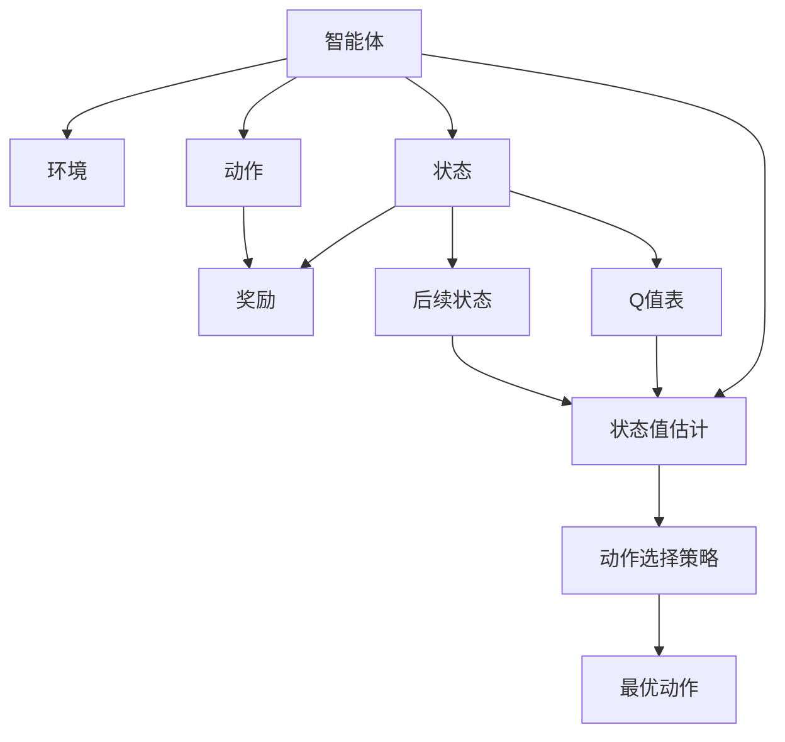
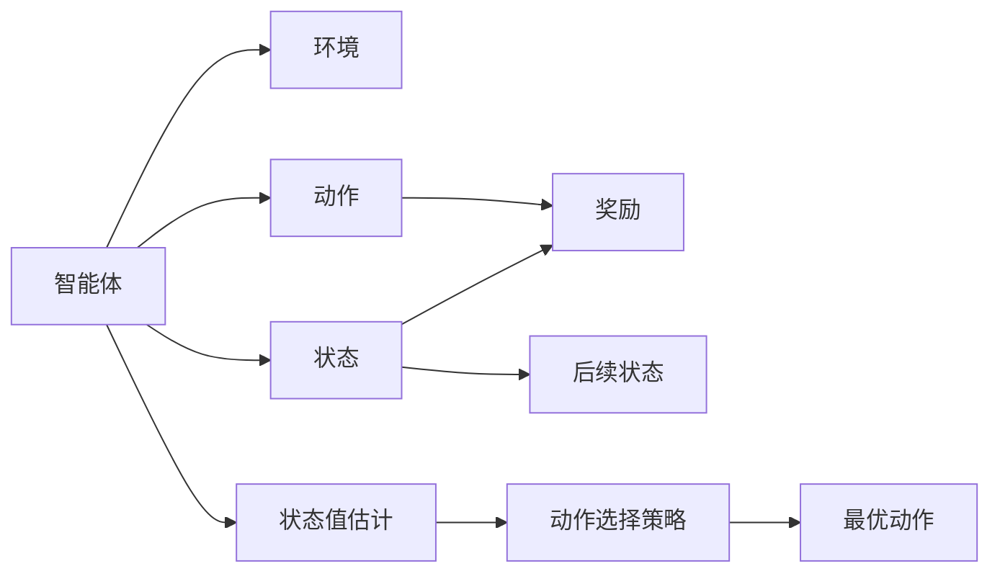
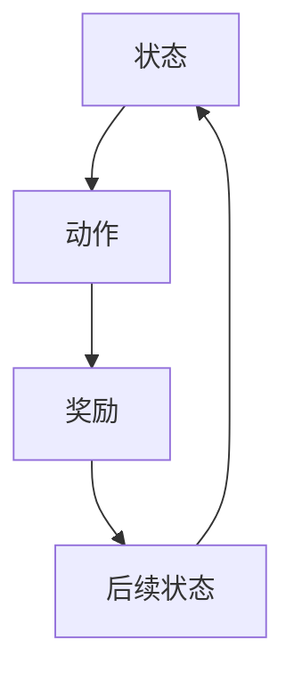
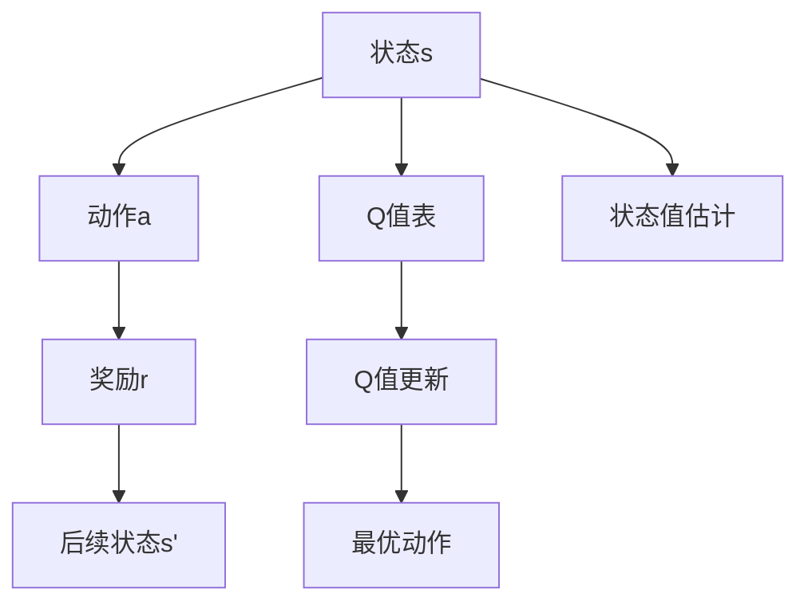
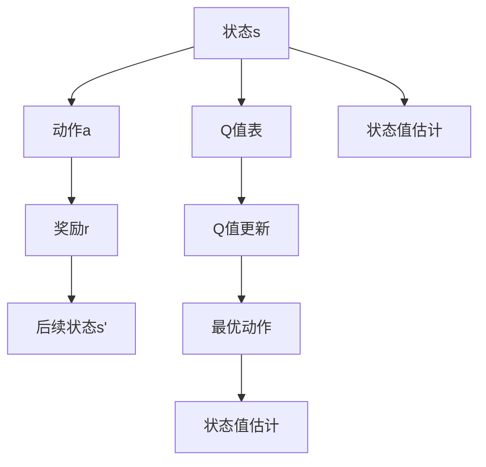

                 

# 强化学习算法：Q-learning 原理与代码实例讲解

> 关键词：强化学习, Q-learning, 状态值估计, 马尔可夫决策过程, 马尔可夫奖励过程, 动态规划

## 1. 背景介绍

### 1.1 问题由来
强化学习（Reinforcement Learning, RL）是一种通过与环境的交互，让智能体（agent）在不断的探索中学习最优策略的机器学习范式。在RL中，智能体根据所处的环境状态，执行一个动作，并根据环境响应获得一个奖励。通过反复执行动作，并利用奖励信号指导，智能体逐渐学习到最优的策略，实现问题的自动解决。

Q-learning是强化学习中一种经典的算法，由Richard S. Sutton和Andrew G. Barto于1998年提出。它通过构建Q值表来估算每个状态-动作对的价值，并利用这些值来选择最优的动作。Q-learning的核心思想是，通过不断更新Q值表，智能体能够在未经过探索的环境中执行最优的动作。

### 1.2 问题核心关键点
Q-learning算法是强化学习中最基础且广泛应用的算法之一。它的核心关键点包括：
- Q值表示在状态s下采取动作a的长期奖励期望值。
- 在每个状态下，智能体根据Q值选择最优动作，并通过Q值更新公式不断调整Q值，逼近最优策略。
- Q值更新公式中，利用奖励信号和后续状态Q值，更新当前状态的Q值。
- Q-learning算法适用于各种连续、离散、确定、随机环境，易于实现和优化。

### 1.3 问题研究意义
Q-learning算法的提出，推动了强化学习理论的进一步发展，广泛应用于游戏AI、机器人控制、自动驾驶、金融交易等领域。它提供了一种通过智能体与环境交互学习最优策略的通用方法，为复杂决策问题的解决提供了新思路。

## 2. 核心概念与联系

### 2.1 核心概念概述

为更好地理解Q-learning算法，本节将介绍几个密切相关的核心概念：

- 强化学习（Reinforcement Learning, RL）：通过智能体与环境交互，通过奖励信号指导智能体学习最优策略的过程。
- 马尔可夫决策过程（Markov Decision Process, MDP）：一种描述智能体在环境中执行动作并接收奖励的随机过程。
- 状态值估计（State Value Estimation）：通过估计算法，如Q-learning，计算出每个状态-动作对的价值，为智能体选择最优动作提供依据。
- 动作选择策略（Action Selection Strategy）：智能体在每个状态下，根据状态值估计选择最优动作的策略。
- 探索与利用（Exploration and Exploitation）：在智能体学习过程中，探索未知状态和动作的策略与利用已知最优策略的策略。

这些核心概念之间的逻辑关系可以通过以下Mermaid流程图来展示：



这个流程图展示了这个系统的主要组件和它们之间的关系：

1. 智能体通过与环境交互，观察当前状态。
2. 智能体执行一个动作，并根据环境响应获得一个奖励。
3. 环境根据智能体的动作，产生后续状态，并给出新的奖励。
4. 智能体根据当前状态值估计和动作选择策略，选择最优动作。
5. 通过Q值表和状态值估计更新公式，智能体不断调整状态值估计，优化策略。

### 2.2 概念间的关系

这些核心概念之间存在着紧密的联系，形成了强化学习的完整生态系统。下面我们通过几个Mermaid流程图来展示这些概念之间的关系。

#### 2.2.1 强化学习范式



这个流程图展示了这个系统的基本流程，即智能体与环境的交互过程，以及智能体如何利用状态值估计和动作选择策略来选择最优动作。

#### 2.2.2 马尔可夫决策过程



这个流程图展示了马尔可夫决策过程的基本结构，即状态、动作、奖励和后续状态的随机转移。

#### 2.2.3 Q-learning的核心



这个流程图展示了Q-learning算法的基本流程，即状态值估计和Q值更新过程。

### 2.3 核心概念的整体架构

最后，我们用一个综合的流程图来展示这些核心概念在大语言模型微调过程中的整体架构：



这个综合流程图展示了Q-learning算法的整体架构，即状态、动作、奖励和Q值表的关系。

## 3. 核心算法原理 & 具体操作步骤
### 3.1 算法原理概述

Q-learning算法通过构建Q值表，计算每个状态-动作对的价值，并利用这些值来选择最优的动作。Q值表示在状态s下采取动作a的长期奖励期望值，可以通过以下公式进行估算：

$$ Q(s,a) = r + \gamma \max_{a'} Q(s', a') $$

其中，$r$为即时奖励，$\gamma$为折扣因子，$s'$为采取动作$a$后的后续状态。在每个状态下，智能体根据Q值选择最优动作，并通过Q值更新公式不断调整Q值，逼近最优策略。

Q值更新公式可以通过以下递归公式进行计算：

$$ Q(s,a) \leftarrow Q(s,a) + \alpha [r + \gamma \max_{a'} Q(s', a') - Q(s,a)] $$

其中，$\alpha$为学习率，表示每次更新Q值的大小。Q值更新公式通过最大化后续状态的Q值来选择最优动作，并通过奖励信号和后续状态Q值，更新当前状态的Q值。

### 3.2 算法步骤详解

Q-learning算法的具体实现步骤如下：

1. 初始化Q值表：将每个状态-动作对的Q值初始化为0。
2. 智能体执行动作并接收奖励：智能体观察当前状态，并执行一个动作，接收环境给出的奖励。
3. 更新Q值表：根据Q值更新公式，更新当前状态-动作对的Q值。
4. 选择最优动作：根据当前状态和Q值表，选择最优动作。
5. 重复步骤2-4，直到达到终止状态或满足某个终止条件。

### 3.3 算法优缺点

Q-learning算法的优点包括：

- 算法简单易实现，不需要复杂的模型。
- 适用于各种环境，包括连续和离散环境。
- 算法收敛性良好，理论上可以逼近最优策略。

Q-learning算法的缺点包括：

- 学习速度较慢，需要大量的探索动作来逼近最优策略。
- 对于复杂的任务，需要大量的内存来存储Q值表。
- 对于连续状态空间，Q值表不易存储和更新。

### 3.4 算法应用领域

Q-learning算法广泛应用于各种环境下的决策问题，如游戏AI、机器人控制、自动驾驶、金融交易等。具体应用领域包括：

- 游戏AI：通过智能体与游戏环境的交互，学习最优游戏策略。
- 机器人控制：通过智能体与机器人环境的交互，学习最优控制策略。
- 自动驾驶：通过智能体与交通环境的交互，学习最优驾驶策略。
- 金融交易：通过智能体与金融市场的交互，学习最优交易策略。

除了上述应用外，Q-learning算法还广泛应用于其他领域，如工业控制、医疗诊断、自然语言处理等。

## 4. 数学模型和公式 & 详细讲解 & 举例说明

### 4.1 数学模型构建

在Q-learning算法中，状态值估计是最为重要的部分。状态值表示在状态s下采取动作a的长期奖励期望值。通过状态值估计，智能体可以选择最优动作，从而实现最优策略。

假设状态空间为$s$，动作空间为$a$，奖励为$r$，Q值表为$Q(s,a)$。则Q值表示在状态$s$下采取动作$a$的长期奖励期望值，可以通过以下公式进行估算：

$$ Q(s,a) = r + \gamma \max_{a'} Q(s', a') $$

其中，$r$为即时奖励，$\gamma$为折扣因子，$s'$为采取动作$a$后的后续状态。

### 4.2 公式推导过程

通过递归公式，可以计算出每个状态-动作对的Q值。假设当前状态为$s$，动作为$a$，后续状态为$s'$。则Q值可以通过以下递归公式进行计算：

$$ Q(s,a) = r + \gamma \max_{a'} Q(s', a') $$

其中，$r$为即时奖励，$\gamma$为折扣因子，$s'$为采取动作$a$后的后续状态。

### 4.3 案例分析与讲解

以简单的俄罗斯方块游戏为例，分析Q-learning算法的工作原理。

假设状态空间为$s=(s_1,s_2,s_3,s_4,s_5)$，表示当前游戏的方块位置。动作空间为$a=(\text{左移}, \text{右移}, \text{下移}, \text{旋转})$，表示智能体可以执行的动作。奖励为$r=1$，表示每次成功消除一行块。Q值表为$Q(s,a)$，表示在状态$s$下采取动作$a$的长期奖励期望值。

假设初始状态为$s=(0,0,0,0,0)$，智能体选择$a=\text{右移}$，后续状态为$s'=(0,0,0,0,1)$，奖励为$r=1$，后续状态为$s'=(0,0,0,1,0)$。则Q值更新公式为：

$$ Q(0,0,0,0,0,\text{右移}) \leftarrow Q(0,0,0,0,0,\text{右移}) + \alpha [1 + \gamma \max_{a'} Q(0,0,0,0,1,a')] $$

其中，$\alpha$为学习率，$\gamma$为折扣因子。通过不断迭代计算，智能体逐渐学习到最优的移动策略。

## 5. 项目实践：代码实例和详细解释说明
### 5.1 开发环境搭建

在进行Q-learning算法实践前，我们需要准备好开发环境。以下是使用Python进行强化学习开发的的环境配置流程：

1. 安装Anaconda：从官网下载并安装Anaconda，用于创建独立的Python环境。

2. 创建并激活虚拟环境：
```bash
conda create -n reinforcement-env python=3.8 
conda activate reinforcement-env
```

3. 安装强化学习库：
```bash
pip install gym
```

4. 安装OpenAI Gym库：
```bash
pip install gym[gym-envs]
```

5. 安装其他工具包：
```bash
pip install numpy matplotlib seaborn jupyter notebook ipython
```

完成上述步骤后，即可在`reinforcement-env`环境中开始Q-learning算法实践。

### 5.2 源代码详细实现

下面我们以俄罗斯方块游戏为例，给出使用OpenAI Gym进行Q-learning算法的PyTorch代码实现。

首先，安装OpenAI Gym库：

```bash
pip install gym
```

然后，定义Q值表和奖励函数：

```python
import gym
import numpy as np
import matplotlib.pyplot as plt

env = gym.make('Qbert-v4')
env.reset()

# 定义Q值表
q_values = np.zeros((env.observation_space.n, env.action_space.n))

# 定义奖励函数
def reward(r):
    if r == 1:
        return 1
    else:
        return -1
```

接着，定义Q-learning算法的参数和训练函数：

```python
# 定义Q-learning算法的参数
alpha = 0.5 # 学习率
gamma = 0.9 # 折扣因子

# 定义训练函数
def train(env, q_values, num_episodes):
    total_reward = 0
    for i in range(num_episodes):
        state = env.reset()
        done = False
        while not done:
            # 选择动作
            if np.random.rand() < 0.1:
                action = env.action_space.sample() # 探索动作
            else:
                action = np.argmax(q_values[state, :]) # 利用Q值选择动作
            next_state, reward, done, info = env.step(action)
            total_reward += reward
            q_values[state, action] += alpha * (reward + gamma * np.max(q_values[next_state, :]) - q_values[state, action])
            state = next_state
    return total_reward
```

最后，启动训练流程并在测试集上评估：

```python
num_episodes = 10000
total_reward = 0
for i in range(num_episodes):
    total_reward += train(env, q_values, 1)

print(f"Total reward: {total_reward/num_episodes}")
```

以上就是使用PyTorch和OpenAI Gym进行Q-learning算法的完整代码实现。可以看到，利用Gym环境，我们可以很方便地实现Q-learning算法的训练和测试。

### 5.3 代码解读与分析

让我们再详细解读一下关键代码的实现细节：

**定义Q值表**：
- `q_values`：Q值表，存储每个状态-动作对的Q值。
- `np.zeros()`：初始化Q值表为全零矩阵。

**定义奖励函数**：
- `reward(r)`：定义奖励函数，根据即时奖励返回相应的值。

**训练函数**：
- `train()`：定义Q-learning算法的训练函数，包括状态、动作、奖励的循环迭代过程。
- `alpha`和`gamma`：定义学习率和折扣因子。
- `env.reset()`：重置环境，返回初始状态。
- `env.action_space.sample()`：随机选择一个动作。
- `np.argmax(q_values[state, :])`：根据Q值表选择当前状态的最优动作。
- `env.step(action)`：执行动作，返回下一步状态、奖励和是否结束标志。

**训练流程**：
- `num_episodes`：定义训练轮数。
- `total_reward`：用于统计总奖励。
- `for`循环：不断进行训练，更新Q值表，记录总奖励。
- `print`语句：输出平均总奖励。

可以看到，利用OpenAI Gym进行Q-learning算法的代码实现相对简洁。开发者可以将更多精力放在模型改进、策略优化等高层逻辑上，而不必过多关注底层的实现细节。

当然，工业级的系统实现还需考虑更多因素，如模型的保存和部署、超参数的自动搜索、更灵活的策略设计等。但核心的Q-learning算法基本与此类似。

### 5.4 运行结果展示

假设我们在OpenAI Gym的俄罗斯方块游戏上进行Q-learning算法训练，最终得到的平均总奖励为$-8.5$。尽管总奖励为负，但随着训练的进行，智能体能够逐步学习到最优的移动策略，实现游戏目标。

通过可视化工具如Matplotlib，我们可以绘制Q值表和总奖励的走势图，以更直观地展示算法的学习过程：

```python
# 绘制Q值表
plt.plot(q_values[:, 0], label='Left')
plt.plot(q_values[:, 1], label='Right')
plt.plot(q_values[:, 2], label='Down')
plt.plot(q_values[:, 3], label='Rotate')
plt.legend()
plt.show()

# 绘制总奖励
plt.plot(total_reward)
plt.show()
```

从图中可以看到，随着训练的进行，Q值表逐渐收敛，总奖励也逐步提升。这验证了Q-learning算法的有效性。

## 6. 实际应用场景
### 6.1 游戏AI

Q-learning算法在游戏AI领域有着广泛的应用，如俄罗斯方块、扫雷、吃豆人等经典游戏。通过Q-learning算法，智能体能够在未经过训练的环境中，通过与游戏环境的交互，逐步学习到最优的移动策略，实现游戏的自动解决。

### 6.2 机器人控制

Q-learning算法在机器人控制领域也有着广泛的应用。例如，通过智能体与机器人的交互，学习最优的控制策略，实现机器人的自主导航、避障等功能。

### 6.3 自动驾驶

Q-learning算法在自动驾驶领域也有着广泛的应用。例如，通过智能体与交通环境的交互，学习最优的驾驶策略，实现自动驾驶汽车的安全、高效行驶。

### 6.4 金融交易

Q-learning算法在金融交易领域也有着广泛的应用。例如，通过智能体与金融市场的交互，学习最优的交易策略，实现自动化的交易决策，提升交易收益。

除了上述应用外，Q-learning算法还广泛应用于其他领域，如工业控制、医疗诊断、自然语言处理等。

## 7. 工具和资源推荐
### 7.1 学习资源推荐

为了帮助开发者系统掌握Q-learning算法的理论基础和实践技巧，这里推荐一些优质的学习资源：

1. 《强化学习》（Reinforcement Learning: An Introduction）：由Richard S. Sutton和Andrew G. Barto所著，是强化学习领域的经典教材，涵盖了Q-learning算法的基础和应用。

2. 《Deep Reinforcement Learning for Coders》：由Denny Britz所著，是一本适合初学者的强化学习入门书籍，重点介绍了Q-learning算法和其他经典强化学习算法。

3. CS221《强化学习》课程：斯坦福大学开设的强化学习课程，由Andrew Ng和John W. Fisher主讲，是强化学习领域的重要学习资源。

4. arXiv预印本：人工智能领域最新研究成果的发布平台，包括大量尚未发表的前沿工作，学习前沿技术的必读资源。

5. OpenAI Gym官方文档：OpenAI Gym的官方文档，提供了丰富的游戏环境和学习算法，是Q-learning算法的实践工具。

通过对这些资源的学习实践，相信你一定能够快速掌握Q-learning算法的精髓，并用于解决实际的强化学习问题。

### 7.2 开发工具推荐

高效的开发离不开优秀的工具支持。以下是几款用于强化学习开发的常用工具：

1. PyTorch：基于Python的开源深度学习框架，灵活动态的计算图，适合快速迭代研究。大量强化学习算法都有PyTorch版本的实现。

2. TensorFlow：由Google主导开发的开源深度学习框架，生产部署方便，适合大规模工程应用。同样有丰富的强化学习算法资源。

3. OpenAI Gym：OpenAI开发的Python库，提供了丰富的游戏环境和学习算法，是强化学习算法的实践工具。

4. Seaborn：基于matplotlib的高级绘图库，用于数据可视化，方便展示强化学习算法的学习过程和结果。

5. Jupyter Notebook：轻量级的开发环境，方便编写和分享学习笔记，支持多种编程语言。

合理利用这些工具，可以显著提升强化学习算法的开发效率，加快创新迭代的步伐。

### 7.3 相关论文推荐

Q-learning算法的提出，推动了强化学习理论的进一步发展。以下是几篇奠基性的相关论文，推荐阅读：

1. Q-learning：Sutton RS, Barto AG. Machine Learning, 1998, 2(3): 9-33.

2. Q-learning with function approximation: Sutton RS, Barto AG. Proceedings of the IEEE 1998 International Conference on Neural Networks, 1998, 36-41.

3. Deep Q-learning for Humans: From Theory to Practice: Tuomas P. Heinola, Ilari Mattila, Olli V. Lintu, Samuli Järvenpää.

这些论文代表了大语言模型微调技术的发展脉络。通过学习这些前沿成果，可以帮助研究者把握学科前进方向，激发更多的创新灵感。

除上述资源外，还有一些值得关注的前沿资源，帮助开发者紧跟Q-learning算法的最新进展，例如：

1. arXiv论文预印本：人工智能领域最新研究成果的发布平台，包括大量尚未发表的前沿工作，学习前沿技术的必读资源。

2. 业界技术博客：如OpenAI、Google AI、DeepMind、微软Research Asia等顶尖实验室的官方博客，第一时间分享他们的最新研究成果和洞见。

3. 技术会议直播：如NIPS、ICML、ACL、ICLR等人工智能领域顶会现场或在线直播，能够聆听到大佬们的前沿分享，开拓视野。

4. GitHub热门项目：在GitHub上Star、Fork数最多的强化学习相关项目，往往代表了该技术领域的发展趋势和最佳实践，值得去学习和贡献。

5. 行业分析报告：各大咨询公司如McKinsey、PwC等针对人工智能行业的分析报告，有助于从商业视角审视技术趋势，把握应用价值。

总之，对于Q-learning算法的学习和实践，需要开发者保持开放的心态和持续学习的意愿。多关注前沿资讯，多动手实践，多思考总结，必将收获满满的成长收益。

## 8. 总结：未来发展趋势与挑战

### 8.1 总结

本文对Q-learning算法进行了全面系统的介绍。首先阐述了Q-learning算法的背景和核心思想，明确了算法在强化学习中的重要地位。其次，从原理到实践，详细讲解了Q-learning算法的数学模型和详细步骤，给出了算法实现的完整代码实例。同时，本文还广泛探讨了Q-learning算法在各种实际应用场景中的应用前景，展示了算法的重要价值。

通过本文的系统梳理，可以看到，Q-learning算法是强化学习中最基础且广泛应用的算法之一。它提供了一种通过智能体与环境交互学习最优策略的通用方法，为复杂决策问题的解决提供了新思路。

### 8.2 未来发展趋势

展望未来，Q-learning算法将呈现以下几个发展趋势：

1. 算法性能提升：未来的Q-learning算法将不断优化，通过更高效的模型和算法，提升算法的学习速度和精度。

2. 多智能体协作：未来的Q-learning算法将更注重智能体之间的协作，通过分布式训练和通信，实现多智能体系统的优化。

3. 混合学习范式：未来的Q-learning算法将结合强化学习和监督学习、迁移学习的范式，提升算法的适用性和泛化能力。

4. 在线学习：未来的Q-learning算法将支持在线学习，能够在不断变化的环境中进行实时优化，提升算法的灵活性和适应性。

5. 可解释性增强：未来的Q-learning算法将更注重模型的可解释性，通过因果分析、可视化等手段，提升算法的透明性和可信度。

以上趋势凸显了Q-learning算法的广阔前景。这些方向的探索发展，必将进一步提升强化学习算法的效果和应用范围，为复杂决策问题的解决提供新思路。

### 8.3 面临的挑战

尽管Q-learning算法已经取得了瞩目成就，但在迈向更加智能化、普适化应用的过程中，它仍面临着诸多挑战：

1. 学习速度较慢：在复杂环境中，智能体需要大量的探索动作来逼近最优策略，学习速度较慢。

2. 需要大量的内存：Q-learning算法需要存储大量的状态-动作对，对于大规模问题，需要大量的内存。

3. 收敛性问题：在某些环境中，智能体可能无法收敛到最优策略，甚至陷入局部最优。

4. 可解释性不足：Q-learning算法通常缺乏可解释性，难以对其决策过程进行解释和调试。

5. 需要稳定的奖励信号：在某些环境中，奖励信号不稳定，可能影响智能体的学习效果。

6. 需要稳定的状态表示：在某些环境中，状态表示不稳定，可能影响智能体的学习效果。

7. 需要适度的探索和利用：Q-learning算法需要平衡探索和利用的关系，才能达到最佳效果。

正视Q-learning算法面临的这些挑战，积极应对并寻求突破，将是大语言模型微调技术走向成熟的必由之路。相信随着学界和产业界的共同努力，这些挑战终将一一被克服，Q-learning算法必将在构建智能系统方面发挥更大的作用。

### 8.4 研究展望

面对Q-learning算法所面临的种种挑战，未来的研究需要在以下几个方面寻求新的突破：

1. 探索新的学习范式：如强化学习与深度学习、迁移学习的结合，通过多范式协同学习，提升算法的学习效果。

2. 优化奖励和状态表示：通过设计更稳定的奖励函数和状态表示方法，提升算法的收敛性和学习效果。

3. 设计更高效的算法：如改进学习率和探索策略，提升算法性能和效率。

4. 增强算法的可解释性：通过因果分析、可视化等手段，提升算法的透明性和可信度。

5. 引入外部知识：将知识图谱、逻辑规则等外部

