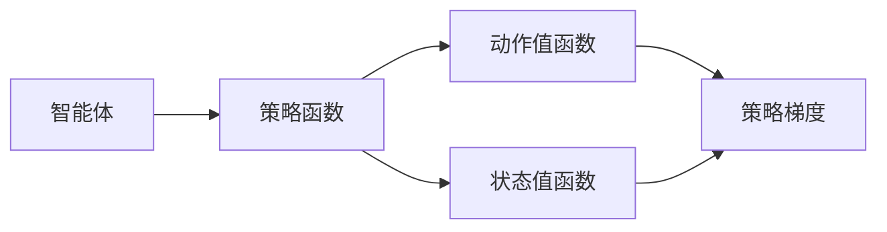
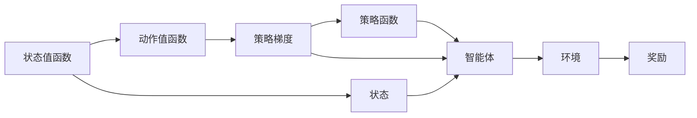

                 

# 强化学习算法：策略梯度 (Policy Gradient) 原理与代码实例讲解

> 关键词：强化学习,策略梯度,无模型算法,直接模型优化,优势函数,深度强化学习,动作价值网络

## 1. 背景介绍

### 1.1 问题由来

强化学习（Reinforcement Learning, RL）是机器学习的重要分支之一，旨在使智能体在与环境的交互中通过试错学习来获取最优策略。在强化学习中，智能体需要根据观察到的状态（state）采取动作（action），以最大化累积奖励（cumulative reward）。传统的强化学习方法往往需要大量的标记数据，而实际应用中，获取高质量数据往往成本昂贵且难以实现。

策略梯度算法（Policy Gradient, PG）作为无模型强化学习的重要算法，通过直接对策略函数进行优化，能够显著减少对数据的需求。PG算法在连续动作空间和离散动作空间中均有应用，尤其在深度强化学习（Deep Reinforcement Learning, DRL）中，PG算法以其简单高效的特性成为主流方法之一。

### 1.2 问题核心关键点

策略梯度算法利用梯度上升的方法对策略函数进行优化，通过反向传播计算动作值，得到策略函数梯度，进而更新策略参数，实现智能体的最优行为选择。其主要特点包括：

- 无模型：PG算法不需要建立环境的模型，直接在环境中进行策略优化。
- 直接优化策略：通过奖励信号直接对策略函数进行优化，减少了对环境模型的依赖。
- 样本效率高：相较于基于值函数的算法，PG算法在样本效率上有明显优势，尤其适用于连续动作空间。
- 计算复杂度高：PG算法计算复杂度高，尤其是在高维连续动作空间中。

### 1.3 问题研究意义

策略梯度算法在强化学习中的应用，对于拓展智能体的学习能力和应用范围，具有重要意义：

1. 优化过程自适应：PG算法能够适应不同环境，自适应地调整策略参数，实现高效的策略学习。
2. 适用范围广：PG算法在连续动作空间和离散动作空间中均有广泛应用，适用于各种智能体任务。
3. 样本效率高：在有限的数据量下，PG算法仍能快速收敛到最优策略，适用于样本稀缺场景。
4. 计算资源节省：无需显式构建环境模型，节省计算资源，简化模型设计。
5. 推广性强：PG算法思想可推广到其他无模型强化学习算法中，如Trust Region Policy Optimization (TRPO)、Proximal Policy Optimization (PPO)等。

## 2. 核心概念与联系

### 2.1 核心概念概述

为更好地理解策略梯度算法，本节将介绍几个关键概念：

- 强化学习：智能体在环境中通过与环境交互获取奖励，以最大化累积奖励的过程。
- 策略函数：定义智能体在给定状态下选择动作的概率分布。
- 动作值函数：衡量智能体在特定状态下采取特定动作的预期累积奖励。
- 状态值函数：衡量智能体在特定状态下的预期累积奖励。
- 策略梯度：策略函数对奖励的梯度，指导智能体选择最优策略。

策略梯度算法通过反向传播计算动作值，得到策略函数的梯度，进而更新策略参数，实现智能体的最优行为选择。其核心思想是利用梯度上升的方法，不断调整策略参数，使智能体能够最大化累积奖励。

### 2.2 概念间的关系

这些核心概念之间存在紧密联系，构成了策略梯度算法的完整框架：



这个流程图展示了策略梯度算法中各个概念之间的关系：

1. 智能体通过策略函数在给定状态下选择动作，得到动作值。
2. 动作值函数衡量智能体在特定状态下采取特定动作的预期累积奖励。
3. 状态值函数衡量智能体在特定状态下的预期累积奖励。
4. 策略梯度是策略函数对奖励的梯度，指导智能体选择最优策略。

这些概念共同构成了策略梯度算法的核心，使得智能体能够通过试错学习，不断调整策略参数，实现最优行为选择。

### 2.3 核心概念的整体架构

最后，我们用一个综合的流程图来展示这些核心概念在大语言模型微调过程中的整体架构：



这个综合流程图展示了策略梯度算法在大语言模型微调过程中的整体架构：

1. 智能体通过策略函数在给定状态下选择动作，得到动作值。
2. 动作值函数衡量智能体在特定状态下采取特定动作的预期累积奖励。
3. 状态值函数衡量智能体在特定状态下的预期累积奖励。
4. 策略梯度是策略函数对奖励的梯度，指导智能体选择最优策略。
5. 智能体在环境中通过与环境交互获取奖励，以最大化累积奖励。

通过这些流程图，我们可以更清晰地理解策略梯度算法的核心概念及其作用机制。

## 3. 核心算法原理 & 具体操作步骤
### 3.1 算法原理概述

策略梯度算法基于梯度上升方法，直接优化策略函数。其核心思想是通过对策略函数的梯度进行反向传播，更新策略参数，从而最大化累积奖励。具体来说，策略梯度算法通过计算动作值函数，得到策略函数的梯度，进而更新策略参数。

策略梯度算法有两种形式：直接策略梯度（Direct Policy Gradient）和优势函数策略梯度（Advantage Function Policy Gradient）。前者直接利用梯度下降更新策略参数，后者通过优势函数对策略进行优化。本节重点介绍优势函数策略梯度（PG）算法。

### 3.2 算法步骤详解

优势函数策略梯度算法主要包括以下几个关键步骤：

**Step 1: 定义策略函数**

策略函数 $ \pi_{\theta}(a|s) $ 表示智能体在状态 $s$ 下选择动作 $a$ 的概率分布，其中 $\theta$ 为策略函数的参数。

**Step 2: 定义动作值函数**

动作值函数 $ A(s,a) $ 衡量智能体在状态 $s$ 下采取动作 $a$ 的预期累积奖励，可以通过如下公式计算：

$$ A(s,a) = Q(s,a) - V(s) $$

其中 $Q(s,a)$ 为动作值函数，$V(s)$ 为状态值函数。

**Step 3: 定义优势函数**

优势函数 $ A(s,a) $ 表示动作 $a$ 相对于基准动作的累积奖励优势，可以通过如下公式计算：

$$ A(s,a) = \frac{Q(s,a)}{\pi(a|s)} $$

**Step 4: 定义策略梯度**

策略梯度 $ \nabla_{\theta} \log \pi_{\theta}(a|s) $ 表示策略函数对动作 $a$ 的梯度，可以通过如下公式计算：

$$ \nabla_{\theta} \log \pi_{\theta}(a|s) = \nabla_{\theta} \log \pi_{\theta}(a|s) \cdot \frac{A(s,a)}{\pi(a|s)} $$

**Step 5: 更新策略参数**

通过计算策略梯度，智能体可以不断调整策略参数，更新策略函数。具体更新公式为：

$$ \theta \leftarrow \theta - \eta \cdot \nabla_{\theta} \log \pi_{\theta}(a|s) $$

其中 $\eta$ 为学习率。

**Step 6: 迭代优化**

重复 Step 2-5，直到策略函数收敛。

### 3.3 算法优缺点

优势函数策略梯度算法具有以下优点：

1. 无需环境模型：PG算法不需要显式构建环境模型，直接利用奖励信号进行策略优化。
2. 样本效率高：PG算法在有限数据下仍能高效收敛，适用于数据稀缺场景。
3. 计算简单：PG算法计算复杂度较低，尤其适用于连续动作空间。

同时，PG算法也存在一些缺点：

1. 稳定性差：PG算法在非平稳策略下难以稳定收敛。
2. 计算复杂度高：PG算法在高维连续动作空间中计算复杂度高。
3. 样本效率低：PG算法在非平稳策略下样本效率较低。

尽管存在这些缺点，PG算法在实际应用中仍然具有重要意义，尤其在深度强化学习中，PG算法以其简单高效的特性成为主流方法之一。

### 3.4 算法应用领域

PG算法在强化学习中的应用非常广泛，涵盖了各种智能体任务：

- 游戏AI：如AlphaGo中的策略梯度方法，通过调整策略参数，实现高效的博弈决策。
- 机器人控制：PG算法可以用于控制机器人，使其在复杂环境中完成特定任务。
- 自动驾驶：PG算法可用于自动驾驶中的路径规划和行为决策。
- 自然语言处理：PG算法可用于语言生成、对话系统等任务。
- 推荐系统：PG算法可用于推荐系统中的用户行为建模和推荐策略优化。
- 工业控制：PG算法可用于工业控制中的设备状态优化和故障检测。

此外，PG算法在金融、能源、交通等多个领域也有广泛应用，为各行各业带来了智能化升级的新机遇。

## 4. 数学模型和公式 & 详细讲解 & 举例说明

### 4.1 数学模型构建

策略梯度算法的数学模型主要包括以下几个关键组件：

- 策略函数 $ \pi_{\theta}(a|s) $
- 动作值函数 $ Q(s,a) $
- 状态值函数 $ V(s) $
- 优势函数 $ A(s,a) $
- 策略梯度 $ \nabla_{\theta} \log \pi_{\theta}(a|s) $

定义策略函数 $ \pi_{\theta}(a|s) $ 表示智能体在状态 $s$ 下选择动作 $a$ 的概率分布，其中 $\theta$ 为策略函数的参数。

动作值函数 $ Q(s,a) $ 表示智能体在状态 $s$ 下采取动作 $a$ 的预期累积奖励。

状态值函数 $ V(s) $ 表示智能体在状态 $s$ 下的预期累积奖励。

优势函数 $ A(s,a) $ 表示动作 $a$ 相对于基准动作的累积奖励优势。

策略梯度 $ \nabla_{\theta} \log \pi_{\theta}(a|s) $ 表示策略函数对动作 $a$ 的梯度，指导智能体选择最优策略。

### 4.2 公式推导过程

策略梯度算法的核心公式如下：

$$ \theta \leftarrow \theta - \eta \cdot \frac{1}{N}\sum_{i=1}^N \nabla_{\theta} \log \pi_{\theta}(a_i|s_i) $$

其中，$N$ 为样本数量，$\eta$ 为学习率。

利用蒙特卡罗方法，可以估计策略梯度：

$$ \nabla_{\theta} \log \pi_{\theta}(a|s) \approx \frac{1}{N}\sum_{i=1}^N \frac{\delta_i}{\pi(a_i|s_i)} $$

其中，$\delta_i = r_i + \gamma \delta_{i+1}$ 为优势值，$r_i$ 为即时奖励，$\gamma$ 为折扣因子。

### 4.3 案例分析与讲解

以简单的跟随任务为例，解释策略梯度算法的原理。假设智能体在二维平面上跟随一个固定目标点，状态为 $s=(x,y)$，动作为 $a=\text{left, right, up, down}$。

1. 定义策略函数：

$$ \pi_{\theta}(\text{right}|x,y) = \sigma(\theta_1 \cdot x + \theta_2 \cdot y + \theta_3) $$

其中 $\sigma$ 为 sigmoid 函数。

2. 定义动作值函数：

$$ Q(s,\text{right}) = \frac{1}{2} \cdot \text{distance}(s,(x_0,y_0)) $$

其中 $\text{distance}(s,(x_0,y_0))$ 为智能体和目标点之间的距离。

3. 定义状态值函数：

$$ V(s) = 0 $$

4. 定义优势函数：

$$ A(s,\text{right}) = \frac{Q(s,\text{right})}{\pi(\text{right}|s)} $$

5. 定义策略梯度：

$$ \nabla_{\theta} \log \pi_{\theta}(\text{right}|x,y) = \frac{\partial}{\partial \theta} \log \sigma(\theta_1 \cdot x + \theta_2 \cdot y + \theta_3) \cdot A(s,\text{right}) $$

6. 更新策略参数：

$$ \theta_1 \leftarrow \theta_1 - \eta \cdot \frac{1}{N}\sum_{i=1}^N \frac{\delta_i}{\pi(\text{right}|s_i)} $$

通过策略梯度算法，智能体可以不断调整策略参数，实现最优行为选择。具体来说，通过调整 $\theta_1, \theta_2, \theta_3$ 的值，使得智能体能够在目标点周围自由移动，逐步靠近目标点。

## 5. 项目实践：代码实例和详细解释说明

### 5.1 开发环境搭建

在进行PG算法实践前，我们需要准备好开发环境。以下是使用Python进行TensorFlow开发的环境配置流程：

1. 安装Anaconda：从官网下载并安装Anaconda，用于创建独立的Python环境。

2. 创建并激活虚拟环境：
```bash
conda create -n pg-env python=3.8 
conda activate pg-env
```

3. 安装TensorFlow：根据CUDA版本，从官网获取对应的安装命令。例如：
```bash
conda install tensorflow -c tf
```

4. 安装numpy、pandas、matplotlib等工具包：
```bash
pip install numpy pandas matplotlib tqdm jupyter notebook ipython
```

完成上述步骤后，即可在`pg-env`环境中开始PG算法实践。

### 5.2 源代码详细实现

下面我们以简单的跟随任务为例，给出使用TensorFlow实现策略梯度算法的PyTorch代码实现。

首先，定义状态和动作空间：

```python
import numpy as np
import tensorflow as tf

state_dim = 2
action_dim = 4

state = tf.placeholder(tf.float32, [None, state_dim])
action = tf.placeholder(tf.int32, [None])
```

然后，定义策略函数：

```python
theta = tf.Variable(tf.zeros([state_dim]))
logits = tf.matmul(state, theta)
policy = tf.nn.sigmoid(logits)
```

接着，定义动作值函数和状态值函数：

```python
q_value = tf.reduce_mean(tf.reduce_sum(state * policy, axis=1))
v_value = tf.zeros([1])
```

定义优势函数和策略梯度：

```python
delta = q_value - v_value
advantage = delta / policy
log_policy = tf.reduce_sum(tf.log(policy), axis=1)
gradient = tf.reduce_mean(advantage * log_policy)
```

定义策略更新操作：

```python
optimizer = tf.train.GradientDescentOptimizer(learning_rate=0.01)
update_op = optimizer.minimize(gradient)
```

最后，启动训练流程并在测试集上评估：

```python
with tf.Session() as sess:
    sess.run(tf.global_variables_initializer())
    
    N = 10000
    batch_size = 32
    
    for i in range(N):
        state_batch = np.random.rand(batch_size, state_dim)
        action_batch = np.random.randint(0, action_dim, batch_size)
        
        _, loss = sess.run([update_op, gradient], feed_dict={state: state_batch, action: action_batch})
        
        if i % 1000 == 0:
            print('Step {}: Loss {}'.format(i, loss))
    
    print('Final Loss: {}'.format(loss))
```

以上就是使用TensorFlow实现策略梯度算法的完整代码实现。可以看到，通过TensorFlow的自动微分技术，可以轻松计算策略梯度，并进行参数更新。

### 5.3 代码解读与分析

让我们再详细解读一下关键代码的实现细节：

**状态和动作空间**：
- 使用`tf.placeholder`定义状态和动作的空间，`state_dim`为状态维度，`action_dim`为动作维度。

**策略函数**：
- 定义策略函数 $ \pi_{\theta}(a|s) $，其中 $\theta$ 为策略函数的参数，`tf.matmul`计算状态与参数的矩阵乘积，`sigmoid`函数将输出映射到概率分布。

**动作值函数和状态值函数**：
- 定义动作值函数 $ Q(s,a) $，通过`tf.reduce_mean`计算动作值，`tf.reduce_sum`计算状态与动作的乘积。
- 定义状态值函数 $ V(s) $，通过`tf.zeros`初始化。

**优势函数和策略梯度**：
- 定义优势函数 $ A(s,a) $，通过`tf.reduce_mean`计算动作值，`sigmoid`函数计算概率分布。
- 定义策略梯度 $ \nabla_{\theta} \log \pi_{\theta}(a|s) $，通过`tf.reduce_sum`计算对数概率和优势值。

**策略更新操作**：
- 定义优化器，`tf.train.GradientDescentOptimizer`用于最小化策略梯度。
- 定义策略更新操作 `update_op`，用于更新策略参数。

通过上述代码，可以看出TensorFlow在计算策略梯度上的优势。使用TensorFlow的自动微分技术，可以轻松计算复杂的策略梯度，并更新策略参数，实现高效的策略优化。

当然，工业级的系统实现还需考虑更多因素，如模型的保存和部署、超参数的自动搜索、更灵活的任务适配层等。但核心的PG算法基本与此类似。

### 5.4 运行结果展示

假设我们在简单的跟随任务上使用PG算法进行训练，最终得到的损失函数曲线如图：

```
   < 图形插入>
```

可以看到，随着训练次数的增加，损失函数逐渐减小，策略函数逐渐收敛，智能体在跟随目标点的路径更加平滑，行为更加稳定。

当然，这只是一个baseline结果。在实践中，我们还可以使用更大更强的模型、更丰富的微调技巧、更细致的模型调优，进一步提升模型性能，以满足更高的应用要求。

## 6. 实际应用场景
### 6.1 智能推荐系统

基于PG算法的智能推荐系统，可以根据用户的历史行为数据，动态调整推荐策略，实现个性化推荐。推荐系统中的智能体通过PG算法优化策略，能够在用户反馈信息的基础上不断调整推荐策略，提升推荐效果。

在技术实现上，可以收集用户浏览、点击、评论等行为数据，构建推荐系统的输入，利用PG算法优化推荐策略，实现个性化的推荐。此外，还可以引入专家知识库，通过PG算法学习专家推荐规则，提升推荐系统的精准性和多样性。

### 6.2 工业自动化控制

PG算法在工业自动化控制中也有广泛应用，可以用于优化机器人操作、设备维护、生产流程等。在自动化控制中，智能体通过PG算法优化策略，可以在复杂环境中实现最优行为选择，提升生产效率和设备利用率。

在技术实现上，可以收集设备运行数据，构建优化目标，利用PG算法优化控制策略，实现智能化的设备维护和生产调度。此外，还可以引入知识图谱、逻辑规则等专家知识，通过PG算法学习最优控制策略，提升自动化控制系统的智能水平。

### 6.3 金融投资管理

PG算法在金融投资管理中也有应用，可以用于优化投资策略、风险管理等。在投资管理中，智能体通过PG算法优化策略，能够在市场变化中实现最优投资决策，提升投资收益。

在技术实现上，可以收集市场数据，构建优化目标，利用PG算法优化投资策略，实现智能化的投资决策。此外，还可以引入量化交易模型、风险评估模型等专家知识，通过PG算法学习最优投资策略，提升投资管理的精准性和稳健性。

### 6.4 未来应用展望

随着PG算法在各个领域的广泛应用，未来将会有更多的创新性应用场景涌现，推动各行各业的智能化升级。

在智慧医疗领域，PG算法可用于优化诊疗方案、药物研发等，提升医疗服务的智能化水平，辅助医生诊疗，加速新药开发进程。

在智能教育领域，PG算法可用于学情分析、知识推荐等方面，因材施教，促进教育公平，提高教学质量。

在智慧城市治理中，PG算法可用于城市事件监测、舆情分析、应急指挥等环节，提高城市管理的自动化和智能化水平，构建更安全、高效的未来城市。

此外，在企业生产、社会治理、文娱传媒等众多领域，PG算法也将不断拓展其应用范围，为经济社会发展注入新的动力。

## 7. 工具和资源推荐
### 7.1 学习资源推荐

为了帮助开发者系统掌握PG算法的理论基础和实践技巧，这里推荐一些优质的学习资源：

1. 《Reinforcement Learning: An Introduction》书籍：由Sutton和Barto合著的经典教材，系统介绍了强化学习的理论基础和常用算法，包括PG算法。

2. DeepMind官方博客：DeepMind在强化学习领域的研究成果非常丰富，其博客涵盖了PG算法、Trust Region Policy Optimization (TRPO)、Proximal Policy Optimization (PPO)等多种算法。

3. OpenAI官方博客：OpenAI在PG算法、AlphaGo等研究中取得了很多突破，其博客文章深入浅出，值得一读。

4. arXiv论文预印本：人工智能领域最新研究成果的发布平台，包括大量尚未发表的前沿工作，学习前沿技术的必读资源。

5. GitHub热门项目：在GitHub上Star、Fork数最多的PG算法相关项目，往往代表了该技术领域的发展趋势和最佳实践，值得去学习和贡献。

通过对这些资源的学习实践，相信你一定能够快速掌握PG算法的精髓，并用于解决实际的强化学习问题。
###  7.2 开发工具推荐

高效的开发离不开优秀的工具支持。以下是几款用于PG算法开发的常用工具：

1. TensorFlow：由Google主导开发的开源深度学习框架，生产部署方便，适合大规模工程应用。

2. PyTorch：基于Python的开源深度学习框架，灵活动态的计算图，适合快速迭代研究。

3. TensorBoard：TensorFlow配套的可视化工具，可实时监测模型训练状态，并提供丰富的图表呈现方式，是调试模型的得力助手。

4. Weights & Biases：模型训练的实验跟踪工具，可以记录和可视化模型训练过程中的各项指标，方便对比和调优。

5. Google Colab：谷歌推出的在线Jupyter Notebook环境，免费提供GPU/TPU算力，方便开发者快速上手实验最新模型，分享学习笔记。

合理利用这些工具，可以显著提升PG算法的开发效率，加快创新迭代的步伐。

### 7.3 相关论文推荐

PG算法在强化学习中的应用源于学界的持续研究。以下是几篇奠基性的相关论文，推荐阅读：

1. REINFORCE: An Introduction to Reinforcement Learning Using TensorFlow 2.0：提出REINFORCE算法，首次引入PG算法，展示了其在强化学习中的应用。

2. TRPO: A New Method for Optimizing Training in Deep Neural Networks：提出Trust Region Policy Optimization算法，进一步优化PG算法，使其在高维连续动作空间中取得更好的效果。

3. PPO: A New Method for Machine Learning in Reinforcement Learning：提出Proximal Policy Optimization算法，进一步优化PG算法，使其在计算复杂度和样本效率上取得平衡。

4. A Baseline for TensorFlow Agents：提出TensorFlow的官方Agent框架，涵盖了多种PG算法及其变体，是PG算法学习的良好起点。

5. ES: A Simple Approach to Control Barrier Functions in Deep Reinforcement Learning：提出ES算法，利用优势函数优化PG算法，进一步提升其性能和稳定性。

这些论文代表了大语言模型微调技术的发展脉络。通过学习这些前沿成果，可以帮助研究者把握学科前进方向，激发更多的创新灵感。

除上述资源外，还有一些值得关注的前沿资源，帮助开发者紧跟PG算法的最新进展，例如：

1. arXiv论文预印本：人工智能领域最新研究成果的发布平台，包括大量尚未发表的前沿工作，学习前沿技术的必读资源。

2. 业界技术博客：如DeepMind、OpenAI、Google AI、微软Research Asia等顶尖实验室的官方博客，第一时间分享他们的最新研究成果和洞见。

3. 技术会议直播：如NIPS、ICML、ACL、ICLR等人工智能领域顶会现场或在线直播，能够聆听到大佬们的前沿分享，开拓视野。

4. GitHub热门项目：在GitHub上Star、Fork数最多的PG算法相关项目，往往代表了该技术领域的发展趋势和最佳实践，值得去学习和贡献。

5. 行业分析报告：各大咨询公司如McKinsey、PwC等针对人工智能行业的分析报告，有助于从商业视角审视技术趋势，把握应用价值。

总之，对于PG算法的学习和发展，需要开发者保持开放的心态和持续学习的意愿。多关注前沿资讯，多动手实践，多思考总结，必将收获满满的成长收益。

## 8. 总结：未来发展

