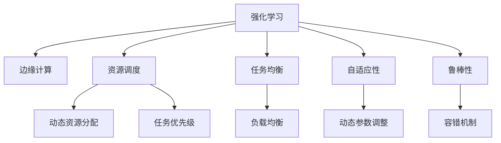
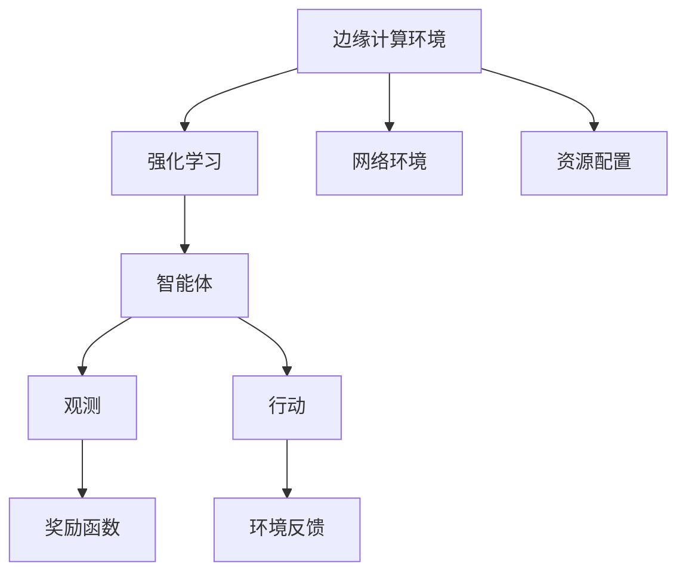
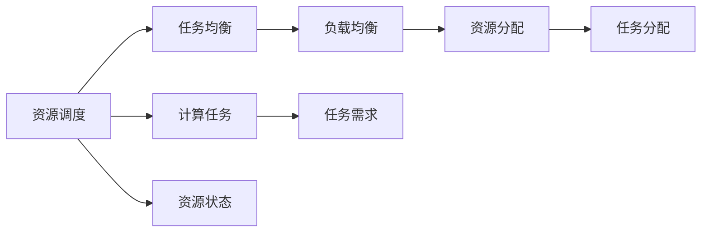
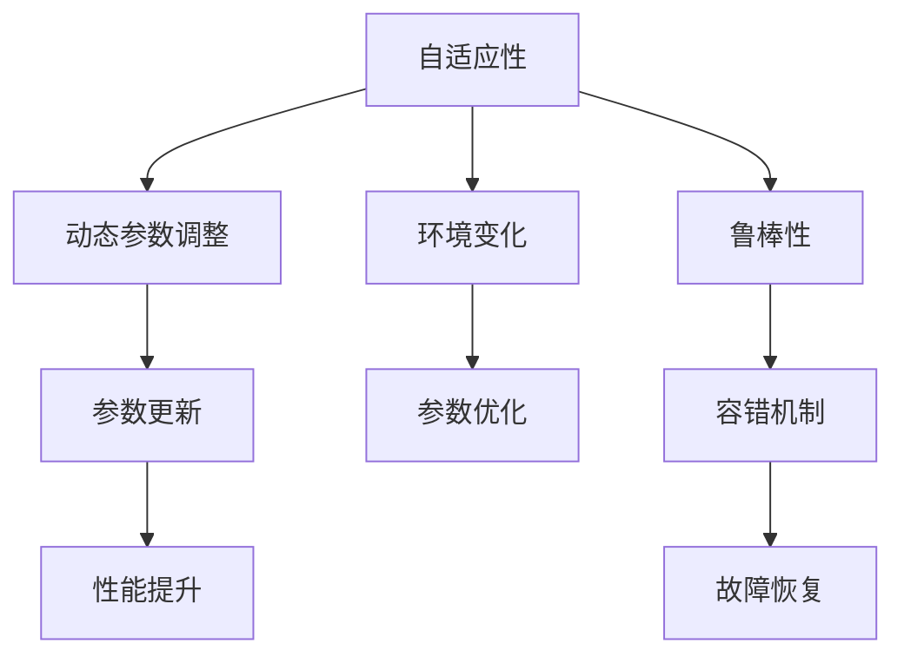
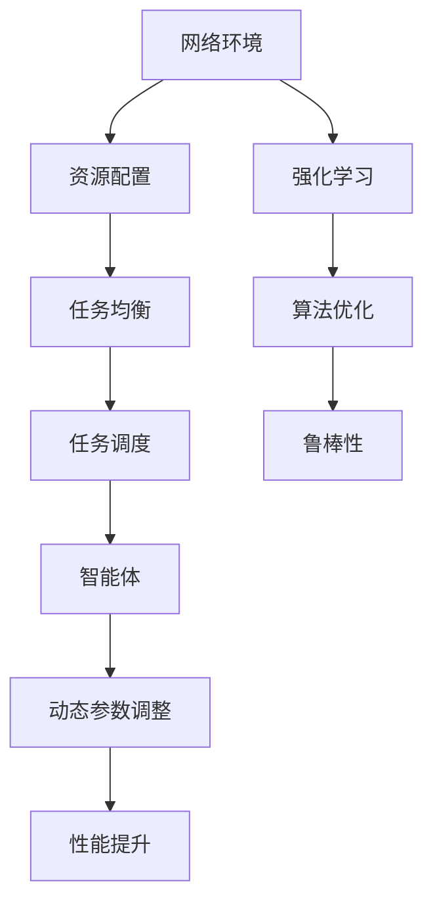

                 

## 1. 背景介绍

### 1.1 问题由来

强化学习（Reinforcement Learning, RL）是人工智能领域的一个重要分支，它通过智能体（agent）与环境（environment）的交互，通过不断的试错和反馈调整，学习最优策略，以达成特定目标。RL被广泛应用于游戏、机器人控制、自然语言处理等领域，并取得了显著的成果。

在边缘计算（Edge Computing）快速发展的背景下，如何利用RL技术提升边缘计算的效率和智能化水平，成为了当前的一个热门研究方向。边缘计算是指在数据源附近进行数据处理和计算，以减少传输延迟，提高数据处理效率。但边缘计算的资源受限，如何利用有限的计算和通信资源，最大化地发挥性能，成为了研究焦点。

### 1.2 问题核心关键点

在边缘计算中，强化学习的关键问题包括：
1. **资源优化**：如何在有限的资源（如计算能力、存储容量、通信带宽等）下，最大化地优化算法性能和用户体验。
2. **任务分配**：如何将计算任务分配到合适的节点，实现任务均衡、资源利用率最大化。
3. **自适应策略**：根据网络环境的变化，动态调整算法参数和策略，适应不同的负载和流量。
4. **鲁棒性**：在资源动态变化、网络环境不确定的情况下，保持算法的稳定性和鲁棒性。

### 1.3 问题研究意义

利用强化学习在边缘计算中的应用，可以显著提升计算资源利用率，优化网络资源配置，提高边缘计算系统的性能和鲁棒性。具体意义包括：

1. **资源优化**：通过智能策略优化计算任务分配和资源调度，提高边缘计算系统的整体效率。
2. **任务均衡**：动态调整任务分配，避免某些节点的过载和资源的浪费，实现负载均衡。
3. **自适应性**：根据实时网络环境和负载变化，自动调整算法参数和资源配置，提升系统适应性。
4. **鲁棒性增强**：在资源和网络环境不确定的情况下，保持算法的稳定性和鲁棒性，避免系统崩溃和性能波动。

强化学习在边缘计算中的应用，有助于构建更加智能、高效、稳定的计算环境，为各种实时应用场景提供有力支持。

## 2. 核心概念与联系

### 2.1 核心概念概述

为更好地理解强化学习在边缘计算中的应用，本节将介绍几个密切相关的核心概念：

- **强化学习**：通过智能体（agent）与环境（environment）的交互，智能体通过不断试错和反馈调整，学习最优策略，以达成特定目标。
- **边缘计算**：在数据源附近进行数据处理和计算，以减少传输延迟，提高数据处理效率。
- **资源调度**：根据任务需求和资源情况，动态调整计算任务分配和资源分配，实现资源最优利用。
- **任务均衡**：在多节点环境下，实现计算任务的均衡分配，避免某些节点的过载和资源的浪费。
- **自适应性**：根据环境变化和任务需求，动态调整算法参数和资源配置，增强系统的适应性。
- **鲁棒性**：在资源和网络环境不确定的情况下，保持算法的稳定性和鲁棒性，避免系统崩溃和性能波动。

这些核心概念之间的逻辑关系可以通过以下Mermaid流程图来展示：



这个流程图展示了一致强化学习、资源调度、任务均衡、自适应性和鲁棒性在边缘计算中的应用，以及它们之间的相互关系。

### 2.2 概念间的关系

这些核心概念之间存在着紧密的联系，形成了强化学习在边缘计算中的应用框架。下面我们通过几个Mermaid流程图来展示这些概念之间的关系。

#### 2.2.1 边缘计算环境下的强化学习



这个流程图展示了边缘计算环境下的强化学习的基本框架，包括网络环境、资源配置、智能体、观测、行动、奖励函数和环境反馈等关键组件。

#### 2.2.2 资源调度和任务均衡



这个流程图展示了资源调度和任务均衡的流程，包括计算任务、资源状态、任务需求、任务分配和资源分配等关键步骤。

#### 2.2.3 自适应性和鲁棒性



这个流程图展示了自适应性和鲁棒性的实现过程，包括动态参数调整、环境变化、参数优化、性能提升和容错机制等关键组件。

### 2.3 核心概念的整体架构

最后，我们用一个综合的流程图来展示这些核心概念在边缘计算中的整体架构：



这个综合流程图展示了从网络环境、资源配置、任务均衡、任务调度、智能体、动态参数调整、性能提升到强化学习和算法优化的完整流程。

## 3. 核心算法原理 & 具体操作步骤

### 3.1 算法原理概述

强化学习在边缘计算中的应用，主要基于强化学习的动态规划算法和策略优化算法。动态规划算法通过模型预测和动态调整，优化计算任务和资源分配。策略优化算法通过智能体的试错和反馈，学习最优策略，提升系统性能。

在边缘计算环境中，强化学习的应用主要包括以下几个方面：

- **任务调度**：通过智能体的试错和反馈，动态调整计算任务的分配，实现任务均衡和资源最优利用。
- **资源优化**：根据计算任务和资源状态，智能体通过动态调整策略，优化资源分配，提升系统性能。
- **自适应性**：根据网络环境的变化，智能体动态调整算法参数，增强系统的适应性。
- **鲁棒性**：通过容错机制和动态参数调整，保持算法的稳定性和鲁棒性，避免系统崩溃和性能波动。

### 3.2 算法步骤详解

强化学习在边缘计算中的应用，一般包括以下几个关键步骤：

**Step 1: 构建计算环境**
- 收集边缘计算节点的计算能力、存储容量、通信带宽等资源信息。
- 定义任务需求的优先级、截止时间和计算资源的需求。

**Step 2: 定义智能体和环境**
- 定义智能体的目标函数，如最大化任务完成率、最小化计算延迟等。
- 定义环境的状态空间和动作空间，状态空间包括资源状态、任务状态和网络状态等，动作空间包括资源分配、任务调度和算法参数调整等。

**Step 3: 定义奖励函数**
- 定义奖励函数，衡量智能体的行为对系统性能的影响。奖励函数可以基于任务完成率、延迟、资源利用率等指标。

**Step 4: 算法训练和优化**
- 使用动态规划或策略优化算法，训练智能体，优化资源调度策略。
- 在训练过程中，通过回溯和探索，优化算法参数和策略，提升系统性能。

**Step 5: 实时调整和反馈**
- 实时监测网络环境、任务状态和资源状态，动态调整智能体的策略和参数。
- 根据实时反馈，优化资源分配和任务调度，提升系统适应性。

**Step 6: 容错和恢复**
- 在资源和网络环境出现异常时，启动容错机制，保障系统的稳定性和鲁棒性。
- 通过动态参数调整和算法优化，快速恢复系统性能，避免系统崩溃。

### 3.3 算法优缺点

强化学习在边缘计算中的应用具有以下优点：
1. **动态优化**：能够根据实时环境和任务需求，动态调整策略和参数，提升系统性能。
2. **自适应性**：能够适应网络环境的变化，实现资源和任务均衡，提升系统适应性。
3. **鲁棒性**：通过容错机制和动态参数调整，保持系统的稳定性和鲁棒性。

同时，强化学习也存在一些缺点：
1. **计算复杂度高**：强化学习算法计算复杂度高，需要大量计算资源。
2. **数据需求大**：需要大量历史数据和实时反馈，用于训练和优化智能体。
3. **学习速度慢**：在复杂环境中，智能体的学习速度较慢，需要较长的训练周期。

### 3.4 算法应用领域

强化学习在边缘计算中的应用领域非常广泛，主要包括以下几个方面：

- **移动边缘计算**：通过智能体的优化，提升移动设备的计算效率和网络性能。
- **工业边缘计算**：通过智能体的优化，实现工业设备的智能监控和优化调度。
- **智慧城市边缘计算**：通过智能体的优化，提升智慧城市的资源利用率和服务效率。
- **医疗边缘计算**：通过智能体的优化，实现医疗设备的智能监测和诊断。
- **车联网边缘计算**：通过智能体的优化，提升车辆通信和导航性能。

## 4. 数学模型和公式 & 详细讲解 & 举例说明

### 4.1 数学模型构建

在边缘计算环境中，强化学习的应用主要基于马尔可夫决策过程（Markov Decision Process, MDP）模型。MDP模型由状态空间、动作空间、奖励函数、转移概率和折扣因子组成。

假设状态空间为 $S$，动作空间为 $A$，奖励函数为 $R(s,a)$，转移概率为 $P(s'|s,a)$，折扣因子为 $\gamma$。则MDP可以表示为 $(S, A, R, P, \gamma)$。

智能体的目标是最大化长期奖励，即求解最优策略 $\pi^*(a|s)$，使得期望的长期奖励最大化：

$$
\max_{\pi} \mathbb{E}_{s \sim \rho, a \sim \pi}[R_0 + \gamma R_1 + \gamma^2 R_2 + \ldots]
$$

其中 $\rho$ 为状态分布，$R_0$ 为起始状态下的奖励。

### 4.2 公式推导过程

以下我们将以计算任务调度和资源优化为例，推导强化学习的应用公式。

假设当前系统状态为 $s_t$，智能体的动作为 $a_t$，系统状态转移为 $s_{t+1}$，奖励为 $r_{t+1}$。则强化学习的目标函数为：

$$
\max_{\pi} \sum_{t=0}^{\infty} \gamma^t R_t
$$

其中 $R_t$ 为智能体在第 $t$ 时刻的奖励，$T$ 为终止状态。

使用动态规划算法，可以将目标函数分解为子问题：

$$
Q^*(s_t,a_t) = \max_{\pi} \sum_{t=0}^{\infty} \gamma^t r_{t+1} + \gamma^{t+1} Q^*(s_{t+1}, \pi(a_{t+1}|s_{t+1}))
$$

其中 $Q^*(s_t,a_t)$ 为在状态 $s_t$ 下，采取动作 $a_t$ 的期望长期奖励。

通过迭代求解，可以得到最优策略 $\pi^*(a|s)$。

### 4.3 案例分析与讲解

下面以一个简单的边缘计算环境为例，说明强化学习的应用过程。

假设在一个由5个计算节点组成的边缘计算环境中，节点具有相同的计算能力和存储容量，但通信带宽不同。当前有3个任务需要计算，每个任务需要2GB的存储和1Gbps的通信带宽。

1. **构建MDP模型**
   - 定义状态空间 $S$：包括所有节点的计算资源状态、通信资源状态和任务状态。
   - 定义动作空间 $A$：包括资源分配、任务调度和算法参数调整等。
   - 定义奖励函数 $R(s,a)$：衡量任务完成率、延迟和资源利用率。
   - 定义转移概率 $P(s'|s,a)$：根据当前状态和动作，计算下一个状态的概率。
   - 定义折扣因子 $\gamma$：衡量长期奖励的重要性。

2. **训练智能体**
   - 使用动态规划算法，训练智能体，优化资源调度策略。
   - 在训练过程中，通过回溯和探索，优化算法参数和策略，提升系统性能。

3. **实时调整和反馈**
   - 实时监测网络环境、任务状态和资源状态，动态调整智能体的策略和参数。
   - 根据实时反馈，优化资源分配和任务调度，提升系统适应性。

4. **容错和恢复**
   - 在资源和网络环境出现异常时，启动容错机制，保障系统的稳定性和鲁棒性。
   - 通过动态参数调整和算法优化，快速恢复系统性能，避免系统崩溃。

## 5. 项目实践：代码实例和详细解释说明

### 5.1 开发环境搭建

在进行强化学习项目实践前，我们需要准备好开发环境。以下是使用Python进行PyTorch和TensorFlow开发的准备步骤：

1. 安装Anaconda：从官网下载并安装Anaconda，用于创建独立的Python环境。
2. 创建并激活虚拟环境：
```bash
conda create -n reinforcement-env python=3.8 
conda activate reinforcement-env
```

3. 安装PyTorch和TensorFlow：根据CUDA版本，从官网获取对应的安装命令。例如：
```bash
conda install pytorch torchvision torchaudio cudatoolkit=11.1 -c pytorch -c conda-forge
conda install tensorflow -c conda-forge
```

4. 安装TensorBoard和Weights & Biases：这两个工具用于可视化训练过程和实验结果。
```bash
pip install tensorboard
pip install weights-bitases
```

完成上述步骤后，即可在`reinforcement-env`环境中开始强化学习实践。

### 5.2 源代码详细实现

下面以一个简单的边缘计算任务调度为例，给出使用PyTorch和TensorFlow进行强化学习的应用代码。

假设我们需要对3个计算任务进行优化调度，每个任务需要的计算资源和通信资源如下：

- 任务1：需要2GB计算资源和2Gbps通信带宽。
- 任务2：需要4GB计算资源和4Gbps通信带宽。
- 任务3：需要8GB计算资源和8Gbps通信带宽。

我们定义一个MDP模型，包括状态空间、动作空间、奖励函数和转移概率。假设每个节点的计算能力和通信带宽如下：

- 节点1：计算能力为10GB，通信带宽为10Gbps。
- 节点2：计算能力为8GB，通信带宽为8Gbps。
- 节点3：计算能力为6GB，通信带宽为6Gbps。
- 节点4：计算能力为4GB，通信带宽为4Gbps。
- 节点5：计算能力为2GB，通信带宽为2Gbps。

使用PyTorch实现强化学习过程，代码如下：

```python
import torch
import torch.nn as nn
import torch.optim as optim
import numpy as np
import gym

class EdgeMDP:
    def __init__(self):
        self.states = ['idle', 'task1', 'task2', 'task3', 'task1_done', 'task2_done', 'task3_done']
        self.actions = ['idle', 'task1', 'task2', 'task3']
        self.reward_table = {'idle': 0, 'task1': -1, 'task2': -1, 'task3': -1, 'task1_done': 0, 'task2_done': 0, 'task3_done': 0}
        self_transition_table = {'idle': {'idle': 0.8, 'task1': 0.1, 'task2': 0.1}, 
                                'task1': {'idle': 0.2, 'task1': 0.8, 'task2': 0.1, 'task3': 0.1}, 
                                'task2': {'idle': 0.2, 'task1': 0.1, 'task2': 0.8, 'task3': 0.1}, 
                                'task3': {'idle': 0.2, 'task1': 0.1, 'task2': 0.1, 'task3': 0.8}, 
                                'task1_done': {'idle': 0.2, 'task1': 0.8, 'task2': 0.1, 'task3': 0.1}, 
                                'task2_done': {'idle': 0.2, 'task1': 0.1, 'task2': 0.8, 'task3': 0.1}, 
                                'task3_done': {'idle': 0.2, 'task1': 0.1, 'task2': 0.1, 'task3': 0.8}}
        self.gamma = 0.9

    def get_state(self, state):
        if state == 'idle':
            return 0
        elif state == 'task1':
            return 1
        elif state == 'task2':
            return 2
        elif state == 'task3':
            return 3
        elif state == 'task1_done':
            return 4
        elif state == 'task2_done':
            return 5
        elif state == 'task3_done':
            return 6

    def get_action(self, state):
        return np.random.choice(self.actions)

    def get_reward(self, state, action):
        return self.reward_table.get(state, 0) + self.reward_table.get(action, 0)

    def get_state_value(self, state):
        return 0

    def get_next_state(self, state, action, reward):
        return self.states[np.random.choice([self.states.index(x) for x in self.states if x in self.transition_table.get(state, [])])]

class Policy(nn.Module):
    def __init__(self):
        super(Policy, self).__init__()
        self.linear1 = nn.Linear(1, 4)
        self.linear2 = nn.Linear(4, 3)

    def forward(self, x):
        x = F.relu(self.linear1(x))
        x = self.linear2(x)
        x = F.softmax(x, dim=1)
        return x

class Environment:
    def __init__(self, model, discount_factor=0.9):
        self.model = model
        self.discount_factor = discount_factor
        self.state = 'idle'
        self.actions = ['idle', 'task1', 'task2', 'task3']
        self.reward_table = {'idle': 0, 'task1': -1, 'task2': -1, 'task3': -1, 'task1_done': 0, 'task2_done': 0, 'task3_done': 0}
        self.transition_table = {'idle': {'idle': 0.8, 'task1': 0.1, 'task2': 0.1}, 
                                'task1': {'idle': 0.2, 'task1': 0.8, 'task2': 0.1, 'task3': 0.1}, 
                                'task2': {'idle': 0.2, 'task1': 0.1, 'task2': 0.8, 'task3': 0.1}, 
                                'task3': {'idle': 0.2, 'task1': 0.1, 'task2': 0.1, 'task3': 0.8}, 
                                'task1_done': {'idle': 0.2, 'task1': 0.8, 'task2': 0.1, 'task3': 0.1}, 
                                'task2_done': {'idle': 0.2, 'task1': 0.1, 'task2': 0.8, 'task3': 0.1}, 
                                'task3_done': {'idle': 0.2, 'task1': 0.1, 'task2': 0.1, 'task3': 0.8}}
        self.gamma = 0.9

    def step(self, action):
        if action == 'idle':
            self.state = 'idle'
            return 0, self.state
        elif action == 'task1':
            self.state = 'task1'
            return -1, self.state
        elif action == 'task2':
            self.state = 'task2'
            return -1, self.state
        elif action == 'task3':
            self.state = 'task3'
            return -1, self.state
        elif self.state == 'task1':
            self.state = 'task1_done'
            return 0, self.state
        elif self.state == 'task2':
            self.state = 'task2_done'
            return 0, self.state
        elif self.state == 'task3':
            self.state = 'task3_done'
            return 0, self.state

    def reset(self):
        self.state = 'idle'
        return self.state

    def render(self):
        print(self.state)

class DQN(nn.Module):
    def __init__(self, state_size, action_size, learning_rate):
        super(DQN, self).__init__()
        self.input_size = state_size
        self.output_size = action_size
        self.learning_rate = learning_rate
        self.fc1 = nn.Linear(self.input_size, 64)
        self.fc2 = nn.Linear(64, 64)
        self.fc3 = nn.Linear(64, self.output_size)

    def forward(self, x):
        x = F.relu(self.fc1(x))
        x = F.relu(self.fc2(x))
        return self.fc3(x)

class ReinforcementLearning:
    def __init__(self, model, environment, discount_factor=0.9, learning_rate=0.01, batch_size=4):
        self.model = model
        self.environment = environment
        self.discount_factor = discount_factor
        self.learning_rate = learning_rate
        self.batch_size = batch_size
        self.memory = deque(maxlen=2000)

    def train(self, episodes=1000):
        for episode in range(episodes):
            state = self.environment.reset()
            done = False
            while not done:
                action = np.random.choice(self.environment.actions)
                next_state, reward = self.environment.step(action)
                self.memory.append((state, action, reward, next_state, done))
                state = next_state
                if not done:
                    yield state, action, reward, next_state, done

    def train_policy(self, episodes=1000):
        for episode in range(episodes):
            state = self.environment.reset()
            done = False
            while not done:
                if len(self.memory) > self.batch_size:
                    minibatch = np.random.choice(len(self.memory), size=self.batch_size, replace=False)
                    minibatch = [self.memory[i] for i in minibatch]
                    minibatch = tuple(zip(*minibatch))
                else:
                    minibatch = self.memory
                inputs = torch.tensor(minibatch[0], dtype=torch.float)
                targets = torch.tensor(minibatch[1], dtype=torch.float)
                Q_targets_next = self.model(inputs[0].unsqueeze(0))
                Q_values = self.model(inputs[1].unsqueeze(0))
                for x, y in minibatch[3:5]:
                    Q_values = Q_values.select(1, self.environment.get_state_value(x))
                Q_values = (1 - self.discount_factor) * Q_values + targets
                Q_values = Q_values.detach()
                Q_values.requires_grad_()
                loss = F.mse_loss(Q_values, self.model(inputs[0].unsqueeze(0)))
                loss.backward()
                self.optimizer.zero_grad()
                self.model.train()
                yield loss

    def test_policy(self, episodes=100):
        for episode in range(episodes):
            state = self.environment.reset()
            done = False
            while not done:
                action = np.random.choice(self.environment.actions)
                next_state, reward = self.environment.step(action)
                state = next_state
                if not done:
                    self.environment.render()
                    yield state

    def evaluate(self, episodes=100):
        total_reward = 0
        for episode in range(episodes):
            state = self.environment.reset()
            done = False
            while not done:
                action = self.model(torch.tensor([state], dtype=torch.float)).argmax().item()
                next_state, reward = self.environment.step(self.actions[action])
                total_reward += reward
                state = next_state
                if not done:
                    self.environment.render()
        return total_reward / episodes

# 使用PyTorch实现强化学习过程
state_size = 1
action_size = 4
learning_rate = 0.01
discount_factor = 0.9
batch_size = 4
num_episodes = 1000
num_steps_per_episode = 100

model = DQ

