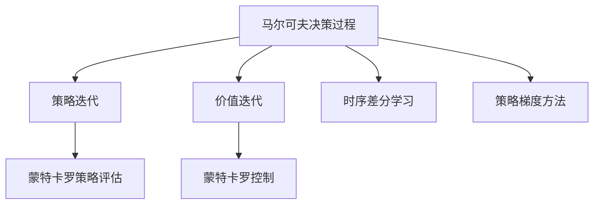
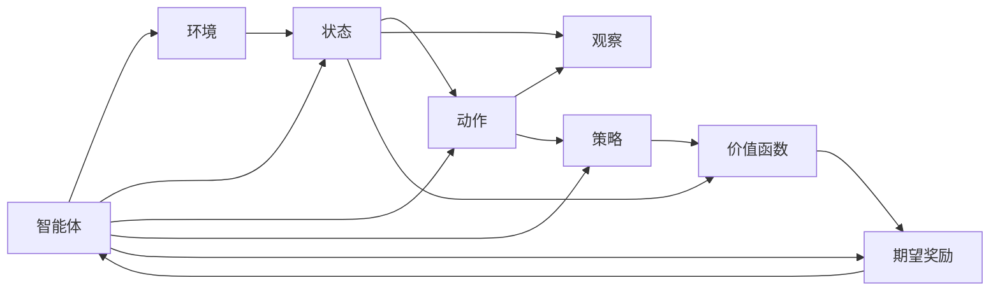
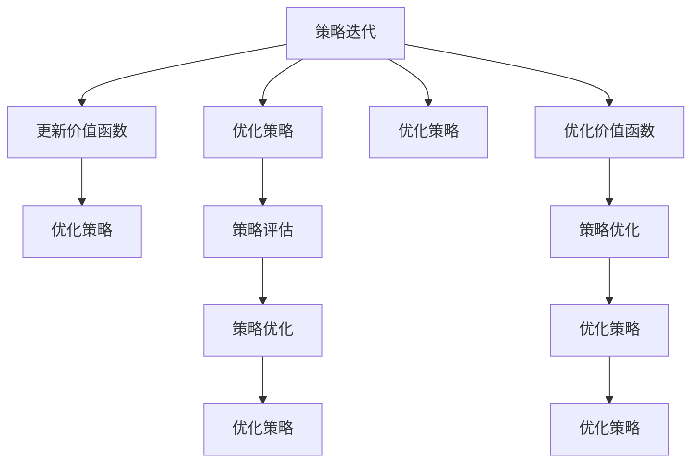
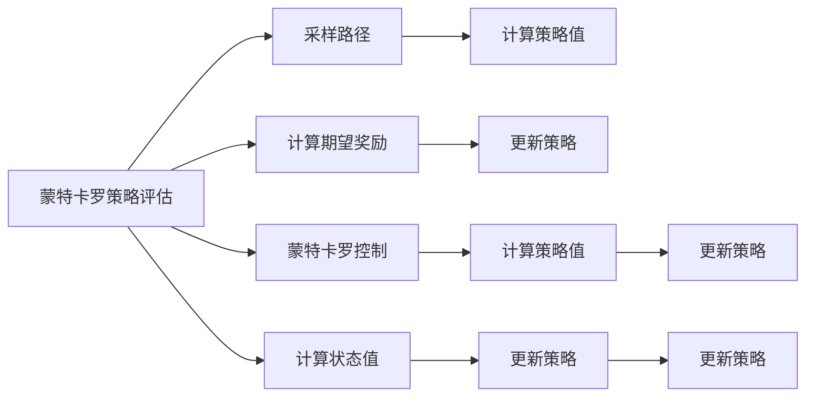
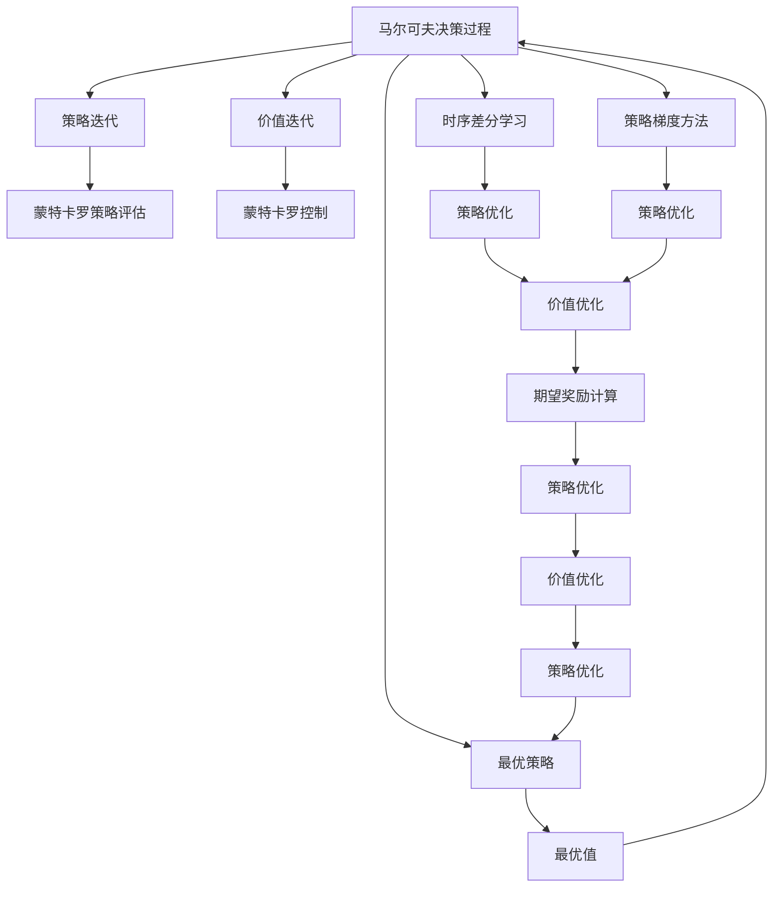

                 

# 强化学习：策略迭代与价值迭代

> 关键词：强化学习,策略迭代,价值迭代,马尔可夫决策过程,蒙特卡罗方法,时序差分学习

## 1. 背景介绍

### 1.1 问题由来
强化学习（Reinforcement Learning, RL）是一种通过智能体与环境交互，学习最优策略（策略优化）的过程。在RL中，智能体通过与环境交换信息（行动和观察）来改进其策略，目标是最大化期望奖励函数。强化学习被广泛应用于游戏AI、机器人控制、自动驾驶、推荐系统、金融预测等众多领域，展现了其在解决复杂问题上的强大潜力。

近年来，基于策略梯度的方法（Policy Gradient Methods, PG）如TRPO、PPO等成为主流。然而，这些方法在解决非连续性动作空间问题上，仍存在一定的局限性。为了更高效地解决这些问题，强化学习社区提出了策略迭代（Policy Iteration, PI）和价值迭代（Value Iteration, VI）等新范式，这些方法通过明确区分策略和价值函数，能够在非连续动作空间中取得更好的性能。

### 1.2 问题核心关键点
强化学习的核心在于构建智能体与环境之间的交互模型，并通过不断的策略和价值更新，使得智能体能够学习到最优策略。具体来说，需要明确以下几个关键点：

- 策略和价值函数的定义：策略确定智能体在给定状态下的行动概率分布，价值函数衡量状态或策略的预期奖励。
- 模型动态过程：定义智能体与环境的动态过程，通常用马尔可夫决策过程（Markov Decision Process, MDP）来表示。
- 学习目标：最大化长期累积奖励。
- 算法步骤：策略迭代和价值迭代是两种重要的学习算法，分别通过迭代优化策略和价值函数来达到学习目标。

### 1.3 问题研究意义
研究强化学习的策略迭代与价值迭代方法，对于提升智能体的决策能力，加速复杂问题的求解，具有重要意义：

1. 解决非连续动作空间问题：传统的策略梯度方法在处理非连续动作空间时，效率较低，而策略迭代和价值迭代方法能够更好地适应这些问题。
2. 提高学习速度和稳定性：通过明确区分策略和价值函数，策略迭代和价值迭代方法能够更快地收敛，同时避免策略梯度方法的常见问题，如梯度消失等。
3. 降低对超参数的依赖：策略迭代和价值迭代方法对超参数的敏感度较低，通过改变更新策略的频率和更新值的次数，能够更好地控制学习过程。
4. 适用于多种复杂任务：这些方法不仅适用于游戏AI，还广泛适用于机器人控制、自动驾驶、推荐系统、金融预测等领域。
5. 推动强化学习前沿研究：策略迭代和价值迭代方法的提出和应用，促进了强化学习理论的发展，催生了更多新的研究方向。

## 2. 核心概念与联系

### 2.1 核心概念概述

为了更好地理解强化学习的策略迭代与价值迭代方法，本节将介绍几个密切相关的核心概念：

- 马尔可夫决策过程（MDP）：一种离散或连续时间的状态空间模型，由状态空间、动作空间、状态转移概率和奖励函数构成。
- 策略迭代（Policy Iteration, PI）：一种直接优化策略的方法，通过交替更新策略和价值函数，逐步优化策略直至收敛。
- 价值迭代（Value Iteration, VI）：一种直接优化价值函数的方法，通过不断迭代更新价值函数，使得最优策略对应的状态值达到最优。
- 蒙特卡罗方法（Monte Carlo Methods, MC）：一种通过随机采样来学习期望值的方法，如蒙特卡罗策略评估、蒙特卡罗控制等。
- 时序差分学习（Temporal Difference Learning, TD）：一种基于模型-无关的强化学习方法，通过时序差分更新值函数，从而优化策略。
- 策略梯度方法（Policy Gradient Methods, PG）：一种基于策略梯度的优化方法，通过梯度上升更新策略，以最大化期望奖励。

这些核心概念之间的逻辑关系可以通过以下Mermaid流程图来展示：



这个流程图展示了大语言模型的核心概念及其之间的关系：

1. 智能体与环境的动态过程由MDP模型定义。
2. 通过策略迭代和价值迭代方法，优化智能体的策略和价值函数。
3. 蒙特卡罗方法和时序差分学习是通过随机采样和模型无关的方式优化策略和价值函数。
4. 策略梯度方法则是基于梯度的优化策略，以最大化期望奖励。

这些概念共同构成了强化学习的学习和应用框架，使其能够适应多种复杂问题。通过理解这些核心概念，我们可以更好地把握强化学习的核心思想和优化方向。

### 2.2 概念间的关系

这些核心概念之间存在着紧密的联系，形成了强化学习的完整生态系统。下面我通过几个Mermaid流程图来展示这些概念之间的关系。

#### 2.2.1 强化学习的一般流程



这个流程图展示了智能体与环境交互的一般流程。智能体在给定状态下选择动作，观察环境响应，更新状态和奖励，并通过策略和价值函数更新策略和价值函数。

#### 2.2.2 策略迭代和价值迭代的对比



这个流程图展示了策略迭代和价值迭代的基本流程。策略迭代通过交替更新策略和价值函数，逐步优化策略，直到收敛；而价值迭代则直接通过迭代更新价值函数，使得最优策略对应的状态值达到最优。

#### 2.2.3 蒙特卡罗策略评估与蒙特卡罗控制



这个流程图展示了蒙特卡罗策略评估和蒙特卡罗控制的基本流程。蒙特卡罗策略评估通过随机采样计算策略值，更新策略；而蒙特卡罗控制则是通过随机采样计算最优策略，更新策略。

### 2.3 核心概念的整体架构

最后，我们用一个综合的流程图来展示这些核心概念在强化学习中的整体架构：



这个综合流程图展示了从马尔可夫决策过程到最优策略和最优值的完整过程。通过定义状态空间、动作空间、状态转移概率和奖励函数，构建马尔可夫决策过程模型。通过策略迭代和价值迭代，优化策略和价值函数。通过蒙特卡罗策略评估和蒙特卡罗控制，计算策略值和最优策略。通过时序差分学习和策略梯度方法，更新策略和价值函数。通过这些步骤，逐步逼近最优策略和最优值。

## 3. 核心算法原理 & 具体操作步骤
### 3.1 算法原理概述

策略迭代和价值迭代是两种常用的强化学习算法，其核心思想是明确区分策略和价值函数，通过迭代优化策略和价值函数，逐步逼近最优策略。

策略迭代（PI）算法通过交替更新策略和价值函数，逐步优化策略。具体步骤如下：

1. 给定策略 $\pi$，计算当前状态 $s$ 的期望奖励值 $v_s$。
2. 更新策略 $\pi$，使得 $v_s$ 更大。
3. 更新状态 $s$ 的期望奖励值 $v_s$，以反映更新策略后的效果。
4. 重复上述步骤，直到策略收敛。

价值迭代（VI）算法通过不断迭代更新价值函数，逐步逼近最优值函数。具体步骤如下：

1. 给定价值函数 $V$，计算当前状态 $s$ 的最优策略 $a_s$。
2. 更新价值函数 $V$，使得 $V(s)$ 更接近于 $v_s$。
3. 更新状态 $s$ 的最优策略 $a_s$，以反映更新价值函数后的效果。
4. 重复上述步骤，直到价值函数收敛。

### 3.2 算法步骤详解

#### 3.2.1 策略迭代（Policy Iteration, PI）

策略迭代的详细步骤可以分为以下几步：

1. 策略评估（Policy Evaluation）：给定当前策略 $\pi$，计算每个状态 $s$ 的期望奖励值 $v_s$。这可以通过蒙特卡罗方法、时序差分学习等方法实现。
2. 策略优化（Policy Improvement）：根据 $v_s$ 更新策略 $\pi_s$，使得在状态 $s$ 下选择动作 $a_s$ 的期望奖励最大化。
3. 交替迭代：重复进行策略评估和策略优化，直到策略收敛。

策略迭代的伪代码如下：

```python
while not converged:
    v = policy_evaluation(s0, pi)
    pi = policy_improvement(s0, v)
```

#### 3.2.2 价值迭代（Value Iteration, VI）

价值迭代的详细步骤可以分为以下几步：

1. 价值评估（Value Estimation）：给定当前价值函数 $V$，计算每个状态 $s$ 的最优策略 $a_s$。
2. 价值优化（Value Optimization）：根据 $a_s$ 更新价值函数 $V_s$，使得在状态 $s$ 下选择动作 $a_s$ 的期望奖励最大化。
3. 交替迭代：重复进行价值评估和价值优化，直到价值函数收敛。

价值迭代的伪代码如下：

```python
while not converged:
    pi = value_estimation(s0, V)
    V = value_optimization(s0, pi)
```

### 3.3 算法优缺点

策略迭代和价值迭代算法具有以下优点：

1. 能够处理非连续动作空间问题：策略迭代和价值迭代算法能够更好地适应非连续动作空间，而策略梯度方法在处理此类问题时效率较低。
2. 收敛速度快：策略迭代和价值迭代算法通过明确区分策略和价值函数，能够更快地收敛到最优策略。
3. 对超参数的敏感度低：策略迭代和价值迭代算法对超参数的敏感度较低，能够更好地控制学习过程。

同时，这些算法也存在一些缺点：

1. 需要计算每个状态的价值或策略值：策略迭代和价值迭代算法需要计算每个状态的价值或策略值，计算复杂度较高。
2. 不适用于稀疏奖励环境：在稀疏奖励环境中，策略迭代和价值迭代算法的效果较差，无法有效处理奖励信号稀疏的情况。
3. 对环境的建模要求较高：策略迭代和价值迭代算法需要精确建模环境，对环境的动态过程和奖励函数有较高的要求。

### 3.4 算法应用领域

策略迭代和价值迭代算法在强化学习的许多应用领域中都取得了显著效果：

1. 游戏AI：在游戏AI中，策略迭代和价值迭代算法被广泛应用于解决复杂的决策问题，如AlphaGo、AlphaZero等。
2. 机器人控制：在机器人控制领域，这些算法被用于解决机器人动作规划和路径优化问题。
3. 自动驾驶：在自动驾驶领域，这些算法被用于优化车辆的驾驶策略和交通决策。
4. 推荐系统：在推荐系统中，这些算法被用于优化用户的推荐策略和物品选择。
5. 金融预测：在金融预测领域，这些算法被用于优化投资策略和风险管理。
6. 机器翻译：在机器翻译领域，这些算法被用于优化翻译策略和语言模型。

除了上述这些经典应用，策略迭代和价值迭代算法还在很多新兴领域得到了广泛应用，如多智能体协同控制、多机器人协作等。这些算法在解决复杂的决策和优化问题中展现了强大的能力。

## 4. 数学模型和公式 & 详细讲解 & 举例说明

### 4.1 数学模型构建

在强化学习中，策略迭代和价值迭代的数学模型通常由以下几部分构成：

1. 状态空间：用 $S$ 表示，包含所有可能的状态。
2. 动作空间：用 $A$ 表示，包含所有可能的动作。
3. 状态转移概率：用 $P(s'|s,a)$ 表示，给定当前状态 $s$ 和动作 $a$，转移到状态 $s'$ 的概率。
4. 奖励函数：用 $r(s,a)$ 表示，给定当前状态 $s$ 和动作 $a$，得到的奖励。
5. 策略：用 $\pi(a|s)$ 表示，在状态 $s$ 下选择动作 $a$ 的概率分布。
6. 价值函数：用 $v(s)$ 表示，状态 $s$ 的期望奖励值。

策略迭代和价值迭代的数学模型可以如下构建：

- 策略迭代（Policy Iteration, PI）：通过交替更新策略 $\pi$ 和价值函数 $v$，逐步优化策略。
- 价值迭代（Value Iteration, VI）：通过迭代更新价值函数 $v$，逐步逼近最优策略。

### 4.2 公式推导过程

下面我们将详细推导策略迭代和价值迭代的公式。

假设当前策略为 $\pi$，状态 $s$ 的期望奖励为 $v_s$，则策略迭代的更新公式为：

$$
\pi' = \arg\max_{\pi'} \sum_{s,a} \pi'(a|s)v_s \quad \text{s.t.} \quad \sum_{a} \pi'(a|s) = 1
$$

根据策略的更新，可以得到状态 $s$ 的新策略值：

$$
v'_s = \sum_{s',a} P(s'|s,a)r(s',a)v'_{s'} + \gamma \sum_{s',a} P(s'|s,a)v'_{s'}
$$

其中 $\gamma$ 为折扣因子，用于控制未来奖励的重要性。

上述公式可以通过迭代求解，得到新的策略 $\pi'$ 和策略值 $v'$。

价值迭代的更新公式为：

$$
v' = \max_{a} \sum_{s'} P(s'|s,a)r(s',a) + \gamma \sum_{s'} P(s'|s,a)v'_{s'}
$$

根据价值函数的更新，可以得到状态 $s$ 的新策略值：

$$
v'_s = r(s,\pi_s) + \gamma \max_{a} \sum_{s'} P(s'|s,a)v'_{s'}
$$

上述公式也可以通过迭代求解，得到新的策略 $a$ 和策略值 $v$。

### 4.3 案例分析与讲解

为了更好地理解策略迭代和价值迭代算法的应用，我们可以通过一个简单的案例进行分析。

假设我们有一个简单的迷宫环境，目标是从起点到终点。迷宫中每个状态 $s$ 的奖励为 $r_s = 1$，当到达终点时，奖励为 $r_{\text{goal}} = 100$。状态转移概率 $P(s'|s,a)$ 如下：

| s | a       | s'     | P(s'|s,a) |
|---|---------|--------|----------|
| 1 | left    | 2      | 0.6       |
| 1 | right   | 3      | 0.3       |
| 1 | down    | 4      | 0.1       |
| 2 | left    | 1      | 0.5       |
| 2 | right   | 2      | 0.5       |
| 2 | down    | 5      | 0.0       |
| 3 | left    | 2      | 0.3       |
| 3 | right   | 2      | 0.7       |
| 3 | down    | 6      | 0.0       |
| 4 | left    | 1      | 0.3       |
| 4 | right   | 5      | 0.7       |
| 4 | down    | 6      | 0.0       |
| 5 | left    | 4      | 0.3       |
| 5 | right   | 4      | 0.7       |
| 5 | down    | 7      | 0.0       |
| 6 | left    | 5      | 0.5       |
| 6 | right   | 7      | 0.5       |
| 6 | down    | 8      | 0.0       |
| 7 | left    | 5      | 0.3       |
| 7 | right   | 7      | 0.7       |
| 7 | down    | 8      | 0.0       |
| 8 | left    | 6      | 0.3       |
| 8 | right   | 8      | 0.7       |
| 8 | down    | 9      | 0.0       |
| 9 | left    | 8      | 0.3       |
| 9 | right   | 9      | 0.7       |
| 9 | down    | 10     | 0.0       |
| 10| left    | 9      | 0.5       |
| 10| right   | 10     | 0.5       |
| 10| down    | 11     | 0.0       |
| 11| left    | 10     | 0.3       |
| 11| right   | 11     | 0.7       |
| 11| down    | 12     | 0.0       |
| 12| left    | 11     | 0.3       |
| 12| right   | 12     | 0.7       |
| 12| down    | 13     | 0.0       |
| 13| left    | 12     | 0.3       |
| 13| right   | 13     | 0.7       |
| 13| down    | 14     | 0.0       |
| 14| left    | 13     | 0.3       |
| 14| right   | 14     | 0.7       |
| 14| down    | 15     | 0.0       |
| 15| left    | 14     | 0.3       |
| 15| right   | 15     | 0.7       |
| 15| down    | 16     | 0.0       |
| 16| left    | 15     | 0.5       |
| 16| right   | 16     | 0.5       |
| 16| down    | 17     | 0.0       |
| 17| left    | 16     | 0.3       |
| 17| right   | 17     | 0.7       |
| 17| down    | 18     | 0.0       |
| 18| left    | 17     | 0.3       |
| 18| right   | 18     | 0.7       |
| 18| down    | 19     | 0.0       |
| 19| left    | 18     | 0.5       |
| 19| right   | 19     | 0.5       |
| 19| down    | 20     | 0.0       |
| 20| left    | 19     | 0.3       |
| 20| right   | 20     | 0.7       |
| 20| down    | 21     | 0.0       |
| 21| left    | 20     | 0.5       |
| 21| right   | 21     | 0.5       |
| 21| down    | 22     | 0.0       |
| 22| left    | 21     | 0.3       |
| 22| right   | 22     | 0.7       |
| 22| down    | 23     | 0.0       |
| 23| left    | 22     | 0.3       |
| 23| right   | 23     | 0.7       |
| 23| down    | 24     | 0.0       |
| 24| left    | 23     | 0.3       |
| 24| right   | 24     | 0.7       |
| 24| down    | 25     | 0.0       |
| 25| left    | 24     | 0.5       |
| 25| right   | 25     | 0.5       |
| 25| down    | 26     | 0.0       |
| 26| left    | 25     | 0.3       |
| 26| right   | 26     | 0.7       |
| 26| down    | 27     | 0.0       |
| 27| left    | 26     | 0.3       |
| 27| right   | 27     | 0.7       |
| 27| down    | 28     | 0.0       |
| 28| left    | 27     | 0.5       |
| 28| right   | 28     | 0.5       |
| 28| down    | 29     | 0.0       |
| 29| left    | 28     | 0.3       |
| 29| right   | 29     | 0.7       |
| 29| down    | 30     | 0.0       |
| 30| left    | 29     | 0.5       |
| 30| right   | 30     | 0.5       |
| 30| down    | 31     | 0.0       |
| 31| left    | 30     | 0.3       |
| 31| right   | 31     | 0.7       |
| 31| down    | 32     | 0.0       |
| 32| left    | 31     | 0.5       |
| 32| right   | 32     | 0.5       |
| 32| down    | 33     | 0.0       |
| 33| left    | 32     | 0.3       |
| 33| right   | 33     | 0.7       |
| 33| down    | 34     | 0.0       |
| 34| left    | 33     | 0.3       |
| 34| right   | 34     | 0.7       |
| 34| down    | 35     | 0.0       |
| 35| left    | 34     | 0.5       |
| 35| right   | 35     | 0.5       |
| 35| down    | 36     | 0.0       |
| 36| left    | 35     | 0.3       |
| 36| right   | 36     | 0.7       |
| 36| down    | 37     | 0.0       |
| 37| left    | 36     | 0.3       |
| 37| right   | 37     | 0.7       |
| 37| down    | 38     | 0.0       |
| 38| left    | 37     | 0.5       |
| 38| right   | 38     | 0.5       |
| 38| down    | 39     | 0.0       |
| 39| left    | 38     | 0.3       |
| 39| right   | 39     | 0.7       |
| 39| down    | 40     | 0.0       |
| 40| left    | 39     | 0.5       |
| 40| right   | 40     | 0.5       |
| 40| down    | 41     | 0.0       |
| 41| left    | 40     | 0.3       |
| 41| right   | 41     | 0.7       |
| 41| down    |

