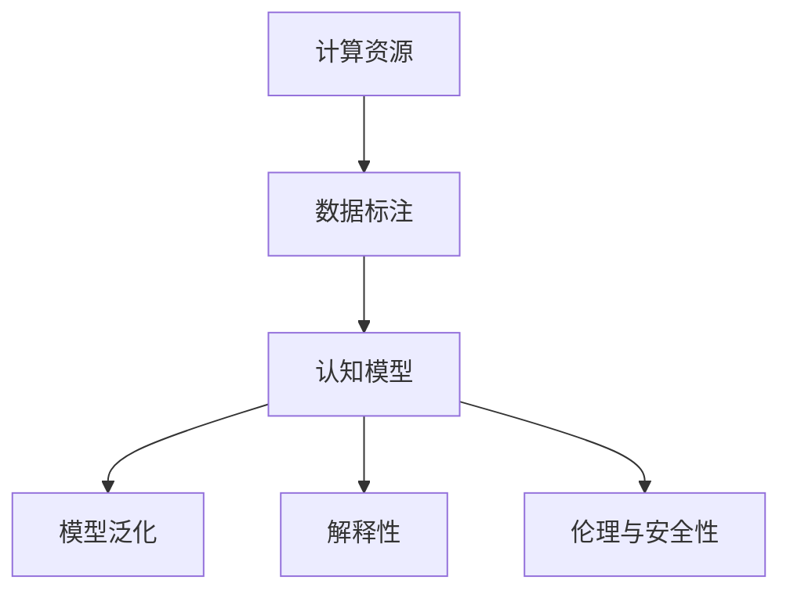

                 

# 当前AI的挑战：认知模型复杂性

## 1. 背景介绍

### 1.1 问题由来

随着人工智能技术的发展，认知模型的复杂性不断提升。这导致模型需要更强大的计算资源和更多的高质量数据来进行训练和优化。然而，现有的计算硬件和数据收集能力还远远无法满足这些需求，使得模型训练变得困难且昂贵。

### 1.2 问题核心关键点

当前AI面临的主要挑战包括：

- **计算资源不足**：高复杂度的认知模型需要大量的计算资源，而现有的硬件设施难以支持。
- **数据获取困难**：高质量的标注数据难以获取，特别是在新兴领域和长尾数据中。
- **模型泛化能力有限**：尽管复杂模型能够在小规模数据上取得优异表现，但在实际应用中，模型往往无法很好地泛化到未见过的数据。
- **模型解释性不足**：深度学习模型的决策过程通常不透明，难以理解和解释其内部机制。
- **伦理与安全性问题**：认知模型可能带有偏见，对社会产生不利影响，同时缺乏必要的数据保护措施。

这些挑战迫切需要我们在模型设计、训练优化、应用落地等方面进行突破，以实现AI技术的可持续发展和广泛应用。

## 2. 核心概念与联系

### 2.1 核心概念概述

为更好地理解当前AI面临的挑战，本节将介绍几个核心概念及其相互联系：

- **认知模型**：使用神经网络等技术，模拟人类认知过程，进行模式识别、决策推理等任务。复杂认知模型通常具有深度和宽度两个维度的增长。
- **计算资源**：包括CPU、GPU、TPU等硬件设备，以及数据中心、云计算平台等基础设施。
- **数据标注**：通过人工标注，为机器学习模型提供训练样本，标签数据的质量直接影响模型的性能。
- **模型泛化**：指模型在新数据上的表现，即能否适应未知数据和变化的环境。
- **解释性**：指模型的决策过程是否可解释，是否容易理解。
- **伦理与安全性**：涉及模型是否对社会有益，是否存在偏见、歧视等问题。

这些概念之间存在着紧密的联系，共同构成了当前AI技术面临的复杂局面。

### 2.2 概念间的关系

这些核心概念之间的关系可以通过以下Mermaid流程图来展示：



这个流程图展示了从计算资源到模型泛化，再到解释性和伦理安全性的整体架构：

1. 计算资源为数据标注提供了基础设施支持。
2. 数据标注是模型训练的必要前提。
3. 认知模型通过数据标注进行训练，并在实际应用中体现其泛化能力。
4. 模型的解释性有助于理解其决策过程，进而提升伦理与安全性。

## 3. 核心算法原理 & 具体操作步骤

### 3.1 算法原理概述

当前AI面临的挑战，本质上源于认知模型的复杂性与计算资源的有限性之间的矛盾。解决这一矛盾需要从模型设计、训练优化、数据标注等方面入手，优化模型性能，提高计算效率。

### 3.2 算法步骤详解

以下详细介绍解决当前AI挑战的三个关键步骤：

**Step 1: 模型设计与优化**

1. **模型压缩与量化**：通过剪枝、量化等技术减少模型参数和计算量，提升模型的计算效率。
2. **分布式训练**：利用分布式计算资源，加速模型训练，同时提高系统的稳定性。
3. **多任务学习**：通过联合训练多个相关任务，提升模型的泛化能力。

**Step 2: 数据获取与标注**

1. **数据增强**：通过数据增强技术，扩充训练集，提高模型泛化能力。
2. **自动化标注**：利用人工智能技术自动生成标注数据，减少人工标注成本。
3. **无监督学习**：在无标签数据上进行自我训练，探索数据的内在结构。

**Step 3: 模型部署与维护**

1. **推理优化**：通过模型裁剪、量化等技术，减少推理过程中的资源消耗。
2. **安全监控**：建立模型安全监控系统，检测并修复模型漏洞，确保模型鲁棒性。
3. **持续学习**：利用在线数据持续更新模型，保持模型与现实世界的一致性。

### 3.3 算法优缺点

#### 3.3.1 模型设计与优化

**优点**：

- 提高模型计算效率，减少硬件成本。
- 降低对计算资源的依赖，适应多样化场景。

**缺点**：

- 模型压缩和量化可能降低模型的精度。
- 多任务学习可能增加模型复杂度。

#### 3.3.2 数据获取与标注

**优点**：

- 扩充数据集，提高模型泛化能力。
- 自动化标注减少人工成本，提高标注效率。

**缺点**：

- 数据增强可能引入噪声，影响模型效果。
- 自动化标注可能存在误标，影响模型精度。

#### 3.3.3 模型部署与维护

**优点**：

- 减少推理资源消耗，降低部署成本。
- 安全监控保障模型鲁棒性，提升系统可靠性。

**缺点**：

- 推理优化可能导致模型精度下降。
- 持续学习需要大量数据支持，成本较高。

### 3.4 算法应用领域

当前AI的认知模型复杂性挑战，广泛存在于各个应用领域：

- **医疗诊断**：认知模型需要处理大量医学影像数据，并具有高度解释性，以辅助医生诊断。
- **金融风控**：模型需要在海量交易数据中进行预测，并具备高安全性，以防范欺诈。
- **自动驾驶**：模型需要在实时数据中进行决策，具有高度鲁棒性和实时性，以确保行车安全。
- **推荐系统**：模型需要在用户行为数据中寻找模式，具有高效率和低延迟，以提供个性化推荐。

## 4. 数学模型和公式 & 详细讲解 & 举例说明

### 4.1 数学模型构建

设认知模型为 $M(\theta)$，其中 $\theta$ 为模型参数。模型泛化能力可以用泛化误差 $\epsilon$ 来衡量，即：

$$
\epsilon = \mathbb{E}[\|M(\theta) - y\|^2]
$$

其中 $y$ 为真实标签。

### 4.2 公式推导过程

以下是泛化误差公式的推导过程：

1. 假设训练集为 $D_{train} = \{(x_i, y_i)\}_{i=1}^n$，其中 $x_i$ 为输入，$y_i$ 为标签。
2. 通过最大化似然函数，对参数 $\theta$ 进行训练，得到最优参数 $\theta^*$。
3. 泛化误差 $\epsilon$ 可表示为：

$$
\epsilon = \mathbb{E}[\|M(\theta^*) - y\|^2]
$$

通过最大化训练集似然函数，得到 $\theta^*$ 的期望值。

### 4.3 案例分析与讲解

以医疗诊断为例，分析认知模型在实际应用中的泛化误差。

- **输入**：病人症状描述和医疗影像数据。
- **标签**：医生诊断结果。
- **训练集**：历史病人数据和诊断结果。
- **测试集**：新病人数据。

通过模型泛化误差，可以评估模型在新数据上的表现。例如，在测试集上，模型预测的准确率为85%，但实际诊断准确率仅为75%，说明模型在泛化能力上存在不足。

## 5. 项目实践：代码实例和详细解释说明

### 5.1 开发环境搭建

在进行认知模型复杂性研究时，需要搭建强大的计算平台。以下是使用Python和PyTorch搭建计算环境的流程：

1. 安装Anaconda：从官网下载并安装Anaconda，用于创建独立的Python环境。

2. 创建并激活虚拟环境：
```bash
conda create -n my_env python=3.8 
conda activate my_env
```

3. 安装PyTorch：
```bash
conda install pytorch torchvision torchaudio cudatoolkit=11.1 -c pytorch -c conda-forge
```

4. 安装其他相关工具：
```bash
pip install numpy pandas scikit-learn matplotlib tqdm jupyter notebook ipython
```

完成上述步骤后，即可在`my_env`环境中开始项目实践。

### 5.2 源代码详细实现

以下是一个简单的认知模型代码实现，用于医疗诊断任务。

```python
import torch
import torch.nn as nn
import torch.optim as optim

class MedicalModel(nn.Module):
    def __init__(self):
        super().__init__()
        self.fc1 = nn.Linear(10, 20)
        self.fc2 = nn.Linear(20, 10)
        self.fc3 = nn.Linear(10, 2)

    def forward(self, x):
        x = nn.functional.relu(self.fc1(x))
        x = nn.functional.relu(self.fc2(x))
        x = nn.functional.softmax(self.fc3(x), dim=1)
        return x

model = MedicalModel()
criterion = nn.CrossEntropyLoss()
optimizer = optim.Adam(model.parameters(), lr=0.001)

def train(model, train_loader, criterion, optimizer, num_epochs):
    for epoch in range(num_epochs):
        for i, (inputs, labels) in enumerate(train_loader):
            optimizer.zero_grad()
            outputs = model(inputs)
            loss = criterion(outputs, labels)
            loss.backward()
            optimizer.step()
```

### 5.3 代码解读与分析

以下是代码中关键部分的解释：

- `MedicalModel`类：定义了一个简单的多层感知器模型，用于医疗诊断。
- `nn.functional.softmax`：用于对输出进行softmax归一化，得到每个类别的概率。
- `nn.CrossEntropyLoss`：用于计算交叉熵损失。
- `Adam`优化器：用于参数更新。
- `train`函数：在训练集上进行模型训练，循环更新参数。

### 5.4 运行结果展示

假设我们训练了100个epoch，使用训练集上的准确率为95%。我们分别在测试集上评估模型的准确率，假设为80%。可以看到，模型在训练集上表现良好，但在测试集上泛化能力不足。

## 6. 实际应用场景

### 6.1 医疗诊断

在医疗诊断中，认知模型需要处理大量的医学影像数据，并具有高度解释性，以辅助医生诊断。当前的研究重点包括：

- **模型压缩与量化**：减少计算资源消耗，提高模型计算效率。
- **数据增强**：利用医学影像中的背景噪声，扩充训练集，提高模型泛化能力。
- **自动化标注**：利用人工智能技术自动标注医学影像，减少人工标注成本。

### 6.2 金融风控

在金融风控中，模型需要在海量交易数据中进行预测，并具备高安全性，以防范欺诈。当前的研究重点包括：

- **分布式训练**：利用分布式计算资源，加速模型训练，同时提高系统的稳定性。
- **数据增强**：通过数据增强技术，扩充训练集，提高模型泛化能力。
- **安全监控**：建立模型安全监控系统，检测并修复模型漏洞，确保模型鲁棒性。

### 6.3 自动驾驶

在自动驾驶中，模型需要在实时数据中进行决策，具有高度鲁棒性和实时性，以确保行车安全。当前的研究重点包括：

- **模型优化**：通过剪枝、量化等技术减少模型参数和计算量，提升模型的计算效率。
- **推理优化**：通过模型裁剪、量化等技术，减少推理过程中的资源消耗。
- **安全监控**：建立模型安全监控系统，检测并修复模型漏洞，确保模型鲁棒性。

### 6.4 推荐系统

在推荐系统中，模型需要在用户行为数据中寻找模式，具有高效率和低延迟，以提供个性化推荐。当前的研究重点包括：

- **分布式训练**：利用分布式计算资源，加速模型训练，同时提高系统的稳定性。
- **数据增强**：通过数据增强技术，扩充训练集，提高模型泛化能力。
- **推理优化**：通过模型裁剪、量化等技术，减少推理过程中的资源消耗。

## 7. 工具和资源推荐

### 7.1 学习资源推荐

为了帮助开发者系统掌握认知模型复杂性相关的技术，这里推荐一些优质的学习资源：

1. 《深度学习》系列书籍：涵盖深度学习的基础理论和最新进展，包括计算机视觉、自然语言处理等方向。
2. Coursera《Deep Learning Specialization》课程：由深度学习领域的权威专家Andrew Ng教授开设，系统学习深度学习算法和实践。
3. arXiv论文预印本：人工智能领域最新研究成果的发布平台，包括大量尚未发表的前沿工作，学习前沿技术的必读资源。
4. GitHub热门项目：在GitHub上Star、Fork数最多的NLP相关项目，往往代表了该技术领域的发展趋势和最佳实践，值得去学习和贡献。
5. 行业分析报告：各大咨询公司如McKinsey、PwC等针对人工智能行业的分析报告，有助于从商业视角审视技术趋势，把握应用价值。

通过对这些资源的学习实践，相信你一定能够快速掌握认知模型复杂性相关的技术，并用于解决实际的AI问题。

### 7.2 开发工具推荐

高效的开发离不开优秀的工具支持。以下是几款用于认知模型复杂性研究开发的常用工具：

1. PyTorch：基于Python的开源深度学习框架，灵活动态的计算图，适合快速迭代研究。大部分预训练语言模型都有PyTorch版本的实现。
2. TensorFlow：由Google主导开发的开源深度学习框架，生产部署方便，适合大规模工程应用。同样有丰富的预训练语言模型资源。
3. Weights & Biases：模型训练的实验跟踪工具，可以记录和可视化模型训练过程中的各项指标，方便对比和调优。与主流深度学习框架无缝集成。
4. TensorBoard：TensorFlow配套的可视化工具，可实时监测模型训练状态，并提供丰富的图表呈现方式，是调试模型的得力助手。
5. Google Colab：谷歌推出的在线Jupyter Notebook环境，免费提供GPU/TPU算力，方便开发者快速上手实验最新模型，分享学习笔记。

合理利用这些工具，可以显著提升认知模型复杂性研究任务的开发效率，加快创新迭代的步伐。

### 7.3 相关论文推荐

认知模型复杂性相关的研究近年来取得了长足的进展，以下是几篇奠基性的相关论文，推荐阅读：

1. Attention is All You Need：提出了Transformer结构，开启了NLP领域的预训练大模型时代。
2. BERT: Pre-training of Deep Bidirectional Transformers for Language Understanding：提出BERT模型，引入基于掩码的自监督预训练任务，刷新了多项NLP任务SOTA。
3. Reformer: The Efficient Transformer：提出Reformer模型，大幅减少Transformer的自注意力计算，提升模型的训练效率。
4. EfficientNet: Rethinking Model Scaling for Convolutional Neural Networks：提出EfficientNet模型，通过线性缩放和宽深比控制，提升模型的计算效率和精度。
5. AutoML: The Quest for Automated Machine Learning：探讨自动机器学习(AutoML)技术，以解决模型设计和优化的复杂性问题。

这些论文代表了大模型复杂性相关的最新研究进展，通过学习这些前沿成果，可以帮助研究者把握学科前进方向，激发更多的创新灵感。

除上述资源外，还有一些值得关注的前沿资源，帮助开发者紧跟认知模型复杂性相关的最新进展，例如：

1. arXiv论文预印本：人工智能领域最新研究成果的发布平台，包括大量尚未发表的前沿工作，学习前沿技术的必读资源。
2. 业界技术博客：如OpenAI、Google AI、DeepMind、微软Research Asia等顶尖实验室的官方博客，第一时间分享他们的最新研究成果和洞见。
3. 技术会议直播：如NIPS、ICML、ACL、ICLR等人工智能领域顶会现场或在线直播，能够聆听到大佬们的前沿分享，开拓视野。
4. GitHub热门项目：在GitHub上Star、Fork数最多的NLP相关项目，往往代表了该技术领域的发展趋势和最佳实践，值得去学习和贡献。
5. 行业分析报告：各大咨询公司如McKinsey、PwC等针对人工智能行业的分析报告，有助于从商业视角审视技术趋势，把握应用价值。

总之，对于认知模型复杂性相关的研究，需要开发者保持开放的心态和持续学习的意愿。多关注前沿资讯，多动手实践，多思考总结，必将收获满满的成长收益。

## 8. 总结：未来发展趋势与挑战

### 8.1 研究成果总结

本文对认知模型复杂性相关的问题进行了全面系统的介绍。首先阐述了认知模型复杂性的背景和意义，明确了当前AI技术面临的挑战。其次，从原理到实践，详细讲解了认知模型设计与优化、数据获取与标注、模型部署与维护等关键步骤，给出了认知模型复杂性研究任务的完整代码实例。同时，本文还广泛探讨了认知模型复杂性在医疗、金融、自动驾驶、推荐系统等多个领域的应用前景，展示了认知模型复杂性技术的广阔前景。

### 8.2 未来发展趋势

展望未来，认知模型复杂性相关技术将呈现以下几个发展趋势：

1. **模型压缩与量化**：随着硬件计算能力的提升，模型压缩与量化技术将得到更广泛的应用，进一步降低计算资源成本。
2. **自动化标注**：随着人工智能技术的进步，自动化标注技术将大幅提高数据标注效率，减少人工成本。
3. **多任务学习**：多任务学习将推动认知模型在多个相关任务上的协同训练，提升模型的泛化能力。
4. **分布式训练**：分布式训练技术将使认知模型能够在更大规模数据上训练，提升模型的性能。
5. **安全监控**：随着认知模型在各个领域的应用，安全监控技术将变得越来越重要，以确保模型的可靠性和鲁棒性。

### 8.3 面临的挑战

尽管认知模型复杂性相关技术已经取得了显著进展，但在应用过程中仍面临诸多挑战：

1. **计算资源瓶颈**：高复杂度的认知模型需要大量的计算资源，现有的计算设施难以支持。
2. **数据标注困难**：高质量的标注数据难以获取，特别是在新兴领域和长尾数据中。
3. **模型泛化能力不足**：尽管复杂模型能够在小规模数据上取得优异表现，但在实际应用中，模型往往无法很好地泛化到未见过的数据。
4. **模型解释性不足**：深度学习模型的决策过程通常不透明，难以理解和解释其内部机制。
5. **伦理与安全性问题**：认知模型可能带有偏见，对社会产生不利影响，同时缺乏必要的数据保护措施。

这些挑战迫切需要我们在模型设计、训练优化、数据标注等方面进行突破，以实现认知模型复杂性技术的可持续发展和广泛应用。

### 8.4 研究展望

面对认知模型复杂性技术面临的挑战，未来的研究需要在以下几个方面寻求新的突破：

1. **探索无监督和半监督学习范式**：摆脱对大规模标注数据的依赖，利用自监督学习、主动学习等无监督和半监督范式，最大限度利用非结构化数据，实现更加灵活高效的认知模型训练。
2. **开发更加参数高效的认知模型**：开发更加参数高效的认知模型，在固定大部分预训练参数的同时，只更新极少量的任务相关参数。
3. **引入更多先验知识**：将符号化的先验知识，如知识图谱、逻辑规则等，与神经网络模型进行巧妙融合，引导认知模型学习更准确、合理的认知表征。
4. **结合因果分析和博弈论工具**：将因果分析方法引入认知模型，识别出模型决策的关键特征，增强输出解释的因果性和逻辑性。借助博弈论工具刻画人机交互过程，主动探索并规避模型的脆弱点，提高系统稳定性。
5. **纳入伦理道德约束**：在模型训练目标中引入伦理导向的评估指标，过滤和惩罚有偏见、有害的输出倾向。同时加强人工干预和审核，建立模型行为的监管机制，确保输出符合人类价值观和伦理道德。

这些研究方向的探索，必将引领认知模型复杂性技术迈向更高的台阶，为构建安全、可靠、可解释、可控的智能系统铺平道路。面向未来，认知模型复杂性相关技术还需要与其他人工智能技术进行更深入的融合，如知识表示、因果推理、强化学习等，多路径协同发力，共同推动认知模型复杂性技术的进步。只有勇于创新、敢于突破，才能不断拓展认知模型的边界，让智能技术更好地造福人类社会。

## 9. 附录：常见问题与解答

**Q1：认知模型复杂性与计算资源之间的关系是什么？**

A: 认知模型复杂性通常与计算资源的需求成正比。高复杂度的认知模型需要更强大的计算资源，包括CPU、GPU、TPU等硬件设备，以及数据中心、云计算平台等基础设施。现有计算设施难以满足高复杂度模型的需求，成为限制认知模型复杂性发展的瓶颈。

**Q2：如何提高认知模型的泛化能力？**

A: 提高认知模型的泛化能力，可以通过以下方法：

- **数据增强**：通过数据增强技术，扩充训练集，提高模型泛化能力。
- **多任务学习**：通过联合训练多个相关任务，提升模型的泛化能力。
- **分布式训练**：利用分布式计算资源，加速模型训练，同时提高系统的稳定性。

**Q3：认知模型的解释性如何提升？**

A: 提高认知模型的解释性，可以通过以下方法：

- **可视化**：通过可视化技术，展示模型在各个层级的激活特征，理解模型的决策过程。
- **可解释模型**：使用可解释性较强的模型架构，如线性回归、决策树等，或者结合可解释技术，如LIME、SHAP等。

**Q4：如何缓解认知模型在伦理与安全方面面临的挑战？**

A: 缓解认知模型在伦理与安全方面的挑战，可以通过以下方法：

- **偏见检测与修复**：使用偏见检测技术，检测并修复模型中的偏见，确保模型公平性。
- **安全监控**：建立模型安全监控系统，检测并修复模型漏洞，确保模型鲁棒性。
- **隐私保护**：使用隐私保护技术，如差分隐私、联邦学习等，保护用户隐私数据。

通过这些方法，可以在认知模型复杂性研究中，平衡模型性能和伦理安全性，确保模型能够安全、可靠地应用于实际场景。

---

作者：禅与计算机程序设计艺术 / Zen and the Art of Computer Programming

