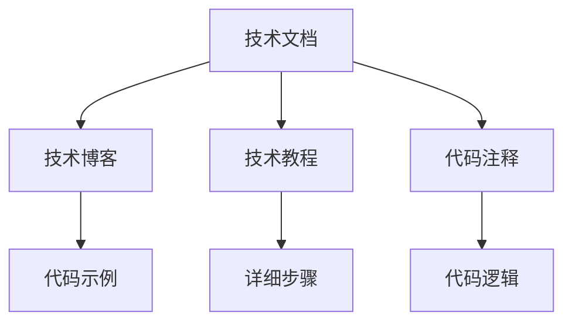

                 

## 1. 背景介绍

在当下这个高速发展的科技时代，程序员已经不仅仅是一份职业，更是一份可以持续学习、不断挑战自己的工作。然而，随着科技的不断进步，技术迭代速度加快，许多程序员面临着职业瓶颈和职业倦怠的问题。为了提升自身的市场竞争力，程序员需要不断更新知识、学习新技术。这时，技术写作便成为了程序员的一个很好的副业选择。

### 1.1 技术写作的背景

技术写作（Technical Writing）是指将复杂的技术信息以清晰、易懂的方式传达给读者，使其能够理解并应用的技术撰写工作。在IT行业，技术写作尤为重要，因为其涉及大量专业术语和复杂的逻辑结构，需要编写者具备扎实的技术基础和良好的沟通能力。

在互联网时代，技术写作不再局限于传统出版物，更多地以博客、论坛、技术社区等形式出现。许多优秀的程序员在业余时间积极参与技术写作，不仅提升了自身技术水平，也在业界建立了良好的声誉。

### 1.2 技术写作的价值

技术写作不仅能提升程序员的技术水平，还有以下几方面的价值：

- **提升自身能力**：写作是一个思考和总结的过程，通过技术写作，程序员可以更好地理解自己学到的知识，巩固和扩展技术能力。
- **增强职业竞争力**：高质量的技术文章可以帮助程序员在职业市场上脱颖而出，积累声誉和资源，获取更多的工作机会。
- **推动技术普及**：通过技术写作，程序员可以将高深的技术知识普及给更多人，推动技术的传播和应用。
- **促进自我反思**：写作的过程可以促使程序员不断自我反思，总结经验和教训，提升自己的技术水平和工作能力。

### 1.3 技术写作的现状

随着互联网的普及和技术的不断进步，技术写作成为了程序员职业生涯的重要补充。许多知名的科技公司，如Google、IBM、Microsoft等，都有自己的技术博客和社区，吸引大量的程序员参与其中。开源社区Github上，技术写作更是成为了程序员们分享和交流的重要平台。

技术写作形式多样，包括但不限于博客文章、技术手册、教程、代码注释、技术博客等。技术写作的质量直接影响其传播效果和影响力，因此编写者需要不断提升写作技能和内容质量。

## 2. 核心概念与联系

### 2.1 核心概念概述

技术写作涉及多个核心概念，包括但不限于：

- **技术文档（Technical Documentation）**：详细记录技术的各种细节，提供给开发者使用的文档类型。
- **技术博客（Technical Blog）**：以简短、易懂的方式介绍技术问题、心得和解决方案的博客文章。
- **技术教程（Technical Tutorial）**：详细指导用户如何掌握某项技术，包括代码示例、步骤说明等。
- **代码注释（Code Comments）**：在代码中添加说明，帮助其他开发者理解代码逻辑和设计思路。

这些概念之间有着密切的联系，共同构成了技术写作的完整体系。下面通过Mermaid流程图来展示它们之间的关系：



这个流程图展示了技术写作中的几个关键概念及其相互关系。技术文档通常包括技术博客、技术教程和代码注释，它们之间可以互相补充和扩展。

### 2.2 概念间的关系

这些核心概念之间存在复杂的联系，共同构成了技术写作的生态系统。

- **技术博客与技术文档**：技术博客通常比技术文档更加简短、灵活，可以迅速传递一些新技术、新思路；技术文档则更加系统、详细，适合作为参考手册使用。
- **技术教程与代码注释**：技术教程详细说明技术实现的具体步骤和代码示例，而代码注释则直接在代码中添加解释，便于开发者理解代码逻辑。
- **技术文档与代码注释**：技术文档通常包含代码注释，帮助开发者理解技术实现的细节；代码注释则是在代码层面上提供解释，方便其他开发者查阅和维护。

## 3. 核心算法原理 & 具体操作步骤

### 3.1 算法原理概述

技术写作的核心在于将复杂的技术信息以易于理解的方式呈现。这一过程涉及到信息处理、逻辑分析、语言表达等多个层面，需要通过系统的算法和步骤来实现。

### 3.2 算法步骤详解

技术写作的算法步骤主要包括以下几个方面：

1. **需求分析**：明确写作的目的和受众，确定技术信息的详细程度和复杂度。
2. **信息收集**：通过查阅相关文献、资料、代码等，收集技术实现的所有细节。
3. **内容组织**：将收集到的信息进行分类、整理，确定技术文档的框架和结构。
4. **撰写和校对**：将整理好的信息转化为易于理解的文字和代码示例，并进行反复校对和修改，确保信息的准确性和清晰性。
5. **发布与维护**：将最终的技术文档发布到合适的平台，并根据反馈进行持续的维护和更新。

### 3.3 算法优缺点

技术写作算法的主要优点在于：

- **高效传递知识**：通过系统的算法和步骤，可以将复杂的技术信息高效传递给读者，避免信息丢失和误解。
- **提升技术水平**：写作是一个不断学习和总结的过程，能够帮助开发者巩固和扩展技术能力。
- **促进技术传播**：通过技术写作，可以将高深的技术知识普及给更多人，推动技术的传播和应用。

然而，技术写作也存在一些缺点：

- **需要大量时间**：写作是一个耗时的过程，特别是在初期阶段，需要投入大量时间和精力进行需求分析、信息收集和内容组织。
- **需要高水平技能**：技术写作需要编写者具备扎实的技术基础和良好的写作能力，对一些复杂的技术问题，需要深入研究和思考。
- **需要持续维护**：技术不断进步，技术文档需要不断更新和维护，以保持其时效性和准确性。

### 3.4 算法应用领域

技术写作在多个领域都有广泛的应用，以下是其中几个主要领域：

1. **软件开发**：代码注释、技术博客、技术文档等。
2. **数据科学**：数据处理、模型训练、算法实现等。
3. **人工智能**：深度学习模型、自然语言处理、计算机视觉等。
4. **硬件设计**：电路设计、嵌入式系统、芯片设计等。
5. **云计算**：云计算架构、云平台部署、云服务使用等。

## 4. 数学模型和公式 & 详细讲解 & 举例说明

### 4.1 数学模型构建

技术写作通常涉及多个概念，需要构建数学模型来描述这些概念之间的关系。以代码注释为例，其数学模型可以表示为：

$$
C = \{c_i\}_{i=1}^n
$$

其中 $C$ 表示代码注释集合，$c_i$ 表示第 $i$ 条代码注释。每条代码注释可以进一步表示为：

$$
c_i = (p_i, v_i)
$$

其中 $p_i$ 表示代码注释的位置，$v_i$ 表示注释的内容。

### 4.2 公式推导过程

以代码注释为例，其推导过程如下：

1. **需求分析**：确定代码注释的位置和内容，如函数定义、变量定义、代码块等。
2. **信息收集**：收集与代码注释相关的信息，如代码逻辑、变量作用、函数目的等。
3. **内容组织**：将收集到的信息整理成易于理解的文字，确定代码注释的位置和格式。
4. **撰写和校对**：根据代码注释的位置和内容，编写注释文字，并进行反复校对和修改。
5. **发布与维护**：将最终代码注释发布到代码库中，并根据代码更新和需求变化进行持续维护。

### 4.3 案例分析与讲解

以下是一个具体的代码注释案例：

```python
def calculate_average(numbers):
    """
    计算给定列表的平均值
    :param numbers: 包含数字的列表
    :return: 平均值
    """
    return sum(numbers) / len(numbers)
```

在这个代码注释中，$C$ 表示代码注释集合，$p_i$ 和 $v_i$ 分别表示第 $i$ 条代码注释的位置和内容。例如，第一条注释的位置是函数定义的下一行，内容是对函数目的的简短描述；第二条注释的位置是函数内部的第一行，内容是对变量 $numbers$ 的说明；第三条注释的位置是函数的最后一行，内容是对函数返回值的解释。

## 5. 项目实践：代码实例和详细解释说明

### 5.1 开发环境搭建

要进行技术写作，首先需要搭建一个良好的开发环境。以下是一些常见的开发环境配置：

1. **编写工具**：如Visual Studio Code、Atom等。
2. **文本编辑器**：如Sublime Text、Notepad++等。
3. **文档管理工具**：如Docusaurus、Github Pages等。
4. **版本控制工具**：如Git、SVN等。

完成以上环境配置后，即可开始技术写作实践。

### 5.2 源代码详细实现

以下是一个简单的技术写作示例，展示如何使用Markdown格式编写一篇技术博客：

```markdown
# 技术写作：程序员的副业选择

技术写作不仅能提升程序员的技术水平，还有以下几方面的价值：
- **提升自身能力**：写作是一个思考和总结的过程，通过技术写作，程序员可以更好地理解自己学到的知识，巩固和扩展技术能力。
- **增强职业竞争力**：高质量的技术文章可以帮助程序员在职业市场上脱颖而出，积累声誉和资源，获取更多的工作机会。
- **推动技术普及**：通过技术写作，程序员可以将高深的技术知识普及给更多人，推动技术的传播和应用。
- **促进自我反思**：写作的过程可以促使程序员不断自我反思，总结经验和教训，提升自己的技术水平和工作能力。

```

### 5.3 代码解读与分析

在Markdown中，标题使用 `#` 号标记，每行开头要有指定数量的 `#` 号表示层级。段落之间使用空行分隔，可以在段落开头添加 `> ` 号表示引用。粗体和斜体使用 `**` 和 `*` 号表示。

### 5.4 运行结果展示

运行上述Markdown文件，将生成一个简单的技术博客页面。该页面展示了一篇关于技术写作价值的文章，包括四个主要方面的介绍。

## 6. 实际应用场景

### 6.1 软件开发

在软件开发中，代码注释和技术博客都是常见的技术写作形式。代码注释有助于开发者理解代码逻辑和设计思路，而技术博客则可以帮助开发者分享技术经验和心得，提升自身技术水平。

### 6.2 数据科学

在数据科学领域，技术写作通常涉及数据处理、模型训练和算法实现等方面。技术文档和技术教程可以帮助数据科学家快速掌握新技术，提升工作效率。

### 6.3 人工智能

在人工智能领域，技术写作可以涵盖深度学习模型、自然语言处理、计算机视觉等多个方向。通过技术写作，可以将高深的技术知识普及给更多人，推动技术的传播和应用。

## 7. 工具和资源推荐

### 7.1 学习资源推荐

为了帮助开发者系统掌握技术写作的技巧，这里推荐一些优质的学习资源：

1. **《技术写作的艺术》**：一本经典的技术写作书籍，涵盖技术写作的基础理论和实践技巧。
2. **《程序员的写作之路》**：一本面向程序员的技术写作指南，包含大量的写作示例和实用建议。
3. **《技术写作实战》**：一本实用的技术写作教程，涵盖技术写作的各个环节和常见问题。
4. **《Google 技术写作规范》**：Google 内部的技术写作规范，详细介绍了技术写作的各个方面。
5. **《如何写技术博客》**：一本介绍如何写出高质量技术博客的指南，涵盖写作技巧和平台选择。

### 7.2 开发工具推荐

开发工具的选择对技术写作的效率和质量有着重要影响。以下是一些常用的技术写作开发工具：

1. **Visual Studio Code**：一个功能强大的代码编辑器，支持多种编程语言和技术写作格式。
2. **Sublime Text**：一个轻量级的文本编辑器，支持多种文本格式和语法高亮。
3. **Atom**：一个开源的代码编辑器，支持多种插件和主题，方便技术写作。
4. **Docusaurus**：一个开源的技术写作平台，支持Markdown和TypeScript等多种格式。
5. **GitHub Pages**：一个免费的静态网站托管服务，方便技术博客的发布和访问。

### 7.3 相关论文推荐

技术写作领域的研究也在不断深入，以下是几篇具有代表性的相关论文：

1. **《编程中文档的持续性》**：探讨编程文档在软件开发中的持续性问题，提出了一套有效的文档管理方案。
2. **《技术写作与软件开发》**：分析技术写作对软件开发的影响，提出技术写作的必要性和重要性。
3. **《技术博客的阅读效果分析》**：研究技术博客的阅读效果和读者反馈，提出提高技术写作质量的方法。

## 8. 总结：未来发展趋势与挑战

### 8.1 总结

本文对技术写作进行了全面系统的介绍。首先阐述了技术写作的背景和价值，明确了技术写作在程序员职业发展中的重要地位。其次，从原理到实践，详细讲解了技术写作的数学模型和操作步骤，给出了技术写作任务开发的完整代码实例。同时，本文还广泛探讨了技术写作在软件开发、数据科学、人工智能等多个领域的应用前景，展示了技术写作范式的巨大潜力。

通过本文的系统梳理，可以看到，技术写作不仅是程序员的副业选择，更是提升自身技术水平、增强职业竞争力和推动技术普及的重要手段。未来，技术写作将在更多的领域得到应用，为程序员提供更多展现才华和价值的机会。

### 8.2 未来发展趋势

展望未来，技术写作将呈现以下几个发展趋势：

1. **多样化形式**：技术写作不仅限于传统的文档和博客，还将扩展到视频、播客、在线课程等多种形式，满足不同读者的需求。
2. **全球化传播**：随着互联网的普及，技术写作将更容易跨越语言和文化障碍，实现全球化的传播和交流。
3. **人工智能辅助**：AI技术的发展将进一步提升技术写作的效率和质量，如自动化生成技术文档、智能推荐阅读内容等。
4. **社区化交流**：技术写作社区将变得更加活跃，开发者可以在社区中分享和交流技术心得，共同提升技术水平。
5. **个性化定制**：技术写作将根据读者的不同需求，提供个性化的内容推荐和定制服务，提高读者的阅读体验。

### 8.3 面临的挑战

尽管技术写作已经取得了显著成就，但在迈向更加智能化、普适化应用的过程中，它仍面临诸多挑战：

1. **质量控制**：技术写作的质量直接影响其传播效果和影响力，需要建立有效的质量控制机制。
2. **内容更新**：技术不断进步，技术文档需要不断更新和维护，以保持其时效性和准确性。
3. **读者反馈**：技术写作需要根据读者的反馈进行持续优化和改进，以满足读者的需求和期望。
4. **跨文化交流**：技术写作需要跨越语言和文化障碍，确保信息的准确传递。
5. **版权问题**：技术写作中涉及大量版权问题，需要明确版权归属和授权使用。

### 8.4 研究展望

未来的技术写作研究需要在以下几个方面寻求新的突破：

1. **自动化技术**：开发自动化生成技术文档和博客的工具，提升写作效率和质量。
2. **质量评估**：建立技术写作的质量评估体系，确保文档和博客的高质量。
3. **个性化推荐**：利用AI技术进行个性化阅读推荐，提升读者的阅读体验。
4. **跨文化交流**：研究跨语言和文化的技术写作方法，确保信息的准确传递。
5. **版权保护**：研究技术写作中的版权保护和授权使用问题，确保作者的权益。

这些研究方向的探索，将推动技术写作技术迈向更高的台阶，为构建更加智能、普适的技术写作平台铺平道路。

## 9. 附录：常见问题与解答

**Q1：技术写作是否需要具备专业写作能力？**

A: 技术写作需要具备扎实的技术基础和良好的写作能力。虽然专业写作能力不是必须的，但优秀的写作技能可以帮助编写者更清晰、更系统地表达技术内容，提升文档的可读性和可理解性。

**Q2：技术写作需要投入大量时间吗？**

A: 技术写作确实需要投入大量时间，特别是在初期阶段。但一旦掌握了基本套路和技巧，写作效率会大大提升。此外，技术写作还可以作为编程和项目管理的辅助手段，提升整体工作效率。

**Q3：技术写作是否需要不断更新？**

A: 是的，技术写作需要根据技术进展和读者反馈进行持续更新和维护。这不仅能保证文档的时效性和准确性，还能提升读者的阅读体验和信任度。

**Q4：技术写作是否需要跨文化交流？**

A: 是的，技术写作需要跨越语言和文化障碍，确保信息的准确传递。特别是全球化背景下，技术写作需要更加注重跨文化交流。

**Q5：技术写作是否需要版权保护？**

A: 是的，技术写作涉及大量的技术信息，需要明确版权归属和授权使用。特别是在开源社区中，版权保护尤为重要。

作者：禅与计算机程序设计艺术 / Zen and the Art of Computer Programming

