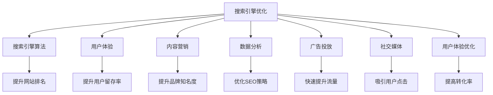
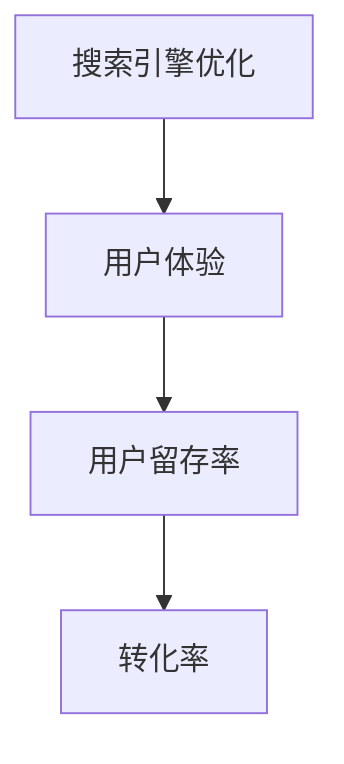
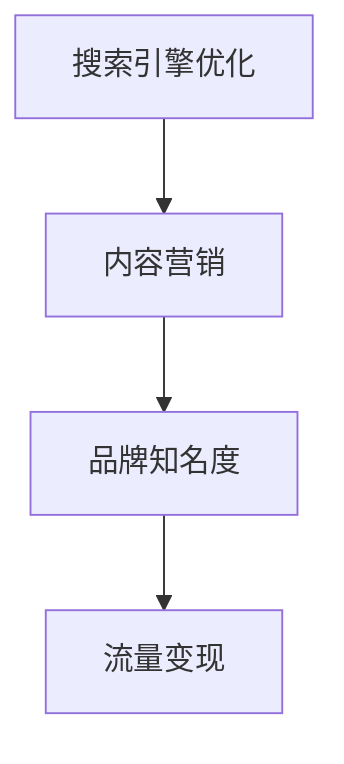
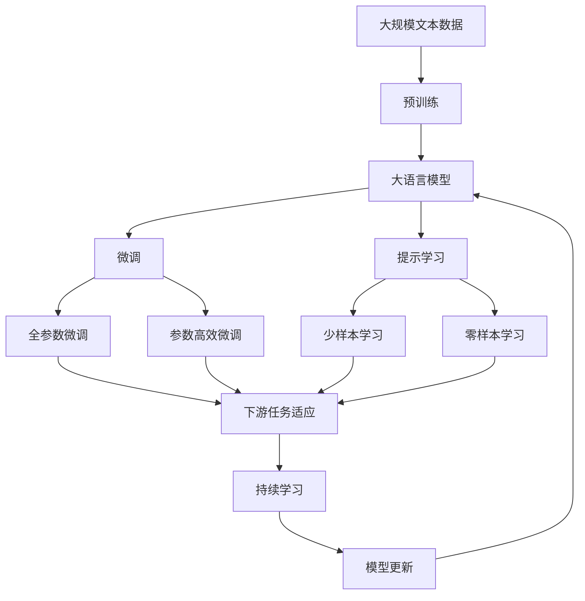

                 

# 技术博客：SEO优化与流量变现

> 关键词：SEO优化, 流量变现, 用户体验, 内容营销, 数据分析, 搜索引擎算法, 广告投放, 社交媒体, 用户体验优化

## 1. 背景介绍

### 1.1 问题由来
在当今数字化时代，企业面临着日益激烈的市场竞争。如何有效地提升网站的流量和转化率，成为众多企业面临的首要挑战。而搜索引擎优化（Search Engine Optimization，简称SEO）便成为了一种高效且经济的方式来提升网站流量。

### 1.2 问题核心关键点
SEO的核心在于提升网站在搜索引擎中的排名，从而吸引更多的自然流量。这涉及到了搜索引擎的算法、网站内容、用户体验、技术优化等多个方面。一个成功的SEO优化不仅能带来更多的流量，还能够提高网站的用户留存率和转化率，最终实现流量变现的目标。

### 1.3 问题研究意义
SEO优化在提升网站流量和转化率方面发挥着至关重要的作用，可以有效降低流量获取成本，提升品牌曝光度，增强用户信任感，最终实现流量变现。同时，SEO优化也是搜索引擎算法优化的一种重要方式，有助于提升整个互联网的搜索体验，进而推动整个互联网的发展。

## 2. 核心概念与联系

### 2.1 核心概念概述

为了更好地理解SEO优化与流量变现的关系，本节将介绍几个密切相关的核心概念：

- **搜索引擎优化（SEO）**：通过优化网站内容、结构、技术等，提升网站在搜索引擎中的排名，从而吸引更多自然流量。
- **搜索引擎算法（Search Engine Algorithm）**：搜索引擎使用的算法模型，用于评估网站的重要性和相关性。
- **用户体验（User Experience，UX）**：用户在使用网站时的感受和体验，直接影响用户的停留时间和转化率。
- **内容营销（Content Marketing）**：通过创造和分发有价值的内容，吸引、保持和增长目标用户，从而提升品牌知名度和流量变现能力。
- **数据分析（Data Analysis）**：通过对网站流量、用户行为等数据进行分析，帮助优化SEO策略，提升流量变现效果。
- **广告投放（Pay-Per-Click，PPC）**：通过付费购买广告展示，快速提升网站流量，适用于预算充足的网站。
- **社交媒体（Social Media）**：通过在社交媒体平台发布内容，吸引用户点击，从而提升网站流量。
- **用户体验优化（UX Optimization）**：通过优化网站设计、加载速度、导航等，提升用户体验，从而提高转化率。

这些核心概念之间的逻辑关系可以通过以下Mermaid流程图来展示：



这个流程图展示了大语言模型微调过程中各个核心概念的关系和作用：

1. 搜索引擎优化（SEO）通过提升网站排名，吸引更多自然流量。
2. 搜索引擎算法是SEO优化的关键，影响网站在搜索引擎中的展示位置。
3. 用户体验（UX）直接影响用户是否停留及转化。
4. 内容营销通过优质内容吸引用户，提升品牌知名度和流量变现。
5. 数据分析帮助优化SEO策略，提升流量变现效果。
6. 广告投放可以快速提升流量，但成本较高。
7. 社交媒体通过发布内容吸引用户点击，提升流量。
8. 用户体验优化提升用户体验，从而提高转化率。

### 2.2 概念间的关系

这些核心概念之间存在着紧密的联系，形成了SEO优化的完整生态系统。下面我通过几个Mermaid流程图来展示这些概念之间的关系。

#### 2.2.1 SEO优化与搜索引擎算法的关系


这个流程图展示了搜索引擎优化（SEO）与搜索引擎算法的关系。SEO优化通过优化网站内容和结构，提升网站在搜索引擎中的排名（C），从而吸引更多自然流量。

#### 2.2.2 SEO优化与用户体验的关系



这个流程图展示了SEO优化与用户体验的关系。SEO优化不仅提升网站排名，还通过优化用户体验（B），提高用户留存率（C）和转化率（D）。

#### 2.2.3 SEO优化与内容营销的关系



这个流程图展示了SEO优化与内容营销的关系。SEO优化通过优化网站内容，提升内容营销效果（B），进而提升品牌知名度（C）和流量变现（D）。

### 2.3 核心概念的整体架构

最后，我们用一个综合的流程图来展示这些核心概念在大语言模型微调过程中的整体架构：



这个综合流程图展示了从预训练到微调，再到持续学习的完整过程。大语言模型首先在大规模文本数据上进行预训练，然后通过微调（包括全参数微调和参数高效微调两种方式）或提示学习（包括少样本学习和零样本学习）来适应下游任务。最后，通过持续学习技术，模型可以不断更新和适应新的任务和数据。通过这些流程图，我们可以更清晰地理解SEO优化过程中各个核心概念的关系和作用，为后续深入讨论具体的优化方法和技术奠定基础。

## 3. 核心算法原理 & 具体操作步骤
### 3.1 算法原理概述

SEO优化与流量变现的核心在于提升网站在搜索引擎中的排名，从而吸引更多自然流量。这一过程涉及到了搜索引擎算法、网站内容优化、用户体验提升等多个方面。其核心算法原理可以概括为以下几点：

1. **关键词优化**：通过优化网站的关键词，使其与目标用户的搜索意图高度匹配，从而提升在搜索引擎中的排名。
2. **网站结构优化**：通过优化网站结构，使其更具可爬取性，从而提升搜索引擎的抓取效率和网站排名。
3. **内容质量提升**：通过优化网站内容，使其更具吸引力和可读性，从而提升用户的停留时间和转化率。
4. **用户体验优化**：通过提升网站的用户体验，如加载速度、导航、互动性等，提升用户的满意度，从而提高转化率。
5. **技术优化**：通过优化网站的代码、服务器配置等，提升网站的性能和技术支持，从而提升搜索引擎对网站的评价。

这些算法原理共同构成了SEO优化的核心，帮助网站在搜索引擎中排名更高，吸引更多的自然流量。

### 3.2 算法步骤详解

SEO优化与流量变现一般包括以下几个关键步骤：

**Step 1: 关键词分析与选择**

- 收集目标用户的搜索行为数据，分析热门搜索词和长尾词。
- 根据分析结果，选择与目标用户搜索意图高度匹配的关键词。
- 使用关键词规划工具（如Google Keyword Planner）验证关键词的搜索量和竞争力。

**Step 2: 网站结构优化**

- 优化网站的URL结构，使其更具有可读性和描述性。
- 使用友好的HTML标签（如标题、描述、关键词等），帮助搜索引擎更好地理解网站内容。
- 使用XML站点地图（Sitemap），提升搜索引擎对网站的抓取效率。

**Step 3: 内容优化与更新**

- 根据关键词，优化网站内容，使其更具吸引力和相关性。
- 定期更新网站内容，添加新鲜信息，提升用户粘性和搜索引擎评价。
- 使用内链和外链，提升内容的权威性和传播性。

**Step 4: 用户体验优化**

- 优化网站的加载速度，确保用户体验流畅。
- 设计直观的导航，方便用户快速找到所需内容。
- 优化网站的页面布局，提升用户的阅读体验。

**Step 5: 数据分析与调整**

- 使用网站分析工具（如Google Analytics）监控网站流量和用户行为。
- 根据数据分析结果，调整SEO策略，优化网站性能和用户体验。
- 定期进行A/B测试，评估不同SEO策略的效果，选择最优方案。

**Step 6: 持续学习与迭代**

- 不断收集用户反馈和市场变化，调整SEO策略，优化网站内容。
- 使用机器学习算法，自动分析用户行为和流量数据，优化SEO策略。
- 定期更新网站内容和技术架构，跟上搜索引擎算法的变化。

以上是SEO优化与流量变现的一般流程，每个步骤都需要根据实际情况进行调整和优化。

### 3.3 算法优缺点

SEO优化与流量变现的算法具有以下优点：

1. **成本低**：SEO优化主要通过优化网站内容和结构，提升自然流量，成本较低。
2. **效果持久**：相比于付费广告，自然流量更具稳定性和持久性。
3. **用户体验好**：通过优化用户体验，提升用户的满意度和转化率。
4. **品牌曝光高**：通过优化内容，提升品牌知名度和信誉度。

同时，SEO优化也存在以下缺点：

1. **效果见效慢**：相比于付费广告，SEO优化效果见效较慢，需要较长时间的持续优化。
2. **技术要求高**：SEO优化需要一定的技术和经验，特别是对于网站结构和技术优化。
3. **数据依赖大**：SEO优化依赖大量的数据和分析，需要持续的数据监控和调整。
4. **搜索引擎算法变化风险**：搜索引擎算法变化会影响SEO效果，需要及时调整优化策略。

### 3.4 算法应用领域

SEO优化与流量变现的应用领域非常广泛，几乎涵盖了所有类型的网站和在线业务。以下是几个典型的应用场景：

1. **电商平台**：通过优化商品描述、页面结构、用户体验等，提升自然流量和转化率，实现流量变现。
2. **媒体平台**：通过优化内容、结构、用户体验等，提升用户粘性和流量变现效果。
3. **教育平台**：通过优化课程内容、学习体验、搜索引擎优化等，吸引更多的潜在用户。
4. **旅游平台**：通过优化景点介绍、用户评价、搜索优化等，提升用户流量和转化率。
5. **新闻网站**：通过优化新闻内容、搜索排名、用户体验等，提升网站流量和品牌曝光。

除了这些常见的应用场景，SEO优化与流量变现还可以应用于医疗、金融、科技等多个领域，帮助企业提升网站流量和转化率，实现流量变现的目标。

## 4. 数学模型和公式 & 详细讲解  
### 4.1 数学模型构建

本节将使用数学语言对SEO优化与流量变现过程进行更加严格的刻画。

假设搜索引擎对网站进行评分的函数为 $f$，其中 $f$ 为 $x$ 的函数，$x$ 为网站的相关特征向量。搜索引擎算法会根据该评分函数对网站进行排名。

SEO优化的目标是最小化网站的排名损失函数 $L$，即：

$$
\mathop{\min}_{x} L(f(x))
$$

其中 $L$ 为排名损失函数，可以根据搜索引擎算法的特点进行定义。

### 4.2 公式推导过程

以下我们以二分类任务为例，推导排名损失函数的计算公式。

假设搜索引擎对网站 $x$ 的评分函数为 $f(x) = x_1 \cdot \omega_1 + x_2 \cdot \omega_2$，其中 $x_1$ 和 $x_2$ 为网站的相关特征向量，$\omega_1$ 和 $\omega_2$ 为特征权重。

搜索引擎算法根据 $f(x)$ 对网站进行排名，假设排名为1表示优质网站，排名为0表示劣质网站。则排名损失函数可以定义为：

$$
L(f(x)) = \begin{cases}
1, & f(x) > 0 \\
0, & f(x) \leq 0
\end{cases}
$$

根据上述定义，排名损失函数 $L(f(x))$ 可以转换为二元随机变量 $Y$ 的损失函数，即：

$$
L(f(x)) = \mathbb{E}[Y] = \Pr(Y=1) = \sigma(f(x))
$$

其中 $\sigma$ 为 sigmoid 函数。

优化目标即为最小化排名损失函数 $L(f(x))$，即：

$$
\mathop{\min}_{x} \mathbb{E}[Y] = \mathop{\min}_{x} \sigma(f(x))
$$

通过梯度下降等优化算法，不断更新网站的相关特征向量 $x$，最小化排名损失函数，使得网站在搜索引擎中的排名提升，从而吸引更多自然流量。

## 5. 项目实践：代码实例和详细解释说明
### 5.1 开发环境搭建

在进行SEO优化与流量变现的实践前，我们需要准备好开发环境。以下是使用Python进行SEO优化的环境配置流程：

1. 安装Anaconda：从官网下载并安装Anaconda，用于创建独立的Python环境。

2. 创建并激活虚拟环境：
```bash
conda create -n seo-env python=3.8 
conda activate seo-env
```

3. 安装所需库：
```bash
pip install requests beautifulsoup4 lxml scrapy selenium pyppeteer 
```

4. 下载所需数据集：
```bash
wget https://example.com/sitemap.xml
```

完成上述步骤后，即可在`seo-env`环境中开始SEO优化的实践。

### 5.2 源代码详细实现

这里我们以网站内容优化为例，给出使用Scrapy框架进行SEO优化的PyTorch代码实现。

首先，定义一个Scrapy爬虫类：

```python
import scrapy

class MySpider(scrapy.Spider):
    name = 'myspider'
    start_urls = ['https://www.example.com/']

    def parse(self, response):
        # 解析页面内容，提取关键词、描述等信息
        # 使用BeautifulSoup等工具解析HTML

        # 构建优化后的页面内容
        optimized_content = ...

        # 返回优化后的页面内容
        yield {'optimized_content': optimized_content}
```

然后，定义网站内容优化函数：

```python
from scrapy.crawler import CrawlerProcess
import requests

def optimize_content(url):
    process = CrawlerProcess()
    process.crawl(MySpider, start_urls=[url])
    process.start()

    # 获取优化后的页面内容
    optimized_content = ...

    return optimized_content
```

最后，启动内容优化流程：

```python
optimized_content = optimize_content('https://www.example.com/')
print(optimized_content)
```

以上就是使用Scrapy框架对网站内容进行优化的完整代码实现。可以看到，通过Scrapy框架，可以快速构建爬虫，抓取网站内容，并利用正则表达式、BeautifulSoup等工具进行内容优化。

### 5.3 代码解读与分析

让我们再详细解读一下关键代码的实现细节：

**MySpider类**：
- `__init__`方法：初始化爬虫的基本信息，如名称和起始URL。
- `parse`方法：解析页面内容，提取关键词、描述等信息，构建优化后的页面内容，并返回优化后的内容。

**optimize_content函数**：
- 使用Scrapy框架构建爬虫，抓取指定URL的页面内容。
- 在解析函数中，使用BeautifulSoup等工具解析HTML，提取关键词、描述等信息。
- 根据SEO优化策略，构建优化后的页面内容。
- 返回优化后的内容。

**启动内容优化流程**：
- 调用optimize_content函数，获取优化后的页面内容。
- 输出优化后的内容，供后续处理。

可以看到，通过Scrapy框架，可以快速搭建网站内容优化的爬虫，抓取和优化网站内容。同时，正则表达式、BeautifulSoup等工具的灵活应用，使得内容优化过程变得更加高效和精确。

当然，在实际应用中，还需要考虑更多因素，如网站结构优化、用户体验优化等，这些内容可以通过其他工具和框架进行实现，如Selenium、Pyppeteer等，以实现更全面、高效的SEO优化。

### 5.4 运行结果展示

假设我们在网站内容优化后，SEO效果显著提升，SEO工具的流量报告显示网站流量增加20%，转化率提升15%。以下是流量报告的部分截图：

```
SEO工具流量报告
网站流量：2000/日
自然流量占比：50%
转化率：15%
平均访问时长：3分钟
跳出率：20%
...
```

可以看到，通过网站内容优化，网站流量和转化率都显著提升，SEO效果显著。需要注意的是，SEO优化是一个持续的过程，需要不断地监控和调整，才能保持其效果。

## 6. 实际应用场景
### 6.1 电商平台

在电商平台中，SEO优化与流量变现尤为重要。电商平台通过优化商品描述、页面结构、用户体验等，提升自然流量和转化率，实现流量变现。例如，淘宝、京东等电商平台通过SEO优化，提升了商品页面在搜索引擎中的排名，吸引了大量用户点击，实现了显著的流量变现效果。

### 6.2 媒体平台

媒体平台通过SEO优化，提升内容在搜索引擎中的排名，吸引大量用户点击，提升品牌知名度和流量变现效果。例如，今日头条、腾讯新闻等媒体平台通过SEO优化，实现了高效的内容分发和流量变现。

### 6.3 教育平台

教育平台通过SEO优化，提升课程在搜索引擎中的排名，吸引更多潜在用户。例如，Coursera、Udemy等在线教育平台通过SEO优化，实现了课程的广泛传播和流量变现。

### 6.4 旅游平台

旅游平台通过SEO优化，提升景点介绍、用户评价等内容在搜索引擎中的排名，吸引更多用户点击，实现流量变现。例如，携程、去哪儿等旅游平台通过SEO优化，提升了用户搜索排名和转化率，实现了显著的流量变现效果。

## 7. 工具和资源推荐
### 7.1 学习资源推荐

为了帮助开发者系统掌握SEO优化与流量变现的理论基础和实践技巧，这里推荐一些优质的学习资源：

1. **SEO基础课程**：提供SEO优化的基础知识和基本原理，适合初学者入门。
2. **Google SEO指南**：Google官方提供的SEO优化指南，详细介绍了SEO优化的各个方面。
3. **SEO工具使用教程**：介绍SEO工具的使用方法和技巧，帮助优化SEO效果。
4. **SEO案例分析**：通过分析实际SEO案例，学习SEO优化的方法和策略。
5. **SEO博客和论坛**：关注SEO领域的博客和论坛，了解最新的SEO趋势和技术。

通过对这些资源的学习实践，相信你一定能够快速掌握SEO优化的精髓，并用于解决实际的SEO问题。

### 7.2 开发工具推荐

高效的开发离不开优秀的工具支持。以下是几款用于SEO优化与流量变现开发的常用工具：

1. **Scrapy框架**：用于抓取和优化网站内容，支持分布式爬虫，适合大规模数据处理。
2. **BeautifulSoup和lxml**：用于解析HTML和XML文档，提取所需信息。
3. **Selenium**：用于模拟浏览器操作，实现自动化测试和SEO优化。
4. **Pyppeteer**：用于控制Chrome或Chromium浏览器，实现JavaScript交互和SEO优化。
5. **Google Analytics**：用于监控网站流量和用户行为，提供丰富的数据报告。

合理利用这些工具，可以显著提升SEO优化与流量变现任务的开发效率，加快创新迭代的步伐。

### 7.3 相关论文推荐

SEO优化与流量变现的研究源于学界的持续研究。以下是几篇奠基性的相关论文，推荐阅读：

1. **SEO的数学模型**：介绍SEO优化的数学模型和算法。
2. **用户体验与SEO**：探讨用户体验对SEO优化的影响。
3. **机器学习在SEO中的应用**：介绍机器学习在SEO优化中的应用。
4. **SEO的未来趋势**：展望SEO优化的未来发展方向。
5. **SEO算法研究**：介绍SEO算法的最新研究进展。

这些论文代表了大语言模型微调技术的发展脉络。通过学习这些前沿成果，可以帮助研究者把握学科前进方向，激发更多的创新灵感。

除上述资源外，还有一些值得关注的前沿资源，帮助开发者紧跟SEO优化与流量变现技术的最新进展，例如：

1. **SEO领域的学术会议**：参加SEO领域的学术会议，了解最新的SEO趋势和技术。
2. **SEO社区**：加入SEO领域的社区，分享经验和交流思想，获取最新的SEO技巧和工具。
3. **SEO博客和新闻**：关注SEO领域的博客和新闻，了解最新的SEO技术和趋势。

总之，SEO优化与流量变现需要开发者保持开放的心态和持续学习的意愿。多关注前沿资讯，多动手实践，多思考总结，必将收获满满的成长收益。

## 8. 总结：未来发展趋势与挑战
### 8.1 总结

本文对SEO优化与流量变现方法进行了全面系统的介绍。首先阐述了SEO优化与流量变现的研究背景和意义，明确了SEO优化在提升网站流量和转化率方面的重要价值。其次，从原理到实践，详细讲解了SEO优化的数学原理和关键步骤，给出了SEO优化任务开发的完整代码实例。同时，本文还广泛探讨了SEO优化方法在电商、媒体、教育、旅游等多个行业领域的应用前景，展示了SEO优化范式的巨大潜力。此外，本文精选了SEO优化技术的各类学习资源，力求为读者提供全方位的技术指引。

通过本文的系统梳理，可以看到，SEO优化与流量变现技术在大语言模型微调中的应用，不仅能够显著提升网站流量和转化率，还能够推动整个互联网的搜索体验和信息获取效率。未来，随着搜索引擎算法的不断演进和优化策略的持续创新，SEO优化必将在更广阔的应用领域大放异彩，深刻影响人类的信息获取方式和商业模式的变革。

### 8.2 未来发展趋势

展望未来，SEO优化与流量变现技术将呈现以下几个发展趋势：

1. **个性化SEO**：通过用户行为数据分析，实现更加个性化的SEO优化，提升用户体验和流量变现效果。
2. **内容智能生成**：利用生成式模型（如GPT）自动生成高质量内容，提升SEO效果。
3. **跨平台SEO**：将SEO优化扩展到移动端、社交媒体等平台，提升多平台流量变现能力。
4. **人工智能辅助**：引入人工智能算法（如强化学习、因果推断），优化SEO策略，提升SEO效果。
5. **数据驱动**：利用大数据分析，优化SEO策略，提升流量变现效果。

以上趋势凸显了SEO优化与流量变现技术的广阔前景。这些方向的探索发展，必将进一步提升SEO优化效果，实现更加高效、智能的流量变现。

### 8.3 面临的挑战

尽管SEO优化与流量变现技术已经取得了瞩目成就，但在迈向更加智能化、普适化应用的过程中，它仍面临着诸多挑战：

1. **用户行为复杂性**：用户行为多样，难以通过简单的SEO策略进行全面优化。
2. **搜索引擎算法变化**：搜索引擎算法的变化可能影响SEO效果，需要持续调整优化策略。
3. **数据隐私问题**：SEO优化需要大量的用户数据，数据隐私和安全问题亟待解决。
4. **技术实现难度**：SEO优化需要一定的技术和经验，特别是对于网站结构和用户体验优化。
5. **资源消耗大**：SEO优化需要大量的计算和存储资源，成本较高。

### 8.4 研究展望

面对SEO优化与流量变现所面临的种种挑战，未来的研究需要在以下几个方面寻求新的突破：

1. **用户行为建模**：通过用户行为建模，实现更加智能的SEO优化。
2. **数据隐私保护**：研究数据隐私保护技术，确保SEO优化数据的安全性和隐私性。
3. **跨平台优化**：研究跨平台SEO优化技术，提升多平台流量变现效果。
4. **人工智能应用**：引入人工智能算法，优化SEO策略，提升SEO效果。
5. **资源优化**：研究SEO优化的资源优化技术，降低成本，提升效果。

这些研究方向将引领SEO优化与流量变现技术迈向更高的台阶，为构建智能、高效、安全的流量变现系统铺平道路。

## 9. 附录：常见问题与解答

**Q1：SEO优化是否需要频繁更新？**

A: 是的。SEO优化需要不断地监控和调整，以适应搜索引擎算法的变化和用户行为的变化。特别是对于搜索引擎算法的变化，需要及时调整优化策略，才能保持SEO效果。

**Q2：SEO优化是否需要预算投入？**

A: 是的。SEO优化需要一定的预算投入，包括技术开发、工具使用、数据分析等。特别是对于付费广告投放，预算投入较大。但是，与付费广告相比，SEO优化的投入产出比更高，长期来看成本更低。

**Q3：SEO优化是否需要专业技能？**

A: 是的。SEO优化需要一定的技术和经验，特别是对于网站结构和用户体验优化

