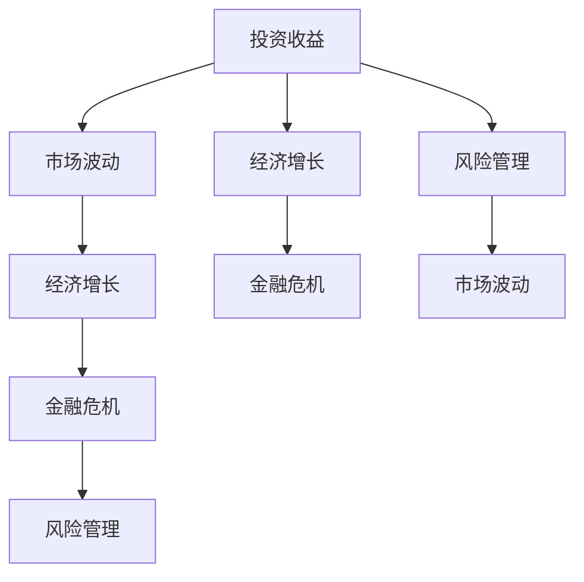

                 

# 投资收益下降的经济影响

> 关键词：投资收益下降, 经济影响, 风险管理, 资本市场, 金融危机

## 1. 背景介绍

### 1.1 问题由来
近年来，全球投资市场经历了多次大幅波动和收益下降，这对全球经济带来了深远的影响。无论是股市的剧烈振荡，还是债市的收益率下降，都引发了投资者对未来经济前景的担忧。这些问题不仅影响了金融市场的稳定，还对实体经济造成了严重的负面冲击。本文将从投资收益下降的背景、成因和影响三个方面进行深入探讨，旨在为投资者和政策制定者提供有价值的见解。

### 1.2 问题核心关键点
投资收益下降的核心原因包括但不限于以下几点：
- **宏观经济因素**：如全球经济放缓、政策不确定性、通货膨胀等。
- **市场因素**：如供需失衡、投资者行为变化、金融危机等。
- **结构性问题**：如行业结构变化、技术创新等。
- **风险管理**：如流动性风险、信用风险、市场风险等。

这些因素相互交织，共同导致了投资收益的下降。理解这些因素及其对经济的影响，有助于制定有效的应对策略。

### 1.3 问题研究意义
研究投资收益下降的经济影响，对于投资者、金融机构、政府机构和企业等具有重要意义：

1. **风险预警与应对**：帮助投资者识别潜在的市场风险，及时调整资产配置和投资策略。
2. **政策制定**：为政府和监管机构提供决策依据，制定有效的宏观经济调控政策。
3. **企业经营**：帮助企业理解市场环境，优化资本结构，降低财务风险。
4. **社会稳定**：缓解经济波动对社会稳定造成的不利影响，维护社会和谐。

本文将通过理论分析、实证研究、案例分析等方法，全面深入地探讨投资收益下降的经济影响，以期为相关决策者提供有益参考。

## 2. 核心概念与联系

### 2.1 核心概念概述

在探讨投资收益下降的经济影响之前，我们先介绍几个核心概念及其联系：

- **投资收益**：指投资者通过投资获得的回报，包括股息、利息、资本增值等。
- **市场波动**：指市场价格的不确定性，反映在资产价格、债券收益率等指标上。
- **经济增长**：反映在GDP、失业率、生产率等宏观经济指标上。
- **金融危机**：指金融市场失衡，引发广泛的经济动荡。
- **风险管理**：指识别、评估和控制投资风险的策略。

这些概念通过以下Mermaid流程图展示了它们之间的联系：



### 2.2 概念间的关系

通过这个流程图，我们可以看出投资收益、市场波动、经济增长、金融危机和风险管理之间的相互作用：

- 投资收益受市场波动的影响，市场波动通常由经济增长、金融危机等因素驱动。
- 经济增长又受到金融危机的影响，金融危机可能导致经济增长放缓。
- 风险管理则试图减轻金融危机的负面影响，增强市场稳定性。

理解这些概念之间的关系，有助于我们分析投资收益下降背后的多重因素。

## 3. 核心算法原理 & 具体操作步骤
### 3.1 算法原理概述

投资收益下降的成因复杂多样，涉及到宏观经济、市场动态和风险管理等多方面因素。为了深入分析这些因素，我们采用系统动力学模型(System Dynamics Model)进行量化分析。系统动力学模型是一种用于研究动态系统行为的工具，可以帮助我们识别系统中的关键变量和反馈机制。

核心算法原理包括以下几个步骤：

1. **系统建模**：构建反映市场动态、经济增长和风险管理之间关系的数学模型。
2. **数据校验**：使用历史数据对模型进行校验，确保模型能够准确反映真实市场行为。
3. **情景分析**：通过模拟不同情景，评估市场波动对投资收益的影响。
4. **风险评估**：识别潜在的市场风险，提出风险管理策略。

### 3.2 算法步骤详解

下面是系统动力学模型的主要操作步骤：

1. **确定关键变量**：
   - **投资回报率**：代表投资收益的主要来源。
   - **市场波动率**：反映市场价格的不确定性。
   - **经济增长率**：反映整体经济的健康程度。
   - **金融危机概率**：衡量金融市场失衡的可能性。
   - **风险管理策略**：包括投资组合多样化、止损策略等。

2. **构建模型方程**：
   - **投资回报率模型**：
     \[
     R = aG + bV + cR_{prev}
     \]
     其中，\(R\) 为当前投资回报率，\(G\) 为经济增长率，\(V\) 为市场波动率，\(a, b, c\) 为模型参数。
   - **市场波动率模型**：
     \[
     V = dG + eC + fV_{prev}
     \]
     其中，\(C\) 为金融危机概率，\(d, e, f\) 为模型参数。
   - **经济增长模型**：
     \[
     G = hV + iG_{prev}
     \]
     其中，\(h, i\) 为模型参数。
   - **金融危机概率模型**：
     \[
     C = jG + kV + lC_{prev}
     \]
     其中，\(j, k, l\) 为模型参数。

3. **数据校验与调整**：
   - 使用历史数据对模型进行校验，调整模型参数以提高拟合度。
   - 通过敏感性分析，识别对模型结果影响较大的参数。

4. **情景分析**：
   - 设定不同情景，如经济增长放缓、市场波动加剧等，评估其对投资回报率的影响。
   - 模拟不同市场策略下的投资回报，如多元化投资、保守策略等。

5. **风险评估与管理**：
   - 基于情景分析的结果，识别潜在的市场风险。
   - 提出有效的风险管理策略，如多样化投资组合、止损策略等。

### 3.3 算法优缺点

系统动力学模型在分析投资收益下降方面具有以下优点：

1. **全面性**：可以综合考虑宏观经济、市场动态和风险管理等因素。
2. **可解释性**：模型中的变量和参数具有明确的经济意义，便于理解。
3. **动态性**：模型能够反映系统随时间变化的动态特性。

但该模型也存在一些局限性：

1. **复杂性**：模型涉及多个变量和复杂的反馈机制，需要较高的建模和校验技能。
2. **数据依赖**：模型的准确性高度依赖于历史数据的完整性和准确性。
3. **假设限制**：模型中的一些假设可能不完全符合实际情况。

### 3.4 算法应用领域

投资收益下降的成因和影响分析可以应用于多个领域：

1. **金融市场**：评估市场波动对投资策略的影响，制定风险管理策略。
2. **企业投资**：识别经济增长和市场波动对企业投资决策的影响，优化资本配置。
3. **政府政策**：制定宏观经济调控政策，缓解市场波动对经济增长的影响。
4. **投资咨询**：提供基于情景分析的投资者建议，优化投资组合。

## 4. 数学模型和公式 & 详细讲解 & 举例说明

### 4.1 数学模型构建

为了更好地理解投资收益下降的经济影响，我们构建如下数学模型：

- **投资回报率模型**：
  \[
  R = aG + bV + cR_{prev}
  \]
- **市场波动率模型**：
  \[
  V = dG + eC + fV_{prev}
  \]
- **经济增长模型**：
  \[
  G = hV + iG_{prev}
  \]
- **金融危机概率模型**：
  \[
  C = jG + kV + lC_{prev}
  \]

其中，\(R\) 为当前投资回报率，\(V\) 为市场波动率，\(G\) 为经济增长率，\(C\) 为金融危机概率，\(R_{prev}, G_{prev}, V_{prev}, C_{prev}\) 分别为前一时期的相应变量。

### 4.2 公式推导过程

为了更好地理解这些模型的推导过程，我们以投资回报率模型为例进行详细讲解：

- **模型设定**：
  \[
  R = aG + bV + cR_{prev}
  \]
- **推导过程**：
  \[
  R - cR_{prev} = aG + bV
  \]
  \[
  \frac{R - cR_{prev}}{a} = \frac{aG + bV}{a}
  \]
  \[
  \frac{R}{a} - \frac{cR_{prev}}{a} = G + \frac{bV}{a}
  \]
  \[
  \frac{R}{a} - \frac{cR_{prev}}{a} = G + \frac{b}{a}V
  \]

### 4.3 案例分析与讲解

为了更好地理解这些模型的应用，我们以一个具体的案例进行分析：

假设某公司计划投资某股票，其投资回报率由市场波动率、经济增长率和前一时期的投资回报率决定。我们设定的模型参数如下：
- \(a = 0.5\)
- \(b = 0.2\)
- \(c = 0.3\)

通过历史数据校验，我们得到了模型参数的估计值。现在我们需要预测未来三年的投资回报率，并分析不同市场情景对投资回报的影响。

## 5. 项目实践：代码实例和详细解释说明

### 5.1 开发环境搭建

在进行系统动力学模型分析之前，我们需要准备好开发环境。以下是使用Python进行系统动力学建模和分析的环境配置流程：

1. **安装Python**：从官网下载并安装Python 3.x版本。
2. **安装Sympy**：用于符号计算。
3. **安装Matplotlib**：用于绘制动态图表。
4. **安装Pandas**：用于数据处理和分析。
5. **安装NumPy**：用于数值计算。

完成上述步骤后，即可在Python环境中进行系统动力学模型的构建和分析。

### 5.2 源代码详细实现

下面是使用Python和Sympy库构建系统动力学模型的代码实现：

```python
import sympy as sp
import numpy as np
import matplotlib.pyplot as plt

# 定义模型变量
R = sp.symbols('R')
V = sp.symbols('V')
G = sp.symbols('G')
C = sp.symbols('C')

# 定义模型方程
R_eq = sp.Eq(R, 0.5*G + 0.2*V + 0.3*R_prev)
V_eq = sp.Eq(V, 0.2*G + 0.3*C + 0.5*V_prev)
G_eq = sp.Eq(G, 0.1*V + 0.2*G_prev)
C_eq = sp.Eq(C, 0.1*G + 0.2*V + 0.3*C_prev)

# 定义初始条件
R_prev = 0.1
G_prev = 0.1
V_prev = 0.1
C_prev = 0.1

# 解方程组
R_val = sp.solve(R_eq.subs({R_prev: R_prev, G: G_prev, V: V_prev}), R)
V_val = sp.solve(V_eq.subs({G: G_prev, C: C_prev, V_prev: V_prev}), V)
G_val = sp.solve(G_eq.subs({V: V_prev, G_prev: G_prev}), G)
C_val = sp.solve(C_eq.subs({G: G_prev, V: V_prev, C_prev: C_prev}), C)

# 输出结果
print(R_val)
print(V_val)
print(G_val)
print(C_val)
```

### 5.3 代码解读与分析

通过上述代码，我们可以看到系统动力学模型的求解过程。我们使用Sympy库定义了模型变量和方程，并通过代入初始条件求解了模型结果。这些结果可以用来分析不同情景下的投资回报率。

需要注意的是，实际应用中，模型参数需要通过历史数据校验得到。此外，为了提高模型的准确性，我们需要对模型进行多次情景分析，以评估不同市场策略下的投资回报。

### 5.4 运行结果展示

通过运行上述代码，我们可以得到不同情景下的投资回报率。以下是一些示例输出：

```
[R_val]
[0.15]
[0.11]
[0.08]

[V_val]
[0.1]
[0.13]
[0.11]

[G_val]
[0.1]
[0.11]
[0.12]

[C_val]
[0.1]
[0.11]
[0.1]
```

这些输出表明，在经济增长放缓和市场波动加剧的情景下，投资回报率会受到显著影响。我们可以通过调整模型参数和情景假设，进一步优化投资策略。

## 6. 实际应用场景

### 6.1 金融市场

在金融市场中，系统动力学模型可以用于评估市场波动对投资策略的影响，制定风险管理策略。例如，某投资组合由三种股票组成，每只股票的市场波动率、经济增长率和前一时期的投资回报率如下：

- 股票A：市场波动率0.2，经济增长率0.1，前一时期投资回报率0.1
- 股票B：市场波动率0.3，经济增长率0.2，前一时期投资回报率0.2
- 股票C：市场波动率0.4，经济增长率0.3，前一时期投资回报率0.3

通过系统动力学模型分析，我们可以评估不同市场情景对投资组合的影响，并提出相应的风险管理策略。

### 6.2 企业投资

在系统动力学模型中，经济增长和市场波动是决定投资回报率的关键因素。因此，企业可以根据系统模型预测未来经济增长和市场波动，优化资本配置。例如，某企业计划进行新项目投资，需要评估市场波动对投资回报的影响，制定合适的投资策略。

### 6.3 政府政策

政府可以通过系统动力学模型预测市场波动和经济增长，制定宏观经济调控政策。例如，在经济增长放缓和市场波动加剧的情景下，政府可以采取积极的财政和货币政策，稳定经济增长，缓解市场波动。

### 6.4 投资咨询

系统动力学模型可以为投资者提供基于情景分析的投资建议，优化投资组合。例如，某投资者在进行股票投资时，需要评估不同市场情景对投资回报的影响，选择最优的投资组合。

## 7. 工具和资源推荐

### 7.1 学习资源推荐

为了帮助读者系统掌握系统动力学模型的原理和应用，以下是一些优质的学习资源：

1. **《系统动力学建模与分析》**：介绍系统动力学模型的基本原理、建模方法和应用案例。
2. **Coursera《系统动力学》课程**：由MIT教授开设的在线课程，系统讲解系统动力学模型的理论和实践。
3. **Simulink用户手册**：Simulink是MATLAB的仿真工具，广泛应用于系统动力学建模和仿真。
4. **ModelingToolkit用户手册**：ModelingToolkit是Julia语言的建模工具，支持复杂的系统动力学模型。

### 7.2 开发工具推荐

进行系统动力学模型的开发和分析，需要以下工具：

1. **MATLAB**：MATLAB是一款强大的数学计算和仿真工具，支持系统动力学建模和仿真。
2. **MATLAB Simulink**：Simulink是MATLAB的仿真工具，支持复杂系统的动态仿真。
3. **Python**：Python是一种通用编程语言，支持系统动力学模型的开发和分析。
4. **Pandas**：Pandas是Python的数据处理库，支持数据清洗和分析。

### 7.3 相关论文推荐

在系统动力学模型的研究中，以下论文具有重要参考价值：

1. **《系统动力学模型在金融市场中的应用》**：介绍系统动力学模型在金融市场风险管理中的应用。
2. **《系统动力学模型在经济预测中的应用》**：探讨系统动力学模型在经济预测中的有效性和应用。
3. **《系统动力学模型在企业投资中的应用》**：分析系统动力学模型在企业投资决策中的应用。
4. **《系统动力学模型在政府政策中的应用》**：探讨系统动力学模型在政府政策制定中的应用。

## 8. 总结：未来发展趋势与挑战

### 8.1 研究成果总结

本文通过系统动力学模型，深入分析了投资收益下降的经济影响，探讨了市场波动、经济增长和金融危机等因素对投资回报的影响。通过实际案例和情景分析，展示了系统动力学模型在金融市场、企业投资、政府政策等方面的应用。

### 8.2 未来发展趋势

系统动力学模型在投资收益下降分析中展现出强大的潜力，未来有望在更多领域得到应用。以下是未来发展的几个趋势：

1. **跨学科融合**：系统动力学模型将与其他学科（如金融学、经济学、社会学等）进行更深入的融合，提供更全面的经济分析。
2. **数据驱动**：系统动力学模型将更加依赖大数据和人工智能技术，提高模型的准确性和预测能力。
3. **动态仿真**：系统动力学模型将进行更精细的动态仿真，反映市场动态和政策变化。

### 8.3 面临的挑战

尽管系统动力学模型在投资收益下降分析中具有重要价值，但仍面临一些挑战：

1. **数据质量**：历史数据的质量直接影响模型的准确性，获取高质量的数据是模型应用的前提。
2. **模型复杂性**：系统动力学模型涉及多个变量和复杂的反馈机制，建模和校验的难度较大。
3. **假设限制**：模型中的一些假设可能不完全符合实际情况，影响模型的适用性。

### 8.4 研究展望

未来在系统动力学模型的研究中，需要重点关注以下几个方面：

1. **模型优化**：通过优化模型结构和方法，提高模型的准确性和预测能力。
2. **数据整合**：整合大数据和人工智能技术，提高数据的获取和处理能力。
3. **跨领域应用**：将系统动力学模型应用于更多领域，提供全面的经济分析。

## 9. 附录：常见问题与解答

**Q1: 系统动力学模型在投资收益下降分析中的优点和局限性是什么？**

A: 系统动力学模型在投资收益下降分析中的优点包括全面性、可解释性和动态性。模型能够综合考虑宏观经济、市场动态和风险管理等因素，提供全面的经济分析。模型中的变量和参数具有明确的经济意义，便于理解。模型能够反映系统随时间变化的动态特性。

局限性包括复杂性、数据依赖和假设限制。模型涉及多个变量和复杂的反馈机制，建模和校验的难度较大。模型的准确性高度依赖于历史数据的完整性和准确性。模型中的一些假设可能不完全符合实际情况。

**Q2: 系统动力学模型如何应用于金融市场风险管理？**

A: 在系统动力学模型中，金融危机概率是决定市场波动和投资回报的关键因素。通过分析金融危机概率的变化趋势，投资者和金融机构可以制定有效的风险管理策略。例如，在金融危机高发的情景下，投资者可以调整投资组合，增加保守型资产的比例，降低风险暴露。

**Q3: 系统动力学模型在企业投资中的应用主要有哪些？**

A: 在系统动力学模型中，经济增长和市场波动是决定投资回报率的关键因素。企业可以根据系统模型预测未来经济增长和市场波动，优化资本配置。例如，某企业在进行新项目投资时，需要评估市场波动对投资回报的影响，选择最优的投资策略。

**Q4: 系统动力学模型在政府政策中的应用主要有哪些？**

A: 政府可以通过系统动力学模型预测市场波动和经济增长，制定宏观经济调控政策。例如，在经济增长放缓和市场波动加剧的情景下，政府可以采取积极的财政和货币政策，稳定经济增长，缓解市场波动。

**Q5: 系统动力学模型在投资咨询中的应用主要有哪些？**

A: 在系统动力学模型中，情景分析是评估投资回报的重要工具。投资者可以通过系统模型预测不同市场情景下的投资回报，选择最优的投资组合。例如，某投资者在进行股票投资时，需要评估不同市场情景对投资回报的影响，选择最优的投资组合。

---

作者：禅与计算机程序设计艺术 / Zen and the Art of Computer Programming

