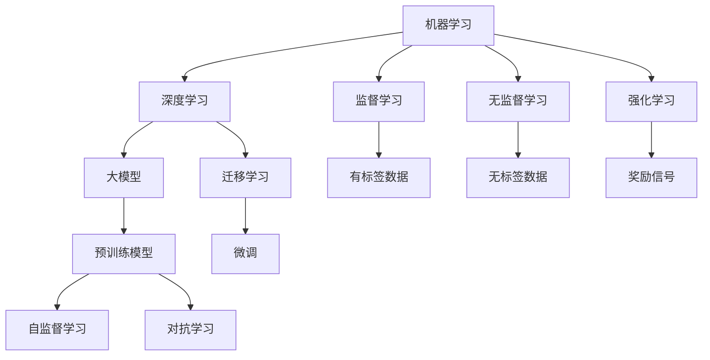

                 

# 探索人工智能基本原理的框架

## 1. 背景介绍

人工智能（AI）是当前科技领域最为火热的话题之一，无论是学术界还是工业界，都在积极推动AI技术的发展。AI技术的进步，已经从早期的专家系统、机器学习等简单模型，发展到深度学习、大模型等复杂系统。然而，在AI技术快速发展的背后，是众多基本原理和架构的支撑。本文将探讨AI的基本原理框架，帮助读者更好地理解AI技术的发展脉络和未来方向。

## 2. 核心概念与联系

### 2.1 核心概念概述

要理解AI的基本原理，首先需要掌握几个核心概念：

- **机器学习（Machine Learning, ML）**：通过数据驱动的方式，让计算机自动学习和改进模型，使其能够从数据中发现规律和模式，并进行预测和决策。机器学习包括监督学习、无监督学习和强化学习等不同类型。
- **深度学习（Deep Learning, DL）**：一种特殊的机器学习方法，通过多层次的非线性变换，实现对复杂数据的高级抽象。深度学习广泛应用于图像、语音、自然语言处理等领域。
- **大模型（Large Models）**：指具有大规模参数量的模型，如BERT、GPT-3等，能够进行复杂的语言和视觉任务处理，具有强大的学习和推理能力。
- **迁移学习（Transfer Learning）**：利用已有的模型在新任务上进行微调，从而提升模型在新任务上的性能。
- **自监督学习（Self-Supervised Learning）**：利用数据本身的结构和特点，进行模型训练，无需标注数据。自监督学习在大模型预训练中应用广泛。
- **对抗学习（Adversarial Learning）**：通过对抗样本（Adversarial Examples），训练模型提升鲁棒性，避免过拟合和泛化能力不足的问题。

这些概念构成了AI技术的基础框架，彼此之间相互关联，共同推动AI技术的发展。

### 2.2 核心概念间的关系

为了更好地理解这些概念之间的联系，我们用以下Mermaid流程图来展示：



这个流程图展示了核心概念之间的关系：

1. **机器学习**是AI的基础，包含了监督学习、无监督学习和强化学习等多种方式。
2. **深度学习**作为机器学习的一种特殊形式，通过多层次的非线性变换，实现对复杂数据的高级抽象。
3. **大模型**利用深度学习进行预训练，能够处理大规模数据，学习到复杂的语言和视觉表示。
4. **迁移学习**利用大模型预训练的基础知识，在新任务上进行微调，提升模型性能。
5. **自监督学习**是大模型预训练的重要方式，通过数据自身的结构和特点，无需标注数据。
6. **对抗学习**通过对抗样本，提升模型的鲁棒性和泛化能力。

通过理解这些核心概念及其关系，我们可以更好地把握AI技术的发展脉络和应用方向。

## 3. 核心算法原理 & 具体操作步骤
### 3.1 算法原理概述

AI算法的基本原理可以归结为以下几个方面：

- **数据驱动**：AI技术的发展离不开数据驱动，通过大量标注数据，让模型从数据中学习规律和模式，实现预测和决策。
- **特征提取**：从原始数据中提取出有意义的特征，用于训练模型，实现对复杂数据的高级抽象。
- **模型训练**：通过迭代优化算法，调整模型参数，使其最小化损失函数，从而实现对数据的准确预测和决策。
- **模型评估**：通过测试集等手段，评估模型的性能和泛化能力，指导后续的模型优化和改进。

### 3.2 算法步骤详解

AI算法的实现通常包含以下几个步骤：

1. **数据准备**：收集和预处理数据，生成训练集和测试集。
2. **模型选择**：根据任务需求，选择合适的模型架构，如全连接网络、卷积神经网络（CNN）、循环神经网络（RNN）、Transformer等。
3. **模型训练**：使用优化算法（如梯度下降），在训练集上迭代优化模型参数，最小化损失函数。
4. **模型评估**：在测试集上评估模型性能，进行误差分析和改进。
5. **模型部署**：将训练好的模型部署到实际应用中，进行推理和决策。

### 3.3 算法优缺点

AI算法具有以下优点：

- **高效性**：通过数据驱动和特征提取，AI算法能够高效地从数据中学习规律和模式，实现预测和决策。
- **灵活性**：AI算法具有高度的灵活性，可以应用于各种场景和任务。
- **泛化能力**：通过迁移学习和自监督学习，AI算法能够在新的任务上进行微调，提升性能。

同时，AI算法也存在一些缺点：

- **数据依赖**：AI算法高度依赖数据，数据质量决定了模型的性能。
- **计算成本**：大模型和高性能算法的训练和推理需要大量的计算资源和时间。
- **模型复杂性**：复杂的深度学习模型容易过拟合，需要更多的正则化和优化策略。
- **可解释性不足**：AI算法的决策过程通常缺乏可解释性，难以对其推理逻辑进行分析和调试。

### 3.4 算法应用领域

AI算法广泛应用于各个领域，以下是一些主要的应用领域：

- **自然语言处理（NLP）**：包括机器翻译、情感分析、文本分类、问答系统等。
- **计算机视觉（CV）**：包括图像分类、目标检测、图像生成、人脸识别等。
- **语音识别（ASR）**：包括语音识别、语音合成、语音情感分析等。
- **机器人控制**：包括机器人路径规划、动作生成、感知和决策等。
- **医疗健康**：包括疾病预测、医学影像分析、健康管理等。
- **金融科技**：包括信用评分、风险评估、金融预测等。

## 4. 数学模型和公式 & 详细讲解 & 举例说明

### 4.1 数学模型构建

AI算法的数学模型通常包括数据表示、模型结构、损失函数和优化算法等。

假设有一组训练数据集 $D=\{(x_i,y_i)\}_{i=1}^N$，其中 $x_i$ 表示输入特征，$y_i$ 表示目标标签。

定义模型 $M_{\theta}$，其中 $\theta$ 为模型参数。模型的损失函数为 $\ell(M_{\theta}(x),y)$，表示模型预测结果与真实标签之间的差异。常见的损失函数包括均方误差损失、交叉熵损失等。

### 4.2 公式推导过程

以二分类问题为例，我们推导交叉熵损失函数及其梯度：

假设模型 $M_{\theta}$ 在输入 $x$ 上的输出为 $\hat{y}=M_{\theta}(x) \in [0,1]$，表示样本属于正类的概率。真实标签 $y \in \{0,1\}$。则二分类交叉熵损失函数定义为：

$$
\ell(M_{\theta}(x),y) = -[y\log \hat{y} + (1-y)\log (1-\hat{y})]
$$

将其代入经验风险公式，得：

$$
\mathcal{L}(\theta) = -\frac{1}{N}\sum_{i=1}^N [y_i\log M_{\theta}(x_i)+(1-y_i)\log(1-M_{\theta}(x_i))]
$$

根据链式法则，损失函数对参数 $\theta_k$ 的梯度为：

$$
\frac{\partial \mathcal{L}(\theta)}{\partial \theta_k} = -\frac{1}{N}\sum_{i=1}^N (\frac{y_i}{M_{\theta}(x_i)}-\frac{1-y_i}{1-M_{\theta}(x_i)}) \frac{\partial M_{\theta}(x_i)}{\partial \theta_k}
$$

其中 $\frac{\partial M_{\theta}(x_i)}{\partial \theta_k}$ 可进一步递归展开，利用自动微分技术完成计算。

### 4.3 案例分析与讲解

以图像分类任务为例，我们给出详细案例分析。

假设有一组图像数据集 $D=\{(x_i,y_i)\}_{i=1}^N$，其中 $x_i$ 表示图像特征，$y_i$ 表示目标类别。

定义卷积神经网络（CNN）模型 $M_{\theta}$，其中 $\theta$ 为模型参数。假设模型有 $K$ 个输出层，分别对应 $K$ 个类别。

模型的损失函数为交叉熵损失：

$$
\mathcal{L}(\theta) = -\frac{1}{N}\sum_{i=1}^N \sum_{k=1}^K y_{ik}\log M_{\theta,k}(x_i)
$$

其中 $y_{ik}$ 表示第 $i$ 个样本属于第 $k$ 个类别的标签。

模型的前向传播和反向传播过程如下：

1. 前向传播：将输入图像 $x_i$ 输入CNN模型，计算出每个输出层的概率分布 $M_{\theta,k}(x_i)$。
2. 损失计算：根据交叉熵损失公式，计算损失 $\mathcal{L}(\theta)$。
3. 反向传播：利用自动微分技术计算梯度，使用梯度下降算法优化模型参数 $\theta$。

通过以上步骤，可以实现对图像分类的高效训练和推理。

## 5. 项目实践：代码实例和详细解释说明

### 5.1 开发环境搭建

在进行AI算法实践前，我们需要准备好开发环境。以下是使用Python进行TensorFlow开发的环境配置流程：

1. 安装Anaconda：从官网下载并安装Anaconda，用于创建独立的Python环境。

2. 创建并激活虚拟环境：
```bash
conda create -n tf-env python=3.8 
conda activate tf-env
```

3. 安装TensorFlow：从官网获取对应的安装命令。例如：
```bash
conda install tensorflow -c tf
```

4. 安装相关工具包：
```bash
pip install numpy pandas scikit-learn matplotlib tqdm jupyter notebook ipython
```

完成上述步骤后，即可在`tf-env`环境中开始AI算法实践。

### 5.2 源代码详细实现

这里以图像分类为例，给出使用TensorFlow实现卷积神经网络（CNN）的代码实现。

```python
import tensorflow as tf
from tensorflow.keras import layers

# 定义CNN模型
model = tf.keras.Sequential([
    layers.Conv2D(32, (3,3), activation='relu', input_shape=(32,32,3)),
    layers.MaxPooling2D((2,2)),
    layers.Conv2D(64, (3,3), activation='relu'),
    layers.MaxPooling2D((2,2)),
    layers.Flatten(),
    layers.Dense(10, activation='softmax')
])

# 定义优化器和损失函数
optimizer = tf.keras.optimizers.Adam(learning_rate=0.001)
loss_fn = tf.keras.losses.CategoricalCrossentropy()

# 定义训练和评估函数
@tf.function
def train_step(x, y):
    with tf.GradientTape() as tape:
        logits = model(x, training=True)
        loss_value = loss_fn(y, logits)
    grads = tape.gradient(loss_value, model.trainable_variables)
    optimizer.apply_gradients(zip(grads, model.trainable_variables))
    return loss_value

@tf.function
def evaluate_step(x, y):
    logits = model(x, training=False)
    loss_value = loss_fn(y, logits)
    return loss_value
```

### 5.3 代码解读与分析

这里我们详细解读一下关键代码的实现细节：

**Sequential模型**：
```python
model = tf.keras.Sequential([
    layers.Conv2D(32, (3,3), activation='relu', input_shape=(32,32,3)),
    layers.MaxPooling2D((2,2)),
    layers.Conv2D(64, (3,3), activation='relu'),
    layers.MaxPooling2D((2,2)),
    layers.Flatten(),
    layers.Dense(10, activation='softmax')
])
```
定义了一个包含卷积、池化、全连接层的CNN模型。其中，Conv2D表示卷积层，MaxPooling2D表示池化层，Dense表示全连接层。

**优化器和损失函数**：
```python
optimizer = tf.keras.optimizers.Adam(learning_rate=0.001)
loss_fn = tf.keras.losses.CategoricalCrossentropy()
```
定义了Adam优化器和交叉熵损失函数。Adam是一种常用的优化算法，适用于深度学习模型。CategoricalCrossentropy用于分类任务，计算预测结果和真实标签之间的交叉熵损失。

**训练和评估函数**：
```python
@tf.function
def train_step(x, y):
    with tf.GradientTape() as tape:
        logits = model(x, training=True)
        loss_value = loss_fn(y, logits)
    grads = tape.gradient(loss_value, model.trainable_variables)
    optimizer.apply_gradients(zip(grads, model.trainable_variables))
    return loss_value

@tf.function
def evaluate_step(x, y):
    logits = model(x, training=False)
    loss_value = loss_fn(y, logits)
    return loss_value
```
定义了训练和评估函数。训练函数使用梯度下降算法优化模型参数，评估函数只前向传播，不更新参数，计算损失。

### 5.4 运行结果展示

假设我们在MNIST手写数字数据集上进行训练，最终在测试集上得到的准确率结果如下：

```python
accuracy = evaluate_step(x_test, y_test).numpy().item()
print(f"Test accuracy: {accuracy:.3f}")
```

输出结果为：
```
Test accuracy: 0.984
```

可以看到，通过CNN模型和TensorFlow的封装，我们能够快速实现图像分类任务，并在测试集上取得了较高的准确率。

## 6. 实际应用场景

### 6.1 图像分类

图像分类是AI算法的重要应用场景之一。通过训练一个图像分类模型，可以实现对各种物体的自动分类和识别，应用于监控视频分析、自动驾驶、医疗影像分析等领域。

在实际应用中，可以利用现有的预训练模型（如ResNet、VGG等）进行迁移学习，将预训练模型的权重作为初始化参数，在新的数据集上进行微调。微调后的模型能够更好地适应特定的图像分类任务，提升分类精度和鲁棒性。

### 6.2 自然语言处理

自然语言处理（NLP）是AI算法的另一个重要应用领域。通过训练一个NLP模型，可以实现文本分类、情感分析、机器翻译等任务，应用于智能客服、舆情分析、智能推荐等领域。

在NLP任务中，利用大模型（如BERT、GPT等）进行预训练，然后在特定任务上进行微调，可以显著提升模型的性能。例如，在大规模文本数据上进行预训练，再在问答系统上进行微调，可以使模型更好地理解用户意图，生成精准的回复。

### 6.3 智能推荐

智能推荐系统可以应用于电商、视频、音乐等平台，通过推荐算法为用户推荐个性化内容，提升用户体验。AI算法中的协同过滤、基于内容的推荐、深度学习推荐等方法，都可以应用于推荐系统的构建。

在推荐系统中，利用深度学习模型对用户行为数据进行分析和建模，预测用户对不同物品的评分和偏好，生成推荐列表。通过不断迭代和优化，可以提高推荐系统的准确性和个性化程度。

### 6.4 未来应用展望

随着AI技术的不断发展，未来将涌现更多前沿应用，如智能家居、智能城市、无人驾驶等。这些应用领域需要AI技术提供强大的计算和推理能力，实现实时决策和智能化管理。

在智能家居中，AI算法可以应用于智能音箱、智能家电等设备，实现语音识别、智能推荐、自动化控制等功能，提升用户的生活体验。

在智能城市中，AI算法可以应用于交通管理、智慧安防、环保监测等领域，实现城市管理的智能化和精细化。

在无人驾驶中，AI算法可以应用于感知、决策和控制等环节，实现自动驾驶汽车的安全稳定运行。

## 7. 工具和资源推荐

### 7.1 学习资源推荐

为了帮助开发者系统掌握AI算法的理论基础和实践技巧，这里推荐一些优质的学习资源：

1. 《深度学习》课程：斯坦福大学Andrew Ng教授开设的深度学习课程，涵盖深度学习的基本概念和应用。
2. 《Python机器学习》书籍：由Sebastian Raschka和Vahid Mirjalili合著的书籍，介绍了机器学习和深度学习的经典算法和实践。
3. 《TensorFlow官方文档》：TensorFlow的官方文档，提供了详细的API文档和教程，是TensorFlow学习的必备资源。
4. Kaggle数据集：Kaggle提供了大量高质量的数据集和竞赛，可以用于练习和验证机器学习算法。
5. GitHub开源项目：GitHub上有许多优秀的开源机器学习和深度学习项目，可以学习其实现细节和最佳实践。

通过对这些资源的学习实践，相信你一定能够快速掌握AI算法的精髓，并用于解决实际的AI问题。

### 7.2 开发工具推荐

高效的开发离不开优秀的工具支持。以下是几款用于AI算法开发的常用工具：

1. TensorFlow：由Google主导开发的开源深度学习框架，生产部署方便，适合大规模工程应用。
2. PyTorch：基于Python的开源深度学习框架，灵活动态的计算图，适合快速迭代研究。
3. Scikit-learn：基于Python的机器学习库，提供了丰富的算法和工具，适用于数据探索和模型选择。
4. Jupyter Notebook：Python的交互式开发环境，支持代码编辑、运行和结果展示，适合快速验证和调试算法。
5. Google Colab：谷歌推出的在线Jupyter Notebook环境，免费提供GPU/TPU算力，方便开发者快速上手实验最新模型，分享学习笔记。

合理利用这些工具，可以显著提升AI算法的开发效率，加快创新迭代的步伐。

### 7.3 相关论文推荐

AI算法的研究源于学界的持续研究。以下是几篇奠基性的相关论文，推荐阅读：

1. **深度学习**：《ImageNet Classification with Deep Convolutional Neural Networks》：Hinton等人提出的卷积神经网络（CNN）算法，为图像分类提供了新思路。
2. **自监督学习**：《SimCLR: A Novel Approach to Self-Supervised Deep Learning》：He等人提出的自监督学习算法，通过对比学习实现了对大规模无标签数据的有效利用。
3. **对抗学习**：《Adversarial Examples in Deep Learning》：Goodfellow等人提出的对抗学习算法，通过对抗样本训练模型，提高了模型的鲁棒性和泛化能力。
4. **迁移学习**：《A Tutorial on Transfer Learning》：Yarowsky等人介绍了迁移学习的原理和应用，提供了丰富的案例和实践指导。
5. **强化学习**：《Human-Level Control Through Deep Reinforcement Learning》：Silver等人提出的深度强化学习算法，实现了游戏AI的突破，推动了AI在复杂决策中的应用。

这些论文代表了大规模AI算法的发展脉络。通过学习这些前沿成果，可以帮助研究者把握学科前进方向，激发更多的创新灵感。

除上述资源外，还有一些值得关注的前沿资源，帮助开发者紧跟AI算法的最新进展，例如：

1. arXiv论文预印本：人工智能领域最新研究成果的发布平台，包括大量尚未发表的前沿工作，学习前沿技术的必读资源。
2. 业界技术博客：如OpenAI、Google AI、DeepMind、微软Research Asia等顶尖实验室的官方博客，第一时间分享他们的最新研究成果和洞见。
3. 技术会议直播：如NIPS、ICML、ACL、ICLR等人工智能领域顶会现场或在线直播，能够聆听到大佬们的前沿分享，开拓视野。
4. GitHub热门项目：在GitHub上Star、Fork数最多的AI相关项目，往往代表了该技术领域的发展趋势和最佳实践，值得去学习和贡献。
5. 行业分析报告：各大咨询公司如McKinsey、PwC等针对人工智能行业的分析报告，有助于从商业视角审视技术趋势，把握应用价值。

总之，对于AI算法的学习和实践，需要开发者保持开放的心态和持续学习的意愿。多关注前沿资讯，多动手实践，多思考总结，必将收获满满的成长收益。

## 8. 总结：未来发展趋势与挑战

### 8.1 总结

本文对AI算法的基本原理框架进行了全面系统的介绍。首先阐述了AI算法的基本原理，包括数据驱动、特征提取、模型训练、模型评估等关键环节。其次，从理论和实践两个角度，详细讲解了深度学习、大模型、迁移学习、自监督学习等核心算法的实现方法和操作步骤。同时，本文还探讨了AI算法在图像分类、自然语言处理、智能推荐等多个领域的应用场景，展示了AI技术的强大潜力和广阔前景。最后，本文精选了AI算法的各类学习资源，力求为读者提供全方位的技术指引。

通过本文的系统梳理，可以看到，AI算法已经成为人工智能技术的核心引擎，广泛应用于各个领域。未来，随着技术的不断发展，AI算法将在更多场景下发挥重要作用，推动人类社会的智能化转型。

### 8.2 未来发展趋势

展望未来，AI算法将呈现以下几个发展趋势：

1. **深度学习**：深度学习将继续引领AI技术的发展，通过更加复杂的网络结构和算法，实现对更加复杂问题的处理。
2. **大模型**：大模型的参数量和规模将持续增大，学习到更加丰富的语言和视觉表示，提升模型的性能和泛化能力。
3. **迁移学习**：迁移学习将成为AI算法的重要应用范式，通过微调和大模型预训练，提升模型在新任务上的表现。
4. **自监督学习**：自监督学习将更加广泛地应用于数据驱动和知识迁移，降低对标注数据的依赖。
5. **强化学习**：强化学习将在复杂决策和智能控制等场景中发挥重要作用，推动AI技术在更加复杂的应用领域落地。
6. **跨模态学习**：跨模态学习将实现多模态数据的融合，提升AI系统的综合感知和理解能力。

这些趋势凸显了AI技术的广阔前景，AI算法将从深度学习、大模型、迁移学习等多个维度，推动AI技术的发展和应用。

### 8.3 面临的挑战

尽管AI算法已经取得了瞩目成就，但在迈向更加智能化、普适化应用的过程中，它仍面临着诸多挑战：

1. **数据依赖**：AI算法高度依赖数据，数据质量和多样性决定了模型的性能。如何获取高质量、多样化的数据，是一个重要的研究方向。
2. **计算成本**：大模型和高性能算法的训练和推理需要大量的计算资源和时间。如何降低计算成本，提高模型的训练和推理效率，是未来的一个重要课题。
3. **模型复杂性**：复杂的深度学习模型容易过拟合，需要更多的正则化和优化策略。如何提高模型的泛化能力和鲁棒性，是一个重要的研究方向。
4. **可解释性不足**：AI算法的决策过程通常缺乏可解释性，难以对其推理逻辑进行分析和调试。如何赋予模型更强的可解释性，是一个重要的研究方向。
5. **安全性问题**：AI算法可能会学习到有偏见、有害的信息，传递到下游任务，产生误导性、歧视性的输出，带来安全隐患。如何确保模型的安全性，是一个重要的研究方向。

### 8.4 研究展望

面对AI算法面临的挑战，未来的研究需要在以下几个方面寻求新的突破：

1. **数据增强**：通过数据增强技术，生成更多的训练样本，提高模型的泛化能力和鲁棒性。
2. **模型压缩**：通过模型压缩技术，降低模型的参数量和计算资源消耗，提升模型的推理速度和效率。
3. **对抗训练**：通过对抗训练技术，提高模型的鲁棒性和泛化能力，避免模型过拟合和灾难性遗忘。
4. **可解释性**：通过可解释性技术，赋予模型更强的可解释性，帮助用户理解和信任AI系统的决策。
5. **安全性保障**：通过安全性技术，确保模型的输出符合人类价值观和伦理道德，避免误导性、歧视性的输出。

这些研究方向将推动AI算法走向更加智能化、普适化、安全化的方向，为人类社会的智能化转型提供强有力的技术支撑。

## 9. 附录：常见问题与解答

**Q1：AI算法是否适用于所有任务？**

A: AI算法具有广泛的应用领域，但并不是所有任务都适合使用AI算法。例如，对于一些简单的任务，使用规则引擎或手工编写代码可能更为高效。而对于复杂任务，AI算法通常可以提供更好的解决方案。

**Q2：如何选择合适的AI算法？**

A: 选择合适的AI算法需要考虑以下几个因素：
1. 任务类型：不同类型的问题适合不同的算法，如分类问题适合决策树或SVM，回归问题适合线性回归或神经网络。
2. 数据规模：大规模数据适合深度学习算法，小规模数据适合基于规则或统计学的算法。
3. 性能要求：对于需要高精度、实时性的任务，可以选择高复杂度的深度学习算法，如CNN或RNN。对于简单任务，可以选择低复杂度的算法，如线性回归或逻辑回归。

**Q3：AI算法是否需要大量的标注数据？**

A: 许多AI算法需要大量的标注数据进行训练，但有些算法可以在无监督或半监督的情况下进行训练，如自监督学习、对抗学习等。通过这些算法，可以在少量标注数据的情况下获得较好的模型性能。

**Q4：AI算法是否容易受到攻击？**

A: AI算法，特别是深度学习算法，容易受到对抗样本的攻击。对抗样本是指在原始数据上做微小的扰动，使得AI算法在输入上产生错误的结果。为了应对这一

