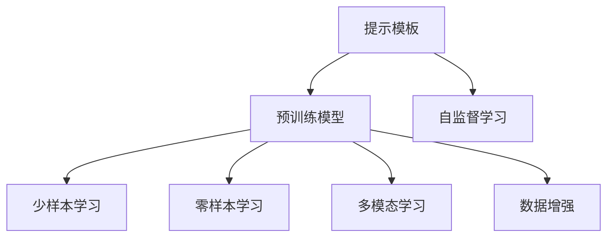
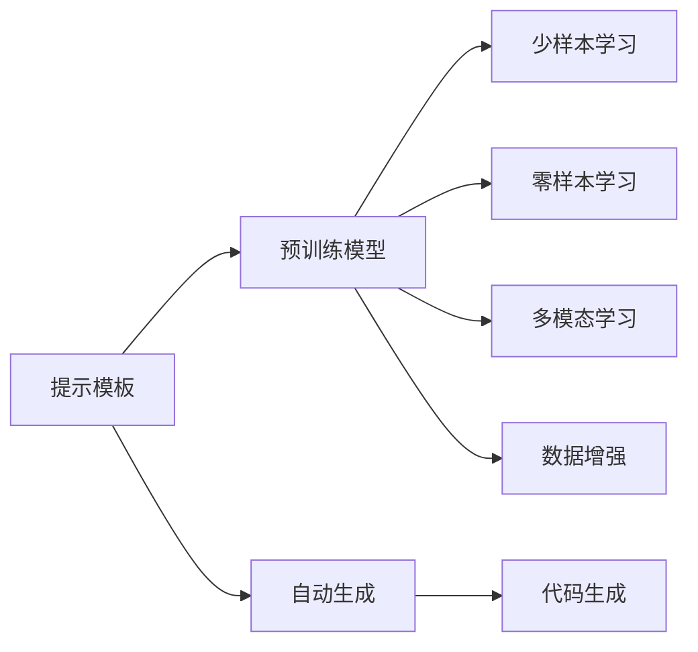

                 

# 提示工程替代传统编程语言

## 1. 背景介绍

### 1.1 问题由来
现代软件工程领域正面临一个重要转变：从传统的编程语言导向的代码编写模式，逐步过渡到以模型驱动的数据驱动模式。这一转变源于数据爆炸和计算资源的丰富，使得开发模式从以计算为中心转变为以数据为中心。在这样的背景下，基于提示工程(Prompt Engineering)的新范式应运而生，为解决复杂问题提供了全新思路。

### 1.2 问题核心关键点
提示工程的关键在于通过设计合理的提示模板（Prompt Template），指导AI模型产生合乎预期的输出，而无需编写复杂的代码逻辑。这种方法简化了编程过程，降低了门槛，同时提升了开发效率和代码质量。

### 1.3 问题研究意义
提示工程作为人工智能辅助开发的新工具，其意义在于：
1. **提高开发效率**：无需编写复杂代码，通过简单的提示模板即可生成所需结果。
2. **降低开发门槛**：降低了对编程语言和算法的依赖，使得更多非技术背景的人士也能参与开发。
3. **优化代码质量**：AI自动生成的代码往往具有较高的正确性和完备性。
4. **推动领域创新**：提示工程可以应用于多个领域，如自然语言处理(NLP)、计算机视觉(CV)、机器学习等，推动各领域的快速发展。
5. **促进产业升级**：AI技术的应用将加速各行业的数字化转型，提升整体产业竞争力。

## 2. 核心概念与联系

### 2.1 核心概念概述
为更好地理解提示工程，我们首先介绍几个关键概念：

- **提示工程(Prompt Engineering)**：通过设计合理的提示模板，指导AI模型生成特定输出，减少或避免传统编程过程，实现高效开发。

- **预训练模型(Pre-trained Model)**：在大量无标注数据上预训练得到的模型，具备强大的自监督学习能力，如BERT、GPT等。

- **自监督学习(Self-supervised Learning)**：利用无标注数据，通过预测任务进行自我监督，增强模型泛化能力。

- **零样本学习(Zero-shot Learning)**：模型在没有任何标注样本的情况下，仅通过任务描述即能生成预期结果。

- **少样本学习(Few-shot Learning)**：模型在少量标注样本的条件下，能够快速适应新任务，生成准确结果。

- **多模态学习(Multi-modal Learning)**：模型同时处理和融合多种类型的数据（如图像、文本、语音），提升综合分析能力。

- **数据增强(Data Augmentation)**：通过对数据进行变换和扩充，增加训练数据多样性，提升模型鲁棒性。

这些概念间的关系可通过以下Mermaid流程图来展示：



### 2.2 概念间的关系
提示工程与其他核心概念间存在紧密的联系，形成了以数据为中心的开发范式。我们通过以下流程图展示这些关系：



这些概念共同构成了提示工程的应用框架，使得开发过程从以编程为中心转向以数据和模型为中心，极大提升了开发效率和代码质量。

## 3. 核心算法原理 & 具体操作步骤
### 3.1 算法原理概述

提示工程的核心在于设计合理的提示模板，通过AI模型（如预训练的Transformer模型）自动生成目标代码或数据。该过程一般包括以下几个步骤：

1. **定义提示模板**：设计简洁且信息丰富的提示模板，包含任务目标、数据特征等关键信息。
2. **预训练模型选择**：选择合适的预训练模型，如GPT-3、BERT等。
3. **模型输入**：将提示模板作为输入，指导模型自动生成目标代码或数据。
4. **结果后处理**：对生成的代码或数据进行校验、优化，确保符合需求。

### 3.2 算法步骤详解

以生成Python代码为例，具体步骤详解如下：

**Step 1: 准备提示模板**
- 定义任务目标，如“编写函数计算两个数的和”。
- 指定输入和输出格式，如“输入参数为a,b，输出结果为a+b”。

**Step 2: 选择预训练模型**
- 选择GPT-3作为预训练模型，配置超参数，如学习率、批量大小等。

**Step 3: 模型输入与输出**
- 将提示模板输入模型，模型自动生成代码字符串。
- 解析生成的代码字符串，验证其语法和语义是否正确。

**Step 4: 结果后处理**
- 对生成的代码进行格式化和校验，确保符合编码规范。
- 执行生成的代码，验证其功能是否符合预期。

### 3.3 算法优缺点

**优点**：
1. **简化编程过程**：无需编写复杂的代码逻辑，只需设计提示模板。
2. **提高开发效率**：自动生成代码，缩短了开发周期。
3. **降低开发门槛**：减少了对编程语言的依赖，降低了编程门槛。
4. **优化代码质量**：AI生成的代码通常具有较高的正确性和完备性。

**缺点**：
1. **依赖提示模板**：提示模板的设计质量直接影响生成结果。
2. **模型泛化能力**：对于特定领域的问题，预训练模型可能需要进一步微调以提升生成效果。
3. **资源消耗**：提示工程需要大量的计算资源和数据，可能带来一定的成本。

### 3.4 算法应用领域

提示工程作为一种通用的开发工具，可以应用于多个领域，包括但不限于：

- **软件开发**：生成代码、编写文档、测试脚本等。
- **自然语言处理(NLP)**：生成文本、翻译、文本摘要等。
- **计算机视觉(CV)**：生成图像、标注数据等。
- **数据分析**：数据清洗、数据可视化、统计分析等。
- **机器人控制**：生成控制指令、优化路径等。

这些领域的需求多样化，提示工程提供了灵活的解决方案，能够适应各种复杂场景。

## 4. 数学模型和公式 & 详细讲解 & 举例说明

### 4.1 数学模型构建

提示工程的数学模型可以简单表示为：

$$
\text{Prompt Template} \rightarrow \text{Prompt Embedding} \rightarrow \text{Model Output}
$$

其中，提示模板经过嵌入层转换为向量表示，送入预训练模型进行生成，最终输出目标代码或数据。

### 4.2 公式推导过程

以生成Python代码为例，我们假设提示模板为 $P$，模型输出为 $O$，则生成的过程可以表示为：

$$
O = f(P; \theta)
$$

其中 $f$ 表示模型的生成函数，$\theta$ 为模型的参数。

### 4.3 案例分析与讲解

假设我们要求自动生成一个计算两个数和的Python函数，提示模板可以设计为：

```
定义函数add(x, y):
    返回x+y
```

将此模板输入GPT-3模型，模型生成的代码可能为：

```python
def add(x, y):
    return x + y
```

此时需要对生成的代码进行后处理，确保符合编码规范。

## 5. 项目实践：代码实例和详细解释说明
### 5.1 开发环境搭建

要进行提示工程项目，需要准备以下开发环境：

- **Python**：版本为3.7及以上。
- **Pip**：安装依赖包管理器。
- **Jupyter Notebook**：交互式编程环境。
- **Hugging Face Transformers库**：用于加载和微调预训练模型。

```bash
pip install torch torchvision torchaudio transformers
```

### 5.2 源代码详细实现

以下是使用Transformers库进行Python代码生成的示例代码：

```python
from transformers import pipeline

# 加载代码生成模型
model = pipeline('text-generation', model='gpt3')

# 定义提示模板
prompt = "定义函数add(x, y):\n    返回x+y"

# 生成代码
generated_code = model(prompt, max_length=50, num_return_sequences=1)[0]['generated_text']

# 输出生成的代码
print(generated_code)
```

### 5.3 代码解读与分析

上述代码实现了简单的Python代码生成功能。具体解读如下：

1. 首先，通过Pip安装必要的依赖包，包括PyTorch和Transformers库。
2. 使用Transformers库加载预训练的代码生成模型。
3. 定义提示模板，包含任务目标和输入输出格式。
4. 调用模型生成代码，设置生成长度和返回序列数。
5. 解析生成的代码，输出结果。

### 5.4 运行结果展示

运行上述代码，生成的Python代码示例如下：

```python
def add(x, y):
    return x + y
```

可以看到，模型根据提示模板成功生成了符合预期的Python代码。

## 6. 实际应用场景
### 6.1 软件开发

提示工程在软件开发中的应用非常广泛。例如，开发人员可以利用提示工程自动生成复杂的代码逻辑，减少手动编写的工作量，特别是在处理重复性任务时，效果尤为显著。此外，提示工程还可以用于编写测试脚本、生成文档等。

### 6.2 自然语言处理

在自然语言处理领域，提示工程可以用于生成文本摘要、自动翻译、对话系统等。例如，可以利用提示工程自动生成对话系统的回复，提升交互体验。

### 6.3 计算机视觉

在计算机视觉领域，提示工程可以用于生成图像处理代码、标注数据等。例如，可以利用提示工程自动生成图像数据标注脚本，提高标注效率。

### 6.4 数据分析

在数据分析领域，提示工程可以用于生成数据清洗脚本、数据可视化脚本等。例如，可以利用提示工程自动生成数据清洗代码，提高数据处理效率。

### 6.5 机器人控制

在机器人控制领域，提示工程可以用于生成机器人控制指令、路径规划代码等。例如，可以利用提示工程自动生成机器人控制指令，提高自动化程度。

## 7. 工具和资源推荐
### 7.1 学习资源推荐

为了帮助开发者掌握提示工程技术，我们推荐以下学习资源：

- **《Python代码生成与优化》**：详细介绍了代码生成技术的基本原理和实现方法。
- **Transformers官方文档**：提供了大量预训练模型的介绍和微调样例，适合快速上手。
- **《自然语言处理实战》**：涵盖自然语言处理领域的各种提示工程应用实例，适合实战练习。
- **Coursera自然语言处理课程**：由斯坦福大学提供，涵盖自然语言处理的最新研究和技术。

### 7.2 开发工具推荐

以下是几款用于提示工程开发的常用工具：

- **Python**：作为编程语言，广泛应用于提示工程开发的各个环节。
- **Jupyter Notebook**：交互式编程环境，支持代码生成和结果展示。
- **Hugging Face Transformers库**：提供了丰富的预训练模型和代码生成工具，支持快速开发。
- **GitHub**：代码托管平台，方便开发者共享和协作。

### 7.3 相关论文推荐

以下是几篇重要的提示工程相关论文，推荐阅读：

- **CodeGeneration: A Survey**：对代码生成技术的现状和未来发展进行了全面综述。
- **Generating Python Code**：介绍了使用神经网络生成Python代码的方法和效果。
- **Prompt Engineering in Natural Language Processing**：讨论了提示工程在自然语言处理中的应用及其挑战。
- **Programming by Example**：探讨了通过示例进行编程学习的方法，提示工程可借鉴其思路。

## 8. 总结：未来发展趋势与挑战

### 8.1 总结

本文对提示工程进行了全面系统的介绍，包括其背景、原理、操作步骤和应用场景。提示工程作为一种新兴的开发范式，为软件开发和人工智能应用提供了全新的思路和方法。通过设计合理的提示模板，AI模型能够自动生成符合预期的输出，大大简化了开发过程，提高了开发效率和代码质量。

### 8.2 未来发展趋势

展望未来，提示工程将呈现以下发展趋势：

1. **模型复杂度提升**：随着深度学习技术的发展，提示工程的模型将变得更加复杂，能够处理更多类型的任务。
2. **多模态融合**：提示工程将越来越多地融合多模态数据，提升模型理解和生成的能力。
3. **自适应生成**：提示工程将更加自适应，能够根据任务复杂度和数据特点自动调整生成策略。
4. **自动化生成**：提示工程将进一步自动化，减少人工干预，提升生成效果。
5. **跨领域应用**：提示工程将广泛应用于更多领域，如医疗、金融、教育等，推动这些领域的智能化发展。

### 8.3 面临的挑战

尽管提示工程前景广阔，但在实际应用中也面临以下挑战：

1. **提示模板设计**：提示模板的设计直接影响生成效果，需要开发者具备丰富的领域知识。
2. **模型泛化能力**：提示工程的模型需要具备较强的泛化能力，以应对不同领域和数据类型。
3. **资源消耗**：提示工程需要大量的计算资源和数据，可能带来一定的成本。
4. **结果验证**：生成的结果需要进行严格的验证和校验，确保符合预期。
5. **应用场景适应性**：提示工程需要根据不同应用场景进行优化和调整，提升适应性。

### 8.4 研究展望

为了克服上述挑战，未来的研究可以从以下几个方面进行探索：

1. **自动设计提示模板**：开发自动提示模板设计工具，减少人工干预。
2. **增强模型泛化能力**：在提示工程模型中引入迁移学习等技术，提升泛化能力。
3. **优化资源消耗**：采用模型压缩和加速技术，降低资源消耗。
4. **加强结果验证**：开发自动化验证工具，提高结果验证效率和准确性。
5. **提升应用场景适应性**：针对特定应用场景，优化提示工程模型，提升适应性。

总之，提示工程作为人工智能辅助开发的新工具，将带来开发范式的重大变革。通过不断探索和创新，提示工程将在更多领域发挥重要作用，推动人工智能技术的普及和应用。

## 9. 附录：常见问题与解答

**Q1：提示工程是否适用于所有开发任务？**

A: 提示工程适用于大部分开发任务，尤其是代码生成、数据处理等重复性、结构化任务。对于一些需要复杂逻辑和创新思维的任务，可能还需要人工介入。

**Q2：提示工程是否需要丰富的领域知识？**

A: 提示工程需要一定的领域知识，以设计合理的提示模板。但通过学习和实践，开发者可以在短时间内掌握相关领域的知识。

**Q3：提示工程生成的结果是否可靠？**

A: 提示工程生成的结果通常具有较高的正确性和完备性，但需要进行严格的验证和校验。

**Q4：提示工程是否需要大量的计算资源？**

A: 提示工程需要一定的计算资源，但通过模型压缩和优化技术，可以在资源有限的情况下进行高效开发。

**Q5：提示工程如何与现有开发流程结合？**

A: 提示工程可以作为现有开发流程的补充，在重复性任务中使用。对于需要复杂逻辑和创新思维的任务，仍需人工介入。

---

作者：禅与计算机程序设计艺术 / Zen and the Art of Computer Programming

