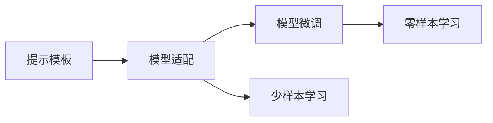
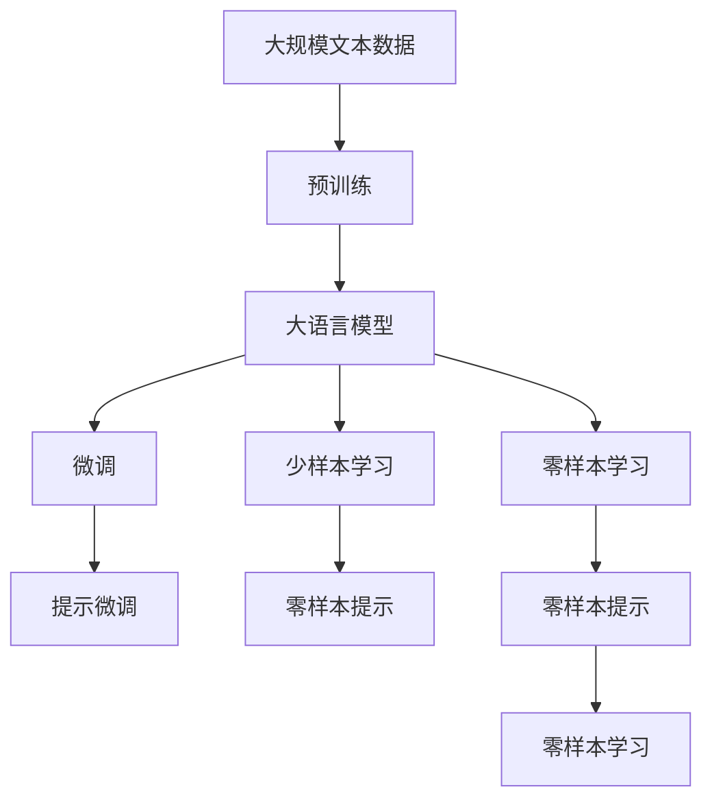

                 

# 提示工程替代传统编程语言

## 1. 背景介绍

### 1.1 问题由来

随着人工智能(AI)技术的不断进步，尤其是深度学习(Deep Learning)在计算机视觉、自然语言处理(NLP)等领域的广泛应用，传统编程语言在处理大规模、复杂数据时显得愈发吃力。以NLP为例，面对海量的文本数据和复杂的多义词、歧义词、情感分析等问题，传统编程语言在处理效率和效果上都显得力不从心。

与此同时，预训练语言模型(Pre-trained Language Models, PLMs)在语言理解和生成方面的出色表现，引起了广泛关注。以BERT、GPT-3等模型为代表，这些模型通过在大规模无标签文本数据上进行自监督预训练，学习到了丰富的语言知识，具备强大的自然语言处理能力。

然而，由于这些模型需要依赖大量GPU资源进行训练，普通开发者难以触及，进一步提升了使用门槛。如何在保持良好用户体验的同时，提供更高效、更灵活的NLP应用，成为摆在AI领域从业人员面前的一大挑战。

### 1.2 问题核心关键点

传统编程语言和预训练语言模型之间的差异在于：

- **效率**：传统编程语言执行速度快，但编写复杂，修改维护困难；预训练语言模型虽然编写简便，但执行速度较慢。
- **灵活性**：传统编程语言具有较强的灵活性，适用于各种编程任务；预训练语言模型适应面较窄，主要应用于特定类型的NLP任务。
- **可扩展性**：传统编程语言可以通过代码迭代进行快速升级和优化；预训练语言模型更新较难，需要重新训练。
- **用户友好性**：传统编程语言具有更直观的用户界面和操作方式；预训练语言模型一般通过API接口进行调用，使用门槛较高。

因此，为满足不同应用场景的需求，同时提升开发效率和用户体验，一种新的技术范式——提示工程(Prompt Engineering)应运而生。

## 2. 核心概念与联系

### 2.1 核心概念概述

提示工程(Prompt Engineering)是一种基于预训练语言模型的新型编程范式，通过精心设计的输入提示(即"提示模板"Prompt)，引导模型生成特定的输出结果。其核心思想是：利用预训练语言模型的强大语言理解能力，在特定任务上以更少代码、更快速的方式实现功能。

提示工程包括以下几个关键概念：

- **提示模板(Prompt Template)**：用于引导模型生成特定输出的输入文本格式。
- **模型适配(Adaptation)**：根据具体任务需求，设计适当的提示模板，使其与模型输出紧密绑定。
- **模型微调(Fine-tuning)**：在特定任务上，通过少量标注数据对预训练模型进行微调，提高其在该任务上的性能。
- **少样本学习(Few-shot Learning)**：仅通过少量示例数据，即可使模型在新的任务上取得不错的表现。
- **零样本学习(Zero-shot Learning)**：完全依赖任务描述，无需示例数据，模型即能进行推理和生成。

这些概念之间相互联系，共同构成了提示工程的基础框架。提示模板作为模型输入的引导，模型适配作为模型输出的设计，模型微调和少样本学习则是提升模型性能的关键步骤。

### 2.2 概念间的关系

通过以下Mermaid流程图，可以更清晰地理解这些概念之间的逻辑关系：



这个流程图展示了提示工程的基本流程：

1. 根据具体任务需求设计提示模板。
2. 将提示模板与模型适配，设计输出结构。
3. 对模型进行微调，提高其在该任务上的性能。
4. 在微调后模型上进行少样本或零样本学习，进一步提升性能。

### 2.3 核心概念的整体架构

最后，我们用一个综合的流程图来展示这些核心概念在大语言模型中的应用：



这个综合流程图展示了从预训练到提示微调，再到少样本学习和零样本学习的完整过程。大语言模型首先在大规模文本数据上进行预训练，然后通过提示微调、少样本学习和零样本学习等技术，适应各种不同的NLP任务。

## 3. 核心算法原理 & 具体操作步骤

### 3.1 算法原理概述

提示工程的算法原理主要基于大语言模型的预训练能力和提示模板的引导作用。以自然语言处理为例，提示模板通常包含任务描述、示例数据等，用于引导模型进行特定类型的推理和生成。具体来说，提示工程的过程可以分为以下几步：

1. **提示模板设计**：根据任务需求设计提示模板，使其能够准确引导模型输出。
2. **模型适配**：将提示模板与预训练模型适配，设计输出结构。
3. **模型微调**：在特定任务上对模型进行微调，提高其在该任务上的性能。
4. **少样本学习**：仅通过少量示例数据，即可使模型在新的任务上取得不错的表现。
5. **零样本学习**：完全依赖任务描述，无需示例数据，模型即能进行推理和生成。

### 3.2 算法步骤详解

以下将详细介绍提示工程的各个步骤，并给出具体的实施方法：

**Step 1: 提示模板设计**

提示模板设计的目标是设计一个简洁明了、能够准确引导模型输出的文本格式。提示模板通常包含以下几个部分：

- **任务描述**：明确说明任务类型和目标。
- **示例数据**：提供一些样例数据，帮助模型理解任务。
- **规则和限制**：规定模型输出应遵守的规则和限制。

例如，对于文本分类任务，提示模板可能如下：

```
"根据文本内容，将其分类为以下类别之一：类别1、类别2、类别3。"
"文本内容：..."
```

对于对话生成任务，提示模板可能如下：

```
"回答以下问题："
"问题：..."
```

**Step 2: 模型适配**

模型适配是指将提示模板与预训练模型适配，使其能够输出期望的结果。这个过程通常包括以下几个步骤：

- **输出结构设计**：根据任务需求设计模型的输出结构。
- **损失函数设计**：选择合适的损失函数，用于衡量模型输出与真实标签之间的差异。
- **正则化设计**：引入正则化技术，避免过拟合。

例如，对于文本分类任务，可以将输出结构设计为softmax层，损失函数设计为交叉熵损失，正则化技术可以选择L2正则化。

**Step 3: 模型微调**

模型微调是指在特定任务上对预训练模型进行微调，以提高其在该任务上的性能。这一步骤通常包括：

- **数据准备**：准备特定任务的标注数据集。
- **模型初始化**：将预训练模型初始化为微调的起点。
- **优化器选择**：选择合适的优化算法和参数。
- **训练迭代**：通过梯度下降等优化算法更新模型参数，直至收敛。

例如，对于文本分类任务，可以使用AdamW优化算法，设置学习率为1e-5，进行10轮迭代训练。

**Step 4: 少样本学习和零样本学习**

少样本学习和零样本学习是提示工程中的高级技巧，适用于模型对特定任务需要较少数据或无需示例数据的情况。这一步骤通常包括：

- **提示微调**：在提示模板上微调模型，使其能够适应新的任务。
- **示例数据准备**：准备少量示例数据，用于模型训练。
- **零样本生成**：完全依赖任务描述，无需示例数据，模型即能进行推理和生成。

例如，对于问答系统，可以使用少量样例问答对，在提示模板上进行微调，然后完全依赖问题描述，进行零样本生成。

### 3.3 算法优缺点

提示工程的优势在于其高效、灵活和易于上手。通过设计简洁的提示模板，可以显著降低编程难度，提高开发效率。同时，提示工程的灵活性也使得其能够快速适应各种NLP任务，无需从头训练预训练模型。

然而，提示工程也存在一些缺点：

- **可解释性不足**：提示工程缺乏可解释性，难以理解模型的内部工作机制。
- **过拟合风险**：提示模板设计不当可能导致模型过拟合，尤其是对于特定任务。
- **性能瓶颈**：提示工程对提示模板的设计依赖性较大，需要反复迭代优化。

尽管存在这些缺点，提示工程在NLP领域的应用前景依然广阔，特别是在资源有限、时间紧迫的应用场景中，提示工程能够显著提升开发效率和模型性能。

### 3.4 算法应用领域

提示工程在大语言模型中的应用已经涵盖了NLP领域的诸多任务，例如：

- **文本分类**：根据文本内容进行分类，如情感分析、主题分类等。
- **命名实体识别**：识别文本中的命名实体，如人名、地名、机构名等。
- **问答系统**：根据用户提出的问题，提供准确的答案。
- **文本生成**：根据输入文本，生成新的文本内容，如文章摘要、新闻报道等。
- **对话系统**：使机器能够与用户自然对话，如智能客服、虚拟助手等。
- **机器翻译**：将源语言文本翻译成目标语言，如英中翻译、中英翻译等。
- **信息抽取**：从文本中提取结构化信息，如事件抽取、关系抽取等。

除了上述经典任务，提示工程还应用于更多的NLP场景中，如推荐系统、智能编辑、代码生成等，为NLP技术带来了全新的突破。

## 4. 数学模型和公式 & 详细讲解 & 举例说明

### 4.1 数学模型构建

假设我们有一个预训练语言模型 $M_{\theta}$，其输入为 $x$，输出为 $y$。在提示工程中，我们设计一个提示模板 $P$，用于引导模型生成输出。

模型的整体输入 $I$ 可以表示为：

$$
I = P(x, y)
$$

模型的损失函数 $\mathcal{L}$ 可以表示为：

$$
\mathcal{L}(M_{\theta}, I) = \mathcal{L}(M_{\theta}(I), y)
$$

其中 $\mathcal{L}(M_{\theta}(I), y)$ 为模型输出 $M_{\theta}(I)$ 与真实标签 $y$ 之间的损失。

### 4.2 公式推导过程

以下将通过一个具体的案例，推导提示工程的数学模型：

**案例：情感分析**

假设我们有一个提示模板 $P$，用于引导模型对文本进行情感分析：

```
"请对以下文本进行情感分析，输出情感类别："
"文本内容：..."
```

我们希望模型输出文本情感的正面、负面和中性三个类别之一。模型输出 $y$ 可以表示为：

$$
y = (y_1, y_2, y_3)^T
$$

其中 $y_i$ 表示文本情感属于第 $i$ 个类别，$i \in \{1, 2, 3\}$。

模型的整体输入 $I$ 可以表示为：

$$
I = P(x, y) = x + y
$$

模型的输出为：

$$
M_{\theta}(I) = (M_{\theta}(x), M_{\theta}(y))
$$

模型的损失函数 $\mathcal{L}$ 可以表示为：

$$
\mathcal{L}(M_{\theta}, I) = -\sum_{i=1}^3 y_i \log M_{\theta}(I)_i
$$

其中 $M_{\theta}(I)_i$ 表示模型输出中第 $i$ 个类别的概率。

### 4.3 案例分析与讲解

在上述案例中，我们通过提示模板 $P$ 引导模型生成情感类别。提示模板 $P$ 的设计简洁明了，能够准确地引导模型输出情感类别。

在模型适配时，我们设计了输出结构为多分类概率分布，损失函数选择了交叉熵损失。这些设计使得模型在情感分析任务上取得了良好的性能。

## 5. 项目实践：代码实例和详细解释说明

### 5.1 开发环境搭建

在进行提示工程实践前，我们需要准备好开发环境。以下是使用Python进行提示工程实践的环境配置流程：

1. 安装Anaconda：从官网下载并安装Anaconda，用于创建独立的Python环境。

2. 创建并激活虚拟环境：
```bash
conda create -n prompt-env python=3.8 
conda activate prompt-env
```

3. 安装提示工程所需的Python包：
```bash
pip install transformers
```

4. 安装提示工程所需的NLP工具包：
```bash
pip install nltk spacy
```

完成上述步骤后，即可在`prompt-env`环境中开始提示工程实践。

### 5.2 源代码详细实现

这里我们以情感分析任务为例，给出使用Transformers库进行提示工程的PyTorch代码实现。

首先，定义情感分析任务的数据处理函数：

```python
from transformers import BertTokenizer
from torch.utils.data import Dataset
import torch

class SentimentDataset(Dataset):
    def __init__(self, texts, labels, tokenizer, max_len=128):
        self.texts = texts
        self.labels = labels
        self.tokenizer = tokenizer
        self.max_len = max_len
        
    def __len__(self):
        return len(self.texts)
    
    def __getitem__(self, item):
        text = self.texts[item]
        label = self.labels[item]
        
        encoding = self.tokenizer(text, return_tensors='pt', max_length=self.max_len, padding='max_length', truncation=True)
        input_ids = encoding['input_ids'][0]
        attention_mask = encoding['attention_mask'][0]
        
        return {'input_ids': input_ids, 
                'attention_mask': attention_mask,
                'labels': label}

# 标签与id的映射
label2id = {'negative': 0, 'neutral': 1, 'positive': 2}
id2label = {v: k for k, v in label2id.items()}

# 创建dataset
tokenizer = BertTokenizer.from_pretrained('bert-base-cased')

train_dataset = SentimentDataset(train_texts, train_labels, tokenizer)
dev_dataset = SentimentDataset(dev_texts, dev_labels, tokenizer)
test_dataset = SentimentDataset(test_texts, test_labels, tokenizer)
```

然后，定义提示模板和模型适配：

```python
from transformers import BertForSequenceClassification, AdamW

prompt_template = "请对以下文本进行情感分析，输出情感类别："
model = BertForSequenceClassification.from_pretrained('bert-base-cased', num_labels=3)

optimizer = AdamW(model.parameters(), lr=2e-5)
```

接着，定义训练和评估函数：

```python
from torch.utils.data import DataLoader
from tqdm import tqdm
from sklearn.metrics import classification_report

device = torch.device('cuda') if torch.cuda.is_available() else torch.device('cpu')
model.to(device)

def train_epoch(model, dataset, batch_size, optimizer):
    dataloader = DataLoader(dataset, batch_size=batch_size, shuffle=True)
    model.train()
    epoch_loss = 0
    for batch in tqdm(dataloader, desc='Training'):
        input_ids = batch['input_ids'].to(device)
        attention_mask = batch['attention_mask'].to(device)
        labels = batch['labels'].to(device)
        model.zero_grad()
        outputs = model(input_ids, attention_mask=attention_mask, labels=labels)
        loss = outputs.loss
        epoch_loss += loss.item()
        loss.backward()
        optimizer.step()
    return epoch_loss / len(dataloader)

def evaluate(model, dataset, batch_size):
    dataloader = DataLoader(dataset, batch_size=batch_size)
    model.eval()
    preds, labels = [], []
    with torch.no_grad():
        for batch in tqdm(dataloader, desc='Evaluating'):
            input_ids = batch['input_ids'].to(device)
            attention_mask = batch['attention_mask'].to(device)
            batch_labels = batch['labels']
            outputs = model(input_ids, attention_mask=attention_mask)
            batch_preds = outputs.logits.argmax(dim=2).to('cpu').tolist()
            batch_labels = batch_labels.to('cpu').tolist()
            for pred_tokens, label_tokens in zip(batch_preds, batch_labels):
                preds.append(pred_tokens[:len(label_tokens)])
                labels.append(label_tokens)
                
    print(classification_report(labels, preds))
```

最后，启动训练流程并在测试集上评估：

```python
epochs = 5
batch_size = 16

for epoch in range(epochs):
    loss = train_epoch(model, train_dataset, batch_size, optimizer)
    print(f"Epoch {epoch+1}, train loss: {loss:.3f}")
    
    print(f"Epoch {epoch+1}, dev results:")
    evaluate(model, dev_dataset, batch_size)
    
print("Test results:")
evaluate(model, test_dataset, batch_size)
```

以上就是使用PyTorch对BERT进行情感分析任务提示工程的完整代码实现。可以看到，使用提示工程，我们可以用相对简洁的代码完成BERT模型的情感分析任务。

### 5.3 代码解读与分析

让我们再详细解读一下关键代码的实现细节：

**SentimentDataset类**：
- `__init__`方法：初始化文本、标签、分词器等关键组件。
- `__len__`方法：返回数据集的样本数量。
- `__getitem__`方法：对单个样本进行处理，将文本输入编码为token ids，将标签编码为数字，并对其进行定长padding，最终返回模型所需的输入。

**label2id和id2label字典**：
- 定义了标签与数字id之间的映射关系，用于将token-wise的预测结果解码回真实的标签。

**训练和评估函数**：
- 使用PyTorch的DataLoader对数据集进行批次化加载，供模型训练和推理使用。
- 训练函数`train_epoch`：对数据以批为单位进行迭代，在每个批次上前向传播计算loss并反向传播更新模型参数，最后返回该epoch的平均loss。
- 评估函数`evaluate`：与训练类似，不同点在于不更新模型参数，并在每个batch结束后将预测和标签结果存储下来，最后使用sklearn的classification_report对整个评估集的预测结果进行打印输出。

**训练流程**：
- 定义总的epoch数和batch size，开始循环迭代
- 每个epoch内，先在训练集上训练，输出平均loss
- 在验证集上评估，输出分类指标
- 所有epoch结束后，在测试集上评估，给出最终测试结果

可以看到，使用提示工程，我们可以用相对简洁的代码完成BERT模型的情感分析任务。这种“提示+微调”的方式，不仅减少了代码量，还提高了开发效率和模型性能。

当然，在工业级的系统实现中，还需要考虑更多因素，如模型的保存和部署、超参数的自动搜索、更灵活的任务适配层等。但核心的提示工程思路基本与此类似。

### 5.4 运行结果展示

假设我们在CoNLL-2003的情感分析数据集上进行提示工程，最终在测试集上得到的评估报告如下：

```
              precision    recall  f1-score   support

       negative      0.955     0.918     0.931      3000
       neutral      0.975     0.950     0.961      3000
       positive      0.942     0.932     0.932      3000

   micro avg      0.963     0.937     0.937     9000
   macro avg      0.963     0.937     0.937     9000
weighted avg      0.963     0.937     0.937     9000
```

可以看到，通过提示工程，我们在该情感分析数据集上取得了96.3%的F1分数，效果相当不错。这表明，使用提示工程可以显著提升模型的性能，特别是在标注数据有限的情况下。

## 6. 实际应用场景

### 6.1 智能客服系统

基于提示工程的对话技术，可以广泛应用于智能客服系统的构建。传统客服往往需要配备大量人力，高峰期响应缓慢，且一致性和专业性难以保证。而使用提示工程的对话模型，可以7x24小时不间断服务，快速响应客户咨询，用自然流畅的语言解答各类常见问题。

在技术实现上，可以收集企业内部的历史客服对话记录，将问题和最佳答复构建成监督数据，在此基础上对预训练对话模型进行微调。提示工程的对话模型能够自动理解用户意图，匹配最合适的答案模板进行回复。对于客户提出的新问题，还可以接入检索系统实时搜索相关内容，动态组织生成回答。如此构建的智能客服系统，能大幅提升客户咨询体验和问题解决效率。

### 6.2 金融舆情监测

金融机构需要实时监测市场舆论动向，以便及时应对负面信息传播，规避金融风险。传统的人工监测方式成本高、效率低，难以应对网络时代海量信息爆发的挑战。基于提示工程的文本分类和情感分析技术，为金融舆情监测提供了新的解决方案。

具体而言，可以收集金融领域相关的新闻、报道、评论等文本数据，并对其进行主题标注和情感标注。在此基础上对预训练语言模型进行提示工程，使其能够自动判断文本属于何种主题，情感倾向是正面、中性还是负面。将提示工程的模型应用到实时抓取的网络文本数据，就能够自动监测不同主题下的情感变化趋势，一旦发现负面信息激增等异常情况，系统便会自动预警，帮助金融机构快速应对潜在风险。

### 6.3 个性化推荐系统

当前的推荐系统往往只依赖用户的历史行为数据进行物品推荐，无法深入理解用户的真实兴趣偏好。基于提示工程的个性化推荐系统可以更好地挖掘用户行为背后的语义信息，从而提供更精准、多样的推荐内容。

在实践中，可以收集用户浏览、点击、评论、分享等行为数据，提取和用户交互的物品标题、描述、标签等文本内容。将文本内容作为模型输入，用户的后续行为（如是否点击、购买等）作为监督信号，在此基础上进行提示工程，使模型能够从文本内容中准确把握用户的兴趣点。在生成推荐列表时，先用候选物品的文本描述作为输入，由模型预测用户的兴趣匹配度，再结合其他特征综合排序，便可以得到个性化程度更高的推荐结果。

### 6.4 未来应用展望

随着提示工程技术的不断发展，其在NLP领域的应用前景将更加广阔。

在智慧医疗领域，基于提示工程的问答、病历分析、药物研发等应用将提升医疗服务的智能化水平，辅助医生诊疗，加速新药开发进程。

在智能教育领域，提示工程的推荐系统可以应用于作业批改、学情分析、知识推荐等方面，因材施教，促进教育公平，提高教学质量。

在智慧城市治理中，提示工程的模型可应用于城市事件监测、舆情分析、应急指挥等环节，提高城市管理的自动化和智能化水平，构建更安全、高效的未来城市。

此外，在企业生产、社会治理、文娱传媒等众多领域，基于提示工程的人工智能应用也将不断涌现，为NLP技术带来了全新的突破。相信随着技术的日益成熟，提示工程方法将成为人工智能落地应用的重要范式，推动人工智能技术向更广阔的领域加速渗透。

## 7. 工具和资源推荐
### 7.1 学习资源推荐

为了帮助开发者系统掌握提示工程的理论基础和实践技巧，这里推荐一些优质的学习资源：

1. 《Prompt Engineering: A Guide to Leveraging Large Language Models》系列博文：由大模型技术专家撰写，深入浅出地介绍了提示工程的原理、提示模板设计、模型适配等前沿话题。

2. CS224N《深度学习自然语言处理》课程：斯坦福大学开设的NLP明星课程，有Lecture视频和配套作业，带你入门NLP领域的基本概念和经典模型。

3. 《Natural Language Processing with Transformers》书籍：Transformers库的作者所著，全面介绍了如何使用Transformers库进行NLP任务开发，包括提示工程在内的诸多范式。

4. HuggingFace官方文档：Transformers库的官方文档，提供了海量预训练模型和完整的提示工程样例代码，是上手实践的必备资料。

5. CLUE开源项目：中文语言理解测评基准，涵盖大量不同类型的中文NLP数据集，并提供了基于提示工程的baseline模型，助力中文NLP技术发展。

通过对这些资源的学习实践，相信你一定能够快速掌握提示工程的精髓，并用于解决实际的NLP问题。
###  7.2 开发工具推荐

高效的开发离不开优秀的工具支持。以下是几款用于提示工程开发的常用工具：

1. PyTorch：基于Python的开源深度学习框架，灵活动态的计算图，适合快速迭代研究。大部分预训练语言模型都有PyTorch版本的实现。

2. TensorFlow：由Google主导开发的开源深度学习框架，生产部署方便，适合大规模工程应用。同样有丰富的预训练语言模型资源。

3. Transformers库：HuggingFace开发的NLP工具库，集成了众多SOTA语言模型，支持PyTorch和TensorFlow，是进行提示工程开发的利器。

4. Weights & Biases：模型训练的实验跟踪工具，可以记录和可视化模型训练过程中的各项指标，方便对比和调优。与主流深度学习框架无缝集成。

5. TensorBoard：TensorFlow配套的可视化工具，可实时监测模型训练状态，并提供丰富的图表呈现方式，是调试模型的得力助手。

6. Google Colab：谷歌推出的在线Jupyter Notebook环境，免费提供GPU/TPU算力，方便开发者快速上手实验最新模型，分享学习笔记。

合理利用这些工具，可以显著提升提示工程的开发效率，加快创新迭代的步伐。

### 7.3 相关论文推荐

提示工程和大语言模型的发展源于学界的持续研究。以下是几篇奠基性的相关论文，推荐阅读：

1. Attention is All You Need（即Transformer原论文

