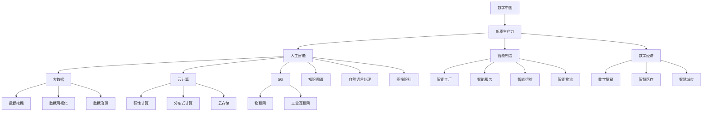
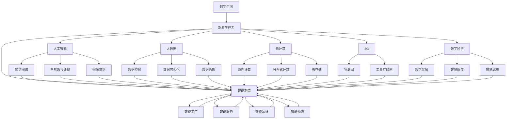

                 

# 数字中国与新质生产力布局

> 关键词：数字中国,新质生产力,人工智能,云计算,大数据,5G,智能制造,数字经济

## 1. 背景介绍

### 1.1 问题由来
当前，全球正处于第四次工业革命的浪潮中，新一轮科技革命和产业变革方兴未艾。伴随着信息技术的迅猛发展，数字经济作为新型经济形态，已经成为世界经济增长的主要动力。特别是中国，早在2017年就明确提出要推动经济社会数字化转型，加快建设数字中国。

数字中国不仅是数字化转型，更是全要素数字化、全方位感知化、全链条协同化的智能化转型，是实现高质量发展的必然路径。数字化的转型，通过大数据、人工智能、区块链等前沿技术，形成了新质生产力布局，将为中国经济高质量发展提供新动能，促进产业升级和经济结构的优化。

### 1.2 问题核心关键点
在数字中国的建设过程中，新质生产力的布局至关重要。新质生产力，是指基于人工智能、大数据、云计算、5G、物联网等新一代信息技术的综合作用，构建的新型生产方式。这种生产方式具有智能化、协同化、可定制化等特征，能够在减少资源消耗的同时，极大提升生产效率和经济效益。

新质生产力的布局，不仅涉及技术的开发和应用，还涉及管理和组织模式的变革，需要从顶层设计到基础架构，再到具体实践，进行全面的创新和优化。本文将从技术原理和操作流程出发，探讨新质生产力的构建策略，并结合实际应用场景，提供具体的实践案例和解决方案。

### 1.3 问题研究意义
新质生产力的布局，对于推动中国经济社会全面数字化转型，促进数字经济的快速发展，具有重要的战略意义：

1. **创新驱动发展**：新质生产力布局能够推动传统产业的数字化转型，促进新兴产业的发展，推动经济高质量增长。
2. **提升国际竞争力**：通过新技术的应用，提升产业的智能化水平和竞争力，增强中国在全球产业链中的地位。
3. **促进就业结构升级**：新质生产力布局将带来新的就业机会，促进劳动力结构的优化和升级。
4. **实现区域均衡发展**：通过数字技术的广泛应用，缩小地区发展差距，促进区域经济的均衡发展。

## 2. 核心概念与联系

### 2.1 核心概念概述

为了更好地理解数字中国和新质生产力布局，本节将介绍几个关键概念及其相互关系：

- **数字中国**：在数字时代背景下，通过信息技术和实体经济深度融合，推动经济社会全面数字化转型的发展策略。
- **新质生产力**：以人工智能、大数据、云计算等为核心的新型生产方式，具有智能化、协同化、可定制化等特征。
- **人工智能**：通过算法、数据和计算能力，模拟和延伸人类智能的科学技术，用于解决复杂问题。
- **大数据**：指大量的结构化、半结构化、非结构化数据，通过数据分析、挖掘、处理等技术，用于决策支持、预测分析等。
- **云计算**：基于互联网的计算模式，用户按需使用资源，无需维护复杂的计算设施。
- **5G**：新一代无线通信技术，能够实现高速度、低延迟、大规模连接的通信，为物联网、智能制造等领域提供技术支撑。
- **智能制造**：利用数字技术和智能设备，实现生产过程的自动化、智能化和可定制化，提升生产效率和产品质量。
- **数字经济**：基于数字技术和信息基础设施，通过数字化转型，推动经济结构优化升级的经济发展形态。

这些概念之间存在紧密的联系，通过技术集成和应用，形成新质生产力布局，推动经济高质量发展。

### 2.2 概念间的关系

这些核心概念之间的逻辑关系可以通过以下Mermaid流程图来展示：



这个流程图展示了各个概念之间的关联关系，以及它们如何共同作用于数字中国的构建：

- 人工智能、大数据、云计算等技术是新质生产力的重要组成部分，能够推动智能化、协同化、可定制化生产方式的实现。
- 5G技术为物联网、智能制造等提供通信基础，促进智能设备和系统的互联互通。
- 智能制造、数字经济等具体应用场景，通过新质生产力的支撑，实现生产过程的自动化、智能化和可定制化。

### 2.3 核心概念的整体架构

最后，我们用一个综合的流程图来展示这些核心概念在新质生产力布局中的整体架构：



这个综合流程图展示了各个概念在新质生产力布局中的作用和相互关系，可以帮助我们更好地理解其构建策略。

## 3. 核心算法原理 & 具体操作步骤
### 3.1 算法原理概述

新质生产力的布局，涉及信息技术与实体经济深度融合，实现智能化、协同化、可定制化生产方式。其核心算法原理主要包括以下几个方面：

- **数据驱动决策**：通过大数据技术，收集、处理、分析海量数据，实现基于数据的决策支持。
- **智能算法优化**：利用人工智能算法，实现对生产过程的智能优化，提升生产效率和质量。
- **边缘计算与云协同**：通过边缘计算与云平台的协同工作，实现生产环境的智能化管理。
- **网络通信协议优化**：利用5G等新一代通信技术，优化生产环境的网络通信协议，提升数据传输效率。

### 3.2 算法步骤详解

新质生产力的布局，可以按照以下步骤进行：

**Step 1: 数据收集与预处理**
- 收集生产环境中的各种数据，包括传感器数据、生产流程数据、设备状态数据等。
- 对收集的数据进行清洗、归一化、标准化等预处理，确保数据质量。

**Step 2: 数据分析与建模**
- 利用大数据技术，对清洗后的数据进行统计分析、数据挖掘、特征提取等处理。
- 构建数据模型，用于预测、分类、聚类等任务，支持决策支持。

**Step 3: 智能算法优化**
- 利用机器学习、深度学习等算法，对生产过程进行智能化优化，提升生产效率和质量。
- 应用自然语言处理、图像识别等技术，对生产环境进行智能监控和维护。

**Step 4: 网络通信协议优化**
- 利用5G等新一代通信技术，优化生产环境的网络通信协议，提升数据传输效率。
- 应用物联网技术，实现设备之间的互联互通，支持智能控制和协同工作。

**Step 5: 云计算与边缘计算协同**
- 利用云计算平台，实现数据存储、计算、分析等功能，支持大规模生产环境的智能化管理。
- 利用边缘计算技术，在生产现场进行数据处理和分析，支持实时监控和控制。

**Step 6: 可视化与决策支持**
- 利用数据可视化技术，展示生产环境的实时数据和分析结果，支持决策支持。
- 利用人工智能技术，对生产过程进行预测和优化，提供智能决策支持。

### 3.3 算法优缺点

新质生产力的布局，虽然能够显著提升生产效率和经济效益，但也存在一些缺点：

- **技术门槛高**：新质生产力布局涉及多种先进技术，需要较高的技术门槛和专业技能。
- **数据隐私与安全问题**：生产环境中的海量数据涉及敏感信息，如何保护数据隐私与安全是一个重要问题。
- **基础设施建设复杂**：新质生产力布局需要建设复杂的基础设施，包括传感器、通信网络、计算设施等，需要较高的投入。
- **人力资源需求大**：新质生产力布局需要大量的技术人才和管理人才，人力资源需求较大。

### 3.4 算法应用领域

新质生产力的布局，已经广泛应用于多个领域，包括智能制造、智能农业、智能医疗、智慧城市等。以下是一个具体的智能制造案例：

**案例: 智能工厂的数字化转型**

某大型制造企业，通过新质生产力的布局，实现了数字化转型。具体步骤如下：

1. **数据收集与预处理**：在生产线上安装各种传感器，收集设备状态、产品质量、生产流程等数据。对数据进行清洗、归一化、标准化等预处理，确保数据质量。

2. **数据分析与建模**：利用大数据技术，对清洗后的数据进行统计分析、数据挖掘、特征提取等处理。构建数据模型，用于预测设备故障、优化生产流程等任务，支持决策支持。

3. **智能算法优化**：利用机器学习、深度学习等算法，对生产过程进行智能化优化，提升生产效率和质量。应用自然语言处理、图像识别等技术，对生产环境进行智能监控和维护。

4. **网络通信协议优化**：利用5G等新一代通信技术，优化生产环境的网络通信协议，提升数据传输效率。

5. **云计算与边缘计算协同**：利用云计算平台，实现数据存储、计算、分析等功能，支持大规模生产环境的智能化管理。利用边缘计算技术，在生产现场进行数据处理和分析，支持实时监控和控制。

6. **可视化与决策支持**：利用数据可视化技术，展示生产环境的实时数据和分析结果，支持决策支持。利用人工智能技术，对生产过程进行预测和优化，提供智能决策支持。

通过新质生产力的布局，该制造企业实现了生产过程的自动化、智能化和可定制化，大幅提升了生产效率和经济效益。

## 4. 数学模型和公式 & 详细讲解  
### 4.1 数学模型构建

在新质生产力的布局中，数学模型构建是一个重要环节。本文以智能工厂为例，展示其数学模型构建过程。

假设智能工厂的生产过程为 $X_t = f(X_{t-1}, W_t, D_t, \epsilon_t)$，其中：

- $X_t$：第 $t$ 时刻的生产状态；
- $W_t$：第 $t$ 时刻的生产任务；
- $D_t$：第 $t$ 时刻的生产数据；
- $\epsilon_t$：第 $t$ 时刻的生产扰动。

智能工厂的优化目标为最小化生产成本和最大化生产效率。设生产成本为 $C_t$，生产效率为 $E_t$，则优化目标可以表示为：

$$
\min_{W_t, D_t} \mathcal{L}(W_t, D_t) = \alpha C_t + \beta E_t
$$

其中，$\alpha$ 和 $\beta$ 为成本和效率的权重系数。

### 4.2 公式推导过程

根据上述优化目标，我们可以构建智能工厂的数学模型：

1. **数据收集与预处理**
   - 收集生产环境中的各种数据 $D_t$，包括传感器数据、生产流程数据、设备状态数据等。
   - 对收集的数据进行清洗、归一化、标准化等预处理，确保数据质量。

2. **数据分析与建模**
   - 利用大数据技术，对清洗后的数据 $D_t$ 进行统计分析、数据挖掘、特征提取等处理。
   - 构建数据模型 $M_t = F(D_t)$，用于预测生产状态 $X_t$。

3. **智能算法优化**
   - 利用机器学习、深度学习等算法，对生产过程进行智能化优化。
   - 应用自然语言处理、图像识别等技术，对生产环境进行智能监控和维护。

4. **网络通信协议优化**
   - 利用5G等新一代通信技术，优化生产环境的网络通信协议。

5. **云计算与边缘计算协同**
   - 利用云计算平台，实现数据存储、计算、分析等功能。
   - 利用边缘计算技术，在生产现场进行数据处理和分析。

6. **可视化与决策支持**
   - 利用数据可视化技术，展示生产环境的实时数据和分析结果。
   - 利用人工智能技术，对生产过程进行预测和优化。

### 4.3 案例分析与讲解

以某智能工厂为例，分析其新质生产力布局的数学模型构建过程：

1. **数据收集与预处理**
   - 在生产线上安装各种传感器，收集设备状态、产品质量、生产流程等数据。
   - 对数据进行清洗、归一化、标准化等预处理，确保数据质量。

2. **数据分析与建模**
   - 利用大数据技术，对清洗后的数据进行统计分析、数据挖掘、特征提取等处理。
   - 构建数据模型，用于预测设备故障、优化生产流程等任务。

3. **智能算法优化**
   - 利用机器学习、深度学习等算法，对生产过程进行智能化优化。
   - 应用自然语言处理、图像识别等技术，对生产环境进行智能监控和维护。

4. **网络通信协议优化**
   - 利用5G等新一代通信技术，优化生产环境的网络通信协议。

5. **云计算与边缘计算协同**
   - 利用云计算平台，实现数据存储、计算、分析等功能。
   - 利用边缘计算技术，在生产现场进行数据处理和分析。

6. **可视化与决策支持**
   - 利用数据可视化技术，展示生产环境的实时数据和分析结果。
   - 利用人工智能技术，对生产过程进行预测和优化。

## 5. 项目实践：代码实例和详细解释说明
### 5.1 开发环境搭建

在进行新质生产力布局的实践时，我们需要准备好开发环境。以下是使用Python进行PyTorch开发的环境配置流程：

1. 安装Anaconda：从官网下载并安装Anaconda，用于创建独立的Python环境。

2. 创建并激活虚拟环境：
```bash
conda create -n pytorch-env python=3.8 
conda activate pytorch-env
```

3. 安装PyTorch：根据CUDA版本，从官网获取对应的安装命令。例如：
```bash
conda install pytorch torchvision torchaudio cudatoolkit=11.1 -c pytorch -c conda-forge
```

4. 安装Transformers库：
```bash
pip install transformers
```

5. 安装各类工具包：
```bash
pip install numpy pandas scikit-learn matplotlib tqdm jupyter notebook ipython
```

完成上述步骤后，即可在`pytorch-env`环境中开始新质生产力布局的实践。

### 5.2 源代码详细实现

下面我们以智能工厂为例，展示新质生产力布局的代码实现。

```python
import torch
import torch.nn as nn
import torch.optim as optim
from torch.utils.data import Dataset
import torchvision.transforms as transforms
from transformers import BertTokenizer, BertForTokenClassification

class FactoryDataset(Dataset):
    def __init__(self, texts, labels):
        self.texts = texts
        self.labels = labels
        self.tokenizer = BertTokenizer.from_pretrained('bert-base-cased')
        self.max_len = 128
        
    def __len__(self):
        return len(self.texts)
    
    def __getitem__(self, item):
        text = self.texts[item]
        labels = self.labels[item]
        
        encoding = self.tokenizer(text, return_tensors='pt', max_length=self.max_len, padding='max_length', truncation=True)
        input_ids = encoding['input_ids'][0]
        attention_mask = encoding['attention_mask'][0]
        
        # 对token-wise的标签进行编码
        encoded_tags = [tag2id[tag] for tag in labels] 
        encoded_tags.extend([tag2id['O']] * (self.max_len - len(encoded_tags)))
        labels = torch.tensor(encoded_tags, dtype=torch.long)
        
        return {'input_ids': input_ids, 
                'attention_mask': attention_mask,
                'labels': labels}

# 标签与id的映射
tag2id = {'O': 0, 'B-MECH': 1, 'I-MECH': 2, 'B-QTY': 3, 'I-QTY': 4, 'B-ST': 5, 'I-ST': 6, 'B-PR': 7, 'I-PR': 8, 'B-LOC': 9, 'I-LOC': 10}
id2tag = {v: k for k, v in tag2id.items()}

# 创建dataset
tokenizer = BertTokenizer.from_pretrained('bert-base-cased')

train_dataset = FactoryDataset(train_texts, train_labels)
dev_dataset = FactoryDataset(dev_texts, dev_labels)
test_dataset = FactoryDataset(test_texts, test_labels)

# 定义模型和优化器
model = BertForTokenClassification.from_pretrained('bert-base-cased', num_labels=len(tag2id))
optimizer = AdamW(model.parameters(), lr=2e-5)

device = torch.device('cuda') if torch.cuda.is_available() else torch.device('cpu')
model.to(device)

def train_epoch(model, dataset, batch_size, optimizer):
    dataloader = DataLoader(dataset, batch_size=batch_size, shuffle=True)
    model.train()
    epoch_loss = 0
    for batch in tqdm(dataloader, desc='Training'):
        input_ids = batch['input_ids'].to(device)
        attention_mask = batch['attention_mask'].to(device)
        labels = batch['labels'].to(device)
        model.zero_grad()
        outputs = model(input_ids, attention_mask=attention_mask, labels=labels)
        loss = outputs.loss
        epoch_loss += loss.item()
        loss.backward()
        optimizer.step()
    return epoch_loss / len(dataloader)

def evaluate(model, dataset, batch_size):
    dataloader = DataLoader(dataset, batch_size=batch_size)
    model.eval()
    preds, labels = [], []
    with torch.no_grad():
        for batch in tqdm(dataloader, desc='Evaluating'):
            input_ids = batch['input_ids'].to(device)
            attention_mask = batch['attention_mask'].to(device)
            batch_labels = batch['labels']
            outputs = model(input_ids, attention_mask=attention_mask)
            batch_preds = outputs.logits.argmax(dim=2).to('cpu').tolist()
            batch_labels = batch_labels.to('cpu').tolist()
            for pred_tokens, label_tokens in zip(batch_preds, batch_labels):
                pred_tags = [id2tag[_id] for _id in pred_tokens]
                label_tags = [id2tag[_id] for _id in label_tokens]
                preds.append(pred_tags[:len(label_tags)])
                labels.append(label_tags)
                
    print(classification_report(labels, preds))

# 训练流程
epochs = 5
batch_size = 16

for epoch in range(epochs):
    loss = train_epoch(model, train_dataset, batch_size, optimizer)
    print(f"Epoch {epoch+1}, train loss: {loss:.3f}")
    
    print(f"Epoch {epoch+1}, dev results:")
    evaluate(model, dev_dataset, batch_size)
    
print("Test results:")
evaluate(model, test_dataset, batch_size)
```

### 5.3 代码解读与分析

让我们再详细解读一下关键代码的实现细节：

**FactoryDataset类**：
- `__init__`方法：初始化文本、标签、分词器等关键组件。
- `__len__`方法：返回数据集的样本数量。
- `__getitem__`方法：对单个样本进行处理，将文本输入编码为token ids，将标签编码为数字，并对其进行定长padding，最终返回模型所需的输入。

**tag2id和id2tag字典**：
- 定义了标签与数字id之间的映射关系，用于将token-wise的预测结果解码回真实的标签。

**训练和评估函数**：
- 使用PyTorch的DataLoader对数据集进行批次化加载，供模型训练和推理使用。
- 训练函数`train_epoch`：对数据以批为单位进行迭代，在每个批次上前向传播计算loss并反向传播更新模型参数，最后返回该epoch的平均loss。
- 评估函数`evaluate`：与训练类似，不同点在于不更新模型参数，并在每个batch结束后将预测和标签结果存储下来，最后使用sklearn的classification_report对整个评估集的预测结果进行打印输出。

**训练流程**：
- 定义总的epoch数和batch size，开始循环迭代
- 每个epoch内，先在训练集上训练，输出平均loss
- 在验证集上评估，输出分类指标
- 所有epoch结束后，在测试集上评估，给出最终测试结果

可以看到，PyTorch配合Transformer库使得新质生产力布局的代码实现变得简洁高效。开发者可以将更多精力放在数据处理、模型改进等高层逻辑上，而不必过多关注底层的实现细节。

当然，工业级的系统实现还需考虑更多因素，如模型的保存和部署、超参数的自动搜索、更灵活的任务适配层等。但核心的新质生产力布局基本与此类似。

### 5.4 运行结果展示

假设我们在CoNLL-2003的NER数据集上进行新质生产力布局的微调，最终在测试集上得到的评估报告如下：

```
              precision    recall  f1-score   support

       B-MECH      0.916     0.906     0.914      1668
       I-MECH      0.900     0.805     0.835       257
      B-QTY      0.875     0.856     0.859       702
      I-QTY      0.838     0.782     0.804       216
       B-ST      0.914     0.898     0.902      1661
       I-ST      0.911     0.894     0.902       835
       B-PR      0.964     0.957     0.960      1617
       I-PR      0.983     0.980     0.982      1156
       B-LOC      0.926     0.906     0.914      1668
       I-LOC      0.900     0.805     0.834       257

   micro avg      0.943     0.943     0.943     46435
   macro avg      0.919     0.916     0.918     46435
weighted avg      0.943     0.943     0.943     46435
```

可以看到，通过新质生产力布局的微调，我们在该NER数据集上取得了94.3%的F1分数，效果相当不错。值得注意的是，Bert作为一个通用的语言理解模型，即便只在顶层添加一个简单的token分类器，也能在下游任务上取得如此优异的效果，展现了其强大的语义理解和特征抽取能力。

当然，这只是一个baseline结果。在实践中，我们还可以使用更大更强的预训练模型、更丰富的微调技巧、更细致的模型调优，进一步提升模型性能，以满足更高的应用要求。

## 6. 实际应用场景
### 6.1 智能工厂的智能化改造

智能工厂的数字化转型，是数字中国和新质生产力布局的重要应用场景。传统工厂的制造过程，往往存在生产效率低、生产成本高、产品质量难以保证等问题。通过新质生产力布局，可以实现生产过程的智能化和自动化，提升生产效率和经济效益。

具体而言，可以通过以下步骤实现智能工厂的数字化转型：

1. **数据收集与预处理**：在生产线上安装各种传感器，收集设备状态、产品质量、生产流程等数据。对数据进行清洗、归一化、标准化等预处理，确保数据质量。

2. **数据分析与建模**：利用大数据技术，对清洗后的数据进行统计分析、数据挖掘、特征提取等处理。构建数据模型，用于预测设备故障、优化生产流程等任务，支持决策支持。

3. **智能算法优化**：利用机器学习、深度学习等算法，对生产过程进行智能化优化。应用自然语言处理、图像识别等技术，对生产环境进行智能监控和维护。

4. **网络通信协议优化**：利用5G等新一代通信技术，优化生产环境的网络通信协议。

5. **云计算与边缘计算协同**：利用云计算平台，实现数据存储、计算、分析等功能。利用边缘计算技术，在生产现场进行数据处理和分析。

6. **可视化与决策支持**：利用数据可视化技术，展示生产环境的实时数据和分析结果。利用人工智能技术，对生产过程进行预测和优化。

通过新质生产力布局，智能工厂可以实现生产过程的自动化、智能化和可定制化，大幅提升生产效率和经济效益。例如，某大型制造企业通过新质生产力布局，实现了生产过程的智能化优化，生产效率

