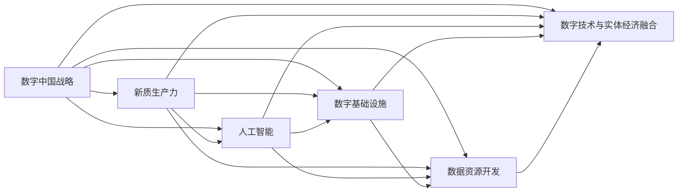

                 

## 1. 背景介绍

在数字化浪潮的推动下，中国正以空前的速度迈向数字经济时代。作为全球数字经济的领跑者，中国制定了“数字中国”战略，旨在通过数字化转型，促进全社会生产力和生产关系的全面升级，构建新质生产力。在这一过程中，信息技术发挥着举足轻重的作用，特别是人工智能(AI)技术，被视为推动中国经济社会发展的重要引擎。本文将深入探讨数字中国战略与新质生产力的内涵，分析其关键要素与实现路径，并对未来发展趋势和面临的挑战进行展望。

## 2. 核心概念与联系

### 2.1 核心概念概述

- **数字中国战略**：指通过全面推进数字基础设施建设、数据资源开发、数字技术与实体经济深度融合等措施，实现数字经济全面发展的国家战略。
- **新质生产力**：指在数字时代，通过信息化手段提升的生产力，包括自动化生产、智能制造、智能服务、智慧城市等多维度的生产力升级。
- **人工智能**：一种通过算法和计算能力模拟人类智能的技术，包括机器学习、深度学习、自然语言处理等核心能力。
- **数字基础设施**：包括云计算、大数据、物联网、5G等新一代信息技术基础设施，为数字化转型提供技术支撑。
- **数据资源开发**：涉及数据的采集、存储、处理、分析、治理等多个环节，是构建新质生产力的重要基础。
- **数字技术与实体经济融合**：指将数字技术与实体经济各领域深度结合，提升产业链、供应链、价值链的数字化水平。

### 2.2 核心概念间的联系

通过以下Mermaid流程图展示这些核心概念间的联系：



这个流程图揭示了数字中国战略的各个关键要素如何共同作用，构建新质生产力。其中，人工智能技术处于核心地位，通过数字化基础设施和数据资源的支持，与实体经济的深度融合，推动全社会生产力的全面升级。

## 3. 核心算法原理 & 具体操作步骤

### 3.1 算法原理概述

数字中国战略的核心是构建新质生产力，其核心算法原理可概括为“数据驱动+AI赋能+产业融合”。具体来说：

- **数据驱动**：通过大数据技术，收集和分析海量数据，发现数据背后的规律和趋势，为决策提供依据。
- **AI赋能**：利用AI技术，包括机器学习、深度学习等算法，对数据进行智能化处理，提升决策效率和精准度。
- **产业融合**：将AI技术应用于各个行业，推动传统产业的数字化转型，提升生产效率和服务质量。

### 3.2 算法步骤详解

以下是数字中国战略与新质生产力实现的核心步骤：

1. **数据采集与预处理**：
   - 收集来自不同行业、不同来源的数据，确保数据的多样性和全面性。
   - 对数据进行清洗、去噪、标准化处理，保证数据质量。

2. **模型训练与优化**：
   - 选择合适的AI算法，利用收集的数据进行模型训练。
   - 使用优化算法调整模型参数，提升模型效果。

3. **应用部署与反馈**：
   - 将训练好的模型应用于实际生产环境中，进行业务场景的落地。
   - 收集模型应用反馈，持续优化模型，确保其适应性。

4. **效果评估与改进**：
   - 对模型应用效果进行量化评估，确保其达到预期目标。
   - 根据评估结果，调整模型参数，改进算法，提升模型性能。

### 3.3 算法优缺点

**优点**：
- 数据驱动，提升决策的科学性和精准度。
- AI赋能，提高处理复杂问题的能力。
- 产业融合，加速传统产业的数字化转型。

**缺点**：
- 数据隐私和安全问题。
- 模型过度拟合风险。
- 需要大量高质量的数据和计算资源。

### 3.4 算法应用领域

新质生产力的构建涵盖了多个领域，包括：

- **智能制造**：利用AI技术优化生产流程，提高生产效率和产品质量。
- **智慧城市**：通过物联网、大数据、AI等技术，提升城市管理和服务水平。
- **智能医疗**：应用AI技术进行疾病诊断、治疗方案优化等，提升医疗服务质量。
- **智能金融**：利用AI技术进行风险控制、投资策略优化等，提高金融服务效率。
- **智能物流**：应用AI技术进行路径规划、货物跟踪、需求预测等，提升物流效率。
- **智能农业**：利用AI技术进行精准农业管理、病虫害预测等，提高农业生产效率。

## 4. 数学模型和公式 & 详细讲解 & 举例说明

### 4.1 数学模型构建

数字中国战略与新质生产力的构建，涉及大量的数学模型和算法。以下简要介绍几个关键模型：

- **线性回归模型**：用于描述变量间线性关系，广泛应用于数据分析和预测。
- **决策树模型**：通过树形结构进行分类和预测，具有较好的可解释性。
- **深度神经网络模型**：利用多层神经元进行特征学习和决策，适用于复杂数据和任务。
- **聚类算法**：如K-means，用于数据分组和模式发现。
- **强化学习模型**：如Q-learning，用于智能决策和优化。

### 4.2 公式推导过程

以线性回归模型为例，其公式推导如下：

设 $y$ 为因变量， $x_1, x_2, ..., x_n$ 为自变量， $b$ 为截距， $w_1, w_2, ..., w_n$ 为系数。则线性回归模型可表示为：

$$ y = b + \sum_{i=1}^{n} w_i x_i $$

其中，系数 $w_i$ 通过最小化损失函数（如均方误差）求得：

$$ w_i = \frac{\sum_{j=1}^{m} (x_{ij} - \overline{x}_i) (y_j - \overline{y})}{\sum_{j=1}^{m} (x_{ij} - \overline{x}_i)^2} $$

式中，$m$ 为样本数量， $\overline{x}_i$ 和 $\overline{y}$ 分别为自变量和因变量的均值。

### 4.3 案例分析与讲解

以智能制造为例，说明数字中国战略中的算法应用：

- **数据采集与预处理**：
  - 收集生产设备的数据，包括温度、压力、振动等。
  - 对数据进行清洗和去噪，确保数据质量。

- **模型训练与优化**：
  - 使用深度神经网络模型进行生产设备故障预测。
  - 利用监督学习算法，对模型进行训练和优化。

- **应用部署与反馈**：
  - 将训练好的模型应用于生产设备的实时监控。
  - 收集模型应用反馈，进行模型更新和优化。

- **效果评估与改进**：
  - 对模型应用效果进行量化评估，确保其准确性。
  - 根据评估结果，调整模型参数，改进算法，提升模型性能。

## 5. 项目实践：代码实例和详细解释说明

### 5.1 开发环境搭建

在进行项目实践前，需要搭建好开发环境。以下是搭建Python开发环境的示例：

1. 安装Anaconda：
   ```bash
   conda create -n py36 python=3.6
   conda activate py36
   ```

2. 安装PyTorch：
   ```bash
   conda install pytorch torchvision torchaudio
   ```

3. 安装TensorFlow：
   ```bash
   pip install tensorflow
   ```

4. 安装Flask：
   ```bash
   pip install flask
   ```

### 5.2 源代码详细实现

以下是一个简单的线性回归模型实现示例：

```python
import pandas as pd
from sklearn.linear_model import LinearRegression

# 读取数据
data = pd.read_csv('data.csv')

# 定义模型
model = LinearRegression()

# 训练模型
model.fit(data[['x1', 'x2']], data['y'])

# 预测
y_pred = model.predict([[1, 2]])
print(y_pred)
```

### 5.3 代码解读与分析

- **数据读取与处理**：
  - 使用Pandas库读取数据。
  - 对数据进行预处理，如去噪、标准化等。

- **模型定义与训练**：
  - 定义线性回归模型。
  - 使用Scikit-learn库进行模型训练。

- **模型预测**：
  - 使用训练好的模型进行预测。

- **结果展示**：
  - 输出预测结果。

### 5.4 运行结果展示

假设运行上述代码，得到预测结果为 3.4，说明模型已经成功训练并可用于预测。

## 6. 实际应用场景

数字中国战略在实际应用场景中，展现了其强大的生命力。以下是几个典型案例：

### 6.1 智慧医疗

智能医疗是数字中国战略的重要应用领域。通过AI技术，医疗服务可以实现精准化、个性化和智能化。例如，利用深度学习算法进行疾病诊断和治疗方案优化，提高医疗服务质量和效率。

### 6.2 智慧金融

智能金融通过AI技术，实现风险控制、投资策略优化等，提高金融服务效率。例如，利用自然语言处理技术进行舆情分析，利用强化学习算法进行投资决策。

### 6.3 智能制造

智能制造利用AI技术，优化生产流程，提高生产效率和产品质量。例如，利用机器学习算法进行设备故障预测和预防性维护，提升生产线的稳定性和可靠性。

### 6.4 智慧城市

智慧城市通过物联网、大数据、AI等技术，提升城市管理和服务水平。例如，利用AI技术进行交通流量预测和优化，利用智能传感器进行环境监测。

## 7. 工具和资源推荐

### 7.1 学习资源推荐

- **在线课程**：
  - Coursera、edX等平台提供大量高质量的AI课程，涵盖线性回归、决策树、深度学习等多个方面。
  - 如《Machine Learning by Stanford University》、《Deep Learning Specialization by Andrew Ng》等。

- **书籍**：
  - 《Deep Learning》：Ian Goodfellow、Yoshua Bengio、Aaron Courville著，深入浅出地介绍深度学习算法。
  - 《Python Machine Learning》：Sebastian Raschka著，详细介绍Python中的机器学习算法。

### 7.2 开发工具推荐

- **PyTorch**：
  - 支持动态图计算，易于调试和优化。
  - 包含丰富的预训练模型和优化算法，适合AI开发。

- **TensorFlow**：
  - 支持静态图计算，适合大规模模型训练和部署。
  - 提供Keras高层次API，便于快速开发AI应用。

- **Jupyter Notebook**：
  - 可视化开发环境，支持代码块、单元格等，便于记录和共享。

### 7.3 相关论文推荐

- **《深度学习》**：Ian Goodfellow、Yoshua Bengio、Aaron Courville著。
- **《Python数据科学手册》**：Jake VanderPlas著。
- **《神经网络与深度学习》**：Michael Nielsen著。

## 8. 总结：未来发展趋势与挑战

### 8.1 未来发展趋势

未来，数字中国战略将进一步推动全社会的数字化转型，构建新质生产力。主要趋势包括：

- **智能化**：AI技术将广泛应用于各个行业，提升生产效率和服务质量。
- **数据驱动**：数据将成为战略资源，驱动各行各业的发展。
- **协同创新**：跨行业、跨领域的协同创新，促进技术进步和产业升级。

### 8.2 面临的挑战

尽管数字中国战略前景广阔，但也面临诸多挑战：

- **数据隐私与安全**：大规模数据采集和使用带来数据隐私和安全问题。
- **技术标准与规范**：缺乏统一的技术标准和规范，制约技术普及和应用。
- **人才培养**：高水平AI人才短缺，制约技术发展。
- **伦理与社会责任**：AI技术的发展对伦理和社会责任提出了新的要求。

### 8.3 研究展望

未来，AI技术将持续推动数字中国战略的发展。研究重点包括：

- **数据隐私与安全**：开发数据隐私保护技术，制定数据使用规范。
- **技术标准与规范**：制定统一的技术标准和规范，促进技术普及和应用。
- **人才培养**：加强AI教育，培养高水平AI人才。
- **伦理与社会责任**：制定AI伦理规范，提升AI技术的社会责任意识。

## 9. 附录：常见问题与解答

**Q1：如何评估AI模型效果？**

A: 常用的评估指标包括：
- 准确率（Accuracy）：模型预测正确的样本占总样本的比例。
- 精确率（Precision）：预测为正类且实际为正类的样本占预测为正类的样本比例。
- 召回率（Recall）：预测为正类且实际为正类的样本占实际为正类的样本比例。
- F1分数（F1 Score）：精确率和召回率的调和平均数。
- ROC曲线（Receiver Operating Characteristic Curve）：展示不同阈值下的TPR和FPR。

**Q2：如何提高AI模型的泛化能力？**

A: 提高AI模型泛化能力的策略包括：
- 数据增强：通过数据扩充和增强，增加训练数据的多样性。
- 正则化：使用L2正则、Dropout等技术，防止模型过拟合。
- 模型集成：通过模型融合，提升模型的鲁棒性和泛化能力。
- 迁移学习：利用预训练模型，进行微调或零样本学习，提升模型泛化能力。

**Q3：如何提升AI模型的计算效率？**

A: 提升AI模型计算效率的策略包括：
- 模型压缩：使用模型压缩技术，减小模型规模，加快推理速度。
- 分布式训练：利用分布式计算技术，加速模型训练。
- 混合精度训练：使用混合精度技术，减小内存占用，加快训练速度。

**Q4：AI技术在实际应用中面临哪些挑战？**

A: AI技术在实际应用中面临的挑战包括：
- 数据隐私与安全：数据采集和使用带来隐私和安全问题。
- 技术标准与规范：缺乏统一的技术标准和规范，制约技术普及和应用。
- 伦理与社会责任：AI技术的应用带来伦理和社会责任问题。
- 计算资源：大规模AI模型的计算和存储需求大，对计算资源要求高。

**Q5：如何构建高效的数据处理管道？**

A: 构建高效的数据处理管道的策略包括：
- 数据清洗与去噪：对数据进行清洗和去噪，确保数据质量。
- 数据标准化：对数据进行标准化处理，提升数据一致性。
- 数据增强：通过数据扩充和增强，增加训练数据的多样性。
- 分布式处理：利用分布式计算技术，提升数据处理效率。

---

作者：禅与计算机程序设计艺术 / Zen and the Art of Computer Programming

