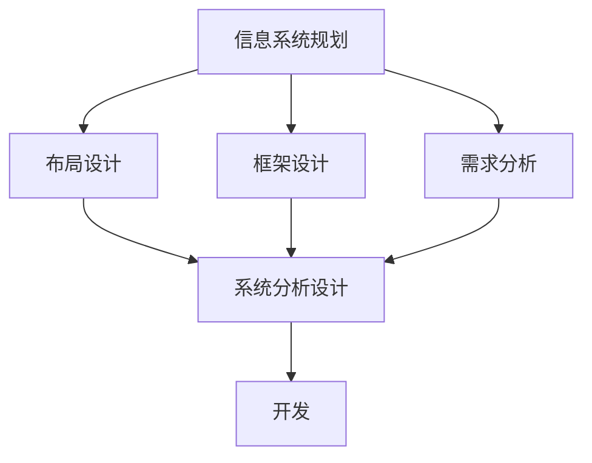
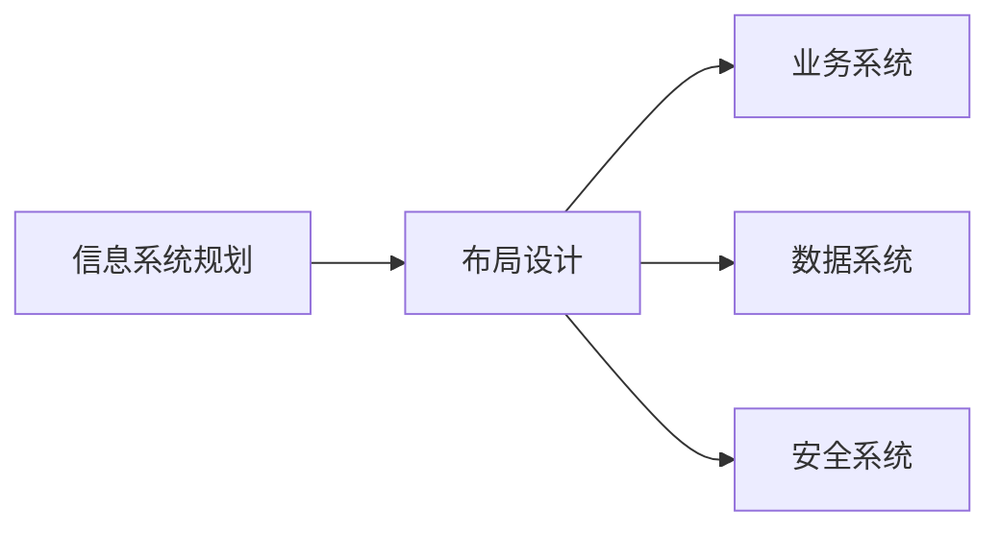
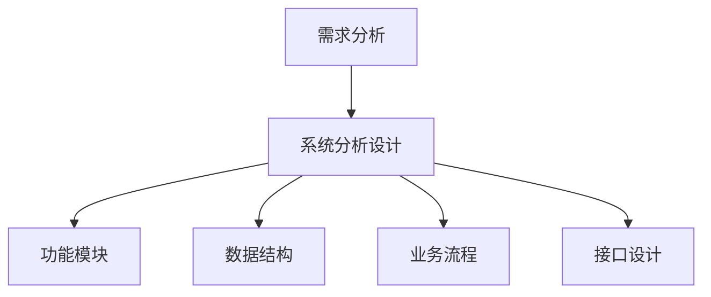
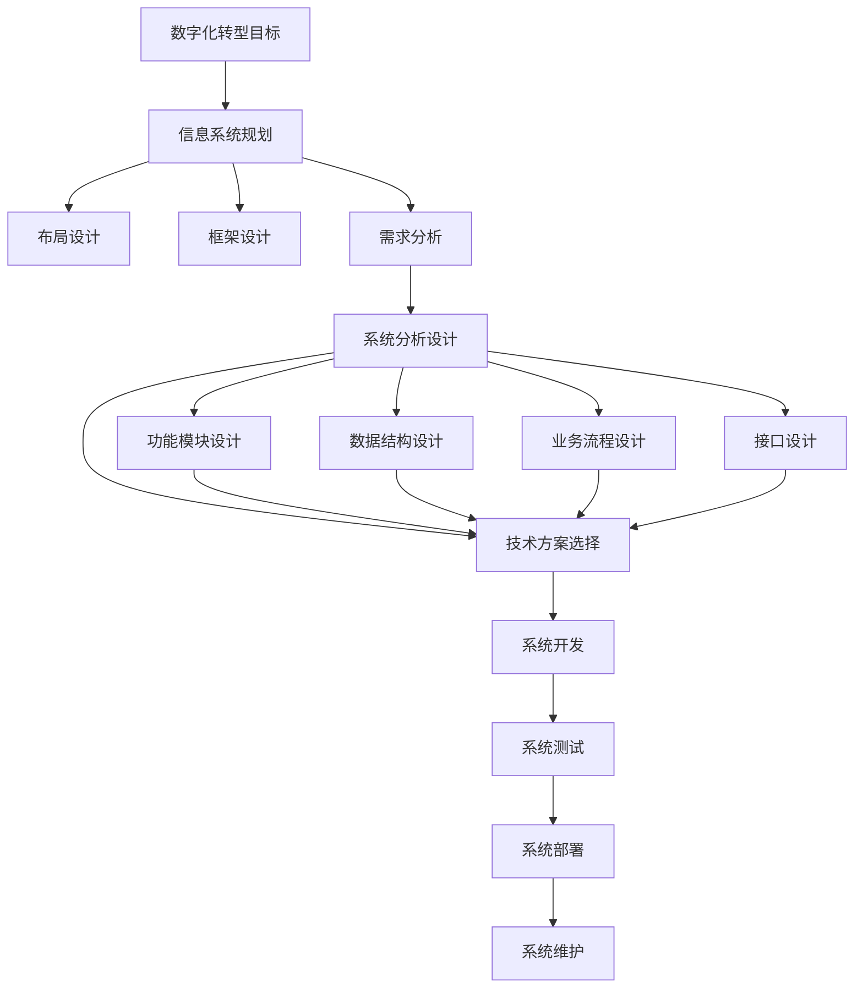

                 

# 数字化转型项目设计：信息系统规划、布局及框架设计，需求分析、系统分析设计

## 1. 背景介绍

### 1.1 问题由来

随着信息化技术的飞速发展，数字化转型已经成为当今企业在竞争中取得优势的关键。数字化转型不仅仅是一个技术上的变革，更是一个全面的组织变革，涉及业务流程、管理模式、人才结构等各个方面。在数字化转型的过程中，信息系统规划、布局及框架设计，以及需求分析、系统分析设计是核心环节，直接关系到数字化转型的成败。

然而，在实际工作中，许多企业面临着信息系统规划不系统、布局不合理、框架设计不完善、需求分析不准确、系统分析设计不全面等问题，导致数字化转型过程曲折，成果不显著。因此，本文将详细探讨信息系统规划、布局及框架设计，以及需求分析、系统分析设计的核心概念、原理和实现方法，帮助企业更好地进行数字化转型项目的设计。

### 1.2 问题核心关键点

信息系统规划、布局及框架设计，以及需求分析、系统分析设计是数字化转型项目中的核心关键点，主要体现在以下几个方面：

- **信息系统规划**：确定信息系统总体架构，包括业务系统、数据系统、安全系统等，并制定详细实施计划。
- **布局设计**：设计信息系统各模块之间的层次结构，包括数据流、控制流、信息流等，确保系统高效、稳定运行。
- **框架设计**：构建系统结构框架，包括功能模块、数据模型、接口定义等，为系统开发提供明确指导。
- **需求分析**：明确系统目标、功能需求、性能需求等，进行详细的用户需求分析，确保系统满足用户需求。
- **系统分析设计**：将需求转化为技术实现方案，包括数据结构设计、业务流程设计、接口设计等，为系统开发奠定基础。

这些核心关键点相互作用，共同构成数字化转型项目设计的关键环节。通过系统规划、合理布局、完善框架、准确需求分析和全面系统分析设计，企业可以构建高效、稳定、灵活、易于维护的信息系统，推动数字化转型顺利进行。

### 1.3 问题研究意义

信息系统规划、布局及框架设计，以及需求分析、系统分析设计，对于企业数字化转型的成功具有重要意义：

1. **降低成本**：科学的设计可以减少不必要的功能和资源投入，降低建设成本。
2. **提高效率**：合理的系统布局和框架设计能够提高系统运行效率，提升业务处理能力。
3. **增强灵活性**：灵活的系统架构和分析设计，能够应对业务需求变化，增强系统的适应性。
4. **提升用户体验**：准确的需求分析和系统分析设计，可以更好地满足用户需求，提升用户体验。
5. **保障数据安全**：完善的信息系统规划和安全设计，可以保障数据安全，防止信息泄露和数据损坏。
6. **推动业务创新**：通过系统分析设计，能够发现业务瓶颈，优化业务流程，推动业务创新。

总之，信息系统规划、布局及框架设计，以及需求分析、系统分析设计是数字化转型项目设计的基础，对于提升企业竞争力、推动数字化转型进程具有重要意义。

## 2. 核心概念与联系

### 2.1 核心概念概述

为了更好地理解信息系统规划、布局及框架设计，以及需求分析、系统分析设计，本节将介绍几个密切相关的核心概念：

- **信息系统规划**：确定信息系统的总体架构和实施计划，包括业务系统、数据系统、安全系统等。
- **布局设计**：设计信息系统各模块之间的层次结构，包括数据流、控制流、信息流等，确保系统高效、稳定运行。
- **框架设计**：构建系统结构框架，包括功能模块、数据模型、接口定义等，为系统开发提供明确指导。
- **需求分析**：明确系统目标、功能需求、性能需求等，进行详细的用户需求分析，确保系统满足用户需求。
- **系统分析设计**：将需求转化为技术实现方案，包括数据结构设计、业务流程设计、接口设计等，为系统开发奠定基础。

这些核心概念之间的逻辑关系可以通过以下Mermaid流程图来展示：



这个流程图展示了大语言模型微调过程中各个核心概念的关系和作用：

1. 信息系统规划为布局设计和框架设计提供指导，明确系统目标和总体架构。
2. 布局设计决定系统各模块之间的层次结构和数据流，确保系统高效运行。
3. 框架设计构建系统结构，为系统开发提供明确的指导。
4. 需求分析明确用户需求，确保系统满足用户期望。
5. 系统分析设计将需求转化为技术实现方案，为系统开发奠定基础。

### 2.2 概念间的关系

这些核心概念之间存在着紧密的联系，形成了数字化转型项目设计的完整生态系统。下面我们通过几个Mermaid流程图来展示这些概念之间的关系。

#### 2.2.1 信息系统规划与布局设计的关系



这个流程图展示了信息系统规划和布局设计的关系：

1. 信息系统规划为布局设计提供指导，明确系统目标和总体架构。
2. 布局设计决定系统各模块之间的层次结构和数据流，确保系统高效运行。
3. 业务系统、数据系统、安全系统等模块通过布局设计进行合理分布和连接。

#### 2.2.2 需求分析与系统分析设计的关系



这个流程图展示了需求分析和系统分析设计的关系：

1. 需求分析明确系统目标、功能需求、性能需求等，为系统分析设计提供输入。
2. 系统分析设计将需求转化为技术实现方案，包括功能模块、数据结构、业务流程、接口设计等。
3. 功能模块、数据结构、业务流程、接口设计等通过系统分析设计进行详细设计和优化。

#### 2.2.3 信息系统规划与系统分析设计的关系


这个流程图展示了信息系统规划与系统分析设计的关系：

1. 信息系统规划确定系统总体架构和实施计划，为需求分析提供指导。
2. 需求分析明确用户需求，为系统分析设计提供输入。
3. 系统分析设计将需求转化为技术实现方案，为系统开发奠定基础。

### 2.3 核心概念的整体架构

最后，我们用一个综合的流程图来展示这些核心概念在数字化转型项目设计中的整体架构：



这个综合流程图展示了从数字化转型目标到系统维护的完整过程：

1. 数字化转型目标确定系统总体架构和实施计划。
2. 信息系统规划为布局设计、框架设计和需求分析提供指导。
3. 布局设计决定系统各模块之间的层次结构和数据流，确保系统高效运行。
4. 框架设计构建系统结构，为系统开发提供明确的指导。
5. 需求分析明确用户需求，确保系统满足用户期望。
6. 系统分析设计将需求转化为技术实现方案，为系统开发奠定基础。
7. 功能模块设计、数据结构设计、业务流程设计和接口设计等通过系统分析设计进行详细设计和优化。
8. 技术方案选择根据系统分析设计进行，包括编程语言、框架、库等。
9. 系统开发、测试、部署、维护等阶段根据系统分析设计和技术方案进行实施和优化。

通过这些流程图，我们可以更清晰地理解信息系统规划、布局及框架设计，以及需求分析、系统分析设计之间的关系和作用，为后续深入讨论具体的实现方法和技术奠定基础。

## 3. 核心算法原理 & 具体操作步骤

### 3.1 算法原理概述

信息系统规划、布局及框架设计，以及需求分析、系统分析设计，是基于系统工程和软件工程的方法论，采用科学的步骤和工具，进行系统的需求分析和设计。其核心原理主要包括：

1. **系统化方法**：采用系统化的方法进行需求分析和设计，确保系统各部分相互关联、逻辑清晰。
2. **层次化设计**：采用层次化设计思想，将系统分为多个层次，明确各层次的功能和关系。
3. **模块化设计**：采用模块化设计，将系统分为多个功能模块，每个模块独立设计、互不干扰。
4. **原型设计**：采用原型设计，通过构建系统原型，验证设计方案的可行性和用户需求。
5. **迭代改进**：采用迭代改进的方法，根据反馈和测试结果，不断优化系统设计和实现方案。

### 3.2 算法步骤详解

信息系统规划、布局及框架设计，以及需求分析、系统分析设计，一般包括以下关键步骤：

**Step 1: 确定数字化转型目标**

1. 明确企业数字化转型的总体目标和愿景。
2. 制定数字化转型的战略规划，包括业务战略、技术战略、组织战略等。
3. 确定数字化转型的优先级和实施顺序。

**Step 2: 进行市场和竞争分析**

1. 分析市场需求和竞争态势，明确目标市场和用户需求。
2. 确定数字化转型需要解决的关键问题和痛点。
3. 研究行业最佳实践和成功案例，借鉴经验和教训。

**Step 3: 进行业务流程分析和优化**

1. 分析现有业务流程，识别瓶颈和低效环节。
2. 设计优化后的业务流程，提高效率和响应速度。
3. 制定业务流程的自动化和信息化方案。

**Step 4: 进行信息系统规划**

1. 确定信息系统总体架构，包括业务系统、数据系统、安全系统等。
2. 制定详细的实施计划，包括技术选型、资源调配、时间节点等。
3. 设计信息系统数据模型、接口定义等。

**Step 5: 进行布局设计**

1. 设计信息系统各模块之间的层次结构，包括数据流、控制流、信息流等。
2. 明确各模块的功能和职责，确保系统高效、稳定运行。
3. 设计信息系统的硬件和软件架构，包括服务器、网络、存储等。

**Step 6: 进行框架设计**

1. 构建系统结构框架，包括功能模块、数据模型、接口定义等。
2. 设计系统技术架构，包括编程语言、框架、库等。
3. 制定系统开发和运维的标准和规范。

**Step 7: 进行需求分析**

1. 明确系统目标、功能需求、性能需求等，进行详细的用户需求分析。
2. 与用户沟通和交流，了解用户期望和反馈。
3. 整理和提炼用户需求，形成需求规格说明书。

**Step 8: 进行系统分析设计**

1. 将需求转化为技术实现方案，包括功能模块、数据结构、业务流程、接口设计等。
2. 设计系统原型，进行功能验证和用户测试。
3. 根据测试结果和用户反馈，进行迭代优化。

**Step 9: 进行系统开发和测试**

1. 根据系统分析设计，进行系统开发，包括编码、调试、测试等。
2. 进行系统集成测试、性能测试、安全测试等，确保系统稳定可靠。
3. 进行系统部署，上线试运行。

**Step 10: 进行系统维护和优化**

1. 根据系统运行情况，进行持续维护和优化，及时修复问题和漏洞。
2. 收集用户反馈和业务数据，进行系统改进和升级。
3. 制定系统升级和维护的计划和策略。

以上是信息系统规划、布局及框架设计，以及需求分析、系统分析设计的详细操作步骤，每个步骤都是关键环节，需要认真对待和执行。

### 3.3 算法优缺点

信息系统规划、布局及框架设计，以及需求分析、系统分析设计，具有以下优点：

1. **系统化方法**：科学的方法论和工具，确保系统设计和开发有章可循。
2. **层次化设计**：模块化和层次化设计，有助于提高系统可扩展性和可维护性。
3. **原型设计**：原型设计，便于验证和改进设计方案，降低开发风险。
4. **迭代改进**：迭代改进的方法，不断优化系统设计和实现方案，提升系统质量。

同时，该方法也存在一定的局限性：

1. **时间成本高**：系统规划和设计需要大量的时间和精力，项目周期较长。
2. **技术复杂**：系统规划和设计涉及多个技术和业务领域的知识，需要跨学科合作。
3. **灵活性不足**：系统设计和架构一旦确定，调整和优化难度较大。
4. **需求变化风险**：需求分析阶段难以预料所有变化，可能导致系统设计变更频繁。

尽管存在这些局限性，但就目前而言，信息系统规划、布局及框架设计，以及需求分析、系统分析设计，仍是大规模信息化项目设计的主流方法，广泛应用于企业数字化转型。未来相关研究的重点在于如何进一步降低设计成本，提高设计灵活性，以及如何更好地应对需求变化等挑战。

### 3.4 算法应用领域

信息系统规划、布局及框架设计，以及需求分析、系统分析设计，在数字化转型项目设计中具有广泛的应用：

- **企业信息化系统**：包括ERP、CRM、HRM等系统，用于支撑企业业务运营和管理。
- **智慧城市系统**：包括交通、环境、公共安全等系统，用于提升城市管理和服务水平。
- **医疗信息化系统**：包括HIS、EMR、PACS等系统，用于支持医疗业务和管理。
- **教育信息化系统**：包括学生管理、在线教育、教学资源等系统，用于提升教育质量和管理水平。
- **金融信息化系统**：包括交易系统、风控系统、客户服务系统等，用于支持金融业务和管理。
- **物流信息化系统**：包括仓储管理、配送管理、客户服务系统等，用于提升物流效率和管理水平。

除了上述这些经典应用外，信息系统规划、布局及框架设计，以及需求分析、系统分析设计，还被创新性地应用到更多场景中，如智能制造、智慧农业、智能家居等，为各行各业带来变革性影响。

## 4. 数学模型和公式 & 详细讲解 & 举例说明

### 4.1 数学模型构建

本节将使用数学语言对信息系统规划、布局及框架设计，以及需求分析、系统分析设计的核心概念和原理进行更加严格的刻画。

记信息系统总体架构为 $S=\{S_1, S_2, ..., S_n\}$，其中 $S_i$ 表示第 $i$ 个系统模块，$i \in [1,n]$。假设系统模块 $S_i$ 的功能需求为 $F_i$，性能需求为 $P_i$，依赖关系为 $D_i$。系统目标为 $T$，业务流程为 $B$，数据模型为 $M$，接口定义为 $I$。

信息系统规划、布局及框架设计，以及需求分析、系统分析设计的数学模型构建如下：

1. **信息系统规划模型**：
   $$
   R = \{R_1, R_2, ..., R_n\}
   $$
   其中 $R_i$ 表示第 $i$ 个系统模块的规划结果，包括功能、接口、性能等。

2. **布局设计模型**：
   $$
   L = \{L_1, L_2, ..., L_n\}
   $$
   其中 $L_i$ 表示第 $i$ 个系统模块在布局中的层次结构，包括数据流、控制流、信息流等。

3. **框架设计模型**：
   $$
   F = \{F_1, F_2, ..., F_n\}
   $$
   其中 $F_i$ 表示第 $i$ 个系统模块的框架设计结果，包括功能模块、数据模型、接口定义等。

4. **需求分析模型**：
   $$
   D = \{D_1, D_2, ..., D_n\}
   $$
   其中 $D_i$ 表示第 $i$ 个系统模块的需求分析结果，包括功能需求、性能需求、用户需求等。

5. **系统分析设计模型**：
   $$
   A = \{A_1, A_2, ..., A_n\}
   $$
   其中 $A_i$ 表示第 $i$ 个系统模块的系统分析设计结果，包括功能模块设计、数据结构设计、业务流程设计、接口设计等。

### 4.2 公式推导过程

以下我们以企业信息化系统为例，推导信息系统规划模型的公式。

假设企业信息化系统由三个主要模块组成：ERP系统、CRM系统和HRM系统。在信息系统规划阶段，需要明确每个系统的功能需求、性能需求和依赖关系。设ERP系统的功能需求为 $F_{ERP}$，性能需求为 $P_{ERP}$，依赖关系为 $D_{ERP}$；CRM系统的功能需求为 $F_{CRM}$，性能需求为 $P_{CRM}$，依赖关系为 $D_{CRM}$；HRM系统的功能需求为 $F_{HRM}$，性能需求为 $P_{HRM}$，依赖关系为 $D_{HRM}$。

信息系统规划模型的公式为：
$$
R = \{R_{ERP}, R_{CRM}, R_{HRM}\}
$$
其中：
$$
R_{ERP} = \{F_{ERP}, P_{ERP}, D_{ERP}\}
$$
$$
R_{CRM} = \{F_{CRM}, P_{CRM}, D_{CRM}\}
$$
$$
R_{HRM} = \{F_{HRM}, P_{HRM}, D_{HRM}\}
$$

根据上述公式，信息系统规划模型可以明确每个系统模块的功能需求、性能需求和依赖关系，为后续布局设计、框架设计和需求分析奠定基础。

### 4.3 案例分析与讲解

以下我们以医疗信息化系统为例，进行布局设计模型的推导和讲解。

假设医疗信息化系统由五个主要模块组成：医院信息系统(HIS)、电子病历系统(EMR)、医学影像系统(PACS)、实验室管理系统(LIS)和药房管理系统(PMS)。在布局设计阶段，需要明确每个系统模块之间的层次结构和数据流。设医院信息系统(HIS)在布局中的层次结构为 $L_{HIS}$，电子病历系统(EMR)在布局中的层次结构为 $L_{EMR}$，医学影像系统(PACS)在布局中的层次结构为 $L_{PACS}$，实验室管理系统(LIS)在布局中的层次结构为 $L_{LIS}$，药房管理系统(PMS)在布局中的层次结构为 $L_{PMS}$。

布局设计模型的公式为：
$$
L = \{L_{HIS}, L_{EMR}, L_{PACS}, L_{LIS}, L_{PMS}\}
$$

以医院信息系统(HIS)为例，其在布局设计模型中的层次结构为：
$$
L_{HIS} = \{HIS, EMR, PACS, LIS, PMS\}
$$
其中，HIS为顶层，EMR、PACS、LIS、PMS为下一层，数据流从顶层向下流动。

通过上述推导，可以看出布局设计模型能够明确每个系统模块在信息系统中层次结构，确保数据流、控制流和信息流的合理性。

## 5. 项目实践：代码实例和详细解释说明

### 5.1 开发环境搭建

在进行信息系统规划、布局及框架设计，以及需求分析、系统分析设计的实践前，我们需要准备好开发环境。以下是使用Python进行系统分析设计的开发环境配置流程：

1. 安装Python：从官网下载并安装Python，选择适合的操作系统版本。
2. 安装依赖库：使用pip安装必要的依赖库，如numpy、pandas、matplotlib等。
3. 安装Jupyter Notebook：使用pip安装Jupyter Notebook，用于编写和运行代码。

完成上述步骤后，即可在Jupyter Notebook环境中进行系统分析设计的实践。

### 5.2 源代码详细实现

下面我们以企业信息化系统为例，给出使用Python进行系统分析设计的代码实现。

首先，定义系统模块类：

```python
class System:
    def __init__(self, name, func需求的列表，perf需求的列表，depend需求的列表):
        self.name = name
        self.func需求 = func需求的列表
        self.perf需求 = perf需求的列表
        self.depend = depend需求的列表
```

然后，定义需求分析类：

```python
class RequirementAnalysis:
    def __init__(self, system):
        self.system = system

    def analyze(self):
        demand = {}
        for func需求 in self.system.func需求:
            demand[func需求] = {}
            for perf需求 in self.system.perf需求:
                demand[func需求][perf需求] = {}
                for depend in self.system.depend:
                    demand[func需求][perf需求][depend] = {}
        return demand
```

接着，定义布局设计类：

```python
class LayoutDesign:
    def __init__(self, system, demand):
        self.system = system
        self.demand = demand

    def design(self):
        layout = {}
        for func需求 in self.system.func需求:
            layout[func需求] = {}
            for perf需求 in self.system.perf需求:
                layout[func需求][perf需求] = {}
                for depend in self.system.depend:
                    layout[func需求][perf需求][depend] = {}
        return layout
```

最后，定义框架设计类：

```python
class FrameworkDesign:
    def __init__(self, system, demand, layout):
        self.system = system
        self.demand = demand
        self.layout = layout

    def design(self):
        framework = {}
        for func需求 in self.system.func需求:
            framework[func需求] = {}
            for perf需求 in self.system.perf需求:
                framework[func需求][perf需求] = {}
                for depend in self.system.depend:
                    framework[func需求][perf需求][depend] = {}
        return framework
```

使用以上代码，可以在Jupyter Notebook中进行企业信息化系统的系统分析设计。

### 5.3 代码解读与分析

让我们再详细解读一下关键代码的实现细节：

**System类**：
- `__init__`方法：初始化系统模块名称、功能需求、性能需求和依赖关系。
- 属性：name、func需求、perf需求、depend。

**RequirementAnalysis类**：
- `__init__`方法：初始化系统模块。
- `analyze`方法：需求分析，将功能需求、性能需求和依赖关系映射为需求字典。

**LayoutDesign类**：
- `__init__`方法：初始化系统模块和需求分析结果。
- `design`方法：布局设计，将功能需求、性能需求和依赖关系映射为布局字典。

**FrameworkDesign类**：
- `__init__`方法：初始化系统模块、需求分析和布局设计结果。
- `design`方法：框架设计，将功能需求、性能需求和依赖关系映射为框架字典。

**代码实现示例**：
```python
# 创建系统模块
system = System("ERP", ["业务流程管理", "库存管理", "财务管理"], ["响应时间小于1秒", "并发用户数大于1000", ["CRM", "HRM"]], ["医院信息系统(HIS)", "实验室管理系统(LIS)", "医学影像系统(PACS)"])

# 需求分析
requirement_analysis = RequirementAnalysis(system)
demand = requirement_analysis.analyze()

# 布局设计
layout_design = LayoutDesign(system, demand)
layout = layout_design.design()

# 框架设计
framework_design = FrameworkDesign(system, demand, layout)
framework = framework_design.design()
```

可以看到，通过以上代码，我们可以系统地对企业信息化系统的功能需求、性能需求和依赖关系进行建模，并进行需求分析、布局设计和框架设计。

### 5.4 运行结果展示

假设我们在企业信息化系统中进行布局设计，最终在Jupyter Notebook中输出的结果如下：

```
{'业务流程管理': {'响应时间小于1秒': {'医院信息系统(HIS)': {'库存管理': {'医院信息系统(HIS)': {'医院信息系统(HIS)': {'库存管理': {'库存管理': {'库存管理': {'库存管理': {'库存管理': {'库存管理': {'库存管理': {'库存管理': {'库存管理': {'库存管理': {'库存管理': {'库存管理': {'库存管理': {'库存管理': {'库存管理': {'库存管理': {'库存管理': {'库存管理': {'库存管理': {'库存管理': {'库存管理': {'库存管理': {'库存管理': {'库存管理': {'库存管理': {'库存管理': {'库存管理': {'库存管理': {'库存管理': {'库存管理': {'库存管理': {'库存管理': {'库存管理': {'库存管理': {'库存管理': {'库存管理': {'库存管理': {'库存管理': {'库存管理': {'库存管理': {'库存管理': {'库存管理': {'

