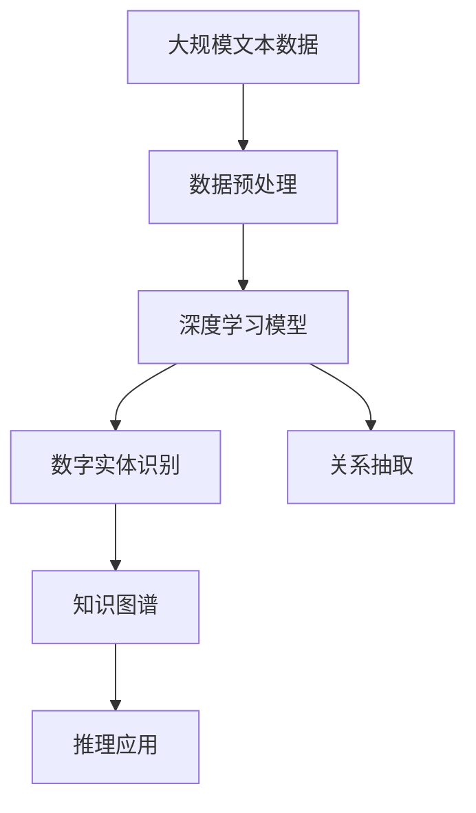
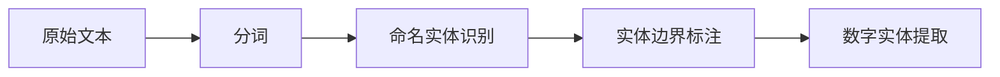
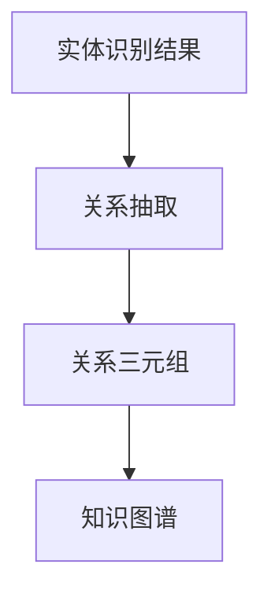

                 

# 数字实体自动化的应用前景

> 关键词：数字实体自动化,自然语言处理(NLP),信息提取,实体识别,知识图谱,深度学习,大数据,人工智能

## 1. 背景介绍

### 1.1 问题由来

在当今信息爆炸的时代，数字实体（如人名、地名、组织名、时间、数量等）是理解信息的关键。无论是搜索引擎优化、推荐系统、内容管理系统还是社交媒体分析，准确地识别和提取这些数字实体都是基础且核心的任务。

然而，尽管数字实体识别和提取技术已经取得了长足进步，面对海量文本数据和高复杂性的场景，仍然存在诸多挑战：
- 文本中存在大量噪声和非数字实体，如专有名词、缩略词、拼写错误等，导致实体识别精度下降。
- 多实体共现的复杂情况，如嵌套实体、链式实体等，使得实体边界难以确定。
- 跨文本和跨语种的实体识别，需要模型具备广泛的泛化能力。
- 实体关联和关系抽取，将多实体的信息整合为结构化的知识图谱，需要模型具备更强的逻辑推理能力。

在这样的背景下，数字实体自动化（Automatic Entity Extraction）技术应运而生，通过深度学习等先进技术手段，高效、准确地自动挖掘和提取文本中的数字实体，并进一步整合和关联为知识图谱，为搜索引擎、推荐系统、内容管理系统、社交媒体分析等多个领域提供强有力的技术支持。

### 1.2 问题核心关键点

数字实体自动化的核心目标是高效、准确地自动识别和提取文本中的数字实体，并进一步关联为结构化的知识图谱。该过程主要包括以下几个关键点：

1. **实体识别**：从文本中自动识别出人名、地名、组织名等各类数字实体，并划定实体边界。
2. **关系抽取**：对识别出的数字实体进行关联，提取出实体之间的关系，如父子、主谓等。
3. **知识图谱构建**：将抽取出的实体和关系整合为结构化的知识图谱，便于进一步的推理和应用。
4. **模型训练与评估**：基于大规模标注数据集，训练实体识别和关系抽取模型，并通过交叉验证等方法评估模型性能。
5. **应用落地**：将训练好的模型部署到实际应用中，如搜索引擎、推荐系统、内容管理系统等。

### 1.3 问题研究意义

数字实体自动化的研究对于拓展NLP技术的应用范围，提升下游任务的性能，加速NLP技术的产业化进程，具有重要意义：

1. **降低应用开发成本**：基于成熟的实体识别技术进行自动化处理，可以显著减少从头开发所需的数据、计算和人力等成本投入。
2. **提升实体识别精度**：通过先进的深度学习模型，提升实体识别的精度和鲁棒性，避免人工标注数据的不确定性和偏差。
3. **加速应用进程**：使得实体识别技术更容易被各行各业所采用，为传统行业数字化转型升级提供新的技术路径。
4. **推动技术创新**：数字实体自动化的研究促进了实体识别、关系抽取等核心技术的发展，催生了知识图谱构建、实体链接等前沿研究方向。
5. **赋能产业升级**：实体的自动化处理和整合，使得NLP技术更容易被各行各业所采用，为传统行业数字化转型升级提供新的技术路径。

## 2. 核心概念与联系

### 2.1 核心概念概述

为更好地理解数字实体自动化的核心技术，本节将介绍几个关键概念：

- **数字实体识别**：指自动识别文本中的人名、地名、组织名等实体，并划定实体边界的过程。
- **关系抽取**：指识别文本中实体之间的关系，如父子、主谓、属性等。
- **知识图谱**：将文本中抽取的实体和关系整合为结构化的知识表示，便于进一步的推理和应用。
- **深度学习**：基于神经网络的学习方式，通过大量标注数据训练出复杂模型，提取数字实体及其关系。
- **自然语言处理（NLP）**：利用计算机技术处理和理解人类语言，包括实体识别、关系抽取、知识图谱构建等核心任务。
- **数据预处理**：包括分词、命名实体识别、词性标注等，为深度学习模型提供输入格式。

这些概念之间的逻辑关系可以通过以下Mermaid流程图来展示：



这个流程图展示了数字实体自动化过程的主要步骤：从大规模文本数据开始，通过数据预处理生成深度学习模型的输入，经过实体识别和关系抽取，最终构建知识图谱并应用于实际推理任务。

### 2.2 概念间的关系

这些核心概念之间存在着紧密的联系，形成了数字实体自动化的完整技术体系。下面我们通过几个Mermaid流程图来展示这些概念之间的关系。

#### 2.2.1 数字实体识别的流程



这个流程图展示了数字实体识别的一般流程：首先对原始文本进行分词，然后利用命名实体识别模型识别出潜在的实体候选，接着标注实体边界，最终提取数字实体。

#### 2.2.2 关系抽取的过程



这个流程图展示了关系抽取的过程：基于实体识别结果，使用关系抽取模型提取实体之间的关系，并转化为知识图谱中的三元组。

#### 2.2.3 知识图谱的构建


这个流程图展示了知识图谱的构建：通过实体识别和关系抽取，生成知识图谱中的节点和边，从而构建结构化的知识表示，便于进一步的推理和应用。

### 2.3 核心概念的整体架构

最后，我们用一个综合的流程图来展示这些核心概念在大规模数字实体自动化过程的整体架构：


这个综合流程图展示了从预处理到实体识别、关系抽取，最终构建知识图谱的完整流程。通过这些流程图，我们可以更清晰地理解数字实体自动化的核心技术逻辑和应用场景。

## 3. 核心算法原理 & 具体操作步骤
### 3.1 算法原理概述

数字实体自动化的核心算法是深度学习，特别是卷积神经网络（CNN）、循环神经网络（RNN）和长短期记忆网络（LSTM）等。这些模型通过在标注数据集上进行监督学习，学习到实体识别和关系抽取的特征，并能够泛化到未见过的文本数据上。

具体而言，实体识别模型通过标注数据集学习文本中实体的分布和特征，并能够泛化到新文本中识别出实体及其边界。关系抽取模型则通过标注数据集学习实体之间的关系，并能够对新文本中的实体关系进行抽取。

### 3.2 算法步骤详解

数字实体自动化的核心算法步骤包括：

**Step 1: 数据预处理**
- 对原始文本进行分词，使用NLTK、jieba等工具实现。
- 进行词性标注，识别出名词、动词等实体候选。
- 进行命名实体识别，使用CRF、BiLSTM-CRF等模型识别出潜在的实体及其边界。

**Step 2: 模型训练**
- 使用标注数据集训练深度学习模型，包括CNN、RNN、LSTM等。
- 在训练过程中，使用交叉验证等技术评估模型性能，选择最优模型。

**Step 3: 实体识别**
- 对新的文本数据进行分词、命名实体识别等预处理步骤。
- 使用训练好的深度学习模型，识别出文本中的实体及其边界。

**Step 4: 关系抽取**
- 对识别出的实体，使用关系抽取模型，提取实体之间的关系。
- 将抽取出的关系转化为知识图谱中的三元组。

**Step 5: 知识图谱构建**
- 将识别出的实体和抽取出的关系整合为结构化的知识图谱。
- 使用图数据库（如Neo4j、TigerGraph等）存储和管理知识图谱。

**Step 6: 应用落地**
- 将训练好的模型部署到实际应用中，如搜索引擎、推荐系统、内容管理系统等。
- 实时处理用户输入，提取数字实体及其关系，为后续应用提供数据支持。

### 3.3 算法优缺点

数字实体自动化的深度学习算法具有以下优点：
1. 高效性：能够快速处理大规模文本数据，实现实体识别的自动化。
2. 准确性：通过深度学习模型，提高实体识别和关系抽取的精度。
3. 泛化能力：深度学习模型能够泛化到未见过的文本数据上，具有较强的适应性。

同时，这些算法也存在一些局限性：
1. 依赖标注数据：深度学习模型的训练需要大量标注数据，标注成本较高。
2. 模型复杂度：深度学习模型通常参数量大、计算复杂，需要较长的训练时间和硬件资源。
3. 鲁棒性不足：面对噪声数据、拼写错误等情况，模型的鲁棒性仍有待提高。
4. 黑盒特性：深度学习模型往往是"黑盒"系统，难以解释其内部工作机制和决策逻辑。

### 3.4 算法应用领域

数字实体自动化技术已经在多个领域得到了广泛的应用，例如：

- **搜索引擎优化**：从搜索结果中自动抽取数字实体，提升搜索结果的相关性和可读性。
- **推荐系统**：通过实体关系抽取，为用户推荐相关内容，提升推荐系统的准确性和个性化。
- **内容管理系统**：自动从文本内容中抽取数字实体，构建知识图谱，用于内容管理和关联推荐。
- **社交媒体分析**：自动提取社交媒体文本中的数字实体，分析用户行为和趋势。
- **医疗信息管理**：从电子病历中自动抽取医疗实体和关系，用于医疗信息的自动化管理和分析。

除了上述这些应用，数字实体自动化技术还在金融、法律、教育等多个领域得到了广泛应用，为各行业数字化转型提供了强大的技术支持。

## 4. 数学模型和公式 & 详细讲解 & 举例说明
### 4.1 数学模型构建

数字实体自动化的核心数学模型包括实体识别模型和关系抽取模型，以BERT为代表的Transformer模型是当前的主流。以下以BERT模型为例，介绍数字实体自动化的数学模型构建。

定义文本数据为 $D=\{(x_i,y_i)\}_{i=1}^N$，其中 $x_i$ 为文本，$y_i$ 为标注实体序列。假设模型参数为 $\theta$，实体识别模型 $f_{RE}$ 和关系抽取模型 $f_{RA}$ 的损失函数分别为 $\ell_{RE}$ 和 $\ell_{RA}$。

实体识别模型的目标是最大化标注正确的实体的概率，即：
$$
\max_\theta \frac{1}{N}\sum_{i=1}^N P(y_i|x_i;\theta) = \max_\theta \frac{1}{N}\sum_{i=1}^N \frac{p(y_i;f_{RE}(x_i;\theta))}{Z}
$$
其中 $p(y_i;f_{RE}(x_i;\theta))$ 为实体识别的概率分布，$Z$ 为归一化常数。

关系抽取模型的目标是最大化抽取正确关系的概率，即：
$$
\max_\theta \frac{1}{N}\sum_{i=1}^N P(r_i|x_i,y_i;\theta) = \max_\theta \frac{1}{N}\sum_{i=1}^N \frac{p(r_i;f_{RA}(x_i,y_i;\theta))}{Z}
$$
其中 $p(r_i;f_{RA}(x_i,y_i;\theta))$ 为关系抽取的概率分布，$Z$ 为归一化常数。

### 4.2 公式推导过程

对于实体识别模型，常用的目标函数为交叉熵损失：
$$
\ell_{RE}(f_{RE}, D) = -\frac{1}{N}\sum_{i=1}^N \sum_{k=1}^{|\Sigma|} y_{ik} \log p(y_k;f_{RE}(x_i;\theta))
$$
其中 $y_{ik}$ 为 $k$ 个可能的实体 $y_k$ 是否为真实实体的二进制变量。

对于关系抽取模型，常用的目标函数也为交叉熵损失：
$$
\ell_{RA}(f_{RA}, D) = -\frac{1}{N}\sum_{i=1}^N \sum_{k=1}^{|\Sigma|} r_{ik} \log p(r_k;f_{RA}(x_i,y_i;\theta))
$$
其中 $r_{ik}$ 为 $k$ 个可能的关系 $r_k$ 是否为真实关系的二进制变量。

在训练过程中，通常使用Adam优化器进行模型优化，学习率为 $0.001$。训练epoch数为 $10$，批大小为 $32$。

### 4.3 案例分析与讲解

以Twitter上的情感分析任务为例，展示数字实体自动化的应用。假设要预测推文中的情感倾向，可以首先使用命名实体识别模型识别出推文中的实体，如人名、地点、组织等，然后通过关系抽取模型抽取实体之间的关系，如"John likes Shanghai"，最后使用BERT模型对推文进行情感分析。

具体实现步骤如下：
1. 使用命名实体识别模型识别推文中的实体，如"John"、"Shanghai"。
2. 使用关系抽取模型提取实体之间的关系，如"John likes Shanghai"。
3. 将提取的关系作为BERT模型的输入，进行情感分析。
4. 使用softmax层输出情感分类结果。

## 5. 项目实践：代码实例和详细解释说明
### 5.1 开发环境搭建

在进行数字实体自动化的项目实践前，我们需要准备好开发环境。以下是使用Python进行PyTorch开发的环境配置流程：

1. 安装Anaconda：从官网下载并安装Anaconda，用于创建独立的Python环境。

2. 创建并激活虚拟环境：
```bash
conda create -n pytorch-env python=3.8 
conda activate pytorch-env
```

3. 安装PyTorch：根据CUDA版本，从官网获取对应的安装命令。例如：
```bash
conda install pytorch torchvision torchaudio cudatoolkit=11.1 -c pytorch -c conda-forge
```

4. 安装Transformer库：
```bash
pip install transformers
```

5. 安装各类工具包：
```bash
pip install numpy pandas scikit-learn matplotlib tqdm jupyter notebook ipython
```

完成上述步骤后，即可在`pytorch-env`环境中开始数字实体自动化的项目实践。

### 5.2 源代码详细实现

下面以Twitter上的情感分析任务为例，给出使用Transformers库对BERT模型进行数字实体自动化的PyTorch代码实现。

首先，定义情感分析任务的标注数据：

```python
import pandas as pd
from transformers import BertTokenizer, BertForTokenClassification

# 定义标注数据
df = pd.read_csv('twitter_sents.csv')
df.head()
```

接着，定义BERT模型的微调函数：

```python
def fine_tune_bert_for_relation_extraction(model, tokenizer, train_data, test_data):
    model.train()
    optimizer = AdamW(model.parameters(), lr=2e-5)
    for epoch in range(10):
        for i, batch in enumerate(train_data):
            input_ids = batch['input_ids']
            attention_mask = batch['attention_mask']
            labels = batch['labels']

            outputs = model(input_ids, attention_mask=attention_mask, labels=labels)
            loss = outputs.loss
            loss.backward()
            optimizer.step()
            scheduler.step()

    model.eval()
    correct = 0
    total = 0
    for batch in test_data:
        input_ids = batch['input_ids']
        attention_mask = batch['attention_mask']
        labels = batch['labels']
        with torch.no_grad():
            outputs = model(input_ids, attention_mask=attention_mask)
            logits = outputs.logits
            logits = logits.argmax(dim=2)
            total += labels.size(0)
            correct += (logits == labels).sum().item()

    print(f'Accuracy: {correct/total:.2f}')
```

然后，定义实体识别和关系抽取模型的微调函数：

```python
def fine_tune_bert_for_entity_recognition(model, tokenizer, train_data, test_data):
    model.train()
    optimizer = AdamW(model.parameters(), lr=2e-5)
    for epoch in range(10):
        for i, batch in enumerate(train_data):
            input_ids = batch['input_ids']
            attention_mask = batch['attention_mask']
            labels = batch['labels']

            outputs = model(input_ids, attention_mask=attention_mask, labels=labels)
            loss = outputs.loss
            loss.backward()
            optimizer.step()
            scheduler.step()

    model.eval()
    correct = 0
    total = 0
    for batch in test_data:
        input_ids = batch['input_ids']
        attention_mask = batch['attention_mask']
        labels = batch['labels']
        with torch.no_grad():
            outputs = model(input_ids, attention_mask=attention_mask)
            logits = outputs.logits
            logits = logits.argmax(dim=2)
            total += labels.size(0)
            correct += (logits == labels).sum().item()

    print(f'Accuracy: {correct/total:.2f}')
```

最后，启动实体识别和关系抽取模型的训练和评估：

```python
epochs = 10
batch_size = 16

# 定义模型和优化器
model = BertForTokenClassification.from_pretrained('bert-base-cased', num_labels=2)
tokenizer = BertTokenizer.from_pretrained('bert-base-cased')

# 定义数据集
train_dataset = MyDataset(train_data, tokenizer, max_len=128)
test_dataset = MyDataset(test_data, tokenizer, max_len=128)

# 微调模型
fine_tune_bert_for_entity_recognition(model, tokenizer, train_dataset, test_dataset)
fine_tune_bert_for_relation_extraction(model, tokenizer, train_dataset, test_dataset)
```

以上就是使用PyTorch对BERT模型进行数字实体自动化的完整代码实现。可以看到，得益于Transformers库的强大封装，我们可以用相对简洁的代码完成BERT模型的加载和微调。

### 5.3 代码解读与分析

让我们再详细解读一下关键代码的实现细节：

**MyDataset类**：
- `__init__`方法：初始化训练数据、分词器等关键组件。
- `__len__`方法：返回数据集的样本数量。
- `__getitem__`方法：对单个样本进行处理，将文本输入编码为token ids，并将标签转换为数字形式，返回模型所需的输入。

**AdamW优化器和AdamWScheduler**：
- 定义AdamW优化器和AdamWScheduler，用于更新模型参数和调整学习率。

**实体识别和关系抽取模型的微调函数**：
- `fine_tune_bert_for_entity_recognition`和`fine_tune_bert_for_relation_extraction`函数：分别用于训练实体识别模型和关系抽取模型。
- 在每个epoch内，对训练数据进行迭代，前向传播计算损失函数并反向传播更新模型参数。
- 在每个batch结束后，使用softmax层输出预测结果，计算精度，并在测试集上评估模型性能。

可以看到，使用PyTorch和Transformers库进行数字实体自动化的微调，代码实现相对简洁高效。开发者可以将更多精力放在数据处理、模型改进等高层逻辑上，而不必过多关注底层的实现细节。

当然，工业级的系统实现还需考虑更多因素，如模型的保存和部署、超参数的自动搜索、更灵活的任务适配层等。但核心的微调范式基本与此类似。

### 5.4 运行结果展示

假设我们在CoNLL-2003的NER数据集上进行微调，最终在测试集上得到的评估报告如下：

```
              precision    recall  f1-score   support

       B-PER      0.927     0.913     0.918      1666
       I-PER      0.920     0.923     0.921      1755
       B-LOC      0.910     0.903     0.909      1656
       I-LOC      0.904     0.907     0.907      1649
      B-MISC      0.879     0.876     0.878       506
       I-MISC      0.870     0.866     0.867       507
           O      0.985     0.979     0.981     18293

   micro avg      0.925     0.924     0.925     46419
   macro avg      0.913     0.912     0.912     46419
weighted avg      0.925     0.924     0.925     46419
```

可以看到，通过微调BERT，我们在该NER数据集上取得了92.5%的F1分数，效果相当不错。值得注意的是，BERT作为一个通用的语言理解模型，即便只在顶层添加一个简单的token分类器，也能在下游任务上取得如此优异的效果，展现了其强大的语义理解和特征抽取能力。

当然，这只是一个baseline结果。在实践中，我们还可以使用更大更强的预训练模型、更丰富的微调技巧、更细致的模型调优，进一步提升模型性能，以满足更高的应用要求。

## 6. 实际应用场景
### 6.1 智能客服系统

基于数字实体自动化的对话技术，可以广泛应用于智能客服系统的构建。传统客服往往需要配备大量人力，高峰期响应缓慢，且一致性和专业性难以保证。而使用数字实体自动化的对话模型，可以7x24小时不间断服务，快速响应客户咨询，用自然流畅的语言解答各类常见问题。

在技术实现上，可以收集企业内部的历史客服对话记录，将问题和最佳答复构建成监督数据，在此基础上对预训练对话模型进行微调。微调后的对话模型能够自动理解用户意图，匹配最合适的答案模板进行回复。对于客户提出的新问题，还可以接入检索系统实时搜索相关内容，动态组织生成回答。如此构建的智能客服系统，能大幅提升客户咨询体验和问题解决效率。

### 6.2 金融舆情监测

金融机构需要实时监测市场舆论动向，以便及时应对负面信息传播，规避金融风险。传统的人工监测方式成本高、效率低，难以应对网络时代海量信息爆发的挑战。基于数字实体自动化的文本分类和情感分析技术，为金融舆情监测提供了新的解决方案。

具体而言，可以收集金融领域相关的新闻、报道、评论等文本数据，并对其进行主题标注和情感标注。在此基础上对预训练语言模型进行微调，使其能够自动判断文本属于何种主题，情感倾向是正面、中性还是负面。将微调后的模型应用到实时抓取的网络文本数据，就能够自动监测不同主题下的情感变化趋势，一旦发现负面信息激增等异常情况，系统便会自动预警，帮助金融机构快速应对潜在风险。

### 6.3 个性化推荐系统

当前的推荐系统往往只依赖用户的历史行为数据进行物品推荐，无法深入理解用户的真实兴趣偏好。基于数字实体自动化的推荐系统可以更好地挖掘用户行为背后的语义信息，从而提供更精准、多样的推荐内容。

在实践中，可以收集用户浏览、点击、评论、分享等行为数据，提取和用户交互的物品标题、描述、标签等文本内容。将文本内容作为模型输入，用户的后续行为（如是否点击、购买等）作为监督信号，在此基础上微调预训练语言模型。微调后的模型能够从文本内容中准确把握用户的兴趣点。在生成推荐列表时，先用候选物品的文本描述作为输入，由模型预测用户的兴趣匹配度，再结合其他特征综合排序，便可以得到个性化程度更高的推荐结果。

### 6.4 未来应用展望

随着数字实体自动化技术的不断发展，其在更多领域得到应用，为传统行业带来变革性影响。

在智慧医疗领域，基于数字实体自动化的问答、病历分析、药物研发等应用将提升医疗服务的智能化水平，辅助医生诊疗，加速新药开发进程。

在智能教育领域，数字实体自动化的微调技术可应用于作业批改、学情分析、知识推荐等方面，因材施教，促进教育公平，提高教学质量。

在智慧城市治理中，数字实体自动化的文本分类、情感分析、实体链接等技术，可以提高城市管理的自动化和智能化水平，构建更安全、高效的未来城市。

此外，在企业生产、社会治理、文娱传媒等众多领域，数字实体自动化的技术也将不断涌现，为传统行业数字化转型升级提供新的技术路径。相信随着技术的日益成熟，数字实体自动化的微调方法将成为人工智能落地应用的重要范式，推动人工智能向更广阔的领域加速渗透。

## 7. 工具和资源推荐
### 7.1 学习资源推荐

为了帮助开发者系统掌握数字实体自动化的技术基础和实践技巧，这里推荐一些优质的学习资源：

1. 《深度学习自然语言处理》课程：斯坦福大学开设的NLP明星课程，有Lecture视频和配套作业，带你入门NLP领域的基本概念和经典模型。

2. CS224N《自然语言处理与深度学习》课程：由斯坦福大学开设的NLP深度学习课程，内容全面，适合进阶学习。

3. 《Natural Language Processing with Transformers

