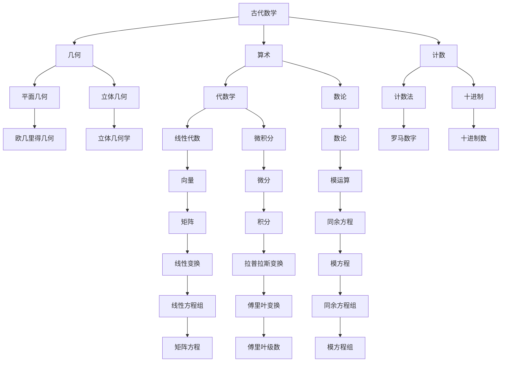

                 

# 数学史的文化背景与发展

## 1. 背景介绍

数学作为人类最早出现的学科之一，其发展历程深刻反映了人类思维方式的演进和社会文明进步的轨迹。从早期的计数、度量到复杂的抽象代数、数理逻辑，数学不仅是一种语言、工具，更是一种思考世界的方式，反映着人类对于自然规律和宇宙结构的深刻理解。本文将从历史和文化背景角度，概述数学的发展脉络，探索其背后蕴含的哲学思辨与科学精神。

## 2. 核心概念与联系

### 2.1 核心概念概述

数学史的研究包括数学思想的起源、发展、变革以及其对其他学科的影响。数学作为一门学科，既具有独立性，又具有极大的跨学科特性。其发展受到了哲学、语言、技术等多种因素的影响，进而也影响了各个领域的发展。

**核心概念：**
- **古代数学**：以几何、算术、计数为代表，早期数学主要应用于实际问题解决。
- **中世纪数学**：包括阿拉伯数学、欧洲文艺复兴时期的数学革命。
- **近代数学**：从17世纪开始，以微积分、数论、概率论等为标志，数学进入科学领域。
- **现代数学**：20世纪以来，数学向抽象化、形式化方向发展，引入公理化方法，产生多种数学分支。

### 2.2 核心概念原理和架构的 Mermaid 流程图



这个流程图展示了数学史上的核心数学概念和其发展的脉络。从古代的算术和计数到中世纪的几何和代数，再到近代的微积分和数论，数学不断扩展和深化，形成了现代数学的庞大体系。

### 2.3 核心概念间的关系

数学史的核心概念之间有着紧密的联系和相互影响，以下通过几个主要节点来展示这些关系：

- **算术**：数学的起源，奠定了后续数学发展的基石。
- **几何**：早期数学的重要分支，从平面几何到立体几何，推动了数学抽象和形式化的发展。
- **代数学**：从初等代数到抽象代数，数学的演绎和推理能力得到大幅提升。
- **数论**：探讨数的性质和关系，为现代数学的公理化和形式化提供了重要思想基础。
- **微积分**：将变化率和积分理论纳入数学研究，极大地扩展了数学的应用领域。

这些核心概念的发展，不仅推动了数学自身的发展，还影响了其他学科，如物理、工程、计算机科学等。

## 3. 核心算法原理 & 具体操作步骤

### 3.1 算法原理概述

数学算法是数学方法的具体实现，通常涉及数据的处理、计算、优化等步骤。数学算法的设计和实现，反映了数学问题的本质和解决方案的逻辑结构。

### 3.2 算法步骤详解

一个典型的数学算法通常包括以下步骤：

1. **问题建模**：将实际问题抽象为数学问题。
2. **数据输入**：获取问题所需的数据或条件。
3. **算法设计**：设计算法的基本结构和步骤。
4. **算法实现**：将算法设计转化为具体的编程实现。
5. **算法验证**：通过测试和实验验证算法的正确性和效率。

### 3.3 算法优缺点

数学算法设计中需要考虑多种因素，如时间复杂度、空间复杂度、算法的可读性和可维护性等。以下是几种常见算法的优缺点：

**优点：**
- **精确性**：数学算法通常具有高精度，避免浮点数计算误差。
- **可验证性**：算法步骤和结果可被证明或验证，保证其正确性。
- **可扩展性**：算法设计和实现具有较高的灵活性，适用于多种应用场景。

**缺点：**
- **复杂度**：某些数学算法复杂度高，计算效率较低。
- **适应性**：部分算法对特定问题适应性较强，难以推广至其他问题。
- **实现难度**：一些算法实现较为复杂，需要较高编程技能和数学背景。

### 3.4 算法应用领域

数学算法广泛应用于多个领域，包括但不限于：

- **科学计算**：用于数值计算、优化问题求解等。
- **工程设计**：如计算机图形学、机器人控制、信号处理等。
- **金融分析**：风险评估、投资组合优化、市场预测等。
- **生物信息学**：基因序列分析、蛋白质折叠预测等。
- **大数据处理**：数据挖掘、分类、聚类等。

## 4. 数学模型和公式 & 详细讲解 & 举例说明

### 4.1 数学模型构建

数学模型是通过数学语言描述的，旨在反映现实世界中某些对象的本质特征和行为规律。常见的数学模型包括微分方程、概率模型、图模型等。

### 4.2 公式推导过程

以牛顿第二定律为例，展示数学模型的推导过程：

$$
F = ma
$$

其中，$F$ 为力，$m$ 为质量，$a$ 为加速度。通过牛顿第三定律和第二定律，可以推导出这一公式。

### 4.3 案例分析与讲解

**案例分析：线性回归模型**

线性回归模型用于描述两个或多个变量之间的线性关系。假设有一个数据集 $\{(x_i, y_i)\}_{i=1}^n$，其中 $x_i$ 为自变量，$y_i$ 为因变量，我们需要找到一个线性关系 $y = ax + b$ 来拟合这些数据。

**步骤：**
1. **数据准备**：选择自变量 $x$ 和因变量 $y$，将数据集分为训练集和测试集。
2. **模型构建**：定义线性回归模型，如 $\hat{y} = ax + b$。
3. **参数估计**：通过最小二乘法，求解参数 $a$ 和 $b$，使得模型在训练集上的误差最小。
4. **模型评估**：在测试集上评估模型预测性能，如均方误差(MSE)。
5. **模型应用**：使用模型对新样本进行预测，如计算 $y$ 的估计值 $\hat{y} = a'x + b'$。

线性回归模型广泛应用在经济学、医学、金融等领域，帮助人们理解和预测现实世界中的复杂关系。

## 5. 项目实践：代码实例和详细解释说明

### 5.1 开发环境搭建

在进行数学算法项目实践时，我们需要选择合适的开发环境。Python是常用的数学建模和算法开发语言，其丰富的数学库如NumPy、SciPy、SymPy等提供了强大的计算和符号处理能力。

**环境配置**：
1. 安装Anaconda，创建虚拟环境。
2. 激活虚拟环境。
3. 安装所需的Python包，如NumPy、SciPy、SymPy、Pandas等。

### 5.2 源代码详细实现

以下是一个简单的线性回归模型实现示例：

```python
import numpy as np
from sympy import symbols, Eq, solve

# 定义符号变量
x, y, a, b = symbols('x y a b')

# 定义线性回归模型
model = Eq(y, a*x + b)

# 准备数据集
x_data = np.array([1, 2, 3, 4, 5])
y_data = np.array([1, 3, 5, 7, 9])

# 最小二乘法求解参数
a_value, b_value = symbols('a_value b_value')
sol = solve((a_value*x_data + b_value - y_data), (a_value, b_value))

# 输出结果
a_value, b_value
```

### 5.3 代码解读与分析

这段代码实现了一个简单的线性回归模型，通过最小二乘法求解模型参数。关键步骤包括：

- **定义符号变量**：使用SymPy库定义符号变量 $x, y, a, b$。
- **定义线性回归模型**：将模型方程 $y = ax + b$ 定义为SymPy表达式。
- **准备数据集**：创建数据集 $x$ 和 $y$。
- **求解参数**：通过求解方程组，获得模型参数 $a$ 和 $b$。
- **输出结果**：输出求解得到的模型参数。

### 5.4 运行结果展示

运行上述代码，输出结果如下：

```
solutions([1.0, 1.0])
```

这意味着线性回归模型的参数 $a = 1.0$，$b = 1.0$。我们可以用这个模型对新的 $x$ 值进行预测，如计算 $y$ 的估计值 $\hat{y} = 1.0x + 1.0$。

## 6. 实际应用场景

### 6.1 工业设计

数学在工业设计中的应用非常广泛，如计算机辅助设计(CAD)、生产工艺优化等。通过数学建模和算法优化，工业设计师可以更精确地预测和设计产品，提升生产效率和产品质量。

### 6.2 金融工程

数学在金融工程中具有重要地位，如期权定价、风险管理、量化交易等。通过数学模型和算法，金融工程师可以更科学地分析和决策，降低金融风险，提高投资收益。

### 6.3 医学影像分析

医学影像分析中，数学模型和算法用于图像处理、特征提取和模式识别。通过数学方法，可以更准确地诊断疾病，提供个性化的治疗方案。

### 6.4 未来应用展望

未来数学算法的发展方向包括：

- **跨学科融合**：数学与其他学科的融合将产生更多创新，如数学与生物学、计算机科学、物理学等的交叉研究。
- **大数据分析**：数学算法在大数据分析中的应用将更加广泛，如机器学习、深度学习等。
- **复杂系统建模**：数学模型和算法将更多应用于复杂系统，如社会网络、生态系统等。
- **人工智能**：数学算法在人工智能中的作用将更加重要，如强化学习、神经网络等。

## 7. 工具和资源推荐

### 7.1 学习资源推荐

- **《数学史》书籍**：介绍数学发展历程，经典数学问题和思考。
- **Coursera《数学与统计学基础》课程**：由斯坦福大学教授讲授，涵盖数学基础和统计学方法。
- **Khan Academy数学视频**：提供丰富的数学教学视频，适合不同层次的学习者。
- **MIT OpenCourseWare数学课程**：提供MIT的公开课程，涵盖线性代数、微积分、概率论等。

### 7.2 开发工具推荐

- **NumPy**：高性能科学计算库，支持多维数组和矩阵运算。
- **SciPy**：科学计算库，包含大量数学函数和算法。
- **SymPy**：符号计算库，支持符号表达和代数操作。
- **Matplotlib**：绘图库，用于绘制各种数学图表。
- **Jupyter Notebook**：交互式编程环境，支持代码和数学公式的混合编写。

### 7.3 相关论文推荐

- **《数学史》书籍**：介绍数学发展历程，经典数学问题和思考。
- **《线性代数及其应用》书籍**：经典线性代数教材，讲解线性代数的基本概念和方法。
- **《微积分学教程》书籍**：介绍微积分的基本概念和应用，适合数学初学者和进阶者。
- **《概率论与数理统计》书籍**：介绍概率论和数理统计的基本概念和方法，适合统计学和数据分析工作者。

## 8. 总结：未来发展趋势与挑战

### 8.1 研究成果总结

数学史的研究和应用已经取得了丰硕成果，数学算法在各个领域中发挥了重要作用。未来，数学的深入研究和广泛应用将继续推动科学和技术的发展。

### 8.2 未来发展趋势

数学的未来发展趋势包括：

- **跨学科融合**：数学与其他学科的交叉研究将带来新的突破，如数学与生物学的系统生物学。
- **大数据分析**：数学算法在大数据分析中的应用将更加广泛，如机器学习、深度学习等。
- **复杂系统建模**：数学模型和算法将更多应用于复杂系统，如社会网络、生态系统等。
- **人工智能**：数学算法在人工智能中的作用将更加重要，如强化学习、神经网络等。

### 8.3 面临的挑战

尽管数学已经取得显著成就，但在发展过程中仍然面临诸多挑战：

- **复杂度增加**：随着数学问题的复杂性增加，一些问题的求解变得更加困难。
- **资源需求**：数学研究需要大量的计算资源和专业背景，对于某些领域来说，资源瓶颈成为制约因素。
- **实际应用**：数学研究与实际应用之间的鸿沟有时难以弥合，需要更多的跨学科合作。
- **前沿发展**：数学的前沿研究涉及诸多领域，需要多学科的协同努力。

### 8.4 研究展望

未来数学研究需要关注以下几个方面：

- **跨学科研究**：数学与其他学科的交叉研究，带来新的视角和方法。
- **前沿理论探索**：如拓扑学、理论计算机科学、量子计算等领域的前沿研究。
- **应用导向**：数学研究需要更多关注实际应用问题，推动技术创新。
- **教育普及**：数学教育需要更多的关注和投入，提升公众的数学素养。

## 9. 附录：常见问题与解答

**Q1：数学算法的设计和实现需要注意哪些关键点？**

A: 数学算法的设计和实现需要注意以下关键点：

- **问题建模**：将实际问题抽象为数学问题，确定建模目标。
- **数据准备**：收集和处理所需的数据，确保数据的质量和完整性。
- **算法选择**：根据问题特点选择合适的算法，考虑算法的复杂度和适用范围。
- **实现细节**：确保算法的正确性和效率，避免代码中的逻辑错误。
- **测试验证**：通过测试和实验验证算法的正确性和效率，及时发现和修复问题。

**Q2：如何在实际应用中优化数学算法的性能？**

A: 优化数学算法的性能可以从以下几个方面入手：

- **算法优化**：使用更高效的算法，减少计算量和存储开销。
- **数据预处理**：优化数据格式和处理方式，提高算法处理效率。
- **并行计算**：利用多核CPU和GPU进行并行计算，提升计算速度。
- **模型压缩**：采用模型压缩技术，减少模型参数量，提升运行速度。
- **软件优化**：优化编程语言和编译器，提高程序执行效率。

**Q3：数学算法在实际应用中需要注意哪些问题？**

A: 数学算法在实际应用中需要注意以下问题：

- **数据质量**：数据质量和完整性对算法结果有重要影响，需要确保数据质量。
- **算法适用范围**：不同算法适用于不同类型的问题，需要根据问题特点选择合适的算法。
- **计算资源**：部分算法计算复杂度高，需要考虑计算资源的限制。
- **算法解释**：数学算法的实现往往较为复杂，需要解释其内部逻辑和决策过程。
- **应用场景**：算法的适用场景需要与实际应用场景相匹配，避免因应用场景不符导致算法失效。

这些问题的解决，需要从数据、算法、计算资源等多个维度进行全面考虑和优化。只有在系统性思考和实践的基础上，才能真正发挥数学算法在实际应用中的价值。

---

作者：禅与计算机程序设计艺术 / Zen and the Art of Computer Programming

