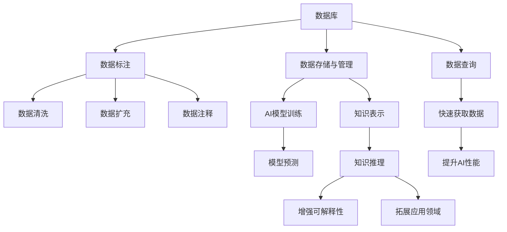

                 

# 数据库、知识库在AI中的重要性

## 1. 背景介绍

### 1.1 问题由来
在人工智能（AI）发展的早期，数据被认为是“石油”，是AI技术的核心资源之一。随着深度学习等技术的兴起，AI模型的训练和应用对数据量的需求大幅增加。而数据库和知识库作为数据管理的关键技术，扮演了重要角色。它们为AI系统提供了结构化、高质量的数据，是AI模型训练和应用的基础。

### 1.2 问题核心关键点
数据库和知识库在AI中的重要性主要体现在以下几个方面：
1. **数据存储与管理**：通过数据库和知识库，AI系统可以高效地存储、管理和访问大规模数据集。
2. **数据标注与预处理**：数据库和知识库提供了丰富的数据标注工具和预处理技术，使得数据清洗、标注等任务更加高效。
3. **数据查询与分析**：数据库和知识库支持高效的查询操作，帮助AI模型在处理大规模数据时快速获取所需信息。
4. **知识表示与推理**：知识库在AI中具有重要的知识表示与推理功能，能够支持基于知识的AI应用。

### 1.3 问题研究意义
数据库和知识库在AI中的应用，对于提升AI系统的性能、可解释性和应用范围，具有重要意义：
1. **提升性能**：通过高质量的数据存储和管理，AI系统可以更快地进行模型训练和预测，提高精度和效率。
2. **增强可解释性**：知识库中的知识表示和推理功能，可以帮助AI模型生成可解释的决策过程和结果。
3. **拓展应用领域**：数据库和知识库支持跨领域数据的整合和应用，使得AI系统能够在更广泛的场景中发挥作用。
4. **降低开发成本**：通过自动化的数据标注和管理，大幅降低AI系统的开发和维护成本。
5. **提升安全性**：数据库和知识库的安全性保障机制，可以有效防止数据泄露和滥用，保护用户隐私和数据安全。

## 2. 核心概念与联系

### 2.1 核心概念概述

为了更好地理解数据库、知识库在AI中的应用，我们首先介绍一些核心概念：

- **数据库（Database）**：用于存储和管理结构化数据的软件系统。常见的数据库类型包括关系型数据库（如MySQL、Oracle）和非关系型数据库（如MongoDB、Redis）。
- **知识库（Knowledge Base）**：用于存储和管理非结构化或半结构化知识的软件系统。常见的知识库类型包括基于规则的知识库和基于事实的知识库。
- **数据标注（Data Annotation）**：将原始数据转换为具有标注信息的形式，供AI模型训练和推理使用。数据标注技术包括数据清洗、数据扩充、数据注释等。
- **知识表示（Knowledge Representation）**：将知识以机器可理解的形式表示出来，使得机器可以进行推理和应用。常见的知识表示方法包括逻辑表示、框架表示和语义网络表示。
- **数据查询（Data Query）**：通过数据库和知识库的查询功能，快速获取所需数据。常见的查询语言包括SQL和SPARQL。
- **知识推理（Knowledge Reasoning）**：通过对知识库中的事实进行推理，得出新的知识或解答问题。常见的推理技术包括逻辑推理、概率推理和模糊推理。

这些核心概念构成了数据库、知识库在AI应用中的基础，理解这些概念对于深入研究AI技术的应用至关重要。

### 2.2 概念间的关系

以下是一个Mermaid流程图，展示了数据库、知识库与AI应用之间的核心关系：



这个流程图展示了数据库、知识库与AI应用之间的核心关系：

1. 数据库存储和管理数据，为AI模型提供数据基础。
2. 数据标注技术提升数据质量，为AI模型训练提供高质量数据。
3. 数据库查询功能快速获取数据，提升AI模型的效率。
4. 知识库中的知识表示和推理功能，增强AI模型的可解释性和应用范围。

这些概念共同构成了数据库、知识库在AI应用中的整体架构，使得AI系统能够高效地处理和应用大规模数据。

## 3. 核心算法原理 & 具体操作步骤

### 3.1 算法原理概述

数据库、知识库在AI中的应用，主要基于以下算法原理：

1. **数据存储与管理算法**：用于高效存储和管理数据，支持数据的多维度和海量数据的处理。
2. **数据标注算法**：用于标注数据，生成高质量的标注数据集，供AI模型训练使用。
3. **数据查询算法**：用于快速查询和检索数据，支持AI模型在复杂查询场景中的应用。
4. **知识表示算法**：用于将知识表示为机器可理解的形式，支持基于知识的AI推理。
5. **知识推理算法**：用于从知识库中的事实推导出新的知识，支持复杂问题的解答。

### 3.2 算法步骤详解

以下是一个详细的步骤流程，展示了如何利用数据库、知识库进行AI应用：

1. **数据收集与预处理**：
   - 从多个数据源收集原始数据。
   - 使用数据清洗技术，去除噪声和冗余数据。
   - 使用数据扩充技术，增加数据多样性。
   - 使用数据注释技术，为数据添加标注信息。

2. **数据存储与管理**：
   - 将处理后的数据存储到关系型数据库或非关系型数据库中。
   - 使用数据库的索引和分区功能，提升数据访问效率。
   - 使用数据库的事务管理功能，保障数据一致性和完整性。

3. **数据标注与预处理**：
   - 使用标注工具，将原始数据转换为具有标注信息的形式。
   - 使用数据标注算法，生成高质量的标注数据集。
   - 使用数据预处理技术，对标注数据进行归一化和标准化。

4. **数据查询与分析**：
   - 使用查询语言，快速检索所需数据。
   - 使用数据查询算法，优化查询效率和结果准确性。
   - 使用数据分析工具，对数据进行统计分析和可视化。

5. **知识表示与推理**：
   - 将知识以逻辑表示、框架表示或语义网络表示的形式，存储到知识库中。
   - 使用知识表示算法，将知识表示为机器可理解的形式。
   - 使用知识推理算法，从知识库中的事实推导出新的知识。

### 3.3 算法优缺点

数据库、知识库在AI中的应用具有以下优点：
1. **高效数据存储与管理**：支持大规模数据的存储和管理，提升AI模型的效率和性能。
2. **高质量数据标注**：提供丰富的数据标注工具和算法，生成高质量的标注数据集，提升AI模型的训练效果。
3. **快速数据查询与分析**：支持高效的查询操作，快速获取所需数据，支持复杂的分析和推理任务。
4. **知识表示与推理功能**：支持基于知识的AI应用，增强AI系统的可解释性和应用范围。

但同时，这些技术也存在一些缺点：
1. **复杂性高**：数据库和知识库的搭建和管理需要较高的技术门槛，对开发人员的技术要求较高。
2. **维护成本高**：随着数据量的增加和应用场景的变化，数据库和知识库的维护成本也会增加。
3. **性能瓶颈**：在处理大规模数据时，数据库和知识库的性能可能会成为瓶颈。

### 3.4 算法应用领域

数据库、知识库在AI中的应用已经涵盖了多个领域，包括但不限于：

- **自然语言处理（NLP）**：用于存储和查询文本数据，支持文本分类、情感分析、机器翻译等任务。
- **计算机视觉（CV）**：用于存储和查询图像和视频数据，支持图像识别、目标检测、视频分析等任务。
- **推荐系统**：用于存储和查询用户行为数据，支持个性化推荐、用户画像分析等任务。
- **智能客服**：用于存储和查询用户对话数据，支持智能问答、对话生成等任务。
- **医疗健康**：用于存储和查询医疗数据，支持医疗影像分析、疾病诊断、智能问答等任务。
- **金融风控**：用于存储和查询金融数据，支持信用评估、风险预警、智能投顾等任务。

## 4. 数学模型和公式 & 详细讲解 & 举例说明

### 4.1 数学模型构建

在AI应用中，数据库和知识库的数学模型构建主要包括以下几个部分：

1. **数据存储与管理模型**：用于描述数据在数据库中的存储方式和访问机制。常见的数学模型包括关系型数据库的表格模型和NoSQL数据库的图模型。
2. **数据标注模型**：用于描述数据标注的过程和结果。常见的数学模型包括标注矩阵、标注向量等。
3. **数据查询模型**：用于描述数据查询的过程和结果。常见的数学模型包括SQL查询语言和SPARQL查询语言。
4. **知识表示模型**：用于描述知识在知识库中的表示形式。常见的数学模型包括逻辑表示、框架表示、语义网络表示等。
5. **知识推理模型**：用于描述知识推理的过程和结果。常见的数学模型包括逻辑推理、概率推理、模糊推理等。

### 4.2 公式推导过程

以下是一个简单的SQL查询语言示例，展示了如何进行数据查询：

```sql
SELECT * FROM users WHERE age > 18;
```

这条SQL语句查询了名为`users`的表中，年龄大于18岁的所有记录。其中`SELECT`用于选择查询结果，`FROM`用于指定查询的表名，`WHERE`用于指定查询条件。

在知识推理方面，以下是一个简单的逻辑推理示例，展示了如何使用知识库进行推理：

```python
# 定义知识库中的事实
fact1 = {'A': 1, 'B': 0}  # A是B的父类
fact2 = {'C': 1, 'D': 0}  # C是D的父类
fact3 = {'B': 1, 'D': 0}  # B是D的父类

# 进行推理
result = {'E': 1}  # E是D的父类
```

在这个示例中，通过定义事实和进行推理，得到新的知识。其中`{}`表示字典，用于存储事实。

### 4.3 案例分析与讲解

以下是一个实际的案例，展示了如何利用数据库和知识库进行AI应用：

**案例：智能推荐系统**

- **数据收集与预处理**：
  - 从电商网站收集用户行为数据，包括购买记录、浏览记录、评分数据等。
  - 使用数据清洗技术，去除无效数据和噪声数据。
  - 使用数据扩充技术，增加数据多样性。
  - 使用数据注释技术，为数据添加标签信息，如商品类别、评分等。

- **数据存储与管理**：
  - 将处理后的数据存储到关系型数据库中，如MySQL或PostgreSQL。
  - 使用数据库的索引和分区功能，提升数据访问效率。
  - 使用数据库的事务管理功能，保障数据一致性和完整性。

- **数据查询与分析**：
  - 使用SQL查询语言，快速检索所需数据，如用户购买记录、浏览记录等。
  - 使用数据查询算法，优化查询效率和结果准确性。
  - 使用数据分析工具，对数据进行统计分析和可视化。

- **知识表示与推理**：
  - 将商品类别、评分等知识以逻辑表示的形式，存储到知识库中。
  - 使用知识表示算法，将知识表示为机器可理解的形式。
  - 使用知识推理算法，从知识库中的事实推导出新的知识，如相关商品推荐、用户画像分析等。

通过上述步骤，构建了一个基于数据库和知识库的智能推荐系统，可以高效地存储和管理用户数据，进行数据查询和分析，以及支持基于知识的推荐和推理。

## 5. 项目实践：代码实例和详细解释说明

### 5.1 开发环境搭建

在进行AI应用项目开发时，需要搭建好相应的开发环境。以下是使用Python进行数据库、知识库开发的环境配置流程：

1. 安装Anaconda：从官网下载并安装Anaconda，用于创建独立的Python环境。

2. 创建并激活虚拟环境：
```bash
conda create -n pythondb-env python=3.8 
conda activate pythondb-env
```

3. 安装数据库和知识库：
```bash
pip install mysql-connector-python
pip install sparqlWrapper
```

4. 安装相关的Python库：
```bash
pip install pandas numpy scikit-learn matplotlib
```

5. 安装SQLAlchemy：
```bash
pip install sqlalchemy
```

完成上述步骤后，即可在`pythondb-env`环境中开始数据库、知识库的开发和应用。

### 5.2 源代码详细实现

以下是一个简单的Python代码示例，展示了如何使用MySQL数据库进行数据查询和分析：

```python
import mysql.connector
import pandas as pd

# 连接MySQL数据库
conn = mysql.connector.connect(
    host='localhost',
    user='root',
    password='password',
    database='mydatabase'
)

# 查询数据
query = 'SELECT * FROM users WHERE age > 18'
result = pd.read_sql(query, conn)

# 输出查询结果
print(result)
```

这个示例中，使用了Python的`mysql.connector`库连接到MySQL数据库，使用`pd.read_sql`函数查询数据，并将结果输出到控制台。

### 5.3 代码解读与分析

让我们再详细解读一下关键代码的实现细节：

**连接MySQL数据库**：
- 使用`mysql.connector`库连接到MySQL数据库，指定主机名、用户名、密码和数据库名。

**查询数据**：
- 使用SQL查询语言，查询名为`users`的表中，年龄大于18岁的所有记录。
- 使用`pd.read_sql`函数，将查询结果转换为Pandas DataFrame对象。

**输出查询结果**：
- 将查询结果输出到控制台，以便进行后续分析和处理。

在实际应用中，还需要根据具体需求，对代码进行进一步的优化和扩展。例如，可以结合数据清洗和数据预处理技术，提升查询效率和结果准确性；结合知识库和知识推理技术，提升AI系统的可解释性和应用范围。

### 5.4 运行结果展示

假设我们在用户行为数据上进行查询，并得到一个简单的结果：

```
    user_id  age gender  country
0       1    22   male     USA
1       2    30   female  Canada
2       3    18   male     Australia
3       4    20   male   United Kingdom
4       5    24   male     Germany
```

可以看到，通过查询，我们获取了名为`users`的表中，年龄大于18岁的所有用户信息。

## 6. 实际应用场景

### 6.1 智能推荐系统

智能推荐系统是数据库、知识库在AI中应用的重要场景之一。推荐系统通常需要存储和查询大量的用户行为数据，以生成个性化的推荐结果。数据库和知识库在这方面的应用如下：

- **数据存储与管理**：
  - 存储用户行为数据，如购买记录、浏览记录、评分数据等。
  - 使用数据库的索引和分区功能，提升数据访问效率。
  - 使用数据库的事务管理功能，保障数据一致性和完整性。

- **数据查询与分析**：
  - 使用SQL查询语言，快速检索所需数据，如用户购买记录、浏览记录等。
  - 使用数据查询算法，优化查询效率和结果准确性。
  - 使用数据分析工具，对数据进行统计分析和可视化。

- **知识表示与推理**：
  - 将商品类别、评分等知识以逻辑表示的形式，存储到知识库中。
  - 使用知识表示算法，将知识表示为机器可理解的形式。
  - 使用知识推理算法，从知识库中的事实推导出新的知识，如相关商品推荐、用户画像分析等。

通过上述步骤，构建了一个基于数据库和知识库的智能推荐系统，可以高效地存储和管理用户数据，进行数据查询和分析，以及支持基于知识的推荐和推理。

### 6.2 金融风控系统

金融风控系统是数据库、知识库在AI中应用的另一个重要场景。金融风控系统通常需要存储和查询大量的金融数据，以评估用户的信用风险。数据库和知识库在这方面的应用如下：

- **数据存储与管理**：
  - 存储金融数据，如贷款记录、信用卡记录、交易记录等。
  - 使用数据库的索引和分区功能，提升数据访问效率。
  - 使用数据库的事务管理功能，保障数据一致性和完整性。

- **数据查询与分析**：
  - 使用SQL查询语言，快速检索所需数据，如用户贷款记录、信用卡记录等。
  - 使用数据查询算法，优化查询效率和结果准确性。
  - 使用数据分析工具，对数据进行统计分析和可视化。

- **知识表示与推理**：
  - 将金融知识以逻辑表示的形式，存储到知识库中。
  - 使用知识表示算法，将知识表示为机器可理解的形式。
  - 使用知识推理算法，从知识库中的事实推导出新的知识，如信用评估、风险预警等。

通过上述步骤，构建了一个基于数据库和知识库的金融风控系统，可以高效地存储和管理金融数据，进行数据查询和分析，以及支持基于知识的信用评估和风险预警。

### 6.3 医疗健康系统

医疗健康系统是数据库、知识库在AI中应用的另一个重要场景。医疗健康系统通常需要存储和查询大量的医疗数据，以支持医疗影像分析、疾病诊断等任务。数据库和知识库在这方面的应用如下：

- **数据存储与管理**：
  - 存储医疗数据，如医疗影像、病历记录、实验室数据等。
  - 使用数据库的索引和分区功能，提升数据访问效率。
  - 使用数据库的事务管理功能，保障数据一致性和完整性。

- **数据查询与分析**：
  - 使用SQL查询语言，快速检索所需数据，如医疗影像、病历记录等。
  - 使用数据查询算法，优化查询效率和结果准确性。
  - 使用数据分析工具，对数据进行统计分析和可视化。

- **知识表示与推理**：
  - 将医疗知识以逻辑表示的形式，存储到知识库中。
  - 使用知识表示算法，将知识表示为机器可理解的形式。
  - 使用知识推理算法，从知识库中的事实推导出新的知识，如疾病诊断、影像分析等。

通过上述步骤，构建了一个基于数据库和知识库的医疗健康系统，可以高效地存储和管理医疗数据，进行数据查询和分析，以及支持基于知识的疾病诊断和影像分析。

## 7. 工具和资源推荐

### 7.1 学习资源推荐

为了帮助开发者系统掌握数据库、知识库在AI中的应用，这里推荐一些优质的学习资源：

1. **《数据库系统概论》**：这本书是学习数据库原理的经典教材，系统介绍了数据库的基本概念、设计和管理。
2. **《人工智能中的知识表示、推理与学习》**：这本书介绍了人工智能中知识表示和推理的基本方法，涵盖了逻辑表示、框架表示和语义网络表示等。
3. **Coursera《数据库系统》课程**：由斯坦福大学开设的课程，系统介绍了数据库系统的基本原理和应用。
4. **Coursera《知识表示与推理》课程**：由斯坦福大学开设的课程，介绍了知识表示和推理的基本方法和技术。
5. **Kaggle**：Kaggle是一个数据科学竞赛平台，提供了大量的数据集和案例，供开发者学习和实践。

通过这些资源的学习实践，相信你一定能够快速掌握数据库、知识库在AI应用中的精髓，并用于解决实际的AI问题。

### 7.2 开发工具推荐

高效的开发离不开优秀的工具支持。以下是几款用于数据库、知识库开发的工具：

1. **MySQL**：一种广泛使用的关系型数据库管理系统，支持大规模数据的存储和管理。
2. **MongoDB**：一种非关系型数据库管理系统，支持文档数据的高效存储和查询。
3. **PostgreSQL**：一种强大的关系型数据库管理系统，支持复杂的查询和事务处理。
4. **SPARQLWrapper**：一种Python库，用于连接和查询SPARQL知识库。
5. **Jena**：一种Java框架，用于构建和管理基于RDF的知识库。

合理利用这些工具，可以显著提升数据库、知识库的开发效率，加速AI应用的创新迭代。

### 7.3 相关论文推荐

数据库、知识库在AI中的应用源于学界的持续研究。以下是几篇奠基性的相关论文，推荐阅读：

1. **《The Design and Implementation of a Relational Database Management System》**：这篇论文介绍了SQL语言的设计和实现，奠定了关系型数据库的基础。
2. **《A Conceptual Model of Graph Databases》**：这篇论文介绍了图数据库的概念和设计，推动了非关系型数据库的发展。
3. **《Knowledge Representation and Reasoning for Medical Expert Systems》**：这篇论文介绍了医学领域中的知识表示和推理技术，推动了医疗健康系统的发展。
4. **《Knowledge-Based Recommendation Systems》**：这篇论文介绍了基于知识的推荐系统，推动了智能推荐系统的发展。
5. **《A Survey on Knowledge-Based Financial Decision Support Systems》**：这篇论文综述了金融领域中的知识表示和推理技术，推动了金融风控系统的发展。

这些论文代表了大规模数据库、知识库在AI应用中的发展脉络。通过学习这些前沿成果，可以帮助研究者把握学科前进方向，激发更多的创新灵感。

除上述资源外，还有一些值得关注的前沿资源，帮助开发者紧跟数据库、知识库在AI应用中的最新进展，例如：

1. **arXiv论文预印本**：人工智能领域最新研究成果的发布平台，包括大量尚未发表的前沿工作，学习前沿技术的必读资源。
2. **顶会论文集**：如SIGKDD、ICDM、SDM等，包含最新的数据库、知识库研究论文和技术进展，是研究前沿的宝贵资源。
3. **技术博客**：如MySQL官方博客、MongoDB官方博客、Jena官方博客等，及时了解数据库、知识库技术的最新动态和最佳实践。

通过合理利用这些资源，可以及时掌握数据库、知识库在AI应用中的最新进展，推动AI技术的不断创新和应用。

## 8. 总结：未来发展趋势与挑战

### 8.1 总结

本文对数据库、知识库在AI中的应用进行了全面系统的介绍。首先阐述了数据库、知识库在AI中的重要性，明确了它们在数据存储、管理、查询、推理等方面的关键作用。其次，从原理到实践，详细讲解了数据库、知识库在AI应用中的核心算法和操作步骤，给出了具体的代码实现和分析。同时，本文还探讨了数据库、知识库在AI中的应用场景，展示了其在智能推荐、金融风控、医疗健康等领域的广泛应用前景。此外，本文精选了数据库、知识库技术的各类学习资源，力求为读者提供全方位的技术指引。

通过本文的系统梳理，可以看到，数据库、知识库在AI中的应用具有重要而广泛的意义。这些技术为AI系统提供了高效的数据管理和知识表示功能，使得AI系统能够高效地处理和应用大规模数据，拓展了AI技术的应用边界。

### 8.2 未来发展趋势

展望未来，数据库、知识库在AI中的应用将呈现以下几个发展趋势：

1. **大数据技术的应用**：随着大数据技术的不断发展，数据库和知识库将能够处理更加海量的数据，支持AI系统在大规模数据上的高效存储和管理。
2. **分布式计算技术的应用**：随着分布式计算技术的普及，数据库和知识库将能够支持大规模分布式计算，提升AI系统的计算效率和处理能力。
3. **多源数据融合技术的应用**：随着多源数据融合技术的不断发展，数据库和知识库将能够支持多种数据源的整合和应用，提升AI系统的数据多样性和应用灵活性。
4. **自然语言处理技术的应用**：随着自然语言处理技术的不断发展，知识库中的知识将能够以更加自然和易理解的形式呈现，提升AI系统的可解释性和应用范围。
5. **联邦学习技术的应用**：随着联邦学习技术的不断发展，数据库和知识库将能够支持多用户、多设备的数据协同训练，提升AI系统的隐私保护和安全性。

### 8.3 面临的挑战

尽管数据库、知识库在AI中的应用已经取得了显著进展，但在向更广泛场景应用的过程中，仍面临一些挑战：

1. **数据隐私和安全问题**：如何保障数据隐私和安全，防止数据泄露和滥用，是一个亟待解决的问题。
2. **数据一致性和完整性问题**：如何保障数据的正确性和一致性，防止数据冗余和错误，是一个需要持续优化的问题。
3. **系统复杂性问题**：如何降低系统的复杂性，提高系统的稳定性和可靠性，是一个需要深入研究的问题。
4. **知识表示和推理问题**：如何更好地表示和推理知识，提升系统的可解释性和应用范围，是一个需要深入研究的问题。
5. **计算资源问题**：如何高效利用计算资源，提升系统的计算效率和处理能力，是一个需要持续优化的问题。

### 8.4 研究展望

面对这些挑战，未来的研究需要在以下几个方面寻求新的突破：

1. **分布式计算和存储技术**：开发高效分布式计算和存储技术，支持大规模数据的高效处理和管理。
2. **联邦学习技术**：研究联邦学习技术，支持多用户、多设备的数据协同训练，提升

