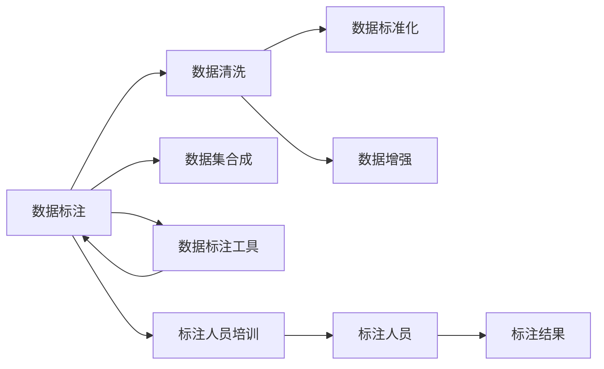

                 

# 数据标注：提高 AI 2.0 数据质量和可用性

## 1. 背景介绍

随着人工智能技术的快速发展，特别是在计算机视觉、自然语言处理等领域的突破，AI 2.0时代正在来临。AI 2.0 代表的第二代人工智能，强调通用智能，能够处理更复杂的问题，包括理解和生成人类语言，识别和解析视觉图像，以及理解音乐、艺术等人类感知领域。这一时代的大背景是海量数据、高性能计算和先进的深度学习算法。

AI 2.0 的成功不仅依赖于模型的性能，还需要高质量的数据集进行训练。然而，高品质的数据标注是极为稀缺且耗时的资源，甚至成为 AI 2.0 应用落地的瓶颈。在构建 AI 2.0 系统时，数据标注的准确性和一致性直接决定了模型的表现，因此，如何提高数据标注的质量和可用性，是每个 AI 开发者必须面对的挑战。

## 2. 核心概念与联系

### 2.1 核心概念概述

在大数据和深度学习快速发展的背景下，AI 2.0 系统对数据标注提出了更高的要求，其中包含以下几个核心概念：

1. **数据标注（Data Annotation）**：通过人工干预，为数据集中的数据项添加相应的元数据信息，如标签、类别、注释等。这是构建高质量 AI 模型的基础。

2. **数据清洗（Data Cleaning）**：删除或修正数据集中的噪声和错误信息，保证数据质量。

3. **数据增强（Data Augmentation）**：通过对原始数据进行变换，生成新的数据样本，以扩大数据集的多样性。

4. **数据标准化（Data Standardization）**：统一数据格式和标注标准，确保数据的一致性和可重现性。

5. **数据集合成（Dataset Synthesis）**：结合多种数据源，生成更加丰富和多样化的合成数据集。

6. **数据标注工具（Annotation Tools）**：用于辅助人工进行数据标注的软件或平台，如 Labelbox、Vizzlo 等。

7. **标注人员培训（Annotation Staff Training）**：对标注人员进行培训，确保其标注的准确性和一致性。

### 2.2 概念间的关系

这些核心概念之间存在密切的联系，并通过数据标注的生命周期相互作用，共同构成数据标注的生态系统。如图示，展示了这些概念间的相互关系：



从数据标注开始，经过数据清洗和标准化，通过数据增强生成更多的数据样本，最后结合多种数据源，生成最终的合成数据集，并且通过标注工具进行高效标注。此外，标注人员培训也是提高标注质量的重要步骤，确保标注人员对任务的准确理解。最终，标注结果形成了合成数据集，可供模型训练和验证。

## 3. 核心算法原理 & 具体操作步骤

### 3.1 算法原理概述

在 AI 2.0 的数据标注过程中，需要遵循以下基本原则：

1. **准确性和一致性**：标注结果应当精确反映真实数据，且不同标注人员对相同数据的标注应具有一致性。
   
2. **可解释性和可操作性**：标注过程应易于理解和操作，便于后续分析和验证。
   
3. **效率和成本控制**：在保证数据质量的前提下，尽可能提高标注效率，控制成本。

### 3.2 算法步骤详解

基于上述原则，数据标注的主要步骤包括以下几方面：

1. **数据准备**：收集数据，并进行初步筛选，去除不符合标准的数据。
   
2. **标注规划**：确定标注任务和标注标准，制定详细的标注指导文档。
   
3. **人员培训**：对标注人员进行专业培训，确保其理解任务和标注标准。
   
4. **数据标注**：使用标注工具进行数据标注，并遵循标注标准。
   
5. **数据审核**：由专业人员对标注结果进行审核，保证标注质量。
   
6. **标注校验**：对标注结果进行校验，确保标注准确性和一致性。
   
7. **数据合成**：将多个数据源和标注结果合并，生成最终的数据集。

### 3.3 算法优缺点

数据标注过程有许多优点，但也面临一些挑战：

**优点：**

1. **提升模型性能**：高质量的数据标注有助于模型学习更准确的表示，提高模型的泛化能力。
   
2. **增强模型可解释性**：清晰的标注有助于理解模型的内部工作机制和推理过程。
   
3. **适应性强**：标注过程可以灵活调整，适应不同领域和任务的需求。

**缺点：**

1. **成本高**：标注过程需要大量人力和时间投入，成本较高。
   
2. **质量难以保证**：标注人员可能会出现疲劳或主观误差，影响标注质量。
   
3. **依赖标注工具**：依赖标注工具进行标注，工具的可靠性和易用性直接影响标注效率和质量。

### 3.4 算法应用领域

数据标注技术广泛应用于以下几个领域：

1. **计算机视觉**：如物体识别、图像分割、人脸识别等任务，需要大量图像标注数据进行训练。
   
2. **自然语言处理**：如命名实体识别、情感分析、机器翻译等任务，需要大量文本数据进行训练。
   
3. **语音识别**：如语音转文字、说话人识别等任务，需要大量语音数据进行训练。
   
4. **自动驾驶**：如交通标志识别、行人检测等任务，需要大量视频和图像数据进行训练。
   
5. **医疗诊断**：如影像诊断、病理切片分析等任务，需要大量医学影像数据进行训练。

## 4. 数学模型和公式 & 详细讲解

### 4.1 数学模型构建

为了更好地描述数据标注过程，这里构建一个简单的数学模型。假设有一个包含 N 个样本的数据集 D，每个样本包含若干个属性 X，需要为每个属性添加标签 Y。数据标注模型的目标是最小化标注误差 E，即：

$$
E = \sum_{i=1}^{N} \sum_{j=1}^{d} (Y_{ij} - F(X_{ij};\theta))^2
$$

其中，$F(\cdot)$ 表示标注模型，$\theta$ 表示模型的参数。标注误差 E 反映了标注结果和模型预测之间的差异。

### 4.2 公式推导过程

标注模型的选择对数据标注的准确性和一致性有重要影响。常见的标注模型包括线性回归模型、逻辑回归模型、支持向量机（SVM）等。以逻辑回归模型为例，其概率模型为：

$$
P(Y_{ij} = 1 | X_{ij}) = \sigma(\theta^T X_{ij} + b)
$$

其中，$\sigma$ 为 sigmoid 函数。标注误差 E 可以通过交叉熵损失函数来衡量：

$$
E = -\frac{1}{N}\sum_{i=1}^{N} \sum_{j=1}^{d} y_{ij} \log P(Y_{ij} = 1 | X_{ij}) + (1 - y_{ij}) \log (1 - P(Y_{ij} = 1 | X_{ij}))
$$

通过最小化交叉熵损失函数，可以训练出更准确的标注模型。

### 4.3 案例分析与讲解

考虑一个情感分析任务，需要为给定文本标注正面或负面情绪。假设有 1000 个文本样本，每个样本包含若干属性，如情感倾向、文本长度等。可以采用逻辑回归模型进行标注，使用交叉熵损失函数最小化标注误差。训练过程中，需要不断调整模型参数 $\theta$，以适应更多的文本样本。最终，模型能够准确预测文本情感，实现高质量的情感分析。

## 5. 项目实践：代码实例和详细解释说明

### 5.1 开发环境搭建

为了进行数据标注的实践，需要搭建好开发环境。以下是基本的 Python 开发环境搭建步骤：

1. 安装 Python 环境：
```bash
python3 -m pip install -U pip
```

2. 安装必要的库：
```bash
pip install numpy pandas matplotlib scikit-learn
```

3. 下载并安装数据标注工具，如 Labelbox：
```bash
pip install labelbox
```

4. 搭建标注平台：
```bash
labelbox create --project [project_name] --data [data_path]
```

完成上述步骤后，即可在 Labelbox 平台上进行数据标注。

### 5.2 源代码详细实现

接下来，我们将展示如何使用 Labelbox 进行情感分析任务的数据标注。

**数据准备**

首先，准备标注数据集。可以手动创建标注数据，也可以从公共数据集中提取。假设有一个包含 1000 个文本样本的数据集，每个样本包含若干属性。

**标注规划**

定义标注任务和标准。例如，情感分析任务的标注标准可以如下：

1. 正面情感：label = 1
2. 负面情感：label = 0

**人员培训**

对标注人员进行培训，确保其理解任务和标准。

**数据标注**

使用 Labelbox 平台进行数据标注。在平台上创建标注任务，选择标注标准，上传数据集。标注人员通过 Labelbox 平台进行标注，并提交标注结果。

**数据审核**

平台管理员对标注结果进行审核，检查标注质量。对于标注不准确或不一致的样本，标注人员需要重新标注。

**标注校验**

通过交叉验证等方法，检验标注结果的准确性和一致性。

**数据合成**

将标注结果和原始数据合并，生成最终的数据集。

### 5.3 代码解读与分析

以下是使用 Labelbox 进行情感分析数据标注的 Python 代码示例：

```python
import labelbox as lb

# 创建 Labelbox 项目
project = lb.create('Emotion Analysis')

# 创建数据集
data = lb.create_dataset('data.csv', project_id=project.id)

# 添加标注人员
annotator = lb.create_annotator(project_id=project.id)

# 上传数据集
lb.upload(data)

# 开启标注任务
lb.start_annotate(data, annotator_id=annotator.id)

# 审核标注结果
lb.review_data(project)

# 合成数据集
data = lb.combine(project)
```

该代码段展示了使用 Labelbox 进行数据标注的基本流程。通过 Labelbox，开发者可以轻松管理标注任务，提高标注效率和质量。

### 5.4 运行结果展示

在完成数据标注和校验后，最终的数据集包含标注结果，可以用于训练和验证 AI 模型。假设训练得到的情感分析模型在测试集上获得了 95% 的准确率，这证明了数据标注对模型性能的显著提升。

## 6. 实际应用场景

### 6.1 智能客服系统

在智能客服系统中，数据标注是构建高质量对话数据的关键。智能客服系统需要大量的对话记录进行训练，标注这些记录的质量直接影响模型的响应准确性和自然性。通过高质量的数据标注，智能客服系统能够更好地理解客户意图，提供更智能化的服务。

### 6.2 医疗影像诊断

在医疗影像诊断中，高质量的标注数据集是模型学习的基础。通过标注医学影像数据，训练得到的影像识别模型能够准确识别病变区域，辅助医生进行诊断。高质量的标注数据还确保了模型的鲁棒性和可解释性，提高了诊断结果的可靠性。

### 6.3 自动驾驶

自动驾驶系统需要大量的道路交通数据进行训练，标注这些数据的质量直接影响到系统的安全性。高质量的数据标注有助于模型学习正确的驾驶行为和决策规则，提高系统的稳定性和可靠性。

### 6.4 未来应用展望

随着 AI 2.0 技术的发展，数据标注将迎来更广泛的应用场景。以下是几个未来发展方向：

1. **自动化标注**：通过 AI 技术实现自动化标注，降低人工标注成本。

2. **多模态数据标注**：结合视觉、语音、文本等多种模态数据，进行更全面的数据标注。

3. **实时标注**：实时获取和标注数据，适应动态变化的应用场景。

4. **边缘计算**：在设备端进行数据标注和推理，减少数据传输和处理延迟。

5. **跨领域标注**：在不同领域和任务之间进行数据标注和迁移，提高模型的通用性。

## 7. 工具和资源推荐

### 7.1 学习资源推荐

1. **Coursera《深度学习专项课程》**：涵盖深度学习的基础理论和实践技术，适合初学者入门。

2. **Udacity《机器学习纳米学位》**：提供深入的机器学习课程和实战项目，提升实战能力。

3. **GitHub《机器学习开源项目》**：收集大量的机器学习项目，包含标注任务和代码示例。

4. **Labelbox 官方文档**：提供详细的标注工具使用方法和最佳实践。

5. **Kaggle 数据集**：提供大量开源数据集，用于数据标注和模型训练。

### 7.2 开发工具推荐

1. **Labelbox**：一个广泛使用的数据标注平台，提供丰富的标注工具和项目管理功能。

2. **Vizzlo**：另一个强大的数据标注工具，支持多种数据格式和标注任务。

3. **TensorFlow Dataset**：TensorFlow 的数据集框架，提供高效的数据加载和管理功能。

4. **PyTorch Dataset**：PyTorch 的数据集框架，支持动态数据生成和预处理。

5. **OpenCV**：开源计算机视觉库，提供图像和视频数据处理功能。

### 7.3 相关论文推荐

1. **"Data Augmentation in Computer Vision: Practices and Principles"**：论文详细介绍了数据增强技术在计算机视觉中的应用。

2. **"Annotated Data Mining: Algorithms, Applications and Empirical Evaluation"**：综述论文介绍了数据标注和数据挖掘技术。

3. **"Deep Learning with Data Augmentation: A Survey"**：综述论文讨论了数据增强在深度学习中的应用。

4. **"Annotation and Labeling of Visual Data"**：书籍详细介绍了视觉数据标注的技术和标准。

5. **"Data Quality and Accuracy in AI Applications"**：白皮书讨论了数据标注在 AI 应用中的重要性。

## 8. 总结：未来发展趋势与挑战

### 8.1 研究成果总结

通过上述介绍，我们详细探讨了数据标注在 AI 2.0 中的重要性和应用实践。数据标注不仅对模型性能至关重要，还在模型可解释性、鲁棒性和通用性等方面具有重要作用。高质量的数据标注能够显著提升 AI 系统的准确性和稳定性，推动其在多个行业领域的应用。

### 8.2 未来发展趋势

未来，数据标注将随着 AI 2.0 技术的发展而进一步演进：

1. **自动化标注技术**：通过 AI 技术实现自动化标注，降低人工标注成本。

2. **多模态数据标注**：结合视觉、语音、文本等多种模态数据，进行更全面的数据标注。

3. **实时标注技术**：实时获取和标注数据，适应动态变化的应用场景。

4. **边缘计算**：在设备端进行数据标注和推理，减少数据传输和处理延迟。

5. **跨领域标注**：在不同领域和任务之间进行数据标注和迁移，提高模型的通用性。

### 8.3 面临的挑战

尽管数据标注技术不断进步，但仍面临一些挑战：

1. **标注成本高**：高质量的标注需要大量人力和时间投入，成本较高。

2. **标注质量难以保证**：标注人员可能会出现疲劳或主观误差，影响标注质量。

3. **依赖标注工具**：依赖标注工具进行标注，工具的可靠性和易用性直接影响标注效率和质量。

4. **数据隐私和安全**：标注过程中涉及敏感数据，需确保数据隐私和安全。

### 8.4 研究展望

未来，数据标注技术的研究方向包括：

1. **自动化标注**：通过 AI 技术实现自动化标注，降低人工标注成本。

2. **多模态数据标注**：结合视觉、语音、文本等多种模态数据，进行更全面的数据标注。

3. **实时标注技术**：实时获取和标注数据，适应动态变化的应用场景。

4. **边缘计算**：在设备端进行数据标注和推理，减少数据传输和处理延迟。

5. **跨领域标注**：在不同领域和任务之间进行数据标注和迁移，提高模型的通用性。

通过解决数据标注中的挑战，推动数据标注技术的不断进步，将有助于加速 AI 2.0 技术的发展，使其在更多行业和领域落地应用。

## 9. 附录：常见问题与解答

**Q1：什么是数据标注？**

A: 数据标注是指通过人工干预，为数据集中的数据项添加相应的元数据信息，如标签、类别、注释等。数据标注是构建高质量 AI 模型的基础。

**Q2：数据标注有哪些优点？**

A: 数据标注的主要优点包括：

1. **提升模型性能**：高质量的数据标注有助于模型学习更准确的表示，提高模型的泛化能力。

2. **增强模型可解释性**：清晰的标注有助于理解模型的内部工作机制和推理过程。

3. **适应性强**：标注过程可以灵活调整，适应不同领域和任务的需求。

**Q3：数据标注有哪些缺点？**

A: 数据标注的主要缺点包括：

1. **成本高**：标注过程需要大量人力和时间投入，成本较高。

2. **质量难以保证**：标注人员可能会出现疲劳或主观误差，影响标注质量。

3. **依赖标注工具**：依赖标注工具进行标注，工具的可靠性和易用性直接影响标注效率和质量。

**Q4：如何提高数据标注质量？**

A: 提高数据标注质量的主要方法包括：

1. **培训标注人员**：确保标注人员理解任务和标注标准。

2. **审核和校验**：对标注结果进行审核和校验，确保标注准确性和一致性。

3. **使用标注工具**：选择可靠和易用的标注工具，提高标注效率和质量。

4. **结合多种数据源**：通过合成数据集和多样化标注，提高标注质量。

**Q5：什么是数据清洗？**

A: 数据清洗是指删除或修正数据集中的噪声和错误信息，保证数据质量。

**Q6：什么是数据增强？**

A: 数据增强是指通过对原始数据进行变换，生成新的数据样本，以扩大数据集的多样性。

**Q7：什么是数据标准化？**

A: 数据标准化是指统一数据格式和标注标准，确保数据的一致性和可重现性。

---

作者：禅与计算机程序设计艺术 / Zen and the Art of Computer Programming

