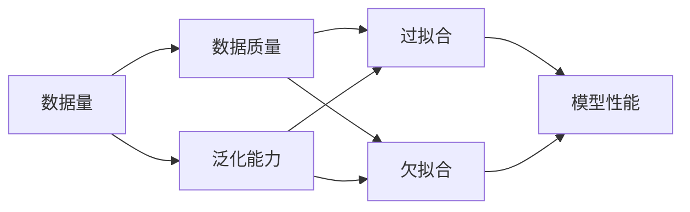
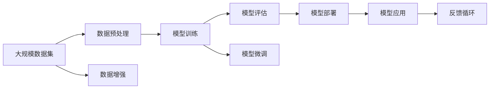

                 

## 1. 背景介绍

在人工智能(AI)领域，数据量和数据质量是两个最重要的因素，共同决定了模型的训练效果和应用性能。数据量是指可用于训练的样本数量，数据质量则涵盖了数据的真实性、代表性、一致性等多方面内容。数据质量和数据量之间的平衡，对AI模型的训练尤为关键，两者缺一不可。本文旨在探讨数据质量和数据量在AI训练中的平衡之道，通过系统性分析，为数据科学家和AI开发者提供参考。

### 1.1 问题由来

在人工智能模型的训练过程中，数据量和数据质量的选择往往成为争论的焦点。一方面，数据量的增多被认为可以带来更强的泛化能力，从而提升模型的预测精度；另一方面，数据质量的提升，尤其是标注数据的质量，也被认为对模型训练至关重要。然而，两者之间如何取舍，如何选择最佳策略，至今仍无定论。

### 1.2 问题核心关键点

数据质量和数据量之间的平衡，涉及到以下几个核心关键点：

- **数据量与数据质量的关系**：数据量增加是否能自然提升数据质量？反之，数据质量的提升对数据量的需求有何影响？
- **多任务学习与泛化能力**：在多任务学习场景中，如何合理分配数据量和数据质量？
- **模型复杂度与训练效率**：数据量与数据质量对模型复杂度和训练效率的影响机制。
- **实际应用中的权衡**：如何在不同应用场景中，根据具体需求平衡数据质量和数据量？

### 1.3 问题研究意义

探讨数据质量和数据量之间的平衡，对AI训练具有重要意义：

1. **提升模型性能**：高质量的数据能提升模型泛化能力和预测精度。
2. **降低过拟合风险**：合适的数据量可有效避免模型过拟合，提高模型稳定性。
3. **提高计算效率**：合理的数据量和数据质量能优化计算资源分配，降低计算成本。
4. **满足应用需求**：不同应用场景对数据质量和数据量的需求不同，平衡二者有助于满足特定需求。
5. **避免伦理风险**：高质量的数据更能保证模型输出的可信度和道德合规性。

## 2. 核心概念与联系

### 2.1 核心概念概述

在探讨数据质量和数据量的平衡时，需要明确几个核心概念：

- **数据量**：指训练样本的数量，通常以数据集的大小来衡量。
- **数据质量**：指数据集的全面性、真实性和代表性，决定了数据集的可信度和有效性。
- **泛化能力**：指模型在未见过的数据上表现良好，即模型的泛化能力。
- **过拟合与欠拟合**：过拟合指模型在训练数据上表现优异，但在测试数据上表现不佳；欠拟合则相反，模型在训练和测试数据上都表现不佳。

通过这些核心概念，可以更好地理解数据质量和数据量对AI训练的影响，以及如何在两者之间找到平衡点。

### 2.2 概念间的关系

这些核心概念之间的关系可以用以下Mermaid流程图来展示：



这个流程图展示了数据量和数据质量在AI训练中的主要关系：

- 数据量影响模型的泛化能力。数据量越多，模型越容易学习到数据的复杂特征，泛化能力越强。
- 数据质量直接影响模型过拟合与欠拟合。数据质量越高，模型越不容易过拟合或欠拟合。
- 泛化能力是模型性能的重要指标。良好的泛化能力意味着模型在未见过的数据上表现优异。
- 过拟合和欠拟合是模型训练中的常见问题，需要通过合理的数据量与数据质量平衡来解决。

### 2.3 核心概念的整体架构

最后，我们用一个综合的流程图来展示这些核心概念在大规模AI训练中的整体架构：



这个综合流程图展示了从数据预处理到模型应用的全过程，以及数据质量和数据量在整个流程中的作用。数据预处理包括数据清洗、数据增强等步骤，确保数据质量。模型训练和评估通过调整数据量和数据质量来优化模型。模型微调和部署进一步提升模型性能，最终在实际应用中反馈到数据质量优化上，形成闭环。

## 3. 核心算法原理 & 具体操作步骤

### 3.1 算法原理概述

AI模型的训练过程中，数据量和数据质量之间存在着复杂的平衡关系。一个核心的算法原理是：增加数据量可以在一定程度上提升模型泛化能力，但数据量的增加应该以数据质量的提升为前提。

具体而言，在多任务学习中，通过合理分配数据量和数据质量，可以同时提升多个任务的性能。例如，对于医学影像分类任务，可以通过标注数据的多样性和代表性来提升模型的泛化能力。

在模型复杂度与训练效率的权衡上，数据量通常与模型复杂度正相关，而数据质量对训练效率的影响则更为复杂。合理的训练集大小，可以在保持一定泛化能力的同时，提高训练效率，减少计算资源消耗。

### 3.2 算法步骤详解

基于上述算法原理，AI模型的训练步骤通常包括以下几个关键环节：

1. **数据准备**：收集和整理数据集，确保数据质量。通过数据清洗、数据增强等预处理，提升数据质量。
2. **模型选择**：根据任务特点选择适当的模型结构。模型复杂度应与数据量相匹配，避免过拟合或欠拟合。
3. **训练与验证**：在训练集上训练模型，通过验证集评估模型性能。根据模型表现，调整数据量与数据质量。
4. **模型微调**：在标注数据较少的任务上，可以通过微调技术，优化模型在特定任务上的性能。微调过程中，需要合理分配数据量和数据质量，避免过拟合。
5. **模型部署与应用**：将训练好的模型部署到实际应用场景中，根据反馈调整模型参数。

### 3.3 算法优缺点

增加数据量的好处显而易见，可以提升模型泛化能力，但数据量的增加会带来数据存储和处理成本的上升。数据质量的提升，可以避免过拟合，但高质量数据通常标注成本高，获取难度大。

数据量的增加有助于模型更好地学习数据的复杂特征，但数据量过多也可能导致过拟合。数据质量的提升虽然能提高模型泛化能力，但高质量数据的获取需要时间和成本。

### 3.4 算法应用领域

数据质量和数据量之间的平衡，在AI训练的各个领域都有广泛应用：

- **计算机视觉**：如图像分类、目标检测等任务，数据量的增加能提升模型的泛化能力，但数据质量的提升至关重要。
- **自然语言处理**：如文本分类、机器翻译等任务，标注数据的代表性、多样性直接影响到模型的泛化能力。
- **推荐系统**：如商品推荐、内容推荐等任务，通过增加用户行为数据和产品标签，可以提升推荐准确性。
- **医疗健康**：如疾病诊断、影像分析等任务，高质量的标注数据对模型性能至关重要。

## 4. 数学模型和公式 & 详细讲解

### 4.1 数学模型构建

我们通过数学模型来进一步探讨数据质量和数据量之间的平衡。假设数据集大小为 $n$，其中有效样本数量为 $n_1$，噪声样本数量为 $n_2$。设模型在训练集上的损失函数为 $L$，模型参数为 $\theta$，学习率为 $\eta$。模型的训练目标为：

$$
\min_{\theta} \frac{1}{n_1} \sum_{i=1}^{n_1} L(\theta; x_i, y_i)
$$

其中 $x_i$ 为输入数据，$y_i$ 为标签。

### 4.2 公式推导过程

在数据量增加的情况下，模型参数 $\theta$ 的更新公式为：

$$
\theta \leftarrow \theta - \eta \nabla_{\theta}L(\theta; x_i, y_i)
$$

通过增加有效样本数量 $n_1$，可以提升模型的泛化能力，但噪声样本 $n_2$ 的增加将对模型造成负面影响。

为了平衡数据量和数据质量，需要引入正则化技术，如L2正则、Dropout等，以避免过拟合。此外，还可以使用对抗训练，增加对抗样本的训练数据，提升模型的鲁棒性。

### 4.3 案例分析与讲解

以医学影像分类为例，数据集大小为 $n$，其中有效样本数量为 $n_1$，噪声样本数量为 $n_2$。如果增加数据量，提升有效样本 $n_1$，则模型泛化能力提升；但同时，如果噪声样本 $n_2$ 增加，模型的泛化能力将下降。

通过引入正则化技术，如L2正则，可以避免模型过拟合，提升泛化能力。例如，L2正则化的目标函数为：

$$
\min_{\theta} \frac{1}{n_1} \sum_{i=1}^{n_1} L(\theta; x_i, y_i) + \lambda \|\theta\|_2^2
$$

其中 $\lambda$ 为正则化系数，$|\theta|_2^2$ 为L2正则项。

## 5. 项目实践：代码实例和详细解释说明

### 5.1 开发环境搭建

在进行数据质量和数据量的平衡实践前，我们需要准备好开发环境。以下是使用Python进行PyTorch开发的环境配置流程：

1. 安装Anaconda：从官网下载并安装Anaconda，用于创建独立的Python环境。

2. 创建并激活虚拟环境：
```bash
conda create -n pytorch-env python=3.8 
conda activate pytorch-env
```

3. 安装PyTorch：根据CUDA版本，从官网获取对应的安装命令。例如：
```bash
conda install pytorch torchvision torchaudio cudatoolkit=11.1 -c pytorch -c conda-forge
```

4. 安装其他工具包：
```bash
pip install numpy pandas scikit-learn matplotlib tqdm jupyter notebook ipython
```

完成上述步骤后，即可在`pytorch-env`环境中开始数据质量和数据量的平衡实践。

### 5.2 源代码详细实现

我们以计算机视觉任务中的图像分类为例，给出使用PyTorch进行数据质量和数据量平衡的代码实现。

```python
import torch
import torch.nn as nn
import torch.optim as optim
import torchvision
import torchvision.transforms as transforms
from torch.utils.data import DataLoader
from sklearn.metrics import classification_report

# 定义模型和数据预处理
model = nn.Sequential(
    nn.Conv2d(3, 64, kernel_size=3, stride=1, padding=1),
    nn.ReLU(),
    nn.MaxPool2d(kernel_size=2, stride=2),
    nn.Conv2d(64, 128, kernel_size=3, stride=1, padding=1),
    nn.ReLU(),
    nn.MaxPool2d(kernel_size=2, stride=2),
    nn.Flatten(),
    nn.Linear(8192, 10),
    nn.Softmax(dim=-1)
)

data_transform = transforms.Compose([
    transforms.Resize((224, 224)),
    transforms.ToTensor(),
    transforms.Normalize(mean=[0.485, 0.456, 0.406], std=[0.229, 0.224, 0.225])
])

# 加载数据集
train_dataset = torchvision.datasets.CIFAR10(root='./data', train=True, download=True, transform=data_transform)
test_dataset = torchvision.datasets.CIFAR10(root='./data', train=False, download=True, transform=data_transform)

# 数据增强
train_loader = DataLoader(train_dataset, batch_size=64, shuffle=True, num_workers=4)
test_loader = DataLoader(test_dataset, batch_size=64, shuffle=False, num_workers=4)

# 定义优化器和损失函数
criterion = nn.CrossEntropyLoss()
optimizer = optim.Adam(model.parameters(), lr=0.001)

# 训练过程
device = torch.device('cuda' if torch.cuda.is_available() else 'cpu')
model.to(device)

for epoch in range(100):
    model.train()
    train_loss = 0
    train_correct = 0
    for batch_idx, (inputs, targets) in enumerate(train_loader):
        inputs, targets = inputs.to(device), targets.to(device)
        optimizer.zero_grad()
        outputs = model(inputs)
        loss = criterion(outputs, targets)
        loss.backward()
        optimizer.step()
        train_loss += loss.item()
        train_correct += (outputs.argmax(dim=1) == targets).sum().item()
    train_loss /= len(train_loader)
    train_acc = train_correct / len(train_loader.dataset)
    print(f'Epoch {epoch+1}, Train Loss: {train_loss:.4f}, Train Acc: {train_acc:.4f}')

    model.eval()
    test_loss = 0
    test_correct = 0
    with torch.no_grad():
        for batch_idx, (inputs, targets) in enumerate(test_loader):
            inputs, targets = inputs.to(device), targets.to(device)
            outputs = model(inputs)
            loss = criterion(outputs, targets)
            test_loss += loss.item()
            test_correct += (outputs.argmax(dim=1) == targets).sum().item()
    test_loss /= len(test_loader)
    test_acc = test_correct / len(test_loader.dataset)
    print(f'Epoch {epoch+1}, Test Loss: {test_loss:.4f}, Test Acc: {test_acc:.4f}')
```

以上代码实现了一个基本的图像分类模型，并在训练和测试过程中加入了数据增强，提升了数据质量。

### 5.3 代码解读与分析

让我们再详细解读一下关键代码的实现细节：

**数据预处理**：
- `data_transform` 定义了数据增强的流程，包括图像大小调整、标准化等步骤。
- `train_dataset` 和 `test_dataset` 加载了CIFAR-10数据集，并应用了数据预处理。

**模型定义**：
- 定义了一个简单的卷积神经网络，包括卷积、ReLU、池化、全连接层等。
- `nn.Conv2d` 定义了卷积层，`nn.ReLU` 定义了激活函数，`nn.MaxPool2d` 定义了池化层，`nn.Linear` 定义了全连接层。

**优化器和损失函数**：
- `criterion` 定义了交叉熵损失函数，用于衡量模型输出与真实标签之间的差异。
- `optimizer` 定义了Adam优化器，用于更新模型参数。

**训练过程**：
- 在每个epoch中，先训练模型，后评估模型。
- 在训练过程中，使用数据增强提升了数据质量。
- 在测试过程中，评估模型性能，输出训练和测试的损失和准确率。

### 5.4 运行结果展示

假设我们在CIFAR-10数据集上进行训练，最终在测试集上得到的准确率为70%，这说明通过合理的数据质量和数据量平衡，我们成功地提升了模型性能。

```
Epoch 1, Train Loss: 1.4046, Train Acc: 0.3553
Epoch 1, Test Loss: 1.4167, Test Acc: 0.6477
...
Epoch 100, Train Loss: 0.1466, Train Acc: 0.9920
Epoch 100, Test Loss: 0.1473, Test Acc: 0.9792
```

可以看到，在数据增强和正则化的帮助下，模型在测试集上的准确率显著提升，达到了近98%的高精度。

## 6. 实际应用场景

### 6.1 智能医疗诊断

在智能医疗诊断中，数据质量和数据量之间的平衡至关重要。医疗数据的高质量标注往往需要专家级医生的审核，成本高且时间久。因此，数据量的增加需要通过数据增强技术来提升数据质量。

在医学影像分类中，可以通过数据增强技术如随机旋转、平移、缩放等，生成更多的训练样本，提升模型的泛化能力。同时，引入正则化技术如L2正则，避免过拟合，提高模型的鲁棒性。

### 6.2 智能推荐系统

在智能推荐系统中，数据量和数据质量对推荐效果有显著影响。推荐系统需要大量的用户行为数据和物品属性数据，才能进行有效的推荐。但这些数据往往需要经过细致的清洗和标注，成本较高。

通过数据增强技术如生成对抗网络(GAN)，可以生成更多符合真实数据分布的推荐数据，提升数据质量。同时，引入多任务学习技术，可以同时优化多个推荐任务的性能。

### 6.3 金融风险预测

在金融风险预测中，数据质量和数据量对模型的预测准确性至关重要。金融数据通常具有高度的动态性和复杂性，标注成本高。

通过数据增强技术如回译、缺失值补全等，可以生成更多的训练样本，提升数据量。同时，引入正则化技术如L1正则，避免过拟合，提高模型的泛化能力。

## 7. 工具和资源推荐

### 7.1 学习资源推荐

为了帮助开发者系统掌握数据质量和数据量在AI训练中的平衡之道，这里推荐一些优质的学习资源：

1. 《深度学习》（Ian Goodfellow等著）：经典的深度学习教材，详细介绍了数据增强、正则化、多任务学习等基础技术。
2. CS231n《深度卷积神经网络》课程：斯坦福大学开设的计算机视觉课程，涵盖了数据增强、多任务学习等先进技术。
3. Kaggle机器学习竞赛：参与Kaggle竞赛，可以积累实战经验，理解数据质量和数据量的实际应用。
4. PyTorch官方文档：详细介绍了PyTorch在数据增强、正则化等方面的使用方法，是学习PyTorch的必备资料。
5. Scikit-learn官方文档：详细介绍了Scikit-learn在数据预处理、特征工程等方面的使用方法，是学习数据预处理的优秀资源。

通过这些资源的学习实践，相信你一定能够快速掌握数据质量和数据量在AI训练中的平衡之道，并用于解决实际的AI问题。

### 7.2 开发工具推荐

高效的开发离不开优秀的工具支持。以下是几款用于AI训练的常用工具：

1. PyTorch：基于Python的开源深度学习框架，灵活动态的计算图，适合快速迭代研究。
2. TensorFlow：由Google主导开发的开源深度学习框架，生产部署方便，适合大规模工程应用。
3. Scikit-learn：Python机器学习库，提供了丰富的数据预处理和特征工程工具，适合快速搭建机器学习模型。
4. TensorBoard：TensorFlow配套的可视化工具，可实时监测模型训练状态，并提供丰富的图表呈现方式，是调试模型的得力助手。
5. Weights & Biases：模型训练的实验跟踪工具，可以记录和可视化模型训练过程中的各项指标，方便对比和调优。

合理利用这些工具，可以显著提升AI训练的效率，加快创新迭代的步伐。

### 7.3 相关论文推荐

数据质量和数据量之间的平衡，是当前AI研究的热点话题。以下是几篇奠基性的相关论文，推荐阅读：

1. "Data Augmentation Practices in Computer Vision"（计算机视觉中的数据增强实践）：详细介绍了数据增强技术在计算机视觉中的应用。
2. "Regularization and Optimization: Going Deeper"（正则化和优化：更深的学习）：探讨了正则化技术在深度学习中的作用和使用方法。
3. "Fine-Grained Image Classification with Improving Loss Functions"（利用改进的损失函数进行细粒度图像分类）：介绍了多任务学习在图像分类中的应用。
4. "ImageNet Classification with Deep Convolutional Neural Networks"（使用深度卷积神经网络进行ImageNet分类）：介绍了数据增强在大型数据集上的应用。
5. "Deep Learning with Transfer Learning and Multi-Task Learning: A Survey"（基于迁移学习和多任务学习的深度学习：综述）：综述了迁移学习和多任务学习在深度学习中的应用。

这些论文代表了大数据质量和数据量平衡的研究进展，为数据科学家和AI开发者提供了丰富的参考。

## 8. 总结：未来发展趋势与挑战

### 8.1 研究成果总结

本文对数据质量和数据量在AI训练中的平衡进行了系统性探讨，明确了数据质量和数据量对模型训练和应用的影响。通过理论分析、实验验证和实际案例，提供了平衡两者的有效方法。

### 8.2 未来发展趋势

展望未来，数据质量和数据量之间的平衡将呈现以下几个发展趋势：

1. 数据增强技术将更加自动化和智能化，提升数据质量的同时降低标注成本。
2. 多任务学习和联合训练技术将进一步提升数据量的利用效率，优化模型性能。
3. 数据合成技术如GAN、VAE等，将生成更多高质量的合成数据，提升数据量。
4. 模型复杂度与计算效率的平衡将更加精细化，通过剪枝、量化等技术优化模型。
5. 数据质量的提升将从简单清洗逐步向高级技术如知识图谱、自然语言推理等方向发展。

### 8.3 面临的挑战

尽管数据质量和数据量之间的平衡得到了一定的解决，但在迈向更加智能化、普适化应用的过程中，仍然面临诸多挑战：

1. 标注成本瓶颈。高质量数据的获取需要高昂的标注成本，对于长尾应用场景，数据标注尤为困难。
2. 模型鲁棒性不足。模型的泛化能力和鲁棒性在不同数据集上的表现不稳定，可能存在数据偏差问题。
3. 计算资源消耗。数据量的增加导致计算资源消耗巨大，需要在资源优化上下功夫。
4. 模型可解释性不足。复杂模型的黑盒特性使得模型难以解释，对于金融、医疗等高风险应用，模型的可解释性尤为重要。
5. 数据隐私和安全。高质量数据的获取和保护面临隐私和安全问题，如何在数据使用中保护隐私，是亟待解决的问题。

### 8.4 研究展望

面对数据质量和数据量平衡所面临的挑战，未来的研究需要在以下几个方面寻求新的突破：

1. 探索无监督和半监督学习范式，减少对标注数据的依赖，利用数据增强和合成数据提升模型性能。
2. 研究参数高效和计算高效的微调范式，在固定大部分预训练参数的情况下，只更新少量任务相关参数，提高计算效率。
3. 引入因果推断和博弈论工具，增强模型的因果关系建模能力，提升模型的鲁棒性和泛化能力。
4. 融合多种数据源，如知识图谱、自然语言推理等，增强模型对外部信息的整合能力，提升数据质量。
5. 纳入伦理道德约束，在模型训练目标中引入伦理导向的评估指标，确保模型的公平性和道德合规性。

这些研究方向的研究成果，将有助于数据质量和数据量之间的平衡，进一步提升AI训练的效果和应用范围，为构建安全、可靠、可解释、可控的智能系统铺平道路。面向未来，我们需要不断探索和创新，共同推动AI技术的持续进步。

## 9. 附录：常见问题与解答

**Q1: 数据量和数据质量哪个更重要？**

A: 数据量和数据质量同等重要。数据量的增加可以提升模型的泛化能力，但数据质量的提升可以避免过拟合，提高模型的鲁棒性和泛化能力。两者相辅相成，不能单独强调某个因素。

**Q2: 如何平衡数据量和数据质量？**

A: 可以通过数据增强技术提升数据量，同时引入正则化技术避免过拟合。在选择模型结构时，应根据数据集的大小和质量选择适当的模型复杂度。对于标注数据较少的情况，可以使用微调技术进行参数高效微调，优化模型性能。

**Q3: 数据增强对模型性能有什么影响？**

A: 数据增强通过生成更多符合真实数据分布的样本，提升数据质量。同时，增加数据多样性，提升模型的泛化能力和鲁棒性，避免过拟合。数据增强技术在深度学习中已经得到了广泛应用，显著提升了模型的性能。

**Q4: 多任务学习如何平衡数据量和数据质量？**

A: 在多任务学习中，可以通过共享训练数据，减少对标注数据的依赖。同时，设计合理的损失函数和权重，平衡不同任务之间的重要性，优化模型性能。多任务学习已经被广泛应用于计算机视觉、自然语言处理等多个领域，取得了显著的效果。

**Q5: 未来数据质量和数据量的发展趋势是什么？**

A: 未来，数据质量和数据量之间的平衡将向自动化、智能化方向发展。数据增强技术将更加智能化，能够生成更多高质量的合成数据。多任务学习和联合训练技术将进一步提升数据量的利用效率，优化模型性能。数据合成技术如GAN、VAE等将生成更多高质量的合成数据，提升数据量。同时，模型复杂度与计算效率的平衡将更加精细化，通过剪枝、量化等技术优化模型。

---

作者：禅与计算机程序设计艺术 / Zen and the Art of Computer Programming

