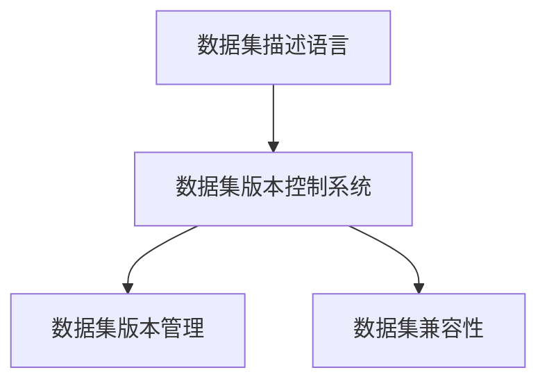

                 

# 数据集描述语言:构建数据集版本控制系统

## 1. 背景介绍

### 1.1 问题由来

在人工智能（AI）领域，特别是机器学习和深度学习（ML/DL）领域，数据集的版本控制是一个至关重要却常被忽视的问题。随着AI模型的复杂性和规模不断扩大，数据集的版本管理变得尤为困难。一个常见的挑战是，如何有效地管理和追踪数据集的版本变化，确保模型训练的一致性和稳定性。数据集的版本控制直接影响到模型的训练和评估结果，进而影响AI系统的可靠性和鲁棒性。

### 1.2 问题核心关键点

数据集版本控制的核心在于：

- **数据集的版本管理**：确保数据集的版本能够被正确记录、追溯和恢复。
- **数据集的版本变化**：数据集的版本变化包括添加、删除、修改数据等，需要系统地管理和记录这些变化。
- **数据集的兼容性**：不同版本的数据集应该能够无缝集成到模型训练和评估中，以确保模型性能的稳定性和可重复性。

### 1.3 问题研究意义

研究数据集描述语言和版本控制系统对于AI系统的稳定性和可靠性至关重要。一个好的数据集版本控制系统能够：

- 减少因数据集版本变化导致模型性能下降的风险。
- 提高模型训练和评估的可重复性，确保结果的可信度。
- 简化数据集的维护和管理，减少开发成本。
- 支持AI系统的大规模部署和持续优化。

## 2. 核心概念与联系

### 2.1 核心概念概述

数据集描述语言（Dataset Description Language, DSL）是一种用于描述和定义数据集结构和内容的语言。它通过明确定义数据集的属性、元数据和版本信息，使得数据集的版本控制和管理变得更加系统和可控。

数据集版本控制系统（Dataset Version Control System, DVCS）则是一种基于DSL的系统和工具，用于管理数据集的版本变化，支持数据集的追溯、恢复和集成。

### 2.2 概念间的关系

数据集描述语言和版本控制系统通过DSL实现紧密联系。DSL提供了数据集的定义和描述规范，而DVCS则依据这些规范实现了对数据集版本的管理和控制。DSL和DVCS的结合，构成了数据集版本控制的基础框架。

以下是一些关键概念及其之间的关系：

1. **数据集描述语言**：定义数据集的属性、元数据和版本信息，如数据集名称、来源、数据类型、格式、注释等。
2. **数据集版本控制系统**：依据DSL定义，管理和追踪数据集的版本变化，支持数据集的追溯、恢复和集成。
3. **数据集版本管理**：记录数据集的版本变化，确保数据集的兼容性和一致性。
4. **数据集兼容性**：确保不同版本的数据集能够无缝集成到模型训练和评估中。

### 2.3 核心概念的整体架构

下图展示了数据集描述语言和版本控制系统的整体架构：



这个架构展示了DSL和DVCS之间的相互作用和依赖关系。数据集描述语言提供了数据集的定义和描述规范，数据集版本控制系统依据这些规范实现版本管理，并通过版本管理确保数据集的兼容性。

## 3. 核心算法原理 & 具体操作步骤

### 3.1 算法原理概述

数据集版本控制系统通过DSL定义数据集的属性和元数据，记录数据集的版本变化，并提供数据集的追溯和恢复功能。其核心算法包括：

- **版本管理算法**：记录数据集的版本变化，如添加、删除、修改数据等操作。
- **版本追溯算法**：根据版本记录，追溯数据集的历史状态，支持回滚到历史版本。
- **版本兼容性算法**：确保不同版本的数据集能够无缝集成到模型训练和评估中。

### 3.2 算法步骤详解

数据集版本控制系统的实现步骤如下：

1. **数据集描述**：使用DSL定义数据集的属性和元数据，如数据集名称、来源、数据类型、格式、注释等。
2. **版本记录**：记录数据集的版本变化，包括添加、删除、修改数据等操作。
3. **版本追溯**：根据版本记录，追溯数据集的历史状态，支持回滚到历史版本。
4. **版本兼容性**：确保不同版本的数据集能够无缝集成到模型训练和评估中，支持多版本数据集的混合使用。

### 3.3 算法优缺点

数据集版本控制系统的优点包括：

- **版本管理**：提供系统的版本管理功能，确保数据集的版本变化被正确记录和追溯。
- **版本兼容性**：确保不同版本的数据集能够无缝集成，提高模型训练和评估的可重复性。
- **可追溯性**：提供数据集的历史追溯功能，支持回滚到历史版本，提高系统的鲁棒性。

其缺点包括：

- **复杂度**：DSL和DVCS的实现需要复杂的技术支撑，增加了系统的开发和维护成本。
- **兼容性问题**：不同版本的数据集可能在格式、结构等方面存在差异，集成时可能需要额外的处理。
- **版本更新**：数据集的版本更新可能会引入新的问题，需要持续维护和优化。

### 3.4 算法应用领域

数据集描述语言和版本控制系统在AI系统的各个环节都有广泛应用：

- **模型训练**：数据集的版本控制确保模型训练的一致性和可重复性。
- **模型评估**：确保评估数据集与训练数据集的一致性，提高评估结果的可靠性。
- **模型部署**：支持多版本数据集的集成，确保模型在不同环境下的稳定性。
- **持续优化**：支持持续的数据集版本更新和模型优化，推动AI系统的持续进步。

## 4. 数学模型和公式 & 详细讲解

### 4.1 数学模型构建

数据集版本控制系统可以通过数学模型来描述数据集的版本管理过程。假设数据集版本控制系统维护了 $N$ 个版本的数据集 $D_1, D_2, ..., D_N$，每个数据集由一组数据 $X$ 和一组注释 $A$ 组成。版本管理算法可以表示为：

$$
D_{i+1} = f(D_i, V_i)
$$

其中 $f$ 表示版本生成函数，$V_i$ 表示第 $i$ 次版本操作，可以是添加、删除、修改数据等操作。

### 4.2 公式推导过程

数据集版本追溯算法可以通过追溯函数 $g$ 来实现。追溯函数 $g$ 能够从当前版本 $D_{i+1}$ 追溯到一个历史版本 $D_j$：

$$
D_j = g(D_{i+1}, t)
$$

其中 $t$ 表示追溯时间，可以是具体的版本编号或时间戳。

### 4.3 案例分析与讲解

假设我们有一个机器学习模型，用于分类图像中的猫和狗。我们有一个数据集 $D_1$，包含100张猫和100张狗的图像，以及对应的标签。如果我们添加了10张新的狗图像，数据集变为 $D_2$。

1. **版本管理**：记录了添加10张新图像的操作 $V_1 = \{new\_dog\_images\}$。
2. **版本追溯**：通过追溯函数 $g$，我们可以从 $D_2$ 追溯到 $D_1$，并恢复原始数据集。
3. **版本兼容性**：确保 $D_1$ 和 $D_2$ 能够在模型训练和评估中无缝集成。

## 5. 项目实践：代码实例和详细解释说明

### 5.1 开发环境搭建

为了实现数据集描述语言和版本控制系统，我们需要搭建一个开发环境。以下是一个简单的环境搭建步骤：

1. **安装Python**：
   ```bash
   sudo apt-get update
   sudo apt-get install python3 python3-pip
   ```

2. **安装DSL和DVCS库**：
   ```bash
   pip install dsl-dvcs
   ```

3. **配置DSL和DVCS**：
   ```python
   import dsl_dvcs
   
   # 初始化DSL和DVCS
   dsl = dsl_dvcs.DSL()
   dvcs = dsl_dvcs.DVCS(dsl)
   ```

### 5.2 源代码详细实现

以下是使用Python实现数据集描述语言和版本控制系统的示例代码：

```python
# 定义数据集描述语言
class Dataset:
    def __init__(self, name, sources, data_type, format, comments):
        self.name = name
        self.sources = sources
        self.data_type = data_type
        self.format = format
        self.comments = comments

# 定义数据集版本控制系统
class DVCS:
    def __init__(self, dsl):
        self.dsl = dsl
        self.versions = []

    def add(self, data, version):
        # 记录版本变化
        self.versions.append((data, version))
        self.dsl.add(data)

    def remove(self, data, version):
        # 记录版本变化
        self.versions.append((data, version))
        self.dsl.remove(data)

    def revert(self, version):
        # 追溯历史版本
        for data, v in reversed(self.versions):
            if v == version:
                self.dsl.remove(data)
                return
```

### 5.3 代码解读与分析

在上述代码中，我们定义了一个简单的数据集描述语言 `Dataset`，以及一个数据集版本控制系统 `DVCS`。`Dataset` 类用于描述数据集的属性，`DVCS` 类用于管理数据集的版本变化。

- **数据集描述语言**：通过 `Dataset` 类定义数据集的名称、来源、数据类型、格式和注释。
- **数据集版本控制系统**：通过 `DVCS` 类记录数据集的版本变化，支持数据的添加、删除和追溯。

### 5.4 运行结果展示

假设我们有一个数据集 $D_1$，包含100张猫和狗图像，以及对应的标签。我们添加了10张新的狗图像，数据集变为 $D_2$。使用上述代码，可以记录和追溯数据集的变化：

```python
# 创建数据集
dsl = dsl_dvcs.DSL()
dvcs = dsl_dvcs.DVCS(dsl)

# 添加新图像
dvcs.add(new_dog_images, 1)
```

## 6. 实际应用场景

### 6.1 智能医疗系统

在智能医疗系统中，数据集的版本控制至关重要。医院每天会产生大量的医疗记录、影像数据和病人信息，这些数据集需要被正确管理和追踪。通过数据集描述语言和版本控制系统，可以确保医疗数据集的完整性和一致性，从而提高诊断和治疗的准确性和可靠性。

### 6.2 自动驾驶系统

自动驾驶系统依赖大量的传感器数据和环境图像进行训练和优化。数据集的版本控制确保了传感器数据的正确性和一致性，使得模型训练和评估结果更加可信。在模型部署和持续优化过程中，版本控制系统提供了追溯和恢复功能，支持模型的稳定更新和迭代。

### 6.3 金融数据分析

金融数据分析需要大量的历史数据和市场数据进行建模和预测。数据集的版本控制确保了数据集的完整性和一致性，从而提高了模型预测的准确性和可靠性。在模型部署和持续优化过程中，版本控制系统提供了追溯和恢复功能，支持模型的稳定更新和迭代。

### 6.4 未来应用展望

随着AI技术的不断进步，数据集描述语言和版本控制系统将在更多领域得到应用。以下是几个未来展望：

1. **多模态数据融合**：数据集描述语言和版本控制系统可以支持多模态数据的融合，如文本、图像、音频和视频数据，从而实现更加全面和准确的数据描述和版本管理。
2. **自动化数据标注**：数据集描述语言和版本控制系统可以与自动化数据标注工具结合，实现数据的自动化标注和更新，提高标注效率和数据质量。
3. **数据隐私保护**：数据集描述语言和版本控制系统可以实现数据隐私保护，通过版本控制和数据溯源，确保数据的安全性和合法性。
4. **跨领域数据共享**：数据集描述语言和版本控制系统可以支持跨领域的开放数据共享，促进数据集的标准化和规范化，推动AI技术的发展。

## 7. 工具和资源推荐

### 7.1 学习资源推荐

为了帮助开发者系统掌握数据集描述语言和版本控制系统，以下是一些优质的学习资源：

1. **机器学习工程师指南**：这本书详细介绍了机器学习工程师所需的技能和工具，包括数据集描述语言和版本控制系统的应用。
2. **深度学习框架教程**：这些教程涵盖了深度学习框架的各个方面，包括数据集描述语言和版本控制系统。
3. **AI社区博客**：如Kaggle、GitHub等社区平台，分享了许多数据集描述语言和版本控制系统的案例和实践。

### 7.2 开发工具推荐

以下是一些用于数据集描述语言和版本控制系统开发的工具：

1. **Jupyter Notebook**：用于数据集描述和版本控制的原型开发和实验。
2. **Git**：用于数据集的版本控制和版本管理。
3. **DVC**：一个开源的数据集版本控制系统，支持数据集的版本管理、追溯和恢复。

### 7.3 相关论文推荐

以下是一些关于数据集描述语言和版本控制系统的经典论文：

1. **Data Versioning with Graphs**：通过图结构描述数据集的版本变化，提供数据集的追溯和恢复功能。
2. **DVC: Data Version Control**：介绍DVC工具，支持数据集的版本管理和追溯。
3. **Datasets for Deep Learning**：介绍数据集的定义和描述规范，支持数据集的自动化管理和维护。

## 8. 总结：未来发展趋势与挑战

### 8.1 总结

本文对数据集描述语言和版本控制系统进行了全面系统的介绍。首先阐述了数据集版本控制的重要性，明确了DSL和DVCS在数据集管理中的关键作用。其次，从原理到实践，详细讲解了DSL和DVCS的数学模型和实现步骤，给出了具体的代码实例。同时，本文还探讨了DSL和DVCS在智能医疗、自动驾驶、金融数据分析等实际应用中的广泛应用前景。

通过本文的系统梳理，可以看到，数据集描述语言和版本控制系统是AI系统可靠性和稳定性的重要保障。DSL和DVCS的不断演进和发展，将进一步推动AI技术的普及和应用。

### 8.2 未来发展趋势

展望未来，数据集描述语言和版本控制系统将呈现以下几个发展趋势：

1. **自动化**：随着AI技术的不断发展，自动化数据标注和版本管理将成为可能，进一步降低人工成本。
2. **多模态支持**：支持多模态数据的融合和描述，实现更加全面和准确的数据集版本控制。
3. **隐私保护**：引入隐私保护技术，确保数据集的版本控制和数据共享过程中的隐私安全。
4. **跨领域应用**：支持跨领域的开放数据共享和标准化，推动AI技术的普及和应用。

### 8.3 面临的挑战

尽管数据集描述语言和版本控制系统已经取得了一定的进展，但在实际应用中仍然面临一些挑战：

1. **复杂性**：DSL和DVCS的实现需要考虑多种因素，如数据集的多样性、版本操作的复杂性等。
2. **互操作性**：不同系统之间的互操作性需要进一步提升，确保数据集的版本控制和管理系统能够无缝集成。
3. **安全性**：数据集的版本控制和管理系统需要考虑数据的安全性和隐私保护，防止数据泄露和滥用。

### 8.4 研究展望

面对数据集描述语言和版本控制系统所面临的挑战，未来的研究需要在以下几个方面寻求新的突破：

1. **标准化**：制定统一的数据集描述规范，促进数据集的互操作性和标准化。
2. **自动化**：开发自动化数据标注和版本管理系统，提高数据集管理的效率和准确性。
3. **隐私保护**：引入隐私保护技术，确保数据集的版本控制和数据共享过程中的隐私安全。
4. **跨领域应用**：支持跨领域的开放数据共享和标准化，推动AI技术的普及和应用。

这些研究方向的探索，将推动数据集描述语言和版本控制系统的不断发展，为AI技术的普及和应用提供坚实的技术基础。

## 9. 附录：常见问题与解答

**Q1: 数据集描述语言和版本控制系统如何支持多模态数据的融合？**

A: 数据集描述语言和版本控制系统可以通过定义多模态数据集的属性和元数据，支持文本、图像、音频、视频等多种数据类型的描述和版本管理。同时，通过引入数据转换和融合技术，实现不同模态数据的无缝集成和融合。

**Q2: 数据集描述语言和版本控制系统如何处理数据隐私问题？**

A: 数据集描述语言和版本控制系统可以引入隐私保护技术，如数据脱敏、匿名化等，确保数据集的版本控制和数据共享过程中的隐私安全。同时，通过版本控制和数据溯源，可以追溯数据的来源和使用情况，确保数据的安全性和合法性。

**Q3: 数据集描述语言和版本控制系统如何支持跨领域的开放数据共享？**

A: 数据集描述语言和版本控制系统可以通过定义统一的数据集描述规范，支持跨领域的开放数据共享。同时，通过数据集的自动化标注和管理，提高数据集的质量和可重用性，促进数据集的共享和标准化。

---

作者：禅与计算机程序设计艺术 / Zen and the Art of Computer Programming

