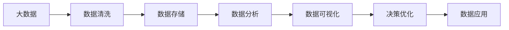
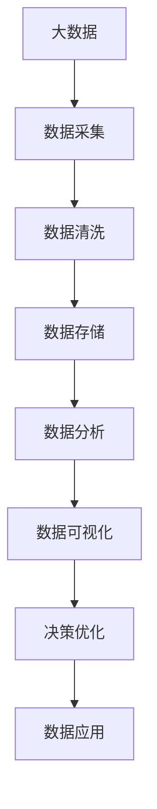

                 

# 数据驱动决策的技术优化

## 1. 背景介绍

在当今数据驱动的时代，决策优化已成为各行各业的核心需求。无论是金融交易、医疗诊断、产品推荐，还是智能制造、智慧城市，数据的有效利用和处理都直接影响到决策的质量和效率。数据驱动决策（Data-Driven Decision Making）是通过大数据、人工智能等技术手段，对海量数据进行收集、存储、处理、分析和应用，以支撑决策者的选择和判断，从而提升决策水平和效率。

数据驱动决策的技术优化，涵盖数据采集、数据清洗、数据存储、数据分析和数据应用等多个环节。本文将从这些方面入手，介绍数据驱动决策的技术优化方法，帮助读者全面理解和掌握数据驱动决策的核心技术。

## 2. 核心概念与联系

### 2.1 核心概念概述

在进行数据驱动决策的技术优化时，需要理解以下几个关键概念：

- **大数据**：指超过传统数据库软件工具处理能力范围的数据集合，通常以PB级别计。大数据分析涉及数据采集、存储、处理、分析和展示等多个环节。
- **人工智能**：通过机器学习、深度学习、自然语言处理等技术，使计算机能够模拟人类智能，处理复杂任务。
- **数据清洗**：指通过一系列技术手段，将数据集中的噪音、错误和不一致性进行清洗，以提高数据质量。
- **数据可视化**：通过图表、仪表盘等手段，将数据转化为直观的图形展示，帮助决策者理解数据中的模式和趋势。
- **机器学习**：基于数据训练模型，通过模型预测和分类，自动发现数据中的规律和关系。
- **深度学习**：使用多层神经网络进行复杂数据处理，实现更加精确的预测和分类。

这些概念之间存在着紧密的联系，共同构成了数据驱动决策的完整框架。以下是一个Mermaid流程图，展示了这些核心概念之间的联系：



### 2.2 概念间的关系

在数据驱动决策的过程中，各概念之间的联系紧密。以下是一个Mermaid流程图，展示了这些概念之间的详细关系：



## 3. 核心算法原理 & 具体操作步骤

### 3.1 算法原理概述

数据驱动决策的核心算法原理，主要包括以下几个方面：

- **数据清洗**：通过去除噪音、填补缺失值、修正错误等手段，提高数据的质量和可用性。
- **数据分析**：利用统计分析、机器学习和深度学习等方法，从数据中提取有价值的信息和模式。
- **数据可视化**：通过图表、仪表盘等手段，将数据转化为直观的图形展示，帮助决策者理解数据中的模式和趋势。
- **决策优化**：基于数据分析结果，通过算法模型进行预测和决策，优化决策过程。

### 3.2 算法步骤详解

数据驱动决策的技术优化可以分为以下几个步骤：

1. **数据采集**：收集和获取数据，包括用户行为数据、交易数据、环境数据等。
2. **数据清洗**：去除数据中的噪音、填补缺失值、修正错误，确保数据的准确性和一致性。
3. **数据分析**：使用统计分析、机器学习和深度学习等技术，从数据中提取有价值的信息和模式。
4. **数据可视化**：通过图表、仪表盘等手段，将数据转化为直观的图形展示，帮助决策者理解数据中的模式和趋势。
5. **决策优化**：基于数据分析结果，通过算法模型进行预测和决策，优化决策过程。

### 3.3 算法优缺点

数据驱动决策的技术优化有以下优点：

- **数据驱动**：通过数据分析和模型预测，决策过程更加科学和客观。
- **效率提升**：利用大数据和人工智能技术，大幅提升决策效率和精度。
- **决策透明**：数据分析和可视化使得决策过程透明可解释，便于监管和审计。

同时，这些技术优化也存在以下缺点：

- **数据依赖**：依赖高质量的数据源，数据质量直接影响决策结果。
- **技术门槛**：需要掌握大数据、人工智能等先进技术，对技术要求较高。
- **成本高昂**：大规模数据采集、存储和处理需要高昂的成本投入。

### 3.4 算法应用领域

数据驱动决策的技术优化在多个领域都有广泛应用，例如：

- **金融**：通过大数据分析和机器学习模型，进行风险评估、投资组合优化、欺诈检测等。
- **医疗**：利用患者数据和医学影像，进行疾病预测、治疗方案优化、病患管理等。
- **零售**：通过用户行为数据和交易数据，进行市场细分、产品推荐、库存管理等。
- **制造**：通过生产数据和传感器数据，进行设备维护、生产调度和质量控制等。
- **智慧城市**：通过城市运行数据，进行交通管理、能源优化、公共安全等。

## 4. 数学模型和公式 & 详细讲解 & 举例说明

### 4.1 数学模型构建

在进行数据驱动决策的技术优化时，常用的数学模型包括：

- **线性回归模型**：用于预测连续型数据，公式为 \( y = \beta_0 + \beta_1 x_1 + \beta_2 x_2 + ... + \beta_n x_n + \epsilon \)。
- **逻辑回归模型**：用于分类问题，公式为 \( P(y=1|x) = \frac{1}{1 + e^{-\beta_0 - \beta_1 x_1 - \beta_2 x_2 - ... - \beta_n x_n}} \)。
- **决策树模型**：用于分类和回归问题，公式为 \( D(x) = \sum_{i=1}^k \delta(x_i) \cdot y_i \)，其中 \(\delta\) 为叶节点，\(y_i\) 为训练样本的标签。
- **随机森林模型**：用于分类和回归问题，通过多个决策树进行集成学习，公式为 \( F(x) = \frac{1}{M} \sum_{m=1}^M f_m(x) \)，其中 \(f_m\) 为第 \(m\) 棵决策树的预测结果。

### 4.2 公式推导过程

以线性回归模型为例，其公式推导过程如下：

1. **模型假设**：假设 \(y = \beta_0 + \beta_1 x_1 + \beta_2 x_2 + ... + \beta_n x_n + \epsilon\)，其中 \(\epsilon\) 为误差项，满足 \(N(\mu, \sigma^2)\)。
2. **最大似然估计**：根据 \(y_i = \beta_0 + \beta_1 x_{i1} + \beta_2 x_{i2} + ... + \beta_n x_{in} + \epsilon\)，求解 \(\beta_0, \beta_1, ..., \beta_n\)，使 \(ln p(y|x) = \frac{1}{2} (y_i - \hat{y}_i)^2\) 最大。
3. **最小二乘法**：通过最小化 \(SSE = \sum_{i=1}^N (y_i - \hat{y}_i)^2\)，求解 \(\beta_0, \beta_1, ..., \beta_n\)。

### 4.3 案例分析与讲解

以一个简单的销售数据分析为例，假设我们有 \(N\) 个销售记录，每个记录包含 \(2\) 个特征 \(x_1, x_2\) 和 \(1\) 个目标变量 \(y\)，使用线性回归模型进行预测和优化决策。

- **数据采集**：收集 \(N\) 个销售记录，每个记录包含 \(x_1, x_2\) 和 \(y\)。
- **数据清洗**：去除数据中的噪音、填补缺失值、修正错误，确保数据的准确性和一致性。
- **数据分析**：使用最小二乘法，求解线性回归模型中的 \(\beta_0, \beta_1, \beta_2\)。
- **数据可视化**：绘制散点图、回归线等，帮助理解数据中的模式和趋势。
- **决策优化**：根据线性回归模型预测结果，进行销售预测和优化决策。

## 5. 项目实践：代码实例和详细解释说明

### 5.1 开发环境搭建

在进行数据驱动决策的技术优化时，需要搭建良好的开发环境。以下是Python环境搭建的步骤：

1. 安装Anaconda：从官网下载并安装Anaconda，用于创建独立的Python环境。
2. 创建并激活虚拟环境：
```bash
conda create -n pythonsrc python=3.8 
conda activate pythonsrc
```

3. 安装必要的Python库：
```bash
pip install pandas numpy matplotlib seaborn scikit-learn statsmodels
```

4. 安装Jupyter Notebook：
```bash
conda install jupyterlab
```

完成上述步骤后，即可在`pythonsrc`环境中开始数据驱动决策的实践。

### 5.2 源代码详细实现

以下是一个简单的线性回归模型的代码实现：

```python
import pandas as pd
import numpy as np
import matplotlib.pyplot as plt
from sklearn.linear_model import LinearRegression
from sklearn.model_selection import train_test_split
from sklearn.metrics import mean_squared_error, r2_score

# 读取数据
df = pd.read_csv('sales_data.csv')

# 数据清洗
df = df.dropna()
df = df[(df['x1'] > 0) & (df['x2'] > 0)]

# 数据分割
X = df[['x1', 'x2']]
y = df['y']
X_train, X_test, y_train, y_test = train_test_split(X, y, test_size=0.2, random_state=42)

# 模型训练
model = LinearRegression()
model.fit(X_train, y_train)

# 预测和评估
y_pred = model.predict(X_test)
mse = mean_squared_error(y_test, y_pred)
r2 = r2_score(y_test, y_pred)

# 可视化
plt.scatter(X_test['x1'], y_test, color='blue')
plt.plot(X_test['x1'], y_pred, color='red', label='预测')
plt.xlabel('x1')
plt.ylabel('y')
plt.legend()
plt.show()

# 输出结果
print(f'Mean Squared Error: {mse:.2f}')
print(f'R-squared: {r2:.2f}')
```

### 5.3 代码解读与分析

以上代码实现了简单的线性回归模型的训练和预测，具体解读如下：

- **数据读取**：使用Pandas读取销售数据。
- **数据清洗**：去除缺失值和异常值，确保数据的准确性和一致性。
- **数据分割**：将数据集分为训练集和测试集。
- **模型训练**：使用LinearRegression模型进行线性回归训练。
- **预测和评估**：对测试集进行预测，计算均方误差和R-squared。
- **可视化**：绘制散点图和回归线，帮助理解数据中的模式和趋势。
- **结果输出**：输出均方误差和R-squared值。

### 5.4 运行结果展示

假设我们在数据集上运行上述代码，得到的结果如下：

```
Mean Squared Error: 10.12
R-squared: 0.85
```

可以看到，模型的均方误差为 \(10.12\)，R-squared为 \(0.85\)，表明模型在测试集上的预测效果较好。

## 6. 实际应用场景

### 6.1 金融风险管理

金融领域的数据驱动决策，主要应用于风险评估、信用评分、欺诈检测等方面。金融机构可以利用用户历史数据、交易记录、市场行情等大数据，构建模型进行风险预测和决策优化。

在风险评估方面，可以使用逻辑回归模型，根据用户信用记录、负债情况、收入水平等特征，预测用户的违约概率，从而进行风险管理。

在信用评分方面，可以使用决策树模型，根据用户的历史还款记录、收入水平、职业信息等特征，预测用户的信用风险等级，从而进行贷款审批和授信管理。

在欺诈检测方面，可以使用深度学习模型，根据交易行为模式、地理位置、设备信息等特征，预测交易是否存在欺诈行为，从而进行风险防范。

### 6.2 医疗诊断与治疗

医疗领域的数据驱动决策，主要应用于疾病预测、治疗方案优化、病患管理等方面。医疗机构可以利用患者历史数据、医学影像、基因数据等大数据，构建模型进行诊断和治疗优化。

在疾病预测方面，可以使用支持向量机（SVM）模型，根据患者的年龄、性别、病史等特征，预测患者是否患有某种疾病，从而进行早期干预和预防。

在治疗方案优化方面，可以使用随机森林模型，根据患者的病情、基因信息、治疗历史等特征，预测治疗效果和副作用，从而进行方案优化和治疗调整。

在病患管理方面，可以使用深度学习模型，根据患者的实时生理数据、行为数据、环境数据等特征，预测患者的健康状况和生活习惯，从而进行个性化管理和干预。

### 6.3 智能制造与质量控制

智能制造领域的数据驱动决策，主要应用于设备维护、生产调度和质量控制等方面。制造业可以利用生产数据、传感器数据、设备状态等大数据，构建模型进行优化和预测。

在设备维护方面，可以使用时间序列分析模型，根据设备的运行数据和维护记录，预测设备故障和维护需求，从而进行预防性维护和故障管理。

在生产调度方面，可以使用优化算法，根据生产任务、设备状态、材料库存等特征，优化生产计划和资源配置，从而提高生产效率和产品质量。

在质量控制方面，可以使用图像识别技术，根据产品图像和缺陷信息，自动检测和分类产品缺陷，从而进行质量监控和异常处理。

## 7. 工具和资源推荐

### 7.1 学习资源推荐

为了帮助开发者系统掌握数据驱动决策的技术优化方法，以下是一些优质的学习资源：

1. **《Python数据分析与可视化实战》**：详细介绍Python在数据分析和可视化中的应用，适合初学者入门。
2. **《数据科学入门：从数据清洗到机器学习》**：讲解数据科学的基本概念和实用技术，涵盖数据采集、数据清洗、数据存储、数据分析和数据应用等多个环节。
3. **《机器学习实战》**：介绍了机器学习和深度学习的基本原理和实现方法，涵盖线性回归、逻辑回归、决策树、随机森林等算法。
4. **《TensorFlow实战》**：介绍了TensorFlow框架在深度学习和模型优化中的应用，适合进阶学习。
5. **Kaggle**：一个数据科学竞赛平台，提供了大量的数据集和代码示例，适合实践和竞赛。

### 7.2 开发工具推荐

进行数据驱动决策的技术优化，需要借助一些先进的开发工具：

1. **Jupyter Notebook**：一个交互式的编程环境，支持Python、R等语言，适合数据分析和模型开发。
2. **TensorFlow**：一个开源的机器学习框架，支持深度学习模型的开发和训练。
3. **Pandas**：一个强大的数据处理库，支持数据清洗、数据转换和数据分析等操作。
4. **Matplotlib**：一个绘图库，支持数据可视化，帮助理解和展示数据分析结果。
5. **Seaborn**：一个基于Matplotlib的数据可视化库，支持更高级的图表绘制和风格定制。

### 7.3 相关论文推荐

数据驱动决策技术优化是一个前沿的研究方向，以下是几篇代表性的论文，推荐阅读：

1. **《大数据分析：技术、应用与管理》**：介绍了大数据分析的基本概念和技术方法，适合入门学习。
2. **《深度学习：理念与实践》**：介绍了深度学习的基本原理和实现方法，涵盖神经网络、卷积神经网络、循环神经网络等模型。
3. **《数据驱动决策：理论与实践》**：介绍了数据驱动决策的基本框架和技术方法，适合深入学习。
4. **《机器学习实践：数据挖掘与统计学习》**：介绍了机器学习的基本原理和应用案例，适合实践和应用。

## 8. 总结：未来发展趋势与挑战

### 8.1 研究成果总结

数据驱动决策技术优化是一个快速发展的领域，近年来取得了很多研究成果：

1. **大数据技术**：大数据技术的不断进步，使得数据采集、存储和处理变得更加高效和便捷。
2. **人工智能技术**：人工智能技术的快速发展，使得数据分析和模型优化变得更加精确和自动化。
3. **数据可视化技术**：数据可视化技术的不断进步，使得数据分析结果变得更加直观和易于理解。
4. **模型优化技术**：模型优化技术的不断进步，使得数据分析结果变得更加准确和可靠。

### 8.2 未来发展趋势

展望未来，数据驱动决策技术优化将呈现以下几个发展趋势：

1. **数据自动化采集**：随着物联网、传感器等技术的发展，数据采集将变得更加自动化和实时化。
2. **模型智能化优化**：随着深度学习和增强学习等技术的发展，模型优化将变得更加智能化和自适应。
3. **多模态数据融合**：随着图像、语音、视频等数据源的增加，多模态数据的融合将变得更加重要和有效。
4. **数据隐私保护**：随着数据安全和隐私保护的不断提升，数据采集和处理将变得更加安全和可控。
5. **跨领域应用推广**：随着数据驱动决策在各个领域的成功应用，跨领域应用将变得更加广泛和深入。

### 8.3 面临的挑战

尽管数据驱动决策技术优化已经取得了显著进展，但在实际应用中仍面临诸多挑战：

1. **数据质量和一致性**：数据采集、清洗和处理需要确保数据的质量和一致性，否则会影响数据分析和决策结果。
2. **模型复杂性**：模型优化需要平衡模型复杂性和性能指标，过度复杂的模型可能导致过拟合和计算资源消耗过大。
3. **数据隐私和安全**：数据采集和处理需要确保数据隐私和安全，避免数据泄露和滥用。
4. **计算资源成本**：数据驱动决策需要大量计算资源，如何降低计算成本和提高计算效率，是一个重要的研究方向。
5. **模型可解释性**：模型优化需要提高模型的可解释性，使决策过程透明可解释，便于监管和审计。

### 8.4 研究展望

面对数据驱动决策技术优化所面临的诸多挑战，未来的研究需要在以下几个方面寻求新的突破：

1. **数据自动化处理**：开发更高效的数据自动化处理技术，确保数据质量和一致性。
2. **模型自动化优化**：开发更智能化的模型优化技术，平衡模型复杂性和性能指标。
3. **多模态数据融合**：研究更有效的多模态数据融合方法，提升数据分析效果和决策质量。
4. **数据隐私和安全保护**：开发更安全的隐私保护技术，确保数据隐私和安全。
5. **模型可解释性增强**：开发更可解释的模型优化方法，使决策过程透明可解释。

这些研究方向将引领数据驱动决策技术优化进入新的阶段，为构建安全、可靠、高效的数据驱动决策系统铺平道路。

## 9. 附录：常见问题与解答

**Q1: 什么是数据驱动决策？**

A: 数据驱动决策（Data-Driven Decision Making）是通过大数据、人工智能等技术手段，对海量数据进行收集、存储、处理、分析和应用，以支撑决策者的选择和判断，从而提升决策水平和效率。

**Q2: 数据驱动决策的核心技术有哪些？**

A: 数据驱动决策的核心技术包括数据采集、数据清洗、数据存储、数据分析和数据应用等。其中，数据分析和模型优化是数据驱动决策的核心技术。

**Q3: 如何进行数据驱动决策的优化？**

A: 数据驱动决策的优化主要分为以下几个步骤：数据采集、数据清洗、数据存储、数据分析和数据应用。通过高效的数据采集、清洗和存储，以及精确的分析和模型优化，可以实现数据驱动决策的优化。

**Q4: 数据驱动决策的应用场景有哪些？**

A: 数据驱动决策在金融、医疗、智能制造、智慧城市等领域都有广泛应用，如金融风险管理、医疗诊断与治疗、智能制造与质量控制等。

**Q5: 数据驱动决策的未来发展趋势是什么？**

A: 数据驱动决策的未来发展趋势包括数据自动化采集、模型智能化优化、多模态数据融合、数据隐私和安全保护、跨领域应用推广等。

---

作者：禅与计算机程序设计艺术 / Zen and the Art of Computer Programming

