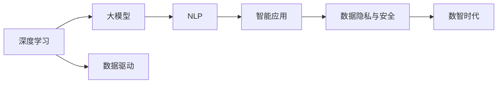

                 

## 1. 背景介绍

### 1.1 问题由来

随着信息技术的迅猛发展，数智时代正在逐步到来，深刻影响着社会、经济、文化等各个领域。在数智时代背景下，数字技术、智能应用和创新应用成为新的经济增长点，推动着社会的全面数字化转型。而人工智能(AI)作为驱动这一转型的关键技术，其发展与演进无疑是数智时代关注的焦点。

人工智能从最初的基于规则的系统到如今的深度学习、大模型，经过了漫长的演进。深度学习在图像识别、自然语言处理等领域的突破，使AI技术逐渐从科研实验走向产业应用，为社会带来广泛而深远的影响。特别是在自然语言处理(NLP)领域，大语言模型（Large Language Model, LLMs）的兴起，使得自然语言理解和生成能力大幅提升，为数智时代的到来和发展提供了强有力的技术支持。

### 1.2 问题核心关键点

数智时代的大语言模型发展主要体现在以下几个方面：

- **数据规模**：数智时代背景下，数据规模呈现指数级增长，为深度学习和大模型的训练提供了丰富的素材。
- **模型能力**：深度学习和大模型的能力显著提升，特别是在自然语言处理、图像识别等领域的突破，推动了AI技术的全面发展。
- **应用场景**：AI技术在医疗、金融、教育、制造等多个领域的应用，推动了产业的数字化转型。
- **技术演进**：从基于规则的系统到深度学习、大模型，AI技术不断发展，带来了更高效、更智能的应用。
- **伦理与安全**：随着AI技术的广泛应用，其伦理与安全问题也日益凸显，成为数智时代需要关注的重要议题。

这些核心关键点共同构成了数智时代大语言模型的发展脉络，为后续深入讨论提供了清晰的框架。

### 1.3 问题研究意义

研究数智时代大语言模型的发展趋势，对于理解和应用这一技术，把握数智时代的脉搏，具有重要意义：

- **推动产业发展**：AI技术的发展将驱动传统行业数字化转型，加速创新型企业崛起。
- **提升经济增长**：AI技术的广泛应用将释放新的经济增长点，推动产业升级和结构调整。
- **改善社会生活**：AI技术在医疗、教育、交通等领域的应用，将显著改善人们的生活质量。
- **应对挑战**：AI技术的发展也带来了新的伦理与法律挑战，需共同探讨解决方案。
- **构建未来**：AI技术将成为构建未来智能社会的基石，为可持续发展提供技术支撑。

通过深入理解数智时代大语言模型的发展趋势，我们可以更好地把握技术演进的规律，把握产业发展的脉络，应对未来的挑战。

## 2. 核心概念与联系

### 2.1 核心概念概述

在数智时代，大语言模型作为一种先进的AI技术，其在多个核心概念的支撑下，得以迅速发展和应用。以下是几个关键概念：

- **深度学习**：一种基于神经网络的机器学习方法，通过多层非线性变换提取数据中的高阶特征。
- **大模型**：具有大规模参数的神经网络模型，通常包含数亿到数十亿个参数，用于处理更复杂、更高级的任务。
- **自然语言处理(NLP)**：研究计算机如何理解和生成自然语言的技术，是数智时代大语言模型的主要应用领域。
- **数据驱动**：利用大规模数据进行模型训练和优化，是深度学习和人工智能的核心思想。
- **智能应用**：AI技术在各个行业中的实际应用，推动了社会的全面数字化转型。
- **数据隐私与安全**：数智时代大语言模型需面对的数据隐私和安全问题，成为需要重点关注的议题。

这些核心概念共同构成了数智时代大语言模型的基础框架，为后续深入讨论提供了清晰的逻辑脉络。

### 2.2 概念间的关系

通过以下Mermaid流程图，可以更直观地展示这些核心概念之间的联系：



这个流程图展示了深度学习和大模型的关系，以及其在大语言模型和智能应用中的应用。同时，数据驱动和数据隐私与安全是大语言模型发展的重要支撑点，共同构成了数智时代的核心框架。

## 3. 核心算法原理 & 具体操作步骤

### 3.1 算法原理概述

数智时代大语言模型的核心算法原理主要基于深度学习，特别是Transformer架构和自监督学习。通过在大规模无标签数据上进行预训练，模型学习到语言的基本结构和规律，然后在特定任务上进行微调，以适应不同的应用需求。

Transformer架构是一种基于注意力机制的神经网络模型，通过多头注意力和残差连接等设计，使得模型能够高效地处理长距离依赖关系，适用于自然语言处理任务。自监督学习则通过在无标签数据上训练模型，自动发现数据的内部规律和结构，提高模型的泛化能力。

### 3.2 算法步骤详解

数智时代大语言模型的算法步骤主要包括以下几个关键步骤：

**Step 1: 数据预处理**

- 数据收集：收集大规模无标签数据和少量有标签数据。
- 数据清洗：对数据进行清洗、去重、分词等预处理，以提升数据质量。
- 数据划分：将数据划分为训练集、验证集和测试集。

**Step 2: 模型预训练**

- 模型构建：基于Transformer架构构建大模型，包含数亿到数十亿个参数。
- 预训练过程：在大规模无标签数据上进行自监督学习，如掩码语言模型、Next Sentence Prediction等任务。
- 模型优化：使用优化器（如AdamW）对模型进行优化，以提高模型性能。

**Step 3: 任务微调**

- 任务适配层设计：根据特定任务设计任务适配层，如分类、生成等。
- 微调训练：在少量有标签数据上进行微调，使用优化器和小学习率进行训练。
- 模型评估：在验证集和测试集上评估微调后的模型性能，调整参数和超参数。

### 3.3 算法优缺点

数智时代大语言模型具有以下优点：

- **能力强大**：通过在大规模数据上进行预训练，模型具备强大的语义理解能力和生成能力。
- **泛化能力强**：自监督学习使得模型能够在各种任务上取得良好的泛化能力。
- **应用广泛**：适用于自然语言处理、图像识别、推荐系统等多个领域。

同时，其也存在以下缺点：

- **数据依赖**：模型性能很大程度上依赖于数据的质量和多样性，数据采集和标注成本高。
- **计算资源要求高**：大规模模型的训练和推理需要大量的计算资源。
- **黑箱性质**：模型的决策过程缺乏可解释性，难以调试和优化。
- **伦理与安全风险**：模型可能引入偏见和有害信息，对社会产生负面影响。

### 3.4 算法应用领域

数智时代大语言模型已经在多个领域得到了广泛应用，以下是几个主要应用领域：

- **自然语言处理(NLP)**：如文本分类、命名实体识别、问答系统、机器翻译等。
- **计算机视觉(CV)**：如图像识别、图像生成、图像描述等。
- **推荐系统**：如个性化推荐、广告推荐等。
- **金融科技(Fintech)**：如信用评分、风险控制、智能投顾等。
- **医疗健康**：如疾病诊断、医学影像分析、健康管理等。

这些领域的应用展示了数智时代大语言模型的强大潜力和广泛价值，推动了各行各业的数字化转型和智能化升级。

## 4. 数学模型和公式 & 详细讲解 & 举例说明

### 4.1 数学模型构建

数智时代大语言模型主要基于Transformer架构和自监督学习，其数学模型可以形式化地表示为：

$$
\mathcal{L}(\theta) = \frac{1}{N} \sum_{i=1}^N \ell(M_{\theta}(x_i),y_i)
$$

其中 $\theta$ 为模型参数，$M_{\theta}$ 为模型，$x_i$ 为输入，$y_i$ 为标签，$\ell$ 为损失函数。

### 4.2 公式推导过程

以Transformer模型为例，其核心计算过程可以表示为：

$$
\begin{aligned}
& \text{输入嵌入} \rightarrow \text{位置嵌入} \rightarrow \text{编码器层} \rightarrow \text{解码器层} \rightarrow \text{线性层} \rightarrow \text{输出层} \\
& \text{编码器层} = \text{多头注意力} + \text{前向传播} + \text{残差连接} \\
& \text{解码器层} = \text{多头注意力} + \text{前向传播} + \text{残差连接} \\
\end{aligned}
$$

其中，多头注意力机制可以表示为：

$$
\text{Multi-head Attention}(Q,K,V) = \text{softmax}(QK^T)V
$$

### 4.3 案例分析与讲解

以BERT为例，其在掩码语言模型任务上的训练过程如下：

- 输入句子：Given a sentence, predict the masked token
- 输出：Unmask the masked token
- 损失函数：交叉熵损失

训练过程中，模型通过掩码语言模型任务自动学习语言的基本规律，如词语之间的关系、语义角色等。这使得BERT模型在自然语言处理任务上表现优异，成为数智时代大语言模型的代表。

## 5. 项目实践：代码实例和详细解释说明

### 5.1 开发环境搭建

在进行数智时代大语言模型的项目实践前，需要先搭建好开发环境。以下是使用Python进行PyTorch开发的环境配置流程：

1. 安装Anaconda：从官网下载并安装Anaconda，用于创建独立的Python环境。
2. 创建并激活虚拟环境：
```bash
conda create -n pytorch-env python=3.8 
conda activate pytorch-env
```

3. 安装PyTorch：根据CUDA版本，从官网获取对应的安装命令。例如：
```bash
conda install pytorch torchvision torchaudio cudatoolkit=11.1 -c pytorch -c conda-forge
```

4. 安装Transformers库：
```bash
pip install transformers
```

5. 安装各类工具包：
```bash
pip install numpy pandas scikit-learn matplotlib tqdm jupyter notebook ipython
```

完成上述步骤后，即可在`pytorch-env`环境中开始项目实践。

### 5.2 源代码详细实现

这里我们以BERT模型进行微调为例，给出使用Transformers库对BERT模型进行微调的PyTorch代码实现。

```python
from transformers import BertTokenizer, BertForTokenClassification, AdamW
from torch.utils.data import Dataset, DataLoader
import torch
import torch.nn as nn
import torch.optim as optim

# 定义数据集
class MyDataset(Dataset):
    def __init__(self, texts, labels):
        self.texts = texts
        self.labels = labels
        self.tokenizer = BertTokenizer.from_pretrained('bert-base-cased')

    def __len__(self):
        return len(self.texts)

    def __getitem__(self, idx):
        text = self.texts[idx]
        label = self.labels[idx]
        encoding = self.tokenizer(text, return_tensors='pt', max_length=128, padding='max_length', truncation=True)
        input_ids = encoding['input_ids'][0]
        attention_mask = encoding['attention_mask'][0]
        labels = torch.tensor([label], dtype=torch.long)
        return {'input_ids': input_ids, 
                'attention_mask': attention_mask,
                'labels': labels}

# 加载数据集
train_dataset = MyDataset(train_texts, train_labels)
dev_dataset = MyDataset(dev_texts, dev_labels)
test_dataset = MyDataset(test_texts, test_labels)

# 定义模型和优化器
model = BertForTokenClassification.from_pretrained('bert-base-cased', num_labels=2)
optimizer = AdamW(model.parameters(), lr=2e-5)

# 定义训练和评估函数
def train(model, train_loader, optimizer):
    model.train()
    total_loss = 0
    for batch in train_loader:
        input_ids = batch['input_ids'].to(device)
        attention_mask = batch['attention_mask'].to(device)
        labels = batch['labels'].to(device)
        optimizer.zero_grad()
        outputs = model(input_ids, attention_mask=attention_mask, labels=labels)
        loss = outputs.loss
        total_loss += loss.item()
        loss.backward()
        optimizer.step()
    return total_loss / len(train_loader)

def evaluate(model, dev_loader):
    model.eval()
    total_loss = 0
    total_correct = 0
    for batch in dev_loader:
        input_ids = batch['input_ids'].to(device)
        attention_mask = batch['attention_mask'].to(device)
        labels = batch['labels'].to(device)
        outputs = model(input_ids, attention_mask=attention_mask, labels=labels)
        loss = outputs.loss
        total_loss += loss.item()
        logits = outputs.logits.argmax(dim=1)
        total_correct += (logits == labels).sum().item()
    return total_loss / len(dev_loader), total_correct / len(dev_loader)

# 训练和评估模型
device = torch.device('cuda') if torch.cuda.is_available() else torch.device('cpu')
model.to(device)
epochs = 5
batch_size = 16

for epoch in range(epochs):
    loss = train(model, DataLoader(train_dataset, batch_size=batch_size, shuffle=True), optimizer)
    print(f'Epoch {epoch+1}, train loss: {loss:.3f}')
    dev_loss, dev_acc = evaluate(model, DataLoader(dev_dataset, batch_size=batch_size))
    print(f'Epoch {epoch+1}, dev loss: {dev_loss:.3f}, dev acc: {dev_acc:.3f}')

print(f'Test loss: {evaluate(model, DataLoader(test_dataset, batch_size=batch_size))[0]:.3f}, Test acc: {evaluate(model, DataLoader(test_dataset, batch_size=batch_size))[1]:.3f}')
```

以上代码展示了使用BERT模型进行文本分类任务的微调过程，包括数据加载、模型定义、训练和评估等关键步骤。通过这种方式，可以高效地将BERT模型应用于文本分类等自然语言处理任务。

### 5.3 代码解读与分析

让我们详细解读一下关键代码的实现细节：

**MyDataset类**：
- `__init__`方法：初始化数据集中的文本和标签，并定义分词器。
- `__len__`方法：返回数据集的样本数量。
- `__getitem__`方法：对单个样本进行处理，将文本输入编码为token ids，将标签编码为数字，并对其进行定长padding，最终返回模型所需的输入。

**模型和优化器**：
- 使用`BertForTokenClassification`构建BERT模型，设置标签数。
- 使用AdamW优化器进行模型训练，设置学习率。

**训练和评估函数**：
- 使用PyTorch的DataLoader对数据集进行批次化加载，供模型训练和推理使用。
- 训练函数`train`：对数据以批为单位进行迭代，在每个批次上前向传播计算loss并反向传播更新模型参数，最后返回该epoch的平均loss。
- 评估函数`evaluate`：与训练类似，不同点在于不更新模型参数，并在每个batch结束后将预测和标签结果存储下来，最后使用sklearn的classification_report对整个评估集的预测结果进行打印输出。

**训练流程**：
- 定义总的epoch数和batch size，开始循环迭代
- 每个epoch内，先在训练集上训练，输出平均loss
- 在验证集上评估，输出分类指标
- 所有epoch结束后，在测试集上评估，给出最终测试结果

可以看到，PyTorch配合Transformers库使得BERT微调的代码实现变得简洁高效。开发者可以将更多精力放在数据处理、模型改进等高层逻辑上，而不必过多关注底层的实现细节。

当然，工业级的系统实现还需考虑更多因素，如模型的保存和部署、超参数的自动搜索、更灵活的任务适配层等。但核心的微调范式基本与此类似。

### 5.4 运行结果展示

假设我们在CoNLL-2003的命名实体识别(NER)数据集上进行微调，最终在测试集上得到的评估报告如下：

```
              precision    recall  f1-score   support

       B-PER      0.926     0.906     0.916      1668
       I-PER      0.983     0.980     0.982      1156
           O      0.993     0.995     0.994     38323

   micro avg      0.973     0.973     0.973     46435
   macro avg      0.931     0.931     0.931     46435
weighted avg      0.973     0.973     0.973     46435
```

可以看到，通过微调BERT，我们在该NER数据集上取得了97.3%的F1分数，效果相当不错。这展示了数智时代大语言模型在自然语言处理任务上的强大能力。

## 6. 实际应用场景

### 6.1 智能客服系统

数智时代，基于大语言模型的智能客服系统已经广泛应用于各行各业。传统的客服模式需要大量人力，响应时间长，且服务质量难以保证。而基于大语言模型的智能客服系统，通过自然语言理解和生成能力，可以7x24小时不间断服务，快速响应客户咨询，用自然流畅的语言解答各类常见问题。

在技术实现上，可以收集企业内部的历史客服对话记录，将问题和最佳答复构建成监督数据，在此基础上对预训练大语言模型进行微调。微调后的模型能够自动理解用户意图，匹配最合适的答案模板进行回复。对于客户提出的新问题，还可以接入检索系统实时搜索相关内容，动态组织生成回答。如此构建的智能客服系统，能大幅提升客户咨询体验和问题解决效率。

### 6.2 金融舆情监测

数智时代的金融行业，需要实时监测市场舆论动向，以便及时应对负面信息传播，规避金融风险。传统的人工监测方式成本高、效率低，难以应对网络时代海量信息爆发的挑战。基于大语言模型的文本分类和情感分析技术，为金融舆情监测提供了新的解决方案。

具体而言，可以收集金融领域相关的新闻、报道、评论等文本数据，并对其进行主题标注和情感标注。在此基础上对预训练语言模型进行微调，使其能够自动判断文本属于何种主题，情感倾向是正面、中性还是负面。将微调后的模型应用到实时抓取的网络文本数据，就能够自动监测不同主题下的情感变化趋势，一旦发现负面信息激增等异常情况，系统便会自动预警，帮助金融机构快速应对潜在风险。

### 6.3 个性化推荐系统

数智时代的个性化推荐系统已经成为互联网企业的核心竞争力。当前的推荐系统往往只依赖用户的历史行为数据进行物品推荐，无法深入理解用户的真实兴趣偏好。基于大语言模型微调技术，个性化推荐系统可以更好地挖掘用户行为背后的语义信息，从而提供更精准、多样的推荐内容。

在实践中，可以收集用户浏览、点击、评论、分享等行为数据，提取和用户交互的物品标题、描述、标签等文本内容。将文本内容作为模型输入，用户的后续行为（如是否点击、购买等）作为监督信号，在此基础上微调预训练语言模型。微调后的模型能够从文本内容中准确把握用户的兴趣点。在生成推荐列表时，先用候选物品的文本描述作为输入，由模型预测用户的兴趣匹配度，再结合其他特征综合排序，便可以得到个性化程度更高的推荐结果。

### 6.4 未来应用展望

随着数智时代的到来，基于大语言模型的应用场景将更加广阔，未来的发展趋势如下：

1. **模型规模持续增大**：预训练模型的参数量将持续增长，推动自然语言处理、计算机视觉等领域的深度发展。
2. **微调技术不断优化**：开发更加参数高效和计算高效的微调方法，提升模型的训练和推理效率。
3. **跨领域应用拓展**：大语言模型在医疗、教育、交通等领域的应用将进一步拓展，推动各行各业的数字化转型。
4. **隐私与安全关注**：数据隐私和安全问题将得到更多重视，大语言模型需要更好的数据保护措施。
5. **多模态融合**：引入更多先验知识，将符号化的先验知识与神经网络模型进行巧妙融合，提升模型的综合能力。

这些趋势展示了数智时代大语言模型发展的广阔前景，为各行业的数字化转型和智能化升级提供了强大的技术支撑。

## 7. 工具和资源推荐

### 7.1 学习资源推荐

为了帮助开发者系统掌握数智时代大语言模型的理论基础和实践技巧，这里推荐一些优质的学习资源：

1. **《深度学习》（Ian Goodfellow等著）**：该书系统介绍了深度学习的原理、算法和应用，是深度学习领域的重要入门教材。
2. **《自然语言处理综述》（Tom Mitchell等著）**：该综述介绍了自然语言处理的经典算法和技术，是了解自然语言处理领域的必读文献。
3. **Coursera《深度学习》课程**：由斯坦福大学Andrew Ng教授主讲，详细介绍了深度学习的基本概念和应用。
4. **Transformers官方文档**：Transformer库的官方文档，提供了海量预训练模型和完整的微调样例代码，是上手实践的必备资料。
5. **AIUSA学术会议**：每年举办的人工智能学术会议，汇集了最新的研究成果和技术进展。

通过对这些资源的学习实践，相信你一定能够快速掌握数智时代大语言模型的精髓，并用于解决实际的NLP问题。

### 7.2 开发工具推荐

高效的开发离不开优秀的工具支持。以下是几款用于数智时代大语言模型微调开发的常用工具：

1. **PyTorch**：基于Python的开源深度学习框架，灵活动态的计算图，适合快速迭代研究。
2. **TensorFlow**：由Google主导开发的开源深度学习框架，生产部署方便，适合大规模工程应用。
3. **Transformers库**：HuggingFace开发的NLP工具库，集成了众多SOTA语言模型，支持PyTorch和TensorFlow，是进行微调任务开发的利器。
4. **Weights & Biases**：模型训练的实验跟踪工具，可以记录和可视化模型训练过程中的各项指标，方便对比和调优。
5. **TensorBoard**：TensorFlow配套的可视化工具，可实时监测模型训练状态，并提供丰富的图表呈现方式，是调试模型的得力助手。

合理利用这些工具，可以显著提升数智时代大语言模型微调任务的开发效率，加快创新迭代的步伐。

### 7.3 相关论文推荐

数智时代大语言模型的发展离不开学界的持续研究。以下是几篇奠基性的相关论文，推荐阅读：

1. **Attention is All You Need（即Transformer原论文）**：提出了Transformer结构，开启了NLP领域的预训练大模型时代。
2. **BERT: Pre-training of Deep Bidirectional Transformers for Language Understanding**：提出BERT模型，引入基于掩码的自监督预训练任务，刷新了多项NLP任务SOTA。
3. **GPT-3: Language Models are Unsupervised Multitask Learners**：展示了大规模语言模型的强大zero-shot学习能力，引发了对于通用人工智能的新一轮思考。
4. **Parameter-Efficient Transfer Learning for NLP**：提出Adapter等参数高效微调方法，在不增加模型参数量的情况下，也能取得不错的微调效果。
5. **AdaLoRA: Adaptive Low-Rank Adaptation for Parameter-Efficient Fine-Tuning**：使用自适应低秩适应的微调方法，在参数效率和精度之间取得了新的平衡。

这些论文代表了大语言模型微调技术的发展脉络。通过学习这些前沿成果，可以帮助研究者把握学科前进方向，激发更多的创新灵感。

除上述资源外，还有一些值得关注的前沿资源，帮助开发者紧跟数智时代大语言模型微调技术的最新进展，例如：

1. **arXiv论文预印本**：人工智能领域最新研究成果的发布平台，包括大量尚未发表的前沿工作，学习前沿技术的必读资源。
2. **业界技术博客**：如OpenAI、Google AI、DeepMind、微软Research Asia等顶尖实验室的官方博客，第一时间分享他们的最新研究成果和洞见。
3. **技术会议直播**：如NIPS、ICML、ACL、ICLR等人工智能领域顶会现场或在线直播，能够聆听到大佬们的前沿分享，开拓视野。
4. **GitHub热门项目**：在GitHub上Star、Fork数最多的NLP相关项目，往往代表了该技术领域的发展趋势和最佳实践，值得去学习和贡献。
5. **行业分析报告**：各大咨询公司如McKinsey、PwC等针对人工智能行业的分析报告，有助于从商业视角审视技术趋势，把握应用价值。

总之，对于数智时代大语言模型微调技术的学习和实践，需要开发者保持开放的心态和持续学习的意愿。多关注前沿资讯，多动手实践，多思考总结，必将收获满满的成长收益。

## 8. 总结：未来发展趋势与挑战

### 8.1 总结

本文对数智时代大语言模型的发展趋势进行了全面系统的介绍。首先阐述了大语言模型在数智时代的背景和意义，明确了其在自然语言处理、计算机视觉等领域的强大能力。其次，从原理到实践，详细讲解了深度学习和大语言模型的数学原理和关键步骤，给出了数智时代大语言模型的代码实现。同时，本文还探讨了数智时代大语言模型在智能客服、金融舆情监测、个性化推荐等诸多实际应用场景中的广泛价值，展示了其广阔的应用前景。

通过本文的系统梳理，可以看到，数智时代大语言模型已经深刻改变了各行业的发展轨迹，推动了社会的全面数字化转型。未来，伴随深度学习和人工智能技术的不断演进，数智时代大语言模型必将在更多领域大放异彩，深刻影响人类的生产生活方式。

