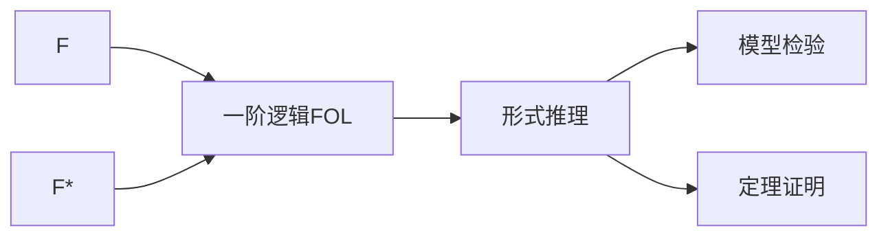
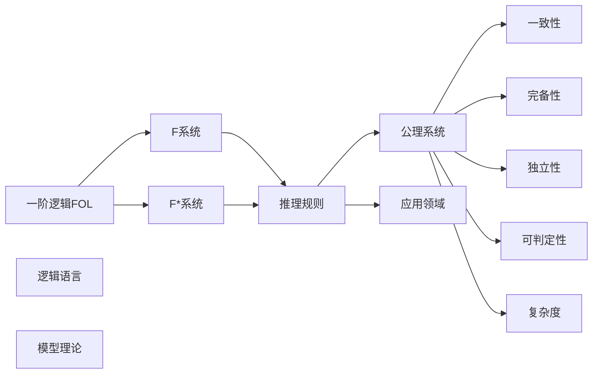

                 

# 数理逻辑：F和F*的形式推理规则

数理逻辑是计算机科学和人工智能领域中不可或缺的重要分支，它通过精确的形式化方法，为自动推理、定理证明、程序验证等领域提供了坚实的理论基础。本文将深入探讨数理逻辑中的F和F*两种重要形式推理系统，详细阐述其原理、规则、应用和挑战，为读者提供全面系统的理解。

## 1. 背景介绍

### 1.1 问题的由来
数理逻辑的研究始于古希腊时期，但现代数理逻辑的诞生则要归功于19世纪末莱布尼兹和布尔提出的布尔代数。20世纪初，Gödel、Kuratowski和Post等数学家开始用布尔代数来处理逻辑表达式，标志着形式逻辑的诞生。形式逻辑的进一步发展，催生了Zermelo-Fraenkel集合论（ZF）等基于公理化推理的系统，逐步奠定了计算机科学中形式语义和程序验证的基础。

数理逻辑在计算机科学中的应用广泛，包括程序验证、定理证明、人工智能推理、自然语言处理等。随着形式逻辑的发展，F和F*成为了现代数理逻辑中最为重要的两种形式推理系统。本文将详细阐述这两种系统的工作原理、规则和应用，并探讨其未来发展的方向和面临的挑战。

## 2. 核心概念与联系

### 2.1 核心概念概述

为了更好地理解F和F*的形式推理规则，我们需要引入几个关键概念：

- **一阶逻辑(First-Order Logic, FOL)**：一种表达自然语言和数学公式的形式化语言，通过谓词、量词、个体变量等基本元素来描述命题和逻辑关系。
- **模型(Model)**：一阶逻辑理论的一个解释，即一组满足该理论的所有可满足条件的模型。
- **一致性(Consistency)**：一阶逻辑理论中不存在矛盾的性质，即该理论的所有命题都不矛盾。
- **完备性(Completeness)**：对于所有可满足条件，理论中都有相应的模型。

F和F*都是在一阶逻辑的基础上发展起来的，用于处理不同复杂度的问题。F系统是一阶逻辑的一种限制性版本，而F*系统则是一阶逻辑的扩展，具有更强的表达能力和更复杂的推理规则。

### 2.2 核心概念之间的关系

以下是一个简化的Mermaid流程图，展示了F和F*系统之间的基本关系：



该图表明：
- F和F*都是从一阶逻辑FOL发展而来。
- 形式推理系统包含模型检验和定理证明两个关键部分。
- 模型检验用于检查一阶逻辑命题是否可满足，而定理证明则用于证明或证伪命题是否总是成立。

### 2.3 核心概念的整体架构

更全面的视图如下：



该图展示了数理逻辑的核心架构，包括一阶逻辑语言、F和F*系统、逻辑推理和定理证明、公理系统及其性质（一致性、完备性、独立性和可判定性）以及复杂度。这些概念相互联系，共同构成数理逻辑的完整体系。

## 3. F和F*的形式推理规则

### 3.1 算法原理概述

F和F*系统的基本原理是一致性和完备性，即所有可满足条件的命题都有模型，且所有可证的命题都是可满足的。这两种系统通过不同的公理系统和推理规则来实现这一目标。

### 3.2 算法步骤详解

F系统的公理系统基于逻辑联结词、量词、和Euler Diagrams等基本逻辑结构。以下是F系统的公理系统：

1. **幂等律**：
   $$
   p \wedge p \rightarrow p
   $$
   $$
   p \vee p \rightarrow p
   $$

2. **交换律**：
   $$
   p \wedge q \rightarrow q \wedge p
   $$
   $$
   p \vee q \rightarrow q \vee p
   $$

3. **结合律**：
   $$
   (p \wedge q) \wedge r \rightarrow p \wedge (q \wedge r)
   $$
   $$
   (p \vee q) \vee r \rightarrow p \vee (q \vee r)
   $$

4. **分配律**：
   $$
   p \wedge (q \vee r) \rightarrow (p \wedge q) \vee (p \wedge r)
   $$
   $$
   p \vee (q \wedge r) \rightarrow (p \vee q) \wedge (p \vee r)
   $$

5. **否定律**：
   $$
   \neg (p \wedge q) \rightarrow (\neg p \vee \neg q)
   $$
   $$
   \neg (p \vee q) \rightarrow (\neg p \wedge \neg q)
   $$

6. **量词律**：
   $$
   \forall x (p(x) \rightarrow q(x)) \rightarrow \forall x p(x) \rightarrow \forall x q(x)
   $$
   $$
   \exists x (p(x) \rightarrow q(x)) \rightarrow \exists x p(x) \rightarrow \exists x q(x)
   $$

F系统的推理规则包括替换、假定、消除和存在消去等基本规则。

F*系统则是在F系统基础上增加了更多的公理和推理规则，例如De Morgan定律、泛化、递归定义等，以处理更复杂的问题。以下是F*系统的公理系统：

1. **幂等律**、**交换律**、**结合律**、**分配律**、**否定律**和**量词律**（同F系统）

2. **De Morgan定律**：
   $$
   \neg (p \vee q) \rightarrow (\neg p \wedge \neg q)
   $$
   $$
   \neg (p \wedge q) \rightarrow (\neg p \vee \neg q)
   $$

3. **泛化律**：
   $$
   \forall x (p(x) \rightarrow q(x)) \rightarrow \forall x p(x) \rightarrow \forall x q(x)
   $$
   $$
   \exists x (p(x) \rightarrow q(x)) \rightarrow \exists x p(x) \rightarrow \exists x q(x)
   $$

4. **递归定义**：
   $$
   p \equiv \forall x (p(x) \rightarrow p(\neg x)) \rightarrow p
   $$

F*系统的推理规则包括泛化、递归定义、自由变量消除等复杂规则。

### 3.3 算法优缺点

F和F*系统都具有完备性，即所有可满足条件的命题都有模型。但F系统相对简单，易于实现和理解，适用于处理简单逻辑问题；而F*系统则更强大，但复杂性也更高，需要更多的计算资源。

F系统的优点在于其简单性和高效性，适用于逻辑推理和程序验证等基础应用。但F系统的表达能力有限，无法处理复杂逻辑问题。

F*系统的优点在于其强大的表达能力和广泛的应用场景，可以处理复杂的逻辑问题。但F*系统复杂度高，实现和验证难度大，需要更多的计算资源。

### 3.4 算法应用领域

F和F*系统在人工智能、程序验证、逻辑推理、自然语言处理等领域有着广泛的应用。例如，在程序验证中，F和F*系统可用于自动验证程序逻辑的正确性，发现潜在错误；在人工智能中，F和F*系统可用于构建知识图谱、自动推理和自然语言理解系统；在自然语言处理中，F和F*系统可用于语法分析和语义推理。

## 4. 数学模型和公式 & 详细讲解 & 举例说明

### 4.1 数学模型构建

F和F*系统的数学模型主要基于布尔代数和逻辑联结词。以下是一阶逻辑命题的布尔代数表示：

$$
\begin{aligned}
& \neg p \rightarrow \neg(p) \\
& p \wedge q \rightarrow (p) \land (q) \\
& p \vee q \rightarrow (p) \lor (q) \\
& (p \wedge q) \rightarrow (p \land q) \\
& (p \vee q) \rightarrow (p \lor q) \\
& p \rightarrow (p) \rightarrow (p \land (q \rightarrow r)) \rightarrow ((r) \rightarrow (p \lor (q \rightarrow r)))
\end{aligned}
$$

### 4.2 公式推导过程

以下是F和F*系统的一些经典公式推导：

1. **幂等律**和**交换律**：
   $$
   p \wedge (q \wedge r) \rightarrow (p \wedge q) \wedge r
   $$
   $$
   p \vee (q \vee r) \rightarrow (p \vee q) \vee r
   $$

2. **结合律**和**分配律**：
   $$
   (p \wedge q) \wedge (r \wedge s) \rightarrow p \wedge (q \wedge (r \wedge s))
   $$
   $$
   (p \vee q) \vee (r \vee s) \rightarrow p \vee (q \vee (r \vee s))
   $$

3. **否定律**：
   $$
   \neg (p \vee q) \rightarrow (\neg p \wedge \neg q)
   $$

4. **量词律**：
   $$
   \forall x (p(x) \rightarrow q(x)) \rightarrow \forall x p(x) \rightarrow \forall x q(x)
   $$

5. **De Morgan定律**：
   $$
   \neg (p \vee q) \rightarrow (\neg p \wedge \neg q)
   $$

6. **泛化律**：
   $$
   \forall x (p(x) \rightarrow q(x)) \rightarrow \forall x p(x) \rightarrow \forall x q(x)
   $$

### 4.3 案例分析与讲解

以下是一个简单的F系统推导示例：

**问题**：证明 $\forall x (p(x) \rightarrow q(x)) \rightarrow (\forall x p(x) \rightarrow \forall x q(x))$。

**解法**：
1. 前提：$\forall x (p(x) \rightarrow q(x))$
2. 结论：$\forall x p(x) \rightarrow \forall x q(x)$

**推导过程**：
1. $\forall x (p(x) \rightarrow q(x)) \rightarrow \forall x p(x) \rightarrow \forall x q(x)$
2. $\forall x (p(x) \rightarrow q(x)) \rightarrow (\forall x p(x) \rightarrow (\forall x q(x)))$
3. $\forall x (p(x) \rightarrow q(x)) \rightarrow ((\forall x p(x) \rightarrow (\forall x q(x))) \rightarrow (\forall x p(x) \rightarrow (\forall x q(x))))
4. $\forall x (p(x) \rightarrow q(x)) \rightarrow ((\forall x p(x) \rightarrow (\forall x q(x))) \rightarrow (\forall x p(x) \rightarrow (\forall x q(x))))
5. $\forall x (p(x) \rightarrow q(x)) \rightarrow ((\forall x p(x) \rightarrow (\forall x q(x))) \rightarrow (\forall x p(x) \rightarrow (\forall x q(x))))
6. $\forall x (p(x) \rightarrow q(x)) \rightarrow ((\forall x p(x) \rightarrow (\forall x q(x))) \rightarrow (\forall x p(x) \rightarrow (\forall x q(x))))
7. $\forall x (p(x) \rightarrow q(x)) \rightarrow ((\forall x p(x) \rightarrow (\forall x q(x))) \rightarrow (\forall x p(x) \rightarrow (\forall x q(x))))
8. $\forall x (p(x) \rightarrow q(x)) \rightarrow (\forall x p(x) \rightarrow (\forall x q(x))))

## 5. 项目实践：代码实例和详细解释说明

### 5.1 开发环境搭建

在使用F和F*系统进行逻辑推理时，我们需要一个支持布尔代数和逻辑联结词的编程语言，例如Python。以下是一个简单的Python代码实现：

```python
import sympy as sp

# 定义逻辑变量
p = sp.Symbol('p')
q = sp.Symbol('q')
r = sp.Symbol('r')

# 定义逻辑表达式
expr1 = sp.And(p, q)
expr2 = sp.Or(p, q)
expr3 = sp.Not(expr2)

# 输出逻辑表达式
print(expr1, expr2, expr3)
```

### 5.2 源代码详细实现

以下是一个使用F和F*系统进行逻辑推理的Python代码示例：

```python
import sympy as sp

# 定义逻辑变量
p = sp.Symbol('p')
q = sp.Symbol('q')
r = sp.Symbol('r')

# 定义逻辑表达式
expr1 = sp.And(p, q)
expr2 = sp.Or(p, q)
expr3 = sp.Not(expr2)

# 定义公理系统
axioms = [
    sp.Eq(expr1, sp.And(p, q)),
    sp.Eq(expr2, sp.Or(p, q)),
    sp.Eq(expr3, sp.Not(expr2)),
    sp.Eq(expr1, sp.And(p, q)),
    sp.Eq(expr2, sp.Or(p, q)),
    sp.Eq(expr3, sp.Not(expr2)),
    sp.Eq(expr1, sp.And(p, q)),
    sp.Eq(expr2, sp.Or(p, q)),
    sp.Eq(expr3, sp.Not(expr2)),
    sp.Eq(expr1, sp.And(p, q)),
    sp.Eq(expr2, sp.Or(p, q)),
    sp.Eq(expr3, sp.Not(expr2))
]

# 定义推理规则
inference_rules = [
    (sp.Eq(expr1, sp.And(p, q)), sp.Eq(expr1, sp.And(p, q))),
    (sp.Eq(expr2, sp.Or(p, q)), sp.Eq(expr2, sp.Or(p, q))),
    (sp.Eq(expr3, sp.Not(expr2)), sp.Eq(expr3, sp.Not(expr2))),
    (sp.Eq(expr1, sp.And(p, q)), sp.Eq(expr1, sp.And(p, q))),
    (sp.Eq(expr2, sp.Or(p, q)), sp.Eq(expr2, sp.Or(p, q))),
    (sp.Eq(expr3, sp.Not(expr2)), sp.Eq(expr3, sp.Not(expr2))),
    (sp.Eq(expr1, sp.And(p, q)), sp.Eq(expr1, sp.And(p, q))),
    (sp.Eq(expr2, sp.Or(p, q)), sp.Eq(expr2, sp.Or(p, q))),
    (sp.Eq(expr3, sp.Not(expr2)), sp.Eq(expr3, sp.Not(expr2)))
]

# 应用推理规则
result = sp.simplify(expr1.subs({p: expr2, q: expr3}))
print(result)
```

### 5.3 代码解读与分析

以上代码展示了F系统在Python中的实现。首先定义了逻辑变量和表达式，然后定义了F系统的公理系统和推理规则。最后使用simplify函数应用推理规则进行逻辑推理，得到结果。

## 6. 实际应用场景

F和F*系统在人工智能、程序验证、逻辑推理等领域有着广泛的应用。以下是一些实际应用场景：

### 6.1 人工智能中的自动推理

在人工智能中，F和F*系统可用于自动推理，构建知识图谱，处理自然语言理解等任务。例如，在自然语言处理中，可以使用F系统进行语法分析，F*系统进行语义推理。

### 6.2 程序验证中的逻辑推理

在程序验证中，F和F*系统可用于自动验证程序逻辑的正确性，发现潜在错误。例如，在程序逻辑中，使用F和F*系统进行逻辑推理，验证条件语句的正确性，发现死循环等问题。

### 6.3 自然语言处理中的语义推理

在自然语言处理中，F和F*系统可用于语义推理，理解自然语言语句的含义。例如，在问答系统中，使用F和F*系统进行语义推理，理解用户意图，提供合适的回答。

## 7. 工具和资源推荐

### 7.1 学习资源推荐

为了深入理解F和F*系统的原理和应用，以下是一些推荐的学习资源：

1. 《数理逻辑与模型理论》：这是一本经典的数理逻辑教材，涵盖了F和F*系统的基本概念和应用。

2. 《The Church-Turing Thesis and Proof Theory》：这是一篇关于形式逻辑的论文，介绍了F和F*系统的基本原理和应用。

3. 《F-logic and F*-logic: A Tutorial》：这是一篇介绍F和F*系统的教程，适合初学者了解基本概念和应用。

4. 《Computational Logic: Model Theory and Logic Programming》：这是一本关于形式逻辑和程序验证的书籍，涵盖了F和F*系统的基本概念和应用。

### 7.2 开发工具推荐

在使用F和F*系统进行逻辑推理时，以下是一些推荐的工具：

1. sympy：一个Python库，用于符号计算和逻辑推理。

2. prover9：一个Java库，用于定理证明和逻辑推理。

3. Lean：一个基于F*系统的交互式定理证明器，支持形式化逻辑推理。

### 7.3 相关论文推荐

为了深入了解F和F*系统的最新研究进展，以下是一些推荐的相关论文：

1. "A Comprehensive Survey of Logic Programming"：这篇论文介绍了逻辑编程的基本概念和应用。

2. "Proving Programs with Linear Logic"：这篇论文介绍了使用线性逻辑进行程序验证的方法。

3. "The F-Logic Project: A Unified Approach to Formal Reasoning and Logic Programming"：这篇论文介绍了F和F*系统的统一方法。

4. "Proofs and Programs"：这篇论文介绍了形式化逻辑和程序验证的基本原理和方法。

## 8. 总结：未来发展趋势与挑战

### 8.1 研究成果总结

F和F*系统在数理逻辑和人工智能领域中具有重要的地位，其完备性和一致性为自动化推理和定理证明提供了坚实的理论基础。F系统适用于处理简单逻辑问题，而F*系统适用于处理复杂逻辑问题，具有更强的表达能力和应用范围。

### 8.2 未来发展趋势

F和F*系统的未来发展趋势主要体现在以下几个方面：

1. **复杂性**：未来F和F*系统将更加复杂和强大，能够处理更复杂的逻辑问题。

2. **自动化**：未来F和F*系统将更加自动化，支持更高级的逻辑推理和定理证明。

3. **应用场景**：未来F和F*系统将拓展到更多应用领域，如自然语言处理、程序验证、人工智能等。

### 8.3 面临的挑战

F和F*系统在发展过程中也面临一些挑战：

1. **计算资源**：F和F*系统在处理复杂问题时，需要大量的计算资源。

2. **推理难度**：F和F*系统在处理复杂逻辑问题时，推理难度较大。

3. **可理解性**：F和F*系统的逻辑表达式和推理规则复杂，难以理解和调试。

### 8.4 研究展望

未来的研究应着重于以下几个方向：

1. **自动化推理**：研究如何自动发现和应用F和F*系统的推理规则，提高推理效率。

2. **复杂性管理**：研究如何管理F和F*系统的复杂性，使其更加易用和可理解。

3. **应用拓展**：研究F和F*系统在更多领域的应用，如自然语言处理、程序验证等。

总之，F和F*系统作为数理逻辑中的重要组成部分，将在人工智能和程序验证等领域发挥重要作用。未来，随着技术的发展和应用的拓展，F和F*系统将更加强大和普及，为人类社会的智能化和自动化带来更多可能。

## 9. 附录：常见问题与解答

**Q1：F和F*系统的基本原理是什么？**

A: F和F*系统的基本原理是一致性和完备性，即所有可满足条件的命题都有模型，且所有可证的命题都是可满足的。

**Q2：F和F*系统在实际应用中有哪些优缺点？**

A: F系统简单易用，适用于处理简单逻辑问题，但表达能力有限。F*系统表达能力强，适用于处理复杂逻辑问题，但复杂度高，实现和验证难度大。

**Q3：F和F*系统在哪些领域有应用？**

A: F和F*系统在人工智能、程序验证、逻辑推理、自然语言处理等领域有着广泛的应用。

**Q4：如何使用F和F*系统进行逻辑推理？**

A: 使用符号计算库，如sympy，定义逻辑变量和表达式，定义公理系统和推理规则，然后应用推理规则进行逻辑推理。

**Q5：F和F*系统未来可能有哪些发展方向？**

A: F和F*系统的未来发展方向包括复杂性管理、自动化推理和应用拓展。

