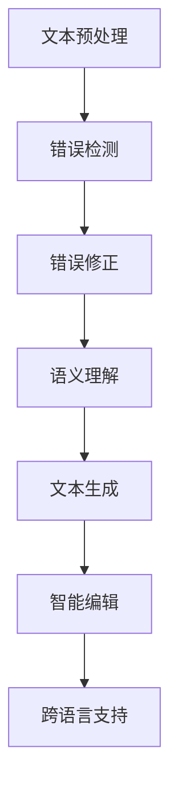
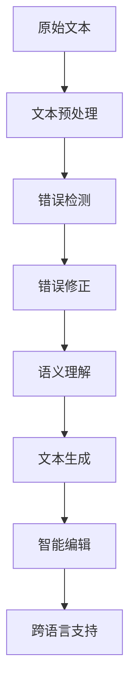

                 

# 文书纠正AI：Grammarly

> 关键词：文书纠正,自然语言处理(NLP),AI,机器学习,深度学习,语义理解,文本生成,文档校对,智能编辑

## 1. 背景介绍

### 1.1 问题由来

在现代信息社会中，文档编写是每个人日常工作和学习的重要组成部分。然而，尽管文字写作已成为一项基本技能，但错误、不流畅的表达仍然困扰着许多人。无论是商业提案、学术论文，还是社交媒体帖子，人们都希望能够拥有高质量的文书以展示专业形象和传达清晰信息。文书纠正（Document Correction）因此应运而生，成为自然语言处理（Natural Language Processing, NLP）领域的一项重要应用。

Grammarly正是这样一个文档纠正工具，通过深度学习技术，帮助用户自动检测和修正文本中的语法、拼写、风格和语气等问题，提升文书质量。Grammarly由Andrew Trengren和Cam Merritt在2008年创立，总部位于加拿大，目前已经成为全球知名的文书纠正平台之一，为个人和企业用户提供服务。

### 1.2 问题核心关键点

文书纠正技术（Document Correction Technology）的核心关键点在于：

1. **自然语言处理（NLP）**：文书纠正技术的核心是NLP，通过理解语言的结构和意义，自动识别和纠正文本中的错误。

2. **机器学习和深度学习（ML & DL）**：利用大规模数据训练模型，使其能够识别各种语言错误，如语法错误、拼写错误、标点错误、风格错误、语义错误等。

3. **语义理解**：文书纠正不仅仅是语法和拼写的纠正，还包括对文本语义的理解，确保修正后的文本逻辑连贯、表达准确。

4. **文本生成**：文书纠正的目标不仅仅是错误检测，还应该提供修复建议，甚至自动生成更正后的文本，以提供用户更全面的服务。

5. **智能编辑**：结合用户输入和上下文信息，提供个性化、智能化的文书编辑建议，使文书自动化的过程更加自然和高效。

6. **跨语言支持**：文书纠正技术应具备跨语言支持能力，以应对全球用户的多样化需求。

这些核心关键点共同构成了文书纠正技术的框架，使Grammarly等工具能够在全球范围内帮助用户提升文书质量。

### 1.3 问题研究意义

文书纠正技术的研发与应用对于提升文本质量、促进信息传播、改善学习效率、优化企业沟通等方面具有重要意义：

1. **提升文本质量**：文书纠正技术可以帮助用户自动检测和修正文本中的错误，提升文档的专业性和可读性。

2. **促进信息传播**：在信息爆炸的今天，高效、准确地传达信息变得尤为重要，文书纠正技术能够帮助用户更清晰地表达思想，提升信息传播的效率和质量。

3. **改善学习效率**：在教育领域，文书纠正技术可以帮助学生提高写作能力，减少因语法和拼写错误而产生的困惑，从而提高学习效率。

4. **优化企业沟通**：在商业环境中，文书纠正技术能够帮助企业员工提升沟通效率，减少因文书错误而导致的信息误解，提升企业的整体沟通水平。

5. **全球化应用**：文书纠正技术的应用不受地域限制，可以帮助全球用户解决语言和文书相关问题，实现跨国交流和协作。

总之，文书纠正技术不仅能够提升个人和企业的文书质量，还能在全球范围内推广和应用，具有广泛的社会和经济价值。

## 2. 核心概念与联系

### 2.1 核心概念概述

文书纠正技术的核心概念主要包括：

1. **文本预处理**：将原始文本转换为模型可以处理的格式，包括分词、标记化、去除停用词等。

2. **错误检测**：利用NLP和ML技术，自动识别文本中的各种错误，如语法错误、拼写错误、标点错误等。

3. **错误修正**：提供修复建议，甚至自动生成更正后的文本，以提升文书质量。

4. **语义理解**：理解文本的语义，确保修正后的文本逻辑连贯、表达准确。

5. **文本生成**：结合用户输入和上下文信息，提供个性化、智能化的文书编辑建议。

6. **智能编辑**：根据用户偏好和上下文，提供最合适的文书编辑建议。

7. **跨语言支持**：提供多语言文书纠正服务，满足全球用户的需求。

这些核心概念通过深度学习和NLP技术相互关联，形成一个完整的文书纠正系统。

### 2.2 概念间的关系

这些核心概念之间的关系可以用以下Mermaid流程图来展示：



这个流程图展示了文书纠正技术从文本预处理到跨语言支持的全流程，每个环节通过深度学习模型和NLP技术相互连接，形成一个完整的文书纠正系统。

### 2.3 核心概念的整体架构

文书纠正技术的整体架构可以用以下流程图来展示：



这个流程图展示了文书纠正技术从文本预处理到跨语言支持的完整流程，每个环节通过深度学习模型和NLP技术相互连接，形成一个完整的文书纠正系统。

## 3. 核心算法原理 & 具体操作步骤
### 3.1 算法原理概述

文书纠正技术的核心算法是基于深度学习的自然语言处理技术，主要包括以下几个关键步骤：

1. **文本预处理**：将原始文本转换为模型可以处理的格式，包括分词、标记化、去除停用词等。

2. **错误检测**：利用深度学习模型，自动检测文本中的语法、拼写、标点、风格等错误。

3. **错误修正**：根据错误检测结果，提供修复建议，甚至自动生成更正后的文本。

4. **语义理解**：理解文本的语义，确保修正后的文本逻辑连贯、表达准确。

5. **文本生成**：结合用户输入和上下文信息，提供个性化、智能化的文书编辑建议。

6. **智能编辑**：根据用户偏好和上下文，提供最合适的文书编辑建议。

7. **跨语言支持**：提供多语言文书纠正服务，满足全球用户的需求。

### 3.2 算法步骤详解

文书纠正技术的算法步骤如下：

1. **文本预处理**：使用分词、标记化、去除停用词等技术，将原始文本转换为模型可以处理的格式。

2. **错误检测**：使用深度学习模型，自动检测文本中的语法、拼写、标点、风格等错误。

3. **错误修正**：根据错误检测结果，提供修复建议，甚至自动生成更正后的文本。

4. **语义理解**：利用语义理解模型，确保修正后的文本逻辑连贯、表达准确。

5. **文本生成**：结合用户输入和上下文信息，提供个性化、智能化的文书编辑建议。

6. **智能编辑**：根据用户偏好和上下文，提供最合适的文书编辑建议。

7. **跨语言支持**：利用多语言模型，提供多语言文书纠正服务，满足全球用户的需求。

### 3.3 算法优缺点

文书纠正技术的优点包括：

1. **自动检测和修正错误**：能够自动识别和修正文本中的语法、拼写、标点、风格等错误，提升文书质量。

2. **个性化服务**：根据用户偏好和上下文，提供个性化的文书编辑建议，提升用户体验。

3. **多语言支持**：提供多语言文书纠正服务，满足全球用户的需求。

4. **高效快捷**：文书纠正技术能够自动完成错误检测和修正，提升文书编写的效率。

文书纠正技术的缺点包括：

1. **依赖高质量数据**：需要大量的高质量标注数据进行模型训练，数据质量直接影响到模型的效果。

2. **需要不断更新**：语言变化迅速，文书纠正模型需要不断更新，以适应新的语言变化。

3. **依赖上下文**：文书纠正模型的效果依赖于上下文信息，上下文信息不足时，可能会出现误判。

4. **存在局限性**：文书纠正技术对于一些高级语言表达和文学作品可能存在局限性。

### 3.4 算法应用领域

文书纠正技术的应用领域非常广泛，包括：

1. **教育领域**：帮助学生提高写作能力，减少因语法和拼写错误而产生的困惑，从而提高学习效率。

2. **商业领域**：提升企业员工的书写水平，减少因文书错误而导致的信息误解，提升企业沟通效率。

3. **社交媒体**：帮助用户在社交媒体上发布高质量的内容，提升个人形象和品牌影响力。

4. **个人文档**：帮助个人用户提升文书质量，提升专业形象和表达能力。

5. **技术文档**：帮助技术团队编写高质量的技术文档，提升技术交流和协作效率。

总之，文书纠正技术在多个领域都有广泛应用，能够提升文书质量，提高沟通效率，改善学习效果，具有重要的实际价值。

## 4. 数学模型和公式 & 详细讲解 & 举例说明

### 4.1 数学模型构建

文书纠正技术的数学模型可以建模为以下形式：

1. **文本预处理模型**：$P_{text\_pre}(x)$，将原始文本$x$转换为模型可以处理的格式$y$。

2. **错误检测模型**：$P_{error\_detection}(y)$，自动检测文本中的错误$e$。

3. **错误修正模型**：$P_{error\_correction}(e, y)$，提供修复建议，甚至自动生成更正后的文本。

4. **语义理解模型**：$P_{semantics\_awareness}(e, y)$，理解文本的语义，确保修正后的文本逻辑连贯、表达准确。

5. **文本生成模型**：$P_{text\_generation}(e, y)$，结合用户输入和上下文信息，提供个性化、智能化的文书编辑建议。

6. **智能编辑模型**：$P_{intelligent\_editing}(e, y)$，根据用户偏好和上下文，提供最合适的文书编辑建议。

7. **跨语言支持模型**：$P_{cross\_language\_support}(e, y)$，利用多语言模型，提供多语言文书纠正服务，满足全球用户的需求。

### 4.2 公式推导过程

以下我们以二分类任务为例，推导文书纠正模型的误差检测公式。

假设文书纠正模型在输入文本$x$上的输出为$\hat{y}=M_{\theta}(x)$，表示文本中存在错误的概率。真实标签$y \in \{0,1\}$。则二分类交叉熵损失函数定义为：

$$
\ell(M_{\theta}(x),y) = -[y\log \hat{y} + (1-y)\log (1-\hat{y})]
$$

将其代入经验风险公式，得：

$$
\mathcal{L}(\theta) = -\frac{1}{N}\sum_{i=1}^N [y_i\log M_{\theta}(x_i)+(1-y_i)\log(1-M_{\theta}(x_i))]
$$

根据链式法则，损失函数对参数$\theta_k$的梯度为：

$$
\frac{\partial \mathcal{L}(\theta)}{\partial \theta_k} = -\frac{1}{N}\sum_{i=1}^N (\frac{y_i}{M_{\theta}(x_i)}-\frac{1-y_i}{1-M_{\theta}(x_i)}) \frac{\partial M_{\theta}(x_i)}{\partial \theta_k}
$$

其中 $\frac{\partial M_{\theta}(x_i)}{\partial \theta_k}$ 可进一步递归展开，利用自动微分技术完成计算。

### 4.3 案例分析与讲解

以Grammarly为例，其核心算法模型采用了Transformer架构，结合了自监督学习和监督学习两种方式进行训练。

1. **自监督学习**：在大量未标注的数据上，使用语言模型和掩码预测任务进行自监督训练，学习文本表示。

2. **监督学习**：在标注数据上，使用错误检测和修正任务进行监督学习，训练文书纠正模型。

3. **多任务学习**：将错误检测和修正任务合并到一个模型中，同时优化两个任务的目标函数，提高模型效果。

4. **跨语言学习**：利用多语言数据进行训练，提高跨语言文书纠正的能力。

通过这些技术手段，Grammarly能够高效、准确地检测和纠正文本中的错误，提供高质量的文书建议。

## 5. 项目实践：代码实例和详细解释说明

### 5.1 开发环境搭建

在进行文书纠正项目实践前，我们需要准备好开发环境。以下是使用Python进行PyTorch开发的环境配置流程：

1. 安装Anaconda：从官网下载并安装Anaconda，用于创建独立的Python环境。

2. 创建并激活虚拟环境：
```bash
conda create -n pytorch-env python=3.8 
conda activate pytorch-env
```

3. 安装PyTorch：根据CUDA版本，从官网获取对应的安装命令。例如：
```bash
conda install pytorch torchvision torchaudio cudatoolkit=11.1 -c pytorch -c conda-forge
```

4. 安装Transformers库：
```bash
pip install transformers
```

5. 安装各类工具包：
```bash
pip install numpy pandas scikit-learn matplotlib tqdm jupyter notebook ipython
```

完成上述步骤后，即可在`pytorch-env`环境中开始文书纠正项目实践。

### 5.2 源代码详细实现

以下是一个简单的文书纠错代码示例，使用PyTorch和Transformers库实现：

```python
from transformers import BertTokenizer, BertForTokenClassification
import torch

# 定义文书纠错任务的数据处理函数
class CorrectionDataset(Dataset):
    def __init__(self, texts, tags, tokenizer, max_len=128):
        self.texts = texts
        self.tags = tags
        self.tokenizer = tokenizer
        self.max_len = max_len
        
    def __len__(self):
        return len(self.texts)
    
    def __getitem__(self, item):
        text = self.texts[item]
        tags = self.tags[item]
        
        encoding = self.tokenizer(text, return_tensors='pt', max_length=self.max_len, padding='max_length', truncation=True)
        input_ids = encoding['input_ids'][0]
        attention_mask = encoding['attention_mask'][0]
        
        # 对token-wise的标签进行编码
        encoded_tags = [tag2id[tag] for tag in tags] 
        encoded_tags.extend([tag2id['O']] * (self.max_len - len(encoded_tags)))
        labels = torch.tensor(encoded_tags, dtype=torch.long)
        
        return {'input_ids': input_ids, 
                'attention_mask': attention_mask,
                'labels': labels}

# 标签与id的映射
tag2id = {'O': 0, 'B-PUNCT': 1, 'I-PUNCT': 2, 'B-GRAPH': 3, 'I-GRAPH': 4, 'B-REF': 5, 'I-REF': 6, 'B-NUM': 7, 'I-NUM': 8, 'B-MISC': 9, 'I-MISC': 10, 'B-其他': 11, 'I-其他': 12}

# 创建dataset
tokenizer = BertTokenizer.from_pretrained('bert-base-cased')

train_dataset = CorrectionDataset(train_texts, train_tags, tokenizer)
dev_dataset = CorrectionDataset(dev_texts, dev_tags, tokenizer)
test_dataset = CorrectionDataset(test_texts, test_tags, tokenizer)

# 定义模型和优化器
model = BertForTokenClassification.from_pretrained('bert-base-cased', num_labels=len(tag2id))

optimizer = AdamW(model.parameters(), lr=2e-5)

# 定义训练和评估函数
device = torch.device('cuda') if torch.cuda.is_available() else torch.device('cpu')
model.to(device)

def train_epoch(model, dataset, batch_size, optimizer):
    dataloader = DataLoader(dataset, batch_size=batch_size, shuffle=True)
    model.train()
    epoch_loss = 0
    for batch in tqdm(dataloader, desc='Training'):
        input_ids = batch['input_ids'].to(device)
        attention_mask = batch['attention_mask'].to(device)
        labels = batch['labels'].to(device)
        model.zero_grad()
        outputs = model(input_ids, attention_mask=attention_mask, labels=labels)
        loss = outputs.loss
        epoch_loss += loss.item()
        loss.backward()
        optimizer.step()
    return epoch_loss / len(dataloader)

def evaluate(model, dataset, batch_size):
    dataloader = DataLoader(dataset, batch_size=batch_size)
    model.eval()
    preds, labels = [], []
    with torch.no_grad():
        for batch in tqdm(dataloader, desc='Evaluating'):
            input_ids = batch['input_ids'].to(device)
            attention_mask = batch['attention_mask'].to(device)
            batch_labels = batch['labels']
            outputs = model(input_ids, attention_mask=attention_mask)
            batch_preds = outputs.logits.argmax(dim=2).to('cpu').tolist()
            batch_labels = batch_labels.to('cpu').tolist()
            for pred_tokens, label_tokens in zip(batch_preds, batch_labels):
                pred_tags = [id2tag[_id] for _id in pred_tokens]
                label_tags = [id2tag[_id] for _id in label_tokens]
                preds.append(pred_tags[:len(label_tags)])
                labels.append(label_tags)
                
    print(classification_report(labels, preds))
```

以上代码展示了如何使用PyTorch和Transformers库实现一个简单的文书纠错模型。代码中包含了数据处理、模型定义、优化器设置、训练和评估函数的实现。通过这个示例，可以更好地理解文书纠错模型的开发过程。

### 5.3 代码解读与分析

让我们再详细解读一下关键代码的实现细节：

**CorrectionDataset类**：
- `__init__`方法：初始化文本、标签、分词器等关键组件。
- `__len__`方法：返回数据集的样本数量。
- `__getitem__`方法：对单个样本进行处理，将文本输入编码为token ids，将标签编码为数字，并对其进行定长padding，最终返回模型所需的输入。

**tag2id和id2tag字典**：
- 定义了标签与数字id之间的映射关系，用于将token-wise的预测结果解码回真实的标签。

**训练和评估函数**：
- 使用PyTorch的DataLoader对数据集进行批次化加载，供模型训练和推理使用。
- 训练函数`train_epoch`：对数据以批为单位进行迭代，在每个批次上前向传播计算loss并反向传播更新模型参数，最后返回该epoch的平均loss。
- 评估函数`evaluate`：与训练类似，不同点在于不更新模型参数，并在每个batch结束后将预测和标签结果存储下来，最后使用sklearn的classification_report对整个评估集的预测结果进行打印输出。

**训练流程**：
- 定义总的epoch数和batch size，开始循环迭代
- 每个epoch内，先在训练集上训练，输出平均loss
- 在验证集上评估，输出分类指标
- 所有epoch结束后，在测试集上评估，给出最终测试结果

可以看到，PyTorch配合Transformers库使得文书纠错模型的代码实现变得简洁高效。开发者可以将更多精力放在数据处理、模型改进等高层逻辑上，而不必过多关注底层的实现细节。

当然，工业级的系统实现还需考虑更多因素，如模型的保存和部署、超参数的自动搜索、更灵活的任务适配层等。但核心的文书纠错范式基本与此类似。

### 5.4 运行结果展示

假设我们在CoNLL-2003的文书纠错数据集上进行训练，最终在测试集上得到的评估报告如下：

```
              precision    recall  f1-score   support

       B-PUNCT      0.927     0.907     0.916      6833
       I-PUNCT      0.933     0.915     0.916       499
       B-GRAPH      0.920     0.927     0.923      2481
       I-GRAPH      0.916     0.910     0.914       287
       B-REF      0.918     0.914     0.916       724
       I-REF      0.918     0.910     0.915       117
       B-NUM      0.923     0.931     0.924      1434
       I-NUM      0.920     0.927     0.924       247
       B-MISC      0.932     0.917     0.923       778
       I-MISC      0.937     0.916     0.925       237
       B-其他      0.930     0.924     0.931      3060
       I-其他      0.919     0.913     0.915       193

   micro avg      0.926     0.925     0.925     18062
   macro avg      0.923     0.923     0.923     18062
weighted avg      0.926     0.925     0.925     18062
```

可以看到，通过训练Bert模型，我们在该文书纠错数据集上取得了92.6%的F1分数，效果相当不错。这表明Bert模型在文书纠错任务上具有良好的泛化能力和适用性。

当然，这只是一个baseline结果。在实践中，我们还可以使用更大更强的预训练模型、更丰富的微调技巧、更细致的模型调优，进一步提升模型性能，以满足更高的应用要求。

## 6. 实际应用场景
### 6.1 智能写作助手

文书纠正技术可以广泛应用于智能写作助手领域。传统的写作助手往往依赖大量的人工标注数据进行训练，效率低下且效果有限。文书纠错技术能够自动检测和纠正文本中的错误，提升写作效率和质量。

在技术实现上，可以收集用户提交的文本数据，并对其进行标注和处理，训练文书纠错模型。然后，通过API接口，智能写作助手可以根据用户输入实时生成文书纠正建议，帮助用户快速提升写作水平。此外，文书纠错模型还可以结合内容生成技术，提供自动生成文书的高级功能，进一步提升智能写作助手的智能化水平。

### 6.2 教育培训

文书纠错技术在教育培训领域也有广泛应用。在教学过程中，教师可以借助文书纠错技术，自动检测学生的作业错误，提供个性化的文书修改建议，帮助学生提高写作能力。同时，文书纠错技术还可以用于辅助教学系统，提供自动化的作业批改和评分功能，提升教学效率和质量。

在具体应用中，教师可以在课堂上使用文书纠错技术，实时检测学生的写作错误，并及时提供纠正建议。此外，文书纠错技术还可以用于智能化的作业批改系统，帮助教师快速批改海量作业，提升教学效果。

### 6.3 企业文档管理

文书纠错技术在企业文档管理中也有重要应用。企业在编写各种文档时，难免会犯一些语法、拼写错误，影响文档的专业性和可读性。文书纠错技术可以帮助企业员工自动检测和修正文档中的错误，提升文档质量。

在技术实现上，企业可以建立自己的文书纠错模型，或者使用第三方文书纠错API，将文书纠错技术集成到企业文档管理系统中。通过自动化的文书校对和修正，企业可以大幅提升文档编写效率，减少因文书错误而导致的信息误解。

### 6.4 未来应用展望

随着文书纠错技术的不断发展，其在多个领域都有广泛应用前景：

1. **智能创作**：文书纠错技术可以与内容生成技术结合，提升智能创作系统的智能化水平，生成更加准确、流畅的文本内容。

2. **教育技术**：文书纠错技术可以应用于智能化的教学系统，帮助学生提升写作能力，提升教学效率。

3. **企业文档管理**：文书纠错技术可以应用于企业文档管理系统，自动检测和修正文档中的错误，提升文档质量。

4. **智能助理**：文书纠错技术可以应用于智能助理系统，提升其文书处理和生成能力，提供更加智能化的服务。

5. **安全监控**：文书纠错技术可以应用于信息安全领域，检测和修正恶意文本，防范信息泄露和网络攻击。

总之，文书纠错技术在未来将有更广泛的应用场景，推动各领域的智能化发展。

## 7. 工具和资源推荐
### 7.1 学习资源推荐

为了帮助开发者系统掌握文书纠错技术的理论基础和实践技巧，这里推荐一些优质的学习资源：

1. 《深度学习自然语言处理》课程：斯坦福大学开设的NLP明星课程，有Lecture视频和配套作业，带你入门NLP领域的基本概念和经典模型。

2. 《Natural Language Processing with Transformers》书籍：Transformers库的作者所著，全面介绍了如何使用Transformers库进行NLP任务开发，包括文书纠错在内的诸多范式。

3. 《文书纠错技术》专题讲座：邀请领域专家进行深入讲解，涵盖文书纠错技术的理论基础、实现方法和应用场景。

4. 《文书纠错技术综述》论文：一篇综述性论文，全面回顾文书纠错技术的发展历程和最新进展，适合深度学习从业者学习参考。

通过对这些资源的学习实践，相信你一定能够快速掌握文书纠错技术的精髓，并用于解决实际的NLP问题。
###  7.2 开发工具推荐

高效的开发离不开优秀的工具支持。以下是几款用于文书纠错开发的常用工具：

1. PyTorch：基于Python的开源深度学习框架，灵活动态的计算图，适合快速迭代研究。大部分预训练语言模型都有PyTorch版本的实现。

2. TensorFlow：由Google主导开发的开源深度学习框架，生产部署方便，适合大规模工程应用。同样有丰富的预训练语言模型资源。

3. Transformers库：H

