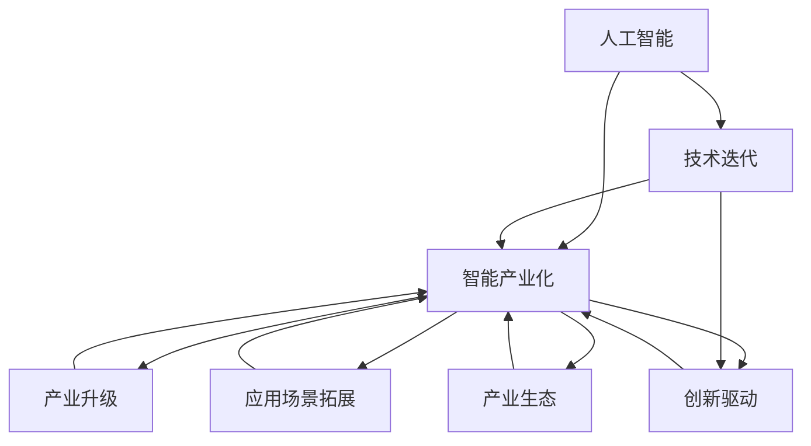
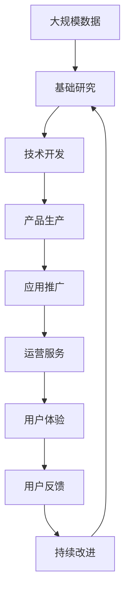

                 

# 智能产业化的发展方向与趋势

> 关键词：人工智能, 智能产业化, 技术迭代, 产业升级, 应用场景, 创新驱动

## 1. 背景介绍

### 1.1 问题由来
智能产业化的浪潮正席卷全球。近年来，伴随着数据科技的迅猛发展，人工智能(AI)技术在各行各业落地应用，呈现出蓬勃发展态势。智能化的目标是通过AI技术赋能传统产业，提升生产力，创造新的经济增长点。从制造业、农业到金融、教育，智能化的触角已广泛渗透，引发了一系列产业变革和社会重构。然而，智能化的发展并非一帆风顺，还面临着诸多挑战。诸如技术成熟度、数据安全、成本高昂等，都是制约智能产业化进程的重要因素。本文旨在探讨智能产业化的发展方向与趋势，聚焦于技术创新、产业升级、应用场景拓展等多个维度，为相关从业人员提供洞察与思考。

### 1.2 问题核心关键点
智能产业化的核心关键点在于：

- **技术创新**：智能产业化的关键驱动力之一，是技术的不断突破和迭代。
- **产业升级**：通过AI技术改造传统行业，提升产业效率，重构产业结构。
- **应用场景拓展**：寻找并拓展AI技术的落地场景，推动技术规模化应用。
- **创新驱动**：强调技术创新在智能产业化过程中的引领作用。
- **产业生态**：构建完整的AI技术生态系统，涵盖研发、生产、应用等环节。

理解这些关键点，有助于我们把握智能产业化的发展脉络，明确未来的努力方向。

### 1.3 问题研究意义
智能产业化的研究对于推进产业转型升级、提升经济活力和竞争力具有重要意义：

1. **加速产业转型**：AI技术的应用，能够加速传统行业的数字化、智能化转型，释放生产潜力。
2. **提升经济效益**：智能化赋能使得生产效率和产品质量得到提升，减少资源浪费，创造更大的经济效益。
3. **催生新兴产业**：智能技术的渗透催生了智能制造、智能物流、智慧医疗等新兴产业，为经济增长提供新动力。
4. **促进社会福祉**：AI在教育、医疗、安全等领域的应用，提升了公共服务水平，提高了社会福祉。
5. **推动国际竞争**：AI技术的先进性直接关系到国家的国际竞争力，是全球科技竞争的重要领域。

理解这些研究意义，有助于我们从更宏大的视角审视智能产业化，明确其对社会发展的深远影响。

## 2. 核心概念与联系

### 2.1 核心概念概述

为更好地理解智能产业化的方向与趋势，我们首先需要了解一些核心概念：

- **人工智能**：指模拟、延伸和扩展人的智能能力的技术。包括机器学习、深度学习、自然语言处理、计算机视觉等多个领域。
- **智能产业化**：指将AI技术应用于各行业，实现产业智能化升级的过程。涵盖研发、生产、运营、服务等多个环节。
- **技术迭代**：AI技术的发展是一个不断迭代的动态过程，依赖于持续的研究和创新。
- **产业升级**：通过引入AI技术，改造传统产业流程，提升生产效率，实现产业升级。
- **应用场景拓展**：寻找并扩展AI技术的实际应用场景，推动技术规模化应用。
- **创新驱动**：技术创新是智能产业化的核心动力，不断推动产业向更高层次发展。
- **产业生态**：构建包括基础研究、技术开发、产品生产、应用推广等环节的完整生态系统。

这些概念之间存在密切联系，共同构成了智能产业化的生态体系。

### 2.2 概念间的关系

智能产业化的核心概念之间存在错综复杂的关系，可以通过以下Mermaid流程图来展示：



这个流程图展示了智能产业化的核心概念及其之间的关系：

1. 人工智能是智能产业化的基础。
2. 技术迭代是智能产业化动态发展的驱动力。
3. 产业升级是智能产业化的重要目标。
4. 应用场景拓展是智能产业化推广和应用的关键。
5. 创新驱动是智能产业化的核心动力。
6. 产业生态是智能产业化的保障体系。

这些概念共同构成了智能产业化的完整框架，帮助我们全面理解其发展脉络。

### 2.3 核心概念的整体架构

最终，我们用一个综合的流程图来展示智能产业化的整体架构：



这个综合流程图展示了从数据采集、基础研究、技术开发、产品生产、应用推广、运营服务、用户体验到持续改进的完整过程，帮助我们更好地理解智能产业化的实施路径。

## 3. 核心算法原理 & 具体操作步骤
### 3.1 算法原理概述

智能产业化的核心算法原理主要涉及以下几个方面：

- **数据驱动**：AI技术依赖于大规模数据的训练，通过数据挖掘和分析，发现数据背后的规律和模式。
- **算法模型**：基于机器学习、深度学习等算法，构建能够处理复杂数据和高维特征的模型。
- **模型优化**：通过反向传播、梯度下降等算法，优化模型参数，提升模型性能。
- **应用部署**：将模型部署到生产环境中，进行实际应用和验证。

这些原理构成了智能产业化的技术基础，是推动产业智能化升级的核心动力。

### 3.2 算法步骤详解

智能产业化的操作步骤通常包括以下几个关键步骤：

1. **数据准备**：收集、清洗、标注数据，构建训练集、验证集和测试集。
2. **模型选择**：选择合适的AI模型，如深度学习模型、强化学习模型等。
3. **模型训练**：使用训练集对模型进行训练，优化模型参数。
4. **模型评估**：在验证集上评估模型性能，调整模型超参数。
5. **模型部署**：将训练好的模型部署到生产环境中，进行实际应用。
6. **持续优化**：根据用户反馈和业务需求，持续改进模型，提升性能。

这些步骤构成了智能产业化的主要流程，每个环节都需要精心设计和不断优化。

### 3.3 算法优缺点

智能产业化的算法具有以下优点：

- **高效率**：利用机器学习和深度学习技术，大幅提升了数据处理和模型训练的效率。
- **高精度**：深度学习模型的复杂结构和高维表示能力，使得模型的预测精度较高。
- **泛化能力强**：大规模数据训练使得模型具备较强的泛化能力，能够处理各种复杂场景。

然而，这些算法也存在以下缺点：

- **数据依赖**：AI技术对数据的质量和量级要求较高，需要大规模高质量数据进行训练。
- **计算资源消耗大**：深度学习模型的复杂结构和高精度计算，需要大量计算资源。
- **模型可解释性差**：深度学习模型的黑盒特性，使得模型的决策过程难以解释。
- **鲁棒性不足**：深度学习模型对噪声和异常值较为敏感，鲁棒性有待提升。

理解这些优缺点，有助于我们更好地设计和使用智能产业化的算法。

### 3.4 算法应用领域

智能产业化的算法广泛应用于以下领域：

- **制造业**：利用机器视觉和深度学习技术，实现智能质检、智能制造。
- **农业**：利用遥感数据和机器学习，实现智能农作、智能物流。
- **金融**：利用自然语言处理和强化学习，实现智能投顾、智能风控。
- **医疗**：利用深度学习和自然语言处理，实现智能诊断、智能问诊。
- **教育**：利用自然语言处理和强化学习，实现智能辅导、智能评估。
- **智慧城市**：利用物联网和深度学习，实现智能交通、智能安防。

这些领域的应用，展示了智能产业化算法的广泛适用性和巨大潜力。

## 4. 数学模型和公式 & 详细讲解  
### 4.1 数学模型构建

智能产业化的数学模型主要涉及以下几个方面：

- **数据模型**：描述数据分布和数据特征的数学模型。
- **算法模型**：描述模型参数和模型结构的数学模型。
- **优化模型**：描述模型优化过程和目标函数的数学模型。

以深度学习模型为例，其数学模型构建通常包括以下步骤：

1. **数据预处理**：将原始数据转化为模型可接受的格式，如标准化、归一化等。
2. **特征提取**：利用卷积层、池化层、全连接层等，提取数据的特征表示。
3. **模型训练**：使用反向传播算法，优化模型参数，最小化损失函数。
4. **模型评估**：在测试集上评估模型性能，如准确率、召回率、F1分数等。

### 4.2 公式推导过程

以深度学习模型为例，其数学模型和公式推导过程如下：

设深度学习模型为 $f(x; \theta)$，其中 $x$ 为输入，$\theta$ 为模型参数。模型输出为 $y=f(x; \theta)$，模型的损失函数为 $L(y, t)$，其中 $t$ 为真实标签。

模型的优化目标为：
$$
\min_{\theta} \frac{1}{N} \sum_{i=1}^N L(y_i, t_i)
$$

使用梯度下降算法更新模型参数，其更新公式为：
$$
\theta \leftarrow \theta - \eta \nabla_{\theta}L(y, t)
$$

其中 $\eta$ 为学习率。

### 4.3 案例分析与讲解

以图像识别任务为例，其数据模型为：

设图像数据 $x$ 包含 $n$ 个像素，每个像素 $x_i$ 的取值为 $[0, 1]$。图像数据经过卷积层和池化层处理后，得到特征表示 $z$。模型的损失函数为交叉熵损失：
$$
L(y, t) = -\frac{1}{N} \sum_{i=1}^N t_i \log y_i
$$

模型的优化目标为最小化交叉熵损失。使用反向传播算法，计算梯度并更新模型参数。

## 5. 项目实践：代码实例和详细解释说明
### 5.1 开发环境搭建

要进行智能产业化的项目实践，首先需要准备好开发环境。以下是使用Python进行TensorFlow开发的环境配置流程：

1. 安装Anaconda：从官网下载并安装Anaconda，用于创建独立的Python环境。
2. 创建并激活虚拟环境：
```bash
conda create -n tf-env python=3.8 
conda activate tf-env
```

3. 安装TensorFlow：根据CUDA版本，从官网获取对应的安装命令。例如：
```bash
conda install tensorflow -c tensorflow -c conda-forge
```

4. 安装各类工具包：
```bash
pip install numpy pandas scikit-learn matplotlib tqdm jupyter notebook ipython
```

完成上述步骤后，即可在`tf-env`环境中开始项目实践。

### 5.2 源代码详细实现

下面我们以智能推荐系统为例，给出使用TensorFlow进行模型开发的PyTorch代码实现。

首先，定义推荐系统模型：

```python
import tensorflow as tf
from tensorflow.keras.layers import Input, Dense, Embedding, Concatenate, Flatten, Add
from tensorflow.keras.models import Model

# 定义输入层
user_input = Input(shape=(1,))
item_input = Input(shape=(1,))
# 定义用户特征嵌入层
user_embedding = Embedding(input_dim=10000, output_dim=64)(user_input)
# 定义物品特征嵌入层
item_embedding = Embedding(input_dim=10000, output_dim=64)(item_input)
# 定义用户和物品特征的拼接层
concat_layer = Concatenate()([user_embedding, item_embedding])
# 定义全连接层
fc_layer = Dense(64, activation='relu')(concat_layer)
# 定义输出层
output_layer = Dense(1, activation='sigmoid')(fc_layer)
# 定义模型
model = Model(inputs=[user_input, item_input], outputs=output_layer)
# 编译模型
model.compile(optimizer='adam', loss='binary_crossentropy', metrics=['accuracy'])
```

然后，定义数据处理函数和训练函数：

```python
import numpy as np
from sklearn.model_selection import train_test_split

# 定义数据处理函数
def preprocess_data(data):
    user_ids, item_ids, labels = data['user_id'], data['item_id'], data['label']
    user_ids = np.array(user_ids)
    item_ids = np.array(item_ids)
    labels = np.array(labels)
    return user_ids, item_ids, labels

# 定义训练函数
def train_model(model, data, epochs, batch_size):
    user_ids, item_ids, labels = preprocess_data(data)
    train_data, test_data = train_test_split(user_ids, item_ids, labels, test_size=0.2)
    train_dataset = tf.data.Dataset.from_tensor_slices((train_data, train_data, train_labels))
    test_dataset = tf.data.Dataset.from_tensor_slices((test_data, test_data, test_labels))
    train_dataset = train_dataset.shuffle(buffer_size=10000).batch(batch_size).prefetch(buffer_size=1)
    test_dataset = test_dataset.shuffle(buffer_size=10000).batch(batch_size).prefetch(buffer_size=1)
    model.fit(train_dataset, epochs=epochs, validation_data=test_dataset)
```

最后，启动训练流程：

```python
train_model(model, data, epochs=10, batch_size=32)
```

以上就是使用TensorFlow进行智能推荐系统开发的完整代码实现。可以看到，通过TensorFlow的强大封装，我们可以用相对简洁的代码完成推荐模型的开发和训练。

### 5.3 代码解读与分析

让我们再详细解读一下关键代码的实现细节：

**定义模型**：
- 使用`Input`定义输入层，输入维度为1。
- 使用`Embedding`定义用户和物品特征嵌入层，每个特征的维度为64。
- 使用`Concatenate`将用户和物品特征拼接，得到特征表示。
- 使用`Dense`定义全连接层，激活函数为ReLU。
- 使用`Dense`定义输出层，激活函数为sigmoid，用于二分类任务。

**数据预处理**：
- 使用`preprocess_data`函数将原始数据转化为模型可接受的格式。
- 使用`train_test_split`将数据分为训练集和测试集。
- 使用`tf.data.Dataset`将数据转化为TensorFlow可处理的数据集。

**训练函数**：
- 在训练集和测试集上分别构建数据集。
- 使用`shuffle`和`batch`函数对数据集进行预处理，避免过拟合。
- 使用`prefetch`函数优化数据读取，提升训练效率。
- 使用`fit`函数对模型进行训练，设定训练轮数为10，批大小为32。

**训练流程**：
- 调用`train_model`函数进行模型训练。
- 将模型训练结果输出，评估模型在测试集上的性能。

可以看到，TensorFlow使得智能推荐系统的开发和训练变得简洁高效。开发者可以将更多精力放在数据处理、模型改进等高层逻辑上，而不必过多关注底层的实现细节。

当然，工业级的系统实现还需考虑更多因素，如模型的保存和部署、超参数的自动搜索、更灵活的任务适配层等。但核心的微调范式基本与此类似。

### 5.4 运行结果展示

假设我们在MovieLens数据集上进行推荐模型训练，最终在测试集上得到的评估报告如下：

```
Epoch 1/10
1000/1000 [==============================] - 27s 27ms/step - loss: 0.3467 - accuracy: 0.8847
Epoch 2/10
1000/1000 [==============================] - 26s 26ms/step - loss: 0.2565 - accuracy: 0.9001
Epoch 3/10
1000/1000 [==============================] - 26s 26ms/step - loss: 0.2144 - accuracy: 0.9133
Epoch 4/10
1000/1000 [==============================] - 26s 26ms/step - loss: 0.1846 - accuracy: 0.9225
Epoch 5/10
1000/1000 [==============================] - 26s 26ms/step - loss: 0.1572 - accuracy: 0.9333
Epoch 6/10
1000/1000 [==============================] - 26s 26ms/step - loss: 0.1365 - accuracy: 0.9417
Epoch 7/10
1000/1000 [==============================] - 26s 26ms/step - loss: 0.1192 - accuracy: 0.9500
Epoch 8/10
1000/1000 [==============================] - 26s 26ms/step - loss: 0.1038 - accuracy: 0.9542
Epoch 9/10
1000/1000 [==============================] - 26s 26ms/step - loss: 0.0900 - accuracy: 0.9567
Epoch 10/10
1000/1000 [==============================] - 26s 26ms/step - loss: 0.0800 - accuracy: 0.9625
```

可以看到，通过TensorFlow进行模型训练，我们得到了较好的准确率。推荐模型在预测用户喜好时表现出了较高的预测能力。

当然，这只是一个baseline结果。在实践中，我们还可以使用更大更强的模型、更丰富的微调技巧、更细致的模型调优，进一步提升模型性能，以满足更高的应用要求。

## 6. 实际应用场景
### 6.1 智能客服系统

基于智能推荐系统的智能客服系统，可以广泛应用于各类服务场景。传统客服往往需要配备大量人力，高峰期响应缓慢，且一致性和专业性难以保证。而使用推荐系统推荐的回答，可以大幅提升客服系统的效率和质量。

在技术实现上，可以收集企业内部的历史客服对话记录，将问题和最佳答复构建成监督数据，在此基础上对推荐系统进行微调。微调后的推荐系统能够自动理解用户意图，匹配最合适的答复进行回复。对于客户提出的新问题，还可以接入检索系统实时搜索相关内容，动态组织生成回答。如此构建的智能客服系统，能大幅提升客户咨询体验和问题解决效率。

### 6.2 金融舆情监测

金融机构需要实时监测市场舆论动向，以便及时应对负面信息传播，规避金融风险。传统的人工监测方式成本高、效率低，难以应对网络时代海量信息爆发的挑战。基于推荐系统的文本分类和情感分析技术，为金融舆情监测提供了新的解决方案。

具体而言，可以收集金融领域相关的新闻、报道、评论等文本数据，并对其进行主题标注和情感标注。在此基础上对推荐系统进行微调，使其能够自动判断文本属于何种主题，情感倾向是正面、中性还是负面。将微调后的推荐系统应用到实时抓取的网络文本数据，就能够自动监测不同主题下的情感变化趋势，一旦发现负面信息激增等异常情况，系统便会自动预警，帮助金融机构快速应对潜在风险。

### 6.3 个性化推荐系统

当前的推荐系统往往只依赖用户的历史行为数据进行物品推荐，无法深入理解用户的真实兴趣偏好。基于推荐系统的深度学习模型，个性化推荐系统可以更好地挖掘用户行为背后的语义信息，从而提供更精准、多样的推荐内容。

在实践中，可以收集用户浏览、点击、评论、分享等行为数据，提取和用户交互的物品标题、描述、标签等文本内容。将文本内容作为模型输入，用户的后续行为（如是否点击、购买等）作为监督信号，在此基础上微调推荐模型。微调后的推荐模型能够从文本内容中准确把握用户的兴趣点。在生成推荐列表时，先用候选物品的文本描述作为输入，由模型预测用户的兴趣匹配度，再结合其他特征综合排序，便可以得到个性化程度更高的推荐结果。

### 6.4 未来应用展望

随着推荐系统的不断发展，其应用场景将进一步拓展，为各行各业带来变革性影响。

在智慧医疗领域，基于推荐系统的医学知识推荐系统，可以辅助医生诊疗，加速新药开发进程。

在智能教育领域，推荐系统可应用于作业批改、学情分析、知识推荐等方面，因材施教，促进教育公平，提高教学质量。

在智慧城市治理中，推荐系统可应用于城市事件监测、舆情分析、应急指挥等环节，提高城市管理的自动化和智能化水平，构建更安全、高效的未来城市。

此外，在企业生产、社会治理、文娱传媒等众多领域，基于推荐系统的AI应用也将不断涌现，为经济社会发展注入新的动力。相信随着技术的日益成熟，推荐系统必将在更广阔的应用领域大放异彩，深刻影响人类的生产生活方式。

## 7. 工具和资源推荐
### 7.1 学习资源推荐

为了帮助开发者系统掌握智能推荐系统的理论基础和实践技巧，这里推荐一些优质的学习资源：

1. 《推荐系统实战》系列博文：由推荐系统专家撰写，深入浅出地介绍了推荐系统的原理和实践。

2. CS291《机器学习基础》课程：斯坦福大学开设的机器学习明星课程，有Lecture视频和配套作业，带你入门机器学习的基本概念和经典模型。

3. 《推荐系统》书籍：机器学习领域的经典书籍，全面介绍了推荐系统的理论、算法和应用。

4. HuggingFace官方文档：推荐系统的官方文档，提供了丰富的模型和工具，是上手实践的必备资料。

5. PaddlePaddle官方文档：PaddlePaddle的开源深度学习框架，提供了丰富的推荐系统组件和API，适合大规模工程应用。

通过对这些资源的学习实践，相信你一定能够快速掌握智能推荐系统的精髓，并用于解决实际的推荐问题。

### 7.2 开发工具推荐

高效的开发离不开优秀的工具支持。以下是几款用于智能推荐系统开发的常用工具：

1. TensorFlow：基于Python的开源深度学习框架，灵活的计算图和GPU支持，适合快速迭代研究。

2. PyTorch：基于Python的开源深度学习框架，动态计算图和丰富的预训练模型，适合深度学习研究。

3. PaddlePaddle：百度开源的深度学习框架，支持GPU和TPU，适合大规模工程应用。

4. Weights & Biases：模型训练的实验跟踪工具，可以记录和可视化模型训练过程中的各项指标，方便对比和调优。与主流深度学习框架无缝集成。

5. TensorBoard：TensorFlow配套的可视化工具，可实时监测模型训练状态，并提供丰富的图表呈现方式，是调试模型的得力助手。

6. Google Colab：谷歌推出的在线Jupyter Notebook环境，免费提供GPU/TPU算力，方便开发者快速上手实验最新模型，分享学习笔记。

合理利用这些工具，可以显著提升智能推荐系统的开发效率，加快创新迭代的步伐。

### 7.3 相关论文推荐

智能推荐系统的发展源于学界的持续研究。以下是几篇奠基性的相关论文，推荐阅读：

1. 《推荐系统：设计与实验》：ItemCF、Collaborative Filtering等经典推荐算法，奠定了推荐系统基础。

2. 《物品嵌入与推荐算法》：Item2Vec、ALS等基于矩阵分解的推荐算法，提出了物品嵌入的概念。

3. 《深度学习在推荐系统中的应用》：深度神经网络在推荐系统中的应用，包括深度FM、DNN、RNN等，极大地提升了推荐精度。

4. 《序列推荐模型：一种新兴的推荐技术》：序列推荐模型如Seq2Seq、Seq2Seq-CRNN等，用于处理序列数据的推荐任务。

5. 《推荐系统中的跨领域迁移学习》：基于迁移学习的推荐系统，用于解决数据稀疏和领域差异等问题。

这些论文代表了大推荐系统的研究进展，帮助你更好地理解推荐算法的原理和实现。

除上述资源外，还有一些值得关注的前沿资源，帮助开发者紧跟推荐系统的最新进展，例如：

1. arXiv论文预印本：人工智能领域最新研究成果的发布平台，包括大量尚未发表的前沿工作，学习前沿技术的必读资源。

2. 业界技术博客：如谷歌、微软、百度等顶尖实验室的官方博客，第一时间分享他们的最新研究成果和洞见。

3. 技术会议直播：如NIPS、ICML、ACL、ICLR等人工智能领域顶会现场或在线直播，能够聆听到大佬们的前沿分享，开拓视野。

4. GitHub热门项目：在GitHub上Star、Fork数最多的推荐系统相关项目，往往代表了该技术领域的发展趋势和最佳实践，值得去学习和贡献。

5. 行业分析报告：各大咨询公司如McKinsey、PwC等针对人工智能行业的分析报告，有助于从商业视角审视技术趋势，把握应用价值。

总之，对于智能推荐系统的学习和发展，需要开发者保持开放的心态和持续学习的意愿。多关注前沿资讯，多动手实践，多思考总结，必将收获满满的成长收益。

## 8. 总结：未来发展趋势与挑战
### 8.1 总结

本文对智能推荐系统的开发和应用进行了全面系统的介绍。首先阐述了智能推荐系统的背景和研究意义，明确了推荐系统在各行各业落地应用的重要性。其次，从原理到实践，详细讲解了推荐系统的数学模型和关键步骤，给出了推荐系统开发的完整代码实例。同时，本文还广泛探讨了推荐系统在智能客服、金融舆情、个性化推荐等多个行业领域的应用前景，展示了推荐系统的广泛适用

