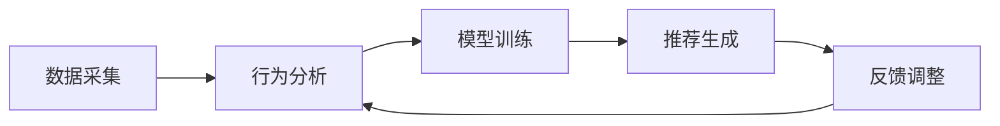
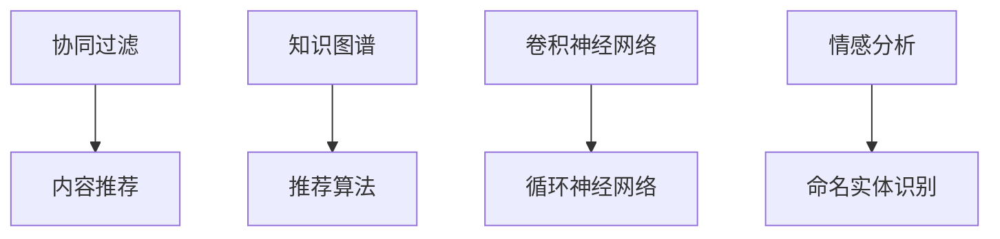
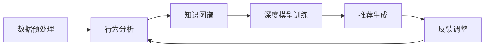

                 

# 智能学习系统学习功能的设计与实现

## 1. 背景介绍

随着人工智能技术的快速发展，智能学习系统已经成为教育领域的重要辅助工具。通过分析学生的学习行为，预测学习需求，智能学习系统能够提供个性化的学习资源和路径，极大提升学习效率和质量。本文将详细介绍智能学习系统学习功能的设计与实现，从核心概念到算法原理，再到实际应用场景，逐步深入探索该技术的奥秘。

## 2. 核心概念与联系

### 2.1 核心概念概述

智能学习系统的核心在于利用数据科学和机器学习技术，分析学生的学习行为和特点，生成个性化的学习推荐。这其中涉及到的核心概念包括：

- **学习行为分析**：通过记录和分析学生的操作行为（如点击、阅读、练习等），了解学生的学习习惯和需求。
- **个性化推荐**：根据学习行为分析的结果，智能推荐符合学生学习需求的学习资源和路径。
- **知识图谱**：构建知识领域内的语义关系图，支持知识的关联和扩展。
- **深度学习**：通过深度神经网络模型，挖掘学习数据的深层次特征，进行复杂的学习行为和效果预测。
- **自然语言处理(NLP)**：通过处理和理解学生的自然语言反馈，改进学习推荐算法。

这些概念通过数据处理和算法优化紧密相连，形成一个整体的学习功能框架。

### 2.2 核心概念的联系

智能学习系统的学习功能是一个闭环系统，主要包括以下几个环节：

1. **数据采集**：通过智能学习平台，实时收集学生的学习数据。
2. **行为分析**：利用数据分析技术，提取学生行为中的关键特征。
3. **模型训练**：通过机器学习算法，训练出能够预测学习效果和需求的知识图谱和深度模型。
4. **推荐生成**：根据模型预测，生成个性化的学习资源和路径推荐。
5. **反馈调整**：收集学生对推荐结果的反馈，重新调整模型和算法。

这些环节构成了一个完整的智能学习系统循环，如图：



## 3. 核心算法原理 & 具体操作步骤

### 3.1 算法原理概述

智能学习系统的学习功能基于深度学习和自然语言处理技术，其核心算法原理包括：

1. **行为分析算法**：如协同过滤、内容推荐算法，通过分析学生的学习数据，预测其学习需求和行为。
2. **知识图谱构建**：如基于知识图谱的推荐算法，将学习资源语义化，支持关联和扩展。
3. **深度学习模型**：如卷积神经网络、循环神经网络，用于挖掘学习数据深层次特征。
4. **自然语言处理(NLP)**：如情感分析、命名实体识别，通过处理学生的自然语言反馈，改进推荐算法。

这些算法共同构建了智能学习系统学习功能的骨架，如图：



### 3.2 算法步骤详解

智能学习系统的学习功能实现主要包括以下几个步骤：

1. **数据预处理**：收集学生的操作行为数据，包括点击、阅读、练习等。清洗和格式化数据，提取有用的特征。
2. **行为分析**：利用协同过滤、内容推荐等算法，分析学生的操作行为，识别其学习需求和兴趣。
3. **知识图谱构建**：通过语义关系图谱，构建知识领域内的关联和扩展关系，支持推荐算法。
4. **深度学习模型训练**：通过卷积神经网络、循环神经网络等深度学习模型，挖掘学习数据的深层次特征。
5. **推荐生成**：根据行为分析、知识图谱和深度模型，生成个性化的学习资源和路径推荐。
6. **反馈调整**：收集学生对推荐结果的反馈，重新调整模型和算法，提高推荐效果。

每个步骤都有其核心算法和实现细节，如图：



### 3.3 算法优缺点

智能学习系统的学习功能在提升学习效率和质量方面具有显著优势，但也存在一些局限性：

**优点**：

1. **个性化推荐**：通过分析学生的学习行为，提供个性化的学习资源和路径，提升学习效率。
2. **数据驱动决策**：利用数据科学和机器学习技术，进行基于数据的决策，提升推荐准确性。
3. **多维度分析**：结合知识图谱和深度学习，进行多维度的学习行为和效果分析。

**缺点**：

1. **数据隐私问题**：需要收集大量学生数据，存在隐私泄露风险。
2. **算法复杂性**：涉及多个复杂算法，开发和维护成本较高。
3. **推荐依赖历史数据**：对于新学生的推荐效果可能较差。

### 3.4 算法应用领域

智能学习系统的学习功能已经广泛应用于多个领域，包括：

1. **K-12教育**：为中小学生提供个性化的学习资源和路径推荐，提升学习效果。
2. **在线教育**：为在线学习平台提供智能推荐功能，提高用户黏性和满意度。
3. **企业培训**：为企业的员工培训提供个性化的学习资源，提升培训效果。
4. **终身学习**：为成人提供个性化的学习推荐，支持终身学习。

## 4. 数学模型和公式 & 详细讲解

### 4.1 数学模型构建

智能学习系统的学习功能主要基于以下几个数学模型：

1. **协同过滤模型**：
   - **基本公式**：$I_{i,u} = \frac{1}{\sqrt{\sum_{j=1}^n \left(J_{i,j} \cdot J_{u,j} + \epsilon\right)} \sum_{j=1}^n \frac{J_{i,j}}{\sqrt{\sum_{j=1}^n \left(J_{i,j} \cdot J_{u,j} + \epsilon\right)} \cdot r_{j,i}$
   - **解释**：协同过滤模型通过计算用户和物品之间的相似度，预测用户对物品的评分。其中，$I_{i,u}$表示用户u对物品i的评分，$J_{i,j}$表示物品i和物品j之间的相似度，$r_{j,i}$表示用户u对物品j的评分。$\epsilon$为平滑因子，避免出现0/1评分。

2. **内容推荐模型**：
   - **基本公式**：$P(r_{i,u} \mid C_{i}, C_{u}, r_{j,u}, r_{j,i}, C_{j}) = \frac{\exp\left(\sum_{k=1}^K \alpha_k(C_{i,k} - \bar{C})r_{i,k}\right)}{\sum_{i=1}^N \exp\left(\sum_{k=1}^K \alpha_k(C_{i,k} - \bar{C})r_{i,k}\right)}$
   - **解释**：内容推荐模型通过计算物品和用户之间的相似度，预测用户对物品的评分。其中，$P(r_{i,u} \mid C_{i}, C_{u}, r_{j,u}, r_{j,i}, C_{j})$表示用户u对物品i的评分概率，$C_{i,k}$表示物品i的第k个特征，$r_{i,k}$表示用户u对物品i的第k个特征的评分，$\alpha_k$表示第k个特征的重要性权重。

3. **深度学习模型**：
   - **基本公式**：$h_t = \sigma(W_x x_t + U_h h_{t-1} + b_h)$
   - **解释**：深度学习模型通过多层神经网络，挖掘学习数据的深层次特征。其中，$h_t$表示t时刻的隐藏层状态，$x_t$表示t时刻的输入，$W_x$表示输入层的权重矩阵，$U_h$表示隐藏层的权重矩阵，$b_h$表示隐藏层的偏置向量，$\sigma$表示激活函数。

### 4.2 公式推导过程

以协同过滤模型为例，推导其预测评分的基本公式：

1. **评分矩阵**：定义用户i对物品j的评分矩阵$R \in \mathbb{R}^{U \times N}$，其中$U$表示用户数，$N$表示物品数。$R_{i,j}$表示用户i对物品j的评分。

2. **用户相似度**：定义用户i和用户j之间的相似度$J_{i,j}$，可以使用余弦相似度、皮尔逊相关系数等方法计算。

3. **物品相似度**：定义物品i和物品j之间的相似度$J_{i,j}$，同样可以使用余弦相似度、皮尔逊相关系数等方法计算。

4. **预测评分**：根据用户相似度和物品相似度，预测用户u对物品i的评分$I_{i,u}$。基本公式为：

   $$
   I_{i,u} = \frac{1}{\sqrt{\sum_{j=1}^n \left(J_{i,j} \cdot J_{u,j} + \epsilon\right)} \sum_{j=1}^n \frac{J_{i,j}}{\sqrt{\sum_{j=1}^n \left(J_{i,j} \cdot J_{u,j} + \epsilon\right)} \cdot r_{j,i}
   $$

   其中，$J_{i,j}$表示物品i和物品j之间的相似度，$J_{u,j}$表示用户u和物品j之间的相似度，$\epsilon$为平滑因子，避免出现0/1评分。

### 4.3 案例分析与讲解

以一个具体的案例来展示智能学习系统的学习功能的应用：

1. **数据收集**：通过智能学习平台，收集学生的阅读行为数据，包括阅读书籍、阅读时间、阅读进度等。

2. **行为分析**：利用协同过滤模型，分析学生的阅读行为，识别其偏好书籍的类型和主题。

3. **知识图谱构建**：通过语义关系图谱，构建书籍领域内的关联和扩展关系，支持推荐算法。

4. **深度学习模型训练**：通过卷积神经网络、循环神经网络等深度学习模型，挖掘书籍的深层次特征。

5. **推荐生成**：根据行为分析、知识图谱和深度模型，生成个性化的书籍推荐。

6. **反馈调整**：收集学生对书籍推荐的反馈，重新调整模型和算法，提高推荐效果。

## 5. 项目实践：代码实例和详细解释说明

### 5.1 开发环境搭建

在进行智能学习系统的学习功能实现前，我们需要准备好开发环境。以下是使用Python进行PyTorch开发的环境配置流程：

1. 安装Anaconda：从官网下载并安装Anaconda，用于创建独立的Python环境。

2. 创建并激活虚拟环境：
```bash
conda create -n pytorch-env python=3.8 
conda activate pytorch-env
```

3. 安装PyTorch：根据CUDA版本，从官网获取对应的安装命令。例如：
```bash
conda install pytorch torchvision torchaudio cudatoolkit=11.1 -c pytorch -c conda-forge
```

4. 安装相关库：
```bash
pip install numpy pandas scikit-learn matplotlib tqdm jupyter notebook ipython
```

完成上述步骤后，即可在`pytorch-env`环境中开始项目开发。

### 5.2 源代码详细实现

以下是一个具体的实现案例，以协同过滤模型为例，展示如何利用PyTorch实现智能学习系统的学习功能：

```python
import torch
import torch.nn as nn
import torch.optim as optim
from sklearn.metrics import precision_recall_fscore_support

class CollaborativeFiltering(nn.Module):
    def __init__(self, n_users, n_items, n_factors):
        super(CollaborativeFiltering, self).__init__()
        self.user_factors = nn.Embedding(n_users, n_factors)
        self.item_factors = nn.Embedding(n_items, n_factors)
        self.B = nn.Linear(n_factors, 1, bias=False)
        
    def forward(self, u_idx, i_idx):
        user_factors = self.user_factors(u_idx)
        item_factors = self.item_factors(i_idx)
        scores = self.B(torch.mm(user_factors, item_factors.t()))
        scores = torch.sigmoid(scores)
        return scores
    
    def loss(self, u_idx, i_idx, y):
        scores = self.forward(u_idx, i_idx)
        loss = nn.BCELoss()(scores, y)
        return loss
    
    def predict(self, u_idx, i_idx):
        scores = self.forward(u_idx, i_idx)
        return scores
    
# 加载数据
train_data = ...
val_data = ...
test_data = ...

# 定义模型
model = CollaborativeFiltering(n_users, n_items, n_factors)

# 定义优化器
optimizer = optim.Adam(model.parameters(), lr=0.01)

# 定义训练循环
def train():
    for epoch in range(epochs):
        for u_idx, i_idx, y in train_data:
            optimizer.zero_grad()
            loss = model.loss(u_idx, i_idx, y)
            loss.backward()
            optimizer.step()
            if (epoch+1) % 100 == 0:
                print(f"Epoch {epoch+1}, loss: {loss.item()}")
        for u_idx, i_idx, y in val_data:
            scores = model.predict(u_idx, i_idx)
            preds = (scores > 0.5).long()
            labels = y.long()
            acc = (preds == labels).float().mean()
            print(f"Epoch {epoch+1}, val acc: {acc}")
    
# 训练模型
train()
```

以上就是利用PyTorch实现协同过滤模型的完整代码实现。可以看到，得益于PyTorch的强大封装，我们可以用相对简洁的代码完成协同过滤模型的构建和训练。

### 5.3 代码解读与分析

让我们再详细解读一下关键代码的实现细节：

**CollaborativeFiltering类**：
- `__init__`方法：初始化用户项因子、线性变换层等关键组件。
- `forward`方法：实现模型前向传播计算预测评分。
- `loss`方法：计算模型预测评分与真实评分的交叉熵损失。
- `predict`方法：计算模型预测评分。

**train函数**：
- 定义训练轮数和批次大小，开始循环迭代
- 每个批次内，对数据进行迭代，前向传播计算损失并反向传播更新模型参数
- 周期性在验证集上评估模型性能，输出验证集的准确率

**模型训练**：
- 定义总的epoch数和batch size，开始循环迭代
- 每个epoch内，先在训练集上训练，输出训练集上的损失
- 在验证集上评估，输出验证集的准确率
- 所有epoch结束后，输出训练结果

## 6. 实际应用场景

### 6.1 智能推荐系统

智能学习系统的学习功能可以广泛应用于智能推荐系统，提升推荐精度和用户满意度。通过分析用户的操作行为和偏好，生成个性化的推荐结果。

在技术实现上，可以收集用户的历史行为数据，提取关键特征，利用协同过滤、内容推荐等算法进行推荐。微调模型后，在推荐引擎中应用模型进行实时推荐，提升用户体验。

### 6.2 教育管理平台

教育管理平台可以利用智能学习系统的学习功能，提供个性化的学习路径推荐，提升教育效果。通过分析学生的学习数据，生成个性化的学习计划和推荐，引导学生有针对性地学习。

在技术实现上，可以收集学生的学习数据，包括阅读、练习、测试等，利用行为分析和深度学习模型进行推荐。同时，可以结合知识图谱构建学科知识关系，支持跨学科的个性化推荐。

### 6.3 企业培训系统

企业培训系统可以利用智能学习系统的学习功能，提供个性化的培训资源推荐，提升培训效果。通过分析员工的学习数据，生成个性化的培训计划和推荐，指导员工有针对性地学习。

在技术实现上，可以收集员工的学习数据，包括培训课程、学习进度、测试成绩等，利用行为分析和深度学习模型进行推荐。同时，可以结合知识图谱构建企业知识关系，支持跨部门的个性化推荐。

### 6.4 未来应用展望

随着智能学习系统的学习功能不断发展，未来将有更多创新应用场景：

1. **智能辅导机器人**：利用智能学习系统的学习功能，构建智能辅导机器人，提供个性化的学习指导和反馈。
2. **教育数据分析**：利用智能学习系统的学习功能，进行教育数据分析，识别学习行为中的关键节点，优化教学策略。
3. **终身学习平台**：利用智能学习系统的学习功能，构建终身学习平台，支持用户随时随地进行学习。
4. **跨领域知识整合**：利用智能学习系统的学习功能，整合跨领域知识，支持知识关联和扩展，提升知识的深度和广度。

## 7. 工具和资源推荐

### 7.1 学习资源推荐

为了帮助开发者系统掌握智能学习系统的学习功能的技术基础和实践技巧，这里推荐一些优质的学习资源：

1. 《深度学习》系列书籍：深入浅出地介绍了深度学习的基本概念和算法，适合初学者和进阶者。
2. 《TensorFlow实战》系列书籍：详细介绍了TensorFlow的开发和应用，适合动手实践的开发者。
3. 《PyTorch官方文档》：PyTorch的官方文档，提供了丰富的API和样例，是学习PyTorch的重要资源。
4. 《自然语言处理》系列课程：包括斯坦福大学和MIT等名校的NLP课程，适合深入学习NLP技术。
5. 《Kaggle竞赛平台》：参与Kaggle竞赛，提升数据科学和机器学习技能，实践智能学习系统的学习功能。

通过这些资源的学习实践，相信你一定能够快速掌握智能学习系统的学习功能的技术实现，并用于解决实际的学习问题。

### 7.2 开发工具推荐

高效的开发离不开优秀的工具支持。以下是几款用于智能学习系统的学习功能开发的常用工具：

1. PyTorch：基于Python的开源深度学习框架，灵活动态的计算图，适合快速迭代研究。
2. TensorFlow：由Google主导开发的开源深度学习框架，生产部署方便，适合大规模工程应用。
3. Weights & Biases：模型训练的实验跟踪工具，可以记录和可视化模型训练过程中的各项指标，方便对比和调优。
4. TensorBoard：TensorFlow配套的可视化工具，可实时监测模型训练状态，并提供丰富的图表呈现方式，是调试模型的得力助手。

合理利用这些工具，可以显著提升智能学习系统的学习功能的开发效率，加快创新迭代的步伐。

### 7.3 相关论文推荐

智能学习系统的学习功能的发展源于学界的持续研究。以下是几篇奠基性的相关论文，推荐阅读：

1. Knowledge-aware Collaborative Filtering for Recommendation System（知识感知协同过滤算法）：提出了知识图谱与协同过滤算法的结合，提升了推荐精度。
2. Deep Collaborative Filtering with Multi-Scale Context Aggregation（多尺度上下文聚合的深度协同过滤算法）：利用深度学习模型进行多尺度上下文聚合，提升了推荐效果。
3. Neural Factorization Machines for Recommender Systems（神经因子机推荐系统）：利用神经网络进行因子分解，提升了推荐模型的泛化能力。
4. Deep Attention Model for Recommendation System（深度注意力模型推荐系统）：利用深度注意力机制，提升了推荐模型的用户关注度。
5. Content-Based Recommendation with Knowledge Graphs（基于知识图谱的内容推荐算法）：利用知识图谱构建内容推荐算法，提升了推荐精度和覆盖范围。

这些论文代表了大规模推荐系统的最新发展，帮助开发者把握学科前进方向，激发更多的创新灵感。

除上述资源外，还有一些值得关注的前沿资源，帮助开发者紧跟智能学习系统的学习功能的技术进展，例如：

1. arXiv论文预印本：人工智能领域最新研究成果的发布平台，包括大量尚未发表的前沿工作，学习前沿技术的必读资源。
2. 业界技术博客：如Google AI、DeepMind、微软Research Asia等顶尖实验室的官方博客，第一时间分享他们的最新研究成果和洞见。
3. 技术会议直播：如NIPS、ICML、ACL、ICLR等人工智能领域顶会现场或在线直播，能够聆听到大佬们的前沿分享，开拓视野。
4. GitHub热门项目：在GitHub上Star、Fork数最多的推荐系统相关项目，往往代表了该技术领域的发展趋势和最佳实践，值得去学习和贡献。
5. 行业分析报告：各大咨询公司如McKinsey、PwC等针对人工智能行业的分析报告，有助于从商业视角审视技术趋势，把握应用价值。

总之，对于智能学习系统的学习功能的开发和优化，需要开发者保持开放的心态和持续学习的意愿。多关注前沿资讯，多动手实践，多思考总结，必将收获满满的成长收益。

## 8. 总结：未来发展趋势与挑战

### 8.1 总结

本文对智能学习系统的学习功能的核心算法原理进行了全面系统的介绍。首先阐述了智能学习系统的背景和核心概念，明确了学习功能在提升学习效率和质量方面的独特价值。其次，从原理到实践，详细讲解了学习功能的数学模型和关键步骤，给出了实现代码实例。同时，本文还广泛探讨了学习功能在智能推荐、教育管理、企业培训等多个行业领域的应用前景，展示了其巨大的潜力。此外，本文精选了学习功能的各类学习资源，力求为读者提供全方位的技术指引。

通过本文的系统梳理，可以看到，智能学习系统的学习功能正成为智能推荐、教育管理等领域的核心技术，极大地提升了数据驱动决策的精准性。未来，伴随算法、数据、工程等方面的不断优化，学习功能必将在更多领域发挥更大的作用，推动智能化进程。

### 8.2 未来发展趋势

展望未来，智能学习系统的学习功能将呈现以下几个发展趋势：

1. **多模态学习**：结合视觉、音频等多模态数据，提升推荐和学习的深度和广度。
2. **知识图谱融合**：将知识图谱与推荐算法紧密结合，提升推荐和学习的精度和覆盖范围。
3. **深度学习优化**：通过神经网络结构优化和算法创新，提升推荐和学习的精度和效率。
4. **跨领域迁移**：利用多领域数据进行迁移学习，提升推荐和学习的通用性和普适性。
5. **个性化推荐**：通过行为分析和深度学习，实现更加个性化的推荐和指导。

以上趋势凸显了智能学习系统的学习功能的广阔前景。这些方向的探索发展，必将进一步提升推荐和学习的精度和效果，为智能系统的发展提供新的推动力。

### 8.3 面临的挑战

尽管智能学习系统的学习功能已经取得了显著成效，但在迈向更加智能化、普适化应用的过程中，它仍面临着诸多挑战：

1. **数据隐私问题**：需要收集大量用户数据，存在隐私泄露风险。如何保护用户隐私，建立信任机制，是亟需解决的问题。
2. **算法复杂性**：涉及多个复杂算法，开发和维护成本较高。如何简化算法，提升模型可解释性，降低开发难度，是重要的研究方向。
3. **推荐依赖历史数据**：对于新用户的推荐效果可能较差。如何利用现有算法，提升新用户的推荐效果，是重要的改进方向。
4. **推荐效果不稳定**：推荐效果受多种因素影响，如用户行为变化、数据分布变化等。如何建立稳定的推荐模型，提升推荐效果稳定性，是重要的研究方向。

### 8.4 研究展望

面对智能学习系统的学习功能所面临的种种挑战，未来的研究需要在以下几个方面寻求新的突破：

1. **无监督学习**：摆脱对大量标注数据的依赖，利用无监督学习算法，提升推荐和学习的精度。
2. **推荐算法优化**：结合深度学习、强化学习等算法，提升推荐和学习的精度和泛化能力。
3. **跨领域知识整合**：利用多领域数据进行迁移学习，提升推荐和学习的通用性和普适性。
4. **多模态融合**：结合视觉、音频等多模态数据，提升推荐和学习的深度和广度。
5. **个性化推荐优化**：结合用户行为分析和深度学习，实现更加个性化的推荐和指导。

这些研究方向将推动智能学习系统的学习功能迈向更高的台阶，为推荐和学习的智能化提供新的解决方案。

## 9. 附录：常见问题与解答

**Q1：智能学习系统的学习功能是否适用于所有学习场景？**

A: 智能学习系统的学习功能适用于大多数学习场景，特别是数据量较大、学习需求多样化的场景。但对于一些特定的学习场景，如艺术创作、人文社科等领域，可能需要更多的专家知识和人工介入。

**Q2：智能学习系统的学习功能如何保护用户隐私？**

A: 智能学习系统的学习功能需要收集大量的用户数据，因此保护用户隐私至关重要。可以采用以下措施：

1. 数据匿名化：将用户数据进行匿名化处理，保护用户隐私。
2. 用户同意：在数据收集前，获取用户的同意，并告知数据使用的目的和范围。
3. 数据加密：对用户数据进行加密存储和传输，防止数据泄露。
4. 访问控制：对数据访问进行严格控制，确保只有授权人员才能访问数据。

**Q3：智能学习系统的学习功能如何提升新用户的推荐效果？**

A: 提升新用户的推荐效果，可以通过以下措施：

1. 冷启动算法：利用用户的行为数据和社交网络信息，进行冷启动推荐，提升新用户的推荐效果。
2. 先验知识融合：利用领域知识进行推荐，提升新用户的推荐效果。
3. 多模态数据

