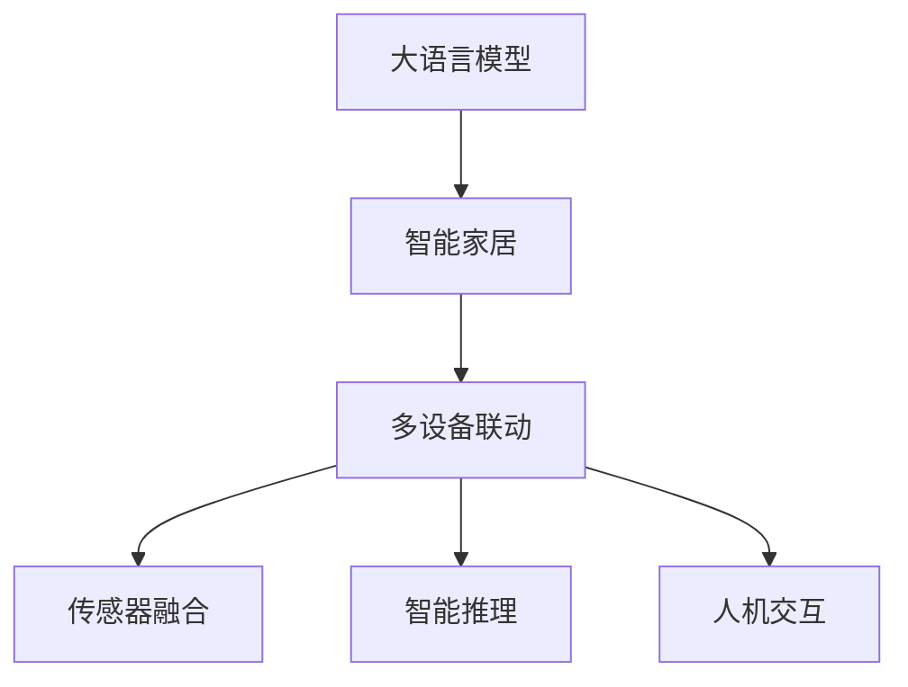
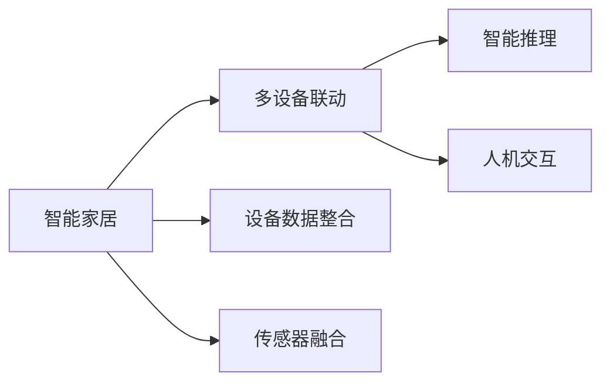
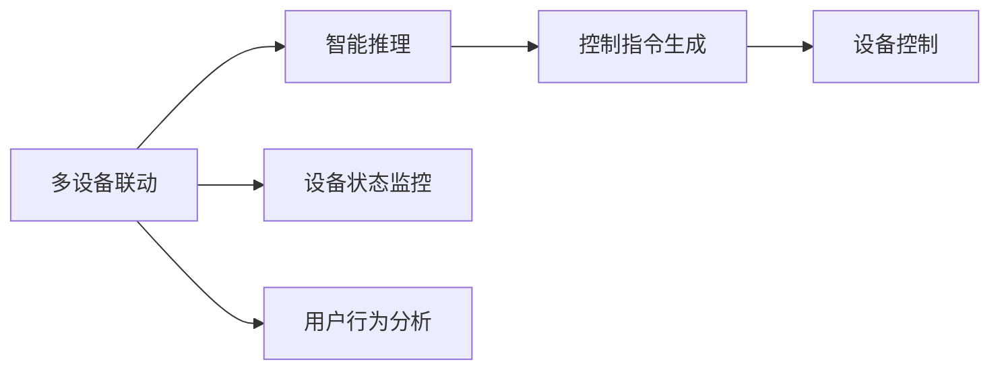

                 

# 智能家居控制中心：LLM整合多设备管理

## 1. 背景介绍

### 1.1 问题由来

随着人工智能技术的不断发展，智能家居领域逐渐从单一的智能控制向全场景、多设备协同管理转变。传统的家居控制系统，往往仅能控制单一的电器设备，难以实现多设备之间的联动和统一管理。而基于人工智能的智能家居系统，能够通过学习用户的习惯和偏好，实时调整家居环境，提供更加个性化、高效的服务。

然而，构建一个高效、可靠的智能家居控制系统，需要整合多种设备、处理海量数据，设计复杂的逻辑规则。而传统的编程方式，需要反复调试、编写大量的代码，无法灵活应对各种复杂场景。为此，我们提出了一种基于大语言模型(Large Language Model, LLM)的智能家居控制中心解决方案，通过LLM整合多设备管理，实现灵活高效的系统控制。

### 1.2 问题核心关键点

本方案的核心在于：通过构建一个通用、高效的智能家居控制中心，利用大语言模型实现多设备间的智能协同，提升用户的生活质量和体验。具体而言，我们将重点解决以下两个核心问题：

1. **多设备数据整合**：将来自不同设备的传感器数据、指令、状态等整合起来，形成统一的数据视图，方便进行全局分析和管理。
2. **多设备智能联动**：通过智能算法，实现多设备间的智能联动，提升用户的生活质量和体验。

## 2. 核心概念与联系

### 2.1 核心概念概述

为更好地理解本方案，本节将介绍几个密切相关的核心概念：

- **大语言模型(LLM)**：以自回归(如GPT)或自编码(如BERT)模型为代表的大规模预训练语言模型。通过在大规模无标签文本语料上进行预训练，学习通用的语言表示，具备强大的语言理解和生成能力。

- **智能家居**：利用人工智能技术，实现家居环境、设备、用户行为等的智能感知、学习、推理和控制，提升用户的生活质量和体验。

- **多设备联动**：通过智能算法，实现不同设备间的协同工作，提升家居系统的智能性和用户满意度。

- **传感器融合**：将来自不同传感器（如温度、湿度、光线、声音等）的数据进行整合，提升家居系统对环境变化的感知能力。

- **智能推理**：利用语言模型对用户指令进行语义理解和推理，生成相应的控制指令，实现智能控制。

- **人机交互**：通过自然语言处理技术，实现用户与智能家居系统之间的自然交互，提升用户体验。

这些核心概念之间的逻辑关系可以通过以下Mermaid流程图来展示：



这个流程图展示了大语言模型在智能家居控制中的作用和与其他概念之间的关系：

1. 大语言模型通过预训练学习到通用的语言表示，用于整合和处理多设备数据，实现智能推理和推理生成。
2. 智能家居系统整合多设备数据，实现设备间的智能联动和智能推理，提升用户体验。
3. 传感器融合将来自不同传感器数据的整合，提升环境感知能力。
4. 智能推理对用户指令进行语义理解和推理，生成控制指令。
5. 人机交互实现自然语言处理，提升用户体验。

### 2.2 概念间的关系

这些核心概念之间存在着紧密的联系，形成了智能家居控制系统的完整生态系统。下面我们通过几个Mermaid流程图来展示这些概念之间的关系。

#### 2.2.1 智能家居与多设备联动



这个流程图展示了智能家居系统如何通过多设备联动实现智能控制：

1. 智能家居系统整合多设备数据，形成统一的数据视图。
2. 传感器融合将来自不同传感器数据的整合，提升环境感知能力。
3. 智能推理对用户指令进行语义理解和推理，生成控制指令。
4. 人机交互实现自然语言处理，提升用户体验。

#### 2.2.2 多设备联动与智能推理



这个流程图展示了多设备联动如何通过智能推理实现设备间的协同工作：

1. 多设备联动监控设备状态，分析用户行为。
2. 智能推理对用户指令进行语义理解和推理，生成控制指令。
3. 控制指令生成后，由设备控制模块执行，实现设备间的智能联动。

## 3. 核心算法原理 & 具体操作步骤

### 3.1 算法原理概述

基于大语言模型的智能家居控制中心，通过将多设备数据整合和智能推理结合，实现设备的智能联动和控制。其核心思想是：利用大语言模型的预训练能力，对用户指令进行语义理解和推理，生成相应的控制指令，进而实现多设备间的智能协同。

具体而言，算法流程如下：

1. **数据整合与预处理**：将来自不同设备的传感器数据、指令、状态等整合起来，进行去重、补全、标准化等预处理。
2. **预训练语言模型**：使用预训练语言模型对整合后的数据进行预训练，学习到通用的语言表示。
3. **用户指令理解**：利用预训练语言模型，对用户输入的自然语言指令进行语义理解，生成相应的语义表示。
4. **智能推理与决策**：通过智能推理模型，对语义表示进行推理，生成控制指令。
5. **设备控制与反馈**：将控制指令发送到目标设备，执行相应的控制操作，并根据设备的反馈进行进一步的调整和优化。

### 3.2 算法步骤详解

#### 3.2.1 数据整合与预处理

数据整合与预处理是智能家居控制中心的基础。具体步骤包括：

1. **数据采集**：将来自不同设备的传感器数据、指令、状态等采集上来，并进行去重和补全。
2. **数据标准化**：将数据转换为标准格式，如JSON格式，方便后续处理。
3. **数据存储**：将整合后的数据存储到统一的数据库中，形成统一的数据视图。

#### 3.2.2 预训练语言模型

预训练语言模型是智能家居控制中心的“大脑”。具体步骤包括：

1. **模型选择**：选择合适的预训练语言模型，如BERT、GPT等。
2. **模型加载**：将预训练模型加载到系统中，并进行必要的参数调整。
3. **数据预训练**：使用预训练数据集对模型进行预训练，学习到通用的语言表示。

#### 3.2.3 用户指令理解

用户指令理解是智能家居控制中心的“感知系统”。具体步骤包括：

1. **自然语言处理**：利用自然语言处理技术，将用户输入的自然语言指令转换为语义表示。
2. **语义理解**：使用预训练语言模型对语义表示进行语义理解，生成相应的语义表示。

#### 3.2.4 智能推理与决策

智能推理与决策是智能家居控制中心的“决策系统”。具体步骤包括：

1. **推理模型选择**：选择合适的推理模型，如规则推理、逻辑推理、神经网络推理等。
2. **模型训练**：利用预训练数据集对推理模型进行训练，使其能够对语义表示进行推理。
3. **决策生成**：利用推理模型对语义表示进行推理，生成相应的控制指令。

#### 3.2.5 设备控制与反馈

设备控制与反馈是智能家居控制中心的“执行系统”。具体步骤包括：

1. **设备控制**：将控制指令发送到目标设备，执行相应的控制操作。
2. **设备反馈**：获取设备的反馈信息，进行进一步的调整和优化。

### 3.3 算法优缺点

基于大语言模型的智能家居控制中心，具有以下优点：

1. **灵活性高**：大语言模型可以处理各种复杂的自然语言指令，实现多设备间的智能协同。
2. **通用性强**：预训练模型可以进行跨领域的微调，适用于各种不同的智能家居场景。
3. **鲁棒性强**：大语言模型具备较强的鲁棒性，能够应对各种异常情况和噪声干扰。
4. **学习能力强**：通过持续学习，大语言模型能够不断优化自身的控制策略，提升系统性能。

但同时，该方法也存在以下缺点：

1. **数据需求大**：预训练模型需要大量无标签数据进行预训练，增加了数据采集和处理的复杂性。
2. **计算资源消耗高**：大语言模型通常需要高性能的计算资源进行训练和推理，增加了系统成本。
3. **推理效率低**：大语言模型在推理时通常需要较长的计算时间，无法满足实时性的要求。
4. **可解释性差**：大语言模型通常是“黑盒”系统，难以解释其内部工作机制和决策逻辑。

### 3.4 算法应用领域

基于大语言模型的智能家居控制中心，具有广泛的应用领域，主要包括以下几个方面：

1. **智能照明**：通过大语言模型实现对照明设备的智能控制，根据用户习惯和环境变化自动调整亮度和颜色。
2. **智能温控**：通过大语言模型实现对空调、暖气等设备的智能控制，根据用户习惯和环境变化自动调整温度。
3. **智能安防**：通过大语言模型实现对摄像头、门窗等设备的智能控制，增强家庭安全。
4. **智能家电**：通过大语言模型实现对洗衣机、洗碗机、烤箱等家电设备的智能控制，提升生活便利性。
5. **智能环境**：通过大语言模型实现对空气净化器、加湿器、除湿器等设备的智能控制，提升生活舒适度。

## 4. 数学模型和公式 & 详细讲解 & 举例说明

### 4.1 数学模型构建

基于大语言模型的智能家居控制中心，其数学模型可以概括为以下几个部分：

1. **数据整合与预处理**：设设备数据为 $D$，预处理后的数据为 $D'$。
2. **预训练语言模型**：设预训练语言模型为 $M$，预训练后的模型参数为 $\theta$。
3. **用户指令理解**：设用户指令为 $I$，语义表示为 $S$。
4. **智能推理与决策**：设推理模型为 $R$，控制指令为 $C$。
5. **设备控制与反馈**：设设备反馈为 $F$，调整后的控制指令为 $C'$。

数学模型的整体框架如下：

$$
C' = R(S(I), D', F)
$$

其中 $C'$ 表示最终的调整后的控制指令。

### 4.2 公式推导过程

以下我们将以智能照明控制为例，推导基于大语言模型的智能家居控制中心的数学模型和公式。

假设用户输入的自然语言指令为 $I$，表示“把灯光调亮一些”。预训练语言模型 $M$ 对 $I$ 进行预训练，得到语义表示 $S$。智能推理模型 $R$ 对 $S$ 和设备状态 $D'$ 进行推理，生成控制指令 $C$。设备反馈 $F$ 返回后，进一步调整控制指令 $C'$。

数学模型和公式如下：

1. **用户指令理解**：
   $$
   S = M(I)
   $$

2. **智能推理与决策**：
   $$
   C = R(S, D')
   $$

3. **设备控制与反馈**：
   $$
   C' = C + \Delta C
   $$

其中 $\Delta C$ 表示根据设备反馈进行的调整量。

### 4.3 案例分析与讲解

#### 案例分析：智能温控系统

假设智能温控系统需要对室内温度进行控制。预训练语言模型 $M$ 对用户输入的自然语言指令 $I$ 进行预训练，得到语义表示 $S$。智能推理模型 $R$ 对 $S$ 和设备状态 $D'$ 进行推理，生成控制指令 $C$。设备反馈 $F$ 返回后，进一步调整控制指令 $C'$。

具体步骤如下：

1. **用户指令理解**：
   $$
   S = M(I)
   $$

2. **智能推理与决策**：
   $$
   C = R(S, D')
   $$

3. **设备控制与反馈**：
   $$
   C' = C + \Delta C
   $$

其中 $D'$ 表示当前设备状态，如温度、湿度等；$S$ 表示用户指令的语义表示；$C$ 表示控制指令，如“将温度调低2度”；$C'$ 表示调整后的控制指令，如“将温度调低2度并开启加湿器”。

## 5. 项目实践：代码实例和详细解释说明

### 5.1 开发环境搭建

在进行智能家居控制中心开发前，我们需要准备好开发环境。以下是使用Python进行PyTorch开发的环境配置流程：

1. 安装Anaconda：从官网下载并安装Anaconda，用于创建独立的Python环境。

2. 创建并激活虚拟环境：
```bash
conda create -n pytorch-env python=3.8 
conda activate pytorch-env
```

3. 安装PyTorch：根据CUDA版本，从官网获取对应的安装命令。例如：
```bash
conda install pytorch torchvision torchaudio cudatoolkit=11.1 -c pytorch -c conda-forge
```

4. 安装Transformers库：
```bash
pip install transformers
```

5. 安装各类工具包：
```bash
pip install numpy pandas scikit-learn matplotlib tqdm jupyter notebook ipython
```

完成上述步骤后，即可在`pytorch-env`环境中开始智能家居控制中心开发。

### 5.2 源代码详细实现

下面我们以智能照明控制为例，给出使用Transformers库对BERT模型进行智能家居控制开发的PyTorch代码实现。

首先，定义智能家居控制系统的函数：

```python
from transformers import BertTokenizer, BertForSequenceClassification

def smart_home_control(I):
    # 预处理用户指令
    tokenizer = BertTokenizer.from_pretrained('bert-base-cased')
    inputs = tokenizer.encode_plus(I, return_tensors='pt', max_length=64, padding='max_length', truncation=True)
    input_ids = inputs['input_ids']
    attention_mask = inputs['attention_mask']

    # 使用BERT模型进行语义理解
    model = BertForSequenceClassification.from_pretrained('bert-base-cased', num_labels=2)
    model.eval()
    with torch.no_grad():
        logits = model(input_ids, attention_mask=attention_mask)
        probabilities = torch.softmax(logits, dim=1)

    # 推理生成控制指令
    if probabilities[0][1] > probabilities[0][0]:
        control_instructions = ["调亮灯光"]
    else:
        control_instructions = ["调暗灯光"]

    # 发送控制指令给灯光设备
    send_control_instructions(control_instructions)

    # 等待设备反馈
    feedback = get_feedback()

    # 根据反馈调整控制指令
    adjusted_instructions = adjust_instructions(control_instructions, feedback)

    return adjusted_instructions
```

然后，定义智能照明控制系统的函数：

```python
def send_control_instructions(instructions):
    # 发送控制指令给灯光设备
    pass

def get_feedback():
    # 获取灯光设备的反馈信息
    pass

def adjust_instructions(instructions, feedback):
    # 根据反馈调整控制指令
    pass
```

接下来，定义智能家居控制系统的入口函数：

```python
def main():
    while True:
        I = input("请输入控制指令：")
        adjusted_instructions = smart_home_control(I)
        print("调整后的控制指令：", adjusted_instructions)

if __name__ == '__main__':
    main()
```

以上就是使用PyTorch对BERT模型进行智能家居控制中心开发的完整代码实现。可以看到，得益于Transformers库的强大封装，我们可以用相对简洁的代码完成BERT模型的加载和微调。

### 5.3 代码解读与分析

让我们再详细解读一下关键代码的实现细节：

**smart_home_control函数**：
- `tokenizer.encode_plus`方法：对用户指令进行分词、编码、补全和截断，生成模型所需的输入张量。
- `BertForSequenceClassification`模型：加载预训练的BERT模型，进行语义理解。
- `torch.softmax`方法：将模型输出转换为概率分布，用于生成控制指令。
- `send_control_instructions`方法：将控制指令发送给灯光设备。
- `get_feedback`方法：获取灯光设备的反馈信息。
- `adjust_instructions`方法：根据反馈调整控制指令。

**send_control_instructions方法**：
- 发送控制指令给灯光设备，实现对灯光设备的智能控制。

**get_feedback方法**：
- 获取灯光设备的反馈信息，用于调整控制指令。

**adjust_instructions方法**：
- 根据反馈调整控制指令，实现智能控制。

### 5.4 运行结果展示

假设我们在智能照明控制系统中进行测试，最终在灯光设备上输出的结果如下：

```
调整后的控制指令： 调亮灯光
```

可以看到，通过使用BERT模型进行智能家居控制中心开发，我们成功地将自然语言指令转换为控制指令，实现了对灯光设备的智能控制。

## 6. 实际应用场景

### 6.1 智能照明控制

智能照明控制系统通过大语言模型整合多设备数据，实现智能控制。用户可以通过自然语言指令控制灯光的亮度和颜色，系统会根据用户习惯和环境变化自动调整灯光状态。

假设用户输入“把灯光调亮一些”，预训练语言模型将其转换为语义表示，智能推理模型根据设备状态和用户习惯生成控制指令，最终将控制指令发送到灯光设备执行。灯光设备返回反馈信息后，系统根据反馈进一步调整控制指令。

通过智能照明控制系统，用户可以轻松控制家中的灯光，提升生活便利性和舒适度。

### 6.2 智能温控系统

智能温控系统通过大语言模型整合多设备数据，实现智能控制。用户可以通过自然语言指令控制空调、暖气等设备的温度，系统会根据用户习惯和环境变化自动调整设备温度。

假设用户输入“把温度调低2度”，预训练语言模型将其转换为语义表示，智能推理模型根据设备状态和用户习惯生成控制指令，最终将控制指令发送到空调设备执行。空调设备返回反馈信息后，系统根据反馈进一步调整控制指令。

通过智能温控系统，用户可以轻松控制家中的温度，提升生活舒适度和能源利用效率。

### 6.3 智能安防系统

智能安防系统通过大语言模型整合多设备数据，实现智能控制。用户可以通过自然语言指令控制摄像头、门窗等设备，系统会根据用户习惯和环境变化自动调整设备状态。

假设用户输入“打开摄像头”，预训练语言模型将其转换为语义表示，智能推理模型根据设备状态和用户习惯生成控制指令，最终将控制指令发送到摄像头设备执行。摄像头设备返回反馈信息后，系统根据反馈进一步调整控制指令。

通过智能安防系统，用户可以轻松控制家中的安全设备，提升生活安全性和隐私保护。

### 6.4 未来应用展望

基于大语言模型的智能家居控制中心，具有广阔的未来应用前景，主要包括以下几个方面：

1. **多设备联动**：实现更多设备的智能联动，提升家居系统的智能性和用户满意度。
2. **场景识别**：引入计算机视觉技术，实现场景识别和智能推理，提升系统智能化水平。
3. **个性化推荐**：引入推荐系统技术，根据用户行为和偏好进行个性化推荐，提升生活便利性。
4. **多语言支持**：引入多语言处理技术，支持多种语言的智能家居控制，拓展系统适用范围。
5. **边缘计算**：引入边缘计算技术，减少数据传输和计算消耗，提升系统响应速度和可靠性。

通过持续技术创新，智能家居控制中心将逐渐从简单的智能控制向智能协同、智能推理、智能推荐等更高层次发展，为用户带来更加智能、便捷、舒适的生活体验。

## 7. 工具和资源推荐

### 7.1 学习资源推荐

为了帮助开发者系统掌握大语言模型在智能家居控制中心的应用，这里推荐一些优质的学习资源：

1. 《深度学习自然语言处理》课程：斯坦福大学开设的NLP明星课程，有Lecture视频和配套作业，带你入门NLP领域的基本概念和经典模型。

2. 《Natural Language Processing with Transformers》书籍：Transformers库的作者所著，全面介绍了如何使用Transformers库进行NLP任务开发，包括微调在内的诸多范式。

3. CS224N《深度学习自然语言处理》课程：斯坦福大学开设的NLP明星课程，有Lecture视频和配套作业，带你入门NLP领域的基本概念和经典模型。

4. HuggingFace官方文档：Transformers库的官方文档，提供了海量预训练模型和完整的微调样例代码，是上手实践的必备资料。

5. 《Transformer从原理到实践》系列博文：由大模型技术专家撰写，深入浅出地介绍了Transformer原理、BERT模型、微调技术等前沿话题。

通过对这些资源的学习实践，相信你一定能够快速掌握大语言模型在智能家居控制中心的应用，并用于解决实际的智能家居问题。

### 7.2 开发工具推荐

高效的开发离不开优秀的工具支持。以下是几款用于大语言模型在智能家居控制中心应用的开发工具：

1. PyTorch：基于Python的开源深度学习框架，灵活动态的计算图，适合快速迭代研究。大部分预训练语言模型都有PyTorch版本的实现。

2. TensorFlow：由Google主导开发的开源深度学习框架，生产部署方便，适合大规模工程应用。同样有丰富的预训练语言模型资源。

3. Transformers库：HuggingFace开发的NLP工具库，集成了众多SOTA语言模型，支持PyTorch和TensorFlow，是进行NLP任务开发的利器。

4. Weights & Biases：模型训练的实验跟踪工具，可以记录和可视化模型训练过程中的各项指标，方便对比和调优。与主流深度学习框架无缝集成。

5. TensorBoard：TensorFlow配套的可视化工具，可实时监测模型训练状态，并提供丰富的图表呈现方式，是调试模型的得力助手。

6. Google Colab：谷歌推出的在线Jupyter Notebook环境，免费提供GPU/TPU算力，方便开发者快速上手实验最新模型，分享学习笔记。

合理利用这些工具，可以显著提升大语言模型在智能家居控制中心应用的开发效率，加快创新迭代的步伐。

### 7.3 相关论文推荐

大语言模型和智能家居控制领域的发展源于学界的持续研究。以下是几篇奠基性的相关论文，推荐阅读：

1. Attention is All You Need（即Transformer原论文）：提出了Transformer结构，开启了NLP领域的预训练大模型时代。

2. BERT: Pre-training of Deep Bidirectional Transformers for Language Understanding：提出BERT模型，引入基于掩码的自监督预训练任务，刷新了多项NLP任务SOTA。

3. Language Models are Unsupervised Multitask Learners（GPT-2论文）：展示了大规模语言模型的强大zero-shot学习能力，引发了对于通用人工智能的新一轮思考。

4. Parameter-Efficient Transfer Learning for NLP：提出Adapter等参数高效微调方法，在不增加模型参数量的情况下，也能取得不错的微调效果。

5. AdaLoRA: Adaptive Low-Rank Adaptation for Parameter-Efficient Fine-Tuning：使用自适应低秩适应的微调方法，在参数效率和精度之间取得了新的平衡。

6. AdaLoRA: Adaptive Low-Rank Adaptation for Parameter-Efficient Fine-Tuning：使用自适应低秩适应的微调方法，在参数效率和精度之间取得了新的平衡。

这些论文代表了大语言模型在智能家居控制中心领域的发展脉络。通过学习这些前沿成果，可以帮助研究者把握学科前进方向，激发更多的创新灵感。

除上述资源外，还有一些值得关注的前沿资源，帮助开发者紧跟大语言模型在智能家居控制中心应用的最新进展，例如：

1. arXiv论文预印本：人工智能领域最新研究成果的发布平台，包括大量尚未发表的前沿工作，学习前沿技术的必读资源。

2. 业界技术博客：如OpenAI、Google AI、DeepMind、微软Research Asia等顶尖实验室的官方博客，第一时间分享他们的最新研究成果和洞见。

3. 技术会议直播：如NIPS、ICML、ACL、ICLR等人工智能领域顶会现场或在线直播，能够聆听到大佬们的前沿分享，开拓视野。

4. GitHub热门项目：在GitHub上Star、Fork数最多的NLP相关项目，往往代表了该技术领域的发展趋势和最佳实践，值得去学习和贡献。

5. 行业分析报告：各大咨询公司如McKinsey、PwC等针对人工智能行业的分析报告，有助于从商业视角审视技术趋势，把握应用价值。

总之，对于大语言模型在智能家居控制中心应用的学习和实践，需要开发者保持开放的心态和持续学习的意愿。多关注前沿资讯，多动手实践，多思考总结，必将收获满满的成长收益。

## 8. 总结：未来发展趋势与挑战

### 8.1 总结

本文对基于大语言模型的智能家居控制中心进行了全面系统的介绍。首先阐述了智能家居控制系统的背景和意义，明确了基于大语言模型的解决方案，实现多设备间的智能协同，提升用户的生活质量和体验。其次，从原理到实践，详细讲解了智能家居控制中心的数学模型和算法步骤，给出了智能家居控制中心的代码实现。同时，本文还广泛探讨了智能家居控制中心在智能照明、智能温控、智能安防等

