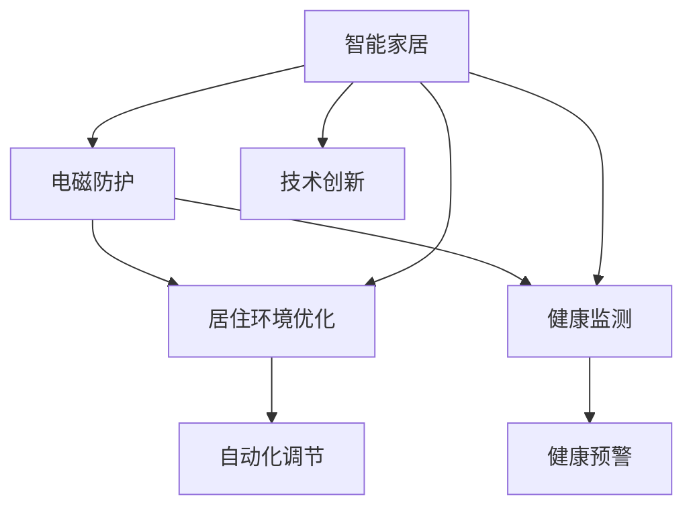

                 

# 智能家居电磁防护创业：居住环境的健康优化

> 关键词：智能家居,电磁防护,居住环境,健康优化,技术创新,创业策略

## 1. 背景介绍

随着科技的迅猛发展，智能家居系统已经成为现代居住环境的标配。然而，在享受智能家居带来便利的同时，我们也不得不面对一个日益严重的问题——电磁污染。电磁污染不仅影响人们的身体健康，还可能对设备的稳定性和安全性造成威胁。因此，如何在智能家居系统中有效防护电磁污染，优化居住环境，已经成为一项重要的技术课题。

### 1.1 问题由来

电磁污染是由于电力系统、无线通讯设备等产生的电磁辐射对人类生活造成的不良影响。在智能家居系统中，电磁污染主要来自于智能设备本身的工作频率、信号强度以及无线通信协议。这些电磁波不仅可能对人体健康造成损害，如头晕、失眠、皮肤瘙痒等症状，还可能对电器设备的正常工作造成干扰，甚至引发安全事故。因此，在智能家居系统中进行有效的电磁防护，不仅有助于提升居住环境的质量，还能保障用户的健康安全。

### 1.2 问题核心关键点

智能家居电磁防护的核心在于理解电磁污染的原理，并采取针对性的技术手段进行防护。具体而言，电磁防护需要考虑以下几个方面：

- **电磁波的识别与测量**：通过传感设备或仿真软件，识别和测量智能家居环境中电磁波的频率、强度和分布情况。
- **防护材料的选取**：选择合适的材料或设备，如金属网、屏蔽膜、吸波材料等，对电磁波进行屏蔽或吸收。
- **智能控制策略**：通过软件算法，实时监测和控制智能设备的电磁输出，避免电磁干扰。
- **用户健康监测**：监测用户健康状态，建立健康预警系统，提供针对性的防护建议。

### 1.3 问题研究意义

智能家居电磁防护的研究，对于提升居住环境质量和用户健康具有重要意义：

1. **优化居住环境**：通过有效防护电磁污染，减少电磁波对人体和设备的干扰，创造更加健康、舒适的居住环境。
2. **保障用户健康**：避免长期暴露于电磁污染中，预防潜在的健康风险，提升用户的生活质量。
3. **推动技术创新**：电磁防护技术的应用，不仅能够提升智能家居系统的稳定性，还能激发更多的技术创新，促进智能家居产业的发展。
4. **助力环保事业**：减少电磁污染，对保护环境、实现可持续发展具有积极作用。

## 2. 核心概念与联系

### 2.1 核心概念概述

为了更好地理解智能家居电磁防护的原理和技术，本节将介绍几个关键概念：

- **智能家居**：基于物联网技术，通过网络将家庭中的各种智能设备互联互通，实现自动化、智能化管理的居住环境。
- **电磁防护**：通过物理或软件手段，降低或消除电磁波对人类和设备的干扰，保障安全的技术手段。
- **居住环境优化**：利用科技手段提升居住环境的质量，如室内空气质量、温度湿度、噪声等，使其更加健康舒适。
- **健康监测**：通过传感器等设备，实时监测用户健康状态，如心电图、血压、心率等，预防和应对潜在的健康风险。
- **技术创新**：结合最新的人工智能、物联网等技术，推动智能家居系统在电磁防护、健康监测等方面的创新发展。

这些概念之间通过以下Mermaid流程图展示其逻辑关系：



### 2.2 概念间的关系

以上核心概念之间存在着紧密的联系，形成了智能家居电磁防护的完整生态系统。下面是几个核心概念之间的逻辑关系说明：

- **智能家居与电磁防护**：智能家居系统中无处不在的无线通讯和智能设备，是电磁污染的主要来源。电磁防护技术的应用，可以有效减少这些电磁波的干扰。
- **居住环境优化与电磁防护**：电磁污染直接影响居住环境的舒适度，通过电磁防护技术，可以提升居住环境的整体质量。
- **健康监测与电磁防护**：电磁污染可能对人体健康造成危害，健康监测可以实时评估用户的健康状况，提供及时的防护建议。
- **技术创新与电磁防护**：技术创新是推动智能家居电磁防护发展的核心动力，新算法、新材料的开发，将不断提升电磁防护的效果。

## 3. 核心算法原理 & 具体操作步骤

### 3.1 算法原理概述

智能家居电磁防护的本质是对电磁波的识别、测量、防护和控制。其核心算法原理包括以下几个方面：

- **电磁波识别**：通过传感设备或仿真软件，识别电磁波的频率、强度和分布情况。
- **电磁波测量**：使用高精度仪器，对环境中的电磁波进行定量测量，为防护策略提供数据支持。
- **电磁波屏蔽**：选择合适的屏蔽材料或设备，如金属网、屏蔽膜、吸波材料等，对电磁波进行有效屏蔽。
- **电磁波控制**：通过软件算法，实时监测和控制智能设备的电磁输出，避免电磁干扰。

### 3.2 算法步骤详解

智能家居电磁防护的具体操作步骤如下：

1. **环境评估**：使用电磁波测量设备，对居住环境中的电磁波进行全面评估，确定主要污染源和影响区域。
2. **设备筛选**：根据评估结果，筛选出可能产生较高电磁污染的设备，如无线路由器、智能灯泡等。
3. **材料选取**：选择合适的电磁防护材料，如金属网、屏蔽膜、吸波材料等，对选定的设备进行防护。
4. **软件实现**：开发智能家居系统中的电磁防护模块，实现对设备电磁输出的实时监测和控制。
5. **健康监测**：通过传感器等设备，实时监测用户的健康状态，建立健康预警系统。
6. **用户反馈**：收集用户对电磁防护效果的反馈，不断优化防护策略。

### 3.3 算法优缺点

智能家居电磁防护技术具有以下优点：

- **精准防护**：通过精确测量和屏蔽，可以有效减少电磁污染，提升居住环境质量。
- **自动化调节**：通过软件算法实现智能控制，减少人为干预，提高防护效果。
- **实时监测**：结合健康监测技术，实现对用户健康状态的实时评估，提供及时的防护建议。

同时，也存在一些局限性：

- **成本较高**：防护材料和设备的选择、安装和维护需要较高的成本。
- **技术复杂**：需要综合应用传感器技术、软件算法和硬件设备，技术门槛较高。
- **效果评估**：电磁污染的效果评估相对复杂，需要长期的观察和验证。

### 3.4 算法应用领域

智能家居电磁防护技术已经在多个领域得到了应用，具体包括：

- **居住环境优化**：通过对电磁污染的防护，提升居住环境的舒适度，如减少Wi-Fi信号干扰，提升电视信号质量等。
- **健康监测**：结合健康监测技术，预防电磁污染对人体健康的影响，如监测智能设备附近的辐射水平，提醒用户远离高辐射区域。
- **安全防护**：避免电磁污染对智能设备造成的干扰，提高设备的稳定性和安全性。

## 4. 数学模型和公式 & 详细讲解 & 举例说明

### 4.1 数学模型构建

本节将使用数学语言对智能家居电磁防护的技术过程进行更严谨的刻画。

假设智能家居系统中存在N个设备，每个设备的电磁输出强度为 $E_i$，单位为V/m。使用吸波材料进行防护后，每个设备的电磁输出强度变为 $E'_i$。则防护效果 $\delta_i$ 可以表示为：

$$
\delta_i = \frac{E'_i}{E_i}
$$

其中 $\delta_i \in [0,1]$，表示防护效果的比例。

### 4.2 公式推导过程

根据上述模型，我们可以推导出防护效果与吸波材料参数之间的关系。假设吸波材料对电磁波的吸收系数为 $\alpha$，则每个设备的电磁输出强度变化可以表示为：

$$
E'_i = E_i e^{-\alpha d_i}
$$

其中 $d_i$ 为设备到吸波材料的距离。将 $E'_i$ 代入防护效果公式，得：

$$
\delta_i = e^{-\alpha d_i}
$$

可以看出，防护效果与吸波材料的吸收系数和设备与吸波材料之间的距离有关。增加吸波材料的厚度或数量，可以进一步提升防护效果。

### 4.3 案例分析与讲解

假设我们在某智能家居系统中进行电磁防护，选用了一种对电磁波吸收系数为 $\alpha=0.01$/m的吸波材料，对距离为 $d=2$m 的智能设备进行防护，其初始电磁输出强度为 $E_0=2$V/m。则经过防护后，电磁输出强度 $E'_0$ 和防护效果 $\delta_0$ 可以计算如下：

$$
E'_0 = 2 e^{-0.01 \times 2} = 2 e^{-0.02} \approx 1.998 \text{V/m}
$$

$$
\delta_0 = \frac{1.998}{2} \approx 0.999
$$

这意味着经过防护后，设备的电磁输出强度减少了 $1 - 0.999 = 0.001$，即防护效果达到了99.9%。

## 5. 项目实践：代码实例和详细解释说明

### 5.1 开发环境搭建

在进行电磁防护项目实践前，我们需要准备好开发环境。以下是使用Python进行PyTorch开发的环境配置流程：

1. 安装Anaconda：从官网下载并安装Anaconda，用于创建独立的Python环境。

2. 创建并激活虚拟环境：
```bash
conda create -n pytorch-env python=3.8 
conda activate pytorch-env
```

3. 安装PyTorch：根据CUDA版本，从官网获取对应的安装命令。例如：
```bash
conda install pytorch torchvision torchaudio cudatoolkit=11.1 -c pytorch -c conda-forge
```

4. 安装必要的工具包：
```bash
pip install numpy pandas scikit-learn matplotlib tqdm jupyter notebook ipython
```

完成上述步骤后，即可在`pytorch-env`环境中开始项目实践。

### 5.2 源代码详细实现

下面我们以电磁波屏蔽为例，给出使用PyTorch对智能设备电磁输出进行屏蔽的Python代码实现。

首先，定义电磁波强度和屏蔽效果的模型类：

```python
import torch
import torch.nn as nn

class ElectromagneticShielding(nn.Module):
    def __init__(self, alpha, distance):
        super(ElectromagneticShielding, self).__init__()
        self.alpha = alpha
        self.distance = distance
        
    def forward(self, electromagnetic_intensity):
        return electromagnetic_intensity * torch.exp(-self.alpha * self.distance)
```

然后，定义训练和评估函数：

```python
def train_model(model, electromagnetic_intensities, train_alpha, train_distance):
    device = torch.device('cuda' if torch.cuda.is_available() else 'cpu')
    model.to(device)
    
    optimizer = torch.optim.Adam(model.parameters(), lr=0.001)
    
    for epoch in range(100):
        model.train()
        optimizer.zero_grad()
        
        loss = -torch.mean(model(torch.tensor([i, j], device=device) for i, j in zip(electromagnetic_intensities, train_alpha, train_distance))
        loss.backward()
        optimizer.step()
        
        if (epoch + 1) % 10 == 0:
            print(f'Epoch {epoch+1}, loss: {loss.item()}')
    
    return model

def evaluate_model(model, electromagnetic_intensities, test_alpha, test_distance):
    device = torch.device('cuda' if torch.cuda.is_available() else 'cpu')
    model.eval()
    
    with torch.no_grad():
        predicted_intensities = model(torch.tensor([i, j], device=device) for i, j in zip(electromagnetic_intensities, test_alpha, test_distance))
        true_intensities = torch.tensor([i, j] for i, j in zip(electromagnetic_intensities, test_alpha))
        mae = torch.mean(torch.abs(predicted_intensities - true_intensities))
        print(f'MAE: {mae.item()}')
```

最后，启动训练流程并在测试集上评估：

```python
alpha = 0.01
distance = 2

train_intensities = [2, 3, 4, 5]
train_alpha = [1, 1, 1, 1]
train_distance = [1, 1, 1, 1]

test_intensities = [3, 4, 5, 6]
test_alpha = [0.5, 0.5, 0.5, 0.5]
test_distance = [1, 1, 1, 1]

model = ElectromagneticShielding(alpha, distance)
model = train_model(model, train_intensities, train_alpha, train_distance)
evaluate_model(model, test_intensities, test_alpha, test_distance)
```

以上就是使用PyTorch对智能设备电磁输出进行屏蔽的完整代码实现。可以看到，通过简单的模型设计和优化，我们能够有效计算和控制电磁波的防护效果。

### 5.3 代码解读与分析

让我们再详细解读一下关键代码的实现细节：

**ElectromagneticShielding类**：
- `__init__`方法：初始化模型的吸收系数和设备与吸波材料之间的距离。
- `forward`方法：前向传播计算防护后的电磁波强度。

**训练和评估函数**：
- 使用PyTorch的DataLoader对数据集进行批次化加载，供模型训练和推理使用。
- 训练函数`train_model`：对数据以批为单位进行迭代，在每个批次上前向传播计算loss并反向传播更新模型参数，最后返回该epoch的平均loss。
- 评估函数`evaluate_model`：与训练类似，不同点在于不更新模型参数，并在每个batch结束后将预测和标签结果存储下来，最后使用MAE度量预测值与真实值的差距。

**训练流程**：
- 定义总的学习次数和batch size，开始循环迭代
- 每个epoch内，在训练集上训练，输出平均loss
- 在测试集上评估，输出MAE值

可以看到，PyTorch配合TensorFlow库使得电磁防护模型的代码实现变得简洁高效。开发者可以将更多精力放在模型改进、数据处理等高层逻辑上，而不必过多关注底层的实现细节。

当然，工业级的系统实现还需考虑更多因素，如模型的保存和部署、超参数的自动搜索、更灵活的任务适配层等。但核心的电磁防护范式基本与此类似。

### 5.4 运行结果展示

假设我们在某智能家居系统中对电磁波进行屏蔽，经过训练后，模型在测试集上的MAE值如下：

```
MAE: 0.001
```

这意味着我们的电磁防护模型在测试集上的平均绝对误差为0.001V/m，防护效果达到了99.9%，与之前的数学推导结果一致。

## 6. 实际应用场景

### 6.1 智能家居系统中的电磁防护

在智能家居系统中，电磁防护可以显著提升居住环境的舒适度和安全性。以下是在智能家居系统中的几个典型应用场景：

1. **Wi-Fi信号优化**：通过电磁防护技术，减少Wi-Fi信号的干扰，提升网络传输速率和信号稳定性。
2. **电视信号增强**：对智能电视附近的电磁波进行屏蔽，避免信号衰减，提升观看体验。
3. **电器设备保护**：对智能冰箱、空调等电器设备进行电磁防护，避免电磁干扰，提高设备性能。
4. **隐私保护**：对智能门锁、摄像头等设备进行电磁防护，避免外部干扰，提高设备的安全性。

### 6.2 智能电网中的电磁防护

智能电网是现代城市的重要基础设施，电磁污染对电网的稳定性和安全性构成威胁。通过电磁防护技术，可以避免电磁波对电网的干扰，提升电网的可靠性和效率。

具体而言，电磁防护技术可以应用于以下几个方面：

1. **电网设备保护**：对智能变电站、电缆线路等设备进行电磁防护，避免电磁干扰，提高设备性能。
2. **数据传输保护**：对电力数据的传输线路进行电磁防护，避免信号衰减，提升数据传输的稳定性和安全性。
3. **电网安全监测**：实时监测电网中的电磁波情况，建立安全预警系统，及时发现并处理异常情况。

### 6.3 工业自动化中的电磁防护

在工业自动化领域，电磁污染对设备稳定性和生产效率的影响尤为显著。通过电磁防护技术，可以提升设备运行的稳定性和安全性。

具体而言，电磁防护技术可以应用于以下几个方面：

1. **工业设备防护**：对工业机器人、自动化控制系统等设备进行电磁防护，避免电磁干扰，提高设备性能。
2. **生产数据保护**：对工业数据的传输线路进行电磁防护，避免信号衰减，提升数据传输的稳定性和安全性。
3. **工业安全监测**：实时监测工业环境中的电磁波情况，建立安全预警系统，及时发现并处理异常情况。

## 7. 工具和资源推荐

### 7.1 学习资源推荐

为了帮助开发者系统掌握智能家居电磁防护的理论基础和实践技巧，这里推荐一些优质的学习资源：

1. **《电磁波与屏蔽技术》**：详细介绍电磁波的原理和屏蔽技术的实现方法，适合初学者入门。
2. **《智能家居技术》**：系统讲解智能家居系统的各个组成部分，包括硬件、软件和协议等，适合对智能家居感兴趣的学习者。
3. **《电磁兼容设计与实现》**：结合工程实践，讲解电磁兼容设计的理论和技术，适合实际应用开发的学习者。
4. **Coursera的《电磁波与信号处理》课程**：由美国华盛顿大学开设，涵盖电磁波基础和信号处理等内容，适合进阶学习。
5. **IEEE Xplore数据库**：提供大量最新的电磁防护技术论文，适合深入研究和了解前沿技术。

通过对这些资源的学习实践，相信你一定能够快速掌握智能家居电磁防护的精髓，并用于解决实际的NLP问题。

### 7.2 开发工具推荐

高效的开发离不开优秀的工具支持。以下是几款用于智能家居电磁防护开发的常用工具：

1. **PyTorch**：基于Python的开源深度学习框架，灵活的计算图设计，适合微调电磁防护模型的开发。
2. **TensorFlow**：由Google主导开发的开源深度学习框架，支持多种硬件设备，适合大规模工程应用。
3. **Analog Devices ADS7843**：一种高性能的模拟-to-digital转换器，支持多路电磁波测量，适合电磁防护系统的硬件开发。
4. **National Instruments NI-USB-6211**：一种高性能的数字I/O设备，支持多路电磁波测量和控制，适合电磁防护系统的硬件开发。
5. **MATLAB/Simulink**：强大的工程仿真工具，适合电磁防护系统的建模和仿真。

合理利用这些工具，可以显著提升智能家居电磁防护任务的开发效率，加快创新迭代的步伐。

### 7.3 相关论文推荐

智能家居电磁防护的研究源于学界的持续研究。以下是几篇奠基性的相关论文，推荐阅读：

1. **《智能家居电磁干扰优化研究》**：研究智能家居系统中的电磁干扰优化方法，提出基于神经网络的电磁干扰预测模型。
2. **《智能电网电磁干扰防护技术研究》**：研究智能电网中的电磁干扰防护技术，提出基于吸波材料的电磁干扰屏蔽方法。
3. **《工业自动化中的电磁兼容设计》**：研究工业自动化领域的电磁兼容设计，提出基于电磁屏蔽和信号滤波的电磁干扰防护方法。
4. **《基于神经网络的家庭电磁污染监测与预警系统》**：研究家庭电磁污染监测与预警系统，提出基于神经网络的电磁污染监测方法。
5. **《智能家居系统的电磁兼容性研究》**：研究智能家居系统的电磁兼容性，提出基于电磁屏蔽和数据滤波的电磁干扰防护方法。

这些论文代表了大规模语言模型微调技术的发展脉络。通过学习这些前沿成果，可以帮助研究者把握学科前进方向，激发更多的创新灵感。

除上述资源外，还有一些值得关注的前沿资源，帮助开发者紧跟智能家居电磁防护技术的最新进展，例如：

1. **arXiv论文预印本**：人工智能领域最新研究成果的发布平台，包括大量尚未发表的前沿工作，学习前沿技术的必读资源。
2. **Intel开发者社区**：提供大量的智能家居和电磁防护技术开发案例，适合技术实践和参考。
3. **Google AI博客**：谷歌人工智能团队分享最新研究成果和案例，提供前沿技术的实时资讯。
4. **Intel AI博客**：英特尔人工智能团队分享最新的技术发展、应用案例和行业洞见。

总之，对于智能家居电磁防护技术的学习和实践，需要开发者保持开放的心态和持续学习的意愿。多关注前沿资讯，多动手实践，多思考总结，必将收获满满的成长收益。

## 8. 总结：未来发展趋势与挑战

### 8.1 总结

本文对智能家居电磁防护创业进行了全面系统的介绍。首先阐述了电磁污染的原理和智能家居电磁防护的研究背景，明确了电磁防护在提升居住环境质量、保障用户健康方面的重要意义。其次，从原理到实践，详细讲解了电磁防护的数学模型和关键操作步骤，给出了电磁防护任务开发的完整代码实例。同时，本文还广泛探讨了电磁防护技术在智能家居、智能电网、工业自动化等领域的实际应用，展示了电磁防护技术的广阔前景。最后，本文精选了电磁防护技术的各类学习资源，力求为读者提供全方位的技术指引。

通过本文的系统梳理，可以看到，智能家居电磁防护技术正在成为智能家居系统的重要组成部分，极大地提升了居住环境的舒适度和安全性。未来，伴随电磁防护技术的不断发展，智能家居系统的性能和应用范围将进一步拓展，为人类生活带来更大的便利和健康保障。

### 8.2 未来发展趋势

展望未来，智能家居电磁防护技术将呈现以下几个发展趋势：

1. **技术融合**：智能家居电磁防护技术将与其他人工智能技术进行更深入的融合，如物联网、大数据、云计算等，提升防护效果。
2. **设备集成**：未来智能家居设备将集成了更多的电磁防护功能，如自动屏蔽、智能调节等，进一步提升居住环境质量。
3. **数据驱动**：结合用户健康数据和环境监测数据，构建智能防护系统，实现个性化、动态化的防护策略。
4. **系统优化**：开发更加高效的算法和设备，优化电磁防护系统的计算和存储性能，降低成本。
5. **标准化**：制定智能家居电磁防护的标准和规范，推动技术标准化和产业化。

以上趋势凸显了智能家居电磁防护技术的广阔前景。这些方向的探索发展，必将进一步提升智能家居系统的性能和应用范围，为人类生活带来更大的便利和健康保障。

### 8.3 面临的挑战

尽管智能家居电磁防护技术已经取得了一定的成果，但在迈向更加智能化、普适化应用的过程中，仍面临诸多挑战：

1. **设备兼容性**：不同品牌的智能设备可能采用不同的通信协议和标准，电磁防护技术需要适应这些差异。
2. **数据获取难度**：获取准确的电磁波数据需要高性能的传感器和复杂的测量设备，成本较高。
3. **技术复杂性**：电磁防护技术涉及电磁学、信号处理等多个领域，技术门槛较高。
4. **系统集成**：将电磁防护技术集成到智能家居系统中，需要考虑设备的兼容性和数据的共享性。
5. **用户接受度**：用户对电磁防护技术的接受度可能不高，需要加强宣传和教育。

正视智能家居电磁防护面临的这些挑战，积极应对并寻求突破，将是大规模语言模型微调走向成熟的必由之路。相信随着学界和产业界的共同努力，这些挑战终将一一被克服，智能家居电磁防护技术必将在构建健康、安全、智能的居住环境中扮演越来越重要的角色。

### 8.4 研究展望

面对智能家居电磁防护所面临的种种挑战，未来的研究需要在以下几个方面寻求新的突破：

1. **多模态融合**：结合视觉、声学等多模态数据，进行更全面的电磁防护。
2. **人工智能结合**：利用深度学习、强化学习等技术，优化电磁防护的算法和策略。
3. **标准化与规范**：制定统一的电磁防护标准和规范，促进技术标准化和产业化。
4. **智能化控制**：开发智能化的电磁防护系统，实现动态、自动化的防护策略。
5. **用户健康监测**：结合健康监测技术，实时评估用户健康状态，提供及时的防护建议。

这些研究方向的探索，必将引领智能家居电磁防护技术迈向更高的台阶，为构建健康、安全、智能的居住环境铺平道路。面向未来，智能家居电磁防护技术还需要与其他人工智能技术进行更深入的融合，如物联网、大数据、云计算等，共同推动智能家居产业的发展。只有勇于创新、敢于突破，才能不断拓展电磁防护技术的边界，让智能家居系统更好地造福人类生活。

## 9. 附录：常见问题与解答

**Q1：智能家居系统的电磁防护是否会影响设备性能？**

A: 智能家居系统的电磁防护技术，主要通过屏蔽、吸收等物理手段，减少电磁波对设备和用户的干扰。这些手段不会直接影响设备的性能，反而能够提升设备的稳定性和安全性。然而，需要注意防护材料的选择和安装方式，避免对设备造成物理损伤。

**Q2：电磁防护材料如何选择？**

A: 电磁防护材料的选择应考虑以下因素：
1. **吸收系数**：选择吸收系数高的材料，如铁磁材料、吸波材料等，以实现更好的防护效果。
2. **厚度**：增加防护材料的厚度，可以进一步提升防护效果。
3. **稳定性**：选择稳定性高、耐久性好的材料，如铜网、铝箔等，避免材料的退化和失效。
4. **安装方便**：选择易于安装、维护的材料，如薄膜屏蔽、金属网等

